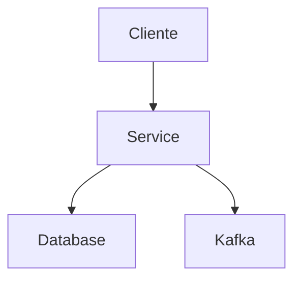

# Technical Specification

Esta é a especificação técnica para a spec detalhada em @.agent-os/specs/2026-03-30-completude-gap-correction/spec.md

## Security Fix: allowed_hosts

### Arquivo Alvo
`services/gateway-intencoes/src/config/settings.py` linha 217-220

### Implementação Atual (Vulnerável)
```python
allowed_hosts: List[str] = Field(
    default=["*"],
    description="Allowed hosts for TrustedHostMiddleware"
)
```

### Implementação Corrigida
```python
allowed_hosts: List[str] = Field(
    default=[],
    description="Allowed hosts for TrustedHostMiddleware (configurado via property)"
)

@property
def allowed_hosts_property(self) -> List[str]:
    """
    Retorna hosts permitidos por ambiente.
    Produção exige hosts específicos (sem wildcard).
    """
    # Override manual tem prioridade
    if self.allowed_hosts:
        return self.allowed_hosts

    # Configuração por ambiente
    if self.environment == "production":
        return [
            "api.neural-hive.com",
            "gateway.neural-hive.com",
            "neural-hive.com",
        ]
    elif self.environment == "staging":
        return [
            "api.staging.neural-hive.com",
            "gateway.staging.neural-hive.com",
        ]
    else:  # development
        return [
            "localhost",
            "127.0.0.1",
            "neural-hive.local",
            "*.neural-hive.local",
        ]
```

### Validação
```python
@validator("allowed_hosts")
def validate_allowed_hosts(cls, v, values):
    env = values.get("environment", "development")
    if env == "production" and ("*" in v or not v):
        raise ValueError(
            "allowed_hosts não pode ser wildcard ou vazio em produção. "
            "Especifique hosts explicitamente."
        )
    return v
```

## README Template

### Estrutura Padronizada
```markdown
# [SERVICE_NAME]

## Descrição
Breve descrição do serviço (2-3 frases).

## Arquitetura


## Funcionalidades
- Feature 1
- Feature 2

## API
### Endpoints
- `GET /api/v1/resource` - Descrição
- `POST /api/v1/resource` - Descrição

## Configuração
| Variável | Default | Descrição |
|----------|---------|-----------|
| VAR_NAME | value | Descrição |

## Integrações
- Kafka: topic_name
- MongoDB: collection_name
- Redis: cache pattern

## Deploy
### Docker
```bash
docker build -t service-name .
docker run -p PORT:PORT service-name
```

### Kubernetes
```bash
helm install service-name ./helm/service-name
```

## Desenvolvimento
```bash
# Instalar dependências
pip install -r requirements.txt

# Rodar localmente
python src/main.py

# Rodar testes
pytest tests/
```

## Troubleshooting
| Problema | Solução |
|----------|---------|
| Erro X | Solução Y |
```

## Helm Chart Structure

### Diretório
```
services/{service-name}/helm/
├── Chart.yaml
├── values.yaml
└── templates/
    ├── deployment.yaml
    ├── service.yaml
    ├── configmap.yaml
    ├── secret.yaml
    ├── hpa.yaml
    ├── pdb.yaml
    ├── networkpolicy.yaml
    └── serviceaccount.yaml
```

### Chart.yaml
```yaml
apiVersion: v2
name: {service-name}
description: Helm chart for Neural Hive {Service}
version: 1.0.0
appVersion: "1.0"
```

### values.yaml
```yaml
replicaCount: 2

image:
  repository: ghcr.io/albinojimy/neural-hive-mind/{service-name}
  pullPolicy: IfNotPresent
  tag: "latest"

service:
  type: ClusterIP
  port: 8000

resources:
  limits:
    cpu: 500m
    memory: 512Mi
  requests:
    cpu: 100m
    memory: 128Mi

autoscaling:
  enabled: true
  minReplicas: 2
  maxReplicas: 10
  targetCPUUtilizationPercentage: 80
  targetMemoryUtilizationPercentage: 80

podDisruptionBudget:
  enabled: true
  minAvailable: 1

networkPolicy:
  enabled: true
```

## External Dependencies

Nenhuma nova dependência externa necessária para esta spec.
