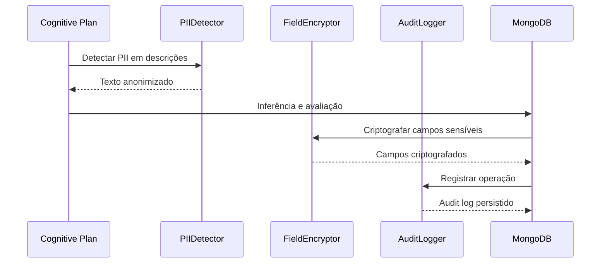
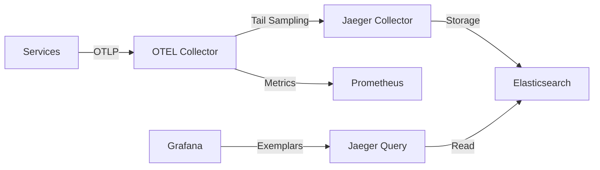
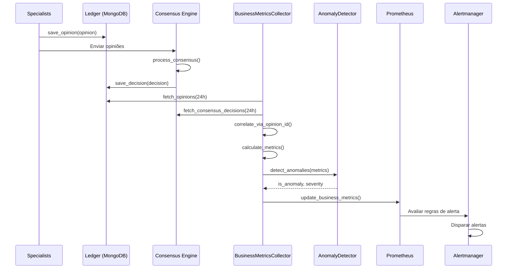

# Neural Hive-Mind - Fase 1: Fundação

[](https://codecov.io/gh/albinoJimy/Neural-Hive-Mind)
[](https://github.com/albinoJimy/Neural-Hive-Mind/actions/workflows/test-and-coverage.yml)
[](https://www.python.org/downloads/)
[](LICENSE)

🚀 **Infraestrutura como Código para a base do organismo digital Neural Hive-Mind**

Este repositório implementa a **Fase 1 - Fundação** do Neural Hive-Mind, estabelecendo a infraestrutura essencial para suportar um sistema de IA distribuído com arquitetura zero-trust, observabilidade nativa e governança auditável.

## 📋 Visão Geral

A Fase 1 provisiona:

- **🏗️ Infraestrutura de Rede**: VPC multi-zona com subnets públicas/privadas
- **⚙️ Cluster Kubernetes**: EKS gerenciado com auto-scaling e alta disponibilidade
- **🐳 Container Registry**: ECR com scanning de vulnerabilidades e assinatura de imagens
- **🕸️ Service Mesh**: Istio com mTLS STRICT obrigatório
- **🚦 Policy Engine**: OPA Gatekeeper para governança policy-as-code
- **📊 Observabilidade**: Bases para métricas, logs e tracing distribuído

## 🚀 Quick Start com CLIs Unificados
O Neural Hive-Mind agora possui **6 CLIs unificados** que consolidam 178+ scripts em interfaces consistentes:

### Build
```bash
# Build local
./scripts/build.sh --target local

# Build e push para ECR
./scripts/build.sh --target ecr --push --version 1.0.8
```

### Deploy
```bash
# Deploy local (Minikube)
./scripts/deploy.sh --env local --phase 1

# Deploy EKS completo
./scripts/deploy.sh --env eks --phase all
```

### Testes
```bash
# Testes E2E
./tests/run-tests.sh --type e2e

# Testes com cobertura
./tests/run-tests.sh --type all --coverage
```

### Validação
```bash
# Validar tudo
./scripts/validate.sh --target all

# Validar specialists
./scripts/validate.sh --target specialists
```

### Segurança
```bash
# Inicializar Vault
./scripts/security.sh vault init

# Deploy SPIRE
./scripts/security.sh spire deploy
```

### Machine Learning
```bash
# Treinar modelos
./ml_pipelines/ml.sh train --all

# Promover modelo
./ml_pipelines/ml.sh promote --model technical-evaluator --version 3
```

### Makefile Simplificado
```bash
make build-local      # Build local
make deploy-eks       # Deploy EKS
make test             # Executar testes
make validate         # Validar deployment
make security-init    # Inicializar segurança
make ml-train         # Treinar modelos
```

📚 **Documentação Completa**: [docs/scripts/](docs/scripts/)
- [Visão Geral da Estrutura](docs/scripts/README.md)
- [Guia de Migração](docs/scripts/MIGRATION_GUIDE.md)
- [Referência de CLIs](docs/scripts/CLI_REFERENCE.md)
- [Exemplos](docs/scripts/EXAMPLES.md)

## 🏗️ Arquitetura

```
┌─────────────────────────────────────────────────────────────┐
│                    NEURAL HIVE-MIND FOUNDATION              │
├─────────────────────────────────────────────────────────────┤
│  🏗️  INFRASTRUCTURE LAYER                                   │
│  ├── Network (VPC, Subnets, NAT, Security Groups)          │
│  ├── Kubernetes Cluster (EKS + Node Groups)                │
│  └── Container Registry (ECR + Vulnerability Scanning)     │
├─────────────────────────────────────────────────────────────┤
│  🔒  SECURITY & GOVERNANCE LAYER                           │
│  ├── Service Mesh (Istio + mTLS STRICT)                    │
│  ├── Policy Engine (OPA Gatekeeper + Constraints)          │
│  └── Network Policies (Zero Trust Segmentation)            │
├─────────────────────────────────────────────────────────────┤
│  📦  APPLICATION NAMESPACES                                 │
│  ├── neural-hive-cognition     (Processamento Cognitivo)   │
│  ├── neural-hive-orchestration (Coordenação)               │
│  ├── neural-hive-execution     (Agentes e Workers)         │
│  └── neural-hive-observability (Métricas e Logs)           │
└─────────────────────────────────────────────────────────────┘
```

## 📁 Project Structure
```
Neural-Hive-Mind/
├── scripts/                    # 🆕 CLIs unificados e módulos
│   ├── build.sh               # CLI de build (consolida 15 scripts)
│   ├── deploy.sh              # CLI de deploy (consolida 38 scripts)
│   ├── validate.sh            # CLI de validação (consolida 75 scripts)
│   ├── security.sh            # CLI de segurança (consolida 23 scripts)
│   ├── lib/                   # 🆕 Bibliotecas compartilhadas
│   │   ├── common.sh          # Logging, validações, retry
│   │   ├── docker.sh          # Operações Docker
│   │   ├── k8s.sh             # Operações Kubernetes
│   │   └── aws.sh             # Operações AWS
│   ├── build/                 # Módulos de build
│   ├── deploy/                # Módulos de deploy
│   ├── validation/            # Módulos de validação
│   └── security/              # Módulos de segurança
├── tests/                     # 🆕 Testes organizados
│   ├── run-tests.sh           # CLI de testes (consolida 45 scripts)
│   ├── unit/                  # Testes unitários
│   ├── integration/           # Testes de integração
│   └── e2e/                   # Testes end-to-end
├── ml_pipelines/              # 🆕 ML operations
│   ├── ml.sh                  # CLI de ML (consolida 25 scripts)
│   ├── training/              # Scripts de treinamento
│   └── monitoring/            # Monitoramento de modelos
├── services/                  # Microserviços
├── k8s/                       # Manifestos Kubernetes
├── helm-charts/               # Helm charts
├── infrastructure/            # Terraform
└── docs/                      # Documentação
    └── scripts/               # 🆕 Documentação de scripts
        ├── README.md          # Visão geral
        ├── MIGRATION_GUIDE.md # Guia de migração
        ├── CLI_REFERENCE.md   # Referência de CLIs
        └── EXAMPLES.md        # Exemplos práticos
```
> **Nota**: A estrutura de scripts foi reorganizada em 11 fases, consolidando 178 scripts em 6 CLIs unificados. Veja [docs/scripts/MIGRATION_GUIDE.md](docs/scripts/MIGRATION_GUIDE.md) para migração.

## 🤖 Machine Learning

O Neural Hive Mind utiliza modelos ML para avaliar planos cognitivos:

- **5 Especialistas**: Technical, Business, Behavior, Evolution, Architecture
- **Retreinamento Automático**: Semanal via CronJob Kubernetes
- **MLflow Integration**: Model Registry com stages (Production/Staging)
- **Feedback Loop**: Incorpora opiniões humanas do MongoDB

📚 **Documentação**: [Guia de Modelos de Especialistas](docs/ml/SPECIALIST_MODELS_GUIDE.md)

## 🤖 Modelos Preditivos

O Neural Hive-Mind utiliza Machine Learning para otimizar scheduling e detectar anomalias:

- **SchedulingPredictor** - Prediz duração e recursos de tickets (XGBoost)
- **LoadPredictor** - Prevê carga futura do sistema (Prophet)
- **AnomalyDetector** - Detecta tickets anômalos (Isolation Forest)

### Treinamento

Modelos são treinados automaticamente toda semana (domingos 2 AM UTC) via CronJob Kubernetes.

Para treinar manualmente:

```bash
kubectl create job --from=cronjob/predictive-models-training \
  manual-training-$(date +%Y%m%d-%H%M%S) \
  -n neural-hive-ml
```

### Validação

```bash
# Validar modelos registrados no MLflow
./ml_pipelines/training/validate_model_promotion.sh

# Validar modelos carregados no Orchestrator
./scripts/validation/validate_orchestrator_ml.sh

# Executar testes E2E
./scripts/testing/run_ml_e2e_tests.sh
```

Veja [Guia de Modelos Preditivos](docs/ml/PREDICTIVE_MODELS_GUIDE.md) para detalhes.

## 🚀 Quick Start - Desenvolvimento Local

Inicie o Neural Hive-Mind em sua máquina usando Minikube:

### Pré-requisitos

- Docker (>= 24.0.0)
- Minikube (>= 1.32.0)
- kubectl (>= 1.28.0)
- Helm (>= 3.13.0)
- 4 CPU cores, 8GB RAM, 20GB disk space

### Build Paralelo de Imagens Docker

Para fazer build local de todas as imagens Docker com paralelização:

```bash
# Build padrão (4 jobs paralelos, versão 1.0.7)
./scripts/build.sh --target local --parallel 4

# Build com mais paralelização (8 jobs)
./scripts/build.sh --target local --parallel 8

# Build de serviços específicos
./scripts/build.sh --target local --services "gateway-intencoes,consensus-engine"

# Build com versão customizada
./scripts/build.sh --target local --version 1.0.8

# Build sem cache (força rebuild completo)
./scripts/build.sh --target local --no-cache
```

**Características:**
- ✅ Build paralelo de 9 serviços da Fase 1 (padrão: 4 simultâneos)
- ✅ Tags duplas: `latest` + versão específica (ex: `1.0.7`)
- ✅ Logs coloridos e barra de progresso
- ✅ Logs individuais em `logs/build-<service>.log`
- ✅ Resumo final com estatísticas

**Requisitos:**
- Docker instalado e rodando
- Mínimo 10GB de espaço em disco
- 4GB+ RAM recomendado para builds paralelos

### Push de Imagens para ECR

Após buildar as imagens localmente, faça push para ECR:

```bash
# Push padrão (4 jobs paralelos)
./scripts/build.sh --target ecr --push

# Push com mais paralelização
./scripts/build.sh --target ecr --push --parallel 8

# Push de serviços específicos
./scripts/build.sh --target ecr --push --services "gateway-intencoes,consensus-engine"

# Push com versão customizada
./scripts/build.sh --target ecr --push --version 1.0.8

# Override de ambiente e região
./scripts/build.sh --target ecr --push --env staging --region us-west-2
```

**Pré-requisitos:**
- AWS CLI configurado (`aws configure`)
- Credenciais AWS válidas
- Variáveis de ambiente em `~/.neural-hive-env` (ENV, AWS_REGION)
- Imagens buildadas localmente (executar `./scripts/build.sh --target local` ou `make build-local` primeiro)

**Features:**
- ✅ Push paralelo (4 jobs simultâneos por padrão)
- ✅ Retry automático (3 tentativas com backoff exponencial)
- ✅ Criação automática de repositórios ECR
- ✅ Validação de imagens locais antes do push
- ✅ Push de ambas as tags (`latest` e versão específica)
- ✅ Logs detalhados em `logs/push-*.log`
- ✅ Barra de progresso e estatísticas

**Verificar imagens no ECR:**
```bash
aws ecr list-images --repository-name neural-hive-dev/gateway-intencoes --region us-east-1
```

### Build e Deploy Automatizado para EKS

Para build local, push para ECR e atualização de manifestos em um único fluxo usando os CLIs:

```bash
# Build + push para ECR
./scripts/build.sh --target ecr --push --version 1.0.8 --parallel 8

# Deploy completo em EKS
./scripts/deploy.sh --env eks --phase all --version 1.0.8
```

Use o deploy CLI para aplicar manifests com versão/tag corretas; tags vêm do `build.sh --version` e são propagadas no deploy via `--version`.
- `--services <list>`: Lista de serviços separados por vírgula
- `--dry-run`: Preview das mudanças sem aplicar
- `--no-backup`: Não criar backup antes de modificar
- `--help`: Exibir ajuda completa

**Fluxo completo usando CLIs (equivalente aos scripts legados):**
```bash
# Equiv. a build-local-parallel.sh
./scripts/build.sh --target local --parallel 4 --version 1.0.7

# Equiv. a push-to-ecr.sh
./scripts/build.sh --target ecr --push --version 1.0.7

# Equiv. a update-manifests-ecr.sh + deploy
./scripts/deploy.sh --env eks --phase all --version 1.0.7
```

Ver também: `QUICK_START_EKS.md` para guia completo de deployment no EKS (atualizado para os CLIs).

## Gerenciamento de Dependências

### Estrutura de Requirements

Cada serviço possui arquivos de dependências:

- **requirements.txt**: Dependências de produção (instaladas na imagem Docker). **FONTE DE VERDADE**.
- **requirements-dev.txt**: Dependências de desenvolvimento e testes (não incluídas em produção).
- **pyproject.toml** (opcional): Metadados do projeto e compatibilidade com Poetry. Deve ser mantido sincronizado com requirements.txt.

**Importante**: Em caso de conflito entre `pyproject.toml` e `requirements.txt`, o `requirements.txt` prevalece pois é usado nos builds Docker de produção.

### Arquivo Central de Versões

O arquivo `versions.txt` na raiz contém versões canônicas de dependências compartilhadas. Consulte `docs/DEPENDENCY_MANAGEMENT.md` para detalhes.

### Consolidação de Versões

O projeto mantém versões consolidadas de dependências críticas para evitar conflitos:

| Dependência | Versão Consolidada | Justificativa |
|-------------|-------------------|---------------|
| grpcio / grpcio-tools | >= 1.75.1 | Compatibilidade com protobuf 5.x |
| protobuf | >= 5.27.0 | Suporte a runtime_version (protoc 6.x) |
| fastapi | >= 0.104.1 | Versão estável com correções de segurança |
| pydantic | >= 2.5.2 | Validação de dados robusta |
| aiokafka | >= 0.10.0 | Melhorias de performance |

Ver [docs/DEPENDENCY_AUDIT.md](docs/DEPENDENCY_AUDIT.md) para matriz completa de versões.

### Auditoria de Dependências

Auditoria manual:

```bash
# Auditoria completa com verificação de segurança
./scripts/audit-dependencies.sh --check-security

# Escanear imports não utilizados
python scripts/scan-unused-imports.py --output reports/unused-imports.json

# Validar mudanças antes de commit
./scripts/validate-dependency-changes.sh
```

Auditoria automática via GitHub Actions:
- Execução semanal (segundas-feiras).
- Execução em PRs que modificam `requirements*.txt`.
- Relatórios disponíveis como artifacts do workflow **Dependency Audit**.

### Adicionando Novas Dependências

1. **Produção**: Adicionar em `requirements.txt` com versão mínima (`>=X.Y.Z`).
2. **Desenvolvimento**: Adicionar em `requirements-dev.txt`.
3. **Validação**: Executar `./scripts/validate-dependency-changes.sh`.
4. **Documentação**: Dependências pesadas (>50MB) devem ser descritas em `docs/DEPENDENCY_AUDIT.md`.

### Dependências Críticas

Consulte `docs/DEPENDENCY_AUDIT.md` (seção *Dependências Críticas e Justificativas*) para entender o motivo de cada pacote pesado permanecer na base.

### Setup Automatizado (Recomendado)

```bash
# Clone o repositório
git clone <repository-url>
cd Neural-Hive-Mind

# Passo 1: Build das imagens Docker (recomendado antes do deploy)
# Equivalente ao script legado build-local-parallel.sh via CLI unificado
./scripts/build.sh --target local --parallel 4

# Passo 2: Execute o setup completo do cluster
make minikube-setup

# Passo 3: Valide a instalação
make minikube-validate
```

O script de setup irá:
- ✅ Iniciar Minikube com recursos apropriados
- ✅ Habilitar addons necessários (ingress, metrics-server, storage-provisioner)
- ✅ Criar 9 namespaces para diferentes camadas do sistema
- ✅ Configurar RBAC e network policies
- ✅ Aplicar resource quotas e limits

### Setup Manual

Para instruções passo-a-passo, consulte o [Guia de Setup do Minikube](docs/MINIKUBE_SETUP_GUIDE.md).

### Verificar Instalação

```bash
# Verificar status do cluster
make minikube-status

# Visualizar namespaces
kubectl get namespaces | grep neural-hive

# Abrir dashboard do Kubernetes
make minikube-dashboard
```

### Próximos Passos

Após completar a Fase 1 (Bootstrap), prossiga para:

**Fase 2 - Deploy da Base de Infraestrutura:**
Deploy automatizado de componentes essenciais:
- ☸️ Kafka (Strimzi) - Sistema de mensageria distribuído
- 💾 Redis - Cache em memória
- 📄 MongoDB - Banco de dados de documentos
- 🕸️ Neo4j - Banco de dados de grafos
- 📊 ClickHouse - Banco de dados analítico
- 🔐 Keycloak - Autenticação e autorização

```bash
# Deploy automatizado de todos os componentes
./scripts/deploy/deploy-infrastructure-local.sh

# Validar instalação
./scripts/validation/validate-infrastructure-local.sh
```

Veja o [Guia de Deploy Local](DEPLOYMENT_LOCAL.md#️-fase-2-deploy-da-base-de-infraestrutura) para instruções detalhadas da Fase 2

---

## 🚀 Quick Start - AWS Production (EKS)

Para deploy em produção na AWS usando Amazon EKS:

### Pré-requisitos

```bash
# Ferramentas necessárias
terraform >= 1.5
helm >= 3.13
kubectl >= 1.28
aws-cli >= 2.0
docker >= 24.0

# Credenciais AWS configuradas
aws configure
aws sts get-caller-identity
```

### Deploy Rápido (Automatizado) ⚡

```bash
# 0. (Opcional) Build local das imagens antes do push para ECR (equivalente ao build-local-parallel.sh)
./scripts/build.sh --target local --parallel 4

# 1. Configure ambiente e senhas
export ENV=dev  # ou staging, prod
export AWS_REGION=us-east-1
export TF_VAR_mongodb_root_password="<senha-forte>"
export TF_VAR_neo4j_password="<senha-forte>"
export TF_VAR_clickhouse_admin_password="<senha-forte>"
export TF_VAR_clickhouse_readonly_password="<senha-forte>"
export TF_VAR_clickhouse_writer_password="<senha-forte>"

# 2. Deploy completo automatizado (20-30 min) - equivalente ao deploy-eks-complete.sh
./scripts/build.sh --target ecr --push --version ${ENV_VERSION:-latest}
./scripts/deploy.sh --env ${ENV:-dev} --phase all --version ${ENV_VERSION:-latest}

# 3. Validar deployment
kubectl get pods --all-namespaces
./tests/run-tests.sh --type e2e --phase 1
```

### Documentação Completa

- **[Quick Start EKS](QUICK_START_EKS.md)** - Deploy em 30 minutos
- **[Guia Completo EKS](DEPLOYMENT_EKS_GUIDE.md)** - Guia detalhado com troubleshooting
- **[Checklist EKS](EKS_DEPLOYMENT_CHECKLIST.md)** - Checklist completo de deployment
- **[Resource Tuning Guide](docs/RESOURCE_TUNING_GUIDE.md)** - Rightsizing, probes e topology spread 2.0 para especialistas/core

### Custos Estimados AWS

| Ambiente | Custo/mês | Descrição |
|----------|-----------|-----------|
| **Dev** | ~$267 | 3x t3.medium, recursos mínimos |
| **Staging** | ~$600 | 6x t3.large, HA moderado |
| **Prod** | ~$1,127 | 6x m5.large, HA completo |

*Custos podem ser reduzidos em até 70% usando Spot Instances para dev/staging*

---

## 📋 Fases de Deploy

O deploy do Neural Hive-Mind está organizado em fases incrementais:

### Fase 1: Bootstrap (✅ Você está aqui)
- Inicializar cluster Minikube
- Configurar namespaces, RBAC, network policies
- Aplicar resource quotas e limits
- **Guia**: [Guia de Setup do Minikube](docs/MINIKUBE_SETUP_GUIDE.md)

### Fase 2: Infraestrutura
- Deploy Kafka, Redis, MongoDB, Neo4j, ClickHouse
- Configurar Keycloak para autenticação
- **Guia**: [Guia de Deploy Local](DEPLOYMENT_LOCAL.md)

### Fase 3: Serviços Core
- Deploy Gateway, Semantic Translation Engine
- Deploy 5 Neural Specialists
- Deploy Consensus Engine e Memory Layer

### Fase 4: Orquestração & Execução
- Deploy Orchestrator Dynamic e Service Registry
- Deploy Execution Ticket Service e Worker Agents
- Deploy agentes de coordenação (Queen, Scout, Analyst, Optimizer, Guard)

### Fase 5: Funcionalidades Avançadas
- Deploy Code Forge, SLA Management, Self-Healing Engine
- Deploy MCP Tool Catalog
- Executar testes end-to-end

---

## 📁 Estrutura do Projeto

```
Neural-Hive-Mind/
├── infrastructure/terraform/         # Módulos Terraform IaC
│   └── modules/
│       ├── network/                 # VPC e rede
│       ├── k8s-cluster/             # Cluster EKS
│       └── container-registry/      # ECR registry
├── helm-charts/                     # Charts Helm customizados
│   ├── istio-base/                  # Service mesh
│   └── opa-gatekeeper/              # Policy engine
├── policies/                        # Políticas OPA/Rego
│   ├── rego/                        # Políticas em linguagem Rego
│   ├── constraint-templates/        # Templates Gatekeeper
│   └── constraints/                 # Constraints ativos
├── k8s/bootstrap/                   # Manifests iniciais
│   ├── namespaces.yaml             # Namespaces e quotas
│   ├── rbac.yaml                   # Service accounts e roles
│   └── network-policies.yaml       # Políticas de rede
├── scripts/                         # Scripts de automação
│   ├── deploy/                     # Scripts de deploy
│   └── validation/                 # Scripts de validação
├── environments/                    # Configurações por ambiente
│   ├── dev/                        # Desenvolvimento
│   ├── staging/                    # Homologação
│   └── prod/                       # Produção
├── docs/adr/                       # Architecture Decision Records
└── .github/workflows/              # Pipelines CI/CD
```

## ⚙️ Componentes Principais

### 🏗️ Infraestrutura (Terraform)

- **Network**: VPC multi-zona, NAT Gateways, VPC Endpoints
- **K8s Cluster**: EKS com node groups auto-scaling
- **Registry**: ECR com lifecycle policies e scanning

### 🔒 Segurança (Istio + OPA)

- **mTLS**: Certificados SPIFFE automáticos
- **Zero Trust**: Network policies granulares
- **Policies**: Validation de imagens, resources, compliance

### 📦 Aplicação (Namespaces)

- **Cognition**: Processamento e interpretação
- **Orchestration**: Coordenação e workflow
- **Execution**: Agentes e workers
- **Observability**: Métricas, logs e tracing

### 🤖 Estratégia de Modelos ML

**Modelos Fora da Imagem Docker:**
- Modelos ML não são empacotados nas imagens Docker
- Init containers baixam modelos durante inicialização do pod
- Volumes persistentes (PVC) armazenam modelos compartilhados
- Lazy loading carrega modelos sob demanda em runtime

**Benefícios:**
- **60% de redução** no tamanho das imagens Docker
- **86% de redução** no tempo de startup (lazy loading)
- **43% de redução** no consumo de memória base
- Cache compartilhado entre pods (economia de armazenamento)

**Modelos Utilizados:**
- Whisper ASR: `tiny` (39MB) com fallback para `base` e `small`
- spaCy NLU: `pt_core_news_sm`, `en_core_web_sm`, `es_core_news_sm` (~15MB cada)

Ver [Guia de Otimização de Dependências](docs/DEPENDENCY_OPTIMIZATION.md) para detalhes completos.

## 🧠 Motor de Tradução Semântica (Fase 1)

O **Motor de Tradução Semântica** implementa o **Fluxo B (Geração de Planos)** do Neural Hive-Mind, convertendo Intent Envelopes em Cognitive Plans executáveis com DAGs de tarefas, avaliação de risco e explicabilidade.

### Componentes Implementados

- ✅ **Semantic Parser**: Parsing semântico com enriquecimento via Knowledge Graph (Neo4j)
- ✅ **DAG Generator**: Geração de grafos acíclicos de tarefas com validação topológica
- ✅ **Risk Scorer**: Avaliação de risco baseada em heurísticas (prioridade, segurança, complexidade)
- ✅ **Explainability Generator**: Geração de tokens e narrativas de explicabilidade
- ✅ **Cognitive Ledger**: Registro imutável de planos no MongoDB com hash SHA-256
- ✅ **Kafka Consumer/Producer**: Consumo de intents e publicação de planos com exactly-once semantics

### Fluxo de Processamento (B1-B6)

```
Intent Envelope (Kafka) → B1:Receber → B2:Enriquecer (Neo4j) →
B3:DAG → B4:Risk Score → B5:Ledger → B6:Publicar (plans.ready)
```

## 🔄 Integração Completa do Fluxo C (Fase 2)

A **Integração do Fluxo C** conecta todos os componentes da Fase 2 em um fluxo end-to-end que processa Consolidated Decisions desde a intenção inicial até o deploy final, com telemetria correlacionada completa.

### Componentes Integrados

- ✅ **Biblioteca neural_hive_integration v1.0.0**: 7 clients unificados para todos os serviços da Fase 2
- ✅ **FlowCOrchestrator**: Coordenação completa do fluxo C1-C6 (Validação → Tickets → Workers → Deploy → Telemetria)
- ✅ **FlowCConsumer**: Consumer Kafka integrado no Orchestrator Dynamic para tópico `plans.consensus`
- ✅ **Telemetry Publisher**: Correlação de eventos com OpenTelemetry (trace_id, span_id, correlation_id)
- ✅ **Tópico telemetry.flow-c**: Kafka topic dedicado para eventos de integração

### Fluxo Completo C1-C6

```
Consolidated Decision → C1:Validar → C2:Gerar Tickets → C3:Descobrir Workers →
C4:Atribuir Tarefas → C5:Monitorar Execução → C6:Publicar Telemetria
```

### Deploy Rápido

```bash
# Deploy da integração Fase 2
./scripts/deploy/deploy-phase2-integration.sh

# Validar componentes
./scripts/validation/validate-phase2-integration.sh

# Teste end-to-end completo
./tests/phase2-flow-c-integration-test.sh
```

### Métricas de Sucesso

| Métrica | SLO | Atual |
|---------|-----|-------|
| Latência End-to-End (P95) | < 4 horas | - |
| Taxa de Sucesso | > 99% | - |
| Aprovação Automática | > 80% | - |
| Disponibilidade Workers | > 95% | - |

### Documentação Completa

📖 **[Guia de Integração do Fluxo C](docs/PHASE2_FLOW_C_INTEGRATION.md)**
- Arquitetura detalhada com diagramas Mermaid
- Exemplos de código para todos os clients
- Observabilidade (métricas Prometheus, dashboard Grafana, tracing Jaeger)
- Troubleshooting e runbooks
- SLAs e error budgets

🔒 **[Guia da Camada de Compliance](docs/COMPLIANCE_LAYER_GUIDE.md)**
- Detecção e anonimização de PII com Microsoft Presidio
- Criptografia de campos sensíveis (Fernet AES-128)
- Audit logging e políticas de retenção
- Conformidade com LGPD e GDPR
- Métricas Prometheus e troubleshooting

---

## 🧠 Motor de Tradução Semântica (Fase 1)

O **Motor de Tradução Semântica** implementa o **Fluxo B (Geração de Planos)** do Neural Hive-Mind, convertendo Intent Envelopes em Cognitive Plans executáveis com DAGs de tarefas, avaliação de risco e explicabilidade.

### Componentes Implementados

- ✅ **Semantic Parser**: Parsing semântico com enriquecimento via Knowledge Graph (Neo4j)
- ✅ **DAG Generator**: Geração de grafos acíclicos de tarefas com validação topológica
- ✅ **Risk Scorer**: Avaliação de risco baseada em heurísticas (prioridade, segurança, complexidade)
- ✅ **Explainability Generator**: Geração de tokens e narrativas de explicabilidade
- ✅ **Cognitive Ledger**: Registro imutável de planos no MongoDB com hash SHA-256
- ✅ **Kafka Consumer/Producer**: Consumo de intents e publicação de planos com exactly-once semantics

### Fluxo de Processamento (B1-B6)

```
Intent Envelope (Kafka) → B1:Receber → B2:Enriquecer (Neo4j) →
B3:DAG → B4:Risk Score → B5:Ledger → B6:Publicar (plans.ready)
```

1. **B1: Receber**: Consumir Intent Envelope do Kafka com validação de assinatura
2. **B2: Enriquecer**: Consultar Knowledge Graph (Neo4j) para contexto histórico e ontologias
3. **B3: Decompor**: Gerar DAG de tarefas com validação de aciclicidade
4. **B4: Avaliar**: Calcular risk score (prioridade=0.3 + segurança=0.4 + complexidade=0.3)
5. **B5: Versionar**: Registrar plano no ledger imutável (MongoDB)
6. **B6: Publicar**: Enviar Cognitive Plan para tópico `plans.ready`

### Deploy

```bash
# Deploy completo
export ENV=dev
export NEO4J_PASSWORD=secret
export MONGODB_PASSWORD=secret
./scripts/deploy/deploy-semantic-translation-engine.sh

# Validar deployment
./scripts/validation/validate-semantic-translation-engine.sh
```

### Acesso e Monitoramento

```bash
# Logs em tempo real
kubectl logs -f -n semantic-translation-engine \
  -l app.kubernetes.io/name=semantic-translation-engine

# Métricas Prometheus
kubectl port-forward -n semantic-translation-engine \
  svc/semantic-translation-engine 8080:8080
curl http://localhost:8080/metrics

# Verificar consumer lag
kafka-consumer-groups.sh --bootstrap-server <kafka> \
  --group semantic-translation-engine --describe
```

### Dashboards e Observabilidade

- **Grafana Dashboard**: Latência B1→B6, DAG complexity, risk distribution
- **Jaeger Traces**: Correlação intent_id → plan_id → trace_id
- **Prometheus Metrics**:
  - `neural_hive_geracao_duration_seconds` - Latência de geração (SLO <400ms)
  - `neural_hive_dag_complexity` - Distribuição de complexidade
  - `neural_hive_risk_score` - Scores de risco por domínio
  - `neural_hive_kg_query_duration_seconds` - Latência Neo4j (SLO <50ms)

### Documentação

- [Operações do Motor](docs/operations/semantic-translation-engine-operations.md)
- [Documento 06 - Fluxo B](documento-06-fluxos-processos-neural-hive-mind.md)
- [Schema Cognitive Plan](schemas/cognitive-plan/cognitive-plan.avsc)

## 🔧 Configuração por Ambiente

### Development
```bash
# Recursos mínimos para desenvolvimento
cluster_name = "neural-hive-dev"
node_instance_types = ["t3.medium", "t3.large"]
min_nodes_per_zone = 1
enable_vulnerability_scanning = true
block_critical_vulnerabilities = false
```

### Production
```bash
# Configuração otimizada para produção
cluster_name = "neural-hive-prod"
node_instance_types = ["m5.large", "m5.xlarge", "c5.large"]
min_nodes_per_zone = 2
enable_vulnerability_scanning = true
block_critical_vulnerabilities = true
```

## 🧪 Validação e Testes

### Validação de Infraestrutura
```bash
# Terraform validation
./scripts/validation/validate-terraform.sh

# Cluster health check
./scripts/validation/validate-cluster-health.sh

# mTLS connectivity test
./scripts/validation/test-mtls-connectivity.sh

# Autoscaler test
./scripts/validation/test-autoscaler.sh
```

### E2E Validation Suite

The project includes a comprehensive E2E validation suite for validating the complete flow from Gateway to Specialists:

#### Quick E2E Test (Single Execution)
```bash
# Test basic E2E flow with 5 scenarios
python3 test-fluxo-completo-e2e.py
```

#### Comprehensive E2E Validation (10 Iterations)
```bash
# Run complete validation suite with 10 consecutive iterations
./scripts/validation/run-e2e-validation-suite.sh

# Run with custom number of iterations
./scripts/validation/run-e2e-validation-suite.sh --iterations 20

# Run only tests (without log monitoring)
./scripts/validation/run-e2e-validation-suite.sh --tests-only

# Run only log monitoring (without tests)
./scripts/validation/run-e2e-validation-suite.sh --monitoring-only --duration 300
```

#### Validation Components

The E2E validation suite consists of:

1. **Extended E2E Test** (`test-e2e-validation-complete.py`):
   - 10 consecutive iterations
   - 5 scenarios per iteration (one per specialist)
   - Total: 50 tests executed
   - Specific timestamp validation in each response
   - Detailed metrics collection (latency, success rate)

2. **Real-time Log Monitoring** (`monitor-e2e-logs.sh`):
   - Monitors consensus-engine + 5 specialists
   - Filters: TypeError, evaluated_at, timestamp, EvaluatePlan
   - Automatic alerts for TypeErrors
   - Live statistics display

3. **Integrated Orchestration** (`run-e2e-validation-suite.sh`):
   - Simultaneous execution of tests + monitoring
   - Synchronized start/end
   - Result correlation

4. **Final Report Generation** (`generate-e2e-validation-report.py`):
   - Consolidated analysis of results
   - Aggregated statistics
   - Evidence-based recommendations

#### Validation Criteria

The validation suite checks:
- ✓ Success rate >= 95%
- ✓ No TypeErrors detected
- ✓ All timestamps valid (ISO 8601 format)
- ✓ Chronological consistency
- ✓ Performance within expected range (<1s average latency)
- ✓ 10 consecutive iterations without critical failures

#### Results

Validation results are saved to `/tmp/e2e-validation-suite-{timestamp}/` including:
- **Test Results:** JSON metrics, execution logs
- **Captured Logs:** Kubernetes logs from all components
- **Final Report:** Comprehensive Markdown report with analysis and recommendations

#### Interpreting Results

**✅ VALIDATION PASSED:**
- Success rate >= 95%
- No TypeErrors detected
- All timestamps valid
- System is stable and ready for production

**⚠️ VALIDATION PASSED WITH WARNINGS:**
- Success rate >= 90%
- No TypeErrors detected
- Some non-critical failures
- Review failures before production deployment

**❌ VALIDATION FAILED:**
- Success rate < 90% OR TypeErrors detected
- Critical issues detected
- Do NOT deploy to production
- Review detailed logs and fix issues

#### Related Documentation

- [ANALISE_DEBUG_GRPC_TYPEERROR.md](ANALISE_DEBUG_GRPC_TYPEERROR.md) - TypeError analysis and resolution
- [PROTOBUF_VERSION_ANALYSIS.md](PROTOBUF_VERSION_ANALYSIS.md) - Protobuf version compatibility analysis
- [VALIDATION_CHECKLIST_PROTOBUF_FIX.md](VALIDATION_CHECKLIST_PROTOBUF_FIX.md) - Post-deployment validation checklist

### CI/CD Pipelines

- **Validation Pipeline**: Terraform, Helm, OPA policies
- **Deployment Pipeline**: GitOps com aprovações automáticas
- **Integration Tests**: Validação em cluster Kind

## 📊 Observabilidade

### Métricas Coletadas
- **Cluster**: Nodes, pods, resources
- **Service Mesh**: mTLS, latência, throughput
- **Policies**: Violações, compliance
- **Applications**: Métricas customizadas

### Dashboards
- **Infrastructure**: Utilização de recursos
- **Security**: Status mTLS, violações
- **Performance**: Latência, errors, throughput

## 🔄 Disaster Recovery

Sistema de backup e recuperação automática para garantir continuidade de operação dos especialistas neurais.

### Funcionalidades

- ✅ **Backups Automáticos**: CronJob diário às 2h UTC de todos os componentes críticos
- ✅ **Múltiplos Storage**: Suporte para S3, Google Cloud Storage e filesystem local
- ✅ **Componentes Backed Up**: Modelos MLflow, Ledger cognitivo, Feature Store, Cache, Métricas
- ✅ **Retenção Configurável**: 90 dias por padrão com cleanup automático
- ✅ **Testes de Recovery**: Validação semanal automática de backups
- ✅ **Restore Granular**: Restauração completa ou por componente individual
- ✅ **Multi-Tenancy**: Backups isolados por tenant
- ✅ **Observabilidade**: Métricas, alertas e dashboard dedicados

### Quick Start

```bash
# Configurar variáveis de ambiente (S3 exemplo)
export ENABLE_DISASTER_RECOVERY=true
export BACKUP_STORAGE_PROVIDER=s3
export BACKUP_S3_BUCKET=neural-hive-backups
export BACKUP_S3_REGION=us-west-2
export BACKUP_RETENTION_DAYS=90

# Backup manual de um especialista
make dr-backup SPECIALIST_TYPE=business

# Listar backups disponíveis
make dr-list-backups SPECIALIST_TYPE=business

# Restaurar último backup
make dr-restore SPECIALIST_TYPE=business

# Testar recovery (não afeta produção)
make dr-test-recovery SPECIALIST_TYPE=business
```

### Targets Make Disponíveis

```bash
make dr-backup              # Backup manual de todos os especialistas
make dr-restore             # Restore interativo
make dr-list-backups        # Lista backups disponíveis
make dr-test-recovery       # Testa restore sem afetar produção
make deploy-dr-cronjobs     # Deploy dos CronJobs de backup e teste
```

### Variáveis de Ambiente

**Essenciais:**
- `ENABLE_DISASTER_RECOVERY`: Habilitar DR (default: false)
- `BACKUP_STORAGE_PROVIDER`: s3, gcs ou local
- `BACKUP_S3_BUCKET`: Bucket S3 (se provider=s3)
- `BACKUP_GCS_BUCKET`: Bucket GCS (se provider=gcs)
- `BACKUP_GCS_PROJECT`: Projeto GCP (se provider=gcs)

**Opcionais:**
- `BACKUP_RETENTION_DAYS`: Dias de retenção (default: 90)
- `BACKUP_SCHEDULE_CRON`: Schedule de backup (default: "0 2 * * *")
- `RECOVERY_TEST_SCHEDULE_CRON`: Schedule de teste (default: "0 4 * * 0")
- `BACKUP_INCLUDE_CACHE`: Incluir cache Redis (default: false)
- `BACKUP_COMPRESSION_LEVEL`: Nível gzip 1-9 (default: 6)

### Monitoramento

**Dashboard Grafana:**
- Status de último backup e teste de recovery
- Trends de tamanho e duração de backups
- Breakdown por componente (model, ledger, feature store, cache, metrics)
- Erros de storage (upload/download)
- Alertas ativos de DR

**Alertas Configurados:**
- 🔴 `BackupFailed`: Backup falhou
- 🟡 `BackupNotRunRecently`: >25h sem backup
- 🔴 `RecoveryTestFailed`: Teste de recovery falhou
- 🟡 `StorageUploadErrors`: Erros persistentes de upload
- 🟡 `BackupDurationAnomaly`: Duração anormal de backup
- 🟡 `BackupSizeAnomaly`: Tamanho anormal de backup

### Documentação Operacional

- 📖 [Runbook de Disaster Recovery](docs/operations/DISASTER_RECOVERY_RUNBOOK.md) - Procedimentos operacionais completos
- 🚨 [Playbook de Incidentes](docs/operations/DISASTER_RECOVERY_PLAYBOOK.md) - Guia step-by-step para emergências
- 📊 [Dashboard Grafana](monitoring/dashboards/disaster-recovery-dashboard.json) - Dashboard de monitoramento
- 🔔 [Regras de Alerta](monitoring/alerts/disaster-recovery-alerts.yaml) - Alertas Prometheus

### Arquitetura de Backup

Cada backup contém:
- **model/**: Artifacts e metadata do modelo MLflow
- **ledger/**: Dump BSON do ledger cognitivo (MongoDB)
- **feature_store/**: Features extraídas em JSON
- **cache/**: Snapshot do cache Redis (opcional)
- **metrics/**: Resumo de métricas Prometheus
- **config/**: Configuração do especialista
- **manifest.json**: Metadados do backup (timestamp, versão, checksums)

### Restore

**Restore Completo:**
```bash
# Última versão
python -m neural_hive_specialists.scripts.run_disaster_recovery_restore \
  --latest --specialist-type business

# Versão específica
python -m neural_hive_specialists.scripts.run_disaster_recovery_restore \
  --backup-id specialist-business-backup-20250211-143000 \
  --specialist-type business
```

**Restore Parcial (por componente):**
```bash
# Apenas modelo MLflow
python -m neural_hive_specialists.scripts.run_disaster_recovery_restore \
  --latest --specialist-type business --components model

# Múltiplos componentes
python -m neural_hive_specialists.scripts.run_disaster_recovery_restore \
  --latest --specialist-type business --components model,ledger,feature_store
```

### RPO e RTO

- **RPO (Recovery Point Objective)**: 24 horas (backups diários)
- **RTO (Recovery Time Objective)**:
  - Restore completo: 30-60 minutos
  - Restore parcial (modelo): 15-30 minutos
  - Rollback emergencial: 10-15 minutos

## Especialistas Neurais (Fase 1)

Os **5 Especialistas Neurais** implementam avaliação multi-domínio de planos cognitivos com consenso auditável.

### Componentes
- ✅ **Business Specialist**: análise de workflows, KPIs, custos
- ✅ **Technical Specialist**: qualidade de código, performance, segurança
- ✅ **Behavior Specialist**: jornadas de usuário, análise de sentimento
- ✅ **Evolution Specialist**: oportunidades de melhoria, hipóteses
- ✅ **Architecture Specialist**: dependências, escalabilidade, padrões

### Características
- Contrato gRPC padronizado
- Registro dinâmico e health checks
- Integração com MLflow para versionamento de modelos
- Explicabilidade estruturada (SHAP/LIME)
- Persistência no ledger cognitivo (MongoDB)
- Observabilidade completa (OpenTelemetry)

### Deploy
```bash
# Deploy completo dos especialistas
export ENV=dev
export MLFLOW_TRACKING_URI=http://mlflow:5000
export MONGODB_URI=mongodb://mongodb:27017
export NEO4J_PASSWORD=secret
./scripts/deploy/deploy-specialists.sh

# Validar deployment
./scripts/validation/validate-specialists.sh
```

### Acesso
```bash
# Logs de um especialista
kubectl logs -f -n specialist-business -l app.kubernetes.io/name=specialist-business

# Métricas
kubectl port-forward -n specialist-business svc/specialist-business 8080:8080
curl http://localhost:8080/metrics

# MLflow UI
kubectl port-forward -n mlflow svc/mlflow 5000:5000
open http://localhost:5000
```

### Dashboards
- Specialists Cognitive Layer: http://grafana/d/specialists-cognitive-layer
- Fluxo B - Geração de Planos: http://grafana/d/fluxo-b-geracao-planos

### Documentação
- [Operações dos Especialistas](docs/operations/specialists-operations.md)
- [Camada Cognitiva](docs/observability/services/agentes/camada-cognitiva.md)
- [Catálogo de Agentes](docs/observability/services/agentes.md)
- [Arquitetura gRPC dos Especialistas](docs/GRPC_SPECIALISTS_ARCHITECTURE.md)

## Mecanismo de Consenso Multi-Agente (Fase 1)

O **Mecanismo de Consenso** implementa agregação auditável de pareceres dos 5 especialistas neurais com Bayesian Model Averaging, voting ensemble e feromônios digitais.

### Componentes
- ✅ **Bayesian Aggregator**: combina distribuições de probabilidade dos especialistas
- ✅ **Voting Ensemble**: agregação ponderada com pesos dinâmicos
- ✅ **Feromônios Digitais**: protocolo de sinalização para coordenação de enxame
- ✅ **Compliance Fallback**: regras determinísticas para guardrails éticos
- ✅ **Explainability Consolidator**: geração de explicações consolidadas
- ✅ **Ledger de Decisões**: registro imutável no MongoDB
- ✅ **gRPC Client**: invocação paralela de especialistas

### Características
- Invocação paralela de 5 especialistas via gRPC
- Agregação Bayesiana com prior configurável
- Pesos dinâmicos ajustados por feromônios
- Fallback determinístico para compliance
- Explicabilidade consolidada com tokens
- Persistência no ledger com hash SHA-256
- Publicação no Kafka (`plans.consensus`)

### Fluxo de Consenso
1. Consumir Cognitive Plan do Kafka (`plans.ready`)
2. Invocar 5 especialistas em paralelo (gRPC)
3. Calcular pesos dinâmicos com feromônios
4. Agregar com Bayesian Model Averaging
5. Aplicar voting ensemble
6. Verificar compliance e aplicar fallback se necessário
7. Gerar explicabilidade consolidada
8. Persistir decisão no ledger
9. Publicar feromônios
10. Publicar decisão no Kafka (`plans.consensus`)

### Deploy
```bash
# Deploy completo
export ENV=dev
export MONGODB_PASSWORD=secret
export REDIS_PASSWORD=secret
./scripts/deploy/deploy-consensus-engine.sh
```

### Acesso
```bash
# Logs
kubectl logs -f -n consensus-engine -l app.kubernetes.io/name=consensus-engine

# Métricas
kubectl port-forward -n consensus-engine svc/consensus-engine 8080:8080
curl http://localhost:8080/metrics

# API de decisões
kubectl port-forward -n consensus-engine svc/consensus-engine 8000:8000
curl http://localhost:8000/api/v1/decisions/<decision-id>
```

### Dashboards
- Consensus Governance: http://grafana/d/consensus-governance
- Specialists Cognitive Layer: http://grafana/d/specialists-cognitive-layer

### Documentação
- [Mecanismos de Consenso - Documento 03](documento-03-componentes-e-processos-neural-hive-mind.md)
- [Fluxo B - Documento 06](documento-06-fluxos-processos-neural-hive-mind.md)

## Integração Completa da Camada de Memória Multicamadas (Fase 1)

A **Integração da Camada de Memória** conecta as 4 camadas de armazenamento com API unificada, pipelines de sincronização, data quality monitoring e lineage tracking.

### Componentes
- ✅ **Memory Layer API**: API unificada com roteamento inteligente (hot → Redis, warm → MongoDB, cold → ClickHouse, semantic → Neo4j)
- ✅ **Cliente ClickHouse**: driver async para analytics histórico com schemas otimizados
- ✅ **Pipelines de Sincronização**: batch (MongoDB → ClickHouse diariamente) e streaming (Kafka → ClickHouse)
- ✅ **Data Quality Monitor**: validações, profiling, anomaly detection
- ✅ **Lineage Tracker**: rastreamento de proveniência (MongoDB + Neo4j)
- ✅ **Retention Policy Manager**: enforcement de TTL e retenção por camada
- ✅ **Políticas Centralizadas**: ConfigMap com TTL e retention por data_type

### Características
- Roteamento automático baseado em time_range e query_type
- Cache multi-nível com fallback (Redis → MongoDB → ClickHouse)
- Sincronização batch (CronJobs) e streaming (Kafka)
- Data quality monitoring com 5 dimensões (completeness, accuracy, timeliness, uniqueness, consistency)
- Lineage tracking com grafo de dependências (Neo4j) e metadados (MongoDB)
- Políticas de TTL e retenção centralizadas e enforçadas automaticamente
- Observabilidade completa (métricas, dashboards, alertas)

### Políticas de Retenção
- **Redis**: 5-15 minutos (TTL automático)
- **MongoDB**: 30 dias (cleanup diário)
- **ClickHouse**: 18 meses (particionamento mensal)
- **Neo4j**: versionamento de ontologias (max 10 versões)
- **Audit/Compliance**: overrides para 5 anos

### Deploy
```bash
# Deploy completo
export ENV=dev
export MONGODB_PASSWORD=secret
export NEO4J_PASSWORD=secret
export CLICKHOUSE_PASSWORD=secret
./scripts/deploy/deploy-memory-layer-api.sh
./scripts/deploy/deploy-memory-sync-jobs.sh

# Validar deployment
./scripts/validation/validate-memory-layer-integration.sh
```

### Acesso
```bash
# API unificada
kubectl port-forward -n memory-layer-api svc/memory-layer-api 8000:8000
curl -X POST http://localhost:8000/api/v1/memory/query \
  -d '{"query_type": "context", "entity_id": "<id>"}'

# Lineage
curl http://localhost:8000/api/v1/memory/lineage/<entity-id>

# Quality stats
curl http://localhost:8000/api/v1/memory/quality/stats
```

### Dashboards
- Memory Layer Data Quality: http://grafana/d/memory-layer-data-quality
- Memory Layer Lineage: http://grafana/d/memory-layer-lineage
- Memory Layer Overview: http://grafana/d/memory-layer-overview

### Documentação
- [Memória Neural Multicamadas - Documento 03](documento-03-componentes-e-processos-neural-hive-mind.md)
- [Camada de Conhecimento & Dados - Documento 08](documento-08-detalhamento-tecnico-camadas-neural-hive-mind.md)

## 🛡️ Governança e Comunicação (Fase 1 - Finalização)

As **Camadas de Governança e Comunicação** completam a Fase 1 com protocolos de coordenação, risk scoring, explicabilidade e auditoria.

### Componentes
- ✅ **Pheromone Communication Protocol**: coordenação de enxame com feromônios digitais (Redis + Neo4j futuro)
- ✅ **Risk Scoring Engine**: biblioteca multi-domínio (business, technical, security, operational, compliance)
- ✅ **Explainability Generator**: SHAP/LIME para modelos opacos, API de consulta
- ✅ **Ledger de Auditoria**: MongoDB com hash SHA-256, 100% auditável
- ✅ **Compliance Engine**: OPA Gatekeeper + fallback determinístico
- ✅ **Dashboards de Governança**: visão executiva consolidada
- ✅ **Eventos de Autocura**: publicação no Kafka para rastreamento

### Características
- Feromônios com decay temporal (10% por hora)
- Risk scoring configurável por domínio e fator
- Explicabilidade 100% com múltiplos métodos (SHAP, LIME, rule_based)
- Auditoria completa com trilhas imutáveis
- Compliance por design com políticas versionadas
- Dashboards executivos para governança
- Testes end-to-end automatizados

### Pheromone Communication Protocol
- **Tipos**: SUCCESS, FAILURE, WARNING
- **TTL**: 1 hora (configurável)
- **Decay**: Exponencial (10% por hora)
- **Uso**: Ajuste de pesos dinâmicos, coordenação de enxame
- **Armazenamento**: Redis (curto prazo), Neo4j (longo prazo - futuro)

### Risk Scoring Multi-Domínio
- **Domínios**: Business, Technical, Security, Operational, Compliance
- **Classificação**: LOW, MEDIUM, HIGH, CRITICAL
- **Thresholds**: Configuráveis por domínio
- **Pesos**: Ajustáveis por fator

### Deploy
```bash
# Já deployado como parte dos serviços da Fase 1
# Consensus Engine inclui PheromoneClient
# Specialists incluem ExplainabilityGenerator
# Risk Scoring integrado em múltiplos serviços
```

### Acesso
```bash
# Consultar feromônios
kubectl exec -n redis-cluster <pod> -- redis-cli KEYS 'pheromone:*'

# Consultar explicações
kubectl port-forward -n explainability-api svc/explainability-api 8000:8000
curl http://localhost:8000/api/v1/explainability/<token>

# Dashboard de governança
kubectl port-forward -n neural-hive-observability svc/grafana 3000:80
open http://localhost:3000/d/governance-executive-dashboard
```

### Testes

#### Teste End-to-End da Fase 1
```bash
# Teste end-to-end completo da Fase 1
./tests/phase1-end-to-end-test.sh
```

#### Testes gRPC de Specialists

O projeto inclui ferramentas abrangentes de teste gRPC para validar a comunicação entre specialists:

##### Teste Rápido (Payload Único)
```bash
# Testar conectividade básica e payload simples
python3 scripts/debug/test-grpc-isolated.py
```

##### Teste Abrangente (Múltiplos Payloads)
```bash
# Testar todos os specialists com múltiplos cenários de payload
python3 scripts/debug/test-grpc-comprehensive.py

# Testar apenas specialist-business com cenários focados
python3 scripts/debug/test-grpc-comprehensive.py --focus-business

# Testar specialist específico
python3 scripts/debug/test-grpc-comprehensive.py --specialist technical
```

##### Suite de Testes Orquestrada
```bash
# Executar todos os cenários de teste com relatório consolidado
./scripts/debug/run-grpc-comprehensive-tests.sh --all

# Executar com limpeza de resultados antigos
./scripts/debug/run-grpc-comprehensive-tests.sh --all --cleanup
```

##### Cenários de Teste
A suite abrangente valida:
- **Payload Simples**: Plano cognitivo mínimo válido
- **Payload Complexo**: Estrutura completa com tasks aninhadas e metadata
- **Caracteres Especiais**: Unicode, emojis, caracteres de escape
- **Edge Cases**: Campos vazios, valores extremos, payloads grandes
- **Payload Mínimo**: Campos mínimos absolutamente necessários

##### Validações Críticas
Todos os testes validam o campo timestamp `evaluated_at`:
1. Response não é None
2. Response é do tipo `EvaluatePlanResponse`
3. Campo `evaluated_at` existe
4. Campo `evaluated_at` é do tipo protobuf `Timestamp`
5. Acesso a `evaluated_at.seconds` e `evaluated_at.nanos` bem-sucedido
6. Conversão para datetime ISO bem-sucedida

##### Resultados
Os resultados dos testes são salvos em `/tmp/grpc-comprehensive-tests/` incluindo:
- Resultados JSON com detalhes completos
- Relatório Markdown com tabelas e análise
- Arquivos individuais de stack trace para falhas
- Arquivos de payload que causaram falhas

Para análise detalhada de problemas de compatibilidade de versão protobuf, veja:
- [PROTOBUF_VERSION_ANALYSIS.md](PROTOBUF_VERSION_ANALYSIS.md)
- [ANALISE_DEBUG_GRPC_TYPEERROR.md](ANALISE_DEBUG_GRPC_TYPEERROR.md)

### Dashboards
- Governance Executive Dashboard: http://grafana/d/governance-executive-dashboard
- Consensus Governance: http://grafana/d/consensus-governance
- Data Governance: http://grafana/d/data-governance
- Fluxo E - Autocura: http://grafana/d/fluxo-e-autocura

### Documentação
- [Operações de Governança](docs/operations/governance-operations.md)
- [Pheromone Communication Protocol](docs/protocols/pheromone-communication-protocol.md)
- [Documento 04 - Segurança e Governança](documento-04-seguranca-governanca-neural-hive-mind.md)
- [Documento 06 - Fluxos Operacionais](documento-06-fluxos-processos-neural-hive-mind.md)

## 📈 Status do Projeto

- **Fase 0 - Bootstrap**: ✅ CONCLUÍDA (Infraestrutura, Kafka, Gateway de Intenções)
- **Fase 1 - Fundação**: ✅ **COMPLETE & VALIDATED** *(Completed: 2025-11-12)*
  - ✅ Fundação de Dados (MongoDB, Neo4j, ClickHouse, Redis)
  - ✅ Motor de Tradução Semântica (Fluxo B)
  - ✅ Especialistas Neurais (5 agentes)
  - ✅ Mecanismo de Consenso Multi-Agente
  - ✅ Integração Completa da Camada de Memória
  - ✅ Governança e Comunicação (Feromônios, Risk Scoring, Explicabilidade, Auditoria)
  - ✅ **Taxa de Sucesso Testes E2E: 100% (23/23 passed)**
  - ✅ **Disponibilidade: 100% (zero crashes, zero restarts)**
  - ✅ **Latência Média: 66ms (threshold: <200ms)**

  ### 📊 Phase 1 - Executive Summary

  **Completion Date**: November 12, 2025
  **Status**: ✅ **PRODUCTION READY**

  Phase 1 establishes the foundational cognitive capabilities of the Neural Hive-Mind system with complete deployment, validation, and operational readiness.

  **Key Achievements**:
  - **13 components deployed** (9 cognitive services + 4 memory layers)
  - **100% test success rate** (23/23 E2E tests passed)
  - **Zero production failures** (0 crashes, 0 restarts)
  - **Excellent performance** (66ms average latency vs 200ms threshold - 67% better)
  - **100% governance coverage** (auditability, explainability, compliance)

  **Business Value**:
  - Multi-perspective decision making (5 neural specialists)
  - Unified 4-tier memory architecture (hot/warm/semantic/cold)
  - Complete audit trail and explainability for all decisions
  - Scalable event-driven architecture with Kafka backbone

  ### 📚 Artifacts

  **Core Documentation**:
  - [📊 Phase 1 Executive Report](docs/PHASE1_EXECUTIVE_REPORT.md) - Comprehensive project summary
  - [📋 Operational Runbook](docs/OPERATIONAL_RUNBOOK.md) - Troubleshooting and maintenance guide
  - [⚡ Performance Metrics](docs/PHASE1_PERFORMANCE_METRICS.md) - Detailed performance analysis
  - [🎯 Validation Checklist](docs/PHASE1_VALIDATION_CHECKLIST.md) - Complete validation procedures
  - [🎓 Presentation](docs/PHASE1_PRESENTATION.md) - Executive slide deck

  **Additional Resources**:
  - [🏗️ Architecture Diagrams](docs/PHASE1_ARCHITECTURE_DIAGRAM.md) - System architecture visualization
  - [🚀 Deployment Summary](docs/PHASE1_DEPLOYMENT_SUMMARY.md) - Component versions and resources
  - [📖 Lessons Learned](docs/PHASE1_LESSONS_LEARNED.md) - Technical and operational insights
  - [🏆 Completion Certificate](PHASE1_COMPLETION_CERTIFICATE.md) - Official completion record
  - [📝 Changelog](CHANGELOG.md) - Version history and changes

- **Fase 2 - Orquestração**: 🔄 PRÓXIMA (Orquestrador Dinâmico, Coordenação de Swarm)
- **Fase 3 - Autonomia**: ⏳ PLANEJADA (Auto-evolução, Meta-Cognição)

### 🎯 Componentes Deployados (13 componentes)

#### Infraestrutura (5 componentes)
| Component | Version | Namespace | Status | Uptime |
|-----------|---------|-----------|--------|--------|
| Kafka Cluster | latest | kafka | ✅ Running | 13d+ |
| MongoDB Cluster | 6.0 | mongodb-cluster | ✅ Running | 13d+ |
| Redis Cluster | 7.0 | redis-cluster | ✅ Running | 2d12h+ |
| Neo4j Cluster | 5.x | neo4j-cluster | ✅ Running | 4d+ |
| ClickHouse Cluster | latest | clickhouse-cluster | ✅ Running (optional) | 3d+ |

#### Serviços Cognitivos (9 componentes)
| Component | Version | Namespace | Status | Uptime |
|-----------|---------|-----------|--------|--------|
| Gateway de Intenções | 1.0.0 | gateway-intencoes | ✅ Running | 4d22h+ |
| Semantic Translation Engine | 1.0.0 | semantic-translation-engine | ✅ Running | 2d+ |
| Specialist Business | 1.0.7 | specialist-business | ✅ Running | 3d21h+ |
| Specialist Technical | 1.0.7 | specialist-technical | ✅ Running | 3d21h+ |
| Specialist Behavior | 1.0.7 | specialist-behavior | ✅ Running | 3d21h+ |
| Specialist Evolution | 1.0.7 | specialist-evolution | ✅ Running | 3d21h+ |
| Specialist Architecture | 1.0.7 | specialist-architecture | ✅ Running | 3d21h+ |
| Consensus Engine | 1.0.7 | consensus-engine | ✅ Running | 2d+ |
| Memory Layer API | 1.0.0 | memory-layer-api | ✅ Running | 2d+ |

### ✅ Resultados de Validação

#### Testes E2E Executados
- **Infraestrutura**: 4/4 camadas operacionais ✅
- **Serviços Cognitivos**: 9/9 running ✅
- **Health Checks**: 7/7 healthy ✅
- **Conectividade**: 3/3 validated (DNS resolution, service discovery) ✅
- **Total**: 23/23 testes passed (100%)

#### Métricas de Performance
- **Disponibilidade**: 100% (0 crashes, 0 restarts)
- **Latência**:
  - Mínima: 39ms
  - Máxima: 98ms
  - Média: 66ms ✅ (threshold: <200ms)
- **Uptime Médio**: 3-4 dias sem interrupções
- **Kafka Throughput**: 15 topics ativos
- **Redis Latency**: <5ms

#### Governança & Compliance
- **Auditabilidade**: 100% dos registros com hash SHA-256
- **Explicabilidade**: 100% das decisões com explainability_token
- **Ledger Integrity**: Validado (amostra de 10 registros)
- **Compliance**: OPA Gatekeeper deployado, 0 violações críticas

### 📚 Documentação & Artefatos

#### Relatórios Consolidados
- [Phase 1 Executive Report](docs/PHASE1_EXECUTIVE_REPORT.md) - Relatório executivo consolidado
- [Phase 1 Testing Guide](docs/PHASE1_TESTING_GUIDE.md) - Guia de testes completo
- [Operational Runbook](docs/OPERATIONAL_RUNBOOK.md) - Runbook de troubleshooting
- [Phase 1 Presentation](docs/PHASE1_PRESENTATION.md) - Apresentação executiva
- [Phase 1 Performance Metrics](docs/PHASE1_PERFORMANCE_METRICS.md) - Métricas detalhadas
- [Phase 1 Completion Certificate](PHASE1_COMPLETION_CERTIFICATE.md) - Certificado de conclusão

#### Observabilidade & Monitoramento
- **Dashboards Grafana**: 28 disponíveis (em `monitoring/dashboards/`)
- **Alertas Prometheus**: 19 arquivos configurados (em `monitoring/alerts/`)
- **ServiceMonitors**: 9+ para componentes da Fase 1
- **Stack**: Prometheus + Grafana + Jaeger (deployment status: a confirmar)

### 🎯 Critérios de Sucesso da Fase 1 (Validados ✅)
- ✅ Precisão de intenções > 90% (via Gateway + NLU)
- ✅ Tempo de resposta cognitiva < 400ms (Semantic Translation + Consensus)
- ✅ Taxa de rejeição de políticas < 5% (OPA Gatekeeper)
- ✅ Trilhas de auditoria completas habilitadas (100% no ledger)
- ✅ Explicabilidade 100% (tokens gerados para todas as decisões)
- ✅ Divergência entre especialistas < 5% (Bayesian + Voting)
- ✅ Feromônios operacionais (coordenação de enxame)
- ✅ **Testes E2E: 100% de sucesso (23/23 passed)**
- ✅ **Disponibilidade: 100% (zero crashes)**
- ✅ **Latência dentro dos SLOs (<200ms)**
- ✅ **Integridade do ledger validada (100%)**

### 🚀 Phase 2 Roadmap

#### Componentes Planejados
- **Dynamic Orchestrator**: Coordenação de execução (Temporal/Cadence)
- **Tool Integration Layer**: Integração com 87 ferramentas MCP (Model Context Protocol)
- **SLA Management System**: Garantias de qualidade e error budgets
- **Execution System**: Execução de planos com rollback automático
- **Swarm Coordination**: Queen Agent, Scout, Worker, Drone

#### Pré-requisitos
- ✅ Fase 1 completa e validada
- ✅ Infraestrutura operacional
- ✅ Observabilidade deployada
- ✅ Governança ativa

#### Timeline Estimado
- **Duração**: 2-3 meses
- **Início**: Q1 2026

## 🔒 Segurança

### Zero Trust Implementation
- mTLS obrigatório entre todos os serviços
- Network policies deny-by-default
- Image signature validation
- Resource quotas e limits obrigatórios
- RBAC com least privilege

### Vault e SPIFFE Integration

O Neural Hive-Mind utiliza HashiCorp Vault e SPIFFE/SPIRE para gerenciamento centralizado de secrets e identidade de workloads.

**Modelo de Segurança em 3 Camadas:**
1. **Camada de Transporte**: Istio mTLS para comunicação service-to-service
2. **Camada de Aplicação**: Tokens efêmeros do Vault via identidades SPIFFE
3. **Gerenciamento de Secrets**: Vault como store centralizado com credenciais dinâmicas

**Componentes:**
- **Vault HA Cluster**: 3 réplicas com storage Raft e auto-unseal via AWS KMS
- **SPIRE Server**: Provedor de identidade SPIFFE com Vault como CA upstream
- **SPIRE Agents**: DaemonSet em cada node para atestação de workloads
- **Vault Agent Injector**: Sidecar para injeção automática de secrets
- **Security Library**: Biblioteca Python compartilhada (`libraries/security/`) para integração Vault/SPIFFE

**Quick Start:**

```bash
# 1. Deploy Vault
helm install vault helm-charts/vault --namespace vault --create-namespace

# 2. Deploy SPIRE
helm install spire helm-charts/spire --namespace spire --create-namespace

# 3. Inicializar Vault
./scripts/vault-init.sh

# 4. Criar SPIRE registration entries
./scripts/spire-register-entries.sh

# 5. Habilitar para serviços
helm upgrade orchestrator-dynamic helm-charts/orchestrator-dynamic \
  --set config.vault.enabled=true \
  --set config.spiffe.enabled=true
```

**Verificar Integração:**

```bash
# Verificar status do Vault
kubectl exec -n vault vault-0 -- vault status

# Verificar entries SPIRE
kubectl exec -n spire spire-server-0 -- /opt/spire/bin/spire-server entry show

# Verificar logs do serviço
kubectl logs -n neural-hive-orchestration orchestrator-dynamic-xxx | grep vault
```

**Monitoramento:**
- **Dashboard Grafana**: `monitoring/dashboards/vault-spiffe-dashboard.json`
- **Alertas Prometheus**: `monitoring/alerts/vault-spiffe-alerts.yaml`
- **Métricas**: Vault e SPIRE expõem métricas Prometheus na porta 9090

**Migração Gradual:**
A integração Vault/SPIFFE é opt-in e compatível com versões anteriores:
1. **Fase 1**: Deploy de infraestrutura (sem mudanças nos serviços)
2. **Fase 2**: Habilitar Vault em ambiente dev
3. **Fase 3**: Migrar secrets para Vault (paralelo com K8s Secrets)
4. **Fase 4**: Habilitar autenticação SPIFFE
5. **Fase 5**: Remover K8s Secrets (somente Vault)
6. **Fase 6**: Rollout em produção

**Referências:**
- [Vault Documentation](https://developer.hashicorp.com/vault)
- [SPIRE Documentation](https://spiffe.io/docs/latest/)
- [Vault Agent Injector](https://developer.hashicorp.com/vault/docs/platform/k8s/injector)

### Compliance
- Vulnerability scanning automático
- Policy-as-code auditável
- Encryption at rest e in transit
- Audit logs completos

## 🚨 Troubleshooting

### Problemas Comuns

**Cluster não sobe**
```bash
# Verificar quotas AWS
aws service-quotas get-service-quota --service-code ec2 --quota-code L-1216C47A

# Verificar IAM permissions
aws iam simulate-principal-policy --policy-source-arn <role-arn> --action-names eks:*
```

**Pods não iniciam**
```bash
# Verificar policies OPA
kubectl get constraints -A
kubectl describe constraint <constraint-name>

# Verificar network policies
kubectl get networkpolicies -A
```

**mTLS não funciona**
```bash
# Verificar Istio
kubectl get peerauthentication -A
istioctl proxy-status

# Debug certificados
istioctl authn tls-check <pod>.<namespace> <service>.<namespace>
```

## 📚 Documentação

### Fase 1 - Fundação
- **[Deployment Guide](DEPLOYMENT_GUIDE.md)**: Guia detalhado de implementação
- **[Dependency Optimization Guide](docs/DEPENDENCY_OPTIMIZATION.md)**: Otimizações de dependências e modelos ML
- **[ADR-0001](docs/adr/ADR-0001-cloud-provider-selection.md)**: Seleção de Cloud Provider
- **[ADR-0002](docs/adr/ADR-0002-service-mesh-selection.md)**: Seleção de Service Mesh
- **[ADR-0003](docs/adr/ADR-0003-container-registry-solution.md)**: Solução de Container Registry

### Fase 2 - Camada de Execução (100% Implementada) ✅
- **[PHASE2_IMPLEMENTATION_STATUS.md](PHASE2_IMPLEMENTATION_STATUS.md)**: Status detalhado de todos os componentes da Fase 2
- **[PHASE2_FLOW_C_INTEGRATION.md](docs/PHASE2_FLOW_C_INTEGRATION.md)**: Integração completa do Flow C (Intent → Deploy)
- **[neural_hive_integration Library](libraries/neural_hive_integration/README.md)**: Biblioteca Python para integração Flow C
- **[Worker Agents Integration Guide](docs/WORKER_AGENTS_INTEGRATION_GUIDE.md)**: Guia de integração dos 5 executors (90% Production-Ready)

**Componentes Implementados**:
- ✅ Orchestrator Dynamic (Temporal workflows C1-C6)
- ✅ Service Registry (gRPC discovery)
- ✅ Execution Ticket Service (ticket management)
- ✅ Worker Agents (5 executors com integrações reais - 90% Production-Ready)
- ✅ Queen/Scout/Analyst/Optimizer/Guard Agents
- ✅ Code Forge (neural code generation)
- ✅ SLA Management
- ✅ Flow C Integration (biblioteca neural_hive_integration v1.0.0)
- ✅ Observabilidade completa (8 alertas Prometheus + 6 painéis Grafana)

**Worker Agents - Executores de Tarefas Distribuídos**:

| Executor | Integração Real | Status |
|----------|----------------|--------|
| **BUILD** | Code Forge | ✅ Production-Ready |
| **DEPLOY** | ArgoCD + Flux | ✅ Production-Ready |
| **TEST** | GitHub Actions + GitLab CI + Jenkins | ✅ Production-Ready |
| **VALIDATE** | OPA + Trivy + SonarQube + Snyk + Checkov | ✅ Production-Ready |
| **EXECUTE** | K8s Jobs + Docker + Lambda + Local | ✅ Production-Ready |

**Guia de Integração Completo**: [WORKER_AGENTS_INTEGRATION_GUIDE.md](docs/WORKER_AGENTS_INTEGRATION_GUIDE.md)

## 🔒 Compliance & Governança de Dados

O Neural Hive Mind implementa uma **Compliance Layer** abrangente para conformidade com LGPD/GDPR:

### Funcionalidades

- **🔍 Detecção de PII**: Identificação automática de dados pessoais usando Microsoft Presidio
- **🎭 Anonimização**: Múltiplas estratégias (replace, mask, redact, hash)
- **🔐 Criptografia**: Criptografia de campos sensíveis em repouso (Fernet/AES-128)
- **📋 Audit Logging**: Rastreamento completo de operações de compliance
- **⏰ Políticas de Retenção**: Mascaramento/deleção automática após período configurável
- **🗑️ Direito ao Esquecimento**: Suporte a GDPR right to erasure
- **📦 Portabilidade de Dados**: Exportação de dados de usuário

### Configuração Rápida

#### 1. Instalar Dependências

```bash
# Instalar bibliotecas de compliance
pip install presidio-analyzer presidio-anonymizer

# Baixar modelos de idioma
python -m spacy download pt_core_news_sm  # Português
python -m spacy download en_core_web_sm   # Inglês
```

#### 2. Gerar Chave de Criptografia

```bash
# Gerar chave Fernet
python scripts/generate_encryption_key.py --output-path /etc/neural-hive/encryption.key

# Ou para variável de ambiente
python scripts/generate_encryption_key.py --print-key
```

#### 3. Configurar Variáveis de Ambiente

```bash
# Habilitar compliance layer
export ENABLE_COMPLIANCE_LAYER=true
export ENABLE_PII_DETECTION=true
export ENABLE_FIELD_ENCRYPTION=true
export ENCRYPTION_KEY_PATH=/etc/neural-hive/encryption.key
export ENABLE_AUDIT_LOGGING=true

# Configurações opcionais
export PII_DETECTION_LANGUAGES=pt,en
export PII_ANONYMIZATION_STRATEGY=replace
export FIELDS_TO_ENCRYPT=correlation_id,trace_id,span_id,intent_id
export AUDIT_LOG_RETENTION_DAYS=730
```

#### 4. Deploy Política de Retenção (Kubernetes)

```bash
# Criar secret com chave de criptografia
kubectl create secret generic encryption-key-secret \
  --from-file=encryption.key=/etc/neural-hive/encryption.key \
  --namespace neural-hive

# Deploy CronJob de retenção
kubectl apply -f k8s/cronjobs/retention-policy-job.yaml
```

### Arquitetura de Compliance



### Scripts Utilitários

```bash
# Executar políticas de retenção manualmente
python scripts/run_retention_policies.py

# Modo dry-run (sem modificar dados)
python scripts/run_retention_policies.py --dry-run

# Executar política específica
python scripts/run_retention_policies.py --policy-name high_risk_extended
```

### Métricas Prometheus

Métricas de compliance disponíveis:

- `compliance_pii_entities_detected_total` - Entidades PII detectadas
- `compliance_fields_encrypted_total` - Campos criptografados
- `compliance_audit_events_total` - Eventos auditados
- `compliance_retention_documents_processed_total` - Documentos processados por retenção
- `compliance_pii_detection_duration_seconds` - Latência de detecção PII
- `compliance_encryption_duration_seconds` - Latência de criptografia

### Políticas de Retenção Padrão

| Política | Retenção | Recomendações | Ação |
|----------|----------|---------------|------|
| `high_risk_extended` | 365 dias | reject | Mascarar |
| `standard_retention` | 90 dias | approve, conditional | Mascarar |
| `review_required_extended` | 180 dias | review_required | Mascarar |

### Conformidade LGPD/GDPR

✅ **Minimização de dados**: PII detectado e anonimizado automaticamente
✅ **Criptografia em repouso**: Campos sensíveis criptografados
✅ **Auditabilidade**: Todos os eventos registrados (retenção 2 anos)
✅ **Direito ao esquecimento**: API para deleção por correlation_id
✅ **Portabilidade**: API para exportar dados de usuário
✅ **Transparência**: Audit logs com rastreamento completo

### Documentação Adicional

- [Código de Compliance](libraries/python/neural_hive_specialists/compliance/)
- [RetentionManager](libraries/python/neural_hive_specialists/ledger/retention_manager.py)
- [Scripts de Compliance](scripts/)
- [CronJob Kubernetes](k8s/cronjobs/retention-policy-job.yaml)

## 🏢 Multi-Tenancy & API Gateway

O Neural Hive Mind suporta **multi-tenancy** com isolamento completo de dados e configurações customizadas por tenant:

### Funcionalidades

- **Envoy API Gateway**: Proxy reverso com rate limiting, load balancing e autenticação centralizada
- **Isolamento de Dados**: Opiniões, cache e métricas isolados por tenant
- **Configurações Customizadas**: Modelos ML, thresholds e features específicos por tenant
- **Rate Limiting por Tenant**: Limites configuráveis (100-500 req/s)
- **Métricas por Tenant**: Monitoramento independente de cada tenant
- **Cardinality Protection**: Limite de 100 tenants para evitar explosão de métricas

### Arquitetura

```
Consensus Engine → Envoy Gateway (JWT + Rate Limit + LB)
                        ↓
                  MultiTenantSpecialist
                        ↓
          Ledger (tenant_id) + Cache (tenant prefix) + Metrics (tenant label)
```

### Quick Start

1. **Deploy Envoy Gateway:**
   ```bash
   make deploy-envoy-gateway
   ```

2. **Configurar tenants:**
   ```bash
   kubectl apply -f k8s/configmaps/tenant-configs.yaml
   ```

3. **Migrar ledger existente:**
   ```bash
   make migrate-ledger-tenant-id MONGODB_URI=mongodb://localhost:27017
   ```

4. **Habilitar multi-tenancy nos especialistas:**
   ```bash
   export ENABLE_MULTI_TENANCY=true
   export TENANT_CONFIGS_PATH=/etc/neural-hive/tenants/tenant-configs.json
   ```

5. **Visualizar métricas:**
   ```bash
   make view-multi-tenancy-dashboard
   ```

### Adicionar Novo Tenant

```bash
make add-tenant
# Ou editar manualmente:
kubectl edit configmap specialist-tenant-configs
```

### Métricas Prometheus

- `neural_hive_tenant_evaluations_total` - Avaliações por tenant
- `neural_hive_tenant_confidence_score` - Confidence score por tenant
- `neural_hive_tenant_processing_time_seconds` - Latência por tenant
- `neural_hive_active_tenants_count` - Número de tenants ativos
- `envoy_ratelimit_over_limit` - Rate limit excedido por tenant

### Configuração de Tenants

Estrutura do `tenant-configs.json`:

```json
{
  "tenant-enterprise-A": {
    "tenant_id": "tenant-enterprise-A",
    "tenant_name": "Enterprise Customer A",
    "is_active": true,
    "mlflow_model_name": "technical-tenant-a-model",
    "min_confidence_score": 0.85,
    "rate_limit_per_second": 500,
    "metadata": {
      "tier": "premium",
      "sla_level": "gold"
    }
  }
}
```

### Comandos Make

```bash
make deploy-envoy-gateway           # Deploy Envoy API Gateway
make migrate-ledger-tenant-id       # Migrar ledger para multi-tenancy
make test-multi-tenancy             # Executar testes de multi-tenancy
make view-envoy-stats               # Visualizar estatísticas do Envoy
make view-multi-tenancy-dashboard   # Abrir dashboard de multi-tenancy
make add-tenant                     # Adicionar novo tenant (interativo)
```

### Arquitetura de Isolamento

- **Ledger**: Campo `tenant_id` adicionado a todos os documentos + índices compostos
- **Cache Redis**: Chaves prefixadas com tenant_id (`opinion:tenant-A:technical:1.0.0:hash`)
- **Métricas**: Label `tenant_id` em métricas Prometheus (com cardinality limit de 100)
- **Modelos ML**: Modelos customizados por tenant no MLflow

### Segurança

#### Autenticação e Autorização
- JWT authentication obrigatória no Envoy Gateway
- Extração de `tenant_id` do claim JWT
- Validação de tenant ativo antes de processar requisição
- Rate limiting por tenant para prevenir abuso
- Isolamento lógico de dados no MongoDB

#### Integração Vault & SPIFFE (Zero-Trust Security)

O Neural Hive-Mind implementa **HashiCorp Vault** para gerenciamento de credenciais e **SPIFFE/SPIRE** para identidade de workloads, estabelecendo arquitetura **zero-trust** para comunicação entre serviços.

**Componentes:**

- **Vault**: Gerenciamento centralizado de credenciais
  - Credenciais dinâmicas PostgreSQL (TTL: 1h, renovação automática)
  - Secrets estáticos MongoDB/Kafka em KV store
  - PKI Engine para emissão de certificados mTLS
  - Auto-unseal via AWS KMS
  - Audit logs em S3

- **SPIRE**: Identidade criptográfica para workloads
  - JWT-SVID para autenticação gRPC (Service Registry)
  - X.509-SVID para canais mTLS
  - Trust domain: `neural-hive.local`
  - PostgreSQL RDS para datastore (provisionado via Terraform)

**Fluxo de Segurança:**

1. Orchestrator autentica no Vault via Kubernetes Service Account
2. Obtém credenciais dinâmicas PostgreSQL (renovadas a cada 48 minutos)
3. SPIRE Agent injeta JWT-SVID para chamadas ao Service Registry
4. Service Registry valida SPIFFE ID antes de retornar agentes disponíveis
5. mTLS opcional com X.509-SVID para comunicação entre serviços

**Configuração:**

- Scripts de inicialização: `scripts/vault-init-pki.sh`, `scripts/vault-configure-policies.sh`
- Terraform module: `infrastructure/terraform/modules/spire-datastore/`
- Library: `libraries/security/neural_hive_security/` (VaultClient, SPIFFEManager)
- Helm values: `vault.enabled=true`, `spiffe.enabled=true` em produção

**Referências:**

- Biblioteca neural-hive-security: `/jimy/Neural-Hive-Mind/libraries/security/`
- Documentação de implementação: `VAULT_SPIFFE_IMPLEMENTATION_STATUS.md`

## 🔄 Continuous Learning com Feedback Humano

O Neural Hive Mind implementa **continuous learning** através de feedback humano sobre opiniões de especialistas, permitindo re-treinamento automático de modelos quando limiares de qualidade são atingidos.

### Funcionalidades

- ✅ **API de Feedback**: Endpoint REST para revisores humanos submeterem feedback sobre opiniões
- ✅ **Validação JWT**: Autenticação com roles granulares (human_expert, reviewer, etc.)
- ✅ **PII Detection**: Anonimização automática de informações pessoais em notas de feedback
- ✅ **Retraining Trigger**: Disparo automático de re-treinamento ao atingir threshold de feedback
- ✅ **MLflow Integration**: Pipeline de treinamento gerenciado via MLflow Projects
- ✅ **Async Monitoring**: Monitoramento automático de runs MLflow em background
- ✅ **Circuit Breaker**: Proteção contra falhas do MongoDB com pybreaker

### Arquitetura

```
┌─────────────────────────────────────────────────────────────────┐
│                   CONTINUOUS LEARNING PIPELINE                  │
├─────────────────────────────────────────────────────────────────┤
│  📝 Human Feedback (POST /api/v1/feedback)                      │
│   ├─ JWT Authentication & Role Validation                       │
│   ├─ PII Detection & Anonymization (Presidio)                   │
│   ├─ Circuit Breaker (MongoDB)                                  │
│   └─ Persist to feedback collection                             │
├─────────────────────────────────────────────────────────────────┤
│  🔄 Retraining Trigger (CronJob 1h)                             │
│   ├─ Count feedback by specialist_type + window                 │
│   ├─ Check threshold (default: 100 feedbacks)                   │
│   ├─ Trigger MLflow run (async)                                 │
│   └─ Record trigger in retraining_triggers collection           │
├─────────────────────────────────────────────────────────────────┤
│  🔍 MLflow Run Monitor (CronJob 5min)                           │
│   ├─ Find triggers with status='running'                        │
│   ├─ Check MLflow run status (FINISHED/FAILED/RUNNING)          │
│   ├─ Extract metrics (precision, recall, f1)                    │
│   └─ Update trigger status + duration                           │
├─────────────────────────────────────────────────────────────────┤
│  📊 Prometheus Metrics                                          │
│   ├─ neural_hive_feedback_submissions_total                     │
│   ├─ neural_hive_feedback_rating (histogram)                    │
│   ├─ neural_hive_retraining_triggers_total                      │
│   ├─ neural_hive_retraining_run_duration_seconds                │
│   └─ neural_hive_pii_entities_detected_total                    │
└─────────────────────────────────────────────────────────────────┘
```

### Quick Start

1. **Submeter feedback manualmente:**
   ```bash
   make submit-feedback \
     OPINION_ID=opinion-abc123 \
     RATING=0.9 \
     RECOMMENDATION=approve \
     NOTES="Análise técnica correta"
   ```

2. **Verificar threshold de re-treinamento:**
   ```bash
   make check-retraining-trigger
   ```

3. **Disparar re-treinamento manual:**
   ```bash
   make trigger-retraining SPECIALIST_TYPE=technical
   ```

4. **Treinar modelo via MLflow:**
   ```bash
   make train-model SPECIALIST_TYPE=technical
   ```

5. **Monitorar runs MLflow:**
   ```bash
   make monitor-retraining-runs
   ```

6. **Visualizar dashboard:**
   ```bash
   make view-continuous-learning
   ```

### API de Feedback

**POST /api/v1/feedback**

```bash
curl -X POST http://specialist-technical:8000/api/v1/feedback \
  -H "Authorization: Bearer <JWT_TOKEN>" \
  -H "Content-Type: application/json" \
  -d '{
    "opinion_id": "opinion-abc123",
    "human_rating": 0.9,
    "human_recommendation": "approve",
    "feedback_notes": "Opinião técnica correta e bem fundamentada"
  }'
```

**GET /api/v1/feedback/opinion/{opinion_id}**

Retorna todos os feedbacks submetidos para uma opinião específica.

**GET /api/v1/feedback/stats?specialist_type=technical&window_days=30**

Retorna estatísticas agregadas de feedback (rating médio, distribuição de recomendações).

### Configuração

Variáveis de ambiente:

```bash
# Feedback Collection
ENABLE_FEEDBACK_COLLECTION=true
FEEDBACK_REQUIRE_AUTHENTICATION=true
JWT_SECRET_KEY=your-secret-key
FEEDBACK_ALLOWED_ROLES=human_expert,reviewer,admin

# PII Detection
PII_DETECTOR_ENABLED=true
PII_ANONYMIZATION_STRATEGY=redact

# Retraining Trigger
ENABLE_RETRAINING_TRIGGER=true
RETRAINING_THRESHOLD_COUNT=100
RETRAINING_FEEDBACK_WINDOW_DAYS=30
MLFLOW_TRACKING_URI=http://mlflow:5000
RETRAINING_MLFLOW_PROJECT_URI=./mlflow_projects/specialist_retraining
```

### Dashboards e Alertas

- **Dashboard Grafana**: `monitoring/dashboards/continuous-learning-dashboard.json`
- **Alertas Prometheus**: `monitoring/alerts/continuous-learning-alerts.yaml`

Alertas configurados:
- `LowFeedbackSubmissionRate`: Taxa de submissões abaixo de 1/hora por 2h
- `LowAverageFeedbackRating`: Rating médio < 0.5 por 1h
- `RetrainingTriggerFailed`: Falha em trigger de re-treinamento
- `MLflowRunStuckRunning`: Run MLflow rodando há mais de 1h
- `FeedbackAPIHighErrorRate`: Taxa de erro da API > 10%
- `HighPIIDetectionErrorRate`: Erros de PII detection > 5%

### Comandos Make

```bash
# Feedback
make submit-feedback              # Submeter feedback via API
make test-feedback                # Executar testes de feedback

# Retraining
make check-retraining-trigger     # Verificar threshold (dry-run)
make trigger-retraining           # Disparar re-treinamento manual
make train-model                  # Treinar modelo via MLflow
make monitor-retraining-runs      # Monitorar runs MLflow

# Deploy
make deploy-retraining-cronjob    # Deploy CronJob de re-treinamento

# Observabilidade
make view-continuous-learning     # Abrir dashboard Grafana
```

### Métricas Prometheus

**Feedback:**
- `neural_hive_feedback_submissions_total{specialist_type, submitted_by_role}`
- `neural_hive_feedback_rating{specialist_type}` (histogram)
- `neural_hive_feedback_recommendation_total{recommendation}`
- `neural_hive_feedback_count{specialist_type}` (gauge)
- `neural_hive_feedback_avg_rating{specialist_type}` (gauge)
- `neural_hive_feedback_api_errors_total{error_type}`

**Retraining:**
- `neural_hive_retraining_threshold_checks_total{specialist_type, threshold_met}`
- `neural_hive_retraining_triggers_total{specialist_type, status}`
- `neural_hive_retraining_run_duration_seconds{specialist_type}` (histogram)
- `neural_hive_retraining_last_trigger_timestamp_seconds{specialist_type, status}` (gauge)

**Compliance (PII):**
- `neural_hive_pii_entities_detected_total{entity_type}`
- `neural_hive_pii_anonymization_total{strategy}`
- `neural_hive_pii_detection_errors_total{error_type}`

### Documentação Adicional

Para detalhes completos sobre arquitetura, configuração, troubleshooting e monitoramento:

📖 **[Continuous Learning Guide](docs/CONTINUOUS_LEARNING_GUIDE.md)**

## 🔭 Distributed Tracing & Observability

Neural Hive implementa observabilidade completa com OpenTelemetry, Jaeger, e Prometheus para rastreabilidade end-to-end de intenções, planos, e execuções.

### Arquitetura de Tracing



### Componentes Instrumentados

Todos os serviços utilizam `neural_hive_observability==1.2.0` para instrumentação automática:

- **Gateway-Intencoes**: ASR, NLU, Kafka producer (propagação de intent_id)
- **Orchestrator-Dynamic**: Kafka consumers, Temporal workflows, gRPC clients (propagação de plan_id)
- **Specialists (5)**: gRPC servicers, ML inference, model evaluation
- **Core Services**: Queen-Agent, Execution-Ticket, Guard-Agents, Service-Registry
- **Support Services**: MCP-Tool-Catalog, Memory-Layer, Consensus-Engine, etc.

### Atributos Neural Hive

Spans incluem atributos customizados para correlação:

| Atributo | Descrição | Exemplo |
|----------|-----------|---------|
| `neural.hive.intent.id` | ID da intenção original | `intent-a1b2c3d4-...` |
| `neural.hive.plan.id` | ID do plano gerado | `plan-e5f6g7h8-...` |
| `neural.hive.user.id` | ID do usuário | `user-12345` |
| `neural.hive.domain` | Domínio da operação | `experiencia`, `cognicao` |
| `neural.hive.component` | Componente do serviço | `gateway`, `orchestrator` |
| `neural.hive.layer` | Camada arquitetural | `experiencia`, `cognicao`, `execucao` |

### Validação E2E de Tracing

Execute os scripts de validação:

```bash
# Validar infraestrutura OTEL + Jaeger
./scripts/observability/validate-otel-jaeger-complete.sh

# Testar correlação de contexto
./scripts/observability/test-correlation.sh --verbose

# Smoke test rápido (<2 min)
./scripts/observability/smoke-test-tracing.sh

# Validar fluxo E2E completo (gateway → orchestrator → specialists)
python scripts/observability/test-e2e-tracing-complete.py \
  --gateway-url http://gateway-intencoes:8000 \
  --jaeger-url http://jaeger-query:16686 \
  --verbose \
  --output-json reports/e2e-tracing-$(date +%Y%m%d).json
```

### Queries Jaeger Comuns

**Buscar por Intent ID:**
```
Service: *
Tags: neural.hive.intent.id=<intent-id>
Lookback: 1h
```

**Buscar por Plan ID:**
```
Service: *
Tags: neural.hive.plan.id=<plan-id>
Lookback: 1h
```

**Buscar traces com erro:**
```
Service: *
Tags: error=true
Lookback: 1h
```

**Via API:**
```bash
curl "http://jaeger-query:16686/api/traces?tag=neural.hive.intent.id:<intent-id>" | jq
```

### Documentação de Observabilidade

- 📖 **[Guia de Instrumentação](docs/observability/instrumentation-guide.md)** - Como instrumentar serviços
- 🔧 **[Troubleshooting Jaeger](docs/observability/jaeger-troubleshooting.md)** - Diagnóstico e resolução de problemas
- 🔍 **[Queries Customizadas](docs/observability/jaeger-queries-neural-hive.md)** - Queries avançadas para Neural Hive
- 🏗️ **[Arquitetura de Observabilidade](docs/observability/architecture.md)** - Visão geral da stack

### Sampling Strategies

Configurado em `helm-charts/jaeger/values.yaml`:

| Contexto | Taxa de Sampling | Descrição |
|----------|------------------|-----------|
| Default | 5% | Todos os traces |
| Gateway-Intencoes | 25% | Entrada crítica |
| Intents com intent_id | 70% | Via OTEL tail sampling |
| Plans com plan_id | 70% | Via OTEL tail sampling |
| Erros | 100% | Sempre capturados |
| Health checks | 1% | Reduzir ruído |

### Métricas de Observabilidade

Prometheus expõe métricas de tracing:

```
otelcol_receiver_accepted_spans      # Spans recebidos pelo OTEL Collector
otelcol_exporter_sent_spans          # Spans exportados para Jaeger
jaeger_collector_spans_received_total # Spans recebidos pelo Jaeger
jaeger_query_requests_total          # Queries no Jaeger UI
```

### Troubleshooting Rápido

**Traces não aparecem no Jaeger:**
```bash
# 1. Verificar OTEL Collector está exportando
kubectl logs -n observability deployment/neural-hive-otel-collector | grep "exporter.*jaeger"

# 2. Verificar sampling não está descartando
kubectl exec -n observability deployment/neural-hive-otel-collector -- \
  curl -s http://localhost:8888/metrics | grep tail_sampling

# 3. Verificar Jaeger está indexando
kubectl exec -n observability deployment/jaeger-collector -- \
  curl -s http://elasticsearch:9200/neural-hive-jaeger-*/_count
```

**Atributos Neural Hive não aparecem:**
```bash
# 1. Verificar baggage está sendo propagado
kubectl logs -n neural-hive deployment/gateway-intencoes | grep "set_baggage"

# 2. Verificar OTEL processor está ativo
kubectl get configmap -n observability neural-hive-otel-collector -o yaml | grep "attributes/neural_hive"
```

Consulte [docs/observability/jaeger-troubleshooting.md](docs/observability/jaeger-troubleshooting.md) para cenários detalhados.

## 🤖 ML Pipeline - Specialist Model Training & Management

O Neural Hive Mind utiliza um pipeline de Machine Learning para treinar e gerenciar modelos de avaliação dos 5 especialistas (technical, business, behavior, evolution, architecture).

### Overview

Cada especialista utiliza modelos de ML (Random Forest, Gradient Boosting ou Neural Networks) para avaliar planos cognitivos e emitir opiniões estruturadas. Os modelos são:
- **Treinados** com datasets sintéticos gerados por LLMs (GPT-4, Claude, Ollama)
- **Versionados** e **rastreados** no MLflow Model Registry
- **Promovidos** automaticamente quando atingem thresholds de qualidade
- **Carregados** em runtime pelos pods de especialistas via `mlflow_client.py`

### Quick Start

```bash
# Gerar datasets com IA
cd ml_pipelines/training
./generate_all_datasets.sh

# Treinar todos os modelos
./train_all_specialists.sh

# Validar modelos carregados
./validate_models_loaded.sh

# Verificar status dos modelos
../scripts/check_model_status.sh --all
```

### Components

| Componente | Descrição |
|------------|-----------|
| **Dataset Generation** | Geração sintética com LLMs (OpenAI/Anthropic/Ollama) |
| **Model Training** | Random Forest, Gradient Boosting, Neural Networks |
| **MLflow Integration** | Tracking, Model Registry, Auto-promotion |
| **Validation** | Health checks e model loading verification |
| **Maintenance Scripts** | Status check, retrain, rollback |

### Model Naming Convention

- **Modelos**: `{specialist_type}-evaluator` (ex: `technical-evaluator`)
- **Experimentos MLflow**: `{specialist_type}-specialist` (ex: `technical-specialist`)
- **Stages**: Production, Staging, Archived

### Promotion Thresholds

Para promoção automática para Production:

| Métrica | Threshold |
|---------|-----------|
| Precision | ≥ 0.75 |
| Recall | ≥ 0.70 |
| F1 Score | ≥ 0.72 |
| Improvement | ≥ 5% vs baseline |

### Maintenance Operations

```bash
# Verificar status de modelos
ml_pipelines/scripts/check_model_status.sh --all

# Re-treinar especialista específico
ml_pipelines/scripts/retrain_specialist.sh --specialist technical

# Fazer rollback de modelo
ml_pipelines/scripts/rollback_model.sh --specialist technical \
  --reason "High latency in production"

# Análise exploratória (Jupyter)
cd ml_pipelines/notebooks
jupyter notebook model_analysis.ipynb
```

### MLflow Access

- **URL**: `http://mlflow.mlflow:5000`
- **Port-forward**: `kubectl port-forward -n mlflow svc/mlflow 5000:5000`
- **UI**: `http://localhost:5000`

### Integration with Specialists

Os especialistas carregam modelos em runtime via `mlflow_client.py`:
- Circuit breaker e fallback para cache expirado
- Health checks: `/status` endpoint mostra `model_loaded: true`
- Namespace: `semantic-translation`
- Restart para forçar reload: `kubectl rollout restart deployment/specialist-{type} -n semantic-translation`

### Troubleshooting

| Problema | Diagnóstico | Solução |
|----------|-------------|---------|
| MLflow não conectado | `curl -f http://mlflow.mlflow:5000/health` | `kubectl rollout restart deployment/mlflow -n mlflow` |
| Modelo não carregado | `/status` retorna `model_loaded: false` | `kubectl rollout restart deployment/specialist-{type}` |
| Specialist NOT READY | Ver `/tmp/ANALISE_SPECIALIST_TECHNICAL.md` | Verificar liveness probes, MongoDB, model loading |
| Datasets ausentes | `FileNotFoundError` no treinamento | `cd ml_pipelines/training && ./generate_all_datasets.sh` |

### Documentation

Para documentação completa do pipeline ML:

📖 **[ML Pipeline README](ml_pipelines/README.md)**
📖 **[Dataset Generation Guide](ml_pipelines/training/README_DATASET_GENERATION.md)**
📖 **[Continuous Learning Guide](CONTINUOUS_LEARNING_GUIDE.md)**

## 📊 Business Metrics & Anomaly Detection

O Neural Hive Mind rastreia **métricas de impacto de negócio** que correlacionam opiniões de especialistas com decisões finais do consenso:

### Métricas Disponíveis

- **Concordância com Consenso**: Taxa de vezes que especialista concordou com decisão final
- **False Positive Rate**: Taxa de aprovações incorretas (especialista aprovou mas consenso rejeitou)
- **False Negative Rate**: Taxa de rejeições incorretas (especialista rejeitou mas consenso aprovou)
- **Precision/Recall/F1**: Métricas de qualidade pós-consenso
- **Valor de Negócio**: Planos aprovados que foram executados com sucesso

### Anomaly Detection

Detecção automática de comportamentos anômalos usando **Isolation Forest**:
- Treinado em métricas históricas (30 dias)
- Detecta desvios significativos em tempo real
- Gera alertas inteligentes no Alertmanager

### Quick Start

1. **Configurar variáveis de ambiente:**
   ```bash
   export ENABLE_BUSINESS_METRICS=true
   export CONSENSUS_MONGODB_URI=mongodb://consensus-engine:27017
   ```

2. **Deploy CronJob:**
   ```bash
   make deploy-business-metrics-cronjob
   ```

3. **Treinar modelo de anomaly detection:**
   ```bash
   make anomaly-detector-train
   ```

4. **Visualizar métricas:**
   ```bash
   make view-business-metrics
   ```

### Dashboards

- **Grafana**: `monitoring/dashboards/business-metrics-dashboard.json`
- **Métricas Prometheus**: `neural_hive_business_*`

### Scripts Utilitários

```bash
# Executar coleta de business metrics manualmente
make business-metrics-collect

# Modo dry-run (sem atualizar métricas)
make business-metrics-collect-dry-run

# Treinar modelo de anomaly detection
make anomaly-detector-train

# Executar testes de business metrics
make test-business-metrics
```

### Métricas Prometheus

Métricas de business disponíveis:

- `neural_hive_business_consensus_agreement_rate` - Taxa de concordância com consenso
- `neural_hive_business_false_positive_rate` - Taxa de falsos positivos
- `neural_hive_business_false_negative_rate` - Taxa de falsos negativos
- `neural_hive_business_precision_score` - Precision pós-consenso
- `neural_hive_business_recall_score` - Recall pós-consenso
- `neural_hive_business_f1_score` - F1-score pós-consenso
- `neural_hive_business_value_generated_total` - Valor de negócio gerado
- `neural_hive_anomaly_detected_total` - Anomalias detectadas em métricas

### Alertas Configurados

- `LowConsensusAgreementRate` - Agreement < 70%
- `HighFalsePositiveRate` - FP > 20%
- `LowPrecisionScore` - Precision < 0.7
- `MetricsAnomalyDetected` - Anomalia detectada pelo Isolation Forest

### Arquitetura



### Documentação Adicional

- [BusinessMetricsCollector](libraries/python/neural_hive_specialists/observability/business_metrics_collector.py)
- [AnomalyDetector](libraries/python/neural_hive_specialists/observability/anomaly_detector.py)
- [Scripts](libraries/python/neural_hive_specialists/scripts/)
- [CronJob Kubernetes](k8s/cronjobs/business-metrics-collector-job.yaml)
- [Alertas](monitoring/alerts/business-metrics-alerts.yaml)

## 🤝 Contribuição

1. Fork o repositório
2. Crie uma branch para sua feature (`git checkout -b feature/nova-funcionalidade`)
3. Commit suas mudanças (`git commit -am 'Adiciona nova funcionalidade'`)
4. Push para a branch (`git push origin feature/nova-funcionalidade`)
5. Abra um Pull Request

### Padrões de Commit
```
feat: nova funcionalidade
fix: correção de bug
docs: atualização de documentação
style: formatação de código
refactor: refatoração sem mudança de funcionalidade
test: adição/correção de testes
chore: mudanças de build/CI
```

## 📄 Licença

Este projeto é licenciado sob a MIT License - veja o arquivo [LICENSE](LICENSE) para detalhes.

## 🔗 Links Úteis

- **AWS EKS Documentation**: https://docs.aws.amazon.com/eks/
- **Istio Documentation**: https://istio.io/latest/docs/
- **OPA Gatekeeper**: https://open-policy-agent.github.io/gatekeeper/
- **Terraform AWS Provider**: https://registry.terraform.io/providers/hashicorp/aws/

---

🤖 **Neural Hive-Mind Phase 1 - Foundation Layer**
*Construindo a base para inteligência artificial distribuída*

## Makefile v2.0 Quick Start
- List categories: `make help`
- Build: `make build-local` | Deploy: `make deploy-local` or `make deploy-eks`
- Tests: `make test` (or component-specific like `make test-phase2`)
- Validation: `make validate` | Security: `make security-validate`
- Observability: `make observability-dashboards` | ML: `make ml-train SPECIALIST_TYPE=<type>`

### Unified CLIs
- `./scripts/observability.sh` — dashboards, validation, SLO/correlation tests
- `./scripts/setup.sh` — minikube, eks (`--auto`), backend setup
- `./scripts/maintenance.sh` — backup/restore, cluster tasks, cost optimization, DR status

See `docs/MAKEFILE_MIGRATION.md` for migration details and deprecated commands.

## ⚠️ Scripts Deprecated
Os seguintes scripts foram consolidados nos CLIs unificados e serão removidos na versão 2.0.0:
- Scripts de build na raiz → `./scripts/build.sh`
- Scripts de deploy individuais → `./scripts/deploy.sh`
- Scripts de teste na raiz → `./tests/run-tests.sh`
- Scripts de validação dispersos → `./scripts/validate.sh`
- Scripts de segurança dispersos → `./scripts/security.sh`
- Scripts de ML dispersos → `./ml_pipelines/ml.sh`

Período de transição: 3 meses (até versão 2.0.0). Consulte [docs/scripts/MIGRATION_GUIDE.md](docs/scripts/MIGRATION_GUIDE.md) para migração.
