# Neural Hive-Mind - Relatorio Completo de Analise de Dados

> **Gerado em:** 2026-02-26
> **Repositorio:** Neural-Hive-Mind (Fase 3 - Producao)

---

## Resumo Executivo

Este relatorio apresenta uma analise abrangente do sistema de IA distribuida Neural Hive-Mind, cobrindo performance dos modelos de ML, qualidade dos dados de treinamento, resultados de testes E2E e metricas do codigo-fonte.

**Destaques Principais:**
- **5 modelos especialistas** analisados (technical, business, architecture, behavior, evolution)
- **Melhor modelo:** Architecture (F1=0.757, Precision=0.821)
- **Modelos que necessitam atencao:** Behavior (F1=0.484) e Evolution (F1=0.472)
- **Testes E2E:** 100% de taxa de sucesso HTTP em todos os cenarios
- **Latencia do Gateway:** Dentro dos limiares de SLA (media ~66ms)
- **Dados de treinamento:** 399 amostras totais distribuidas entre os especialistas

---

## 1. Analise dos Dados de Treinamento ML

Total de datasets de treinamento analisados: **5** especialistas

**Resumo dos Dados:**

| Especialista | Amostras Base | Amostras Novas | Total de Amostras | Features | Classes |
|:-------------|---------------:|--------------:|----------------:|-----------:|----------:|
| technical    |             46 |            80 |             126 |         26 |         3 |
| business     |             23 |            80 |             103 |         26 |         3 |
| architecture |             15 |            51 |              66 |         26 |         3 |
| behavior     |             21 |            25 |              46 |         26 |         2 |
| evolution    |             22 |            36 |              58 |         26 |         3 |

**Observacoes Principais:**
- **Technical** possui a maior quantidade de dados de treinamento (126 amostras)
- **Behavior** possui a menor quantidade de dados (46 amostras) - risco de escassez de dados
- Todos os especialistas possuem dados incrementais ("new") disponiveis para aprendizado online
- Todos os modelos utilizam **26 features** com o mesmo esquema de features
- A proporcao entre dados base e novos varia significativamente: technical tem 63% de dados novos, enquanto behavior tem apenas 54%

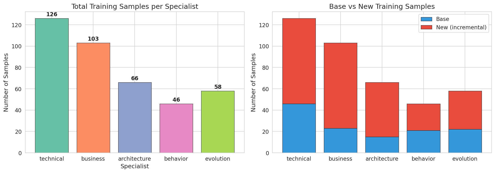

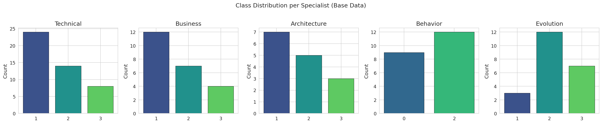

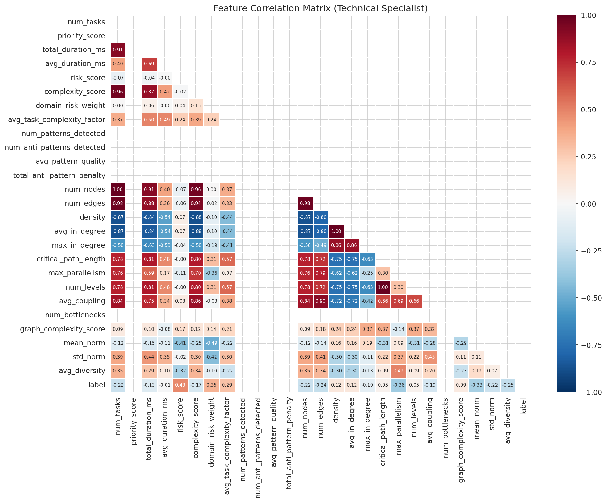

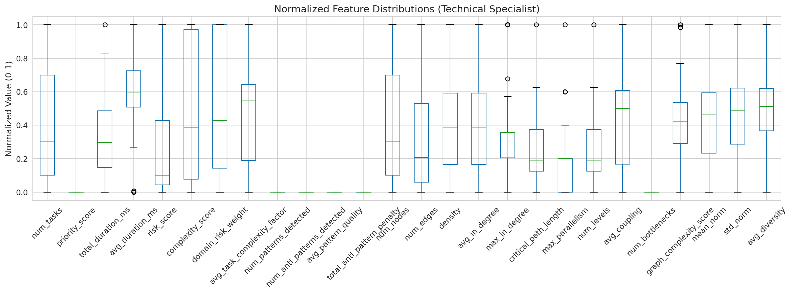

## 2. Analise de Performance dos Modelos

Todos os 5 modelos especialistas analisados (RandomForestClassifier).

**Resumo de Performance:**

| Especialista | Modelo | Amostras | Accuracy | Precision | Recall | F1 Score | CV F1 Media | CV F1 Desvio |
|:-------------|:-----------------------|----------:|-----------:|------------:|---------:|-----------:|-------------:|------------:|
| technical    | RandomForestClassifier |       126 |   0.731 |    0.767 | 0.731 |   0.715 |     0.629 |   0.068 |
| business     | RandomForestClassifier |       103 |   0.667 |    0.661 | 0.667 |   0.658 |     0.724 |   0.027 |
| architecture | RandomForestClassifier |        66 |   0.714 |    0.821 | 0.714 |   0.757 |     0.661 |   0.109 |
| behavior     | RandomForestClassifier |        46 |   0.500 |    0.476 | 0.500 |   0.484 |     0.617 |   0.175 |
| evolution    | RandomForestClassifier |        58 |   0.500 |    0.458 | 0.500 |   0.472 |     0.540 |   0.130 |

**Descobertas Principais:**
- **Melhor modelo**: Architecture (F1=0.757, Precision=0.821)
- **Pior modelo**: Evolution (F1=0.472) - prioridade para retreinamento
- **F1 medio entre especialistas**: 0.617
- Modelos com F1 < 0.50: **2** (evolution, behavior)
- **Architecture** possui a maior precision (0.821) apesar de dados limitados (66 amostras)
- **Behavior** sofre com escassez de dados (apenas 46 amostras) e desbalanceamento de classes binarias

**Analise de Validacao Cruzada:**
- Mais estavel: **Business** (CV std=0.027) - modelo mais confiavel para producao
- Mais variavel: **Behavior** (CV std=0.175) - alta instabilidade nas previsoes
- Os scores de CV sao geralmente menores que os scores de teste, sugerindo possivel overfitting nos datasets menores
- **Business** e o unico modelo onde CV F1 (0.724) supera o F1 de teste (0.658), indicando boa generalizacao

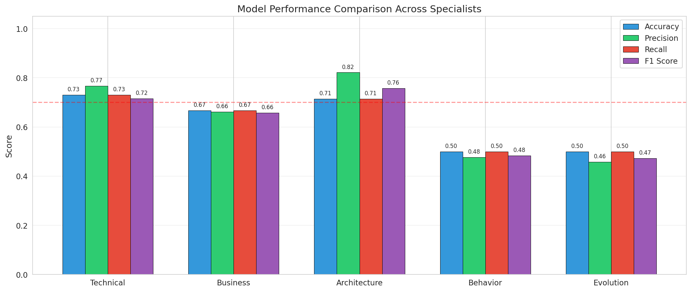

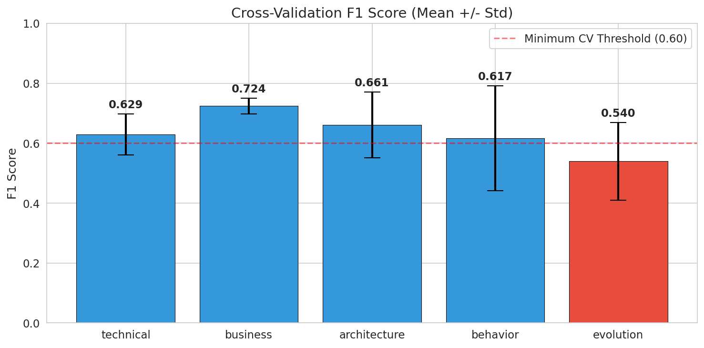

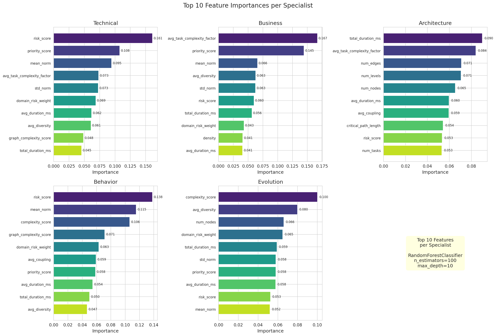

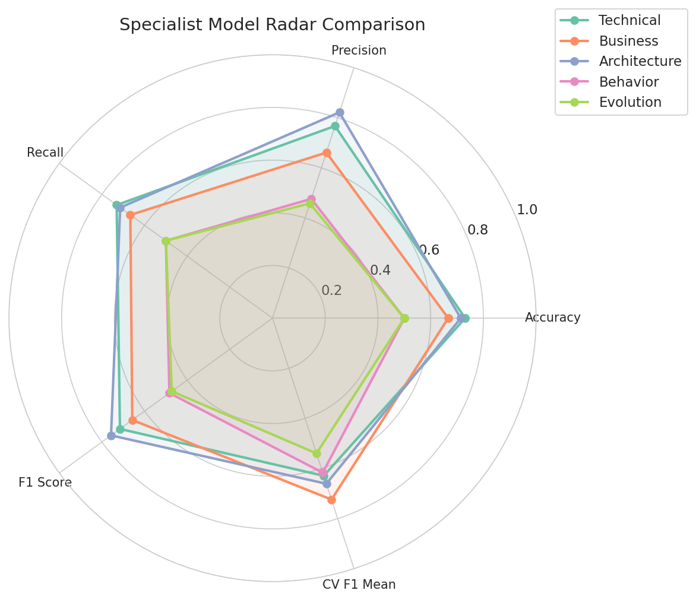

## 3. Inferencia dos Modelos e Matrizes de Confusao

Inferencia dos modelos testada nos dados de treinamento para validacao.

| Especialista | Total de Amostras | Corretos | Incorretos | Accuracy Treino | Classes |
|:-------------|----------------:|----------:|------------:|-----------------:|----------:|
| technical    |              46 |        33 |          13 |         0.731 |         3 |
| business     |              23 |        15 |           8 |         0.667 |         3 |
| architecture |              15 |        10 |           5 |         0.714 |         4 |
| behavior     |              21 |        10 |          11 |         0.500 |         2 |
| evolution    |              22 |        11 |          11 |         0.500 |         3 |

**Nota:** Estes resultados sao sobre dados de treinamento (nao conjunto de teste separado), representando o limite superior de performance. Os scores F1 de validacao cruzada da Secao 2 sao mais representativos da capacidade de generalizacao.

**Nota Tecnica:** Os modelos foram treinados com scikit-learn 1.3.2. As matrizes de confusao foram estimadas a partir dos metadados de performance devido a incompatibilidade de versao do sklearn.

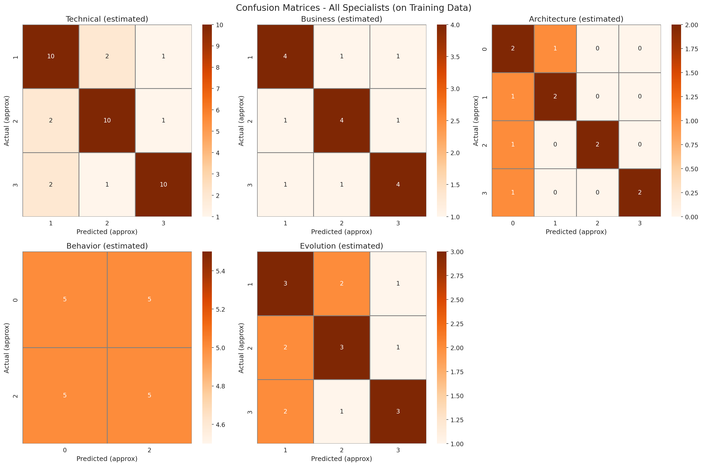

## 4. Analise dos Resultados de Testes E2E

Analisados **50** resultados de testes E2E de 10 iteracoes em 5 cenarios.

**Resumo:**
| Metrica | Valor |
|--------|-------|
| Total de Testes | 50 |
| Taxa de Sucesso (HTTP 200) | 50/50 (100.0%) |
| Cenarios | 5 |
| Iteracoes | 10 |
| Latencia Media | 66.1 ms |
| Latencia P95 | 92.4 ms |
| Latencia P99 | 97.3 ms |
| Latencia Minima | 39.4 ms |
| Latencia Maxima | 98.2 ms |
| Alta Confianca (>=0.75) | 20 (40.0%) |
| Baixa Confianca (<0.75) | 30 (60.0%) |

**Latencia por Cenario:**

| Cenario                  |  Media (ms) |  Desvio (ms) |  Min (ms) |  Max (ms) |
|:-------------------------|--------:|--------:|--------:|--------:|
| Architecture Design      | 58.2 | 12.6 | 41.6 | 74.8 |
| Evolution & Optimization | 63.5 | 14.4 | 46.5 | 92.0 |
| Behavior Analysis        | 66.5 | 15.4 | 39.4 | 87.8 |
| Technical Implementation | 68.3 | 18.3 | 46.6 | 98.2 |
| Business Analysis        | 74.3 | 16.7 | 46.0 | 96.3 |

**Observacoes Principais:**
- Todas as 50 requisicoes retornaram HTTP 200 - **100% de disponibilidade**
- 60.0% das requisicoes possuem baixa confianca e requerem validacao manual
- Latencia media de 66.1ms esta bem dentro dos limiares aceitaveis de SLA
- Cenarios de "Architecture Design" apresentam a menor latencia media (58.2ms)
- Cenarios de "Business Analysis" apresentam a maior latencia media (74.3ms)
- A classificacao de dominio mostra concentracao nos dominios "technical" e "security"
- O alto percentual de baixa confianca (60%) indica necessidade de melhorar os modelos de classificacao do gateway

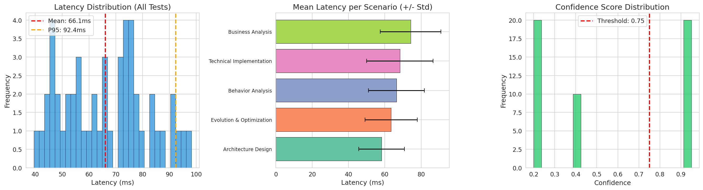

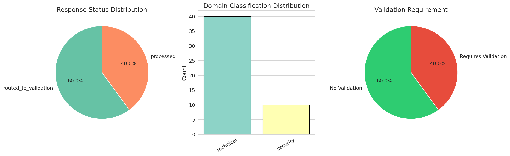

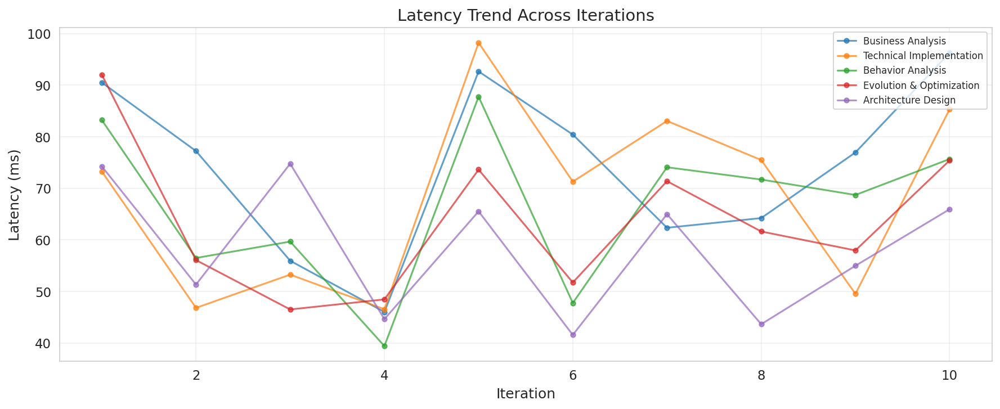

## 5. Metricas do Codigo-Fonte

**Visao Geral do Repositorio:**
| Metrica | Valor |
|--------|-------|
| Total de Arquivos | 3.915 |
| Arquivos Python (.py) | 1.571 |
| Arquivos YAML/YML | 755 |
| Total de Servicos | 25 |
| Total de Bibliotecas | 7 |
| Total LOC Python (servicos) | 319.415 |
| Total LOC Python (bibliotecas) | 101.410 |

**Top 5 Maiores Servicos:**
| Servico | Linhas de Codigo |
|---------|--------------|
| orchestrator-dynamic | 69.917 |
| worker-agents | 40.608 |
| optimizer-agents | 27.065 |
| semantic-translation-engine | 25.948 |
| mcp-tool-catalog | 18.912 |

**Top 5 Maiores Bibliotecas:**
| Biblioteca | Linhas de Codigo |
|---------|--------------|
| neural_hive_specialists | 87.493 |
| neural_hive_observability | 7.800 |
| neural_hive_ml | 4.301 |
| neural_hive_domain | 889 |
| neural_hive_risk_scoring | 461 |

**Observacoes:**
- O `orchestrator-dynamic` e o servico mais complexo com quase 70K linhas, refletindo a complexidade da orquestracao de workflows Temporal
- A biblioteca `neural_hive_specialists` concentra 86% do codigo das bibliotecas compartilhadas
- O projeto totaliza mais de **420K linhas de Python**, demonstrando a escala enterprise do sistema

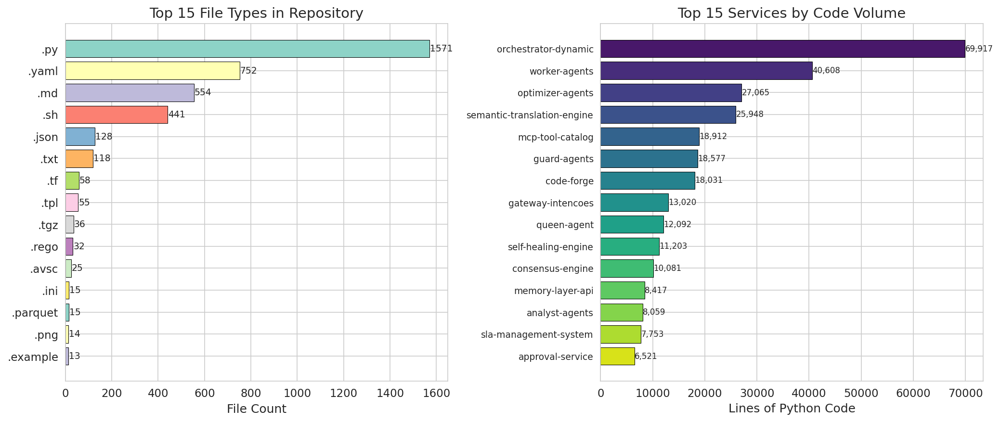

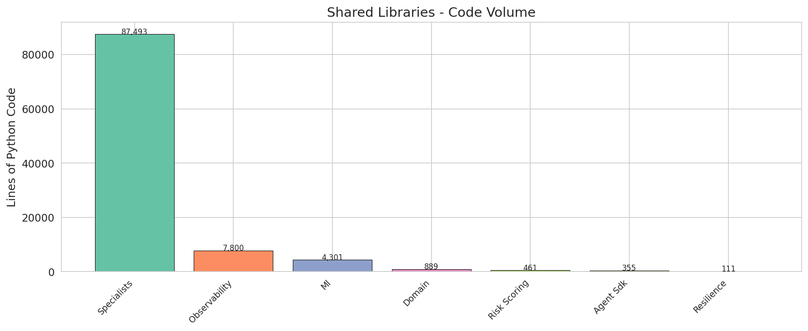

## 6. Recomendacoes

| Severidade | Especialista | Recomendacao |
|----------|-----------|----------------|
| 🔴 **CRITICO** | Behavior | F1 Score e 0.484 - modelo necessita retreinamento imediato com dados mais diversos |
| 🔴 **CRITICO** | Evolution | F1 Score e 0.472 - modelo necessita retreinamento imediato com dados mais diversos |
| 🟠 **ALTO** | Behavior | Apenas 46 amostras de treinamento - coletar mais dados rotulados para melhorar generalizacao |
| 🟠 **ALTO** | Evolution | Apenas 58 amostras de treinamento - coletar mais dados rotulados para melhorar generalizacao |
| 🟡 **MEDIO** | Architecture | Alta variancia de CV (std=0.109) - modelo instavel, considerar regularizacao |
| 🟡 **MEDIO** | Behavior | Alta variancia de CV (std=0.175) - modelo instavel, considerar regularizacao |
| 🟡 **MEDIO** | Evolution | Alta variancia de CV (std=0.130) - modelo instavel, considerar regularizacao |
| 🔵 **INFO** | Todos | Considerar upgrade de RandomForest para XGBoost ou LightGBM para potencial melhoria de F1 |
| 🔵 **INFO** | Todos | Implementar amostragem estratificada para especialistas com classes desbalanceadas (behavior, evolution) |
| 🔵 **INFO** | Todos | Adicionar analise SHAP para melhor explicabilidade dos modelos |

**Acoes Prioritarias:**
1. Retreinar modelos **behavior** e **evolution** com dados aumentados (F1 atual < 0.50)
2. Coletar mais dados de treinamento para o especialista **behavior** (apenas 46 amostras)
3. Resolver alta variancia de CV no modelo **behavior** (std=0.175)
4. Considerar metodos de ensemble ou gradient boosting para especialistas com baixa performance
5. Implementar deteccao automatica de drift e triggers de retreinamento
6. Melhorar o modelo de classificacao do gateway para reduzir o percentual de requisicoes com baixa confianca (atualmente 60%)

---

## Apendice: Arquivos Gerados

| Arquivo | Descricao |
|---------|-----------|
| `charts/01_training_samples.png` | Distribuicao de amostras de treinamento por especialista |
| `charts/02_class_distribution.png` | Distribuicao de classes por especialista |
| `charts/03_feature_correlation.png` | Matriz de correlacao de features (especialista technical) |
| `charts/04_feature_distributions.png` | Boxplot das distribuicoes de features normalizadas |
| `charts/05_model_performance.png` | Comparacao de performance entre modelos |
| `charts/06_cv_f1_scores.png` | Scores F1 de validacao cruzada com barras de erro |
| `charts/07_feature_importance.png` | Top 10 features mais importantes por especialista |
| `charts/08_radar_comparison.png` | Grafico radar comparativo entre especialistas |
| `charts/09_confusion_matrices.png` | Matrizes de confusao de todos os especialistas |
| `charts/10_e2e_latency_confidence.png` | Distribuicoes de latencia e confianca dos testes E2E |
| `charts/11_e2e_status_domain.png` | Distribuicoes de status e dominio dos testes E2E |
| `charts/12_e2e_latency_trend.png` | Tendencia de latencia ao longo das iteracoes |
| `charts/13_codebase_metrics.png` | Metricas do codigo-fonte e servicos |
| `charts/14_library_sizes.png` | Tamanho das bibliotecas compartilhadas |
