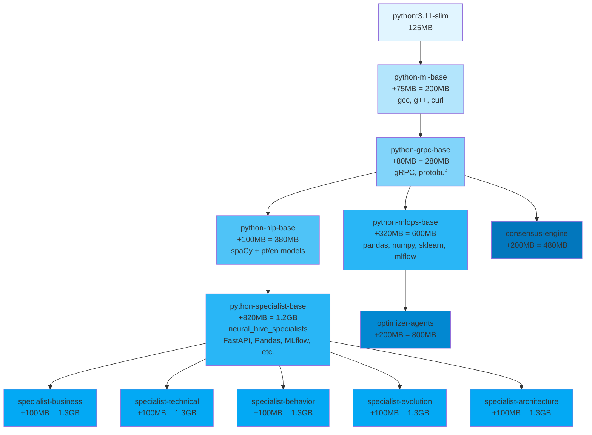

# Imagens Base Docker - Neural Hive-Mind

## Visão Geral

Este diretório contém as imagens base Docker compartilhadas do projeto Neural Hive-Mind. A hierarquia de imagens foi projetada para reduzir duplicação de layers, acelerar builds e centralizar a manutenção de dependências.

### Benefícios

- **Redução de duplicação**: ~6.5GB de layers eliminadas entre os 5 specialists
- **Builds mais rápidos**: Redução de ~8min para ~2min por specialist (75% mais rápido)
- **Melhor cache**: Reutilização de layers entre serviços
- **Manutenção centralizada**: Atualizações de dependências em um único lugar

## Hierarquia de Imagens

```
python:3.11-slim (oficial)
    ↓
python-ml-base:1.0.0
    Python 3.11-slim + gcc/g++/curl
    Tamanho: ~200MB
    ↓
python-grpc-base:1.0.0
    Extends ml-base + grpcio/protobuf
    Tamanho: ~280MB
    ├─→ python-mlops-base:1.0.0
    │   Extends grpc-base + pandas/numpy/scikit-learn/mlflow
    │   Tamanho: ~600MB
    │   ↓
    │   optimizer-agents
    │   Tamanho final: ~800MB (vs ~1.2GB anterior)
    │
    └─→ python-nlp-base:1.0.0
        Extends grpc-base + spaCy + modelos pt/en
        Tamanho: ~380MB
        ↓
        python-specialist-base:1.0.0
        Extends nlp-base + neural_hive_specialists + common deps
        Tamanho: ~1.2GB
        ↓
        Specialists (business, technical, behavior, evolution, architecture)
        Tamanho final: ~1.3GB (vs ~1.8GB anterior)
```



### python-ml-base:1.0.0

Imagem base com Python 3.11-slim e ferramentas essenciais de build para ML.

**Conteúdo:**
- Python 3.11-slim
- gcc, g++, curl
- pip 24.0

**Uso:** Base para python-grpc-base e serviços que precisam apenas de build tools.

### python-grpc-base:1.0.0

Estende python-ml-base com dependências gRPC para comunicação entre serviços.

**Conteúdo:**
- Tudo de python-ml-base
- grpcio >= 1.60.0
- grpcio-tools >= 1.68.0
- grpcio-health-checking >= 1.60.0
- protobuf >= 5.27.0

**Uso:** Base para python-nlp-base e serviços gRPC sem NLP.

### python-mlops-base:1.0.0

Estende python-grpc-base com dependências MLOps para serviços de otimização e ML.

**Conteúdo:**
- Tudo de python-grpc-base
- pandas >= 2.1.3
- numpy >= 1.26.2
- scipy >= 1.11.0
- scikit-learn >= 1.4.0, < 1.6.0
- mlflow >= 2.9.0

**Uso:** Base para optimizer-agents e futuros serviços de ML/otimização.

**Benefício:** Elimina ~400MB de dependências duplicadas, reduzindo build time de ~5min para ~2min.

### python-nlp-base:1.0.0

Estende python-grpc-base com spaCy e modelos de linguagem pré-instalados.

**Conteúdo:**
- Tudo de python-grpc-base
- spaCy >= 3.7.0
- Modelos: pt_core_news_sm 3.8.0, en_core_web_sm 3.8.0

**Uso:** Base para python-specialist-base e serviços que precisam apenas de NLP.

### python-specialist-base:1.0.0

Estende python-nlp-base com biblioteca neural_hive_specialists e dependências comuns dos specialists.

**Conteúdo:**
- Tudo de python-nlp-base
- neural_hive_specialists (instalado como pacote editável)
  - MLflow >= 2.9.0
  - MongoDB (pymongo, motor)
  - Redis >= 5.0.1
  - Neo4j >= 5.15.0
  - OpenTelemetry + Prometheus
- Dependências comuns dos specialists:
  - FastAPI >= 0.104.1, Uvicorn >= 0.24.0
  - Pydantic >= 2.5.2
  - Tenacity >= 8.2.3, PyBreaker >= 1.0.1
  - Pandas >= 2.1.3, NumPy >= 1.26.2, scikit-learn >= 1.4.0
  - Structlog >= 23.2.0

**Uso:** Usado diretamente pelos 5 specialists (business, technical, behavior, evolution, architecture).

**Benefício:** Elimina ~1.4GB de dependências duplicadas por specialist, reduzindo build time de ~8min para ~2min.

## Estratégia de Versionamento

### Semantic Versioning (SemVer)

Formato: **MAJOR.MINOR.PATCH** (ex: 1.0.0)

- **MAJOR**: Mudanças incompatíveis (ex: Python 3.11 → 3.12)
- **MINOR**: Novas funcionalidades compatíveis (ex: adicionar modelo spaCy francês)
- **PATCH**: Bug fixes e atualizações de segurança (ex: protobuf 5.27.0 → 5.27.1)

### Política de Tagging

- **Versão específica**: Sempre usar em Dockerfiles de produção (ex: `FROM neural-hive-mind/python-nlp-base:1.0.0`)
- **latest**: Apenas para desenvolvimento local, NUNCA em produção ou CI/CD

### Deprecation Policy

- **Active**: Versão atual, recebe todas as atualizações
- **Maintenance**: Versões N-1 e N-2, apenas security patches por 6 meses
- **Deprecated**: Versões N-3+, sem suporte
- **End-of-Life**: Removidas após 12 meses de deprecation

## Build Instructions

### Build Local

```bash
# Build todas as base images em ordem
cd /jimy/Neural-Hive-Mind/base-images

# 1. Build python-ml-base
docker build -t neural-hive-mind/python-ml-base:1.0.0 \
  --build-arg VERSION=1.0.0 \
  --build-arg BUILD_DATE=$(date -u +"%Y-%m-%dT%H:%M:%SZ") \
  -f python-ml-base/Dockerfile .

# 2. Build python-grpc-base
docker build -t neural-hive-mind/python-grpc-base:1.0.0 \
  --build-arg VERSION=1.0.0 \
  --build-arg BUILD_DATE=$(date -u +"%Y-%m-%dT%H:%M:%SZ") \
  -f python-grpc-base/Dockerfile .

# 2.5. Build python-mlops-base
docker build -t neural-hive-mind/python-mlops-base:1.0.0 \
  --build-arg VERSION=1.0.0 \
  --build-arg BUILD_DATE=$(date -u +"%Y-%m-%dT%H:%M:%SZ") \
  -f python-mlops-base/Dockerfile .

# 3. Build python-nlp-base
docker build -t neural-hive-mind/python-nlp-base:1.0.0 \
  --build-arg VERSION=1.0.0 \
  --build-arg BUILD_DATE=$(date -u +"%Y-%m-%dT%H:%M:%SZ") \
  -f python-nlp-base/Dockerfile .

# 4. Build python-specialist-base
docker build -t neural-hive-mind/python-specialist-base:1.0.0 \
  --build-arg VERSION=1.0.0 \
  --build-arg BUILD_DATE=$(date -u +"%Y-%m-%dT%H:%M:%SZ") \
  -f python-specialist-base/Dockerfile .

# Tag como latest (apenas para desenvolvimento local)
docker tag neural-hive-mind/python-ml-base:1.0.0 neural-hive-mind/python-ml-base:latest
docker tag neural-hive-mind/python-grpc-base:1.0.0 neural-hive-mind/python-grpc-base:latest
docker tag neural-hive-mind/python-mlops-base:1.0.0 neural-hive-mind/python-mlops-base:latest
docker tag neural-hive-mind/python-nlp-base:1.0.0 neural-hive-mind/python-nlp-base:latest
docker tag neural-hive-mind/python-specialist-base:1.0.0 neural-hive-mind/python-specialist-base:latest
```

### Build Automatizado

Use o script `build-base-images.sh` para build automatizado:

```bash
# Build com versão padrão (1.0.0)
./scripts/build-base-images.sh

# Build com versão específica
./scripts/build-base-images.sh --version 1.1.0

# Build sem cache (força rebuild completo)
./scripts/build-base-images.sh --version 1.0.0 --no-cache

# Build e push para ECR
./scripts/build-base-images.sh --version 1.0.0 --push-to-ecr
```

### Push para ECR

```bash
# Definir variáveis de ambiente
export AWS_REGION=us-east-1
export AWS_ACCOUNT_ID=077878370245
export ENV=production
export ECR_REGISTRY=${AWS_ACCOUNT_ID}.dkr.ecr.${AWS_REGION}.amazonaws.com

# Login no ECR
aws ecr get-login-password --region ${AWS_REGION} | \
  docker login --username AWS --password-stdin ${ECR_REGISTRY}

# Tag para ECR
docker tag neural-hive-mind/python-ml-base:1.0.0 ${ECR_REGISTRY}/${ENV}/python-ml-base:1.0.0
docker tag neural-hive-mind/python-grpc-base:1.0.0 ${ECR_REGISTRY}/${ENV}/python-grpc-base:1.0.0
docker tag neural-hive-mind/python-mlops-base:1.0.0 ${ECR_REGISTRY}/${ENV}/python-mlops-base:1.0.0
docker tag neural-hive-mind/python-nlp-base:1.0.0 ${ECR_REGISTRY}/${ENV}/python-nlp-base:1.0.0
docker tag neural-hive-mind/python-specialist-base:1.0.0 ${ECR_REGISTRY}/${ENV}/python-specialist-base:1.0.0

# Push para ECR
docker push ${ECR_REGISTRY}/${ENV}/python-ml-base:1.0.0
docker push ${ECR_REGISTRY}/${ENV}/python-grpc-base:1.0.0
docker push ${ECR_REGISTRY}/${ENV}/python-mlops-base:1.0.0
docker push ${ECR_REGISTRY}/${ENV}/python-nlp-base:1.0.0
docker push ${ECR_REGISTRY}/${ENV}/python-specialist-base:1.0.0
```

## Serviços que Usam Cada Imagem

### python-specialist-base:1.0.0

- specialist-business
- specialist-technical
- specialist-behavior
- specialist-evolution
- specialist-architecture

### python-mlops-base:1.0.0

- optimizer-agents

### python-nlp-base:1.0.0

- python-specialist-base (como base)
- (futuro) gateway-intencoes (se precisar apenas spaCy)

### python-grpc-base:1.0.0

- python-mlops-base (como base)
- consensus-engine
- (futuro) queen-agent
- (futuro) outros serviços gRPC sem NLP/MLOps

### python-ml-base:1.0.0

- (futuro) serviços que precisam apenas build tools

## Atualização de Versão

### Processo

1. **Planejamento**: Identificar mudanças necessárias e determinar tipo de versão (MAJOR/MINOR/PATCH)
2. **Desenvolvimento**: Atualizar Dockerfile da base image
3. **Testing**: Build local e teste com pelo menos 1 serviço dependente
4. **Versionamento**: Incrementar versão no Dockerfile (ARG VERSION)
5. **Build**: Executar `build-base-images.sh --version X.Y.Z`
6. **Push**: Push para ECR com `--push-to-ecr`
7. **Documentação**: Atualizar CHANGELOG.md e matriz de compatibilidade
8. **Comunicação**: Notificar equipe sobre nova versão e breaking changes (se MAJOR)
9. **Migration**: Atualizar serviços dependentes
10. **Deprecation**: Marcar versões antigas como deprecated

### Exemplo: Security Patch

```bash
# 1. Atualizar Dockerfile (ex: protobuf 5.27.0 → 5.27.1)
vim base-images/python-grpc-base/Dockerfile

# 2. Build nova versão PATCH (1.0.0 → 1.0.1)
./scripts/build-base-images.sh --version 1.0.1

# 3. Test com um specialist
docker build -t test-specialist \
  --build-arg BASE_IMAGE_VERSION=1.0.1 \
  -f services/specialist-business/Dockerfile .

# 4. Push para ECR
./scripts/build-base-images.sh --version 1.0.1 --push-to-ecr

# 5. Atualizar Dockerfiles dos serviços
# FROM neural-hive-mind/python-nlp-base:1.0.0
# →
# FROM neural-hive-mind/python-nlp-base:1.0.1

# 6. Rebuild e redeploy serviços
```

## Troubleshooting

### Build falha por dependência não encontrada

**Problema**: Erro "base image not found"

**Solução**: Verificar ordem de build (ml-base → grpc-base → nlp-base)

```bash
# Build na ordem correta
./scripts/build-base-images.sh
```

### Modelos spaCy não carregam

**Problema**: Erro "Can't find model 'pt_core_news_sm'"

**Solução**: Verificar se download completou no build

```bash
# Verificar manualmente
docker run -it neural-hive-mind/python-nlp-base:1.0.0 /bin/bash
python -c "import pt_core_news_sm; print('OK')"
```

### Debug de imagem base

```bash
# Entrar na imagem para debug
docker run -it neural-hive-mind/python-nlp-base:1.0.0 /bin/bash

# Verificar versões instaladas
python -c "import grpc; import spacy; print('gRPC:', grpc.__version__, 'spaCy:', spacy.__version__)"

# Listar pacotes instalados
pip list
```

### Cache de build

```bash
# Forçar rebuild sem cache
./scripts/build-base-images.sh --version 1.0.0 --no-cache

# Limpar cache do Docker
docker builder prune -af
```

## Documentação Adicional

- [VERSIONING.md](VERSIONING.md) - Estratégia detalhada de versionamento e compatibilidade
- [../CHANGELOG.md](../CHANGELOG.md) - Histórico de mudanças do projeto
- [../README.md](../README.md) - Documentação principal do projeto
