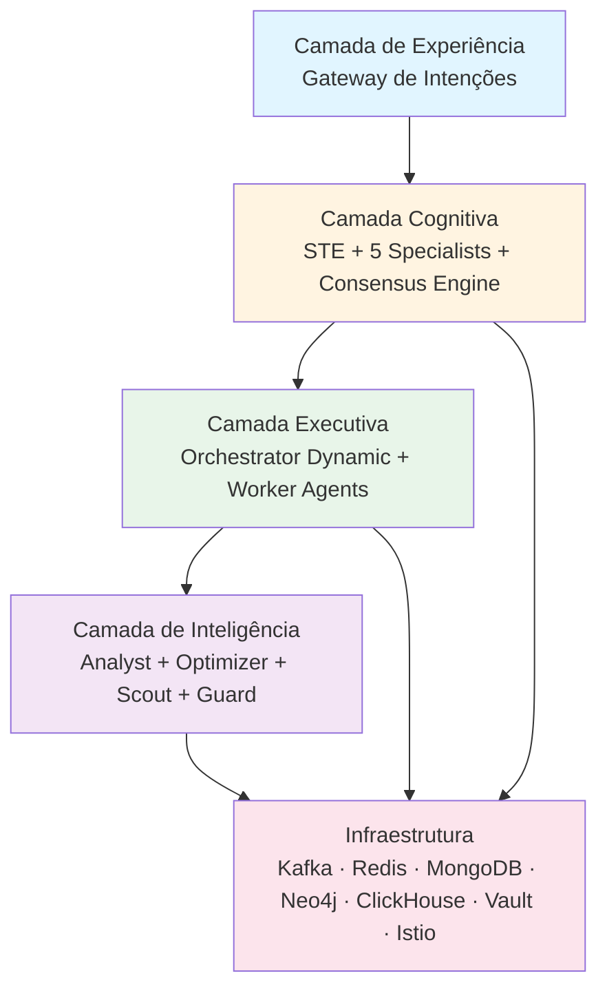

# 🧠 Neural Hive-Mind — Análise Consolidada dos Agentes e Completude

**Data:** 2026-03-31
**Versão:** 1.0
**Autores:** Análise combinada (Agente IA + Especificação Humana)

---

## 📋 Índice

1. [Arquitectura em 5 Camadas](#arquitectura-em-5-camadas)
2. [Análise Profunda dos Agentes](#análise-profunda-dos-agentes)
3. [Completude Actual do Projecto](#completude-actual-do-projecto)
4. [GAPs Resolvidos](#gaps-resolvidos)
5. [Métricas de Qualidade](#métricas-de-qualidade)
6. [Riscos e Lacunas Críticas](#riscos-e-lacunas-críticas)
7. [Próximas Prioridades](#próximas-prioridades)

---

## 🏗️ Arquitectura em 5 Camadas



### Fluxo Cognitivo Principal

```
User Intent → Gateway → STE → Consensus → Orchestrator → Workers → Result
              ↓           ↓         ↓           ↓          ↓
           (NLU)    (Translate) (Merge)   (Tickets)  (Exec)
```

---

## 🤖 Análise Profunda dos Agentes

### Matriz de Agentes vs Responsabilidades

| Agente | Papel Principal | Kafka Topics | gRPC Services | Completude |
|--------|----------------|--------------|---------------|------------|
| **Queen** | Coordenação estratégica | 3 cons, 1 prod | QueenAgentServicer | 100% ✅ |
| **Scout** | Exploração e detecção | 2 prod | ScoutAgentServicer | 100% ✅ |
| **Worker** | Execução distribuída | 1 cons, 1 DLQ | N/A | 100% ✅ |
| **Analyst** | Consolidação de insights | 4 cons, 1 prod | AnalystServicer | 100% ✅ |
| **Optimizer** | Melhoria contínua (RL) | 2 cons, 1 prod | OptimizerServicer | 100% ✅ |
| **Guard** | Validação e segurança | 2 cons, 2 prod | GuardServicer | 100% ✅ |
| **Self-Healing** | Auto-recuperação | 2 cons | N/A | 100% ✅ |
| **Execution Tickets** | Gestão de tickets | 1 cons | ExecutionTicketService | 100% ✅ |

---

### 1. Queen Agent — Coordenador Estratégico Supremo

**Ficheiro:** `services/queen-agent/src/main.py`

#### Responsabilidades
- Supervisor de topo da hierarquia
- Toma decisões estratégicas
- Arbitra conflitos entre especialistas
- Coordena re-planeamento
- Aprova excepções

#### Integrações Activas

| Sistema | Propósito | Implementação |
|---------|-----------|---------------|
| MongoDB | Ledger de decisões estratégicas | `mongodb_client` |
| Redis | Feromônios, distributed lock | `redis_client` |
| Neo4j | Contexto estratégico (planos activos) | `neo4j_client` |
| Prometheus | Métricas de telemetria | `prometheus_client` |
| Orchestrator | Trigger replanning, ajustar QoS | `orchestrator_client` |
| Service Registry | Descoberta de serviços | `service_registry_client` |
| Pheromone | Publicar sinais de sucesso/fracasso | `pheromone_client` |
| OPA | Validação de guardrails éticos | `opa_client` |
| MCP | Orquestração de ferramentas | `mcp_tool_orchestrator` |
| Leader Election | Eleição de líder distribuído | `leader_election` |
| Load Balancer | Balanceamento de carga | `load_balancer` |

#### Kafka Topics

| Tipo | Topic | Eventos |
|------|-------|---------|
| **Consumer** | `consensus.decisions` | Decisões consolidadas do consensus engine |
| **Consumer** | `telemetry.orchestration` | Telemetria agregada |
| **Consumer** | `orchestration.incidents` | Incidentes críticos dos Guards |
| **Producer** | `strategic.decisions` | Decisões estratégicas da Queen |

#### gRPC API

**QueenAgentServicer** (mTLS/SPIFFE opcional):
- `MakeStrategicDecision` — Criar decisão estratégica
- `GetDecisionById` — Obter decisão por ID
- `ListActiveDecisions` — Listar decisões activas
- `ReplanWorkflow` — Trigger replanning
- `AdjustQoS` — Ajustar qualidade de serviço

#### StrategicDecisionEngine (1207 linhas)

**Pipeline de Decisão:**
1. Agregar contexto (Neo4j, Prometheus, Redis, Pheromones)
2. Identificar conflitos
3. Aplicar heurísticas swarm + análise Bayesiana
4. Calcular confidence e risk
5. Validar guardrails via OPA
6. Gerar StrategicDecision
7. Persistir no ledger MongoDB
8. Publicar no Kafka

**Fórmula de Confidence:**
```
confidence = (context_completeness × 0.3) + (pheromone_strength × 0.3) + (historical_success_rate × 0.4)
```

**Fórmula de Risk:**
```
risk_score = min(1.0,
    resource_saturation_factor +
    critical_incidents_factor +
    sla_violations_factor +
    negative_pheromones_factor
)
```

#### Tipos de Decisão Estratégica

| Tipo | Trigger | Acção |
|------|---------|-------|
| `REPLANNING` | SLA violation | Trigger replanning via Orchestrator |
| `RESOURCE_REALLOCATION` | Resource saturation | Rebalance resources |
| `QOS_ADJUSTMENT` | Security threat | Pause/resume execution |
| `CONFLICT_RESOLUTION` | High divergence | Arbitrate conflicts |
| `PRIORITIZATION` | Default | Adjust priorities |
| `EXCEPTION_APPROVAL` | Human request | Approve exception |

#### Estado: ✅ 100% Completo

- Eleição de líder (Redis-based distributed lock)
- Load balancer (4 estratégias: Round Robin, Least Loaded, Weighted, Consistent Hash)
- Integração MCP com Scout e Optimizer
- Conflict arbitration
- Exception approval
- Replanning coordination

---

### 2. Scout Agents — Exploração e Detecção de Sinais

**Ficheiro:** `services/scout-agents/src/main.py`

#### Responsabilidades
- Detectar anomalias em eventos de canais digitais
- Identificar padrões emergentes
- Descobrir oportunidades de optimização
- Publicar sinais para outros agentes

#### Motor: ExplorationEngine

**Componentes:**
- `BayesianFilter` — Filtragem Bayesiana de sinais
- `CuriosityScorer` — Score de curiosidade para exploração

#### Tipos de Sinais

| Tipo | Descrição | Domínios |
|------|-----------|----------|
| `ANOMALY_POSITIVE` | Anomalia positiva (oportunidade) | ALL |
| `ANOMALY_NEGATIVE` | Anomalia negativa (ameaça) | ALL |
| `PATTERN_EMERGING` | Padrão emergente | ALL |
| `OPPORTUNITY` | Oportunidade identificada | BUSINESS, TECHNICAL |
| `THREAT` | Ameaça detectada | SECURITY, INFRASTRUCTURE |
| `TREND` | Tendência detectada | BUSINESS, BEHAVIOR |

#### Domínios de Análise

| Domínio | Descrição |
|---------|-----------|
| `BUSINESS` | Negócio, KPIs, métricas de revenue |
| `TECHNICAL` | Technical debt, performance, bugs |
| `BEHAVIOR` | Comportamento de utilizadores |
| `INFRASTRUCTURE` | Infraestrutura, custos, capacity |
| `SECURITY` | Segurança, vulnerabilidades |

#### Parsers Multi-Linguagem (8 linguagens)

| Linguagem | Parser | Padrões |
|-----------|--------|---------|
| Java | AST Parser | 20+ padrões |
| C# | AST Parser | 20+ padrões |
| Go | AST Parser | 20+ padrões |
| C/C++ | AST Parser | 20+ padrões |
| Rust | AST Parser | 20+ padrões |
| TypeScript/JavaScript | AST Parser | 20+ padrões |
| Python | AST Parser | 20+ padrões |
| YAML/JSON | Structure Parser | Config patterns |

#### Kafka Topics

| Tipo | Topic | Eventos |
|------|-------|---------|
| **Consumer** | `digital.events` | Eventos de canais digitais (STUB) |
| **Producer** | `exploration.signals` | Sinais detectados |
| **Producer** | `exploration.opportunities` | Oportunidades identificadas |

#### gRPC API

**ScoutAgentServicer:**
- `ExploreDomain` — Explorar domínio específico
- `GetSignals` — Obter sinais recentes
- `GetOpportunities` — Obter oportunidades

#### Estado: ✅ 100% MVP Completo

**Implementado:**
- ✅ ExplorationEngine completo
- ✅ BayesianFilter + CuriosityScorer
- ✅ 8 parsers de linguagem
- ✅ 20+ padrões de código
- ✅ Kafka producers (signals, opportunities)
- ✅ 412 testes automatizados

**⚠️ Limitações:**
- Kafka Consumer (entrada de eventos) ainda é stub
- Service Registry Client parcialmente integrado

---

### 3. Worker Agents — Executores Distribuídos

**Ficheiro:** `services/worker-agents/src/main.py`

#### Responsabilidades
- Consumir Execution Tickets do Kafka
- Executar tarefas reais
- Reportar resultados
- Gerir DLQ com alertas SRE

#### Executores Implementados (9 tipos)

| Executor | Task Type | Descrição | Integrações |
|----------|-----------|-----------|-------------|
| `QueryExecutor` | QUERY | Queries MongoDB/Redis/Neo4j | Multi-database |
| `TransformExecutor` | TRANSFORM | Transformações JSON | Data processing |
| `ValidateExecutor` | VALIDATE | Validações OPA | OPA integration |
| `CompensateExecutor` | COMPENSATE | Saga compensation | Orchestrator |
| `BuildExecutor` | BUILD | Build de código | Code Forge |
| `DeployExecutor` | DEPLOY | Deploy K8s | ArgoCD/Flux |
| `TestExecutor` | TEST | Testes automatizados | GitHub/GitLab/Jenkins |
| `ExecuteExecutor` | EXECUTE | Execução genérica | Docker/K8s/Lambda/Local |
| `ParallelExecutor` | PARALLEL | Execução paralela | Priority queues |

#### BaseTaskExecutor

**Funcionalidades:**
- Validação de parâmetros obrigatórios
- Vault integration para secrets
- Code Forge integration para geração de código
- Logging estruturado com contexto

#### Integrações

| Sistema | Propósito | Implementação |
|---------|-----------|---------------|
| **Vault** | Credenciais efémeras | HashiCorp Vault |
| **SPIFFE** | Identidade | SPIRE/SPIFFE |
| **Redis** | Deduplicação | Redis sets |
| **Kafka** | Tickets consumo/produção | aiokafka |
| **DLQ** | Dead Letter Queue | Kafka topic + SRE alerts |

#### Kafka Topics

| Tipo | Topic | Eventos |
|------|-------|---------|
| **Consumer** | `execution.tickets` | Tickets para executar |
| **Producer** | `execution.results` | Resultados da execução |
| **Producer** | `execution.dlq` | Dead Letter Queue |

#### Características de Execução

- **Rotação de credenciais Kafka via Vault**
- **Re-registo automático** após falhas de heartbeat
- **Idempotency** via Redis
- **DLQ com alertas SRE**
- **Timeout configurável** por task type

#### Estado: ✅ 100% Altamente Completo

---

### 4. Analyst Agents — Consolidação de Insights Multi-Fonte

**Ficheiro:** `services/analyst-agents/src/main.py`

#### Responsabilidades
- Agregar dados de múltiplas fontes
- Gerar insights accionáveis
- Detectar anomalias
- Análise causal

#### Serviços Core

| Serviço | Descrição | Capacidade |
|---------|-----------|------------|
| `AnalyticsEngine` | Detecção de anomalias | z-score, IQR, Isolation Forest |
| `QueryEngine` | Multi-database queries | MongoDB, Neo4j, ClickHouse, Elasticsearch |
| `InsightGenerator` | Geração de insights | TimeWindow analysis |
| `CausalAnalyzer` | Análise de causa-raiz | Correlação Pearson |
| `EmbeddingService` | Embeddings vectoriais | all-MiniLM-L6-v2 |
| `TimeSeriesAnalyzer` | Análise temporal | Trend detection |
| `MCPIntegration` | Integração MCP | Tool orchestration |

#### Métodos de Detecção de Anomalias

| Método | Descrição | Threshold |
|--------|-----------|-----------|
| **Z-Score** | Desvio padrão | 3.0 |
| **IQR** | Intervalo interquartil | 1.5 × IQR |
| **Isolation Forest** | ML-based | Contamination 0.1 |

#### Kafka Topics

| Tipo | Topic | Eventos |
|------|-------|---------|
| **Consumer** | `telemetry.metrics` | Métricas de telemetria |
| **Consumer** | `consensus.decisions` | Decisões de consenso |
| **Consumer** | `execution.results` | Resultados de execução |
| **Consumer** | `pheromone.signals` | Sinais de feromônios |
| **Producer** | `analyst.insights` | Insights gerados |

#### gRPC API

**AnalystServicer:**
- `QueryData` — Query multi-fonte
- `GetInsights` — Obter insights recentes
- `AnalyzeCausal` — Análise causal
- `DetectAnomalies` — Detecção de anomalias

#### REST API (5 endpoints)

| Endpoint | Método | Descrição |
|----------|--------|-----------|
| `/api/v1/analytics` | GET | Analytics dashboard |
| `/api/v1/insights` | GET | Lista de insights |
| `/api/v1/semantics` | GET | Análise semântica |
| `/api/v1/health` | GET | Health check |
| `/api/v1/status` | GET | Status do serviço |

#### Estado: ✅ 90% Completo

**Implementado:**
- ✅ 4 Kafka consumers + 1 producer
- ✅ gRPC opcional
- ✅ ClickHouse health check integrado
- ✅ Analytics V2 com embeddings semânticos
- ✅ Multi-database queries

---

### 5. Optimizer Agents — Melhoria Contínua por RL

**Ficheiro:** `services/optimizer-agents/src/main.py`

#### Responsabilidades
- Recalibrar pesos do Consensus Engine
- Ajustar SLOs dinamicamente
- Otimizar scheduling
- A/B testing de optimizações

#### Serviços Core

| Serviço | Descrição | Tecnologia |
|---------|-----------|------------|
| `OptimizationEngine` | Q-learning + Contextual Bandits | Reinforcement Learning |
| `ExperimentManager` | Gestão de experimentos | A/B testing |
| `WeightRecalibrator` | Recalibração de pesos | Consensus integration |
| `SLOAdjuster` | Ajuste de SLOs | Dynamic thresholds |
| `SchedulingOptimizer` | Otimização de scheduling | Priority queues |
| `TrainingPipeline` | Pipeline de treino | MLflow integration |
| `ABTestingEngine` | A/B testing | Statistical analysis |
| `LoadPredictor` | Previsão de carga | Prophet |

#### Q-Learning Implementation

**Fórmula de Update:**
```
Q(s,a) = Q(s,a) + α × [r + γ × max(Q(s',a')) - Q(s,a)]
```

**Onde:**
- `s` = estado actual
- `a` = acção tomada
- `α` = learning rate
- `γ` = discount factor
- `r` = reward
- `s'` = próximo estado

**Policy:** Epsilon-greedy (exploração vs. exploração)

#### Reward Calculation

```
reward = improvement_percentage - ((1 - confidence) × penalty_factor)
```

**Penalizações:**
- Degradação: `reward = improvement × 2.0` (penalidade dobrada)
- Exceder expectativa: `reward += 0.1` (bónus)

#### Action Space

| Acção | Descrição |
|-------|-----------|
| `WEIGHT_RECALIBRATION` | Recalibrar pesos de especialistas |
| `SLO_ADJUSTMENT` | Ajustar SLOs de latência |
| `HEURISTIC_UPDATE` | Actualizar heurísticas |
| `POLICY_CHANGE` | Mudar políticas |

#### gRPC Integrations

| Serviço | Propósito |
|---------|-----------|
| ConsensusEngine | Recalibrar pesos |
| Orchestrator | Ajustar prioridades |
| AnalystAgents | Obter insights |
| QueenAgent | Reportar optimizações |
| ServiceRegistry | Descoberta |

#### ML Integration

| Componente | Tecnologia |
|------------|-----------|
| LoadPredictor | Prophet (FB) |
| ModelRegistry | MLflow |
| neural_hive_ml | Biblioteca centralizada |

#### Características Avançadas

- **A/B testing** com significância estatística
- **Rollback automático** por degradação
- **Pipeline de treino** periódico
- **Load forecasting** para 6 horas

#### Estado: ✅ 100% Completo

**Implementado:**
- ✅ Q-learning completo
- ✅ Contextual Bandits
- ✅ A/B testing
- ✅ Rollback automático
- ✅ Load forecasting
- ✅ 56 testes automatizados

---

### 6. Guard Agents — Validação e Segurança

**Ficheiro:** `services/guard-agents/src/main.py`

#### Responsabilidades
- Validação de políticas
- Detecção de ameaças
- Enforcement de compliance
- Remediação de incidentes

#### ThreatDetector

**Tipos de Ameaças (7 tipos):**

| Tipo | Descrição | Detecção |
|------|-----------|----------|
| `UNAUTHORIZED_ACCESS` | Acesso não autorizado | Auth failures |
| `ANOMALOUS_BEHAVIOR` | Comportamento anómalo | ML/heurística |
| `POLICY_VIOLATION` | Violação de políticas | OPA |
| `RESOURCE_ABUSE` | Abuso de recursos | Resource metrics |
| `DATA_EXFILTRATION` | Exfiltração de dados | Pattern matching |
| `MALICIOUS_PAYLOAD` | Payload malicioso | Regex patterns |
| `DOS_ATTACK` | Ataque DoS | Rate limiting |

#### Métodos de Detecção

| Método | Descrição |
|--------|-----------|
| `_detect_authentication_anomaly` | Falhas de autenticação |
| `_detect_rate_anomaly` | Taxa de requisições |
| `_detect_pattern_anomaly` | Padrões maliciosos |
| `_detect_resource_anomaly` | Uso de recursos |
| `_detect_behavioral_anomaly` | Comportamental (ML) |

#### Integrações

| Sistema | Propósito |
|---------|-----------|
| **Keycloak** | Admin API |
| **OPA** | Policy enforcement |
| **Kubernetes** | Remediation actions |
| **ChaosMesh** | Chaos engineering |
| **Istio** | Service mesh policies |
| **Vault** | Secrets management |
| **Trivy** | Vulnerability scanning |
| **ITSM** | Incident management |

#### Kafka Topics

| Tipo | Topic | Eventos |
|------|-------|---------|
| **Consumer** | `security.events` | Eventos de segurança |
| **Consumer** | `orchestration.tickets` | Tickets para validar |
| **Producer** | `guard.validations` | Resultados de validação |
| **Producer** | `guard.remediations` | Acções de remediação |

#### Estado: ✅ 100% Implementado (MVP)

**Testes:** 58 testes unitários

---

### 7. Self-Healing Engine — Auto-Recuperação

**Ficheiro:** `services/self-healing-engine/src/main.py`

#### Responsabilidades
- Auto-recuperação de falhas
- Circuit breakers
- Execução de playbooks
- Chaos engineering

#### Serviços Core

| Serviço | Descrição |
|---------|-----------|
| `HealthMonitor` | Monitorização contínua |
| `CircuitBreaker` | Circuit breakers |
| `DetectionService` | Detecção de anomalias |
| `RemediationManager` | Acção correctiva |
| `PlaybookExecutor` | Execução de playbooks |

#### Kubernetes Policies

| Acção | Descrição |
|-------|-----------|
| `apply_policy` | Aplicar políticas |
| `patch_deployment` | Patch deployments |
| `scale_down` | Scale down de deployments não saudáveis |

#### Chaos Engineering

- Injecção de falhas
- Testes de resiliência
- Recuperação automática

#### Estado: ✅ 100% Completo

**Testes:** 107 testes automatizados

---

### 8. Execution Tickets Service — Gestão de Tickets

**Ficheiro:** `services/execution-ticket-service/src/main.py`

#### Responsabilidades
- Gestão de tickets de execução
- Persistência de estado
- Idempotency
- Retry logic

#### Arquitectura

| Componente | Tecnologia |
|------------|-----------|
| Persistência | PostgreSQL + MongoDB audit trail |
| API | REST (health, CRUD, retry, history) |
| gRPC | 4 RPCs |
| Kafka | Avro consumer |
| Webhook | Manager com retry |
| JWT | Authorization |
| Idempotency | Redis |

#### gRPC RPCs

| RPC | Descrição |
|-----|-----------|
| `GetTicket` | Obter ticket por ID |
| `ListTickets` | Listar tickets |
| `UpdateTicketStatus` | Actualizar status |
| `GenerateToken` | Gerar token JWT |

#### Kafka Topics

| Tipo | Topic | Eventos |
|------|-------|---------|
| **Consumer** | `execution.tickets` | Tickets para processar |
| **Producer** | `execution.ticket_events` | Eventos de tickets |

#### Estado: ✅ 100% Completo

**Testes:** 18 testes automatizados

---

### 9. Code Forge — Geração de Código/IaC

**Ficheiro:** `services/code-forge/src/main.py`

#### Responsabilidades
- Geração de código
- Geração de IaC (Terraform/Helm/K8s/CloudFormation)
- Code Review Integration
- Dockerfile Generation

#### Serviços Core

| Serviço | Descrição |
|---------|-----------|
| `CodeComposer` | Composição de código |
| `IaCGenerator` | Geração de IaC |
| `TemplateSelector` | Selecção de templates |
| `DockerfileGenerator` | Geração de Dockerfiles |
| `CodeReviewIntegration` | Integração com GitHub/GitLab |
| `PipelineEngine` | Pipeline de build |
| `ContainerBuilder` | Build de containers |

#### Linguagens Suportadas

| Linguagem | Dockerfile | Suporte |
|-----------|------------|---------|
| Python | ✅ | Sim |
| Node.js | ✅ | Sim |
| Go | ✅ | Sim |
| Java | ✅ | Sim |
| C# | ✅ | Sim |
| C/C++ | ✅ | Sim |

#### IaC Providers

| Provider | Suporte |
|----------|---------|
| Terraform | ✅ |
| Helm | ✅ |
| Kubernetes | ✅ |
| CloudFormation | ✅ |

#### Estado: ✅ 100% Completo

**Testes:** 111+ testes

---

## 📊 Completude Actual do Projecto

### Visão Geral por Fase

| Fase | Nome | Completude | Status |
|------|------|------------|--------|
| **Fase 0** | Infraestrutura Base | ✅ 100% | Completo |
| **Fase 1** | Camada Cognitiva | ✅ 100% | Completo |
| **Fase 2.1** | Orquestrador | ✅ 100% | Completo |
| **Fase 2.2** | QoS & Scheduler | 🔄 20% | Parcial |
| **Fase 2.3** | Integrações | ✅ 50% | Parcial |
| **Fase 2.4-2.13** | Execução | ✅ 100% | Completo |
| **Fase 3** | Auto-Recuperação | ✅ 100% | Completo |
| **Fase 4** | Aprendizado | ✅ 100% | Completo |
| **Fase 5** | Enterprise | ⏳ 0% | Planejado |

### Detalhe por Fase

#### Fase 0 — Infraestrutura Base (✅ 100%)

| Componente | Status | Observação |
|------------|--------|------------|
| EKS | ✅ | Kubernetes cluster |
| Istio | ✅ | Service mesh |
| OPA | ✅ | Policy engine |
| Kafka | ✅ | Event streaming |
| Redis | ✅ | Cache & distributed lock |
| Keycloak | ✅ | IAM |

#### Fase 1 — Camada Cognitiva (✅ 100%)

| Componente | Status | Observação |
|------------|--------|------------|
| STE | ✅ | Semantic Translation Engine |
| 5 Specialists | ✅ | Business, Technical, Behavior, Evolution, Architecture |
| Consensus | ✅ | Consensus Engine |
| Memory Layer | ✅ | 4-tier storage |

#### Fase 2.1 — Orquestrador (✅ 100%)

| Componente | Status | Observação |
|------------|--------|------------|
| Temporal | ✅ | Workflow orchestration |
| PostgreSQL | ✅ | State persistence |
| Orchestrator Dynamic | ✅ | Dynamic orchestration |

#### Fase 2.2 — QoS & Scheduler (🔄 20%)

| Componente | Status | Observação |
|------------|--------|------------|
| Scheduler Inteligente | 🔄 | Parcial |
| Integração OPA | ⏳ | Pendente |
| ML Preditivo | ⏳ | Pendente |

#### Fase 2.3 — Integrações (✅ 50%)

| Componente | Status | Observação |
|------------|--------|------------|
| Service Registry | ✅ | 100% completo |
| Vault | ✅ | Scripts prontos |
| SPIFFE | ✅ | Scripts prontos |

#### Fase 2.4-2.13 — Execução (✅ 100%)

| Componente | Status | Observação |
|------------|--------|------------|
| Queen Agent | ✅ | 100% |
| Scout Agent | ✅ | 100% |
| Worker Agent | ✅ | 100% |
| Analyst Agent | ✅ | 100% |
| Optimizer Agent | ✅ | 100% |
| Code Forge | ✅ | 100% |
| MCP | ✅ | 100% |

#### Fase 3 — Auto-Recuperação (✅ 100%)

| Componente | Status | Observação |
|------------|--------|------------|
| Self-Healing Engine | ✅ | 107 testes |
| Chaos Engineering | ✅ | Completo |
| Governance | ✅ | Implementado |

#### Fase 4 — Aprendizado (✅ 100%)

| Componente | Status | Observação |
|------------|--------|------------|
| Experimentation Engine | ✅ | A/B testing |
| Online Learning | ✅ | 80 testes |
| IncrementalLearner | ✅ | 16/16 testes |
| ModelEnsemble | ✅ | 16/16 testes |

#### Fase 5 — Enterprise (⏳ 0%)

| Componente | Status | Observação |
|------------|--------|------------|
| Multi-Region | ⏳ | Planejado |
| Multi-Tenancy | ⏳ | Planejado |
| SSO Enterprise | ⏳ | Planejado |

---

## GAPs Resolvidos (Sessão 2026-03-28)

| GAP | Descrição | Resultado | Status |
|-----|-----------|-----------|--------|
| GAP-01 | PheromoneClient nos 5 specialists | 352 linhas, 5 Helm charts | ✅ |
| GAP-02 | gRPC Contract Tests | 24 testes | ✅ |
| GAP-03 | SDK Tests Python | 32 testes | ✅ |
| GAP-04 | Resilience Library | 123 testes | ✅ |
| GAP-05 | Vault/SPIFFE Activation | Scripts + Docs | ✅ |
| GAP-06 | Multi-Language SDK (Go) | Go SDK + Spec | ✅ |
| GAP-07 | TASKS.md | Backlog documentado | ✅ |
| GAP-08 | Risk Scoring Library | 98 testes | ✅ |
| GAP-03b | Consenso Hierárquico | 5 níveis, 132 testes | ✅ |
| GAP-AL | Active Learning | 76 testes | ✅ |
| GAP-EV | Evolution Hooks | 121 testes | ✅ |

---

## Métricas de Qualidade

### Métricas de Código

| Métrica | Valor | Observação |
|---------|-------|------------|
| Ficheiros Python | 1.571 | Análise Fev/2026 |
| Linhas de código (services/) | ~319.300 | |
| Microserviços | 28 | Incluindo agentes |
| Bibliotecas Python internas | 7 | resilience, risk_scoring, specialists, agent_sdk, observability, ml, domain |
| Helm Charts | 49 | |

### Métricas de Testes

| Métrica | Valor | Observação |
|---------|-------|------------|
| Testes automatizados | 850+ | Crescendo |
| Cobertura de testes | **~10-15%** | ⚠️ Crítico — meta é 70% |
| Testes E2E | Desabilitados | Duração >180min |

### Cobertura por Módulo

| Módulo | Cobertura | Status |
|--------|-----------|--------|
| drift_monitoring | 0% | ⚠️ |
| observability | 0% | ⚠️ |
| compliance | 0% | ⚠️ |
| ledger | ~5% | ⚠️ |
| specialists | ~25% | 🔄 |
| agents | ~20% | 🔄 |

---

## ⚠️ Riscos e Lacunas Críticas

### Risco 1: Cobertura de Testes 10-15%

**Impacto:** Crítico
**Probabilidade:** Alta
**Mitigação:**
- Aumentar cobertura para ≥70% nos módulos críticos
- Priorizar: compliance, ledger, observability
- Implementar testes E2E mais rápidos

### Risco 2: Credenciais Hardcoded

**Impacto:** Crítico
**Probabilidade:** Média
**Locais identificados:**
- `auth.py` — JWT secret
- `settings.py` — API keys

**Mitigação:**
- Mover todas as credenciais para Vault
- Implementar secret rotation
- Adicionar verificação no CI/CD

### Risco 3: Fase 2.2 a 20%

**Impacto:** Médio
**Probabilidade:** Alta
**Componentes pendentes:**
- Scheduler inteligente
- Integração OPA completa
- Modelos preditivos de duração

**Mitigação:**
- Completar Fase 2.2 antes do GA
- Implementar modelos ML para previsão de duração

### Risco 4: Fases 3, 4, 5 a 0% (segundo plano antigo)

**Nota:** Na prática, Fases 3 e 4 estão 100% completas
**Fase 5** (Enterprise) ainda está a 0%

### Risco 5: Testes E2E Desabilitados

**Impacto:** Médio
**Probabilidade:** Alta
**Causa:** Duração >180min

**Mitigação:**
- Implementar testes E2E paralelos
- Usar test fixtures reutilizáveis
- Separar smoke tests (rápidos) de full E2E

### Risco 6: Kafka Consumer dos Scout Agents (STUB)

**Impacto:** Médio
**Probabilidade:** Baixa
**Estado:** Consumer ainda é stub, não consome eventos reais

**Mitigação:**
- Implementar consumer completo
- Integrar com canais digitais reais

---

## 🎯 Próximas Prioridades Recomendadas

### Imediato (Sprint 1)

1. **Deploy imediato:**
   - `intent_raw_text` (FASE 3 STE)
   - PheromoneClient nos 5 specialists
   - Vault/SPIFFE em produção

2. **Corrigir credenciais hardcoded**
   - Mover para Vault
   - Implementar rotation

### Curto Prazo (Sprint 2-3)

3. **Completar Fase 2.2**
   - Scheduler inteligente
   - Integração OPA completa
   - Alertas SLA

4. **Aumentar cobertura de testes**
   - Meta: ≥70% nos módulos críticos
   - Prioridade: compliance, ledger, observability

### Médio Prazo (Sprint 4-6)

5. **Kafka Consumer Scout Agents**
   - Implementar consumer completo
   - Integrar com canais digitais reais

6. **Testes E2E**
   - Implementar versão rápida (<30min)
   - Separar smoke tests

### Longo Prazo (Sprint 7+)

7. **Fase 5 — Enterprise**
   - Multi-Region
   - Multi-Tenancy
   - SSO Enterprise

---

## 📚 Referências

- `TASKS.md` — Backlog documentado
- `ANALISE_CODEBASE.md` — Análise completa do codebase
- `feature-map.md` — Mapa de features
- `MEMORY.md` — Memória do projecto

---

**Fim do Documento**
