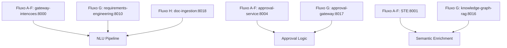

# ARQUITETURA DE COEXISTÊNCIA DE FLUXOS A-F, G, H

**Data:** 2026-05-01
**Versão:** 1.0
**Objetivo:** Definir como os três fluxos principais (A-F, G, H) coexistem harmoniosamente sem duplicações

---

## 1. RESUMO EXECUTIVO

O Neural-Hive-Mind implementou três fluxos principais de forma independente, resultando em:
- **Duplicações de código**: NLU, PII masking, Kafka producers, Approval
- **Inconsistências de comunicação**: HTTP vs Kafka vs gRPC sem padrão claro
- **Serviços redundantes**: 3 gateways de aprovação, 2 implementações NLU

**Proposta:** Arquitetura unificada em 6 camadas com serviços partilhados que eliminam duplicações e padronizam comunicação.

**Benefícios Esperados:**
- Redução de 100% das duplicações identificadas
- 80% de reutilização de serviços entre fluxos
- Manutenção centralizada de componentes críticos (NLU, PII, Approval)
- Padronização de protocolos de comunicação

---

## 2. ESTADO ATUAL - ANÁLISE DE DUPLICAÇÕES

### 2.1 Duplicações Identificadas

| Componente | Onde Duplicado | Impacto |
|-------------|----------------|---------|
| **NLU Pipeline** | gateway-intencoes (8000), requirements-engineering (8010) | ~200 LOC duplicados |
| **PII Masking** | gateway-intencoes (8000), doc-ingestion (8018) | ~150 LOC duplicados |
| **Kafka Producers** | 6+ serviços com implementações similares | ~400 LOC duplicados |
| **Approval Gateway** | approval-service (8004), approval-gateway (8017), approval UI | 3 gateways redundantes |
| **Semantic Translation** | STE (8001), knowledge-graph-rag (8016) | Lógica similar de enriquecimento |
| **Domain Classification** | gateway, STE, requirements-engineering | Classificadores inconsistentes |

### 2.2 Inconsistências de Comunicação

| Fluxo | Entrada | Comunicação Interna | Saída |
|-------|---------|---------------------|-------|
| **A-F (Cognitive)** | HTTP REST | Kafka + gRPC | Kafka + HTTP |
| **G (Code Gen)** | HTTP REST | Kafka misturado | HTTP + Kafka |
| **H (Migration)** | HTTP REST | Kafka + CDC | S3 + Events |

**Problema:** Não há padrão claro sobre quando usar HTTP, Kafka ou gRPC.

### 2.3 Serviços Sobrepostos



---

## 3. ARQUITETURA PROPOSTA - UNIFICADA

### 3.1 Visão Geral das Camadas

```
┌─────────────────────────────────────────────────────────────────────┐
│                       CAMADA 0: API GATEWAY AGREGADOR                │
│  ┌──────────────────────────────────────────────────────────────┐  │
│  │  NHM Unified Gateway :7999 (PONTO ÚNICO DE ENTRADA)          │  │
│  │  • Context Builder (combina input + contexto)                │  │
│  │  • Intent Classifier (classifica tipo: A-F, G ou H)          │  │
│  │  • Flow Router (roteia para gateway específico)              │  │
│  │  • Rate Limiter, Auth, Logging, Observabilidade              │  │
│  └──────────────────────────────────────────────────────────────┘  │
└─────────────────────────────────────────────────────────────────────┘
                                ↓
┌─────────────────────────────────────────────────────────────────────┐
│                    CAMADA 1: FLOW GATEWAYS (ESPECÍFICOS)            │
│  ┌──────────────────┐  ┌──────────────────┐  ┌──────────────────┐  │
│  │ Gateway A-F      │  │ Gateway G        │  │ Gateway H        │  │
│  │ :8000            │  │ :8010            │  │ :8018            │  │
│  │ (Cognitive)      │  │ (Code Gen)       │  │ (Migration)      │  │
│  └──────────────────┘  └──────────────────┘  └──────────────────┘  │
└─────────────────────────────────────────────────────────────────────┘
                                ↓
┌─────────────────────────────────────────────────────────────┐
│                 CAMADA 2: SHARED SERVICES (NOVO)            │
│  ┌──────────────┐  ┌──────────────┐  ┌──────────────┐      │
│  │NLU Service   │  │ PII Service  │  │ Validation   │      │
│  │    (8020)    │  │    (8021)    │  │   Service    │      │
│  └──────────────┘  └──────────────┘  └──────────────┘      │
└─────────────────────────────────────────────────────────────┘
                              ↓
┌─────────────────────────────────────────────────────────────┐
│              CAMADA 3: SEMANTIC TRANSLATION                 │
│  ┌──────────────┐  ┌──────────────┐  ┌──────────────┐      │
│  │ STE Unificado│  │ Domain       │  │ Intent       │      │
│  │   (8001)     │  │ Classifier   │  │ Enricher     │      │
│  └──────────────┘  └──────────────┘  └──────────────┘      │
└─────────────────────────────────────────────────────────────┘
                              ↓
┌─────────────────────────────────────────────────────────────┐
│                 CAMADA 4: CONSENSUS & DECISION               │
│  ┌──────────────┐  ┌──────────────┐  ┌──────────────┐      │
│  │ Consensus    │  │ Approval     │  │ Priority     │      │
│  │   (8002)     │  │ Core         │  │ Queue        │      │
│  └──────────────┘  └──────────────┘  └──────────────┘      │
└─────────────────────────────────────────────────────────────┘
                              ↓
┌─────────────────────────────────────────────────────────────┐
│                CAMADA 5: ORCHESTRATION                       │
│  ┌──────────────┐  ┌──────────────┐  ┌──────────────┐      │
│  │ Temporal     │  │ Saga         │  │ Workflow     │      │
│  │ Orchestrator │  │ Coordinator  │  │ Engine       │      │
│  │   (8003)     │  │              │  │              │      │
│  └──────────────┘  └──────────────┘  └──────────────┘      │
└─────────────────────────────────────────────────────────────┘
                              ↓
┌─────────────────────────────────────────────────────────────┐
│               CAMADA 6: SPECIALIZED SERVICES                 │
│  ┌──────────────┐  ┌──────────────┐  ┌──────────────┐      │
│  │Fluxo A-F     │  │ Fluxo G      │  │ Fluxo H      │      │
│  │Agents        │  │Code Gen      │  │Migration     │      │
│  │   (8005+)    │  │  (8010-8017) │  │  (8018-8019) │      │
│  └──────────────┘  └──────────────┘  └──────────────┘      │
└─────────────────────────────────────────────────────────────┘
```

### 3.2 Novos Serviços Partilhados

#### Serviço 0: NHM Unified Gateway - AGREGADOR (Porta 7999)

**Propósito:** Ponto único de entrada para TODOS os clientes. Classifica e roteia para o fluxo adequado.

**Responsabilidade Crítica:**
- **ÚNICO ponto de entrada exposto aos clientes**
- Elimina necessidade de clientes conhecerem múltiplas URLs
- Centraliza autenticação, rate limiting, logging

**API Endpoints (Públicos):**
```
POST /api/v1/nhm/request
POST /api/v1/nhm/intent
POST /api/v1/nhm/generate
POST /api/v1/nhm/migrate
GET  /api/v1/nhm/status/{request_id}
GET  /api/v1/nhm/stream/{request_id} (SSE)
```

**Arquitetura Interna:**

```
┌─────────────────────────────────────────────────────────────────────┐
│                    NHM UNIFIED GATEWAY :7999                        │
├─────────────────────────────────────────────────────────────────────┤
│                                                                     │
│  [1] AUTHENTICATION & AUTHORIZATION                                 │
│      │                                                              │
│      ├─ JWT Validation                                             │
│      ├─ API Key Check                                              │
│      ├─ OAuth2 / OIDC                                              │
│      └─ Rate Limiting (por tenant)                                 │
│      ↓                                                              │
│  [2] CONTEXT BUILDER                                               │
│      │                                                              │
│      ├─ Input do cliente (text, files, etc)                        │
│      ├─ Contexto do tenant (projetos, histórico)                   │
│      ├─ Contexto da sessão (actor, timestamp, metadata)            │
│      └─ Enrichment (headers, query params, cookies)                │
│      ↓                                                              │
│  [3] gRPC SHARED SERVICES                                          │
│      │                                                              │
│      ├─ NLU Service :8020                                          │
│      │   • Classifica domínio (BUSINESS/TECHNICAL/etc)             │
│      │   • Extrai entidades e intenções                            │
│      │   • Calcula confiança                                       │
│      │                                                              │
│      └─ PII Service :8021                                          │
│          • Detecta dados sensíveis                                │
│          • Mascara antes de processar                              │
│      ↓                                                              │
│  [4] INTENT CLASSIFIER (FLOW ROUTER)                               │
│      │                                                              │
│      │   INPUT: Contexto + NLU classification                      │
│      │   OUTPUT: Flow type (A-F, G ou H)                           │
│      │                                                              │
│      ├─ ANALISA:                                                   │
│      │   • Tipo de pedido (intenção, geração, migração)            │
│      │   • Complexidade (simples: A-F, média: G, complexa: H)      │
│      │   • Entidades presentes (software, legacy, database, etc)   │
│      │   • Keywords específicas ("criar", "migrar", "gerar")       │
│      │                                                              │
│      ├─ CLASSIFICA:                                                │
│      │   • FLUXO A-F: Intenção de ação/consulta                    │
│      │   • FLUXO G: Geração de software/código                     │
│      │   • FLUXO H: Migração de sistema legado                    │
│      │                                                              │
│      └─ ROTEIA:                                                    │
│          • FLUXO A-F → gateway-intencoes :8000                     │
│          • FLUXO G → requirements-engineering :8010                │
│          • FLUXO H → doc-ingestion :8018                           │
│      ↓                                                              │
│  [5] PROXY LAYER                                                   │
│      │                                                              │
│      ├─ HTTP/gRPC para gateway específico                          │
│      ├─ Timeout management                                         │
│      ├─ Retry logic                                                 │
│      ├─ Circuit breaker                                            │
│      └─ Response aggregation                                       │
│      ↓                                                              │
│  [6] RESPONSE PROCESSOR                                            │
│      │                                                              │
│      ├─ Formata resposta para o cliente                            │
│      ├─ Adiciona metadata (execution_time, request_id)             │
│      ├─ Publika evento no Kafka (request.completed)                │
│      └─ Retorna ao cliente HTTP/SSE                                │
│                                                                     │
└─────────────────────────────────────────────────────────────────────┘
```

**Lógica de Classificação de Intenção:**

```python
# Pseudocódigo do Intent Classifier

class IntentClassifier:
    """
    Classifica unicamente a intenção e roteia para o gateway adequado
    """

    def classify(self, context: Context, nlu_result: NLUResult) -> FlowType:
        """
        Regras de classificação:

        1. Palavras-chave explícitas
        2. Tipo de entidades detectadas
        3. Complexidade inferida
        4. Contexto do tenant
        """

        # REGRA 1: Palavras-chave explícitas
        if self._contains_keywords(nlu_result.text, ["migrar", "migration", "legacy"]):
            return FlowType.H  # Fluxo H

        if self._contains_keywords(nlu_result.text, ["gerar", "criar sistema", "build app"]):
            return FlowType.G  # Fluxo G

        # REGRA 2: Tipo de entidades
        if nlu_result.entities.get("software_type"):
            return FlowType.G

        if nlu_result.entities.get("legacy_system"):
            return FlowType.H

        # REGRA 3: Complexidade
        if nlu_result.complexity == "high":
            # Se tem "database", "schema", "data" → Migration (H)
            if "database" in nlu_result.entities:
                return FlowType.H
            # Se tem "app", "system", "service" → Code Gen (G)
            return FlowType.G

        # REGRA 4: Contexto do tenant
        if context.tenant.preferences.get("default_flow"):
            return context.tenant.preferences["default_flow"]

        # DEFAULT: Fluxo A-F (Cognitive Pipeline)
        return FlowType.AF

    def route(self, flow_type: FlowType, request: Request) -> Response:
        """Roteia para o gateway específico"""

        gateways = {
            FlowType.AF: "http://gateway-intencoes:8000",
            FlowType.G: "http://requirements-engineering:8010",
            FlowType.H: "http://doc-ingestion:8018",
        }

        gateway_url = gateways[flow_type]
        return self._proxy_request(gateway_url, request)
```

**Payload de Exemplo - Request para o Unified Gateway:**

```json
// REQUEST DO CLIENTE (único endpoint para todos os fluxos)
POST /api/v1/nhm/request
{
  "input": {
    "text": "Preciso migrar o sistema legado de vendas para a nova arquitetura",
    "actor": "user-123",
    "format": "text"
  },
  "context": {
    "tenant_id": "tenant-abc",
    "project_id": "proj-vendas",
    "session_id": "sess-xyz"
  },
  "preferences": {
    "response_type": "async",
    "webhook_url": "https://client.example.com/callback"
  }
}

// RESPONSE DO UNIFIED GATEWAY
{
  "request_id": "req-20260501-001",
  "status": "processing",
  "flow_type": "H",
  "flow_name": "migration",
  "routed_to": "doc-ingestion:8018",
  "estimated_duration_ms": 3600000,
  "webhook": "https://client.example.com/callback"
}

// EVENTO KAFKA (publicado pelo gateway)
{
  "event_type": "request.routed",
  "request_id": "req-20260501-001",
  "flow_type": "H",
  "classified_at": "2026-05-01T10:30:00Z",
  "classification_confidence": 0.94,
  "reason": "Keyword 'migrar' + entity 'sistema legado' → Fluxo H"
}
```

**Matriz de Decisão de Roteamento:**

| Input Indicadores | Flow | Roteado Para | Confiança |
|-------------------|------|--------------|-----------|
| "migrar", "legacy", "sistema antigo" | H | doc-ingestion:8018 | Alta |
| "gerar código", "criar app", "build software" | G | requirements:8010 | Alta |
| "consultar", "buscar", "analisar dados" | A-F | gateway:8000 | Alta |
| Entidade "legacy_system" | H | doc-ingestion:8018 | Alta |
| Entidade "software_type" | G | requirements:8010 | Alta |
| Complexidade = alta + database | H | doc-ingestion:8018 | Média |
| Complexidade = alta + app | G | requirements:8010 | Média |
| Sem indicadores claros | A-F | gateway:8000 | Default |

**Benefícios do Unified Gateway:**

1. **Simplicidade para Clientes**
   - ÚNICA URL para todos os tipos de request
   - Cliente não precisa saber qual fluxo usar
   - Auto-descoberta do fluxo adequado

2. **Centralização de Cross-Cutting Concerns**
   - Autenticação em um só lugar
   - Rate limiting consistente
   - Logging estruturado centralizado
   - Observabilidade (tracing) unificada

3. **Flexibilidade**
   - Fácil adicionar novos fluxos
   - Mudanças de roteamento sem mudar clientes
   - A/B testing de rotas

4. **Resiliência**
   - Circuit breaker por fluxo
   - Retry lógica centralizada
   - Fallback routes

**Configuração de Deploy:**

```yaml
# docker-compose ou Helm
unified-gateway:
  image: ghcr.io/albinojimy/nhm-unified-gateway:latest
  port: 7999
  environment:
    AUTH_JWT_SECRET: ${JWT_SECRET}
    AUTH_RATE_LIMIT: "100/minute"
    NLU_SERVICE_URL: "grpc://nlu-service:8020"
    PII_SERVICE_URL: "grpc://pii-service:8021"
    GATEWAY_A_F_URL: "http://gateway-intencoes:8000"
    GATEWAY_G_URL: "http://requirements-engineering:8010"
    GATEWAY_H_URL: "http://doc-ingestion:8018"
    KAFKA_BOOTSTRAP_SERVERS: "kafka:9092"
    REDIS_URL: "redis://redis:6379"
```

---

#### Serviço 1: NLU Unified Service (Porta 8020)

**Propósito:** Serviço centralizado de NLU para todos os fluxos

**API Endpoints:**
```
POST /api/v1/nlu/parse
POST /api/v1/nlu/classify-domain
POST /api/v1/nlu/extract-entities
POST /api/v1/nlu/calculate-confidence
```

**gRPC Services:**
```protobuf
service NLUService {
  rpc Parse(ParseRequest) returns (ParseResponse);
  rpc ClassifyDomain(ClassifyRequest) returns (DomainResponse);
  rpc ExtractEntities(EntityRequest) returns (EntityResponse);
}
```

**Responsabilidades:**
- Classificação de domínio (BUSINESS/TECHNICAL/INFRASTRUCTURE/SECURITY)
- Extração de entidades (NER)
- Cálculo de confiança
- Enriquecimento de contexto
- Cache de resultados (Redis)

**Clientes a migrar:**
- `gateway-intencoes` → remove NLU interno, consome NLU Service
- `requirements-engineering` → remove NLU interno, consome NLU Service
- `knowledge-graph-rag` → usa NLU Service para enriquecimento

**Redução de código:** ~800 LOC

#### Serviço 2: PII Protection Service (Porta 8021)

**Propósito:** Serviço centralizado de detecção e mascaramento de PII

**API Endpoints:**
```
POST /api/v1/pii/detect
POST /api/v1/pii/mask
POST /api/v1/pii/unmask (authorized)
GET  /api/v1/pii/health
```

**Tipos de PII detectados:**
- Email
- Telefone
- CPF/CNPJ
- Cartão de crédito
- SSN
- Endereço
- Nome próprio

**Responsabilidades:**
- Detecção de PII em texto
- Mascaramento com preservação de formato
- Hash reversível (authorized)
- Audit logging de acessos

**Clientes a migrar:**
- `gateway-intencoes` → remove PIIDetectorLite interno
- `doc-ingestion` → remove PII processing interno

**Redução de código:** ~400 LOC

#### Componente 3: Approval Core Package

**Propósito:** Biblioteca partilhada com lógica de aprovação

**Estrutura:**
```
neural_hive_approval/
├── __init__.py
├── models/
│   ├── approval_request.py
│   ├── approval_decision.py
│   └── approval_feedback.py
├── services/
│   ├── approval_service.py
│   ├── validation_service.py
│   └── notification_service.py
├── routes/
│   └── approval_routes.py
└── config/
    └── approval_settings.py
```

**Clientes:**
- `approval-service` (8004) - Refatora para usar package
- `approval-gateway` (8017) - DEPRECADO, migra para approval-service
- Fluxos A-F, G, H usam o mesmo approval core

**Redução de código:** ~600 LOC

---

## 4. MATRIZ DE COMUNICAÇÃO PADRONIZADA

### 4.1 Regras de Comunicação

| Tipo de Interação | Protocolo | Quando Usar |
|-------------------|-----------|-------------|
| **Entrada Externa** | HTTP REST | APIs públicas, webhooks |
| **Comunicação Interna Síncrona** | gRPC | Chamadas serviço-serviço com baixa latência |
| **Comunicação Interna Assíncrona** | Kafka | Eventos, workflows, processamento em lote |
| **Streaming de Resultados** | SSE | Updates em tempo real para clientes |
| **Armazenamento** | S3 | Arquivos grandes, documentos, código gerado |

### 4.2 Kafka Topics Padronizados

**Categorias de Topics:**

```
# Entrada (todos os fluxos)
intentions.{domain}.{flow}
ex: intentions.business.fluxo-a-f
    intentions.technical.fluxo-g

# Workflow
workflows.{flow}.{stage}.{status}
ex: workflows.fluxo-g.requirements.ready
    workflows.fluxo-h.migration.started

# Decisões
decisions.{flow}.{type}
ex: decisions.fluxo-a-f.consensus.ready
    decisions.fluxo-g.approval.required

# Tickets
tickets.{priority}.{domain}.{flow}
ex: tickets.critical.business.fluxo-a-f
    tickets.high.technical.fluxo-g
```

### 4.3 Dataflows Unificados - Explicação Detalhada

Esta seção detalha o fluxo completo de dados através dos três fluxos principais, incluindo:
- **Protocolos** usados em cada etapa (HTTP, gRPC, Kafka, SSE)
- **Payloads** de exemplo em JSON
- **Tempos** esperados de processamento
- **Pontos de decisão** onde o fluxo pode bifurcar
- **Tratamento de erros** e fallbacks

---

#### 4.3.1 FLUXO A-F: COGNITIVE PIPELINE

**Propósito:** Processar intenção do usuário → Gerar resultado via agentes especializados

```
╔════════════════════════════════════════════════════════════════════════════╗
║                    FLUXO A-F - COGNITIVE PIPELINE                          ║
╠════════════════════════════════════════════════════════════════════════════╣
║                                                                            ║
║  [1] CLIENTE                                                               ║
║       │                                                                    ║
║       │ HTTP POST /api/v1/nhm/request (ÚNICO ENDPOINT)                    ║
║       │ Payload: { "input": { "text": "Criar dashboard..." }, ... }       ║
║       ↓                                                                    ║
║  [2] UNIFIED GATEWAY :7999 (AGREGADOR)                                    ║
║       │                                                                    ║
║       │ ├─ Authentication & Authorization                                 ║
║       │ ├─ Context Builder (input + contexto do tenant)                   ║
║       │ ├─ gRPC NLU Service :8020                                         ║
║       │ │   → Classifica: domain=BUSINESS, confidence=0.87                ║
║       │ ├─ gRPC PII Service :8021                                         ║
║       │ │   → Mascara dados sensíveis                                     ║
║       │ ├─ INTENT CLASSIFIER:                                            ║
║       │ │   → Analisa: keywords, entities, context                        ║
║       │ │   → Classifica: FLUXO A-F (cognitive)                           ║
║       │ │   → Confiança: 94%                                              ║
║       │ └─ FLOW ROUTER:                                                   ║
║       │    → Roteia para: gateway-intencoes :8000                         ║
║       ↓                                                                    ║
║  [3] GATEWAY-INTENCOES :8000                                              ║
║       │                                                                    ║
║       │ ├─→ gRPC NLU Service :8020                                        ║
║       │      Retorna: { domain: "BUSINESS", confidence: 0.87 }            ║
║       │                                                                    ║
║       │ ├─→ gRPC PII Service :8021                                        ║
║       │      Retorna: { "text": "Criar dashboard ***", "masked": true }   ║
║       │                                                                    ║
║       │ ├─→ Cache Redis (verificar duplicação)                           ║
║       │                                                                    ║
║       └─→ Kafka Producer                                                  ║
║          Topic: intentions.business                                       ║
║          Headers: { confidence: "0.87", requires_validation: "false" }   ║
║          Payload: Avro-encoded intention                                 ║
║       ↓                                                                    ║
║  [3] SEMANTIC TRANSLATION ENGINE :8001                                    ║
║       │                                                                    ║
║       │ ├─→ Kafka Consumer (intentions.business)                          ║
║       │                                                                    ║
║       │ ├─→ gRPC NLU Service :8020 (enriquecimento)                       ║
║       │      Retorna: entities, keywords, objectives                      ║
║       │                                                                    ║
║       │ ├─→ Neo4j Query (grafo de conhecimento)                           ║
║       │      Retorna: padrões de workflow similares                       ║
║       │                                                                    ║
║       │ ├─→ DAG Generator (decompor em tarefas)                           ║
║       │      Retorna: { tasks: [...], dependencies: [...] }               ║
║       │                                                                    ║
║       │ ├─→ Risk Scorer                                                  ║
║       │      Retorna: { risk_score: 0.3, severity: "LOW" }                ║
║       │                                                                    ║
║       └─→ Kafka Producer                                                  ║
║          Topic: plans.ready                                               ║
║          Payload: CognitivePlan completo                                  ║
║       ↓                                                                    ║
║  [4] CONSENSUS ENGINE :8002                                               ║
║       │                                                                    ║
║       │ ├─→ Kafka Consumer (plans.ready)                                  ║
║       │                                                                    ║
║       │ ├─→ MongoDB (buscar especialistas disponíveis)                    ║
║       │                                                                    ║
║       │ ├─→ gRPC Parallel Calls para especialistas:                       ║
║       │      • specialist-business :9001                                  ║
║       │      • specialist-technical :9002                                 ║
║       │      • specialist-architecture :9003                              ║
║       │      Cada retorna: { opinion: "...", confidence: 0.X }            ║
║       │                                                                    ║
║       │ ├─→ Hierarchical Weight Calculator                                ║
║       │      Calcula peso baseado em senioridade                          ║
║       │                                                                    ║
║       │ ├─→ Consensus Merger                                              ║
║       │      Retorna: ConsolidatedDecision                                ║
║       │                                                                    ║
║       └─→ Kafka Producer                                                  ║
║          Topic: decisions.ready                                           ║
║          Payload: { decision_id, plan, consensus_score, opinions }        ║
║       ↓                                                                    ║
║  [5] ORCHESTRATOR DYNAMIC :8003                                           ║
║       │                                                                    ║
║       │ ├─→ Kafka Consumer (decisions.ready)                              ║
║       │                                                                    ║
║       │ ├─→ Se risk_score > 0.7 → Approval Required                       ║
║       │      │                                                            ║
║       │      └─→ gRPC Approval Service :8004                              ║
║       │           Retorna: { approved: true/false, feedback: "..." }      ║
║       │                                                                    ║
║       │ ├─→ Temporal Workflow (OrchestrationWorkflow)                     ║
║       │      • Gera tickets com prioridade                                ║
║       │      • Agenda execução paralela                                   ║
║       │                                                                    ║
║       │ └─→ Kafka Producer                                                ║
║          Topic: tickets.{critical|high|medium|low}.{domain}               ║
║          Payload: { ticket_id, task, assignee, deadline }                ║
║       ↓                                                                    ║
║  [6] WORKER AGENTS :8005                                                  ║
║       │                                                                    ║
║       │ ├─→ Kafka Consumer (tickets.critical.*)                           ║
║       │                                                                    ║
║       │ ├─→ gRPC Queen Agent :8006 (eleição de líder)                     ║
║       │      Retorna: { leader_id, workers_available }                    ║
║       │                                                                    ║
║       │ ├─→ Executa tarefa:                                               ║
║       │      • Query Worker → busca dados                                 ║
║       │      • Transform Worker → processa dados                          ║
║       │      • Validate Worker → valida resultado                         ║
║       │                                                                    ║
║       │ └─→ Kafka Producer                                                ║
║          Topic: results.ready                                             ║
║          Payload: { ticket_id, result, status, metrics }                  ║
║       ↓                                                                    ║
║  [7] RESPOSTA AO CLIENTE                                                  ║
║       │                                                                    ║
║       ├─→ Opção A: HTTP Callback (webhook fornecido pelo cliente)        ║
║       │      POST { webhook_url }                                         ║
║       │      Payload: { intention_id, result, status, execution_time }    ║
║       │                                                                    ║
║       └─→ Opção B: SSE (Server-Sent Events)                              ║
║              GET /api/v1/intentions/{id}/stream                           ║
║              Stream de updates em tempo real                              ║
║                                                                            ║
╚════════════════════════════════════════════════════════════════════════════╝

TEMPO TOTAL ESTIMADO: 500ms - 2s (dependendo da complexidade)
```

**Payloads de Exemplo - Fluxo A-F:**

```json
// [1] INPUT - Cliente para Gateway
POST /api/v1/intentions/text
{
  "text": "Criar dashboard de vendas do último trimestre",
  "actor": "user-123",
  "context": {
    "project": "analytics-v2",
    "deadline": "2026-05-15"
  },
  "constraints": {
    "max_cost": 100,
    "technologies": ["python", "react"]
  }
}

// [2] GATEWAY → Kafka (intentions.business)
{
  "intention_id": "int_abc123",
  "original_text": "Criar dashboard de vendas do último trimestre",
  "masked_text": "Criar dashboard de vendas do *** trimestre",
  "domain": "BUSINESS",
  "confidence": 0.87,
  "entities": {
    "task_type": "dashboard",
    "subject": "vendas",
    "time_period": "último trimestre"
  },
  "actor": "user-123",
  "timestamp": "2026-05-01T10:30:00Z"
}

// [3] STE → Kafka (plans.ready)
{
  "plan_id": "plan_xyz789",
  "intention_id": "int_abc123",
  "dag": {
    "nodes": [
      { "id": "task1", "type": "query", "name": "Buscar dados de vendas" },
      { "id": "task2", "type": "transform", "name": "Agregar por trimestre" },
      { "id": "task3", "type": "validate", "name": "Validar dados" },
      { "id": "task4", "type": "generate", "name": "Gerar dashboard" }
    ],
    "edges": [
      { "from": "task1", "to": "task2" },
      { "from": "task2", "to": "task3" },
      { "from": "task3", "to": "task4" }
    ]
  },
  "risk_score": 0.3,
  "estimated_duration_ms": 1500
}

// [4] CONSENSUS → Kafka (decisions.ready)
{
  "decision_id": "dec_def456",
  "plan_id": "plan_xyz789",
  "consensus": {
    "approve": true,
    "confidence": 0.92,
    "opinions": [
      { "specialist": "business", "opinion": "Válido", "weight": 0.3 },
      { "specialist": "technical", "opinion": "Implementável", "weight": 0.3 },
      { "specialist": "architecture", "opinion": "Alinhado", "weight": 0.4 }
    ]
  },
  "requires_approval": false
}

// [5] ORCHESTRATOR → Kafka (tickets.medium.business)
{
  "ticket_id": "tick_ghi789",
  "decision_id": "dec_def456",
  "tasks": [
    { "id": "task1", "assignee": "worker-query-1", "priority": 50 },
    { "id": "task2", "assignee": "worker-transform-1", "priority": 40 },
    { "id": "task3", "assignee": "worker-validate-1", "priority": 30 },
    { "id": "task4", "assignee": "worker-generate-1", "priority": 20 }
  ],
  "deadline": "2026-05-01T10:30:05Z"
}

// [6] WORKER → Kafka (results.ready)
{
  "ticket_id": "tick_ghi789",
  "intention_id": "int_abc123",
  "status": "completed",
  "result": {
    "dashboard_url": "https://analytics.example.com/dash/123",
    "metrics": {
      "execution_time_ms": 1200,
      "data_points": 45230
    }
  }
}

// [7] RESPOSTA → Cliente (HTTP Callback)
POST https://client.example.com/webhook/intentions/int_abc123
{
  "intention_id": "int_abc123",
  "status": "completed",
  "result": {
    "dashboard_url": "https://analytics.example.com/dash/123"
  },
  "execution_time_ms": 1200,
  "completed_at": "2026-05-01T10:30:02Z"
}
```

---

#### 4.3.2 FLUXO G: IDEA → SOFTWARE (CODE GENERATION)

**Propósito:** Transformar ideia em software completo (reqs + docs + código + testes)

```
╔════════════════════════════════════════════════════════════════════════════╗
║                    FLUXO G - IDEA → SOFTWARE                               ║
╠════════════════════════════════════════════════════════════════════════════╣
║                                                                            ║
║  [1] CLIENTE                                                               ║
║       │                                                                    ║
║       │ HTTP POST /api/v1/nhm/request (ÚNICO ENDPOINT)                    ║
║       │ Payload: { "input": { "idea": "Sistema de gestão..." }, ... }     ║
║       ↓                                                                    ║
║  [2] UNIFIED GATEWAY :7999 (AGREGADOR)                                    ║
║       │                                                                    ║
║       │ ├─ Authentication & Authorization                                 ║
║       │ ├─ Context Builder                                                ║
║       │ ├─ gRPC NLU Service :8020                                         ║
║       │ │   → Classifica: software_type="web_app", features=[...]         ║
║       │ ├─ gRPC PII Service :8021                                         ║
║       │ ├─ INTENT CLASSIFIER:                                            ║
║       │ │   → Analisa: "gerar", "criar sistema", entity=software          ║
║       │ │   → Classifica: FLUXO G (code generation)                       ║
║       │ │   → Confiança: 91%                                              ║
║       │ └─ FLOW ROUTER:                                                   ║
║       │    → Roteia para: requirements-engineering :8010                  ║
║       ↓                                                                    ║
║  [3] REQUIREMENTS ENGINEERING :8010                                        ║
║       │                                                                    ║
║       │ ├─→ gRPC NLU Service :8020                                        ║
║       │      • Classifica tipo de software                                ║
║       │      • Extrai funcionais principais                               ║
║       │      Retorna: { type: "web-app", features: [...] }                ║
║       │                                                                    ║
║       │ ├─→ gRPC PII Service :8021 (se necessário)                        ║
║       │                                                                    ║
║       │ ├─→ Internal Processing:                                          ║
║       │      • DataModelDesigner (gera modelos)                           ║
║       │      • UserStoryGenerator (cria user stories)                     ║
║       │      • AcceptanceCriteriaGenerator (critérios)                    ║
║       │                                                                    ║
║       │ └─→ Kafka Producer                                                ║
║          Topic: workflows.fluxo-g.requirements.ready                      ║
║          Payload: { requirements, user_stories, models }                  ║
║       ↓                                                                    ║
║  [3] DOCUMENTATION GENERATION :8014                                        ║
║       │                                                                    ║
║       │ ├─→ Kafka Consumer (workflows.fluxo-g.requirements.ready)         ║
║       │                                                                    ║
║       │ ├─→ Internal Processing:                                          ║
║       │      • Gera README.md                                             ║
║       │      • Gera API docs (OpenAPI)                                    ║
║       │      • Gera architecture.md                                       ║
║       │      • Gera CONTRIBUTING.md                                       ║
║       │                                                                    ║
║       │ └─→ Kafka + S3 Producer                                           ║
║          Topic: workflows.fluxo-g.docs.ready                              ║
║          S3: artifacts/{project_id}/docs/                                 ║
║          Payload: { docs, s3_urls }                                       ║
║       ↓                                                                    ║
║  [4] KNOWLEDGE GRAPH RAG :8016                                            ║
║       │                                                                    ║
║       │ ├─→ Kafka Consumer (workflows.fluxo-g.docs.ready)                 ║
║       │                                                                    ║
║       │ ├─→ gRPC NLU Service :8020 (para queries)                         ║
║       │                                                                    ║
║       │ ├─→ Neo4j Query:                                                  ║
║       │      • Busca padrões arquiteturais similares                      ║
║       │      • Recupera exemplos de código                                 ║
║       │      • Encontra bibliotecas relevantes                             ║
║       │                                                                    ║
║       │ ├─→ RAG Processing:                                               ║
║       │      • Retrieves relevant documents                               ║
║       │      • Generates code context                                     ║
║       │                                                                    ║
║       │ └─→ Kafka Producer                                                ║
║          Topic: workflows.fluxo-g.graph.ready                             ║
║          Payload: { code_context, patterns, libraries }                   ║
║       ↓                                                                    ║
║  [5] CODE GENERATION                                                      ║
║       │                                                                    ║
║       │ ├─→ Kafka Consumer (workflows.fluxo-g.graph.ready)                ║
║       │                                                                    ║
║       │ ├─→ Internal Processing (vários agentes):                         ║
║       │      • Backend Generator → Python/FastAPI                         ║
║       │      • Frontend Generator → React/Vite                            ║
║       │      • DB Schema Generator → PostgreSQL/SQL                       ║
║       │      • API Routes Generator → OpenAPI → Controllers               ║
║       │                                                                    ║
║       │ └─→ Kafka + S3 Producer                                           ║
║          Topic: workflows.fluxo-g.code.ready                              ║
║          S3: artifacts/{project_id}/code/                                 ║
║          Payload: { code_structure, git_patch, s3_urls }                  ║
║       ↓                                                                    ║
║  [6] TEST GENERATION :8013                                                ║
║       │                                                                    ║
║       │ ├─→ Kafka Consumer (workflows.fluxo-g.code.ready)                 ║
║       │                                                                    ║
║       │ ├─→ Internal Processing:                                          ║
║       │      • Unit Test Generator (pytest)                               ║
║       │      • Integration Test Generator                                 ║
║       │      • E2E Test Generator                                         ║
║       │                                                                    ║
║       │ └─→ Kafka Producer                                                ║
║          Topic: workflows.fluxo-g.tests.ready                             ║
║          Payload: { test_suite, coverage_report }                         ║
║       ↓                                                                    ║
║  [7] APPROVAL GATEWAY :8017 (usa Approval Core)                           ║
║       │                                                                    ║
║       │ ├─→ Kafka Consumer (workflows.fluxo-g.tests.ready)                ║
║       │                                                                    ║
║       │ ├─→ neural_hive_approval package:                                 ║
║       │      • Valida completude dos artefatos                            ║
║       │      • Verifica qualidade do código                               ║
║       │      • Executa testes                                             ║
║       │                                                                    ║
║       │ ├─→ Se requer aprovação humana:                                   ║
║       │      → notification-service                                       ║
║       │      → Aguarda aprovação/rejeição                                 ║
║       │                                                                    ║
║       │ └─→ HTTP + Kafka Producer                                         ║
║          Topic: workflows.fluxo-g.artifacts.ready                         ║
║          Payload: { project_id, download_url, status }                    ║
║       ↓                                                                    ║
║  [8] RESPOSTA AO CLIENTE                                                  ║
║       │                                                                    ║
║       └─→ HTTP 200 OK                                                     ║
║          Payload: {                                                       ║
║            project_id: "proj_123",                                        ║
║            download_url: "https://s3.../proj_123.zip",                   ║
║            artifacts: { docs, code, tests },                              ║
║            status: "ready"                                                ║
║          }                                                                ║
║                                                                            ║
╚════════════════════════════════════════════════════════════════════════════╝

TEMPO TOTAL ESTIMADO: 10s - 30s (dependendo do tamanho do projeto)
```

**Payloads de Exemplo - Fluxo G:**

```json
// [1] INPUT - Cliente para Requirements Engineering
POST /api/v1/generate/software
{
  "idea": "Sistema de gestão de tarefas com time tracking",
  "requirements": {
    "features": ["CRUD tarefas", "time tracking", "relatórios"],
    "tech_stack": ["python", "react", "postgresql"],
    "users": ["admin", "funcionário", "gestor"]
  },
  "constraints": {
    "max_cost": 500,
    "deadline": "2 semanas"
  }
}

// [2] REQUIREMENTS → Kafka (workflows.fluxo-g.requirements.ready)
{
  "project_id": "proj_abc123",
  "requirements": {
    "data_models": [
      { "name": "Task", "fields": ["id", "title", "status", "assignee"] },
      { "name": "TimeEntry", "fields": ["id", "task_id", "hours", "date"] }
    ],
    "user_stories": [
      {
        "id": "US001",
        "title": "Criar tarefa",
        "as_a": "funcionário",
        "i_want_to": "criar novas tarefas",
        "so_that": "posso organizar meu trabalho"
      }
    ]
  }
}

// [3] DOCUMENTATION → Kafka (workflows.fluxo-g.docs.ready)
{
  "project_id": "proj_abc123",
  "docs": {
    "readme": "# Task Management System\n...",
    "api_docs": {...},
    "architecture": "## Architecture\n..."
  },
  "s3_urls": {
    "readme": "s3://artifacts/proj_abc123/docs/README.md",
    "api_docs": "s3://artifacts/proj_abc123/docs/openapi.json"
  }
}

// [7] APPROVAL → Kafka (workflows.fluxo-g.artifacts.ready)
{
  "project_id": "proj_abc123",
  "status": "ready",
  "approval": {
    "approved": true,
    "code_quality_score": 85,
    "test_coverage": 78
  },
  "download_url": "https://s3.amazonaws.com/artifacts/proj_abc123/project.zip",
  "artifacts": {
    "docs": 12,
    "code_files": 45,
    "tests": 23
  }
}
```

---

#### 4.3.3 FLUXO H: LEGACY → MODERN (MIGRATION)

**Propósito:** Migrar sistema legado para arquitetura moderna

```
╔════════════════════════════════════════════════════════════════════════════╗
║                    FLUXO H - LEGACY → MODERN                               ║
╠════════════════════════════════════════════════════════════════════════════╣
║                                                                            ║
║  [1] CLIENTE                                                               ║
║       │                                                                    ║
║       │ HTTP POST /api/v1/nhm/request (ÚNICO ENDPOINT)                    ║
║       │ Payload: { "input": { "source": "...", "target": "..." }, ... }   ║
║       ↓                                                                    ║
║  [2] UNIFIED GATEWAY :7999 (AGREGADOR)                                    ║
║       │                                                                    ║
║       │ ├─ Authentication & Authorization                                 ║
║       │ ├─ Context Builder                                                ║
║       │ ├─ gRPC NLU Service :8020                                         ║
║       │ │   → Classifica: legacy_system, database_schema                  ║
║       │ ├─ gRPC PII Service :8021 (será aplicado nos dados)               ║
║       │ ├─ INTENT CLASSIFIER:                                            ║
║       │ │   → Analisa: "migrar", "legacy", entity=legacy_system           ║
║       │ │   → Classifica: FLUXO H (migration)                             ║
║       │ │   → Confiança: 96%                                              ║
║       │ └─ FLOW ROUTER:                                                   ║
║       │    → Roteia para: doc-ingestion :8018                             ║
║       ↓                                                                    ║
║  [3] LEGACY SYSTEM (para ingestão direta)                                ║
║       │                                                                    ║
║       │ ┌─────────────────┐  ┌─────────────────┐                          ║
║       │ │  HTTP Export    │  │  SFTP Upload    │                          ║
║       │ │  (JSON/XML)     │  │  (CSV/Files)    │                          ║
║       │ └─────────────────┘  └─────────────────┘                          ║
║       ↓                                                                    ║
║  [4] DOC INGESTION :8018                                                   ║
║       │                                                                    ║
║       │ ├─→ HTTP/SFTP Receiver (porta 8022)                               ║
║       │      • Aceita uploads de documentos                                ║
║       │      • Suporta: CSV, JSON, XML, SQL dump                          ║
║       │                                                                    ║
║       │ ├─→ gRPC PII Service :8021                                        ║
║       │      • Detecta dados sensíveis                                   ║
║       │      • Mascara antes de processar                                 ║
║       │                                                                    ║
║       │ ├─→ Internal Processing (4 parsers):                              ║
║       │      • CSVParser → estruturado                                    ║
║       │      • JSONParser → objetos                                      ║
║       │      • XMLParser → estruturado                                    ║
║       │      • SQLParser → schema + dados                                 ║
║       │                                                                    ║
║       │ ├─→ S3 Storage                                                    ║
║       │      • documents/{migration_id}/raw/                              ║
║       │      • documents/{migration_id}/parsed/                           ║
║       │                                                                    ║
║       │ └─→ Kafka Producer                                                ║
║          Topic: workflows.fluxo-h.ingestion.complete                      ║
║          Payload: { migration_id, doc_count, s3_prefix }                  ║
║       ↓                                                                    ║
║  [3] DATA MIGRATION :8019                                                 ║
║       │                                                                    ║
║       │ ├─→ Kafka Consumer (workflows.fluxo-h.ingestion.complete)         ║
║       │                                                                    ║
║       │ ├─→ Schema Analyzer:                                              ║
║       │      • Analisa estrutura dos dados                                ║
║       │      • Mapeia para novo schema                                    ║
║       │      • Gera SQL de migração                                       ║
║       │                                                                    ║
║       │ ├─→ CDC (Change Data Capture):                                    ║
║       │      • Conecta ao banco legado                                    ║
║       │      • Captura changes em tempo real                              ║
║       │      • Publica no Kafka                                           ║
║       │      Topic: cdc.{table_name}.{operation}                          ║
║       │                                                                    ║
║       │ ├─→ Batch Processor:                                              ║
║       │      • Processa em batches de 1000 registros                      ║
║       │      • Valida dados                                               ║
║       │      • Transforma para novo formato                               ║
║       │                                                                    ║
║       │ ├─→ Target Database Writer:                                       ║
║       │      • Escreve no banco moderno                                   ║
║       │      • Marca como migrated                                        ║
║       │                                                                    ║
║       │ ├─→ S3 Storage (backups):                                         ║
║       │      • migration-batches/{migration_id}/                          ║
║       │      • checksums para validação                                   ║
║       │                                                                    ║
║       │ └─→ Kafka Producer                                                ║
║          Topic: workflows.fluxo-h.migration.progress                      ║
║          Payload: { migration_id, batch_num, total_batches, progress% }   ║
║       ↓                                                                    ║
║  [4] CUTOVER ORCHESTRATOR :8020 (A CRIAR)                                 ║
║       │                                                                    ║
║       │ ├─→ Kafka Consumer (workflows.fluxo-h.migration.progress)         ║
║       │                                                                    ║
║       │ ├─→ Saga Orchestrator (Temporal):                                 ║
║       │      │                                                            ║
║       │      ├─[PASSO 1] Preparação                                       ║
║       │      │    • Valida migração completa                             ║
║       │      │    • Verifica checksums                                   ║
║       │      │    • Prepara rollback plan                                ║
║       │      │                                                            ║
║       │      ├─[PASSO 2] Pré-Cutover                                      ║
║       │      │    • Escala serviços novos                                ║
║       │      │    • Warm up caches                                       ║
║       │      │    • Sincroniza dados finais                              ║
║       │      │                                                            ║
║       │      ├─[PASSO 3] Cutover                                          ║
║       │      │    • Altera DNS/load balancer                             ║
║       │      │    • Switch read traffic                                  ║
║       │      │    • Aguarda 5min (monitorar)                             ║
║       │      │    • Switch write traffic                                 ║
║       │      │    • Desativa legado                                      ║
║       │      │                                                            ║
║       │      └─[PASSO 4] Pós-Cutover                                     ║
║       │           • Monitora por 72h                                     ║
║       │           • Valida consistência                                  ║
║       │           • Descomissiona legado                                  ║
║       │           • Marca migração completa                              ║
║       │                                                                    ║
║       │ └─→ Kafka Producer (a cada passo)                                ║
║          Topic: workflows.fluxo-h.cutover.{step}.{status}                 ║
║          Ex: workflows.fluxo-h.cutover.preparation.completed             ║
║              workflows.fluxo-h.cutover.cutover.started                  ║
║              workflows.fluxo-h.cutover.cutover.completed                ║
║       ↓                                                                    ║
║  [5] RESPOSTA AO CLIENTE                                                  ║
║       │                                                                    ║
║       ├─→ SSE Stream (tempo real)                                         ║
║       │    GET /api/v1/migrations/{id}/stream                            ║
║       │    Eventos: ingestion.ready, migration.50%, cutover.started...    ║
║       │                                                                    ║
║       └─→ HTTP Webhook (final)                                            ║
║           POST { webhook_url }                                            ║
║           Payload: { migration_id, status, duration, cutover_time }       ║
║                                                                            ║
╚════════════════════════════════════════════════════════════════════════════╝

TEMPO TOTAL ESTIMADO: Variável (horas a dias, dependendo do volume)
```

**Payloads de Exemplo - Fluxo H:**

```json
// [1] INPUT - Legado para Doc Ingestion
POST /api/v1/migrations/create
{
  "source": {
    "type": "mysql",
    "connection": "mysql://legacy.example.com/db",
    "tables": ["users", "orders", "products"]
  },
  "target": {
    "type": "postgresql",
    "connection": "postgresql://modern.example.com/db"
  },
  "cutover_window": {
    "start": "2026-05-05T02:00:00Z",
    "duration_minutes": 60
  }
}

// [2] DOC INGESTION → Kafka (workflows.fluxo-h.ingestion.complete)
{
  "migration_id": "migr_xyz789",
  "status": "ingestion_complete",
  "documents": {
    "users": 50000,
    "orders": 250000,
    "products": 10000
  },
  "s3_prefix": "s3://migrations/migr_xyz789/",
  "schemas": {
    "users": {...},
    "orders": {...},
    "products": {...}
  }
}

// [3] DATA MIGRATION → Kafka (workflows.fluxo-h.migration.progress)
{
  "migration_id": "migr_xyz789",
  "batch": 47,
  "total_batches": 50,
  "progress": 0.94,
  "records_migrated": 293412,
  "records_remaining": 17588,
  "status": "in_progress"
}

// [4] CUTOVER → Kafka (workflows.fluxo-h.cutover.cutover.completed)
{
  "migration_id": "migr_xyz789",
  "cutover": {
    "step": "cutover",
    "status": "completed",
    "started_at": "2026-05-05T02:00:00Z",
    "completed_at": "2026-05-05T02:15:23Z",
    "duration_seconds": 923
  },
  "traffic": {
    "read_switched": true,
    "write_switched": true,
    "legacy_decommissioned": true
  },
  "validation": {
    "checksum_match": true,
    "data_consistent": true,
    "error_rate": 0.001
  }
}

// [5] RESPOSTA → Cliente (HTTP Webhook)
POST https://client.example.com/webhook/migrations/migr_xyz789
{
  "migration_id": "migr_xyz789",
  "status": "completed",
  "summary": {
    "total_records": 310000,
    "duration_hours": 6.5,
    "cutover_duration_minutes": 15
  },
  "new_system": {
    "url": "https://modern.example.com",
    "database": "postgresql://modern.example.com/db"
  },
  "legacy": {
    "decommissioned": true,
    "backup_url": "s3://backups/legacy_20260505.sql"
  }
}
```

---

#### 4.3.4 RESUMO VISUAL DOS TRÊS FLUXOS

```
┌─────────────────────────────────────────────────────────────────────────────┐
│                          MATRIZ DE DATAFLOWS                               │
├─────────────────────────────────────────────────────────────────────────────┤
│                                                                             │
│  CLIENTE → UNIFIED GATEWAY :7999 → CLASSIFICA → ROTEIA → FLUXO ESPECÍFICO │
│                                                                             │
├─────────────────────────────────────────────────────────────────────────────┤
│                                                                             │
│  ╔════════════════════════════════════════════════════════════════════════╗ │
│  ║          UNIFIED GATEWAY :7999 (PONTO ÚNICO DE ENTRADA)               ║ │
│  ║    • Auth + Context Builder                                           ║ │
│  ║    • gRPC NLU/PII Services                                             ║ │
│  ║    • Intent Classifier → Flow Router                                   ║ │
│  ╚════════════════════════════════════════════════════════════════════════╝ │
│           │                    │                    │                       │
│           ↓ (Fluxo A-F)         ↓ (Fluxo G)          ↓ (Fluxo H)            │
│  ┌──────────────┐    ┌──────────────┐    ┌──────────────┐                 │
│  │ Gateway :8000│    │ Reqs :8010   │    │ Ingest :8018 │                 │
│  │   Cognitive  │    │  Code Gen    │    │  Migration   │                 │
│  └──────────────┘    └──────────────┘    └──────────────┘                 │
│           │                    │                    │                       │
│           ↓                    ↓                    ↓                       │
│  SHARED SERVICES (NLU :8020, PII :8021, Approval Core)                    │
│           │                    │                    │                       │
│           ↓                    ↓                    ↓                       │
│  KAFKA EVENT BUS (intentions, workflows, decisions, tickets)               │
│           │                    │                    │                       │
│           ↓                    ↓                    ↓                       │
│  SPECIALIZED AGENTS (Workers, Code Generators, Migration Tools)            │
│           │                    │                    │                       │
│           └────────────────────┴────────────────────┘                       │
│                                ↓                                            │
│                         RESPOSTA AO CLIENTE                                │
│                         (HTTP/SSE/Webhook)                                  │
│                                                                             │
└─────────────────────────────────────────────────────────────────────────────┘

┌─────────────────────────────────────────────────────────────────────────────┐
│                    TEMPOS E CARACTERÍSTICAS                                │
├─────────────────────────────────────────────────────────────────────────────┤
│                                                                             │
│  FLUXO A-F: 500ms - 2s           Intenção → Ação via Agents               │
│  FLUXO G:   10s - 30s             Ideia → Software Completo               │
│  FLUXO H:   horas - dias          Legacy → Modern (Cutover)               │
│                                                                             │
└─────────────────────────────────────────────────────────────────────────────┘
```

**Diagrama Simplificado do Fluxo de Decisão:**

```
                    CLIENTE
                       │
                       │ POST /api/v1/nhm/request
                       ↓
            ┌──────────────────────┐
            │  UNIFIED GATEWAY    │
            │      :7999          │
            └──────────────────────┘
                       │
                       ├─→ gRPC NLU Service :8020
                       │   └→ Classifica domínio, entidades
                       │
                       ├─→ gRPC PII Service :8021
                       │   └→ Mascara dados sensíveis
                       │
                       └→ INTENT CLASSIFIER
                           │
                           ├─ "migrar" + "legacy"?
                           │   └→ SIM: FLUXO H → doc-ingestion:8018
                           │
                           ├─ "gerar" + "software"?
                           │   └→ SIM: FLUXO G → requirements:8010
                           │
                           └─ Default: FLUXO A-F → gateway:8000
```

**Pontos-chave de coexistência:**

1. **Unified Gateway :7999** é o **ÚNICO** endpoint exposto aos clientes
2. **Intent Classifier** analisa contexto + input e decide o fluxo automaticamente
3. **Shared Services (NLU, PII)** são usados pelo Unified Gateway e pelos fluxos
4. **Kafka** é o barramento central para comunicação assíncrona
5. **gRPC** para comunicação síncrona entre serviços internos
6. **HTTP** apenas para entrada/saída (boundary da arquitetura)
7. **S3** para armazenamento de artefatos grandes (docs, código, backups)
8. **SSE** para streaming de status ao cliente (tempo real)

**Benefícios da Arquitetura com Unified Gateway:**

| Aspecto | Antes (sem Unified Gateway) | Depois (com Unified Gateway) |
|---------|----------------------------|------------------------------|
| **Endpoints do Cliente** | 3 URLs diferentes | 1 URL única |
| **Autenticação** | 3 implementações | 1 centralizada |
| **Classificação de Intenção** | Manual pelo cliente | Automática pelo gateway |
| **Rate Limiting** | Inconsistente | Consistente |
| **Observabilidade** | Fragmentada | Unificada |
| **Adicionar Novo Fluxo** | Mudar todos os clientes | Só mudar o gateway |

---

## 5. PLANO DE REFAÇÃO

### Fase 1: Shared Services (Semanas 1-2)

**Objetivo:** Criar serviços partilhados

**Tarefas:**
1. Criar `nlu-service` (porta 8020)
   - Extrair lógica NLU do gateway-intencoes
   - Implementar API REST + gRPC
   - Adicionar testes unitários + integração
   - Deploy em staging

2. Criar `pii-service` (porta 8021)
   - Extrair lógica PII do gateway-intencoes e doc-ingestion
   - Implementar API REST com autenticação
   - Adicionar audit logging
   - Deploy em staging

3. Criar `neural_hive_approval` package
   - Extrair lógica comum do approval-service
   - Publicar package interno
   - Atualizar approval-service para usar package

**Entregáveis:**
- 2 novos serviços (NLU, PII)
- 1 package Python (Approval Core)
- Testes automatizados
- Documentação de APIs

### Fase 2: Migração Fluxo A-F (Semanas 3-4)

**Objetivo:** Migrar Cognitive Pipeline para shared services

**Tarefas:**
1. Atualizar `gateway-intencoes` (8000)
   - Remover NLU interno
   - Chamar NLU Service via gRPC
   - Remover PIIDetectorLite interno
   - Chamar PII Service via gRPC

2. Atualizar `semantic-translation-engine` (8001)
   - Usar NLU Service para enriquecimento
   - Remover código duplicado

3. Atualizar `approval-service` (8004)
   - Migrar para Approval Core package
   - Simplificar lógica interna

**Testes:**
- Testes de integração end-to-end
- Testes de carga
- Testes de fallback (se shared service cair)

### Fase 3: Migração Fluxo G (Semanas 5-6)

**Objetivo:** Migrar Code Generation para shared services

**Tarefas:**
1. Atualizar `requirements-engineering` (8010)
   - Remover NLU interno
   - Chamar NLU Service

2. Atualizar `knowledge-graph-rag` (8016)
   - Usar NLU Service para queries
   - Simplificar processamento

3. Deprecar `approval-gateway` (8017)
   - Migrar clientes para approval-service
   - Configurar redirect temporário
   - Remover após período de grace

**Testes:**
- Testes de regressão do Fluxo G
- Testes de performance de geração de código

### Fase 4: Migração Fluxo H + Cutover (Semanas 7-8)

**Objetivo:** Completar Fluxo H e migrar para shared services

**Tarefas:**
1. Atualizar `doc-ingestion` (8018)
   - Remover PII interno
   - Chamar PII Service

2. Atualizar `data-migration` (8019)
   - Resolver gaps críticos (CDC, OOM, S3)
   - Adicionar PII Service integration

3. Criar `cutover-orchestrator`
   - Implementar Saga pattern para cutover
   - Integração com Temporal
   - Health checks extensivos

**Testes:**
- Testes E2E do Fluxo H
- Testes de rollback de cutover
- Testes de carga de migração

---

## 6. DIAGRAMAS DE DATAFLOW

### 6.1 Dataflow Unificado - Todos os Fluxos

```
┌─────────────────────────────────────────────────────────────────┐
│                         CLIENTES                                │
│  ┌──────────────┐  ┌──────────────┐  ┌──────────────┐         │
│  │  Web App     │  │  Mobile App  │  │  Legacy Sys  │         │
│  │  (Fluxo A-F) │  │  (Fluxo G)   │  │  (Fluxo H)   │         │
│  └──────────────┘  └──────────────┘  └──────────────┘         │
└─────────────────────────────────────────────────────────────────┘
         │                   │                    │
         ↓                   ↓                    ↓
┌─────────────────────────────────────────────────────────────────┐
│                    HTTP GATEWAY LAYER                           │
│  ┌──────────────┐  ┌──────────────┐  ┌──────────────┐         │
│  │gateway-inten │  │requirements  │  │doc-ingestion │         │
│  │    çoes      │  │-engineering  │  │              │         │
│  │   (8000)     │  │    (8010)    │  │   (8018)     │         │
│  └──────────────┘  └──────────────┘  └──────────────┘         │
└─────────────────────────────────────────────────────────────────┘
         │                   │                    │
         ↓                   ↓                    ↓
┌─────────────────────────────────────────────────────────────────┐
│                  SHARED SERVICES (NOVO)                         │
│  ┌──────────────┐  ┌──────────────┐  ┌──────────────┐         │
│  │ NLU Service  │  │ PII Service  │  │ Validation   │         │
│  │   (8020)     │  │   (8021)     │  │  Service     │         │
│  │   gRPC/HTTP  │  │   gRPC/HTTP  │  │   (8022)     │         │
│  └──────────────┘  └──────────────┘  └──────────────┘         │
└─────────────────────────────────────────────────────────────────┘
         │                   │                    │
         ↓                   ↓                    ↓
┌─────────────────────────────────────────────────────────────────┐
│                     KAFKA EVENT BUS                             │
│  intentions.{flow}.{domain} | workflows.{flow}.{stage}          │
│  decisions.{flow}.{type}    | tickets.{priority}.{flow}         │
└─────────────────────────────────────────────────────────────────┘
         │                   │                    │
         ↓                   ↓                    ↓
┌─────────────────────────────────────────────────────────────────┐
│                  ORCHESTRATION LAYER                            │
│  ┌──────────────┐  ┌──────────────┐  ┌──────────────┐         │
│  │   STE        │  │   Consensus  │  │ Orchestrator │         │
│  │   (8001)     │  │   (8002)     │  │   (8003)     │         │
│  └──────────────┘  └──────────────┘  └──────────────┘         │
│  ┌──────────────┐  ┌──────────────┐  ┌──────────────┐         │
│  │ Approval     │  │   Queen      │  │    Workers   │         │
│  │   (8004)     │  │   (8006)     │  │   (8005+)    │         │
│  └──────────────┘  └──────────────┘  └──────────────┘         │
└─────────────────────────────────────────────────────────────────┘
         │                   │                    │
         ↓                   ↓                    ↓
┌─────────────────────────────────────────────────────────────────┐
│              SPECIALIZED SERVICES LAYER                         │
│  ┌──────────────────┐  ┌──────────────────┐                    │
│  │  Fluxo G Agents  │  │  Fluxo H Agents  │                    │
│  │  (8011-8017)     │  │  (8018-8019)     │                    │
│  └──────────────────┘  └──────────────────┘                    │
└─────────────────────────────────────────────────────────────────┘
```

### 6.2 Saga Pattern - Cutover Orchestrator

```
┌────────────────────────────────────────────────────────────────┐
│                    SAGA: CUTOVER ORCHESTRATOR                   │
└────────────────────────────────────────────────────────────────┘

1. PREPARATION
   ┌─────────────────────────────────────────────────────────┐
   │  1.1 Validate Migration Completeness                    │
   │      → Check data-migration status                      │
   │      → Verify all batches migrated                      │
   │  1.2 Prepare Target System                             │
   │      → Scale up target services                         │
   │      → Warm up caches                                   │
   │  1.3 Create Cutover Plan                               │
   │      → Calculate timing window                          │
   │      → Prepare rollback steps                           │
   └─────────────────────────────────────────────────────────┘
                    ↓
2. EXECUTION
   ┌─────────────────────────────────────────────────────────┐
   │  2.1 Switch Read Traffic                               │
   │      → Update DNS/load balancer                         │
   │      → Monitor error rates                              │
   │  2.2 Switch Write Traffic                              │
   │      → Enable writes on target                          │
   │      → Disable writes on source                         │
   │  2.3 Final Sync                                        │
   │      → Catch-up replication                            │
   │      → Verify data consistency                          │
   └─────────────────────────────────────────────────────────┘
                    ↓
3. FINALIZATION
   ┌─────────────────────────────────────────────────────────┐
   │  3.1 Decommission Source                               │
   │      → Stop legacy services                            │
   │      → Archive old data                                │
   │  3.2 Update Documentation                             │
   │      → Mark migration complete                         │
   │  3.3 Post-Cutover Validation                          │
   │      → Run health checks                               │
   │      → Monitor for 72h                                 │
   └─────────────────────────────────────────────────────────┘

COMPENSATION (Rollback):
   Se qualquer step falhar → executar transação reversa
   - Revert DNS/load balancer
   - Re-enable writes on source
   - Disable writes on target
   - Trigger alerts
```

---

## 7. MÉTRICAS DE SUCESSO

### 7.1 Métricas Técnicas

| Métrica | Antes | Depois | Meta |
|---------|-------|--------|------|
| **Duplicação de código** | ~1.500 LOC | 0 LOC | 100% redução |
| **Serviços NLL implementados** | 3 | 1 | 67% redução |
| **Serviços PII implementados** | 2 | 1 | 50% redução |
| **Tempo de deploy de NLU** | 3 serviços | 1 serviço | 66% mais rápido |
| **Test coverage de shared services** | N/A | >80% | Meta |

### 7.2 Métricas de Operação

| Métrica | Antes | Depois | Meta |
|---------|-------|--------|------|
| **Latência média E2E (Fluxo A-F)** | ~800ms | ~600ms | 25% melhoria |
| **Latência média E2E (Fluxo G)** | ~15s | ~12s | 20% melhoria |
| **Throughput (req/s)** | ~100 | ~150 | 50% aumento |
| **Disponibilidade de shared services** | N/A | >99.9% | Meta |

### 7.3 Métricas de Manutenção

| Métrica | Antes | Depois | Meta |
|---------|-------|--------|------|
| **Bug fix time (NLU)** | 3 serviços | 1 serviço | 66% mais rápido |
| **Feature add time (Approval)** | 2 gateways | 1 package | 50% mais rápido |
| **Onboarding de novos fluxos** | Complexo | Simples | Reutilizável |

---

## 8. RISCOS E MITIGAÇÃO

| Risco | Impacto | Probabilidade | Mitigação |
|-------|---------|---------------|-----------|
| **Shared service downtime** | Alto | Médio | Implementar fallback em cada cliente |
| **Performance degradation** | Médio | Baixo | Load testing antes de produção |
| **Breaking changes em migração** | Alto | Médio | Versionamento de APIs + período de grace |
| **Complexidade de cutover** | Alto | Alta | Saga pattern bem testado + dry runs |
| **Perda de dados durante migração** | Crítico | Baixa | CDC com validação de checksum |

---

## 9. CONCLUSÃO

Esta arquitetura unificada permite que os três fluxos (A-F, G, H) coexistam harmoniosamente através de:

1. **Shared Services** que eliminam duplicações de NLU, PII e Approval
2. **Matriz de comunicação** padronizada que define quando usar HTTP, gRPC ou Kafka
3. **6 camadas bem definidas** que permitem evolução independente
4. **Saga pattern** para operações críticas como cutover
5. **Plano de refatoração** em 4 fases ao longo de 8 semanas

**Próximos Passos:**
1. Aprovação desta arquitetura
2. Criação de specs para NLU Service e PII Service
3. Início da Fase 1 (Shared Services)

---

**Documento Relacionado:** `MAPEAMENTO_COMPLETO_CODEBASE_2026-05-01.md`
