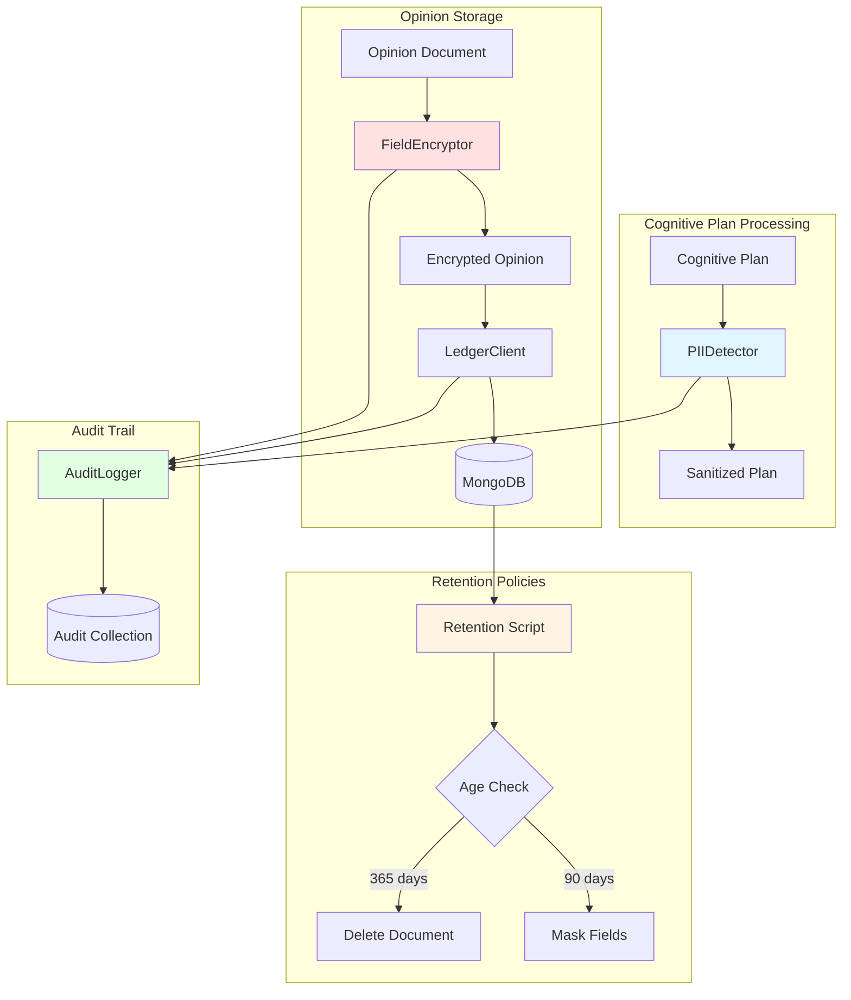

# Guia da Camada de Compliance

## Visão Geral

A Camada de Compliance do Neural Hive Mind fornece proteção abrangente de dados sensíveis através de três pilares principais:

1. **Detecção e Anonimização de PII** - Identificação e sanitização de informações pessoalmente identificáveis usando Microsoft Presidio
2. **Criptografia de Campos** - Proteção de campos sensíveis usando criptografia Fernet (AES-128)
3. **Audit Logging** - Registro completo de operações de compliance para auditoria

## Arquitetura



## Componentes

### 1. PIIDetector

Detecta e anonimiza informações pessoalmente identificáveis em texto.

#### Entidades Detectadas

- `PERSON`: Nomes de pessoas
- `EMAIL_ADDRESS`: Endereços de e-mail
- `PHONE_NUMBER`: Números de telefone
- `CREDIT_CARD`: Números de cartão de crédito
- `LOCATION`: Localizações geográficas
- `DATE_TIME`: Datas e horários
- `IP_ADDRESS`: Endereços IP
- `IBAN_CODE`: Códigos IBAN bancários

#### Estratégias de Anonimização

**Replace (Padrão)**
```python
Entrada:  "João Silva mora em São Paulo"
Saída:    "<PERSON> mora em <LOCATION>"
```

**Mask**
```python
Entrada:  "joao@example.com"
Saída:    "****@*******.***"
```

**Redact**
```python
Entrada:  "João Silva mora em São Paulo"
Saída:    " mora em "
```

**Hash**
```python
Entrada:  "João Silva"
Saída:    "a1b2c3d4e5f6..."  # SHA-256 truncado
```

#### Configuração

```bash
# Habilitar detecção de PII
export ENABLE_PII_DETECTION=true

# Idiomas suportados (requer modelos spaCy)
export PII_DETECTION_LANGUAGES="pt,en"

# Entidades a detectar
export PII_ENTITIES_TO_DETECT="PERSON,EMAIL_ADDRESS,PHONE_NUMBER,LOCATION"

# Estratégia de anonimização
export PII_ANONYMIZATION_STRATEGY="replace"  # replace|mask|redact|hash
```

#### Instalação de Modelos spaCy

```bash
# Instalar modelos de idioma
python -m spacy download pt_core_news_sm  # Português
python -m spacy download en_core_web_sm   # Inglês

# Verificar instalação
python -c "import spacy; nlp = spacy.load('pt_core_news_sm'); print('OK')"
```

### 2. FieldEncryptor

Criptografa campos sensíveis usando Fernet (AES-128 CBC + HMAC SHA-256).

#### Campos Criptografados (Padrão)

- `trace_id`: ID de rastreamento distribuído
- `span_id`: ID de span de tracing
- `intent_id`: ID de intenção do usuário

**Nota**: `correlation_id` **NÃO** é criptografado por padrão, mas seu hash (`correlation_id_hash`) é armazenado e indexado.

#### Gerenciamento de Chaves

**Produção (Recomendado)**
```bash
# Gerar chave
python -c "from cryptography.fernet import Fernet; print(Fernet.generate_key().decode())" > /secure/path/encryption.key
chmod 600 /secure/path/encryption.key

# Configurar path
export ENCRYPTION_KEY_PATH=/secure/path/encryption.key
```

**Desenvolvimento**
```bash
# Chave auto-gerada em /tmp (NÃO usar em produção)
# Warning será emitido nos logs
```

#### Configuração

```bash
# Habilitar criptografia
export ENABLE_FIELD_ENCRYPTION=true

# Path da chave (obrigatório em produção)
export ENCRYPTION_KEY_PATH=/secure/path/encryption.key

# Campos a criptografar (opcional - sobrescreve padrão)
export FIELDS_TO_ENCRYPT="trace_id,span_id,intent_id"
```

#### Formato de Campos Criptografados

```json
{
  "correlation_id": "corr-12345",  // NÃO criptografado
  "correlation_id_hash": "a1b2c3...",  // SHA-256 hash indexado
  "trace_id": "enc:gAAAAABh...",  // Criptografado com prefixo
  "span_id": "enc:gAAAAABh...",
  "_compliance": {
    "encrypted_fields": ["trace_id", "span_id"],
    "encryption_algorithm": "fernet",
    "encryption_version": "1.0",
    "encrypted_at": 1234567890.123
  }
}
```

### 3. AuditLogger

Registra todas as operações de compliance para auditoria e conformidade.

#### Eventos Auditados

- `pii_detected`: PII detectado e anonimizado
- `field_encrypted`: Campo criptografado
- `field_decrypted`: Campo descriptografado (somente para auditoria autorizada)
- `opinion_read`: Leitura de opinião do ledger
- `retention_applied`: Política de retenção aplicada

#### Estrutura de Audit Log

```json
{
  "audit_id": "audit-uuid",
  "timestamp": "2025-01-15T10:30:00.000Z",
  "event_type": "field_encrypted",
  "specialist_type": "business",
  "metadata": {
    "field_name": "trace_id",
    "operation": "encrypt",
    "success": true
  },
  "correlation_id": "corr-12345"  // NÃO criptografado para rastreamento
}
```

#### Configuração

```bash
# Habilitar audit logging
export ENABLE_AUDIT_LOGGING=true

# Coleção MongoDB para logs
export AUDIT_LOG_COLLECTION=compliance_audit_logs

# Retenção de audit logs (dias)
export AUDIT_LOG_RETENTION_DAYS=365
```

#### Consulta de Audit Logs

```python
from pymongo import MongoClient

client = MongoClient(os.getenv('MONGODB_URI'))
db = client['neural_hive']
audit_logs = db['compliance_audit_logs']

# Buscar eventos de criptografia nos últimos 7 dias
from datetime import datetime, timedelta
cutoff = datetime.utcnow() - timedelta(days=7)

events = audit_logs.find({
    'event_type': 'field_encrypted',
    'timestamp': {'$gte': cutoff.isoformat()}
})

for event in events:
    print(f"{event['timestamp']} - {event['metadata']}")
```

## Políticas de Retenção

### Políticas Implementadas

1. **mask_after_90_days**: Mascara campos sensíveis após 90 dias
2. **delete_after_365_days**: Remove documentos após 365 dias

### Campos Mascarados

- `opinion.reasoning`: Raciocínio detalhado
- `opinion.context`: Contexto adicional
- Outros campos configuráveis via `retention_policies.masked_fields`

### Execução de Políticas

#### Script Manual

```bash
# Dry-run (sem modificações)
PYTHONPATH=/path/to/libraries/python:$PYTHONPATH \
MONGODB_URI="mongodb://localhost:27017/neural_hive" \
python libraries/python/neural_hive_specialists/scripts/run_retention_policies.py --dry-run

# Execução real
PYTHONPATH=/path/to/libraries/python:$PYTHONPATH \
MONGODB_URI="mongodb://localhost:27017/neural_hive" \
python libraries/python/neural_hive_specialists/scripts/run_retention_policies.py
```

#### CronJob Kubernetes

```yaml
# k8s/cronjobs/retention-policy-job.yaml
apiVersion: batch/v1
kind: CronJob
metadata:
  name: retention-policy
spec:
  schedule: "0 2 * * *"  # Diariamente às 2h AM
  jobTemplate:
    spec:
      template:
        spec:
          containers:
          - name: retention-policy
            image: neural-hive/specialist:latest
            command:
            - python
            - /app/libraries/python/neural_hive_specialists/scripts/run_retention_policies.py
            env:
            - name: MONGODB_URI
              valueFrom:
                secretKeyRef:
                  name: mongodb-credentials
                  key: uri
```

Aplicar:
```bash
kubectl apply -f k8s/cronjobs/retention-policy-job.yaml -n neural-hive-mind
```

Executar manualmente:
```bash
kubectl create job --from=cronjob/retention-policy manual-retention-$(date +%s) -n neural-hive-mind
```

#### Logs de Retenção

```bash
# Verificar execução do CronJob
kubectl logs -l job-name=retention-policy-manual-xxx -n neural-hive-mind

# Métricas Prometheus
retention_policy_applied_total{policy="mask_after_90_days"} 150
retention_policy_applied_total{policy="delete_after_365_days"} 42
retention_policy_duration_seconds{policy="mask_after_90_days"} 2.5
```

## Métricas Prometheus

### Métricas de PII Detection

```prometheus
# Entidades PII detectadas por tipo
pii_entities_detected_total{specialist_type="business",entity_type="PERSON"} 523

# Anonimizações realizadas por estratégia
pii_anonymization_total{specialist_type="business",strategy="replace"} 523

# Duração de detecção de PII
pii_detection_duration_seconds{specialist_type="business"} 0.150

# Erros de detecção
pii_detection_errors_total{specialist_type="business",error_type="timeout"} 2
```

### Métricas de Criptografia

```prometheus
# Campos criptografados por nome
fields_encrypted_total{specialist_type="business",field_name="trace_id"} 1250

# Campos descriptografados (auditoria)
fields_decrypted_total{specialist_type="business",field_name="trace_id"} 15

# Duração de operações de criptografia
encryption_duration_seconds{specialist_type="business",operation="encrypt"} 0.005

# Erros de criptografia
encryption_errors_total{specialist_type="business",error_type="invalid_key"} 0
```

### Métricas de Retenção

```prometheus
# Políticas aplicadas
retention_policy_applied_total{policy="mask_after_90_days"} 150
retention_policy_applied_total{policy="delete_after_365_days"} 42

# Duração de execução
retention_policy_duration_seconds{policy="mask_after_90_days"} 2.5

# Erros
retention_policy_errors_total{policy="mask_after_90_days"} 0
```

## Configuração Completa

### Variáveis de Ambiente

```bash
# ===== Compliance Layer =====
export ENABLE_COMPLIANCE_LAYER=true

# ===== PII Detection =====
export ENABLE_PII_DETECTION=true
export PII_DETECTION_LANGUAGES="pt,en"
export PII_ENTITIES_TO_DETECT="PERSON,EMAIL_ADDRESS,PHONE_NUMBER,CREDIT_CARD,LOCATION,DATE_TIME"
export PII_ANONYMIZATION_STRATEGY="replace"

# ===== Field Encryption =====
export ENABLE_FIELD_ENCRYPTION=true
export ENCRYPTION_KEY_PATH=/secure/path/encryption.key
export ENCRYPTION_ALGORITHM="fernet"
export FIELDS_TO_ENCRYPT="trace_id,span_id,intent_id"

# ===== Correlation ID Hashing =====
export ENABLE_CORRELATION_HASH=true  # Armazena hash SHA-256 de correlation_id

# ===== Audit Logging =====
export ENABLE_AUDIT_LOGGING=true
export AUDIT_LOG_COLLECTION=compliance_audit_logs
export AUDIT_LOG_RETENTION_DAYS=365

# ===== Retention Policies =====
export RETENTION_POLICIES_ENABLED=true
```

### Valores Helm

```yaml
# helm-charts/specialist-business/values.yaml
compliance:
  enabled: true

  pii_detection:
    enabled: true
    languages: "pt,en"
    entities: "PERSON,EMAIL_ADDRESS,PHONE_NUMBER,LOCATION"
    strategy: "replace"

  field_encryption:
    enabled: true
    algorithm: "fernet"
    # Chave armazenada em Secret Kubernetes
    keySecretName: "encryption-key"
    keySecretKey: "key"
    fields: "trace_id,span_id,intent_id"

  correlation_hash:
    enabled: true  # Hash SHA-256 de correlation_id

  audit_logging:
    enabled: true
    collection: "compliance_audit_logs"
    retention_days: 365

  retention_policies:
    enabled: true
    schedule: "0 2 * * *"  # Diariamente às 2h AM
```

## Troubleshooting

### Problema: Modelos spaCy não encontrados

**Sintoma:**
```
Falha ao carregar modelos spaCy - PII detection desabilitado
```

**Solução:**
```bash
python -m spacy download pt_core_news_sm
python -m spacy download en_core_web_sm

# Verificar instalação
python -c "import spacy; spacy.load('pt_core_news_sm')"
```

### Problema: Chave de criptografia inválida

**Sintoma:**
```
Falha ao inicializar FieldEncryptor - criptografia desabilitada
```

**Solução:**
```bash
# Gerar nova chave
python -c "from cryptography.fernet import Fernet; print(Fernet.generate_key().decode())" > /tmp/new_key.key
chmod 600 /tmp/new_key.key

# Configurar
export ENCRYPTION_KEY_PATH=/tmp/new_key.key
```

### Problema: Presidio timeout em textos longos

**Sintoma:**
```
WARNING: PII detection timeout - returning empty list
```

**Solução:**
```python
# Adicionar pytest-timeout aos testes
@pytest.mark.timeout(10)
def test_pii_detection():
    # Limitar tamanho de texto processado
    max_text_length = 10000
    text = text[:max_text_length]
```

### Problema: Performance de criptografia degradada

**Sintoma:**
Criptografia levando mais de 100ms por documento

**Solução:**
```python
# Verificar uso de cache
# Reutilizar instância de FieldEncryptor
# Não criar nova instância por operação

# Exemplo correto:
class Specialist:
    def __init__(self):
        self.compliance = ComplianceLayer(config, type, metrics)

    def process(self, opinion):
        encrypted = self.compliance.encrypt_opinion_fields(opinion)
```

### Problema: Audit logs crescendo muito

**Sintoma:**
Coleção `compliance_audit_logs` com GB de dados

**Solução:**
```javascript
// Criar índice TTL no MongoDB
db.compliance_audit_logs.createIndex(
  { "timestamp": 1 },
  { expireAfterSeconds: 31536000 }  // 365 dias
)

// Verificar índice
db.compliance_audit_logs.getIndexes()
```

### Problema: Retention policies não executando

**Sintoma:**
Documentos antigos não sendo mascarados/deletados

**Solução:**
```bash
# Verificar CronJob
kubectl get cronjobs -n neural-hive-mind

# Verificar Jobs criados
kubectl get jobs -n neural-hive-mind | grep retention

# Verificar logs
kubectl logs -l job-name=retention-policy-xxx -n neural-hive-mind

# Executar manualmente
kubectl create job --from=cronjob/retention-policy test-run -n neural-hive-mind
```

## Exemplos de Uso

### Exemplo 1: Sanitizar Plano Cognitivo

```python
from neural_hive_specialists.compliance.compliance_layer import ComplianceLayer

# Inicializar
compliance = ComplianceLayer(config, specialist_type='business', metrics=metrics)

# Plano com PII
plan = {
    'plan_id': 'plan-123',
    'tasks': [
        {
            'description': 'Contatar João Silva em joao@example.com'
        }
    ]
}

# Sanitizar
sanitized_plan, metadata = compliance.sanitize_cognitive_plan(plan, language='pt')

print(sanitized_plan['tasks'][0]['description'])
# Output: "Contatar <PERSON> em <EMAIL_ADDRESS>"

print(metadata)
# Output: {
#   'entities_detected': [
#     {'entity_type': 'PERSON', 'field': 'tasks[0].description', ...},
#     {'entity_type': 'EMAIL_ADDRESS', 'field': 'tasks[0].description', ...}
#   ],
#   'anonymization_applied': True,
#   'duration_seconds': 0.250
# }
```

### Exemplo 2: Criptografar Opinião

```python
# Opinião com campos sensíveis
opinion_doc = {
    'opinion_id': 'opinion-456',
    'correlation_id': 'corr-789',
    'trace_id': 'trace-abc',
    'opinion': {
        'verdict': 'approved',
        'confidence': 0.95
    }
}

# Criptografar
encrypted_doc = compliance.encrypt_opinion_fields(opinion_doc)

print(encrypted_doc['trace_id'])
# Output: "enc:gAAAAABh..."

print(encrypted_doc['correlation_id'])
# Output: "corr-789"  (NÃO criptografado)

print(encrypted_doc.get('correlation_id_hash'))
# Output: "a1b2c3d4..."  (SHA-256 hash)

print(encrypted_doc['_compliance'])
# Output: {
#   'encrypted_fields': ['trace_id', 'span_id', 'intent_id'],
#   'encryption_algorithm': 'fernet',
#   'encryption_version': '1.0',
#   'encrypted_at': 1234567890.123
# }
```

### Exemplo 3: Consultar Audit Logs

```python
from pymongo import MongoClient
from datetime import datetime, timedelta

client = MongoClient(os.getenv('MONGODB_URI'))
db = client['neural_hive']
audit_logs = db['compliance_audit_logs']

# Buscar detecções de PII nos últimos 7 dias
cutoff = datetime.utcnow() - timedelta(days=7)

pii_events = audit_logs.find({
    'event_type': 'pii_detected',
    'timestamp': {'$gte': cutoff.isoformat()}
}).sort('timestamp', -1)

for event in pii_events:
    print(f"[{event['timestamp']}] {event['specialist_type']}")
    print(f"  Entidades: {len(event['metadata']['entities_detected'])}")
    for entity in event['metadata']['entities_detected']:
        print(f"    - {entity['entity_type']} (score: {entity['score']:.2f})")
```

## Conformidade e Regulamentações

### LGPD (Lei Geral de Proteção de Dados)

A Camada de Compliance auxilia na conformidade com LGPD através de:

- **Art. 6º (Princípios)**: Finalidade, adequação, necessidade, transparência
  - PII detection e anonimização garantem minimização de dados
  - Audit logs fornecem transparência de operações

- **Art. 46 (Segurança)**: Medidas técnicas e administrativas
  - Criptografia de campos sensíveis (AES-128)
  - Políticas de retenção automatizadas

- **Art. 48 (Direito à informação)**: Audit logs rastreáveis

### GDPR (General Data Protection Regulation)

- **Art. 32 (Security)**: Criptografia e pseudonimização
- **Art. 17 (Right to erasure)**: Políticas de retenção com delete
- **Art. 5(1)(e) (Storage limitation)**: Masking e deleção após período

## Roadmap

### Planejado

- [ ] Suporte a KMS (AWS KMS, GCP KMS, Azure Key Vault)
- [ ] Criptografia de field-level no MongoDB (Client-Side Field Level Encryption)
- [ ] Detecção de PII customizada por domínio
- [ ] Dashboard de compliance e auditoria
- [ ] Exportação de audit logs para SIEM
- [ ] Conformidade com ISO 27001 e SOC 2

## Referências

- [Microsoft Presidio Documentation](https://microsoft.github.io/presidio/)
- [Cryptography (Fernet) Documentation](https://cryptography.io/en/latest/fernet/)
- [LGPD - Lei nº 13.709/2018](http://www.planalto.gov.br/ccivil_03/_ato2015-2018/2018/lei/l13709.htm)
- [GDPR Official Text](https://gdpr-info.eu/)
- [spaCy Language Models](https://spacy.io/models)

## Suporte

Para questões e suporte:

- **Issues**: [GitHub Issues](https://github.com/your-org/neural-hive-mind/issues)
- **Documentação**: [docs/](../docs/)
- **Logs**: Verificar logs de specialist pods em `kubectl logs -n neural-hive-mind`
