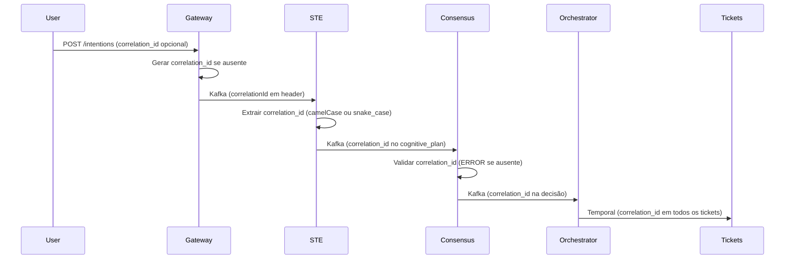

# Estratégia de Propagação de correlation_id

## Visão Geral

O `correlation_id` é um identificador único que permite rastrear uma requisição através de todos os componentes do Neural Hive Mind, desde o Gateway até a execução final dos tickets.

## Fluxo de Propagação



## Implementação por Componente

### 1. Gateway Intencoes

**Arquivo:** `services/gateway-intencoes/src/main.py`

**Comportamento:**
- Se `correlation_id` fornecido pelo usuário: usa o valor fornecido
- Se ausente: gera UUID automaticamente
- Publica no Kafka com header `correlationId` (camelCase)

**Métrica:** `neural_hive_gateway_correlation_id_missing_total`

### 2. Semantic Translation Engine

**Arquivo:** `services/semantic-translation-engine/src/services/orchestrator.py`

**Comportamento:**
- Extrai `correlation_id` com fallback chain:
  1. `trace_context.get('correlation_id')` (headers Kafka)
  2. `intent_envelope.get('correlationId')` (camelCase)
  3. `intent_envelope.get('correlation_id')` (snake_case)
- Normaliza para `snake_case` no cognitive_plan
- Loga formato usado para debug

**Métrica:** `neural_hive_ste_correlation_id_missing_total{format="camelCase|snake_case|none"}`

### 3. Consensus Engine

**Arquivo:** `services/consensus-engine/src/services/consensus_orchestrator.py`

**Comportamento:**
- Extrai `correlation_id` do cognitive_plan (linha 149)
- Se ausente ou vazio: gera UUID e loga ERROR (linhas 150-162)
- Valida antes de publicar decisão (producer valida também)

**Métricas:**
- `neural_hive_consensus_correlation_id_missing_total`
- `neural_hive_consensus_correlation_id_generated_total`

### 4. Orchestrator Dynamic

**Arquivo:** `services/orchestrator-dynamic/src/workflows/orchestration_workflow.py`

**Comportamento:**
- Extrai `correlation_id` da decisão consolidada
- Propaga para todos os execution tickets
- Loga warning se ausente

**Métrica:** `neural_hive_orchestrator_correlation_id_missing_total`

### 5. FlowCOrchestrator

**Arquivo:** `libraries/neural_hive_integration/neural_hive_integration/orchestration/flow_c_orchestrator.py`

**Comportamento:**
- Fallback chain completo (linhas 107-146):
  1. `consolidated_decision.get('correlation_id')`
  2. `cognitive_plan.get('correlation_id')`
  3. Auto-geração via `FlowCContext` validator
- Loga se gerado automaticamente

## Monitoramento

### Métricas Prometheus

```promql
# Taxa de correlation_id ausente por componente
rate(neural_hive_gateway_correlation_id_missing_total[5m])
rate(neural_hive_ste_correlation_id_missing_total[5m])
rate(neural_hive_consensus_correlation_id_missing_total[5m])
rate(neural_hive_orchestrator_correlation_id_missing_total[5m])

# Taxa de geração de UUID no Consensus Engine (indica problema upstream)
rate(neural_hive_consensus_correlation_id_generated_total[5m])
```

### Alertas

- **CorrelationIdMissingHighRate**: Taxa agregada > 0.1 req/s por 5min
- **CorrelationIdConsensusGenerationSpike**: Consensus gerando UUIDs > 0.05 req/s por 10min

### Dashboard Grafana

**URL:** `https://grafana.neural-hive.local/d/correlation-id-propagation`

**Painéis:**
1. Taxa de correlation_id ausente por componente
2. Distribuição de formatos (camelCase vs snake_case)
3. Taxa de geração de UUID no Consensus Engine

## Troubleshooting

### Problema: correlation_id ausente no Consensus Engine

**Sintomas:**
- Logs de ERROR: `VULN-001: correlation_id ausente no cognitive_plan`
- Métrica `neural_hive_consensus_correlation_id_generated_total` aumentando

**Causa Provável:**
- STE não está propagando `correlation_id` corretamente
- Schema Avro `cognitive-plan.avsc` não inclui campo `correlation_id`
- Headers Kafka não estão sendo propagados

**Ação:**
1. Verificar logs do STE para erros de serialização
2. Validar schema Avro: `kubectl exec -it schema-registry-0 -- cat /app/schemas/cognitive-plan/cognitive-plan.avsc`
3. Verificar headers Kafka: `kafka-console-consumer --topic plans.ready --property print.headers=true`

### Problema: correlation_id com formato incorreto

**Sintomas:**
- Métrica `neural_hive_ste_correlation_id_missing_total{format="camelCase"}` alta

**Causa Provável:**
- Gateway publicando com `correlationId` (camelCase) mas STE esperando `correlation_id` (snake_case)

**Ação:**
- Verificar implementação do fallback no STE (linhas 71, 337-338)
- Validar que ambos os formatos são aceitos

## Testes

### Teste E2E

```bash
pytest tests/e2e/test_correlation_id_propagation.py -v
```

**Valida:**
- Propagação Gateway → STE → Consensus → Orchestrator → Tickets
- Geração automática quando ausente
- Conversão camelCase → snake_case

### Teste Manual

```bash
# 1. Enviar intent com correlation_id explícito
curl -X POST http://gateway:8000/intentions \
  -H "Content-Type: application/json" \
  -d '{
    "text": "Criar API REST",
    "language": "pt-BR",
    "domain": "TECHNICAL",
    "correlation_id": "test-correlation-123"
  }'

# 2. Verificar logs de cada componente
kubectl logs -l app=gateway-intencoes | grep "test-correlation-123"
kubectl logs -l app=semantic-translation-engine | grep "test-correlation-123"
kubectl logs -l app=consensus-engine | grep "test-correlation-123"
kubectl logs -l app=orchestrator-dynamic | grep "test-correlation-123"

# 3. Verificar MongoDB
kubectl exec -it mongodb-0 -- mongosh neural_hive --eval '
  db.cognitive_ledger.findOne({"correlation_id": "test-correlation-123"})
  db.consensus_decisions.findOne({"correlation_id": "test-correlation-123"})
  db.execution_tickets.findOne({"correlation_id": "test-correlation-123"})
'

# 4. Verificar métricas Prometheus
curl -s http://prometheus:9090/api/v1/query?query=neural_hive_consensus_correlation_id_missing_total
```

## Referências

- Schema Avro: `schemas/cognitive-plan/cognitive-plan.avsc`
- Schema Avro: `schemas/consolidated-decision/consolidated-decision.avsc`
- Schema Avro: `schemas/execution-ticket/execution-ticket.avsc`
- Código STE: `services/semantic-translation-engine/src/services/orchestrator.py:71,337-338`
- Código Consensus: `services/consensus-engine/src/services/consensus_orchestrator.py:149-162`
- Código FlowC: `libraries/neural_hive_integration/neural_hive_integration/orchestration/flow_c_orchestrator.py:107-146`
