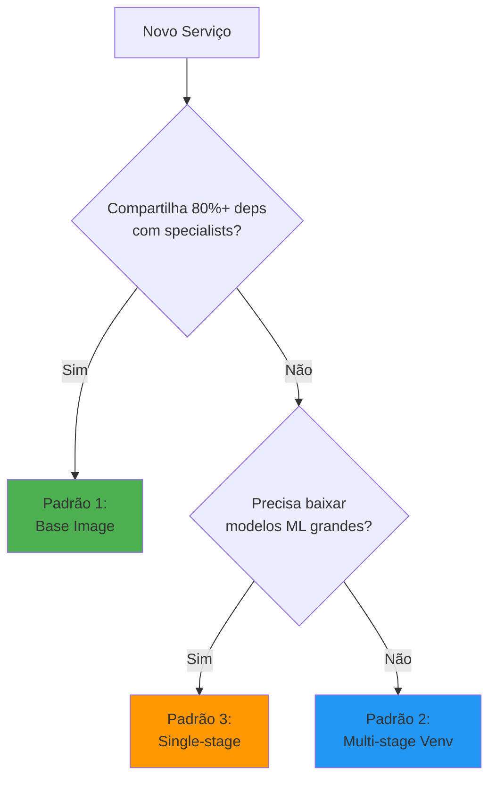

# Padrões de Build Docker - Neural Hive-Mind

## Visão Geral

Este documento define os 3 padrões de build aprovados no projeto Neural Hive-Mind.

## Padrão 1: Base Image (Specialists e Optimizer)

**Quando usar**: Serviços que compartilham 80%+ das dependências

**Exemplo**: specialist-technical, specialist-business, optimizer-agents

```dockerfile
FROM neural-hive-mind/python-specialist-base:1.0.0
WORKDIR /app
RUN groupadd -r specialist && useradd -r -g specialist specialist
COPY services/specialist-technical/src /app/src
USER specialist
CMD ["python", "src/main.py"]
```

**Benefícios**: Build em ~2min, imagem ~1.3GB

---

## Padrão 2: Multi-stage com Venv (Serviços Gerais)

**Quando usar**: Serviços com requisitos únicos, precisam de build tools

**Exemplo**: queen-agent, execution-ticket-service, scout-agents

```dockerfile
FROM python:3.11-slim AS builder
WORKDIR /app
RUN apt-get update && apt-get install -y --no-install-recommends gcc g++ && rm -rf /var/lib/apt/lists/*
COPY requirements.txt .
RUN python -m venv /opt/venv && \
    /opt/venv/bin/pip install --no-cache-dir --upgrade pip && \
    /opt/venv/bin/pip install --no-cache-dir -r requirements.txt

FROM python:3.11-slim
WORKDIR /app
RUN useradd -m -u 1000 appuser
COPY --from=builder /opt/venv /opt/venv
COPY src/ ./src/
ENV PATH="/opt/venv/bin:$PATH"
USER appuser
CMD ["python", "-m", "src.main"]
```

**Benefícios**: Imagem final sem gcc/g++, isolamento via venv

---

## Padrão 3: Single-stage (Serviços com Modelos ML)

**Quando usar**: Serviços que precisam baixar modelos grandes (PyTorch, spaCy)

**Exemplo**: gateway-intencoes

```dockerfile
FROM python:3.11-slim
RUN apt-get update && apt-get install -y gcc g++ ffmpeg && rm -rf /var/lib/apt/lists/*
WORKDIR /app
COPY requirements.txt .
RUN pip install --no-cache-dir --upgrade pip && \
    pip install --no-cache-dir -r requirements.txt && \
    python -m spacy download pt_core_news_sm
COPY src/ ./src/
RUN useradd -m appuser && chown -R appuser:appuser /app
USER appuser
CMD ["uvicorn", "main:app", "--host", "0.0.0.0", "--port", "8000"]
```

**Benefícios**: Modelos baixados uma vez, cache de layers eficiente

---

## Decisão: Qual Padrão Usar?



## Anti-Padrões

❌ **Instalar bibliotecas locais manualmente no Dockerfile**
```dockerfile
# ERRADO
COPY libraries/python/neural_hive_observability /tmp/lib
RUN pip install /tmp/lib
COPY requirements.txt .
RUN pip install -r requirements.txt  # neural_hive_observability instalado 2x
```

✅ **Incluir bibliotecas locais em requirements.txt**
```dockerfile
# CORRETO
COPY requirements.txt .
RUN pip install -r requirements.txt  # neural_hive_observability instalado 1x
```

---

❌ **Instalar mesma dependência em múltiplos lugares**
```dockerfile
# ERRADO
RUN pip install torch==2.1.0
COPY requirements.txt .  # contém torch==2.1.2
RUN pip install -r requirements.txt  # conflito!
```

✅ **Usar apenas requirements.txt**
```dockerfile
# CORRETO
COPY requirements.txt .
RUN pip install -r requirements.txt
```
