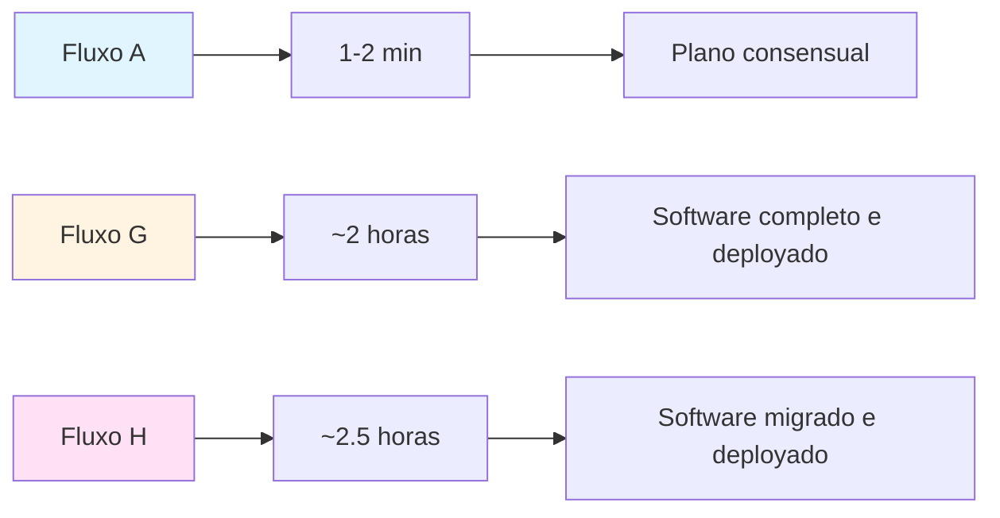
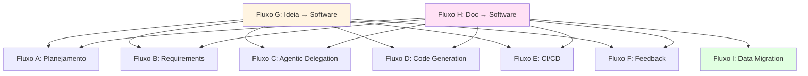

# 📊 Comparação: Fluxos A, G e H

## Resumo: Todos Permitem Entrada por Intenção

**Sim, os fluxos A, G e H todos permitem entrada por intenção, mas o objetivo é diferente:**

| Fluxo | Tipo de Entrada | Objetivo | É End-to-End? |
|-------|----------------|-----------|----------------|
| **Fluxo A** | Intenção de usuário | **Planejar** o software | ❌ Não (só iniciação) |
| **Fluxo G** | Intenção de usuário | **Criar** software do zero | ✅ Sim (completo) |
| **Fluxo H** | Documentação legada (também pode ser intenção) | **Migrar** software existente | ✅ Sim (completo) |

---

## Onde Residem as Diferenças a Nível de Fluxo End-to-End?

### 📍 Diferença 1: Abrangência do Fluxo



| Aspecto | Fluxo A | Fluxo G | Fluxo H |
|---------|---------|---------|---------|
| **Abrangência** | Apenas planejamento | Crição completa | Migração completa |
| **Cobre** | Intenção → Plano | Ideia → Software Deployado | Doc → Software Migrado |
| **Sistemas** | A, B, C | A, B, C, D, E, F | A, B, C, D, E, F + Ingestion |

---

### 📍 Diferença 2: Onde Cada Fluxo Termina

#### Fluxo A: Termina no Plano
```
Intenção → STE → Consensus Engine → ✅ PLANO
   ↓           ↓          ↓
  1-2 min    30s       30s

Total: 1-2 minutos
Saída: Plano consensual (JSON)
```

#### Fluxo G: Termina no Software Deployado
```
Ideia → STE → Consensus → Requirements → Architecture → Agentic Delegation 
   ↓
Code Forge → Test Generation → Documentation → CI/CD → ✅ SOFTWARE DEPLOYADO
   ↓
~2 horas depois
Saída: Sistema completo em produção
```

#### Fluxo H: Termina no Software Migrado
```
Doc → Ingestion → Parse → Intenção → STE → Consensus → Requirements → Architecture
   ↓
Agentic Delegation → Code Forge → Test Generation → Documentation → CI/CD
   ↓
Data Migration → Cutover → ✅ SOFTWARE MIGRADO
   ↓
~2.5 horas depois
Saída: Sistema moderno com dados migrados
```

---

### 📍 Diferença 3: Número de Etapas


| Fluxo | Etapas | O que é feito em cada |
|-------|--------|---------------------|
| **Fluxo A** | 3 | Intenção → Tradução → Consenso |
| **Fluxo G** | 12 | Ideia → ... → Software deployado |
| **Fluxo H** | 14 | Doc → ... → Software migrado (+2 etapas) |

---

### 📍 Diferença 4: Tipo de Output Final

| Fluxo | Output Final | Formato | Próximo Passo |
|-------|------------|---------|--------------|
| **Fluxo A** | Plano consensual | JSON | Alguém precisa implementar (manualmente ou via Fluxos B-F) |
| **Fluxo G** | Software deployado | Sistema em produção | Pronto para uso |
| **Fluxo H** | Software migrado | Sistema em produção | Pronto para uso |

---

### 📍 Diferença 5: Dependência de Humano

| Fluxo | Dependência Humana | Quando | Necessário? |
|-------|-------------------|---------|-------------|
| **Fluxo A** | Não | Nenhuma | ❌ Não |
| **Fluxo G** | Não | Nenhuma | ❌ Não |
| **Fluxo H** | Opcional | Validação de cutover | ❌ Não (pode ser 100% automático) |

---

### 📍 Diferença 6: O que Acontece Depois do Fluxo

#### Fluxo A: Alguém precisa continuar
```
✅ Fluxo A Completo (1-2 min)
   ↓
? Quem continua?
   ↓
   Opção 1: Humano implementa manualmente
   Opção 2: Chama Fluxo B (Requirements)
   Opção 3: Chama Fluxo G (ideia → software completo)
   Opção 4: Chama Fluxo H (doc → software completo)
```

#### Fluxo G: Pronto para uso
```
✅ Fluxo G Completo (~2 horas)
   ↓
🎉 Pronto para uso!
   ↓
   Acesso: https://app-url.com
   Monitoramento: Disponível
   Feedback: Automático via Fluxo F
```

#### Fluxo H: Pronto para uso
```
✅ Fluxo H Completo (~2.5 horas)
   ↓
🎉 Pronto para uso!
   ↓
   Acesso: https://app-url.com
   Dados: Migrados e validados
   Legado: Desativado (após validação)
```

---

### 📍 Diferença 7: Quando Usar Cada Fluxo

| Situação | Fluxo Ideal | Por quê? |
|----------|-------------|---------|
| **Preciso apenas planejar** | **Fluxo A** | Rápido, foco em requisitos e arquitetura |
| **Tenho uma ideia, quero software pronto** | **Fluxo G** | Do zero ao deploy, completo |
| **Tenho legado, quero modernizar** | **Fluxo H** | Com preservação de dados |
| **Preciso só gerar código** | **Fluxo D** | Apenas artefatos, sem deploy |
| **Preciso só deployar** | **Fluxo E** | CI/CD automatizado |

---

### 📍 Diferença 8: Relação Hierárquica



**Interpretação:**
- **Fluxo A:** Subconjunto de G e H (apenas o início)
- **Fluxo G:** Combina A+B+C+D+E+F (sem H)
- **Fluxo H:** Combina A+B+C+D+E+F+I (com Data Migration)

---

## 🎯 Resumo das Diferenças End-to-End

| Diferença | Fluxo A | Fluxo G | Fluxo H |
|----------|---------|---------|---------|
| **Abrangência** | 📋 Planejamento | 🚀 Criação completa | 🔄 Migração completa |
| **Etapas** | 3 | 12 | 14 |
| **Tempo** | 1-2 min | ~2 horas | ~2.5 horas |
| **Saída** | Plano JSON | Software em produção | Software em produção |
| **Próximo passo** | Implementar (humano ou outro fluxo) | Usar | Usar |
| **Depende de humano?** | Não | Não | Não |
| **É completo?** | ❌ Não | ✅ Sim | ✅ Sim |

---

## 📝 Conclusão

**Sim, todos os fluxos permitem entrada por intenção, mas:**

1. **Fluxo A:** É só o **começo** - gera um plano que alguém precisa implementar
2. **Fluxo G:** É o **tudo** - vai da ideia até o software deployado
3. **Fluxo H:** É o **tudo mais** - vai da documentação até o software migrado (inclui data migration)

**A principal diferença a nível de fluxo end-to-end é:**
- **Fluxo A** = Apenas planejamento (incompleto)
- **Fluxos G e H** = Execução completa (completa)

---

*Documento criado em 2026-04-15*
*Versão: 1.0.0*

