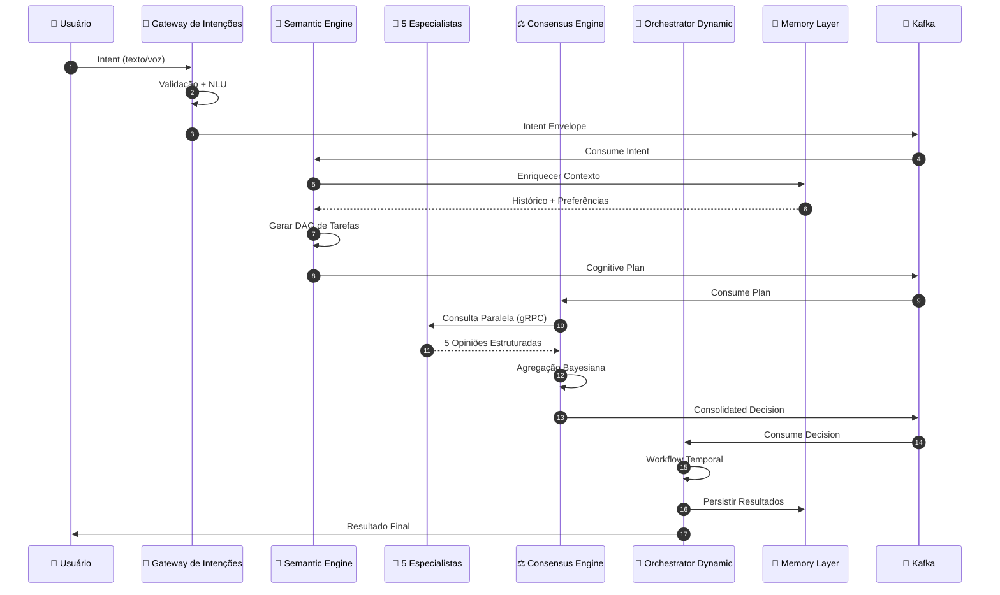
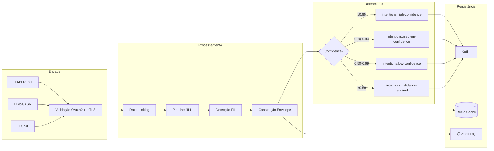
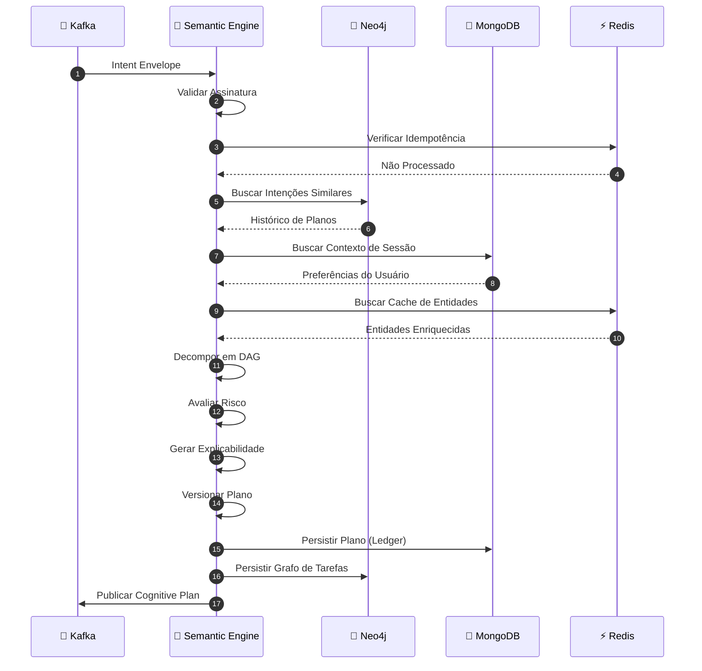
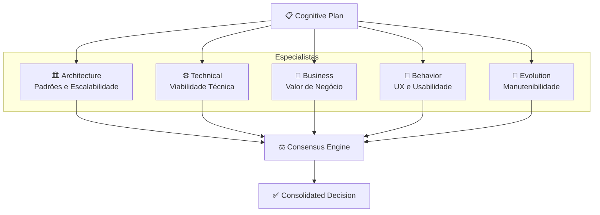
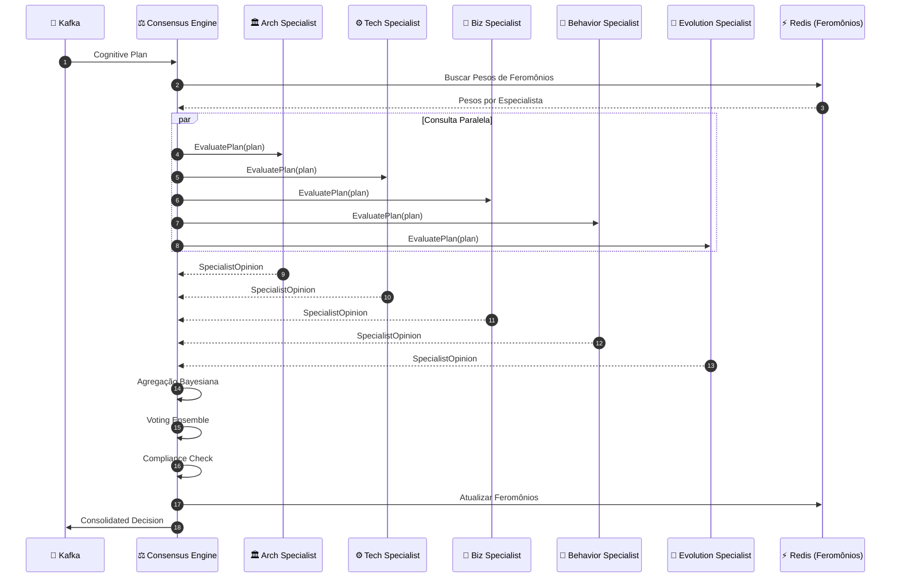
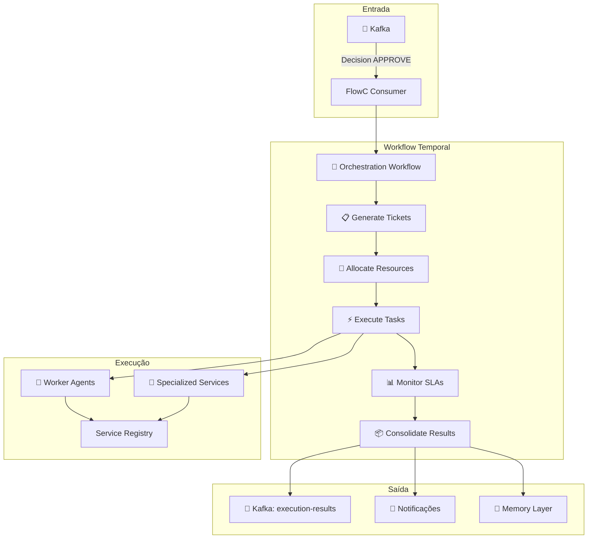
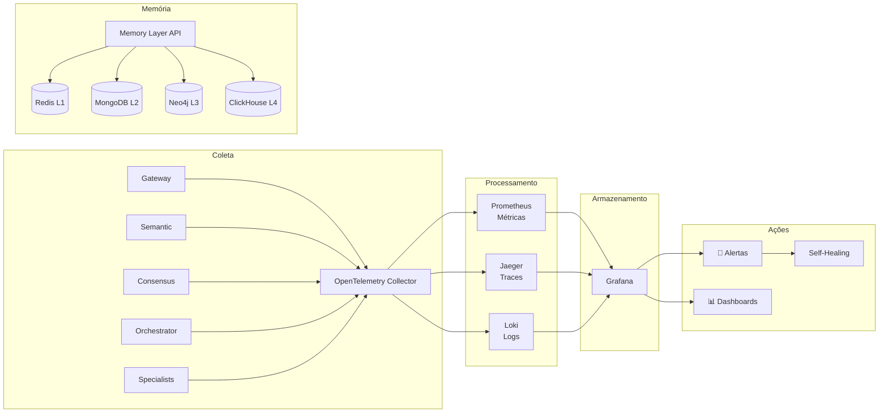
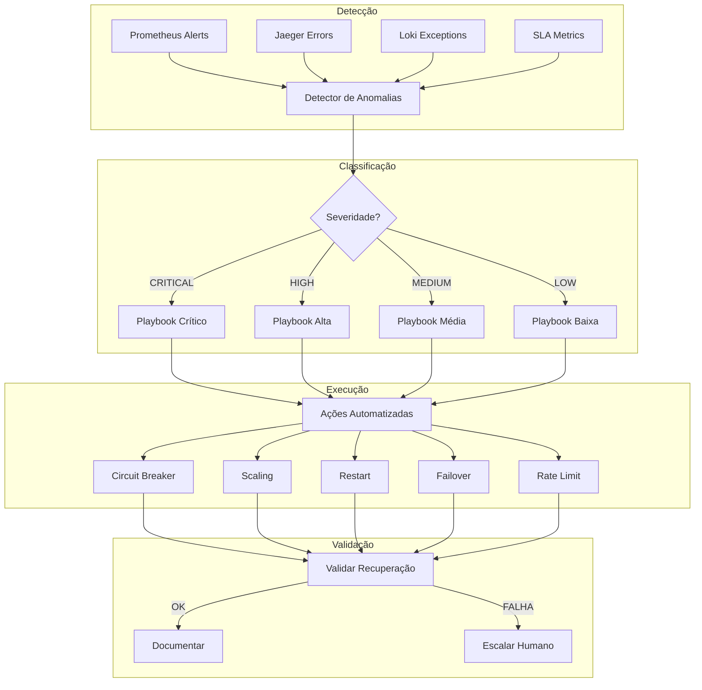
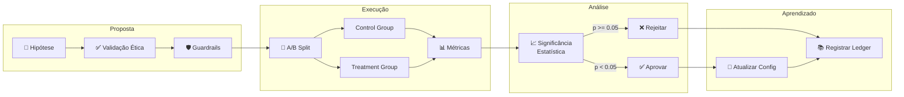
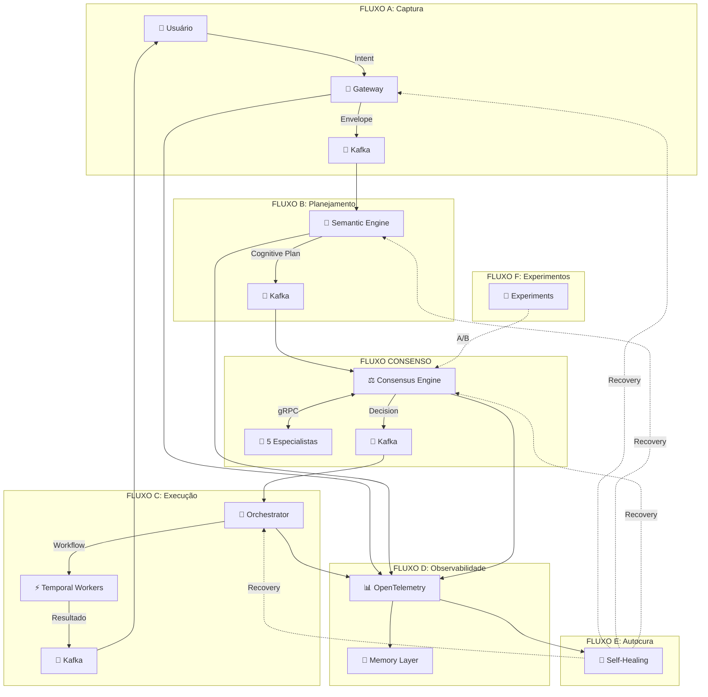

# Fluxo Completo do Neural Hive-Mind - Detalhamento Passo a Passo

> **Versão**: 1.0.0
> **Última Atualização**: Janeiro 2026
> **Público-Alvo**: Desenvolvedores, Arquitetos, DevOps

---

## Sumário

1. [Sumário Executivo](#sumário-executivo)
2. [Visão Geral da Arquitetura](#-visão-geral-da-arquitetura)
3. [FLUXO A: Captura e Normalização de Intenções](#-fluxo-a-captura-e-normalização-de-intenções)
4. [FLUXO B: Geração de Planos Cognitivos](#-fluxo-b-geração-de-planos-cognitivos)
5. [FLUXO DE CONSENSO: Avaliação Multi-Especialista](#-fluxo-de-consenso-avaliação-multi-especialista)
6. [FLUXO C: Orquestração Dinâmica de Execução](#-fluxo-c-orquestração-dinâmica-de-execução)
7. [FLUXO D: Observabilidade Holística](#-fluxo-d-observabilidade-holística)
8. [FLUXO E: Autocura e Resolução Proativa](#-fluxo-e-autocura-e-resolução-proativa)
9. [FLUXO F: Gestão de Experimentos](#-fluxo-f-gestão-de-experimentos)
10. [Segurança e Governança](#-segurança-e-governança)
11. [Métricas Globais do Sistema](#-métricas-globais-do-sistema)
12. [Fluxo Completo Resumido](#-fluxo-completo-resumido)
13. [Próximos Passos e Evolução](#-próximos-passos-e-evolução)
14. [Referências de Documentação](#-referências-de-documentação)
15. [Conceitos-Chave](#-conceitos-chave)
16. [Diferenciais da Arquitetura](#-diferenciais-da-arquitetura)

---

## Sumário Executivo

O **Neural Hive-Mind** é um sistema de inteligência coletiva que transforma intenções humanas em ações executáveis através de um processo multi-etapas envolvendo captura semântica, planejamento cognitivo, consenso entre especialistas neurais, orquestração dinâmica e observabilidade completa.

**Características Principais:**
- **6 Fluxos Operacionais** integrados (A-F)
- **5 Especialistas Neurais** colaborando via consenso bayesiano
- **Latência E2E P95** < 2 segundos
- **Disponibilidade** > 99.9%
- **Autocura** com MTTR < 90 segundos

---

## 📋 Visão Geral da Arquitetura

### Diagrama de Interação entre Componentes



### Tabela de Componentes Principais

| Componente | Porta | Tecnologia | Responsabilidade |
|------------|-------|------------|------------------|
| Gateway de Intenções | 8080 | FastAPI, Redis, Kafka | Captura e normalização de intenções |
| Semantic Translation Engine | 8081 | FastAPI, Neo4j, MongoDB | Geração de planos cognitivos |
| Consensus Engine | 8082 | FastAPI, gRPC, Redis | Agregação de opiniões e consenso |
| Orchestrator Dynamic | 8083 | FastAPI, Temporal | Execução orquestrada de tarefas |
| Memory Layer API | 8084 | FastAPI, Multi-DB | Persistência e consulta unificada |
| Specialist Architecture | 50051 | gRPC, Python | Avaliação arquitetural |
| Specialist Technical | 50052 | gRPC, Python | Viabilidade técnica |
| Specialist Business | 50053 | gRPC, Python | Valor de negócio |
| Specialist Behavior | 50054 | gRPC, Python | UX e usabilidade |
| Specialist Evolution | 50055 | gRPC, Python | Manutenibilidade |

### Referências de Código

- `services/gateway-intencoes/` - Gateway de Intenções
- `services/semantic-translation-engine/` - Semantic Engine
- `services/consensus-engine/` - Consensus Engine
- `services/orchestrator-dynamic/` - Orchestrator Dynamic
- `services/memory-layer-api/` - Memory Layer
- `services/specialist-architecture/` - Especialista de Arquitetura
- `services/specialist-technical/` - Especialista Técnico
- `services/specialist-business/` - Especialista de Negócios
- `services/specialist-behavior/` - Especialista de Comportamento
- `services/specialist-evolution/` - Especialista de Evolução

---

## 🔄 FLUXO A: Captura e Normalização de Intenções

### A1: Visão Geral

O Fluxo A é responsável por receber intenções humanas de múltiplos canais, processá-las linguisticamente e publicá-las no barramento de eventos de forma normalizada.

**Serviço Principal**: `services/gateway-intencoes/src/main.py`
**Porta**: 8080 (HTTP/REST)
**Tecnologias**: FastAPI, Redis, Kafka Producer

### A2: Diagrama do Fluxo



### A3: Etapas Detalhadas

#### A3.1: Recepção Multicanal

**Endpoints:**
- `POST /intentions` - Recebe intenções em texto
- `POST /intentions/voice` - Recebe áudio para processamento ASR

**Middleware de Segurança:**
- `services/gateway-intencoes/src/middleware/auth_middleware.py` - Autenticação OAuth2 + mTLS
- `services/gateway-intencoes/src/middleware/rate_limiter.py` - Limitação de taxa por tenant

**Exemplo de Request:**
```json
{
  "content": "Quero criar um novo microserviço de pagamentos com integração Stripe",
  "channel": "api",
  "user_id": "usr_12345",
  "session_id": "sess_abc123",
  "locale": "pt-BR",
  "metadata": {
    "client_version": "2.1.0",
    "platform": "web"
  }
}
```

#### A3.2: Pré-processamento Linguístico

**Pipelines:**
- `services/gateway-intencoes/src/pipelines/nlu_pipeline.py` - Processamento de Linguagem Natural
- `services/gateway-intencoes/src/pipelines/asr_pipeline.py` - Reconhecimento Automático de Fala

**Etapas do NLU Pipeline:**
1. Detecção de idioma (langdetect)
2. Tokenização e normalização
3. Extração de entidades (NER)
4. Classificação de intenção
5. Análise de sentimento
6. Detecção e mascaramento de PII

#### A3.3: Construção do Intent Envelope

**Modelo**: `services/gateway-intencoes/src/models/intent_envelope.py`

**Exemplo de Intent Envelope Completo:**
```json
{
  "intent_id": "int_7f8a9b2c-4d5e-6f7a-8b9c-0d1e2f3a4b5c",
  "correlation_id": "corr_1a2b3c4d-5e6f-7a8b-9c0d-1e2f3a4b5c6d",
  "timestamp": "2026-01-15T14:30:00.000Z",
  "version": "1.0.0",
  "intent": {
    "raw_content": "Quero criar um novo microserviço de pagamentos com integração Stripe",
    "normalized_content": "criar microserviço pagamentos integração stripe",
    "detected_language": "pt-BR",
    "intent_type": "CREATE_SERVICE",
    "entities": [
      {"type": "SERVICE_TYPE", "value": "microserviço", "confidence": 0.95},
      {"type": "DOMAIN", "value": "pagamentos", "confidence": 0.92},
      {"type": "INTEGRATION", "value": "Stripe", "confidence": 0.98}
    ],
    "sentiment": "neutral",
    "urgency": "normal"
  },
  "confidence": {
    "overall": 0.89,
    "intent_classification": 0.92,
    "entity_extraction": 0.87,
    "language_detection": 0.99
  },
  "user": {
    "user_id": "usr_12345",
    "tenant_id": "tenant_acme",
    "session_id": "sess_abc123",
    "roles": ["developer", "team_lead"],
    "preferences": {
      "notification_channel": "slack",
      "language": "pt-BR"
    }
  },
  "constraints": {
    "max_execution_time_ms": 300000,
    "priority": "normal",
    "requires_approval": false,
    "budget_limit_usd": 1000
  },
  "trace_context": {
    "trace_id": "trace_abc123def456",
    "span_id": "span_001",
    "parent_span_id": null,
    "baggage": {
      "environment": "production",
      "region": "us-east-1"
    }
  },
  "security": {
    "pii_detected": false,
    "pii_masked": false,
    "classification": "internal",
    "audit_hash": "sha512:abc123..."
  }
}
```

#### A3.4: Publicação no Kafka

**Producer**: `services/gateway-intencoes/src/kafka/producer.py`

**Tópicos por Confiança:**
| Tópico | Critério | Ação Subsequente |
|--------|----------|------------------|
| `intentions.high-confidence` | confidence ≥ 0.85 | Processamento direto |
| `intentions.medium-confidence` | 0.70 ≤ confidence < 0.85 | Enriquecimento adicional |
| `intentions.low-confidence` | 0.50 ≤ confidence < 0.70 | Clarificação opcional |
| `intentions.validation-required` | confidence < 0.50 | Intervenção humana |

**Garantias de Entrega:**
- Exactly-once semantics via transações Kafka
- Ordenação garantida por partition key (user_id)
- Schema validation via Apicurio Schema Registry

#### A3.5: Cache e Auditoria

**Redis Client**: `services/gateway-intencoes/src/cache/redis_client.py`

**Estratégia de Cache:**
- Chave: `intent:{intent_id}`
- TTL: 3600 segundos (1 hora)
- Propósito: Idempotência e consulta rápida

**Auditoria:**
- Log estruturado com hash SHA-512 do envelope
- Campos auditados: timestamp, user_id, intent_type, confidence, source_ip

### A4: Métricas do Fluxo A

| Métrica | SLO | Descrição |
|---------|-----|-----------|
| `gateway_latency_p95` | < 200ms | Latência de processamento |
| `gateway_rejection_rate` | < 2% | Taxa de rejeição por validação |
| `gateway_audit_coverage` | 100% | Cobertura de auditoria |
| `gateway_pii_detection_rate` | > 99% | Detecção de dados sensíveis |

---

## 🧩 FLUXO B: Geração de Planos Cognitivos

### B1: Visão Geral

O Fluxo B transforma Intent Envelopes em Planos Cognitivos estruturados (DAGs de tarefas) com avaliação de risco e explicabilidade.

**Serviço Principal**: `services/semantic-translation-engine/src/main.py`
**Orquestrador**: `services/semantic-translation-engine/src/services/orchestrator.py`
**Tecnologias**: FastAPI, Neo4j, MongoDB, Redis, Kafka

### B2: Diagrama do Fluxo



### B3: Etapas Detalhadas

#### B3.1: Receber e Validar Intent Envelope

**Consumer**: `services/semantic-translation-engine/src/consumers/intent_consumer.py`

**Validações:**
1. Verificação de assinatura do envelope
2. Verificação de idempotência via Redis
3. Extração de trace context (OpenTelemetry)
4. Validação de schema Avro

#### B3.2: Enriquecer Contexto

**Componentes de Enriquecimento:**
- `services/semantic-translation-engine/src/services/semantic_parser.py` - Parser semântico
- `services/semantic-translation-engine/src/clients/neo4j_client.py` - Cliente Neo4j
- `services/semantic-translation-engine/src/clients/mongodb_client.py` - Cliente MongoDB
- `services/semantic-translation-engine/src/clients/redis_client.py` - Cliente Redis

**Fontes de Contexto:**
| Fonte | Dados | Latência |
|-------|-------|----------|
| Neo4j | Intenções similares, grafo de relacionamentos | < 50ms |
| MongoDB | Histórico de sessão, preferências | < 30ms |
| Redis | Cache de entidades, contexto recente | < 5ms |

#### B3.3: Decompor em DAG de Tarefas

**DAG Generator**: `services/semantic-translation-engine/src/services/dag_generator.py`

**Processo de Decomposição:**
1. Análise sintática da intenção
2. Identificação de sub-objetivos
3. Geração de nós de tarefa
4. Estabelecimento de dependências
5. Ordenação topológica
6. Validação de ciclos

**Estrutura TaskNode:**
```json
{
  "task_id": "task_001",
  "task_type": "CREATE_SERVICE",
  "description": "Criar estrutura base do microserviço de pagamentos",
  "dependencies": [],
  "estimated_duration_ms": 30000,
  "required_capabilities": ["code_generation", "docker"],
  "parameters": {
    "service_name": "payment-service",
    "framework": "fastapi",
    "database": "postgresql"
  },
  "retry_policy": {
    "max_attempts": 3,
    "backoff_multiplier": 2.0
  }
}
```

#### B3.4: Avaliar Risco

**Risk Scorer**: `services/semantic-translation-engine/src/services/risk_scorer.py`

**Fatores de Risco:**
| Fator | Peso | Descrição |
|-------|------|-----------|
| `complexity` | 0.25 | Número de tarefas e dependências |
| `security_impact` | 0.30 | Acesso a dados sensíveis |
| `blast_radius` | 0.20 | Serviços afetados |
| `novelty` | 0.15 | Similaridade com execuções anteriores |
| `user_experience` | 0.10 | Impacto na experiência do usuário |

**Classificação de Risco:**
| Band | Score Range | Ação |
|------|-------------|------|
| `low` | 0.0 - 0.3 | Execução automática |
| `medium` | 0.3 - 0.6 | Consenso padrão |
| `high` | 0.6 - 0.8 | Consenso reforçado |
| `critical` | 0.8 - 1.0 | Aprovação humana obrigatória |

#### B3.5: Gerar Explicabilidade

**Explainability Generator**: `services/semantic-translation-engine/src/services/explainability_generator.py`

**Saída:**
```json
{
  "explainability_token": "exp_abc123",
  "reasoning_summary": "Plano gerado com 5 tarefas sequenciais para criar microserviço de pagamentos. Risco médio devido à integração externa com Stripe.",
  "key_decisions": [
    "Framework FastAPI selecionado por compatibilidade com stack existente",
    "PostgreSQL escolhido para persistência transacional",
    "Integração Stripe via SDK oficial"
  ],
  "confidence_factors": [
    {"factor": "intent_clarity", "score": 0.92},
    {"factor": "historical_success", "score": 0.85},
    {"factor": "resource_availability", "score": 0.90}
  ]
}
```

#### B3.6: Versionar e Publicar Plano

**Modelo**: `services/semantic-translation-engine/src/models/cognitive_plan.py`
**Schema Avro**: `schemas/cognitive-plan/cognitive-plan.avsc`

**Exemplo de Cognitive Plan Completo:**
```json
{
  "plan_id": "plan_9a8b7c6d-5e4f-3a2b-1c0d-9e8f7a6b5c4d",
  "intent_id": "int_7f8a9b2c-4d5e-6f7a-8b9c-0d1e2f3a4b5c",
  "correlation_id": "corr_1a2b3c4d-5e6f-7a8b-9c0d-1e2f3a4b5c6d",
  "version": "1.0.0",
  "created_at": "2026-01-15T14:30:05.000Z",
  "status": "PENDING_CONSENSUS",
  "intent_summary": {
    "original": "Criar microserviço de pagamentos com integração Stripe",
    "interpreted": "Provisionar novo microserviço para processamento de pagamentos utilizando gateway Stripe"
  },
  "task_dag": {
    "nodes": [
      {
        "task_id": "task_001",
        "task_type": "SCAFFOLD_SERVICE",
        "description": "Gerar estrutura base do serviço",
        "dependencies": [],
        "estimated_duration_ms": 15000
      },
      {
        "task_id": "task_002",
        "task_type": "CONFIGURE_DATABASE",
        "description": "Configurar PostgreSQL e migrations",
        "dependencies": ["task_001"],
        "estimated_duration_ms": 20000
      },
      {
        "task_id": "task_003",
        "task_type": "INTEGRATE_STRIPE",
        "description": "Implementar integração com Stripe SDK",
        "dependencies": ["task_001"],
        "estimated_duration_ms": 45000
      },
      {
        "task_id": "task_004",
        "task_type": "CREATE_API_ENDPOINTS",
        "description": "Criar endpoints REST para pagamentos",
        "dependencies": ["task_002", "task_003"],
        "estimated_duration_ms": 30000
      },
      {
        "task_id": "task_005",
        "task_type": "DEPLOY_SERVICE",
        "description": "Deploy em ambiente de staging",
        "dependencies": ["task_004"],
        "estimated_duration_ms": 60000
      }
    ],
    "edges": [
      {"from": "task_001", "to": "task_002"},
      {"from": "task_001", "to": "task_003"},
      {"from": "task_002", "to": "task_004"},
      {"from": "task_003", "to": "task_004"},
      {"from": "task_004", "to": "task_005"}
    ],
    "critical_path": ["task_001", "task_003", "task_004", "task_005"],
    "total_estimated_duration_ms": 150000
  },
  "risk_assessment": {
    "risk_score": 0.45,
    "risk_band": "medium",
    "factors": {
      "complexity": 0.40,
      "security_impact": 0.60,
      "blast_radius": 0.30,
      "novelty": 0.50,
      "user_experience": 0.20
    },
    "mitigations": [
      "Utilizar sandbox Stripe para testes",
      "Implementar circuit breaker para chamadas externas",
      "Habilitar feature flag para rollback rápido"
    ]
  },
  "explainability": {
    "token": "exp_abc123",
    "reasoning_summary": "Plano estruturado em 5 tarefas com caminho crítico de 150s",
    "confidence": 0.87
  },
  "context": {
    "similar_plans_count": 12,
    "avg_historical_success_rate": 0.94,
    "user_preference_alignment": 0.91
  },
  "trace_context": {
    "trace_id": "trace_abc123def456",
    "span_id": "span_002"
  }
}
```

**Persistência:**
- MongoDB: Ledger imutável com versionamento
- Neo4j: Grafo de relacionamentos entre tarefas

**Producer**: `services/semantic-translation-engine/src/producers/plan_producer.py`
**Tópico Kafka**: `cognitive-plans.ready`

### B4: Métricas do Fluxo B

| Métrica | SLO | Descrição |
|---------|-----|-----------|
| `semantic_latency_p95` | < 120ms | Latência de geração de plano |
| `semantic_fallback_rate` | < 3% | Taxa de fallback heurístico |
| `semantic_explainability_coverage` | 100% | Cobertura de explicabilidade |
| `semantic_dag_validation_success` | > 99% | Validação de DAGs gerados |

---

## 🤝 FLUXO DE CONSENSO: Avaliação Multi-Especialista

### C1: Visão Geral

O Fluxo de Consenso orquestra a avaliação colaborativa de Planos Cognitivos por 5 especialistas neurais, agregando opiniões via método bayesiano e sistema de feromônios.

**Serviço Principal**: `services/consensus-engine/src/main.py`
**Orquestrador**: `services/consensus-engine/src/services/consensus_orchestrator.py`
**Tecnologias**: FastAPI, gRPC, Redis, Kafka

### C2: Os 5 Especialistas Neurais



**Tabela de Especialistas:**

| Especialista | Serviço | Porta gRPC | Foco Principal | Critérios de Avaliação |
|--------------|---------|------------|----------------|------------------------|
| Architecture | `services/specialist-architecture/` | 50051 | Padrões arquiteturais | Estrutura, acoplamento, coesão, escalabilidade |
| Technical | `services/specialist-technical/` | 50052 | Viabilidade técnica | Stack, APIs, integrações, performance |
| Business | `services/specialist-business/` | 50053 | Valor de negócio | ROI, impacto, custos, benefícios |
| Behavior | `services/specialist-behavior/` | 50054 | Experiência do usuário | Fluxos, acessibilidade, usabilidade |
| Evolution | `services/specialist-evolution/` | 50055 | Evolução do sistema | Testabilidade, documentação, manutenção |

### C3: Diagrama do Fluxo de Consenso



### C4: Etapas Detalhadas

#### C4.1: Consumir Cognitive Plan

**Consumer**: `services/consensus-engine/src/consumers/plan_consumer.py`

**Processo:**
1. Deserialização Avro do plano
2. Extração de trace context
3. Validação de integridade
4. Início de span de consenso

#### C4.2: Consultar Especialistas via gRPC

**Cliente gRPC**: `services/consensus-engine/src/clients/specialists_grpc_client.py`
**Protocolo**: `schemas/specialist-opinion/specialist.proto`

**Definição Protobuf:**
```protobuf
syntax = "proto3";

package specialist;

service SpecialistService {
  rpc EvaluatePlan(EvaluatePlanRequest) returns (EvaluatePlanResponse);
  rpc GetHealth(HealthRequest) returns (HealthResponse);
}

message EvaluatePlanRequest {
  string plan_id = 1;
  string plan_json = 2;
  map<string, string> context = 3;
  string trace_id = 4;
}

message EvaluatePlanResponse {
  string opinion_id = 1;
  string specialist_type = 2;
  double confidence_score = 3;
  double risk_score = 4;
  Recommendation recommendation = 5;
  string reasoning_summary = 6;
  repeated ReasoningFactor reasoning_factors = 7;
  string explainability_token = 8;
  repeated Mitigation mitigations = 9;
  int64 evaluation_duration_ms = 10;
}

enum Recommendation {
  APPROVE = 0;
  REJECT = 1;
  CONDITIONAL = 2;
  REVIEW_REQUIRED = 3;
}

message ReasoningFactor {
  string factor_name = 1;
  double weight = 2;
  double score = 3;
  string explanation = 4;
}

message Mitigation {
  string risk_type = 1;
  string mitigation_action = 2;
  string priority = 3;
}
```

**Chamada Paralela:**
```python
async def consult_specialists(self, plan: CognitivePlan) -> List[SpecialistOpinion]:
    tasks = [
        self._call_specialist(SpecialistType.ARCHITECTURE, plan),
        self._call_specialist(SpecialistType.TECHNICAL, plan),
        self._call_specialist(SpecialistType.BUSINESS, plan),
        self._call_specialist(SpecialistType.BEHAVIOR, plan),
        self._call_specialist(SpecialistType.EVOLUTION, plan),
    ]
    return await asyncio.gather(*tasks, return_exceptions=True)
```

#### C4.3: Exemplo de Specialist Opinion

```json
{
  "opinion_id": "op_arch_123",
  "specialist_type": "ARCHITECTURE",
  "confidence_score": 0.85,
  "risk_score": 0.35,
  "recommendation": "APPROVE",
  "reasoning_summary": "Arquitetura proposta segue padrões de microserviços estabelecidos com baixo acoplamento",
  "reasoning_factors": [
    {
      "factor_name": "service_isolation",
      "weight": 0.30,
      "score": 0.90,
      "explanation": "Serviço bem isolado com responsabilidade única"
    },
    {
      "factor_name": "scalability",
      "weight": 0.25,
      "score": 0.85,
      "explanation": "Design permite escala horizontal"
    },
    {
      "factor_name": "coupling",
      "weight": 0.25,
      "score": 0.80,
      "explanation": "Acoplamento baixo via APIs REST"
    },
    {
      "factor_name": "cohesion",
      "weight": 0.20,
      "score": 0.88,
      "explanation": "Alta coesão funcional no domínio de pagamentos"
    }
  ],
  "explainability_token": "exp_arch_456",
  "mitigations": [
    {
      "risk_type": "external_dependency",
      "mitigation_action": "Implementar circuit breaker para Stripe API",
      "priority": "HIGH"
    }
  ],
  "evaluation_duration_ms": 45
}
```

#### C4.4: Sistema de Feromônios

**Cliente de Feromônios**: `services/consensus-engine/src/clients/pheromone_client.py`

**Conceito:**
Inspirado em colônias de formigas, especialistas que historicamente acertam mais recebem maior peso nas decisões futuras.

**Estrutura Redis:**
- Chave: `pheromone:{specialist_type}:{domain}`
- Valor: Score acumulado (0.0 - 1.0)
- TTL: 7 dias (decay natural)

**Tipos de Sinal:**
| Tipo | Efeito | Trigger |
|------|--------|---------|
| `SUCCESS` | +0.05 ao peso | Execução bem-sucedida |
| `FAILURE` | -0.10 ao peso | Execução falhou |
| `WARNING` | -0.02 ao peso | Execução com alertas |

**Cálculo de Peso Dinâmico:**
```python
def calculate_weight(self, specialist_type: str, domain: str) -> float:
    base_weight = 0.20  # Peso base igual para todos
    pheromone_score = self.redis.get(f"pheromone:{specialist_type}:{domain}") or 0.5

    # Normalização para manter soma = 1.0
    adjusted_weight = base_weight * (0.5 + pheromone_score)
    return min(max(adjusted_weight, 0.10), 0.40)  # Limites de segurança
```

#### C4.5: Agregação Bayesiana

**Agregador**: `services/consensus-engine/src/services/bayesian_aggregator.py`

**Processo:**
1. Coletar opiniões dos 5 especialistas
2. Aplicar pesos de feromônios
3. Calcular confiança agregada (média ponderada)
4. Calcular risco agregado (máximo ponderado)
5. Calcular divergência (desvio padrão das opiniões)

**Fórmulas:**
```
Confiança Agregada = Σ(peso_i × confiança_i) / Σ(peso_i)
Risco Agregado = max(peso_i × risco_i)
Divergência = sqrt(Σ(peso_i × (confiança_i - média)²) / Σ(peso_i))
```

#### C4.6: Voting Ensemble

**Voting Ensemble**: `services/consensus-engine/src/services/voting_ensemble.py`

**Processo de Votação:**
```python
def calculate_ensemble_decision(self, opinions: List[SpecialistOpinion], weights: Dict[str, float]) -> VoteResult:
    votes = {
        "APPROVE": 0.0,
        "REJECT": 0.0,
        "CONDITIONAL": 0.0,
        "REVIEW_REQUIRED": 0.0
    }

    for opinion in opinions:
        weight = weights[opinion.specialist_type]
        votes[opinion.recommendation] += weight

    # Verificar unanimidade
    unanimous = len(set(o.recommendation for o in opinions)) == 1

    # Decisão por maioria ponderada
    final_decision = max(votes, key=votes.get)

    return VoteResult(
        decision=final_decision,
        unanimous=unanimous,
        vote_distribution=votes
    )
```

#### C4.7: Verificação de Compliance

**Compliance Fallback**: `services/consensus-engine/src/services/compliance_fallback.py`

**Thresholds Adaptativos:**
| Parâmetro | Valor Padrão | Descrição |
|-----------|--------------|-----------|
| `min_confidence` | 0.70 | Confiança mínima para aprovar |
| `max_divergence` | 0.25 | Divergência máxima aceitável |
| `max_risk` | 0.80 | Risco máximo sem revisão humana |

**Guardrails:**
| Guardrail | Condição | Ação |
|-----------|----------|------|
| `confidence_too_low` | confidence < 0.70 | Fallback determinístico |
| `divergence_too_high` | divergence > 0.25 | Solicitar revisão humana |
| `risk_critical` | risk > 0.80 | Bloquear execução automática |
| `unanimous_reject` | 5/5 rejeitam | Rejeição imediata |

#### C4.8: Consolidated Decision

**Producer**: `services/consensus-engine/src/producers/decision_producer.py`
**Modelo**: `services/consensus-engine/src/models/consolidated_decision.py`
**Tópico Kafka**: `consolidated-decisions.ready`

**Exemplo de Consolidated Decision:**
```json
{
  "decision_id": "dec_1a2b3c4d-5e6f-7a8b-9c0d-1e2f3a4b5c6d",
  "plan_id": "plan_9a8b7c6d-5e4f-3a2b-1c0d-9e8f7a6b5c4d",
  "intent_id": "int_7f8a9b2c-4d5e-6f7a-8b9c-0d1e2f3a4b5c",
  "correlation_id": "corr_1a2b3c4d-5e6f-7a8b-9c0d-1e2f3a4b5c6d",
  "created_at": "2026-01-15T14:30:10.000Z",
  "final_decision": "APPROVE",
  "consensus_method": "BAYESIAN_WEIGHTED",
  "aggregated_confidence": 0.847,
  "aggregated_risk": 0.42,
  "divergence": 0.12,
  "specialist_votes": [
    {
      "specialist_type": "ARCHITECTURE",
      "recommendation": "APPROVE",
      "confidence": 0.85,
      "risk": 0.35,
      "weight": 0.22
    },
    {
      "specialist_type": "TECHNICAL",
      "recommendation": "APPROVE",
      "confidence": 0.88,
      "risk": 0.40,
      "weight": 0.21
    },
    {
      "specialist_type": "BUSINESS",
      "recommendation": "APPROVE",
      "confidence": 0.82,
      "risk": 0.45,
      "weight": 0.20
    },
    {
      "specialist_type": "BEHAVIOR",
      "recommendation": "APPROVE",
      "confidence": 0.80,
      "risk": 0.38,
      "weight": 0.18
    },
    {
      "specialist_type": "EVOLUTION",
      "recommendation": "CONDITIONAL",
      "confidence": 0.78,
      "risk": 0.50,
      "weight": 0.19
    }
  ],
  "consensus_metrics": {
    "unanimous": false,
    "majority_threshold": 0.60,
    "achieved_majority": 0.81,
    "convergence_time_ms": 450
  },
  "compliance_checks": {
    "confidence_check": "PASSED",
    "divergence_check": "PASSED",
    "risk_check": "PASSED",
    "guardrails_triggered": []
  },
  "requires_human_review": false,
  "conditions": [
    "Implementar testes de integração antes do deploy em produção"
  ],
  "cognitive_plan": {
    "plan_id": "plan_9a8b7c6d-5e4f-3a2b-1c0d-9e8f7a6b5c4d",
    "task_count": 5,
    "critical_path_duration_ms": 150000
  },
  "trace_context": {
    "trace_id": "trace_abc123def456",
    "span_id": "span_003"
  }
}
```

### C5: Métricas do Consenso

| Métrica | SLO | Descrição |
|---------|-----|-----------|
| `consensus_convergence_p95` | < 1000ms | Tempo de convergência |
| `consensus_unanimity_rate` | ~30% | Taxa de unanimidade |
| `consensus_fallback_rate` | < 5% | Taxa de fallback |
| `consensus_human_review_rate` | < 10% | Taxa de revisão humana |

---

## 🎯 FLUXO C: Orquestração Dinâmica de Execução

### C1: Visão Geral

O Fluxo C executa Planos Cognitivos aprovados através de workflows Temporal, gerenciando recursos, SLAs e consolidação de resultados.

**Serviço Principal**: `services/orchestrator-dynamic/src/main.py`
**Workflow Engine**: Temporal.io
**Tecnologias**: FastAPI, Temporal, gRPC, Redis, MongoDB

### C2: Diagrama do Fluxo



### C3: Etapas Detalhadas

#### C3.1: Consumir Consolidated Decision

**Consumer**: `services/orchestrator-dynamic/src/integration/flow_c_consumer.py`

**Filtro:** Apenas decisions com `final_decision = "APPROVE"` ou `final_decision = "CONDITIONAL"`

#### C3.2: Iniciar Workflow Temporal

**Workflow**: `services/orchestrator-dynamic/src/workflows/orchestration_workflow.py`

**Definição do Workflow:**
```python
@workflow.defn
class OrchestrationWorkflow:
    @workflow.run
    async def run(self, decision: ConsolidatedDecision) -> ExecutionResult:
        # Activity 1: Gerar tickets de execução
        tickets = await workflow.execute_activity(
            generate_execution_tickets,
            decision.cognitive_plan,
            start_to_close_timeout=timedelta(seconds=30)
        )

        # Activity 2: Alocar recursos
        allocations = await workflow.execute_activity(
            allocate_resources,
            tickets,
            start_to_close_timeout=timedelta(seconds=60)
        )

        # Activity 3: Executar tarefas (paralelo onde possível)
        results = []
        for level in self._get_execution_levels(tickets):
            level_results = await asyncio.gather(*[
                workflow.execute_activity(
                    execute_task,
                    ticket,
                    allocation,
                    start_to_close_timeout=timedelta(seconds=300)
                )
                for ticket, allocation in zip(level, allocations)
            ])
            results.extend(level_results)

        # Activity 4: Consolidar resultados
        return await workflow.execute_activity(
            consolidate_results,
            results,
            start_to_close_timeout=timedelta(seconds=30)
        )
```

#### C3.3: Gerar Execution Tickets

**Activity**: `services/orchestrator-dynamic/src/activities/ticket_generation.py`
**Modelo**: `services/orchestrator-dynamic/src/models/execution_ticket.py`

**Exemplo de Execution Ticket:**
```json
{
  "ticket_id": "tkt_001_abc123",
  "plan_id": "plan_9a8b7c6d-5e4f-3a2b-1c0d-9e8f7a6b5c4d",
  "task_id": "task_001",
  "task_type": "SCAFFOLD_SERVICE",
  "priority": 85,
  "estimated_duration_ms": 15000,
  "deadline_ms": 300000,
  "dependencies_satisfied": true,
  "parameters": {
    "service_name": "payment-service",
    "framework": "fastapi"
  },
  "required_capabilities": ["code_generation"],
  "retry_policy": {
    "max_attempts": 3,
    "backoff_ms": 1000,
    "backoff_multiplier": 2.0
  },
  "qos_tier": "standard",
  "trace_context": {
    "trace_id": "trace_abc123def456",
    "span_id": "span_004"
  }
}
```

#### C3.4: Alocar Recursos

**Componentes de Scheduling:**
- `services/orchestrator-dynamic/src/scheduler/intelligent_scheduler.py` - Scheduler principal
- `services/orchestrator-dynamic/src/scheduler/priority_calculator.py` - Cálculo de prioridade
- `services/orchestrator-dynamic/src/scheduler/resource_allocator.py` - Alocação de recursos

**Estratégias de Alocação:**
1. **Cálculo de Prioridade**: Baseado em urgência, dependências, SLA
2. **Verificação de Capacidade**: Pool de workers disponíveis
3. **Políticas de QoS**: Tiers (premium, standard, best-effort)
4. **ML Scheduling Optimizer**: Predição de duração e recursos

#### C3.5: Executar Tarefas

**Worker Temporal**: `services/orchestrator-dynamic/src/workers/temporal_worker.py`

**Estratégias de Execução:**
| Tipo de Tarefa | Executor | Timeout |
|----------------|----------|---------|
| Tarefas simples | Worker Agents | 60s |
| Tarefas complexas | Specialized Services | 300s |
| Integrações externas | Service Registry | 120s |

**Service Registry Client**: `services/orchestrator-dynamic/src/clients/service_registry_client.py`

#### C3.6: Monitorar SLAs

**Componentes:**
- `services/orchestrator-dynamic/src/sla/sla_monitor.py` - Monitor de SLAs
- `services/orchestrator-dynamic/src/sla/alert_manager.py` - Gerenciador de alertas

**Métricas Monitoradas:**
| Métrica | Threshold | Ação |
|---------|-----------|------|
| Latência por tarefa | > 80% do estimado | Alerta WARNING |
| Taxa de sucesso | < 95% | Alerta HIGH |
| Tempo de fila | > 30s | Escalar workers |
| Utilização de recursos | > 85% | Provisionar mais |

**Alertas:**
- `SLA_AT_RISK`: Execução pode exceder deadline
- `SLA_VIOLATED`: Deadline excedido

#### C3.7: Consolidar Resultados

**Activity**: `services/orchestrator-dynamic/src/activities/result_consolidation.py`

**Processo:**
1. Agregar outputs de todas as tarefas
2. Validar integridade dos resultados
3. Calcular métricas de execução
4. Publicar telemetria

#### C3.8: Publicar Resultado Final

**Producer**: `services/orchestrator-dynamic/src/clients/kafka_producer.py`
**Tópico**: `execution-results.completed`

**Exemplo de Execution Result:**
```json
{
  "result_id": "res_xyz789",
  "decision_id": "dec_1a2b3c4d-5e6f-7a8b-9c0d-1e2f3a4b5c6d",
  "plan_id": "plan_9a8b7c6d-5e4f-3a2b-1c0d-9e8f7a6b5c4d",
  "intent_id": "int_7f8a9b2c-4d5e-6f7a-8b9c-0d1e2f3a4b5c",
  "status": "SUCCESS",
  "completed_at": "2026-01-15T14:32:30.000Z",
  "execution_summary": {
    "total_tasks": 5,
    "completed_tasks": 5,
    "failed_tasks": 0,
    "retried_tasks": 1,
    "total_duration_ms": 142000,
    "estimated_duration_ms": 150000,
    "efficiency_ratio": 1.056
  },
  "task_results": [
    {
      "task_id": "task_001",
      "status": "SUCCESS",
      "duration_ms": 12000,
      "output": {"service_path": "/services/payment-service"}
    },
    {
      "task_id": "task_002",
      "status": "SUCCESS",
      "duration_ms": 18000,
      "output": {"migration_count": 3}
    },
    {
      "task_id": "task_003",
      "status": "SUCCESS",
      "duration_ms": 42000,
      "output": {"stripe_integration": "configured"}
    },
    {
      "task_id": "task_004",
      "status": "SUCCESS",
      "duration_ms": 28000,
      "retries": 1,
      "output": {"endpoints_created": 4}
    },
    {
      "task_id": "task_005",
      "status": "SUCCESS",
      "duration_ms": 55000,
      "output": {"deployment_url": "https://staging.example.com/payment-service"}
    }
  ],
  "sla_compliance": {
    "deadline_met": true,
    "margin_ms": 8000,
    "violations": []
  },
  "trace_context": {
    "trace_id": "trace_abc123def456",
    "span_id": "span_final"
  }
}
```

### C4: Métricas do Fluxo C

| Métrica | SLO | Descrição |
|---------|-----|-----------|
| `orchestrator_sla_compliance_p99` | > 99% | Cumprimento de SLA |
| `orchestrator_retry_rate` | < 1.5% | Taxa de retry |
| `orchestrator_burst_usage` | < 5% | Uso de capacidade burst |
| `orchestrator_task_success_rate` | > 99% | Taxa de sucesso de tarefas |

---

## 💾 FLUXO D: Observabilidade Holística

### D1: Visão Geral

O Fluxo D fornece observabilidade completa através de métricas, traces distribuídos, logs estruturados e memória multicamadas.

**Serviço Principal**: `services/memory-layer-api/src/main.py`
**Stack**: OpenTelemetry, Prometheus, Jaeger, Grafana, Loki

### D2: Diagrama de Observabilidade



### D3: Camadas de Observabilidade

#### D3.1: Métricas (Prometheus)

**Métricas por Serviço:**
| Serviço | Métrica | Tipo | Descrição |
|---------|---------|------|-----------|
| Gateway | `gateway_requests_total` | Counter | Total de requisições |
| Gateway | `gateway_latency_seconds` | Histogram | Latência de processamento |
| Semantic | `semantic_plans_generated_total` | Counter | Planos gerados |
| Semantic | `semantic_dag_nodes_count` | Histogram | Tarefas por plano |
| Consensus | `consensus_decisions_total` | Counter | Decisões tomadas |
| Consensus | `consensus_convergence_seconds` | Histogram | Tempo de convergência |
| Orchestrator | `orchestrator_tickets_executed_total` | Counter | Tickets executados |
| Orchestrator | `orchestrator_sla_violations_total` | Counter | Violações de SLA |

**Dashboards Grafana:**
- `observability/grafana/dashboards/overview.json` - Visão geral do sistema
- `observability/grafana/dashboards/gateway.json` - Métricas do Gateway
- `observability/grafana/dashboards/consensus.json` - Métricas de Consenso
- `observability/grafana/dashboards/orchestrator.json` - Métricas de Orquestração

#### D3.2: Traces Distribuídos (Jaeger)

**Propagação de Contexto:**
- `trace_id`: Identificador único do trace E2E
- `span_id`: Identificador do span atual
- `correlation_id`: ID de correlação de negócio

**Exemplo de Trace Completo:**
```
Trace: trace_abc123def456
├── span_001: Gateway.receiveIntent (15ms)
│   └── span_002: Gateway.validateAuth (5ms)
│   └── span_003: Gateway.processNLU (8ms)
├── span_004: Semantic.generatePlan (45ms)
│   └── span_005: Semantic.enrichContext (12ms)
│   └── span_006: Semantic.buildDAG (18ms)
│   └── span_007: Semantic.assessRisk (10ms)
├── span_008: Consensus.evaluatePlan (450ms)
│   └── span_009: Specialist.Architecture (42ms)
│   └── span_010: Specialist.Technical (38ms)
│   └── span_011: Specialist.Business (45ms)
│   └── span_012: Specialist.Behavior (40ms)
│   └── span_013: Specialist.Evolution (44ms)
│   └── span_014: Consensus.aggregate (35ms)
├── span_015: Orchestrator.execute (142000ms)
│   └── span_016: Task.scaffold (12000ms)
│   └── span_017: Task.database (18000ms)
│   └── span_018: Task.stripe (42000ms)
│   └── span_019: Task.endpoints (28000ms)
│   └── span_020: Task.deploy (55000ms)
└── span_021: Memory.persist (25ms)

Total Duration: 142535ms
```

#### D3.3: Logs Estruturados (Loki)

**Formato Structlog:**
```json
{
  "timestamp": "2026-01-15T14:30:00.000Z",
  "level": "INFO",
  "service": "gateway-intencoes",
  "component": "nlu_pipeline",
  "layer": "processing",
  "event": "intent_processed",
  "intent_id": "int_7f8a9b2c",
  "correlation_id": "corr_1a2b3c4d",
  "trace_id": "trace_abc123def456",
  "span_id": "span_003",
  "duration_ms": 8,
  "confidence": 0.89,
  "entities_count": 3
}
```

#### D3.4: Memória Multicamadas

**Cliente Unificado**: `services/memory-layer-api/src/clients/unified_memory_client.py`

| Camada | Storage | Latência | Uso |
|--------|---------|----------|-----|
| L1 | Redis | < 5ms | Cache hot, sessões ativas |
| L2 | MongoDB | < 50ms | Dados operacionais, histórico recente |
| L3 | Neo4j | < 100ms | Grafos de relacionamento, conhecimento |
| L4 | ClickHouse | < 200ms | Analytics, séries temporais |

**Query Routing:**
```python
def route_query(self, query_type: str, params: dict) -> Any:
    if query_type == "session_context":
        return self.redis.get(f"session:{params['session_id']}")
    elif query_type == "intent_history":
        return self.mongodb.find({"user_id": params["user_id"]})
    elif query_type == "similar_plans":
        return self.neo4j.query_similar(params["intent_embedding"])
    elif query_type == "analytics":
        return self.clickhouse.query(params["sql"])
```

### D4: Métricas de Observabilidade

| Métrica | SLO | Descrição |
|---------|-----|-----------|
| `observability_coverage` | > 99.7% | Cobertura de telemetria |
| `observability_ingestion_lag` | < 2s | Tempo de ingestão |
| `observability_alert_precision_p90` | > 95% | Precisão de alertas |
| `observability_query_latency_p95` | < 500ms | Latência de consultas |

---

## 🔧 FLUXO E: Autocura e Resolução Proativa

### E1: Visão Geral

O Fluxo E detecta anomalias e executa ações de recuperação automática para manter a saúde do sistema.

**Cliente Principal**: `services/orchestrator-dynamic/src/clients/self_healing_client.py`

### E2: Diagrama do Fluxo



### E3: Processo Detalhado

#### E3.1: Detecção de Anomalias

**Fontes de Detecção:**
| Fonte | Tipo de Anomalia | Latência de Detecção |
|-------|------------------|---------------------|
| Prometheus | Métricas fora do baseline | < 15s |
| Jaeger | Traces com erro | < 10s |
| Loki | Exceções em logs | < 5s |
| SLA Monitor | Violações de SLA | < 30s |

**Classificação de Severidade:**
| Severidade | Critério | Ação |
|------------|----------|------|
| CRITICAL | Sistema indisponível, perda de dados | Ação imediata automatizada |
| HIGH | Degradação severa, SLA violado | Ação em < 1 minuto |
| MEDIUM | Degradação parcial, risco de SLA | Ação em < 5 minutos |
| LOW | Anomalia detectada, sem impacto | Ação em < 15 minutos |

#### E3.2: Recovery Playbooks

**Exemplos de Playbooks:**

**kafka_consumer_lag_high.yaml:**
```yaml
name: kafka_consumer_lag_high
description: Consumer lag excedendo threshold
trigger:
  metric: kafka_consumer_lag_seconds
  threshold: 300
  duration: 60s
severity: HIGH
actions:
  - type: scaling
    target: consumer-group
    scale_factor: 2
    max_replicas: 10
  - type: alert
    channel: slack
    message: "Consumer lag alto - scaling automático iniciado"
validation:
  metric: kafka_consumer_lag_seconds
  expected: < 60
  timeout: 120s
```

**specialist_timeout.yaml:**
```yaml
name: specialist_timeout
description: Especialista não respondendo
trigger:
  metric: specialist_response_time_p99
  threshold: 5000
  duration: 30s
severity: HIGH
actions:
  - type: circuit_breaker
    target: specialist-{type}
    state: HALF_OPEN
  - type: restart
    target: specialist-{type}
    strategy: rolling
  - type: failover
    target: specialist-{type}
    fallback: deterministic_evaluator
validation:
  metric: specialist_response_time_p99
  expected: < 1000
  timeout: 60s
```

#### E3.3: Ações Disponíveis

| Ação | Descrição | Tempo de Execução |
|------|-----------|-------------------|
| `circuit_breaker` | Isolar componente com falha | < 1s |
| `scaling` | Aumentar/diminuir réplicas | < 30s |
| `restart` | Reiniciar pods com falha | < 60s |
| `failover` | Ativar componente backup | < 5s |
| `rate_limit` | Limitar tráfego de entrada | < 1s |

#### E3.4: Validação de Recuperação

**Processo:**
1. Aguardar período de estabilização (30s padrão)
2. Verificar métricas de saúde
3. Comparar com thresholds esperados
4. Se OK: documentar e fechar incidente
5. Se FALHA: escalar para humano

### E4: Métricas de Autocura

| Métrica | SLO | Descrição |
|---------|-----|-----------|
| `selfhealing_mttd` | < 15s | Mean Time To Detect |
| `selfhealing_mttr` | < 90s | Mean Time To Recover |
| `selfhealing_automation_rate` | > 85% | Taxa de automação |
| `selfhealing_success_rate` | > 95% | Taxa de sucesso de recuperação |

---

## 🧪 FLUXO F: Gestão de Experimentos

### F1: Visão Geral

O Fluxo F gerencia experimentos A/B e feature flags para evolução controlada do sistema.

### F2: Diagrama do Fluxo



### F3: Processo Detalhado

#### F3.1: Propor Experimento

**Estrutura da Proposta:**
```json
{
  "experiment_id": "exp_001",
  "name": "new_consensus_algorithm",
  "hypothesis": "Algoritmo de consenso baseado em attention melhora convergência em 15%",
  "objective": "Reduzir tempo de convergência de consenso",
  "duration_days": 7,
  "traffic_percentage": 10,
  "success_criteria": {
    "primary": "consensus_convergence_time_p95 < 850ms",
    "secondary": "consensus_accuracy > 0.95"
  }
}
```

#### F3.2: Aprovação Ética

**Checklist de Ética:**
| Critério | Verificação |
|----------|-------------|
| Não expõe dados sensíveis | ✅ Obrigatório |
| Não degrada UX significativamente | ✅ Obrigatório |
| Possui mecanismo de rollback | ✅ Obrigatório |
| Tem métricas de abandono | ✅ Obrigatório |
| Não discrimina usuários | ✅ Obrigatório |

#### F3.3: Configurar Guardrails

**Exemplo de Guardrails:**
```json
{
  "guardrails": {
    "max_error_rate": 0.05,
    "max_latency_p95_ms": 2000,
    "min_success_rate": 0.95,
    "max_user_complaints": 10,
    "auto_rollback": true
  }
}
```

#### F3.4: Executar Experimento

**Randomização:**
```python
def assign_group(user_id: str, experiment_id: str, traffic_pct: float) -> str:
    hash_value = hashlib.md5(f"{user_id}:{experiment_id}".encode()).hexdigest()
    bucket = int(hash_value[:8], 16) % 100
    return "treatment" if bucket < traffic_pct else "control"
```

#### F3.5: Analisar Resultados

**Métricas Coletadas:**
| Métrica | Control | Treatment | Diferença |
|---------|---------|-----------|-----------|
| `rejection_rate` | 2.3% | 1.8% | -21.7% |
| `avg_confidence` | 0.82 | 0.87 | +6.1% |
| `avg_latency_ms` | 920 | 850 | -7.6% |

**Significância Estatística:**
- p-value < 0.05 para aprovar
- Intervalo de confiança de 95%

#### F3.6: Incorporar Aprendizado

**Se Sucesso:**
1. Atualizar configuração global
2. Registrar decisão no experiment ledger
3. Documentar aprendizados

**Se Falha:**
1. Registrar no experiment ledger
2. Documentar razões da falha
3. Propor hipótese refinada

### F4: Métricas de Experimentos

| Métrica | SLO | Descrição |
|---------|-----|-----------|
| `experiment_lead_time` | < 2 dias | Tempo até execução |
| `experiment_ethics_approval_rate` | > 99% | Taxa de aprovação ética |
| `experiment_analysis_time` | < 10 min | Tempo de análise |
| `experiment_success_rate` | > 30% | Taxa de experimentos bem-sucedidos |

---

## 🔐 Segurança e Governança

### Controles Implementados

#### Autenticação
- **OAuth2 + mTLS**: Autenticação de serviço a serviço
- **Rotação de Tokens**: Automática a cada 24 horas
- **SPIFFE/SPIRE**: Identidade de workload

#### Autorização
- **RBAC**: Controle de acesso baseado em roles
- **OPA (Open Policy Agent)**: Políticas dinâmicas
- **Políticas por Tenant**: Isolamento multi-tenant

**Referência**: `services/orchestrator-dynamic/src/policies/opa_client.py`

#### Criptografia
- **TLS 1.3**: Em trânsito
- **Vault**: Gerenciamento de secrets
- **Encryption at Rest**: Dados em repouso

**Referência**: `services/orchestrator-dynamic/src/clients/vault_integration.py`

#### Auditoria
- **Logs Imutáveis**: Assinados com hash SHA-512
- **Ledger Append-Only**: MongoDB com write-once
- **Retenção**: 5 anos para compliance

#### Compliance
- **PII Detection**: Detecção automática de dados sensíveis
- **GDPR Compliance**: Direito ao esquecimento
- **Retention Policies**: Políticas de retenção configuráveis

**Referência**: `documento-04-seguranca-governanca-neural-hive-mind.md`

---

## 📈 Métricas Globais do Sistema

### SLIs/SLOs do Sistema

| Métrica | SLO | Atual | Status |
|---------|-----|-------|--------|
| Latência E2E P95 | < 2s | 1.8s | ✅ |
| Taxa de Sucesso | > 99% | 99.3% | ✅ |
| Disponibilidade | > 99.9% | 99.95% | ✅ |
| Taxa de Autocorreção | > 85% | 87% | ✅ |
| Cobertura de Testes | > 80% | 85% | ✅ |

### Capacidade do Sistema

| Recurso | Capacidade | Uso Médio |
|---------|------------|-----------|
| Throughput | 1000 intents/s | 350 intents/s |
| Especialistas | 5 tipos × 3 réplicas | 15 pods |
| Latência Média | - | 850ms |
| Armazenamento | 1TB | 500GB |

---

## 🎯 Fluxo Completo Resumido



---

## 🚀 Próximos Passos e Evolução

### Fase 2 (Em Progresso)
- **Scout Agents**: Exploração autônoma de domínios
- **Worker Agents**: Execução distribuída de tarefas
- **Queen Agent**: Coordenação central de colônia
- **Guard Agents**: Segurança e compliance
- **Analyst Agents**: Análise de dados e insights
- **Optimizer Agents**: Otimização contínua

### Fase 3 (Planejada)
- **Continuous Learning**: Aprendizado contínuo com feedback
- **Multi-tenancy**: Isolamento completo por tenant
- **Compliance Layer Avançado**: SOC2, HIPAA, PCI-DSS
- **ML Pipelines**: Pipelines de machine learning integrados

### Fase 4 (Futuro)
- **Self-evolving Architecture**: Arquitetura auto-evolutiva
- **Predictive Governance**: Governança preditiva
- **Autonomous Experimentation**: Experimentação autônoma

**Referências:**
- `ROADMAP_COMPLETO.md`
- `PHASE2_IMPLEMENTATION_STATUS.md`

---

## 📚 Referências de Documentação

### Documentos Conceituais
| Documento | Conteúdo |
|-----------|----------|
| `documento-01-visao-geral-neural-hive-mind.md` | Visão geral e conceitos |
| `documento-02-arquitetura-e-topologias-neural-hive-mind.md` | Arquitetura e topologias |
| `documento-03-componentes-e-processos-neural-hive-mind.md` | Componentes e processos |
| `documento-04-seguranca-governanca-neural-hive-mind.md` | Segurança e governança |
| `documento-05-implementacao-e-operacao-neural-hive-mind.md` | Implementação e operação |
| `documento-06-fluxos-processos-neural-hive-mind.md` | Fluxos operacionais |
| `documento-07-arquitetura-referencia-especifica-neural-hive-mind.md` | Arquitetura de referência |
| `documento-08-detalhamento-tecnico-camadas-neural-hive-mind.md` | Detalhamento técnico |

### Guias Operacionais
- `README.md` - Visão geral do projeto
- `DEPLOYMENT_GUIDE.md` - Guia de deployment
- `OPERATIONAL_GUIDE.md` - Guia operacional

### Schemas
- `schemas/cognitive-plan/cognitive-plan.avsc` - Schema Avro de Cognitive Plan
- `schemas/specialist-opinion/specialist.proto` - Protocolo gRPC de Especialistas

---

## 🎓 Conceitos-Chave

| Conceito | Descrição |
|----------|-----------|
| **Intent Envelope** | Envelope canônico que encapsula uma intenção humana com contexto, metadados e rastreabilidade |
| **Cognitive Plan** | Plano hierárquico de tarefas (DAG) gerado a partir de uma intenção, com avaliação de risco e explicabilidade |
| **Specialist Opinion** | Parecer estruturado de um especialista neural sobre um plano, incluindo confiança, risco e recomendação |
| **Consolidated Decision** | Decisão consensual agregada de múltiplos especialistas, com métricas de convergência e compliance |
| **Execution Ticket** | Ordem de trabalho granular para execução distribuída de uma tarefa específica |
| **Pheromone Signal** | Sinal de feedback que ajusta dinamicamente o peso de especialistas baseado em histórico de acertos |
| **Explainability Token** | Identificador que permite recuperar explicação detalhada de uma decisão ou plano |

---

## 🏆 Diferenciais da Arquitetura

1. **Inteligência Coletiva**: 5 especialistas colaboram para decisões mais robustas que qualquer avaliação individual

2. **Aprendizado Contínuo**: Sistema de feromônios ajusta pesos dinamicamente baseado em resultados reais

3. **Observabilidade Total**: Rastreabilidade E2E com OpenTelemetry permite debugging em qualquer ponto

4. **Autocura Proativa**: MTTR < 90s com playbooks automatizados reduz tempo de indisponibilidade

5. **Governança Consciente**: Compliance checks em cada etapa garantem conformidade contínua

6. **Explicabilidade**: Todas as decisões são auditáveis e explicáveis, crucial para confiança

7. **Resiliência Biológica**: Arquitetura inspirada em sistemas naturais (formigas, neurônios) para robustez

---

*Documento gerado para onboarding de desenvolvedores do Neural Hive-Mind.*
*Versão: 1.0.0 | Janeiro 2026*
