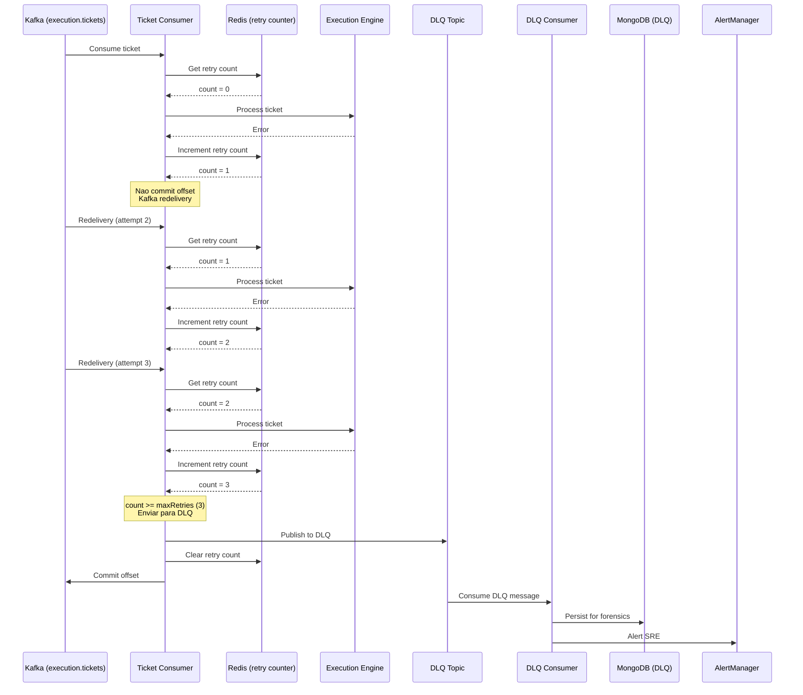

# Estrategia de Dead Letter Queue (DLQ) - Kafka

## Visao Geral

O Neural Hive Mind implementa um **Dead Letter Queue (DLQ)** pattern para execution tickets que falham apos multiplas tentativas de processamento.

## Arquitetura



## Componentes

### 1. Retry Counter (Redis)

**Key Pattern:** `ticket:retry_count:{ticket_id}`

**TTL:** 7 dias (alinhado com retention do topico Kafka)

**Operacoes:**
- `GET`: Obter contador atual
- `INCR`: Incrementar apos falha
- `DEL`: Limpar apos sucesso ou envio para DLQ

### 2. DLQ Topic (Kafka)

**Nome:** `execution.tickets.dlq`

**Configuracao:**
- **Partitions:** 3 (menor volume que topico principal)
- **Replicas:** 3
- **Retention:** 30 dias (vs 7 dias do principal)
- **Compression:** snappy
- **Max Message Size:** 2MB (inclui metadata de erro)

**Schema:** Estende `ExecutionTicket` com:
```json
{
  "...": "campos originais do ticket",
  "dlq_metadata": {
    "original_error": "string",
    "error_type": "string",
    "retry_count": 3,
    "last_failure_timestamp": 1234567890000,
    "dlq_published_at": 1234567890000
  }
}
```

### 3. DLQ Consumer

**Responsabilidades:**
1. Consumir mensagens do DLQ
2. Persistir no MongoDB (`execution_tickets_dlq`)
3. Alertar SRE via AlertManager
4. Registrar metricas

**Group ID:** `{consumer_group_id}-dlq`

**Auto-commit:** Habilitado (mensagens ja processadas)

### 4. MongoDB Collection

**Nome:** `execution_tickets_dlq`

**Indices:**
- `ticket_id` (unique)
- `task_type`
- `dlq_metadata.dlq_published_at`
- `(task_type, dlq_metadata.error_type)` (composto)

**Retention:** Indefinido (analise forense)

## Configuracao

### Worker Agents

```yaml
# helm-charts/worker-agents/values.yaml
kafka:
  dlq:
    enabled: true
    topic: execution.tickets.dlq
    maxRetriesBeforeDLQ: 3
```

### Variaveis de Ambiente

```bash
KAFKA_DLQ_TOPIC=execution.tickets.dlq
KAFKA_MAX_RETRIES_BEFORE_DLQ=3
```

## Metricas

### Prometheus

```promql
# Total de mensagens enviadas para DLQ
worker_agent_dlq_messages_total{reason="max_retries_exceeded", task_type="BUILD"}

# Taxa de envio para DLQ
rate(worker_agent_dlq_messages_total[5m])

# Distribuicao de retry count
histogram_quantile(0.95, rate(worker_agent_ticket_retry_count_bucket[10m]))

# Erros ao publicar no DLQ
worker_agent_dlq_publish_errors_total{error_type="TimeoutError"}
```

## Alertas

### FlowCDLQMessagesAccumulating

**Severidade:** Critical

**Threshold:** > 10 mensagens

**Acao:** Investigar causas de falha recorrentes

### FlowCHighDLQRate

**Severidade:** Warning

**Threshold:** > 0.1 mensagens/s

**Acao:** Possivel problema sistemico

### FlowCDLQPublishFailures

**Severidade:** Critical

**Threshold:** > 0 erros/s

**Acao:** Mensagens podem estar presas

## Operacao

### Consultar Mensagens DLQ

```bash
# MongoDB
kubectl exec -it mongodb-xxx -- mongosh

use neural_hive
db.execution_tickets_dlq.find().sort({processed_at: -1}).limit(10)
```

### Republicar Tickets

Ver [Runbook: DLQ Ticket Recovery](./runbooks/dlq-ticket-recovery.md)

### Limpar DLQ

```bash
# Remover tickets antigos (> 90 dias)
db.execution_tickets_dlq.deleteMany({
  processed_at: { $lt: new Date(Date.now() - 90*24*60*60*1000) }
})
```

## Troubleshooting

### Mensagens Nao Chegam ao DLQ

**Diagnostico:**
```bash
# Verificar logs do consumer
kubectl logs worker-agents-xxx | grep dlq_publish

# Verificar metricas
curl http://worker-agents:8000/metrics | grep dlq_publish_errors
```

**Possiveis Causas:**
- Kafka producer falhou
- Redis indisponivel (retry count nao incrementa)
- Configuracao `maxRetriesBeforeDLQ` muito alta

### DLQ Consumer Nao Processa

**Diagnostico:**
```bash
# Verificar se consumer esta rodando
kubectl logs worker-agents-xxx | grep dlq_consumer_started

# Verificar consumer group
kafka-consumer-groups.sh --bootstrap-server kafka:9092 --group worker-agents-dlq --describe
```

**Possiveis Causas:**
- Consumer nao inicializado
- MongoDB indisponivel
- Permissoes Kafka

## Referencias

- [Kafka DLQ Pattern - Confluent](https://www.confluent.io/blog/error-handling-patterns-in-kafka/)
- [Worker Agents Implementation](./WORKER_AGENTS_IMPLEMENTATION.md)
- [Runbook: DLQ Ticket Recovery](./runbooks/dlq-ticket-recovery.md)
