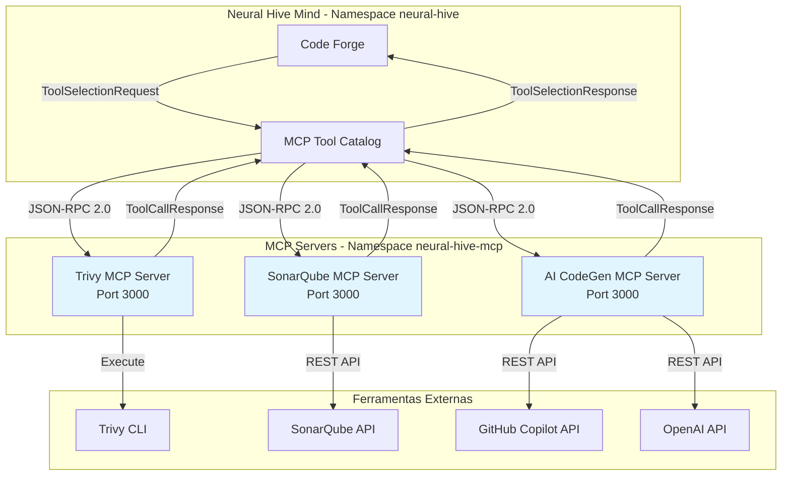

# Arquitetura dos MCP Servers

## Visão Geral

O Neural Hive-Mind implementa uma arquitetura híbrida para execução de ferramentas, onde os MCP Servers fornecem uma camada de abstração padronizada sobre ferramentas externas usando o protocolo Model Context Protocol (MCP) da Anthropic.

## Diagrama de Arquitetura



## Componentes

### MCP Tool Catalog

O MCP Tool Catalog é o ponto central de orquestração de ferramentas. Ele:

1. Recebe requisições de seleção de ferramentas via Kafka
2. Usa algoritmo genético para selecionar as melhores ferramentas
3. Roteia chamadas para MCP Servers ou adapters locais
4. Implementa circuit breaker e retry para resiliência

### MCP Servers

Cada MCP Server implementa o protocolo MCP e expõe ferramentas específicas:

| Server | Ferramentas | Uso |
|--------|-------------|-----|
| Trivy MCP Server | scan_image, scan_filesystem, scan_repository | Scanning de vulnerabilidades |
| SonarQube MCP Server | get_quality_gate, get_issues, get_metrics | Análise de qualidade de código |
| AI CodeGen MCP Server | generate_code, complete_code, explain_code | Geração de código com IA |

## Protocolo MCP

### Formato das Mensagens

O protocolo MCP usa JSON-RPC 2.0 para comunicação:

#### Initialize
```json
{
  "jsonrpc": "2.0",
  "id": 1,
  "method": "initialize",
  "params": {
    "protocolVersion": "2024-11-05",
    "capabilities": {},
    "clientInfo": {
      "name": "mcp-tool-catalog",
      "version": "1.0.0"
    }
  }
}
```

#### List Tools
```json
{
  "jsonrpc": "2.0",
  "id": 2,
  "method": "tools/list",
  "params": {}
}
```

#### Call Tool
```json
{
  "jsonrpc": "2.0",
  "id": 3,
  "method": "tools/call",
  "params": {
    "name": "scan_image",
    "arguments": {
      "image": "nginx:latest",
      "severity": "HIGH,CRITICAL"
    }
  }
}
```

### Capability Negotiation

Os MCP Servers negociam capacidades durante a inicialização:

```json
{
  "jsonrpc": "2.0",
  "id": 1,
  "result": {
    "protocolVersion": "2024-11-05",
    "capabilities": {
      "tools": {
        "listChanged": true
      },
      "resources": {
        "subscribe": false
      }
    },
    "serverInfo": {
      "name": "Trivy MCP Server",
      "version": "1.0.0"
    }
  }
}
```

## Roteamento Híbrido

O MCP Tool Catalog implementa roteamento híbrido com a seguinte prioridade:

1. **MCP Server** (se configurado): Usa servidor MCP externo
2. **Adapter Local**: Executa ferramenta via CLI, REST API ou container
3. **Fallback**: Retorna erro se nenhuma opção disponível

### Configuração de Roteamento

No `values.yaml` do MCP Tool Catalog:

```yaml
mcpServers:
  trivy-001: "http://trivy-mcp-server.neural-hive-mcp.svc.cluster.local:3000"
  sonarqube-001: "http://sonarqube-mcp-server.neural-hive-mcp.svc.cluster.local:3000"
  github-copilot-001: "http://ai-codegen-mcp-server.neural-hive-mcp.svc.cluster.local:3000"
  openai-codex-001: "http://ai-codegen-mcp-server.neural-hive-mcp.svc.cluster.local:3000"
```

## Resiliência

### Circuit Breaker

Cada MCP Server client implementa circuit breaker:

- **Threshold**: 5 falhas consecutivas
- **Timeout**: 60 segundos em estado aberto
- **Half-open**: Permite 1 requisição de teste

### Retry com Exponential Backoff

- **Máximo de tentativas**: 3
- **Backoff inicial**: 1 segundo
- **Multiplicador**: 2x

### Timeouts

| Operação | Timeout |
|----------|---------|
| Connect | 5s |
| Request | 30s |
| Trivy Scan | 300s |

## Observability

### Métricas Prometheus

Cada MCP Server expõe métricas em `/metrics`:

- `mcp_server_requests_total{method, status}`
- `mcp_server_request_duration_seconds{method}`
- `mcp_tool_executions_total{tool_name, status}`
- `mcp_tool_execution_duration_seconds{tool_name}`

### Logging Estruturado

Logs em formato JSON com campos:
- `timestamp`
- `level`
- `service`
- `trace_id` (quando disponível)
- `message`
- campos contextuais específicos

### Health Checks

- `/health`: Liveness probe
- `/ready`: Readiness probe

## Network Policies

Os MCP Servers estão isolados no namespace `neural-hive-mcp` com as seguintes políticas:

### Ingress
- Aceita conexões apenas do MCP Tool Catalog (namespace `neural-hive`)
- Aceita conexões do Prometheus (namespace `observability`)

### Egress
- DNS (UDP 53)
- HTTPS (TCP 443) para APIs externas

## Deploy

### Namespace

```bash
kubectl apply -f k8s/namespaces/neural-hive-mcp-namespace.yaml
```

### Helm Charts

```bash
# Trivy MCP Server
helm upgrade --install trivy-mcp-server \
  helm-charts/mcp-servers/trivy-mcp-server \
  --namespace neural-hive-mcp

# SonarQube MCP Server
helm upgrade --install sonarqube-mcp-server \
  helm-charts/mcp-servers/sonarqube-mcp-server \
  --namespace neural-hive-mcp

# AI CodeGen MCP Server
helm upgrade --install ai-codegen-mcp-server \
  helm-charts/mcp-servers/ai-codegen-mcp-server \
  --namespace neural-hive-mcp
```

## Referências

- [Model Context Protocol (MCP)](https://modelcontextprotocol.io/)
- [FastMCP Framework](https://github.com/jlowin/fastmcp)
- [Trivy Documentation](https://aquasecurity.github.io/trivy)
- [SonarQube API](https://docs.sonarqube.org/latest/web-api/)
