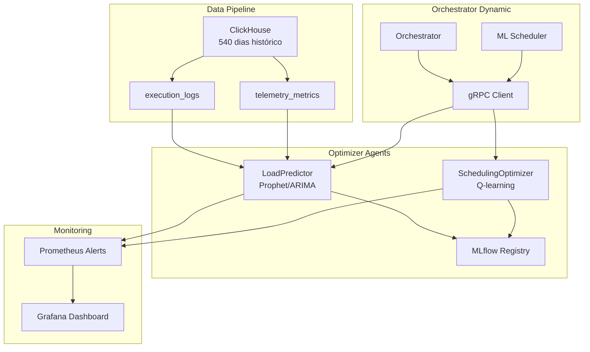
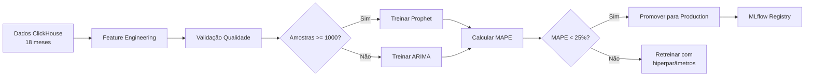

# ML Predictive Scheduling - Neural Hive Mind

## Visão Geral

O subsistema **ML Predictive Scheduling** implementa otimização de agendamento baseada em Machine Learning usando dois componentes principais:

1. **Load Forecasting** com Prophet/ARIMA para previsão de volumes de tickets
2. **Scheduling Optimization** com Q-learning para política ótima de agendamento

### Arquitetura



### Objetivos

- **MAPE < 20%**: Erro médio absoluto percentual das previsões de carga
- **Reward > 0.7**: Recompensa média da política de agendamento Q-learning
- **SLA Compliance > 95%**: Cumprimento de SLA após otimizações
- **Latência P95 < 1s**: Latência de recomendações gRPC

---

## Load Prediction

### Modelos

**Prophet** (Facebook)
- Modelo aditivo para séries temporais com sazonalidade
- Horizonões: 1h, 6h, 24h
- Sazonalidades: diária, semanal, anual
- Feriados brasileiros incluídos

**ARIMA** (Fallback)
- AutoRegressive Integrated Moving Average
- Usado quando Prophet falha ou dados insuficientes
- Mínimo 100 amostras vs 1000 do Prophet

### Horizontes de Previsão

| Horizonte | Uso | MAPE Esperado |
|-----------|-----|---------------|
| 60 min | Decisões táticas (escalonamento) | < 15% |
| 360 min | Planejamento médio prazo | < 20% |
| 1440 min | Planejamento de capacidade | < 25% |

### Pipeline de Treinamento



### Configuração Prophet

```python
prophet_config = {
    'seasonality_mode': 'additive',  # ou 'multiplicative' para alta variância
    'changepoint_prior_scale': 0.05,  # Detecta mudanças de tendência
    'seasonality_prior_scale': 10,
    'daily_seasonality': True,
    'weekly_seasonality': True,
    'yearly_seasonality': True,
    'holidays': holidays.Brazil()
}
```

---

## Scheduling Optimization

### Q-Learning

Algoritmo de Reinforcement Learning para aprender política ótima de agendamento.

**Q-Table**: `state_hash -> {action -> Q-value}`

**Ações Disponíveis**:
- `INCREASE_WORKER_POOL`: Aumentar workers
- `DECREASE_WORKER_POOL`: Reduzir workers
- `ADJUST_PRIORITY_WEIGHTS`: Ajustar pesos de prioridade
- `PREEMPTIVE_SCALING`: Escalonamento preventivo
- `LOAD_BALANCING_RECONFIG`: Reconfigurar balanceamento
- `NO_ACTION`: Manter status quo

### Estado (State)

```python
state = {
    'queue_depth': 150,  # Profundidade da fila
    'active_workers': 10,  # Workers ativos
    'avg_task_duration_ms': 5000,  # Duração média de tarefas
    'sla_compliance_rate': 0.88,  # Taxa de SLA cumprido
    'predicted_load_1h': 125,  # Carga prevista (1h)
    'predicted_load_6h': 180,  # Carga prevista (6h)
    'resource_cpu_avg': 0.65,  # CPU média
    'resource_memory_avg': 0.58  # Memória média
}
```

### Reward Function

```python
reward = (
    0.4 * sla_compliance_delta +  # Melhoria em SLA
    0.3 * throughput_delta +  # Melhoria em throughput
    0.2 * resource_efficiency_delta +  # Eficiência de recursos
    0.1 * cost_delta  # Redução de custo
)
```

### Hiperparâmetros

| Parâmetro | Valor | Descrição |
|-----------|-------|-----------|
| `epsilon` | 0.1 | Taxa de exploração vs exploitation |
| `learning_rate` | 0.01 | Taxa de aprendizado |
| `discount_factor` | 0.95 | Fator de desconto para recompensas futuras |
| `update_interval` | 100 | Persistir Q-table a cada N updates |

### Experimentação A/B

```python
experiment_config = {
    'control_group_pct': 0.2,  # 20% usa heurística padrão
    'treatment_group_pct': 0.8,  # 80% usa Q-learning
    'min_samples': 1000,  # Mínimo para significância estatística
    'confidence_threshold': 0.95  # Confiança para winner
}
```

---

## Data Pipeline

### ClickHouse Schema

**execution_logs** (TTL: 540 dias)
```sql
CREATE TABLE neural_hive.execution_logs (
    timestamp DateTime,
    ticket_id String,
    task_type String,
    risk_band String,
    actual_duration_ms UInt32,
    status String,
    worker_id String,
    resource_cpu Float32,
    resource_memory Float32
) ENGINE = MergeTree()
ORDER BY (timestamp, task_type, risk_band)
TTL timestamp + INTERVAL 540 DAY;
```

**telemetry_metrics** (TTL: 365 dias)
```sql
CREATE TABLE neural_hive.telemetry_metrics (
    timestamp DateTime,
    service String,
    metric_name String,
    metric_value Float64,
    labels Map(String, String)
) ENGINE = MergeTree()
ORDER BY (timestamp, service, metric_name)
TTL timestamp + INTERVAL 365 DAY;
```

### Features

| Feature | Fonte | Transformação |
|---------|-------|---------------|
| ticket_volume_hourly | execution_logs | `count()` por hora |
| avg_duration_by_type | execution_logs | `avg(actual_duration_ms)` group by task_type |
| sla_compliance_rate | execution_logs | `sum(sla_met) / count()` |
| resource_cpu_p95 | execution_logs | `quantile(0.95)(resource_cpu)` |
| queue_depth_avg | queue_snapshots | `avg(queue_depth)` |

### Qualidade de Dados

**Validações**:
- Gaps temporais < 24h
- Outliers < 10x mediana
- Campos obrigatórios presentes
- Tipos de dados corretos

**Tratamento**:
- Interpolação linear para gaps < 3h
- Remoção de outliers > 3 desvios padrão
- Imputação de medianas para valores faltantes

### Caching

**Redis**:
- **Model Cache**: TTL 3600s (1h)
- **Forecast Cache**: TTL 300s (5min)
- **Q-Table Cache**: TTL 7200s (2h)

---

## Integration

### gRPC Interface

```protobuf
service OptimizerAgent {
    rpc GetLoadForecast(ForecastRequest) returns (ForecastResponse);
    rpc GetSchedulingRecommendation(StateRequest) returns (RecommendationResponse);
}

message ForecastRequest {
    int32 horizon_minutes = 1;
    string task_type = 2;
    string risk_band = 3;
}

message ForecastResponse {
    int32 predicted_volume = 1;
    float confidence = 2;
    int32 forecast_horizon_minutes = 3;
    float resource_demand_cpu = 4;
    float resource_demand_memory = 5;
    float bottleneck_probability = 6;
    int64 timestamp = 7;
}
```

### Orchestrator Hooks

**Scheduler Decision Flow**:
1. Orchestrator consulta `GetLoadForecast(60min)`
2. Se `predicted_volume > threshold`: Consulta `GetSchedulingRecommendation(state)`
3. Se `confidence > 0.7`: Aplica recomendação
4. Senão: Usa heurística padrão
5. Registra decisão + reward em ClickHouse

### Fallback

Quando Optimizer Agent indisponível:
- Usar heurística baseada em regras
- Log de degradação
- Métricas `optimizer_unavailable` incrementadas

### Gradual Rollout

Fases de implementação:
1. **Shadow Mode (0%)**: Apenas logging de recomendações
2. **A/B Test (20%)**: 20% dos tickets usa ML
3. **Ramp Up (50%)**: 50% dos tickets
4. **Full Rollout (100%)**: Todos os tickets

---

## Monitoring

### Grafana Dashboard

**Painel**: `optimizer-scheduling-predictions.json`

**Rows**:
1. **Overview Stats**: Total predictions 24h, MAPE gauge, Optimizations applied, Policy success rate
2. **Load Forecasts**: Time-series por horizonte (1h/6h/24h), Resource demand forecast
3. **Scheduling Optimization**: Action distribution pie, Reward trend, SLA impact before/after
4. **Model Performance**: MAPE heatmap, Training duration histogram
5. **Integration Health**: RPC latency P50/P95, Acceptance rate, Cache hit rates
6. **Bottlenecks**: Predicted bottleneck annotations, Saturation forecast gauges

### Prometheus Alerts

**Criticais**:
- `CriticalForecastError`: MAPE > 40% por 5min
- `MLModelLoadFailure`: Falhas de carregamento > 3 em 5min
- `OptimizerUnavailable`: Falhas RPC > 80% em 5min

**Warnings**:
- `HighForecastError`: MAPE > 25% por 15min
- `LowPolicyReward`: Reward < 0.3 por 30min
- `HighRejection`: Rejeições > 50% por 15min

**Runbooks**: [docs.internal/runbooks/optimizer](https://docs.internal/runbooks/optimizer)

---

## Operations

### Helm Configuration

```yaml
optimizer:
  enabled: false  # Habilitar quando validado
  endpoint: 'optimizer-agents.default.svc.cluster.local:50053'
  grpcTimeout: 5
  forecastHorizonMinutes: 60
  recommendationConfidenceThreshold: 0.7

ml:
  clickhouse:
    host: 'clickhouse.clickhouse.svc.cluster.local'
    port: 9000
    user: 'optimizer'
    passwordSecret: 'clickhouse-optimizer-password'
    database: 'neural_hive'

  prophet:
    seasonalityMode: 'additive'
    changepointPriorScale: 0.05

  scheduling:
    epsilon: 0.1
    learningRate: 0.01
    discountFactor: 0.95

  training:
    intervalHours: 24  # Retreinamento diário
    windowDays: 540  # 18 meses

  forecasting:
    horizons: [60, 360, 1440]

  caching:
    modelTTL: 3600
    forecastTTL: 300
    enabled: true
```

### Training Pipeline

**Manual Trigger**:
```bash
kubectl exec -n optimizer-agents optimizer-agents-0 -- \
  python -m src.ml.training_pipeline \
    --horizon 60 \
    --task-type processing \
    --risk-band medium
```

**Scheduled** (CronJob):
```yaml
apiVersion: batch/v1
kind: CronJob
metadata:
  name: ml-model-training
spec:
  schedule: "0 2 * * *"  # Diário às 2am
  jobTemplate:
    spec:
      template:
        spec:
          containers:
          - name: training
            image: optimizer-agents:latest
            command: ["python", "-m", "src.ml.training_pipeline"]
```

### Model Promotion

Critérios para promover modelo para Production:
1. MAPE < 25% em validação
2. Sem degradação vs modelo atual
3. Teste A/B bem-sucedido (p-value < 0.05)
4. Aprovação manual de ML Engineer

```bash
# Promover modelo no MLflow
mlflow models update \
  --name load_predictor_60m \
  --version 5 \
  --stage Production
```

### Tuning

**Hiperparâmetros Prophet**:
- `changepoint_prior_scale`: 0.001 a 0.5 (quanto maior, mais flexível)
- `seasonality_prior_scale`: 0.01 a 10 (quanto maior, mais sazonalidade)

**Hiperparâmetros Q-Learning**:
- `epsilon`: 0.05 a 0.2 (balancear exploração)
- `learning_rate`: 0.001 a 0.1 (convergência vs estabilidade)

---

## Examples

### Código: Obter Forecast

```python
from src.clients.optimizer_grpc_client import OptimizerGRPCClient

optimizer = OptimizerGRPCClient(config, metrics)
await optimizer.initialize()

forecast = await optimizer.get_load_forecast(
    horizon_minutes=60,
    task_type='processing',
    risk_band='medium'
)

print(f"Volume previsto: {forecast['predicted_volume']}")
print(f"Confiança: {forecast['confidence']:.2f}")
print(f"Probabilidade de bottleneck: {forecast['bottleneck_probability']:.2f}")
```

### Código: Aplicar Recomendação

```python
state = {
    'queue_depth': 200,
    'active_workers': 10,
    'sla_compliance_rate': 0.85,
    'predicted_load_1h': 180
}

recommendation = await optimizer.get_scheduling_recommendation(state)

if recommendation and recommendation['confidence'] >= 0.7:
    action = recommendation['action']
    params = recommendation['parameters']

    if action == "INCREASE_WORKER_POOL":
        target_workers = int(params['target_workers'])
        await scale_workers(target_workers)

        # Registrar para Q-learning
        await optimizer.record_action_outcome(
            state=state,
            action=action,
            reward=calculate_reward(before_metrics, after_metrics)
        )
```

### Monitoramento: Query Prometheus

```promql
# Taxa de erro de previsões (MAPE) por horizonte
optimizer_load_forecast_accuracy_mape{horizon="60"}

# Recompensa média da política Q-learning
avg(optimizer_scheduling_policy_average_reward)

# Latência P95 de chamadas gRPC
histogram_quantile(0.95,
  sum(rate(grpc_server_handling_seconds_bucket{grpc_service="OptimizerAgent"}[5m])) by (le)
)

# Taxa de aceitação de recomendações
sum(rate(optimizer_scheduling_optimizations_applied_total{status="accepted"}[5m]))
/
sum(rate(optimizer_scheduling_optimizations_applied_total[5m]))
```

### ClickHouse: Análise de Bottlenecks

```sql
SELECT
    toStartOfHour(timestamp) AS hour,
    count() AS ticket_volume,
    avg(queue_depth_at_start) AS avg_queue_depth,
    countIf(sla_met = 0) / count() AS sla_miss_rate
FROM neural_hive.execution_logs
WHERE timestamp >= now() - INTERVAL 7 DAY
GROUP BY hour
HAVING avg_queue_depth > 100  -- Threshold de bottleneck
ORDER BY sla_miss_rate DESC
LIMIT 10;
```

---

## Referências

- [Prophet Documentation](https://facebook.github.io/prophet/)
- [Q-Learning Tutorial](https://www.learndatasci.com/tutorials/reinforcement-q-learning-scratch-python-openai-gym/)
- [ClickHouse TTL](https://clickhouse.com/docs/en/engines/table-engines/mergetree-family/mergetree#table_engine-mergetree-ttl)
- [MLflow Model Registry](https://www.mlflow.org/docs/latest/model-registry.html)
- [gRPC Best Practices](https://grpc.io/docs/guides/performance/)

---

## Troubleshooting

### MAPE > 25%

**Sintomas**: Previsões imprecisas, recomendações ruins

**Diagnóstico**:
```bash
# Verificar dados históricos
kubectl exec -n clickhouse clickhouse-0 -- clickhouse-client --query \
  "SELECT count(), min(timestamp), max(timestamp) FROM neural_hive.execution_logs"

# Verificar modelo atual
kubectl logs -n optimizer-agents optimizer-agents-0 | grep "MAPE"
```

**Soluções**:
1. Retreinar modelo com janela maior (540 dias)
2. Ajustar `changepoint_prior_scale` se houve mudança de padrões
3. Adicionar regressores externos (feriados, eventos)

### Optimizer Unavailable

**Sintomas**: Errors gRPC, fallback ativado

**Diagnóstico**:
```bash
kubectl get pods -n optimizer-agents
kubectl logs -n optimizer-agents optimizer-agents-0
kubectl describe svc optimizer-agents -n optimizer-agents
```

**Soluções**:
1. Verificar health do pod
2. Testar conectividade: `kubectl exec -n orchestrator orchestrator-0 -- nc -zv optimizer-agents 50053`
3. Checar NetworkPolicy permitindo tráfego

### Low Policy Reward

**Sintomas**: Reward < 0.3, decisões subótimas

**Diagnóstico**:
```bash
# Verificar distribuição de ações
kubectl exec -n optimizer-agents optimizer-agents-0 -- \
  python -c "from src.ml.scheduling_optimizer import SchedulingOptimizer; \
             optimizer = SchedulingOptimizer(...); \
             print(optimizer.q_table)"
```

**Soluções**:
1. Aumentar `epsilon` para mais exploração
2. Revisar reward function
3. Resetar Q-table e retreinar
