# Phase 1 Architecture Diagrams
## Neural Hive-Mind - Foundation Layer

**Version**: 1.0
**Date**: November 12, 2025

---

## 📐 Overview

This document provides comprehensive architecture diagrams for Phase 1 of the Neural Hive-Mind project using Mermaid syntax.

---

## 1. System Overview

### 1.1 High-Level Architecture

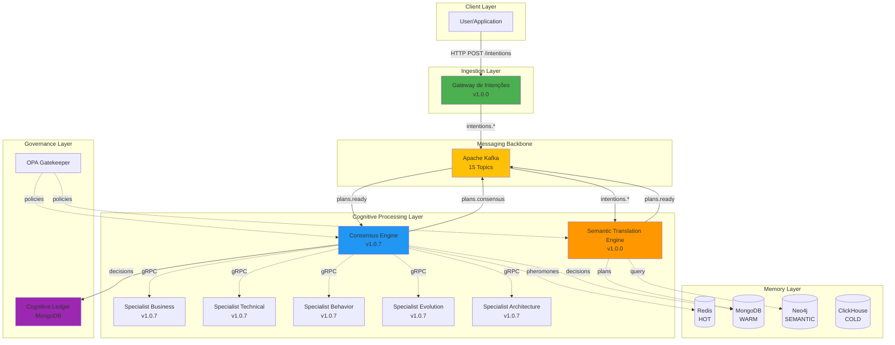

---

## 2. Data Flow Diagram

### 2.1 Intent to Decision Flow

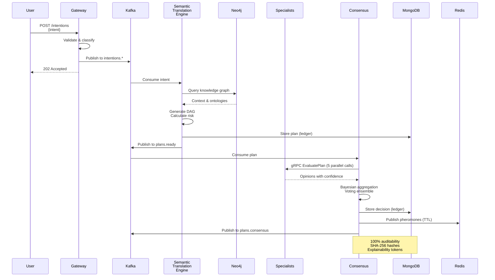

---

## 3. Component Topology

### 3.1 Kubernetes Deployment Topology

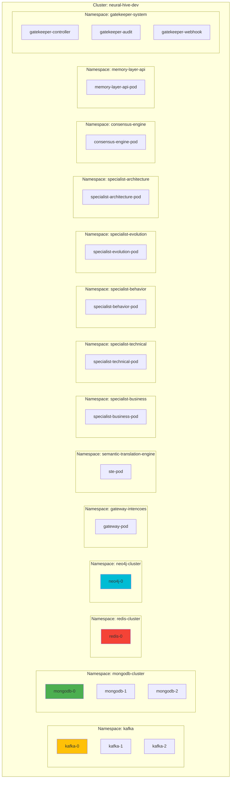

---

## 4. Memory Architecture

### 4.1 4-Tier Memory Layer

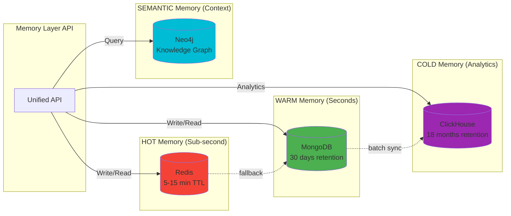

### 4.2 Memory Access Patterns

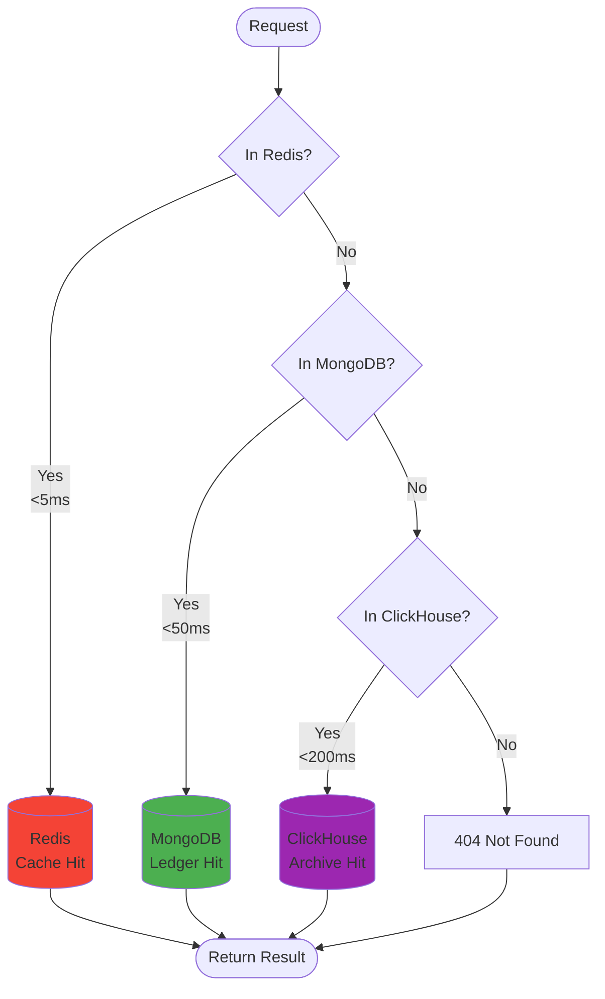

---

## 5. Consensus Mechanism

### 5.1 Consensus Flow

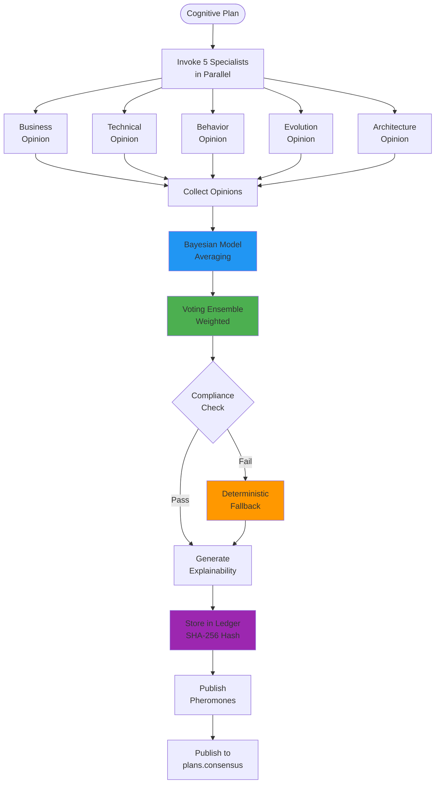

---

## 6. Observability Architecture

### 6.1 Monitoring Stack (Planned)

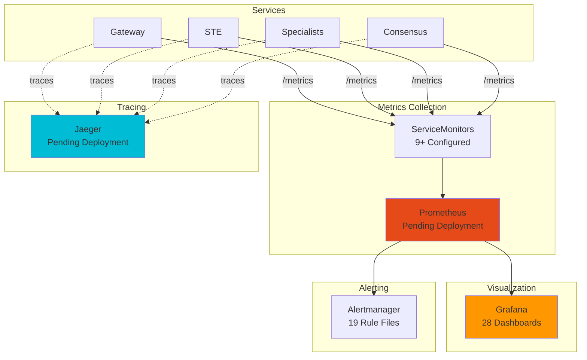

---

## 7. Governance & Security

### 7.1 Governance Architecture

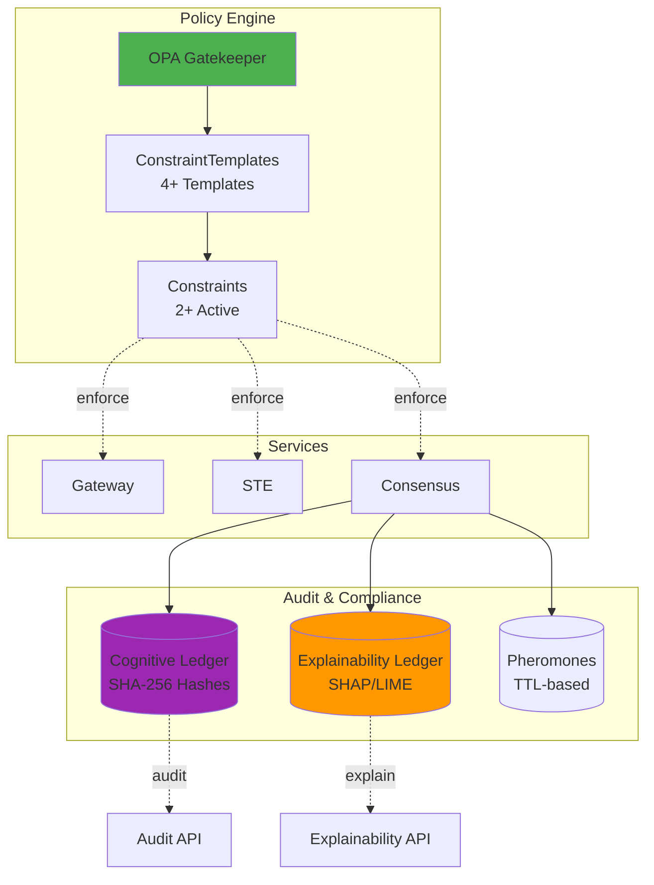

---

## 8. Network Topology

### 8.1 Service Communication

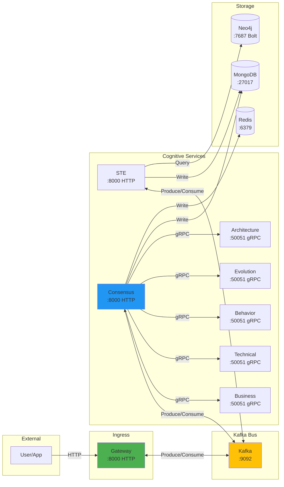

---

## 9. Deployment Pipeline (Future)

### 9.1 CI/CD Flow (Planned for Phase 2)

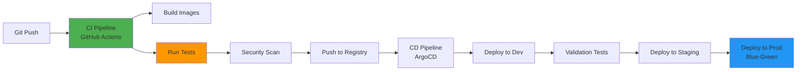

---

## 10. Resource Allocation

### 10.1 CPU & Memory Distribution

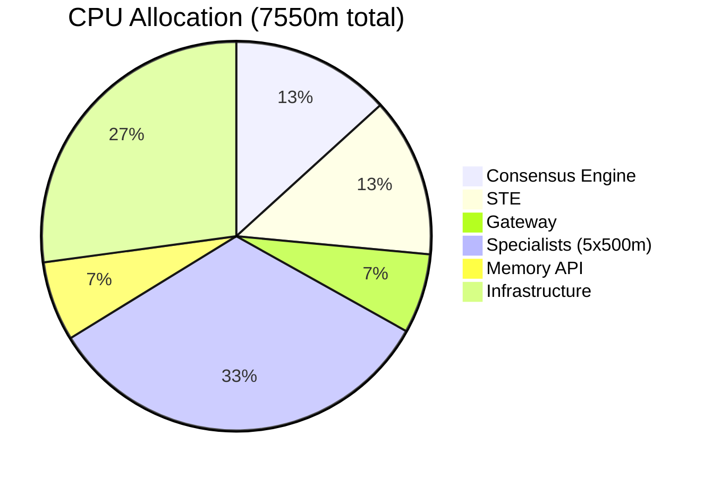

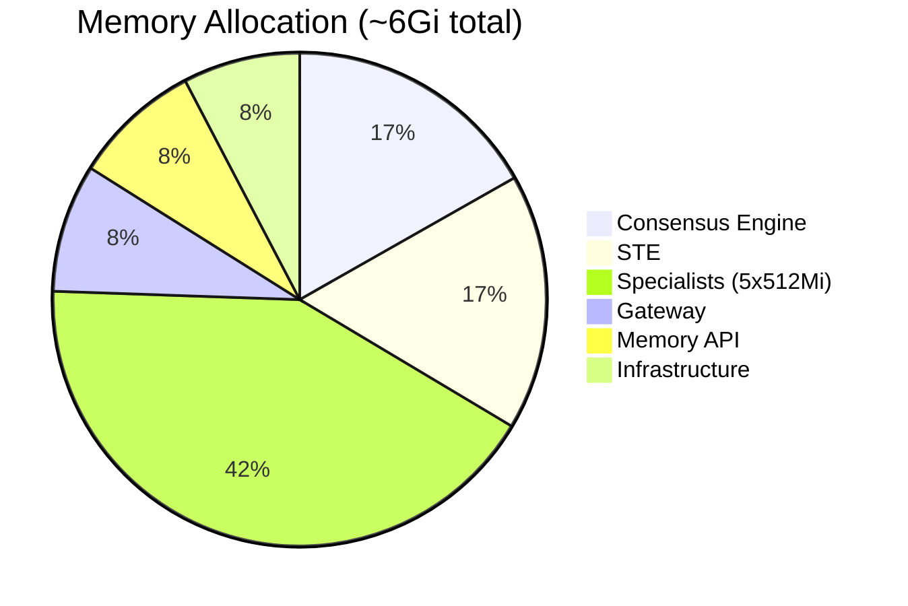

---

## 📊 Diagram Legend

| Symbol | Meaning |
|--------|---------|
| `-->` | Synchronous communication (HTTP, gRPC) |
| `-.->` | Asynchronous communication (Kafka, events) |
| `===>` | Data flow |
| `[Component]` | Service/Application |
| `[(Database)]` | Data store |
| `{Decision}` | Decision point |

---

**Document Version**: 1.0
**Last Updated**: November 12, 2025
**Maintained by**: Neural Hive-Mind Team
