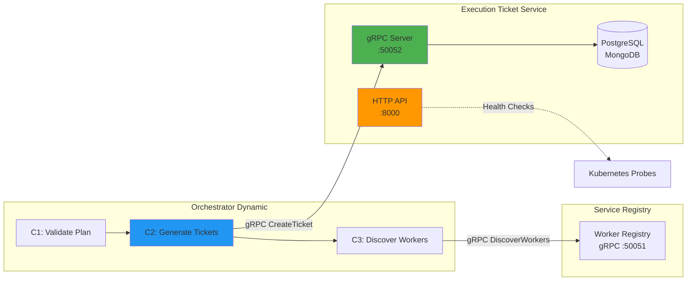
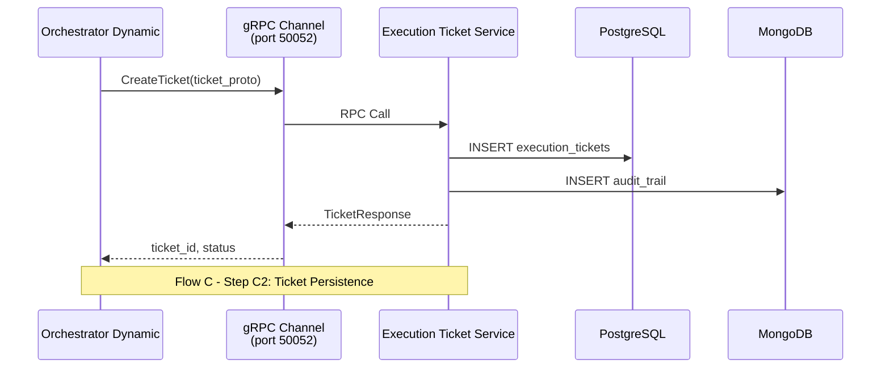
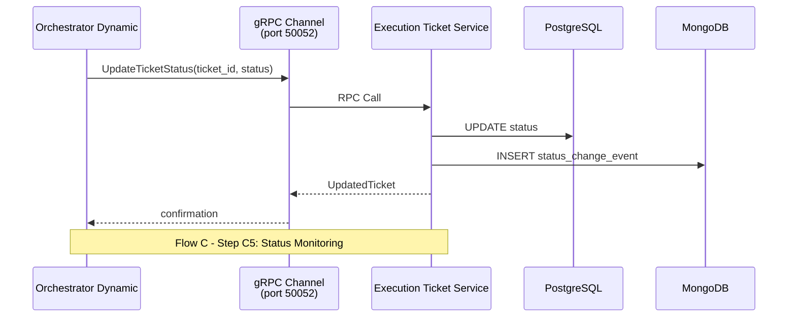

# Phase 2 Architecture Diagrams
## Neural Hive-Mind - Orchestration Layer

**Versao**: 1.0
**Data**: Janeiro 2026

---

## 1. Visao Geral

Este documento fornece diagramas de arquitetura para a Phase 2 do Neural Hive-Mind, focando no Flow C (Orchestration to Execution).

---

## 2. Flow C: Orchestration to Execution

### 2.1 Diagrama de Comunicacao



---

## 3. Tabela de Portas e Protocolos

| Servico | Porta | Protocolo | Proposito | Clientes |
|---------|-------|-----------|-----------|----------|
| execution-ticket-service | 50052 | gRPC | Operacoes de negocio | orchestrator-dynamic, worker-agents |
| execution-ticket-service | 8000 | HTTP | Health checks, metricas | Kubernetes, Prometheus |
| execution-ticket-service | 9090 | HTTP | Metricas Prometheus | Prometheus |
| orchestrator-dynamic | 8000 | HTTP | Health checks | Kubernetes |
| service-registry | 50051 | gRPC | Descoberta de workers | orchestrator-dynamic |

---

## 4. Fluxo de Comunicacao gRPC

### 4.1 Sequencia de Persistencia de Tickets



### 4.2 Sequencia de Monitoramento de Status



---

## 5. Arquitetura Dual-Protocol

O Execution Ticket Service implementa arquitetura dual-protocol:

### 5.1 gRPC (Protocolo Primario - Porta 50052)

**Uso**: Operacoes de negocio com orchestrator-dynamic e worker-agents

**Beneficios**:
- Menor latencia (binary protocol)
- Type safety via Protocol Buffers
- Suporte a streaming bidirecional
- Validacao de contrato em tempo de compilacao

**RPCs**:
- `GetTicket`: Buscar ticket por ID
- `ListTickets`: Listar tickets com filtros
- `UpdateTicketStatus`: Atualizar status de execucao
- `GenerateToken`: Gerar JWT para autorizacao

### 5.2 HTTP/REST (Protocolo Secundario - Porta 8000)

**Uso**: Health checks, metricas, debugging

**Endpoints**:
- `GET /health`: Liveness probe
- `GET /ready`: Readiness probe
- `GET /api/v1/tickets/*`: API REST para debugging

---

## 6. Configuracao de Probes

```yaml
# Startup/Liveness: HTTP (valida processo FastAPI)
startupProbe:
  httpGet:
    path: /health
    port: 8000

livenessProbe:
  httpGet:
    path: /health
    port: 8000

# Readiness: gRPC (valida servidor gRPC pronto)
readinessProbe:
  grpc:
    port: 50052
    service: ""
```

---

## 7. Referencias

- [Flow C Integration](PHASE2_FLOW_C_INTEGRATION.md)
- [gRPC Architecture](architecture/orchestrator-ticket-service-grpc.md)
- [Execution Ticket Service README](../services/execution-ticket-service/README.md)
