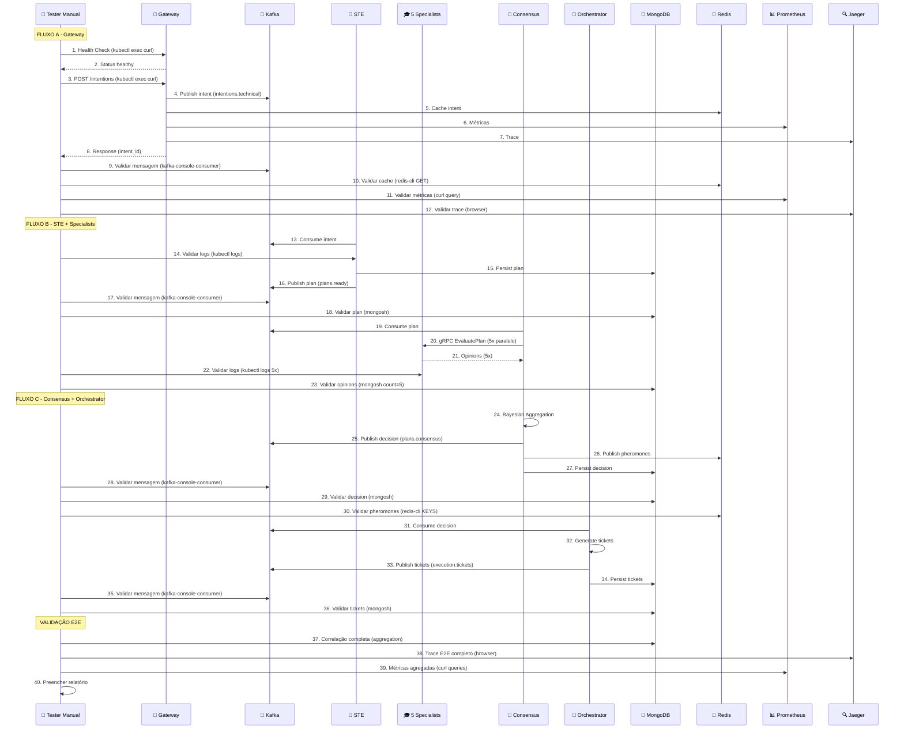

# Plano de Teste Manual Completo - Fluxos A, B e C - Neural Hive-Mind

> **Versão:** 1.1
> **Data:** 2026-01-22
> **Autor:** QA/DevOps Team
> **Status:** Aprovado para Execução
> **Referência Phase 2:** docs/PHASE2_FLOW_C_INTEGRATION.md

---

## Sumário

1. [Introdução](#1-introdução)
2. [Preparação do Ambiente](#2-preparação-do-ambiente)
3. [FLUXO A - Gateway de Intenções → Kafka](#3-fluxo-a---gateway-de-intenções--kafka)
4. [FLUXO B - Semantic Translation Engine → Plano Cognitivo](#4-fluxo-b---semantic-translation-engine--plano-cognitivo)
5. [FLUXO B - Specialists (5 Especialistas via gRPC)](#5-fluxo-b---specialists-5-especialistas-via-grpc)
6. [FLUXO C - Consensus Engine → Decisão Consolidada (C1)](#6-fluxo-c---consensus-engine--decisão-consolidada)
7. [FLUXO C - Orchestrator Dynamic → Execution Tickets (C1-C2)](#7-fluxo-c---orchestrator-dynamic--execution-tickets)
   - 7.9 [FLUXO C3 - Discover Workers](#79-fluxo-c3---discover-workers-service-registry)
   - 7.10 [FLUXO C4 - Assign Tickets](#710-fluxo-c4---assign-tickets-worker-assignment)
   - 7.11 [FLUXO C5 - Monitor Execution](#711-fluxo-c5---monitor-execution-polling--results)
   - 7.12 [FLUXO C6 - Publish Telemetry](#712-fluxo-c6---publish-telemetry-kafka--buffer)
   - 7.13 [Checklist Consolidado C1-C6](#713-checklist-consolidado-fluxo-c-completo-c1-c6)
8. [Validação Consolidada End-to-End](#8-validação-consolidada-end-to-end)
9. [Testes de Cenários Adicionais](#9-testes-de-cenários-adicionais)
10. [Troubleshooting e Casos de Falha](#10-troubleshooting-e-casos-de-falha)
11. [Relatório de Teste](#11-relatório-de-teste)
12. [Anexos](#12-anexos)

---

## 1. Introdução

### 1.1 Objetivo

Validar manualmente os 3 fluxos principais do Neural Hive-Mind (A, B e C) sem uso de scripts automatizados, garantindo que cada componente processa, transforma e propaga dados corretamente através de todo o pipeline cognitivo.

### 1.2 Escopo

| Fluxo | Componentes | Descrição |
|-------|-------------|-----------|
| **A** | Gateway → Kafka | Recepção de intenções, classificação NLU, publicação no Kafka |
| **B** | STE → Specialists | Geração de plano cognitivo, consulta a 5 especialistas via gRPC |
| **C** | Consensus → Orchestrator → Workers | Agregação Bayesiana, decisão final, execução completa |

### 1.2.1 Detalhamento do Fluxo C (Phase 2)

| Step | Nome | Descrição |
|------|------|-----------|
| **C1** | Validate Decision | Validar campos obrigatórios da decisão consolidada |
| **C2** | Generate Tickets | Iniciar Temporal workflow, criar tickets via ExecutionTicketClient |
| **C3** | Discover Workers | Descobrir workers via ServiceRegistryClient (filtro: status=healthy) |
| **C4** | Assign Tickets | Round-robin assignment, despachar via WorkerAgentClient |
| **C5** | Monitor Execution | Polling até conclusão ou deadline SLA (4h) |
| **C6** | Publish Telemetry | Publicar eventos no tópico telemetry-flow-c |

### 1.3 Pipeline Completo

```
┌─────────────────────────────────────────────────────────────────────────────────────────┐
│                              NEURAL HIVE-MIND PIPELINE                                   │
├─────────────────────────────────────────────────────────────────────────────────────────┤
│                                                                                          │
│  FLUXO A          FLUXO B                         FLUXO C (C1-C6)                       │
│  ───────          ───────                         ───────────────                        │
│  Gateway    →     STE      →   Specialists   →    Consensus    →   Orchestrator         │
│     │               │            (5x gRPC)            │               │                  │
│     v               v               │                 v               v                  │
│  Kafka          Kafka           Opinions          Decision      C1: Validate            │
│  (intents)      (plans)            │                 │          C2: Tickets             │
│                                    v                 v               │                  │
│                               Consensus         Kafka           C3: Workers             │
│                                                (consensus)      C4: Assign              │
│                                                     │           C5: Monitor             │
│                                                     v           C6: Telemetry           │
│                                                Orchestrator          │                  │
│                                                     │                v                  │
│                                                     v           COMPLETED               │
│                                               MongoDB/Kafka                              │
│                                                                                          │
└─────────────────────────────────────────────────────────────────────────────────────────┘
```

### 1.4 Tempo Estimado

- **Execução completa (C1-C6):** 150-180 minutos
- **Fluxo A:** 25-35 minutos
- **Fluxo B:** 30-40 minutos
- **Fluxo C (C1-C2):** 25-35 minutos
- **Fluxo C (C3-C6):** 45-60 minutos
- **Validação E2E:** 15-20 minutos

### 1.5 Pré-requisitos

- Acesso ao cluster Kubernetes com `kubectl` configurado
- Ferramentas instaladas: `curl`, `jq`, `mongosh`, `redis-cli`
- Navegador web para Jaeger UI
- Terminal com múltiplas abas/janelas

### 1.6 Validação em 4 Camadas

Cada etapa será validada em 4 camadas:

1. **Logs de Aplicação** - `kubectl logs`
2. **Mensagens Kafka** - `kafka-console-consumer.sh`
3. **Persistência** - MongoDB (`mongosh`) e Redis (`redis-cli`)
4. **Observabilidade** - Prometheus (queries) e Jaeger (traces)

---

## 2. Preparação do Ambiente

### 2.1 Verificação de Pré-requisitos

#### 2.1.1 Checklist de Ferramentas

```bash
# Verificar kubectl
kubectl version --client

# Verificar curl
curl --version

# Verificar jq
jq --version
```

#### 2.1.2 Verificar Pods em Todos os Namespaces

```bash
# Gateway de Intenções
kubectl get pods -n neural-hive -o wide

# Semantic Translation Engine
kubectl get pods -n neural-hive -o wide

# Consensus Engine
kubectl get pods -n neural-hive -o wide

# Orchestrator Dynamic
kubectl get pods -n neural-hive -o wide

# Kafka
kubectl get pods -n kafka -o wide

# MongoDB
kubectl get pods -n mongodb-cluster -o wide

# Redis
kubectl get pods -n redis-cluster -o wide

# Observabilidade
kubectl get pods -n observability -o wide
```

**Critério de Sucesso:** Todos os pods em status `Running` e `Ready`

**Critério de Falha:** Pods em `CrashLoopBackOff`, `Pending`, ou `Error`

#### 2.1.3 Verificar Status Geral

```bash
# Resumo de pods por namespace
kubectl get pods -A | grep -E "gateway|semantic|consensus|orchestrator|kafka|mongo|redis|jaeger|prometheus" | grep -v "Running" || echo "Todos os pods estão Running"
```

### 2.2 Configuração de Port-Forwards

Abra terminais separados para cada port-forward e mantenha-os abertos durante todo o teste.

#### Terminal 1 - Prometheus

```bash
kubectl port-forward -n observability svc/prometheus-server 9090:9090
```

#### Terminal 2 - Jaeger

```bash
kubectl port-forward -n observability svc/jaeger-query 16686:16686
```

#### Terminal 3 - Grafana (Opcional)

```bash
kubectl port-forward -n observability svc/grafana 3000:3000
```

**Validação:**
- Prometheus: http://localhost:9090 (deve abrir UI)
- Jaeger: http://localhost:16686 (deve abrir UI)
- Grafana: http://localhost:3000 (deve abrir UI)

### 2.3 Preparação de Payloads de Teste

#### 2.3.1 Payload 1 - Domínio TECHNICAL (Análise de Viabilidade)

```bash
cat > /tmp/intent-technical.json << 'EOF'
{
  "text": "Analisar viabilidade técnica de migração do sistema de autenticação para OAuth2 com suporte a MFA",
  "context": {
    "session_id": "test-session-001",
    "user_id": "qa-tester-001",
    "source": "manual-test",
    "metadata": {
      "test_run": "fluxo-a-b-c",
      "environment": "staging"
    }
  },
  "constraints": {
    "priority": "high",
    "security_level": "confidential",
    "deadline": "2026-02-01T00:00:00Z"
  }
}
EOF
```

#### 2.3.2 Payload 2 - Domínio BUSINESS (Análise de ROI)

```bash
cat > /tmp/intent-business.json << 'EOF'
{
  "text": "Avaliar retorno sobre investimento da implementação de cache distribuído para reduzir custos de infraestrutura",
  "context": {
    "session_id": "test-session-002",
    "user_id": "qa-tester-001",
    "source": "manual-test",
    "metadata": {
      "test_run": "fluxo-a-b-c",
      "environment": "staging"
    }
  },
  "constraints": {
    "priority": "normal",
    "security_level": "internal",
    "deadline": "2026-03-01T00:00:00Z"
  }
}
EOF
```

#### 2.3.3 Payload 3 - Domínio INFRASTRUCTURE (Análise de Escalabilidade)

```bash
cat > /tmp/intent-infrastructure.json << 'EOF'
{
  "text": "Projetar estratégia de auto-scaling para microserviços com base em métricas de CPU e memória",
  "context": {
    "session_id": "test-session-003",
    "user_id": "qa-tester-001",
    "source": "manual-test",
    "metadata": {
      "test_run": "fluxo-a-b-c",
      "environment": "staging"
    }
  },
  "constraints": {
    "priority": "high",
    "security_level": "internal",
    "deadline": "2026-02-15T00:00:00Z"
  }
}
EOF
```

#### 2.3.4 Validar Formato JSON

```bash
# Validar todos os payloads
jq . /tmp/intent-technical.json > /dev/null && echo "Payload 1 (TECHNICAL): OK"
jq . /tmp/intent-business.json > /dev/null && echo "Payload 2 (BUSINESS): OK"
jq . /tmp/intent-infrastructure.json > /dev/null && echo "Payload 3 (INFRASTRUCTURE): OK"
```

> **⚠️ IMPORTANTE - Formato de Enums:**
> Os campos `priority` e `security_level` devem usar valores em **lowercase**:
> - `priority`: `low`, `normal`, `high`, `critical`
> - `security_level`: `public`, `internal`, `confidential`, `restricted`
>
> Valores em uppercase (`HIGH`, `CONFIDENTIAL`) serão rejeitados com erro 422.

### 2.4 Tabela de Anotações

Copie e preencha esta tabela durante a execução do teste:

| Campo | Valor | Timestamp |
|-------|-------|-----------|
| `intent_id` | __________________ | __________ |
| `correlation_id` | __________________ | __________ |
| `trace_id` | __________________ | __________ |
| `plan_id` | __________________ | __________ |
| `decision_id` | __________________ | __________ |
| `ticket_id` (primeiro) | __________________ | __________ |
| `opinion_id` (business) | __________________ | __________ |
| `opinion_id` (technical) | __________________ | __________ |
| `opinion_id` (behavior) | __________________ | __________ |
| `opinion_id` (evolution) | __________________ | __________ |
| `opinion_id` (architecture) | __________________ | __________ |

### Campos Adicionais para C3-C6

| Campo | Valor | Timestamp |
|-------|-------|-----------|
| `worker_id` (primeiro) | __________________ | __________ |
| `workers_discovered` | __________________ | __________ |
| `tickets_assigned` | __________________ | __________ |
| `tickets_completed` | __________________ | __________ |
| `tickets_failed` | __________________ | __________ |
| `telemetry_event_id` | __________________ | __________ |
| `total_duration_ms` | __________________ | __________ |

### 2.5 Identificar Pods para Comandos

```bash
# Anotar nomes dos pods para uso nos comandos
export GATEWAY_POD=$(kubectl get pods -n neural-hive -l app=gateway-intencoes -o jsonpath='{.items[0].metadata.name}')
export STE_POD=$(kubectl get pods -n neural-hive -l app=semantic-translation-engine -o jsonpath='{.items[0].metadata.name}')
export CONSENSUS_POD=$(kubectl get pods -n neural-hive -l app=consensus-engine -o jsonpath='{.items[0].metadata.name}')
export ORCHESTRATOR_POD=$(kubectl get pods -n neural-hive -l app=orchestrator-dynamic -o jsonpath='{.items[0].metadata.name}')
export KAFKA_POD=$(kubectl get pods -n kafka -l app=kafka -o jsonpath='{.items[0].metadata.name}')
export MONGO_POD=$(kubectl get pods -n mongodb-cluster -l app=mongodb -o jsonpath='{.items[0].metadata.name}')
export REDIS_POD=$(kubectl get pods -n redis-cluster -l app=redis -o jsonpath='{.items[0].metadata.name}')

# Pods adicionais para C3-C6 (Phase 2)
export SERVICE_REGISTRY_POD=$(kubectl get pods -n neural-hive -l app=service-registry -o jsonpath='{.items[0].metadata.name}')
export WORKER_POD=$(kubectl get pods -n neural-hive -l app=code-forge-worker -o jsonpath='{.items[0].metadata.name}')

# Verificar
echo "Gateway: $GATEWAY_POD"
echo "STE: $STE_POD"
echo "Consensus: $CONSENSUS_POD"
echo "Orchestrator: $ORCHESTRATOR_POD"
echo "Kafka: $KAFKA_POD"
echo "MongoDB: $MONGO_POD"
echo "Redis: $REDIS_POD"
echo "Service Registry: $SERVICE_REGISTRY_POD"
echo "Worker: $WORKER_POD"
```

> **Nota:** Os pods `SERVICE_REGISTRY_POD` e `WORKER_POD` são necessários apenas para os steps C3-C6. Se não estiverem disponíveis, os steps C3-C6 não poderão ser executados.

---

## 3. FLUXO A - Gateway de Intenções → Kafka

### 3.1 Health Check do Gateway

#### Comando

```bash
kubectl exec -n neural-hive $GATEWAY_POD -- curl -s http://localhost:8000/health | jq .
```

#### Output Esperado

```json
{
  "status": "healthy",
  "version": "1.0.0",
  "components": {
    "nlu_engine": "healthy",
    "kafka_producer": "healthy",
    "redis_cache": "healthy",
    "metrics": "healthy"
  },
  "timestamp": "2026-01-16T10:00:00Z"
}
```

#### Critérios de Sucesso
- [ ] Status HTTP 200
- [ ] `status` = "healthy"
- [ ] Todos os componentes "healthy"

#### Critérios de Falha
- Status HTTP != 200
- Qualquer componente "unhealthy"
- Timeout na requisição

#### Troubleshooting

Se falhar, verificar:

```bash
# Logs do Gateway
kubectl logs -n neural-hive $GATEWAY_POD --tail=50

# Verificar conectividade Redis
kubectl exec -n neural-hive $GATEWAY_POD -- nc -zv redis-service.redis.svc.cluster.local 6379

# Verificar conectividade Kafka
kubectl exec -n neural-hive $GATEWAY_POD -- nc -zv kafka-bootstrap.kafka.svc.cluster.local 9092
```

### 3.2 Enviar Intenção (Payload 1 - TECHNICAL)

#### Copiar Payload para o Pod

```bash
kubectl cp /tmp/intent-technical.json neural-hive/$GATEWAY_POD:/tmp/intent.json
```

#### Enviar POST

```bash
kubectl exec -n neural-hive $GATEWAY_POD -- curl -s -X POST \
  -H "Content-Type: application/json" \
  -H "X-Request-ID: manual-test-$(date +%s)" \
  -d @/tmp/intent.json \
  http://localhost:8000/intentions | jq .
```

#### Output Esperado

```json
{
  "intent_id": "uuid-here",
  "correlation_id": "uuid-here",
  "trace_id": "hex-trace-id",
  "domain": "technical",
  "classification": {
    "primary": "feasibility_analysis",
    "secondary": "migration"
  },
  "confidence": 0.87,
  "status": "accepted",
  "kafka_offset": 42,
  "timestamp": "2026-01-16T10:05:00Z"
}
```

#### Validação de Schema (IntentEnvelope)

Verificar campos obrigatórios:
- [ ] `intent_id` - UUID válido
- [ ] `correlation_id` - UUID válido
- [ ] `trace_id` - String hexadecimal
- [ ] `domain` - "technical" (esperado para este payload)
- [ ] `confidence` - Número entre 0.0 e 1.0
- [ ] `status` - "accepted"

#### Anotar Valores

```
intent_id: __________________________
correlation_id: __________________________
trace_id: __________________________
domain: __________________________
confidence: __________________________
```

#### Critérios de Sucesso
- [ ] Status HTTP 200
- [ ] `confidence` > 0.7
- [ ] `domain` = "technical"
- [ ] `status` = "accepted"

#### Critérios de Falha
- Status HTTP 4xx/5xx
- `confidence` < 0.5
- `domain` incorreto
- `status` != "accepted"

### 3.3 Validar Logs do Gateway

#### Comando

```bash
kubectl logs -n neural-hive $GATEWAY_POD --tail=50 | grep -E "intent_id|Kafka|published|Processando"
```

#### Output Esperado

```
INFO  Processando intenção: intent_id=<uuid> text="Analisar viabilidade..."
INFO  NLU classificação: domain=technical confidence=0.87
INFO  Publicando no Kafka: topic=intentions.technical intent_id=<uuid>
INFO  Mensagem publicada: topic=intentions.technical partition=0 offset=42
```

#### Validação
- [ ] Log "Processando intenção" com intent_id
- [ ] Log "NLU classificação" com domain e confidence
- [ ] Log "Publicando no Kafka" com topic correto
- [ ] Log "Mensagem publicada" com offset

#### Critérios de Sucesso
- Logs confirmam publicação no Kafka com offset

#### Critérios de Falha
- Erros de serialização Avro
- Timeout de conexão Kafka
- Erros de NLU

### 3.4 Validar Mensagem no Kafka (Topic: intentions.technical)

#### Comando

```bash
kubectl exec -n kafka $KAFKA_POD -- kafka-console-consumer.sh \
  --bootstrap-server localhost:9092 \
  --topic intentions.technical \
  --from-beginning \
  --max-messages 1 \
  --timeout-ms 10000
```

> **Nota:** A mensagem estará em formato Avro binário. Para validação detalhada, use o Schema Registry ou decodificador Avro.

#### Validação de Campos do IntentEnvelope (Avro)

| Campo | Tipo | Obrigatório | Descrição |
|-------|------|-------------|-----------|
| `id` | string (UUID) | Sim | Identificador único da intenção |
| `correlationId` | string (UUID) | Sim | ID de correlação E2E |
| `traceId` | string | Sim | ID de trace OpenTelemetry |
| `spanId` | string | Sim | ID de span OpenTelemetry |
| `actor.id` | string | Sim | ID do ator (usuário/sistema) |
| `actor.actorType` | enum | Sim | USER/SYSTEM/SERVICE |
| `intent.text` | string | Sim | Texto original da intenção |
| `intent.domain` | string | Sim | Domínio classificado |
| `intent.classification` | map | Sim | Classificação NLU |
| `confidence` | double | Sim | Score de confiança (0.0-1.0) |
| `context.sessionId` | string | Sim | ID da sessão |
| `context.userId` | string | Sim | ID do usuário |
| `constraints.priority` | enum | Sim | LOW/NORMAL/HIGH/CRITICAL |
| `constraints.securityLevel` | enum | Sim | PUBLIC/INTERNAL/CONFIDENTIAL/RESTRICTED |
| `timestamp` | long | Sim | Timestamp Unix em milissegundos |

#### Critérios de Sucesso
- [ ] Mensagem presente no topic
- [ ] Schema Avro válido
- [ ] Campos obrigatórios preenchidos

#### Critérios de Falha
- Mensagem ausente após timeout
- Schema inválido
- Campos null/vazios

### 3.5 Validar Cache no Redis

#### Verificar Existência do Cache

```bash
kubectl exec -n redis-cluster $REDIS_POD -- redis-cli GET "intent:<intent_id>"
```

> Substitua `<intent_id>` pelo valor anotado.

#### Output Esperado

JSON do IntentEnvelope cacheado.

#### Verificar TTL

```bash
kubectl exec -n redis-cluster $REDIS_POD -- redis-cli TTL "intent:<intent_id>"
```

#### Output Esperado

```
(integer) 3500
```

> Valor positivo indicando segundos restantes (padrão: 3600 segundos = 1 hora)

#### Critérios de Sucesso
- [ ] Cache presente (não retorna nil)
- [ ] TTL > 0

#### Critérios de Falha
- Cache ausente (retorna nil)
- TTL = -1 (key sem expiração) ou -2 (key não existe)

### 3.6 Validar Métricas no Prometheus

#### Query 1: Contador de Intenções Publicadas

```bash
curl -s 'http://localhost:9090/api/v1/query?query=neural_hive_intents_published_total{service="gateway-intencoes"}' | jq '.data.result[0].value[1]'
```

**Validação:** Contador incrementou (valor > 0)

#### Query 2: Latência de Processamento (P95)

```bash
curl -s 'http://localhost:9090/api/v1/query?query=histogram_quantile(0.95,rate(neural_hive_intent_processing_duration_seconds_bucket{service="gateway-intencoes"}[5m]))' | jq '.data.result[0].value[1]'
```

**Validação:** Latência < 0.5 (500ms)

#### Query 3: Score de Confiança NLU

```bash
curl -s 'http://localhost:9090/api/v1/query?query=neural_hive_nlu_confidence_score{service="gateway-intencoes"}' | jq '.data.result[0].value[1]'
```

**Validação:** Score registrado

#### Critérios de Sucesso
- [ ] Métricas presentes
- [ ] Contadores incrementados
- [ ] Latência dentro do SLO

#### Critérios de Falha
- Métricas ausentes (query retorna vazio)
- Contadores estagnados

### 3.7 Validar Trace no Jaeger

#### Passos

1. Acessar: http://localhost:16686
2. Selecionar Service: `gateway-intencoes`
3. Clicar em "Find Traces"
4. Localizar trace com `trace_id` anotado

#### Validar Spans

- [ ] `gateway.receive_intent` - Recebimento HTTP
- [ ] `nlu.process` - Processamento NLU
- [ ] `kafka.publish` - Publicação no Kafka

#### Validar Tags

| Tag | Valor Esperado |
|-----|----------------|
| `intent.domain` | technical |
| `intent.confidence` | ~0.87 |
| `http.status_code` | 200 |
| `kafka.topic` | intentions.technical |

#### Critérios de Sucesso
- [ ] Trace presente
- [ ] Spans completos (3 spans)
- [ ] Tags corretas

#### Critérios de Falha
- Trace ausente
- Spans incompletos
- Status de erro nos spans

### 3.8 Checklist de Validação Fluxo A

| # | Validação | Status |
|---|-----------|--------|
| 1 | Health check passou | [ ] |
| 2 | Intenção aceita (Status 200) | [ ] |
| 3 | Logs confirmam publicação Kafka | [ ] |
| 4 | Mensagem presente no Kafka | [ ] |
| 5 | Cache presente no Redis | [ ] |
| 6 | Métricas incrementadas no Prometheus | [ ] |
| 7 | Trace completo no Jaeger | [ ] |

**Status Fluxo A:** [ ] PASSOU / [ ] FALHOU

---

## 4. FLUXO B - Semantic Translation Engine → Plano Cognitivo

### 4.1 Validar Consumo pelo STE

#### Comando

```bash
kubectl logs -n neural-hive $STE_POD --tail=100 | grep -E "Consumindo|Intent|plan_id|intent_id"
```

#### Output Esperado

```
INFO  Consumindo Intent do Kafka: topic=intentions.technical partition=0 offset=42
INFO  Intent recebida: intent_id=<uuid> domain=technical confidence=0.87
INFO  Iniciando geração de plano cognitivo...
INFO  Plano cognitivo gerado: plan_id=<uuid>
```

#### Anotar

```
plan_id: __________________________
```

#### Critérios de Sucesso
- [ ] Logs confirmam consumo do Kafka
- [ ] Intent_id corresponde ao anotado
- [ ] Plan_id gerado

#### Critérios de Falha
- Timeout de consumo
- Erro de deserialização Avro
- Falha na geração do plano

### 4.2 Validar Logs de Geração de Plano

#### Comando

```bash
kubectl logs -n neural-hive $STE_POD --tail=100 | grep -E "DAG|Risk|Explainability|task"
```

#### Output Esperado

```
INFO  DAG gerado: tasks=5 edges=4
INFO  Risk score calculado: score=0.35 band=medium
INFO  Risk factors: {complexity: 0.4, dependencies: 0.3, security: 0.35}
INFO  Explainability token gerado: token=<hash>
INFO  Reasoning summary gerado
```

#### Validação
- [ ] Número de tasks > 0
- [ ] Risk score entre 0.0 e 1.0
- [ ] Risk band válido (low/medium/high/critical)
- [ ] Explainability token presente

#### Critérios de Sucesso
- Plano gerado com tasks válidas

#### Critérios de Falha
- Erro de geração
- DAG cíclico detectado
- Risk score fora do range

### 4.3 Validar Mensagem no Kafka (Topic: plans.ready)

#### Comando

```bash
kubectl exec -n kafka $KAFKA_POD -- kafka-console-consumer.sh \
  --bootstrap-server localhost:9092 \
  --topic plans.ready \
  --from-beginning \
  --max-messages 1 \
  --timeout-ms 10000
```

#### Validação de Campos do CognitivePlan (Avro)

| Campo | Tipo | Obrigatório | Descrição |
|-------|------|-------------|-----------|
| `plan_id` | string (UUID) | Sim | Identificador único do plano |
| `intent_id` | string (UUID) | Sim | Referência à intenção original |
| `correlation_id` | string (UUID) | Sim | ID de correlação E2E |
| `trace_id` | string | Sim | ID de trace OpenTelemetry |
| `span_id` | string | Sim | ID de span OpenTelemetry |
| `tasks[]` | array | Sim | Array de TaskNode |
| `tasks[].task_id` | string | Sim | ID único da task |
| `tasks[].task_type` | enum | Sim | BUILD/DEPLOY/TEST/VALIDATE/EXECUTE |
| `tasks[].description` | string | Sim | Descrição da task |
| `tasks[].dependencies[]` | array | Sim | IDs de tasks dependentes |
| `execution_order[]` | array | Sim | Ordem topológica de execução |
| `risk_score` | double | Sim | Score de risco (0.0-1.0) |
| `risk_band` | enum | Sim | low/medium/high/critical |
| `risk_factors` | map | Sim | Fatores de risco detalhados |
| `explainability_token` | string | Sim | Token para auditoria |
| `reasoning_summary` | string | Sim | Resumo do raciocínio |
| `status` | enum | Sim | validated/pending/rejected |
| `created_at` | long | Sim | Timestamp Unix |

#### Critérios de Sucesso
- [ ] Mensagem presente no topic
- [ ] Schema Avro válido
- [ ] `tasks[]` não vazio (> 0 tasks)
- [ ] `intent_id` corresponde ao anotado

#### Critérios de Falha
- Mensagem ausente
- Schema inválido
- Array de tasks vazio

### 4.4 Validar Persistência no MongoDB

#### Comando

```bash
kubectl exec -n mongodb-cluster $MONGO_POD -- mongosh --quiet --eval "db.cognitive_ledger.findOne({plan_id: '<plan_id>'})" neural_hive
```

> Substitua `<plan_id>` pelo valor anotado.

#### Output Esperado (Estrutura)

```json
{
  "_id": ObjectId("..."),
  "plan_id": "<uuid>",
  "intent_id": "<uuid>",
  "correlation_id": "<uuid>",
  "trace_id": "<hex>",
  "span_id": "<hex>",
  "tasks": [
    {
      "task_id": "<uuid>",
      "task_type": "VALIDATE",
      "description": "Validar requisitos de segurança OAuth2",
      "dependencies": []
    },
    {
      "task_id": "<uuid>",
      "task_type": "BUILD",
      "description": "Implementar módulo de autenticação",
      "dependencies": ["<task_id_anterior>"]
    }
  ],
  "execution_order": ["<task_id_1>", "<task_id_2>", "..."],
  "risk_score": 0.35,
  "risk_band": "medium",
  "risk_factors": {
    "complexity": 0.4,
    "dependencies": 0.3,
    "security": 0.35
  },
  "explainability_token": "<hash>",
  "reasoning_summary": "Plano de migração OAuth2 com 5 etapas...",
  "status": "validated",
  "created_at": ISODate("2026-01-16T10:10:00Z")
}
```

#### Validação de Campos
- [ ] `plan_id` corresponde ao anotado
- [ ] `intent_id` corresponde ao anotado
- [ ] `correlation_id` presente
- [ ] `tasks` não vazio
- [ ] `execution_order` não vazio
- [ ] `risk_score` entre 0.0 e 1.0
- [ ] `explainability_token` presente
- [ ] `status` = "validated"

#### Critérios de Sucesso
- Documento presente
- Campos completos

#### Critérios de Falha
- Documento ausente
- Campos null/vazios

### 4.5 Validar Consulta ao Neo4j (Similar Intents)

#### Comando

```bash
kubectl logs -n neural-hive $STE_POD --tail=100 | grep -E "Neo4j|similar|graph"
```

#### Output Esperado

```
INFO  Consultando Neo4j para intenções similares...
INFO  Query: MATCH (i:Intent)-[:SIMILAR_TO]->(s:Intent) WHERE i.domain = 'technical' RETURN s LIMIT 5
INFO  Neo4j resultado: 3 similar intents found
```

ou (se Neo4j vazio):

```
INFO  Consultando Neo4j para intenções similares...
INFO  Neo4j resultado: 0 similar intents found (graph vazio)
```

#### Critérios de Sucesso
- [ ] Consulta executada (mesmo se retornar 0)

#### Critérios de Falha
- Erro de conexão Neo4j
- Timeout de query

### 4.6 Validar Métricas do STE no Prometheus

#### Query 1: Planos Gerados

```bash
curl -s 'http://localhost:9090/api/v1/query?query=neural_hive_plans_generated_total{service="semantic-translation-engine"}' | jq '.data.result[0].value[1]'
```

#### Query 2: Risk Score

```bash
curl -s 'http://localhost:9090/api/v1/query?query=neural_hive_plan_risk_score{service="semantic-translation-engine"}' | jq '.data.result[0].value[1]'
```

#### Query 3: Duração de Geração

```bash
curl -s 'http://localhost:9090/api/v1/query?query=histogram_quantile(0.95,rate(neural_hive_plan_generation_duration_seconds_bucket{service="semantic-translation-engine"}[5m]))' | jq '.data.result[0].value[1]'
```

#### Critérios de Sucesso
- [ ] Métricas presentes
- [ ] Contador incrementado

#### Critérios de Falha
- Métricas ausentes

### 4.7 Validar Trace do STE no Jaeger

#### Passos

1. Acessar: http://localhost:16686
2. Buscar pelo `trace_id` anotado (mesmo do Fluxo A)
3. Verificar spans do STE

#### Validar Spans Adicionais

- [ ] `ste.consume_intent` - Consumo do Kafka
- [ ] `ste.semantic_parsing` - Parsing semântico
- [ ] `ste.dag_generation` - Geração do DAG
- [ ] `ste.risk_scoring` - Cálculo de risco
- [ ] `ste.publish_plan` - Publicação no Kafka

#### Validar Correlação

- [ ] `trace_id` igual ao do Gateway
- [ ] Spans do Gateway visíveis no mesmo trace

#### Critérios de Sucesso
- [ ] Spans presentes
- [ ] Correlação com Gateway

#### Critérios de Falha
- Spans ausentes
- Trace separado (não correlacionado)

### 4.8 Checklist de Validação Fluxo B (STE)

| # | Validação | Status |
|---|-----------|--------|
| 1 | STE consumiu intent | [ ] |
| 2 | Plano gerado com tasks | [ ] |
| 3 | Mensagem publicada no Kafka (plans.ready) | [ ] |
| 4 | Plano persistido no MongoDB | [ ] |
| 5 | Consulta Neo4j executada | [ ] |
| 6 | Métricas incrementadas | [ ] |
| 7 | Trace correlacionado | [ ] |

**Status Fluxo B (STE):** [ ] PASSOU / [ ] FALHOU

---

## 5. FLUXO B - Specialists (5 Especialistas via gRPC)

### 5.1 Validar Chamadas gRPC aos Specialists

#### Comando

```bash
kubectl logs -n neural-hive $CONSENSUS_POD --tail=100 | grep -E "gRPC|specialist|EvaluatePlan|Chamando"
```

#### Output Esperado

```
INFO  Iniciando orquestração de specialists para plan_id=<uuid>
INFO  Chamando specialist-business via gRPC: endpoint=specialist-business:50051
INFO  Chamando specialist-technical via gRPC: endpoint=specialist-technical:50051
INFO  Chamando specialist-behavior via gRPC: endpoint=specialist-behavior:50051
INFO  Chamando specialist-evolution via gRPC: endpoint=specialist-evolution:50051
INFO  Chamando specialist-architecture via gRPC: endpoint=specialist-architecture:50051
INFO  5/5 specialists responderam
```

#### Validação
- [ ] 5 chamadas gRPC iniciadas (uma para cada specialist)
- [ ] Todos os endpoints corretos

#### Critérios de Sucesso
- 5 chamadas registradas

#### Critérios de Falha
- < 5 chamadas
- Timeouts gRPC
- Erros de conexão

### 5.2 Validar Specialist Business

#### Comando

```bash
# Identificar pod do specialist-business
SPECIALIST_BUSINESS_POD=$(kubectl get pods -n neural-hive -l app=specialist-business -o jsonpath='{.items[0].metadata.name}')

kubectl logs -n neural-hive $SPECIALIST_BUSINESS_POD --tail=50 | grep -E "EvaluatePlan|opinion_id|confidence|recommendation"
```

#### Output Esperado

```
INFO  Received EvaluatePlan request: plan_id=<uuid>
INFO  Analisando impacto de negócio...
INFO  ROI estimado: 2.5x em 18 meses
INFO  Generated opinion: opinion_id=<uuid>
INFO  Opinion details: confidence_score=0.82 risk_score=0.25 recommendation=approve
INFO  Reasoning: Migração OAuth2 alinhada com estratégia de segurança corporativa
```

#### Anotar

```
opinion_id (business): __________________________
confidence_score: __________________________
recommendation: __________________________
```

#### Validar Campos da Resposta

| Campo | Tipo | Valor Esperado |
|-------|------|----------------|
| `confidence_score` | double | 0.0 - 1.0 |
| `risk_score` | double | 0.0 - 1.0 |
| `recommendation` | enum | approve/reject/review_required/conditional |
| `reasoning_summary` | string | Não vazio |

#### Critérios de Sucesso
- [ ] Opinion gerada
- [ ] Campos válidos

#### Critérios de Falha
- Timeout
- Erro de processamento

### 5.3 Validar Specialist Technical

#### Comando

```bash
SPECIALIST_TECHNICAL_POD=$(kubectl get pods -n neural-hive -l app=specialist-technical -o jsonpath='{.items[0].metadata.name}')

kubectl logs -n neural-hive $SPECIALIST_TECHNICAL_POD --tail=50 | grep -E "EvaluatePlan|opinion_id|confidence|recommendation"
```

#### Output Esperado

```
INFO  Received EvaluatePlan request: plan_id=<uuid>
INFO  Analisando viabilidade técnica...
INFO  Complexidade estimada: média
INFO  Generated opinion: opinion_id=<uuid>
INFO  Opinion details: confidence_score=0.78 risk_score=0.40 recommendation=conditional
INFO  Reasoning: Requer atualização de dependências antes da migração
```

#### Anotar

```
opinion_id (technical): __________________________
confidence_score: __________________________
recommendation: __________________________
```

#### Critérios de Sucesso
- [ ] Opinion gerada com recomendações técnicas específicas

### 5.4 Validar Specialist Behavior

#### Comando

```bash
SPECIALIST_BEHAVIOR_POD=$(kubectl get pods -n neural-hive -l app=specialist-behavior -o jsonpath='{.items[0].metadata.name}')

kubectl logs -n neural-hive $SPECIALIST_BEHAVIOR_POD --tail=50 | grep -E "EvaluatePlan|opinion_id|confidence|recommendation"
```

#### Output Esperado

```
INFO  Received EvaluatePlan request: plan_id=<uuid>
INFO  Analisando impacto em UX/usabilidade...
INFO  Generated opinion: opinion_id=<uuid>
INFO  Opinion details: confidence_score=0.85 risk_score=0.20 recommendation=approve
INFO  Reasoning: MFA melhora segurança sem impactar negativamente a experiência
```

#### Anotar

```
opinion_id (behavior): __________________________
```

### 5.5 Validar Specialist Evolution

#### Comando

```bash
SPECIALIST_EVOLUTION_POD=$(kubectl get pods -n neural-hive -l app=specialist-evolution -o jsonpath='{.items[0].metadata.name}')

kubectl logs -n neural-hive $SPECIALIST_EVOLUTION_POD --tail=50 | grep -E "EvaluatePlan|opinion_id|confidence|recommendation"
```

#### Output Esperado

```
INFO  Received EvaluatePlan request: plan_id=<uuid>
INFO  Analisando manutenibilidade e evolução...
INFO  Generated opinion: opinion_id=<uuid>
INFO  Opinion details: confidence_score=0.80 risk_score=0.30 recommendation=approve
INFO  Reasoning: OAuth2 é padrão bem documentado, facilita manutenção futura
```

#### Anotar

```
opinion_id (evolution): __________________________
```

### 5.6 Validar Specialist Architecture

#### Comando

```bash
SPECIALIST_ARCHITECTURE_POD=$(kubectl get pods -n neural-hive -l app=specialist-architecture -o jsonpath='{.items[0].metadata.name}')

kubectl logs -n neural-hive $SPECIALIST_ARCHITECTURE_POD --tail=50 | grep -E "EvaluatePlan|opinion_id|confidence|recommendation"
```

#### Output Esperado

```
INFO  Received EvaluatePlan request: plan_id=<uuid>
INFO  Analisando padrões arquiteturais...
INFO  Generated opinion: opinion_id=<uuid>
INFO  Opinion details: confidence_score=0.75 risk_score=0.35 recommendation=conditional
INFO  Reasoning: Recomenda-se implementar circuit breaker para chamadas ao IdP
```

#### Anotar

```
opinion_id (architecture): __________________________
```

### 5.7 Validar Persistência de Opiniões no MongoDB

#### Contar Opiniões

```bash
kubectl exec -n mongodb-cluster $MONGO_POD -- mongosh --quiet --eval "db.cognitive_ledger.find({plan_id: '<plan_id>', specialist_type: {\$exists: true}}).count()" neural_hive
```

**Output Esperado:** `5`

#### Buscar Opinion Específica (Business)

```bash
kubectl exec -n mongodb-cluster $MONGO_POD -- mongosh --quiet --eval "db.cognitive_ledger.findOne({plan_id: '<plan_id>', specialist_type: 'business'})" neural_hive
```

#### Output Esperado (Estrutura)

```json
{
  "_id": ObjectId("..."),
  "opinion_id": "<uuid>",
  "specialist_type": "business",
  "plan_id": "<uuid>",
  "intent_id": "<uuid>",
  "correlation_id": "<uuid>",
  "confidence_score": 0.82,
  "risk_score": 0.25,
  "recommendation": "approve",
  "reasoning_summary": "Migração OAuth2 alinhada com estratégia...",
  "reasoning_factors": [
    {"factor": "roi", "score": 0.85, "description": "ROI estimado 2.5x"},
    {"factor": "strategic_alignment", "score": 0.90, "description": "Alinhado com roadmap"}
  ],
  "explainability_token": "<hash>",
  "created_at": ISODate("2026-01-16T10:15:00Z")
}
```

#### Validar Campos por Specialist

| Specialist | Campos a Verificar |
|------------|-------------------|
| business | ROI, strategic_alignment |
| technical | complexity, dependencies, feasibility |
| behavior | ux_impact, user_friction, accessibility |
| evolution | maintainability, documentation, extensibility |
| architecture | patterns, scalability, security_posture |

#### Critérios de Sucesso
- [ ] 5 opiniões persistidas
- [ ] Campos completos em todas

#### Critérios de Falha
- < 5 opiniões
- Campos null/vazios

### 5.8 Validar Métricas dos Specialists no Prometheus

#### Query: Total de Opiniões

```bash
curl -s 'http://localhost:9090/api/v1/query?query=neural_hive_specialist_opinions_total' | jq '.data.result'
```

#### Query por Specialist

```bash
# Business
curl -s 'http://localhost:9090/api/v1/query?query=neural_hive_specialist_opinions_total{specialist_type="business"}' | jq '.data.result[0].value[1]'

# Technical
curl -s 'http://localhost:9090/api/v1/query?query=neural_hive_specialist_opinions_total{specialist_type="technical"}' | jq '.data.result[0].value[1]'

# Behavior
curl -s 'http://localhost:9090/api/v1/query?query=neural_hive_specialist_opinions_total{specialist_type="behavior"}' | jq '.data.result[0].value[1]'

# Evolution
curl -s 'http://localhost:9090/api/v1/query?query=neural_hive_specialist_opinions_total{specialist_type="evolution"}' | jq '.data.result[0].value[1]'

# Architecture
curl -s 'http://localhost:9090/api/v1/query?query=neural_hive_specialist_opinions_total{specialist_type="architecture"}' | jq '.data.result[0].value[1]'
```

#### Critérios de Sucesso
- [ ] Métricas presentes para todos os 5 specialists

#### Critérios de Falha
- Métricas ausentes ou incompletas

### 5.9 Validar Traces dos Specialists no Jaeger

#### Passos

1. Acessar: http://localhost:16686
2. Buscar pelo `trace_id` original
3. Verificar 5 spans gRPC

#### Validar Spans gRPC

- [ ] `grpc.specialist-business.EvaluatePlan`
- [ ] `grpc.specialist-technical.EvaluatePlan`
- [ ] `grpc.specialist-behavior.EvaluatePlan`
- [ ] `grpc.specialist-evolution.EvaluatePlan`
- [ ] `grpc.specialist-architecture.EvaluatePlan`

#### Validar Tags por Span

| Tag | Valor Esperado |
|-----|----------------|
| `specialist.type` | business/technical/behavior/evolution/architecture |
| `opinion.recommendation` | approve/reject/review_required/conditional |
| `grpc.status_code` | OK |
| `opinion.confidence` | 0.0-1.0 |

#### Critérios de Sucesso
- [ ] 5 spans presentes
- [ ] Status OK em todos

#### Critérios de Falha
- Spans ausentes
- Status ERROR

### 5.10 Checklist de Validação Fluxo B (Specialists)

| # | Validação | Status |
|---|-----------|--------|
| 1 | 5 chamadas gRPC iniciadas | [ ] |
| 2 | Specialist Business respondeu | [ ] |
| 3 | Specialist Technical respondeu | [ ] |
| 4 | Specialist Behavior respondeu | [ ] |
| 5 | Specialist Evolution respondeu | [ ] |
| 6 | Specialist Architecture respondeu | [ ] |
| 7 | 5 opiniões persistidas no MongoDB | [ ] |
| 8 | Métricas dos 5 specialists incrementadas | [ ] |
| 9 | 5 traces gRPC presentes no Jaeger | [ ] |

**Status Fluxo B (Specialists):** [ ] PASSOU / [ ] FALHOU

---

## 6. FLUXO C - Consensus Engine → Decisão Consolidada

### 6.1 Validar Consumo de Plano pelo Consensus Engine

#### Comando

```bash
kubectl logs -n neural-hive $CONSENSUS_POD --tail=100 | grep -E "Consumindo|plan_id|Agregando|topic"
```

#### Output Esperado

```
INFO  Consumindo mensagem do Kafka: topic=plans.ready partition=0 offset=42
INFO  Plano recebido: plan_id=<uuid> intent_id=<uuid>
INFO  Iniciando agregação de opiniões...
```

#### Critérios de Sucesso
- [ ] Logs confirmam consumo do Kafka
- [ ] `plan_id` corresponde ao anotado

#### Critérios de Falha
- Timeout de consumo
- Erro de deserialização

### 6.2 Validar Agregação Bayesiana

#### Comando

```bash
kubectl logs -n neural-hive $CONSENSUS_POD --tail=100 | grep -E "Agregando|bayesian|Opiniões|divergence|consensus"
```

#### Output Esperado

```
INFO  Agregando opiniões: método=bayesian
INFO  Opiniões recebidas: 5/5 specialists
INFO  Weights aplicados: business=0.25 technical=0.20 behavior=0.15 evolution=0.20 architecture=0.20
INFO  Agregação Bayesiana completa:
INFO    aggregated_confidence=0.80
INFO    aggregated_risk=0.30
INFO    divergence_score=0.12
INFO    consensus_method=bayesian
```

#### Validar Valores

| Campo | Range Esperado |
|-------|----------------|
| `aggregated_confidence` | 0.0 - 1.0 |
| `aggregated_risk` | 0.0 - 1.0 |
| `divergence_score` | 0.0 - 1.0 (baixo é melhor) |
| `consensus_method` | bayesian/voting/unanimous/fallback |

#### Critérios de Sucesso
- [ ] Agregação completa com 5/5 opiniões
- [ ] Método Bayesiano utilizado

#### Critérios de Falha
- < 5 opiniões agregadas
- Fallback utilizado (indica problema)

### 6.3 Validar Decisão Final

#### Comando

```bash
kubectl logs -n neural-hive $CONSENSUS_POD --tail=100 | grep -E "Decisão|decision_id|final_decision|approve|reject"
```

#### Output Esperado

```
INFO  Decisão final gerada:
INFO    decision_id=<uuid>
INFO    final_decision=approve
INFO    requires_human_review=false
INFO    compliance_checks: {gdpr: passed, sox: passed, hipaa: n/a}
INFO    guardrails_triggered: []
```

#### Anotar

```
decision_id: __________________________
final_decision: __________________________
```

#### Validar Campos

| Campo | Valores Possíveis |
|-------|-------------------|
| `final_decision` | approve / reject / review_required / conditional |
| `requires_human_review` | true / false |
| `compliance_checks` | map de checks |
| `guardrails_triggered` | array (vazio é bom) |

#### Critérios de Sucesso
- [ ] Decisão gerada
- [ ] Recomendação clara

#### Critérios de Falha
- Decisão ausente
- Recomendação ambígua

### 6.4 Validar Publicação no Kafka (Topic: plans.consensus)

#### Comando

```bash
kubectl exec -n kafka $KAFKA_POD -- kafka-console-consumer.sh \
  --bootstrap-server localhost:9092 \
  --topic plans.consensus \
  --from-beginning \
  --max-messages 1 \
  --timeout-ms 10000
```

#### Validação de Campos do ConsolidatedDecision (Avro)

| Campo | Tipo | Obrigatório | Descrição |
|-------|------|-------------|-----------|
| `decision_id` | string (UUID) | Sim | Identificador único da decisão |
| `plan_id` | string (UUID) | Sim | Referência ao plano |
| `intent_id` | string (UUID) | Sim | Referência à intenção |
| `correlation_id` | string (UUID) | Sim | ID de correlação E2E |
| `trace_id` | string | Sim | ID de trace OpenTelemetry |
| `span_id` | string | Sim | ID de span OpenTelemetry |
| `final_decision` | enum | Sim | approve/reject/review_required/conditional |
| `consensus_method` | enum | Sim | bayesian/voting/unanimous/fallback |
| `aggregated_confidence` | double | Sim | Confiança agregada (0.0-1.0) |
| `aggregated_risk` | double | Sim | Risco agregado (0.0-1.0) |
| `specialist_votes[]` | array | Sim | Array com 5 votos |
| `specialist_votes[].specialist_type` | enum | Sim | Tipo do specialist |
| `specialist_votes[].opinion_id` | string | Sim | ID da opinião |
| `specialist_votes[].confidence_score` | double | Sim | Score de confiança |
| `specialist_votes[].risk_score` | double | Sim | Score de risco |
| `specialist_votes[].recommendation` | enum | Sim | Recomendação individual |
| `specialist_votes[].weight` | double | Sim | Peso na agregação |
| `consensus_metrics` | object | Sim | Métricas de consenso |
| `consensus_metrics.divergence_score` | double | Sim | Score de divergência |
| `consensus_metrics.convergence_time_ms` | long | Sim | Tempo de convergência |
| `consensus_metrics.unanimous` | boolean | Sim | Se foi unânime |
| `consensus_metrics.fallback_used` | boolean | Sim | Se usou fallback |
| `consensus_metrics.pheromone_strength` | double | Sim | Força do feromônio |
| `explainability_token` | string | Sim | Token para auditoria |
| `reasoning_summary` | string | Sim | Resumo do raciocínio |
| `compliance_checks` | map | Sim | Checks de compliance |
| `guardrails_triggered[]` | array | Sim | Guardrails acionados |
| `cognitive_plan` | string | Sim | JSON do plano original embutido |
| `requires_human_review` | boolean | Sim | Requer revisão humana |
| `created_at` | long | Sim | Timestamp Unix |
| `hash` | string | Sim | SHA-256 para integridade |

#### Critérios de Sucesso
- [ ] Mensagem presente
- [ ] Schema válido
- [ ] 5 votos em `specialist_votes`
- [ ] `cognitive_plan` embutido (não null)

#### Critérios de Falha
- Mensagem ausente
- < 5 votos
- `cognitive_plan` null

### 6.5 Validar Persistência da Decisão no MongoDB

#### Comando

```bash
kubectl exec -n mongodb-cluster $MONGO_POD -- mongosh --quiet --eval "db.consensus_decisions.findOne({decision_id: '<decision_id>'})" neural_hive
```

> Substitua `<decision_id>` pelo valor anotado.

#### Output Esperado (Estrutura)

```json
{
  "_id": ObjectId("..."),
  "decision_id": "<uuid>",
  "plan_id": "<uuid>",
  "intent_id": "<uuid>",
  "correlation_id": "<uuid>",
  "trace_id": "<hex>",
  "span_id": "<hex>",
  "final_decision": "approve",
  "consensus_method": "bayesian",
  "aggregated_confidence": 0.80,
  "aggregated_risk": 0.30,
  "specialist_votes": [
    {
      "specialist_type": "business",
      "opinion_id": "<uuid>",
      "confidence_score": 0.82,
      "risk_score": 0.25,
      "recommendation": "approve",
      "weight": 0.25
    },
    {
      "specialist_type": "technical",
      "opinion_id": "<uuid>",
      "confidence_score": 0.78,
      "risk_score": 0.40,
      "recommendation": "conditional",
      "weight": 0.20
    }
    // ... outros 3 specialists
  ],
  "consensus_metrics": {
    "divergence_score": 0.12,
    "convergence_time_ms": 2500,
    "unanimous": false,
    "fallback_used": false,
    "pheromone_strength": 0.75
  },
  "explainability_token": "<hash>",
  "reasoning_summary": "Consenso atingido via agregação Bayesiana...",
  "compliance_checks": {
    "gdpr": "passed",
    "sox": "passed",
    "hipaa": "n/a"
  },
  "guardrails_triggered": [],
  "cognitive_plan": "{\"plan_id\":\"...\",\"tasks\":[...]}",
  "requires_human_review": false,
  "created_at": ISODate("2026-01-16T10:20:00Z"),
  "hash": "sha256:abc123..."
}
```

#### Validar Campos
- [ ] Todos os campos presentes
- [ ] `specialist_votes` tem 5 elementos
- [ ] `cognitive_plan` é JSON válido
- [ ] `hash` presente (integridade)

#### Critérios de Sucesso
- Documento presente
- Campos completos

#### Critérios de Falha
- Documento ausente
- Campos null

### 6.6 Validar Publicação de Feromônios no Redis

#### Listar Keys de Feromônios

```bash
kubectl exec -n redis-cluster $REDIS_POD -- redis-cli KEYS 'pheromone:*'
```

#### Output Esperado

```
1) "pheromone:business:technical:SUCCESS"
2) "pheromone:technical:technical:SUCCESS"
3) "pheromone:behavior:technical:SUCCESS"
4) "pheromone:evolution:technical:SUCCESS"
5) "pheromone:architecture:technical:SUCCESS"
```

#### Verificar Feromônio Específico

```bash
kubectl exec -n redis-cluster $REDIS_POD -- redis-cli HGETALL 'pheromone:business:technical:SUCCESS'
```

#### Output Esperado

```
1) "strength"
2) "0.82"
3) "plan_id"
4) "<uuid>"
5) "decision_id"
6) "<uuid>"
7) "created_at"
8) "2026-01-16T10:20:00Z"
9) "specialist_type"
10) "business"
11) "domain"
12) "technical"
```

#### Validar Campos

| Campo | Descrição |
|-------|-----------|
| `strength` | 0.0 - 1.0 (força do feromônio) |
| `plan_id` | UUID do plano |
| `decision_id` | UUID da decisão |
| `created_at` | Timestamp ISO |
| `specialist_type` | Tipo do specialist |
| `domain` | Domínio da intenção |

#### Critérios de Sucesso
- [ ] Feromônios publicados para os 5 specialists
- [ ] Strength > 0

#### Critérios de Falha
- Feromônios ausentes
- Strength = 0

### 6.7 Validar Métricas do Consensus Engine no Prometheus

#### Query 1: Decisões Totais

```bash
curl -s 'http://localhost:9090/api/v1/query?query=neural_hive_consensus_decisions_total{service="consensus-engine"}' | jq '.data.result[0].value[1]'
```

#### Query 2: Divergence Score

```bash
curl -s 'http://localhost:9090/api/v1/query?query=neural_hive_consensus_divergence_score{service="consensus-engine"}' | jq '.data.result[0].value[1]'
```

#### Query 3: Convergence Time

```bash
curl -s 'http://localhost:9090/api/v1/query?query=neural_hive_consensus_convergence_time_ms{service="consensus-engine"}' | jq '.data.result[0].value[1]'
```

#### Query 4: Pheromone Strength

```bash
curl -s 'http://localhost:9090/api/v1/query?query=neural_hive_pheromone_strength{service="consensus-engine"}' | jq '.data.result[0].value[1]'
```

#### Critérios de Sucesso
- [ ] Métricas presentes
- [ ] Valores incrementados

#### Critérios de Falha
- Métricas ausentes

### 6.8 Validar Trace do Consensus Engine no Jaeger

#### Passos

1. Acessar: http://localhost:16686
2. Buscar pelo `trace_id` original
3. Verificar spans do Consensus Engine

#### Validar Spans

- [ ] `consensus.consume_plan` - Consumo do Kafka
- [ ] `consensus.orchestrate_specialists` - Orquestração gRPC
- [ ] `consensus.bayesian_aggregation` - Agregação Bayesiana
- [ ] `consensus.voting_ensemble` - Votação ensemble
- [ ] `consensus.publish_decision` - Publicação no Kafka
- [ ] `consensus.publish_pheromones` - Publicação no Redis

#### Validar Correlação

- [ ] Trace inclui spans de: Gateway → STE → Specialists → Consensus

#### Critérios de Sucesso
- [ ] Spans presentes
- [ ] Correlação completa

#### Critérios de Falha
- Spans ausentes
- Trace fragmentado

### 6.9 Checklist de Validação Fluxo C (Consensus)

| # | Validação | Status |
|---|-----------|--------|
| 1 | Plano consumido pelo Consensus Engine | [ ] |
| 2 | Agregação Bayesiana executada (5/5 opiniões) | [ ] |
| 3 | Decisão final gerada | [ ] |
| 4 | Mensagem publicada no Kafka (plans.consensus) | [ ] |
| 5 | Decisão persistida no MongoDB | [ ] |
| 6 | Feromônios publicados no Redis (5 specialists) | [ ] |
| 7 | Métricas incrementadas | [ ] |
| 8 | Trace correlacionado | [ ] |

**Status Fluxo C (Consensus):** [ ] PASSOU / [ ] FALHOU

---

## 7. FLUXO C - Orchestrator Dynamic → Execution Tickets

### 7.1 Validar Consumo de Decisão pelo Orchestrator

#### Comando

```bash
kubectl logs -n neural-hive $ORCHESTRATOR_POD --tail=100 | grep -E "Consumindo|decision_id|ticket|topic"
```

#### Output Esperado

```
INFO  Consumindo mensagem do Kafka: topic=plans.consensus partition=0 offset=42
INFO  Decisão recebida: decision_id=<uuid> final_decision=approve
INFO  Iniciando geração de execution tickets...
```

#### Critérios de Sucesso
- [ ] Logs confirmam consumo
- [ ] `decision_id` corresponde ao anotado

#### Critérios de Falha
- Timeout de consumo
- Erro de deserialização

### 7.2 Validar Geração de Execution Tickets

#### Comando

```bash
kubectl logs -n neural-hive $ORCHESTRATOR_POD --tail=100 | grep -E "Gerando|Ticket|ticket_id|task_type|priority"
```

#### Output Esperado

```
INFO  Gerando execution tickets para plan_id=<uuid>
INFO  Ticket gerado: ticket_id=<uuid> task_type=VALIDATE priority=HIGH
INFO  Ticket gerado: ticket_id=<uuid> task_type=BUILD priority=NORMAL
INFO  Ticket gerado: ticket_id=<uuid> task_type=TEST priority=NORMAL
INFO  Ticket gerado: ticket_id=<uuid> task_type=DEPLOY priority=HIGH
INFO  Ticket gerado: ticket_id=<uuid> task_type=VALIDATE priority=CRITICAL
INFO  Total de tickets gerados: 5
```

#### Anotar

```
ticket_id (primeiro): __________________________
Total de tickets: __________________________
```

#### Validar Campos

| Campo | Valores Possíveis |
|-------|-------------------|
| `task_type` | BUILD / DEPLOY / TEST / VALIDATE / EXECUTE / COMPENSATE |
| `priority` | LOW / NORMAL / HIGH / CRITICAL |
| `dependencies[]` | Array de ticket_ids |

#### Critérios de Sucesso
- [ ] Tickets gerados (> 0)
- [ ] Task types válidos

#### Critérios de Falha
- Nenhum ticket gerado
- Task types inválidos

### 7.3 Validar Publicação no Kafka (Topic: execution.tickets)

#### Comando

```bash
kubectl exec -n kafka $KAFKA_POD -- kafka-console-consumer.sh \
  --bootstrap-server localhost:9092 \
  --topic execution.tickets \
  --from-beginning \
  --max-messages 1 \
  --timeout-ms 10000
```

#### Validação de Campos do ExecutionTicket (Avro)

| Campo | Tipo | Obrigatório | Descrição |
|-------|------|-------------|-----------|
| `ticket_id` | string (UUID) | Sim | Identificador único do ticket |
| `plan_id` | string (UUID) | Sim | Referência ao plano |
| `intent_id` | string (UUID) | Sim | Referência à intenção |
| `decision_id` | string (UUID) | Sim | Referência à decisão |
| `correlation_id` | string (UUID) | Sim | ID de correlação E2E |
| `trace_id` | string | Sim | ID de trace OpenTelemetry |
| `span_id` | string | Sim | ID de span OpenTelemetry |
| `task_id` | string (UUID) | Sim | ID da task original |
| `task_type` | enum | Sim | BUILD/DEPLOY/TEST/VALIDATE/EXECUTE/COMPENSATE |
| `description` | string | Sim | Descrição da tarefa |
| `dependencies[]` | array | Sim | Array de ticket_ids dependentes |
| `status` | enum | Sim | PENDING/IN_PROGRESS/COMPLETED/FAILED/CANCELLED |
| `priority` | enum | Sim | LOW/NORMAL/HIGH/CRITICAL |
| `risk_band` | enum | Sim | low/medium/high/critical |
| `sla` | object | Sim | Objeto SLA |
| `sla.deadline` | long | Sim | Deadline Unix timestamp |
| `sla.timeout_ms` | long | Sim | Timeout em milissegundos |
| `sla.max_retries` | int | Sim | Máximo de retentativas |
| `qos` | object | Sim | Quality of Service |
| `qos.delivery_mode` | enum | Sim | AT_LEAST_ONCE/AT_MOST_ONCE/EXACTLY_ONCE |
| `qos.consistency` | enum | Sim | EVENTUAL/STRONG |
| `qos.durability` | enum | Sim | TRANSIENT/PERSISTENT |
| `parameters` | map | Sim | Parâmetros da tarefa |
| `required_capabilities[]` | array | Sim | Capacidades necessárias |
| `security_level` | enum | Sim | PUBLIC/INTERNAL/CONFIDENTIAL/RESTRICTED |
| `created_at` | long | Sim | Timestamp Unix |

#### Critérios de Sucesso
- [ ] Mensagem presente
- [ ] Schema válido
- [ ] Status = PENDING

#### Critérios de Falha
- Mensagem ausente
- Schema inválido

### 7.4 Validar Persistência de Tickets no MongoDB

#### Contar Tickets

```bash
kubectl exec -n mongodb-cluster $MONGO_POD -- mongosh --quiet --eval "db.execution_tickets.find({plan_id: '<plan_id>'}).count()" neural_hive
```

**Output Esperado:** Número igual ao total de tickets gerados (ex: `5`)

#### Buscar Ticket Específico

```bash
kubectl exec -n mongodb-cluster $MONGO_POD -- mongosh --quiet --eval "db.execution_tickets.findOne({ticket_id: '<ticket_id>'})" neural_hive
```

#### Output Esperado (Estrutura)

```json
{
  "_id": ObjectId("..."),
  "ticket_id": "<uuid>",
  "plan_id": "<uuid>",
  "intent_id": "<uuid>",
  "decision_id": "<uuid>",
  "correlation_id": "<uuid>",
  "trace_id": "<hex>",
  "span_id": "<hex>",
  "task_id": "<uuid>",
  "task_type": "VALIDATE",
  "description": "Validar requisitos de segurança OAuth2",
  "dependencies": [],
  "status": "PENDING",
  "priority": "HIGH",
  "risk_band": "medium",
  "sla": {
    "deadline": 1737100800000,
    "timeout_ms": 300000,
    "max_retries": 3
  },
  "qos": {
    "delivery_mode": "EXACTLY_ONCE",
    "consistency": "STRONG",
    "durability": "PERSISTENT"
  },
  "parameters": {
    "target_system": "auth-service",
    "validation_type": "security_audit"
  },
  "required_capabilities": ["security_scanner", "oauth2_validator"],
  "security_level": "CONFIDENTIAL",
  "created_at": ISODate("2026-01-16T10:25:00Z")
}
```

#### Validar Campos
- [ ] Todos os campos presentes
- [ ] `status` = "PENDING"
- [ ] `sla` completo
- [ ] `qos` completo

#### Critérios de Sucesso
- Tickets persistidos
- Campos completos

#### Critérios de Falha
- Tickets ausentes
- Campos null

### 7.5 Validar Ordem de Execução (Topologia do DAG)

#### Comando

```bash
kubectl exec -n mongodb-cluster $MONGO_POD -- mongosh --quiet --eval "db.execution_tickets.find({plan_id: '<plan_id>'}, {ticket_id: 1, task_id: 1, task_type: 1, dependencies: 1, priority: 1}).sort({created_at: 1}).toArray()" neural_hive
```

#### Output Esperado (Exemplo)

```json
[
  {
    "ticket_id": "ticket-1",
    "task_type": "VALIDATE",
    "dependencies": [],
    "priority": "HIGH"
  },
  {
    "ticket_id": "ticket-2",
    "task_type": "BUILD",
    "dependencies": ["ticket-1"],
    "priority": "NORMAL"
  },
  {
    "ticket_id": "ticket-3",
    "task_type": "TEST",
    "dependencies": ["ticket-2"],
    "priority": "NORMAL"
  },
  {
    "ticket_id": "ticket-4",
    "task_type": "DEPLOY",
    "dependencies": ["ticket-3"],
    "priority": "HIGH"
  },
  {
    "ticket_id": "ticket-5",
    "task_type": "VALIDATE",
    "dependencies": ["ticket-4"],
    "priority": "CRITICAL"
  }
]
```

#### Validação
- [ ] Tickets sem dependências aparecem primeiro
- [ ] Dependências referenciam tickets existentes
- [ ] Nenhum ciclo de dependências

#### Critérios de Sucesso
- Ordem topológica válida
- Sem ciclos

#### Critérios de Falha
- Ordem inválida
- Ciclos detectados

### 7.6 Validar Métricas do Orchestrator no Prometheus

#### Query 1: Tickets Gerados

```bash
curl -s 'http://localhost:9090/api/v1/query?query=neural_hive_execution_tickets_generated_total{service="orchestrator-dynamic"}' | jq '.data.result[0].value[1]'
```

#### Query 2: Duração de Processamento

```bash
curl -s 'http://localhost:9090/api/v1/query?query=histogram_quantile(0.95,rate(neural_hive_orchestrator_processing_duration_seconds_bucket{service="orchestrator-dynamic"}[5m]))' | jq '.data.result[0].value[1]'
```

#### Query 3: Status dos Tickets

```bash
curl -s 'http://localhost:9090/api/v1/query?query=neural_hive_orchestrator_ticket_status{status="PENDING"}' | jq '.data.result[0].value[1]'
```

#### Critérios de Sucesso
- [ ] Métricas presentes
- [ ] Contadores incrementados

#### Critérios de Falha
- Métricas ausentes

### 7.7 Validar Trace do Orchestrator no Jaeger

#### Passos

1. Acessar: http://localhost:16686
2. Buscar pelo `trace_id` original
3. Verificar spans do Orchestrator

#### Validar Spans

- [ ] `orchestrator.consume_decision` - Consumo do Kafka
- [ ] `orchestrator.generate_tickets` - Geração de tickets
- [ ] `orchestrator.validate_topology` - Validação do DAG
- [ ] `orchestrator.publish_tickets` - Publicação no Kafka

#### Validar Trace E2E Completo

Verificar que o trace inclui TODOS os componentes:

1. **Gateway** - `gateway.receive_intent`, `nlu.process`, `kafka.publish`
2. **STE** - `ste.consume_intent`, `ste.dag_generation`, `ste.publish_plan`
3. **Specialists** - 5x `grpc.specialist-*.EvaluatePlan`
4. **Consensus** - `consensus.bayesian_aggregation`, `consensus.publish_decision`
5. **Orchestrator** - `orchestrator.generate_tickets`, `orchestrator.publish_tickets`

#### Critérios de Sucesso
- [ ] Spans do Orchestrator presentes
- [ ] Trace E2E completo (todos os componentes)

#### Critérios de Falha
- Spans ausentes
- Trace fragmentado

### 7.8 Checklist de Validação Fluxo C (Orchestrator - C1/C2)

| # | Validação | Status |
|---|-----------|--------|
| 1 | Decisão consumida pelo Orchestrator | [ ] |
| 2 | Execution tickets gerados | [ ] |
| 3 | Mensagens publicadas no Kafka (execution.tickets) | [ ] |
| 4 | Tickets persistidos no MongoDB | [ ] |
| 5 | Ordem topológica válida | [ ] |
| 6 | Métricas incrementadas | [ ] |
| 7 | Trace E2E completo | [ ] |

**Status Fluxo C (C1-C2 Ticket Generation):** [ ] PASSOU / [ ] FALHOU

---

## 7.9 FLUXO C3 - Discover Workers (Service Registry)

> **Referência:** docs/PHASE2_FLOW_C_INTEGRATION.md

### 7.9.1 Verificar Workers Disponíveis no Service Registry

#### Comando

```bash
kubectl exec -n neural-hive $SERVICE_REGISTRY_POD -- curl -s http://localhost:8080/api/v1/agents?type=worker&status=healthy | jq .
```

#### Output Esperado

```json
{
  "agents": [
    {
      "agent_id": "worker-code-forge-001",
      "agent_type": "worker",
      "status": "healthy",
      "capabilities": ["python", "fastapi", "code_generation", "testing"],
      "last_heartbeat": "2026-01-16T10:30:00Z",
      "metadata": {
        "version": "1.0.0",
        "region": "us-east-1",
        "max_concurrent_tasks": 5
      }
    },
    {
      "agent_id": "worker-code-forge-002",
      "agent_type": "worker",
      "status": "healthy",
      "capabilities": ["python", "fastapi", "code_generation"],
      "last_heartbeat": "2026-01-16T10:30:01Z",
      "metadata": {
        "version": "1.0.0",
        "region": "us-east-1",
        "max_concurrent_tasks": 5
      }
    }
  ],
  "total": 2
}
```

#### Anotar

```
worker_id (primeiro): __________________________
workers_discovered: __________________________
```

#### Validação de Campos

| Campo | Descrição |
|-------|-----------|
| `agent_id` | Identificador único do worker |
| `agent_type` | Deve ser "worker" |
| `status` | Deve ser "healthy" |
| `capabilities` | Array de capacidades suportadas |
| `last_heartbeat` | Timestamp do último heartbeat (< 5 minutos) |

#### Critérios de Sucesso
- [ ] Pelo menos 1 worker disponível
- [ ] Status = "healthy"
- [ ] Heartbeat recente (< 5 minutos)
- [ ] Capabilities incluem requisitos dos tickets

#### Critérios de Falha
- Nenhum worker disponível
- Workers com status "unhealthy"
- Heartbeat antigo (> 5 minutos)

### 7.9.2 Validar Matching de Capabilities

#### Conceito

Os tickets possuem `required_capabilities` que devem ser satisfeitas pelos workers:

```
Ticket requires: ["python", "code_generation"]
Worker provides: ["python", "fastapi", "code_generation", "testing"]
Match: ✅ (worker possui todas as capabilities requeridas)
```

#### Comando - Listar Capabilities Requeridas pelos Tickets

```bash
kubectl exec -n mongodb-cluster $MONGO_POD -- mongosh --quiet --eval "
db.execution_tickets.distinct('required_capabilities', {plan_id: '<plan_id>'})
" neural_hive
```

#### Comando - Comparar com Capabilities dos Workers

```bash
# Capabilities do primeiro worker
kubectl exec -n neural-hive $SERVICE_REGISTRY_POD -- curl -s http://localhost:8080/api/v1/agents/<worker_id> | jq '.capabilities'
```

#### Validação
- [ ] Todas as capabilities requeridas são satisfeitas por pelo menos um worker
- [ ] Workers com capabilities matching estão healthy

#### Critérios de Sucesso
- Match completo de capabilities

#### Critérios de Falha
- Capabilities órfãs (sem worker capaz)

### 7.9.3 Validar Logs de Discovery no Orchestrator

#### Comando

```bash
kubectl logs -n neural-hive $ORCHESTRATOR_POD --tail=100 | grep -E "discover|worker|registry|capabilities"
```

#### Output Esperado

```
INFO  Iniciando discovery de workers via ServiceRegistry
INFO  Query: type=worker status=healthy
INFO  Workers descobertos: 2 workers healthy
INFO  Worker worker-code-forge-001: capabilities=[python, fastapi, code_generation, testing]
INFO  Worker worker-code-forge-002: capabilities=[python, fastapi, code_generation]
INFO  Matching capabilities: 2 workers aptos para 5 tickets
```

#### Critérios de Sucesso
- [ ] Discovery executado
- [ ] Workers encontrados

#### Critérios de Falha
- Erro de conexão com Service Registry
- Nenhum worker encontrado

### 7.9.4 Validar Métricas de Discovery

#### Query 1: Latência de Discovery

```bash
curl -s 'http://localhost:9090/api/v1/query?query=neural_hive_flow_c_worker_discovery_duration_seconds' | jq '.data.result'
```

#### Query 2: Workers Descobertos

```bash
curl -s 'http://localhost:9090/api/v1/query?query=neural_hive_flow_c_workers_discovered_total' | jq '.data.result[0].value[1]'
```

#### Query 3: Falhas de Discovery

```bash
curl -s 'http://localhost:9090/api/v1/query?query=neural_hive_flow_c_worker_discovery_failures_total' | jq '.data.result[0].value[1]'
```

#### Validação de SLO
| Métrica | SLO |
|---------|-----|
| Discovery latency (p95) | < 200ms |
| Workers discovered | >= 1 |
| Discovery failures | = 0 |

#### Critérios de Sucesso
- [ ] Latência < 200ms
- [ ] Workers >= 1
- [ ] Failures = 0

#### Critérios de Falha
- Latência > 200ms
- Workers = 0
- Failures > 0

### 7.9.5 Checklist de Validação C3 (Discover Workers)

| # | Validação | Status |
|---|-----------|--------|
| 1 | Service Registry acessível | [ ] |
| 2 | Workers healthy disponíveis | [ ] |
| 3 | Heartbeat recente (< 5 min) | [ ] |
| 4 | Capabilities matching com tickets | [ ] |
| 5 | Métricas de discovery registradas | [ ] |
| 6 | Latência < 200ms | [ ] |

**Status Fluxo C3 (Discover Workers):** [ ] PASSOU / [ ] FALHOU

---

## 7.10 FLUXO C4 - Assign Tickets (Worker Assignment)

### 7.10.1 Verificar Assignment de Tickets para Workers

#### Comando

```bash
kubectl exec -n mongodb-cluster $MONGO_POD -- mongosh --quiet --eval "
db.execution_tickets.find(
  {plan_id: '<plan_id>', assigned_worker: {\$exists: true}},
  {ticket_id: 1, assigned_worker: 1, status: 1, assigned_at: 1}
).limit(5).toArray()
" neural_hive
```

#### Output Esperado

```json
[
  {
    "ticket_id": "ticket-1",
    "assigned_worker": "worker-code-forge-001",
    "status": "ASSIGNED",
    "assigned_at": ISODate("2026-01-16T10:35:00Z")
  },
  {
    "ticket_id": "ticket-2",
    "assigned_worker": "worker-code-forge-002",
    "status": "ASSIGNED",
    "assigned_at": ISODate("2026-01-16T10:35:01Z")
  },
  {
    "ticket_id": "ticket-3",
    "assigned_worker": "worker-code-forge-001",
    "status": "ASSIGNED",
    "assigned_at": ISODate("2026-01-16T10:35:02Z")
  }
]
```

#### Anotar

```
tickets_assigned: __________________________
workers_utilizados: __________________________
```

#### Validação de Campos

| Campo | Descrição |
|-------|-----------|
| `assigned_worker` | ID do worker que recebeu o ticket |
| `status` | Deve ser "ASSIGNED" (não mais "PENDING") |
| `assigned_at` | Timestamp do assignment |

#### Critérios de Sucesso
- [ ] Todos os tickets com `assigned_worker` preenchido
- [ ] Status alterado para "ASSIGNED"
- [ ] `assigned_at` presente

#### Critérios de Falha
- Tickets sem `assigned_worker`
- Status ainda "PENDING"

### 7.10.2 Validar Algoritmo Round-Robin

#### Conceito

O assignment usa round-robin para distribuir carga entre workers disponíveis:

```
Ticket 1 → Worker A
Ticket 2 → Worker B
Ticket 3 → Worker A
Ticket 4 → Worker B
...
```

#### Comando - Contar Tickets por Worker

```bash
kubectl exec -n mongodb-cluster $MONGO_POD -- mongosh --quiet --eval "
db.execution_tickets.aggregate([
  {\$match: {plan_id: '<plan_id>'}},
  {\$group: {_id: '\$assigned_worker', count: {\$sum: 1}}}
]).toArray()
" neural_hive
```

#### Output Esperado

```json
[
  { "_id": "worker-code-forge-001", "count": 3 },
  { "_id": "worker-code-forge-002", "count": 2 }
]
```

#### Validação
- [ ] Distribuição balanceada (±1 ticket de diferença entre workers)
- [ ] Nenhum worker sobrecarregado

#### Critérios de Sucesso
- Balanceamento adequado

#### Critérios de Falha
- Worker com mais de 50% dos tickets (se > 1 worker disponível)

### 7.10.3 Validar Logs de Assignment no Orchestrator

#### Comando

```bash
kubectl logs -n neural-hive $ORCHESTRATOR_POD --tail=100 | grep -E "assign|dispatch|worker|ticket"
```

#### Output Esperado

```
INFO  Iniciando assignment de 5 tickets para 2 workers
INFO  Ticket ticket-1 assigned para worker-code-forge-001
INFO  Ticket ticket-2 assigned para worker-code-forge-002
INFO  Ticket ticket-3 assigned para worker-code-forge-001
INFO  Ticket ticket-4 assigned para worker-code-forge-002
INFO  Ticket ticket-5 assigned para worker-code-forge-001
INFO  Assignment completo: 5/5 tickets atribuídos
INFO  Dispatch via WorkerAgentClient: 5 tasks enviadas
```

#### Critérios de Sucesso
- [ ] Todos os tickets assigned
- [ ] Dispatch confirmado

#### Critérios de Falha
- Tickets não assigned
- Erro no dispatch

### 7.10.4 Validar Dispatch via gRPC para Workers

#### Comando - Verificar Logs do Worker

```bash
kubectl logs -n neural-hive $WORKER_POD --tail=100 | grep -E "received|task|ticket"
```

#### Output Esperado

```
INFO  Received task assignment: ticket_id=ticket-1 task_type=VALIDATE
INFO  Task enqueued: ticket_id=ticket-1 position=1
INFO  Received task assignment: ticket_id=ticket-3 task_type=BUILD
INFO  Task enqueued: ticket_id=ticket-3 position=2
```

#### Critérios de Sucesso
- [ ] Worker recebeu tasks
- [ ] Tasks enfileiradas corretamente

#### Critérios de Falha
- Worker não recebeu tasks
- Erro no enqueue

### 7.10.5 Validar Métricas de Assignment

#### Query 1: Tickets Assigned

```bash
curl -s 'http://localhost:9090/api/v1/query?query=neural_hive_flow_c_tickets_assigned_total' | jq '.data.result'
```

#### Query 2: Assignment por Worker

```bash
curl -s 'http://localhost:9090/api/v1/query?query=neural_hive_flow_c_tickets_assigned_total{worker!=""}' | jq '.data.result'
```

#### Query 3: Latência de Assignment

```bash
curl -s 'http://localhost:9090/api/v1/query?query=histogram_quantile(0.95,rate(neural_hive_flow_c_assignment_duration_seconds_bucket[5m]))' | jq '.data.result[0].value[1]'
```

#### Validação de SLO
| Métrica | SLO |
|---------|-----|
| Assignment latency (p95) | < 500ms |
| Tickets assigned | = total de tickets |
| Assignment failures | = 0 |

#### Critérios de Sucesso
- [ ] Todos os tickets assigned
- [ ] Latência < 500ms

#### Critérios de Falha
- Tickets não assigned
- Latência > 500ms

### 7.10.6 Checklist de Validação C4 (Assign Tickets)

| # | Validação | Status |
|---|-----------|--------|
| 1 | Tickets com `assigned_worker` preenchido | [ ] |
| 2 | Status alterado para "ASSIGNED" | [ ] |
| 3 | Round-robin distribuiu corretamente | [ ] |
| 4 | Logs confirmam dispatch para workers | [ ] |
| 5 | Workers receberam tasks | [ ] |
| 6 | Métricas de assignment registradas | [ ] |

**Status Fluxo C4 (Assign Tickets):** [ ] PASSOU / [ ] FALHOU

---

## 7.11 FLUXO C5 - Monitor Execution (Polling & Results)

### 7.11.1 Verificar Status de Execução dos Tickets

#### Comando - Agregação por Status

```bash
kubectl exec -n mongodb-cluster $MONGO_POD -- mongosh --quiet --eval "
db.execution_tickets.aggregate([
  {\$match: {plan_id: '<plan_id>'}},
  {\$group: {_id: '\$status', count: {\$sum: 1}}}
]).toArray()
" neural_hive
```

#### Output Esperado (Durante Execução)

```json
[
  { "_id": "COMPLETED", "count": 3 },
  { "_id": "IN_PROGRESS", "count": 1 },
  { "_id": "PENDING", "count": 1 }
]
```

#### Output Esperado (Após Conclusão)

```json
[
  { "_id": "COMPLETED", "count": 5 }
]
```

#### Anotar

```
tickets_completed: __________________________
tickets_in_progress: __________________________
tickets_failed: __________________________
```

#### Critérios de Sucesso
- [ ] Tickets progredindo (PENDING → IN_PROGRESS → COMPLETED)
- [ ] Maioria em COMPLETED ao final

#### Critérios de Falha
- Tickets travados em PENDING
- Muitos tickets FAILED

### 7.11.2 Verificar Tickets Completados com Resultados

#### Comando

```bash
kubectl exec -n mongodb-cluster $MONGO_POD -- mongosh --quiet --eval "
db.execution_tickets.findOne(
  {plan_id: '<plan_id>', status: 'COMPLETED'},
  {ticket_id: 1, status: 1, result: 1, completed_at: 1, duration_ms: 1}
)" neural_hive
```

#### Output Esperado

```json
{
  "ticket_id": "ticket-1",
  "status": "COMPLETED",
  "result": {
    "success": true,
    "output": "Validation passed: OAuth2 requirements met",
    "artifacts": [
      {
        "type": "report",
        "path": "/artifacts/ticket-1/validation-report.json"
      }
    ],
    "metrics": {
      "checks_passed": 15,
      "checks_failed": 0,
      "coverage": 0.95
    }
  },
  "completed_at": ISODate("2026-01-16T10:45:00Z"),
  "duration_ms": 45000
}
```

#### Validação de Campos

| Campo | Descrição |
|-------|-----------|
| `result.success` | true para sucesso, false para falha |
| `result.output` | Mensagem de output |
| `result.artifacts` | Lista de artefatos gerados |
| `completed_at` | Timestamp de conclusão |
| `duration_ms` | Duração da execução em ms |

#### Critérios de Sucesso
- [ ] `result.success` = true
- [ ] `completed_at` presente
- [ ] `duration_ms` razoável (< SLA)

#### Critérios de Falha
- `result.success` = false
- `completed_at` ausente

### 7.11.3 Verificar Tickets Falhados (se houver)

#### Comando

```bash
kubectl exec -n mongodb-cluster $MONGO_POD -- mongosh --quiet --eval "
db.execution_tickets.find(
  {plan_id: '<plan_id>', status: 'FAILED'},
  {ticket_id: 1, status: 1, error: 1, retry_count: 1, failed_at: 1}
).toArray()
" neural_hive
```

#### Output Esperado (Ideal: Vazio)

```json
[]
```

#### Output se Houver Falhas

```json
[
  {
    "ticket_id": "ticket-5",
    "status": "FAILED",
    "error": {
      "code": "WORKER_TIMEOUT",
      "message": "Worker did not respond within SLA deadline",
      "details": {
        "assigned_worker": "worker-code-forge-001",
        "timeout_ms": 300000
      }
    },
    "retry_count": 3,
    "failed_at": ISODate("2026-01-16T11:30:00Z")
  }
]
```

#### Critérios de Sucesso
- [ ] Nenhum ticket FAILED

#### Critérios de Falha
- Tickets FAILED (investigar causa)

### 7.11.4 Validar SLA Compliance

#### Conceito

SLA padrão:
- Deadline: 4 horas
- Timeout por ticket: 5 minutos (300000ms)
- Max retries: 3

#### Comando - Verificar Violações de SLA

```bash
kubectl exec -n mongodb-cluster $MONGO_POD -- mongosh --quiet --eval "
db.execution_tickets.find({
  plan_id: '<plan_id>',
  \$or: [
    {status: 'FAILED', 'error.code': 'SLA_VIOLATION'},
    {duration_ms: {\$gt: 300000}}
  ]
}).count()
" neural_hive
```

#### Output Esperado

```
0
```

#### Critérios de Sucesso
- [ ] Zero violações de SLA

#### Critérios de Falha
- Violações de SLA detectadas

### 7.11.5 Validar Logs de Monitoring no Orchestrator

#### Comando

```bash
kubectl logs -n neural-hive $ORCHESTRATOR_POD --tail=100 | grep -E "polling|monitor|status|completed|progress"
```

#### Output Esperado

```
INFO  Iniciando monitoramento de 5 tickets
INFO  Polling interval: 60 segundos
INFO  SLA deadline: 2026-01-16T14:35:00Z (4h)
INFO  [Poll 1] Status: COMPLETED=1 IN_PROGRESS=3 PENDING=1
INFO  [Poll 2] Status: COMPLETED=2 IN_PROGRESS=2 PENDING=1
INFO  [Poll 3] Status: COMPLETED=3 IN_PROGRESS=2 PENDING=0
INFO  [Poll 4] Status: COMPLETED=5 IN_PROGRESS=0 PENDING=0
INFO  Monitoramento completo: 5/5 tickets concluídos
INFO  Tempo total de execução: 180000ms
```

#### Critérios de Sucesso
- [ ] Polling executado periodicamente
- [ ] Todos os tickets concluídos

#### Critérios de Falha
- Polling não executado
- Tickets não concluídos

### 7.11.6 Validar Métricas de Execução

#### Query 1: Tickets Completed

```bash
curl -s 'http://localhost:9090/api/v1/query?query=neural_hive_flow_c_tickets_completed_total' | jq '.data.result[0].value[1]'
```

#### Query 2: Tickets Failed

```bash
curl -s 'http://localhost:9090/api/v1/query?query=neural_hive_flow_c_tickets_failed_total' | jq '.data.result[0].value[1]'
```

#### Query 3: Duração de Execução (Histograma)

```bash
curl -s 'http://localhost:9090/api/v1/query?query=histogram_quantile(0.95,rate(neural_hive_flow_c_execution_duration_seconds_bucket[5m]))' | jq '.data.result[0].value[1]'
```

#### Query 4: SLA Violations

```bash
curl -s 'http://localhost:9090/api/v1/query?query=neural_hive_flow_c_sla_violations_total' | jq '.data.result[0].value[1]'
```

#### Validação de SLO
| Métrica | SLO |
|---------|-----|
| Tickets completed | = total tickets |
| Tickets failed | = 0 |
| Execution duration (p95) | < 4h |
| SLA violations | = 0 |

#### Critérios de Sucesso
- [ ] Todos os tickets completed
- [ ] Zero failures
- [ ] Duração < 4h
- [ ] Zero SLA violations

#### Critérios de Falha
- Tickets failed > 0
- SLA violations > 0

### 7.11.7 Checklist de Validação C5 (Monitor Execution)

| # | Validação | Status |
|---|-----------|--------|
| 1 | Tickets progredindo (PENDING → IN_PROGRESS → COMPLETED) | [ ] |
| 2 | Resultados coletados com sucesso | [ ] |
| 3 | Nenhum ticket FAILED | [ ] |
| 4 | SLA compliance (0 violations) | [ ] |
| 5 | Polling logs confirmam monitoramento | [ ] |
| 6 | Métricas de execução registradas | [ ] |

**Status Fluxo C5 (Monitor Execution):** [ ] PASSOU / [ ] FALHOU

---

## 7.12 FLUXO C6 - Publish Telemetry (Kafka & Buffer)

### 7.12.1 Verificar Eventos no Topic telemetry-flow-c

#### Comando

```bash
kubectl exec -n kafka $KAFKA_POD -- kafka-console-consumer.sh \
  --bootstrap-server localhost:9092 \
  --topic telemetry-flow-c \
  --from-beginning \
  --max-messages 5 \
  --timeout-ms 10000
```

#### Output Esperado

```json
{"event_type":"FLOW_C_STARTED","plan_id":"<uuid>","intent_id":"<uuid>","correlation_id":"<uuid>","timestamp":"2026-01-16T10:35:00Z"}
{"event_type":"TICKET_ASSIGNED","ticket_id":"ticket-1","worker_id":"worker-code-forge-001","timestamp":"2026-01-16T10:35:01Z"}
{"event_type":"TICKET_COMPLETED","ticket_id":"ticket-1","duration_ms":45000,"success":true,"timestamp":"2026-01-16T10:45:00Z"}
{"event_type":"TICKET_COMPLETED","ticket_id":"ticket-2","duration_ms":38000,"success":true,"timestamp":"2026-01-16T10:43:00Z"}
{"event_type":"FLOW_C_COMPLETED","plan_id":"<uuid>","total_tickets":5,"completed_tickets":5,"failed_tickets":0,"total_duration_ms":180000,"sla_compliant":true,"timestamp":"2026-01-16T10:50:00Z"}
```

#### Anotar

```
telemetry_event_id: __________________________
total_duration_ms: __________________________
```

#### Tipos de Eventos

| Evento | Descrição |
|--------|-----------|
| `FLOW_C_STARTED` | Início do fluxo C |
| `TICKET_ASSIGNED` | Ticket atribuído a worker |
| `TICKET_COMPLETED` | Ticket concluído com sucesso |
| `TICKET_FAILED` | Ticket falhou |
| `FLOW_C_COMPLETED` | Fluxo C finalizado |
| `SLA_VIOLATION` | Violação de SLA detectada |

#### Critérios de Sucesso
- [ ] Eventos publicados no topic
- [ ] Evento `FLOW_C_COMPLETED` presente
- [ ] `sla_compliant` = true

#### Critérios de Falha
- Eventos ausentes
- `sla_compliant` = false

### 7.12.2 Validar Schema dos Eventos de Telemetria

#### Comando - Verificar Schema Registry

```bash
curl -s http://localhost:8081/subjects/telemetry-flow-c-value/versions/latest | jq '.schema | fromjson'
```

#### Output Esperado

```json
{
  "type": "record",
  "name": "FlowCTelemetryEvent",
  "namespace": "com.neural_hive.telemetry",
  "fields": [
    {"name": "event_type", "type": {"type": "enum", "name": "EventType", "symbols": ["FLOW_C_STARTED", "TICKET_ASSIGNED", "TICKET_COMPLETED", "TICKET_FAILED", "FLOW_C_COMPLETED", "SLA_VIOLATION"]}},
    {"name": "plan_id", "type": "string"},
    {"name": "intent_id", "type": ["null", "string"], "default": null},
    {"name": "correlation_id", "type": "string"},
    {"name": "ticket_id", "type": ["null", "string"], "default": null},
    {"name": "worker_id", "type": ["null", "string"], "default": null},
    {"name": "duration_ms", "type": ["null", "long"], "default": null},
    {"name": "success", "type": ["null", "boolean"], "default": null},
    {"name": "sla_compliant", "type": ["null", "boolean"], "default": null},
    {"name": "timestamp", "type": "long"}
  ]
}
```

#### Critérios de Sucesso
- [ ] Schema registrado
- [ ] Campos obrigatórios presentes

#### Critérios de Falha
- Schema ausente
- Incompatibilidade de schema

### 7.12.3 Verificar Buffer Redis de Telemetria

#### Conceito

O buffer Redis é usado como fallback quando Kafka está indisponível:
- TTL: 1 hora
- Tamanho máximo: 1000 eventos
- Flush automático quando Kafka reconecta

#### Comando - Verificar Tamanho do Buffer

```bash
kubectl exec -n redis-cluster $REDIS_POD -- redis-cli LLEN telemetry:flow-c:buffer
```

#### Output Esperado (Operação Normal)

```
(integer) 0
```

#### Output se Kafka Indisponível

```
(integer) 42
```

#### Comando - Verificar Eventos no Buffer (se > 0)

```bash
kubectl exec -n redis-cluster $REDIS_POD -- redis-cli LRANGE telemetry:flow-c:buffer 0 5
```

#### Critérios de Sucesso
- [ ] Buffer vazio (Kafka operacional)
- [ ] Ou: Buffer com eventos sendo drenado

#### Critérios de Falha
- Buffer crescendo indefinidamente
- Buffer cheio (> 1000)

### 7.12.4 Validar Logs de Telemetria no Orchestrator

#### Comando

```bash
kubectl logs -n neural-hive $ORCHESTRATOR_POD --tail=100 | grep -E "telemetry|publish|kafka|buffer"
```

#### Output Esperado

```
INFO  Publicando evento de telemetria: FLOW_C_STARTED
INFO  Evento publicado no Kafka: topic=telemetry-flow-c offset=142
INFO  Publicando evento de telemetria: TICKET_ASSIGNED ticket_id=ticket-1
INFO  Evento publicado no Kafka: topic=telemetry-flow-c offset=143
INFO  Publicando evento de telemetria: TICKET_COMPLETED ticket_id=ticket-1
INFO  Evento publicado no Kafka: topic=telemetry-flow-c offset=144
INFO  Publicando evento de telemetria: FLOW_C_COMPLETED
INFO  Evento publicado no Kafka: topic=telemetry-flow-c offset=149
INFO  Telemetria completa: 7 eventos publicados
```

#### Critérios de Sucesso
- [ ] Eventos publicados com sucesso
- [ ] Offset incrementando

#### Critérios de Falha
- Erros de publicação
- Fallback para buffer Redis

### 7.12.5 Validar Métricas de Telemetria

#### Query 1: Eventos Publicados por Tipo

```bash
curl -s 'http://localhost:9090/api/v1/query?query=neural_hive_flow_c_telemetry_events_total' | jq '.data.result'
```

#### Query 2: Buffer Size

```bash
curl -s 'http://localhost:9090/api/v1/query?query=neural_hive_flow_c_telemetry_buffer_size' | jq '.data.result[0].value[1]'
```

#### Query 3: Publish Failures

```bash
curl -s 'http://localhost:9090/api/v1/query?query=neural_hive_flow_c_telemetry_publish_failures_total' | jq '.data.result[0].value[1]'
```

#### Validação de SLO
| Métrica | SLO |
|---------|-----|
| Events published | = esperado (7+ por flow) |
| Buffer size | = 0 (normal) |
| Publish failures | = 0 |

#### Critérios de Sucesso
- [ ] Eventos publicados conforme esperado
- [ ] Buffer = 0
- [ ] Zero failures

#### Critérios de Falha
- Eventos faltando
- Buffer > 0 persistente
- Failures > 0

### 7.12.6 Checklist de Validação C6 (Publish Telemetry)

| # | Validação | Status |
|---|-----------|--------|
| 1 | Eventos publicados no topic telemetry-flow-c | [ ] |
| 2 | Schema Avro válido | [ ] |
| 3 | Evento FLOW_C_COMPLETED presente | [ ] |
| 4 | Buffer Redis vazio (ou flush completo) | [ ] |
| 5 | Logs confirmam publicação | [ ] |
| 6 | Métricas de telemetria registradas | [ ] |

**Status Fluxo C6 (Publish Telemetry):** [ ] PASSOU / [ ] FALHOU

---

## 7.13 Checklist Consolidado Fluxo C Completo (C1-C6)

| Step | Descrição | Seção | Status |
|------|-----------|-------|--------|
| C1 | Validate Decision | 7.1 | [ ] |
| C2 | Generate Tickets | 7.2-7.5 | [ ] |
| C2 | Persist & Publish Tickets | 7.3-7.4 | [ ] |
| C3 | Discover Workers | 7.9 | [ ] |
| C4 | Assign Tickets | 7.10 | [ ] |
| C5 | Monitor Execution | 7.11 | [ ] |
| C6 | Publish Telemetry | 7.12 | [ ] |

**Status Fluxo C Completo (C1-C6):** [ ] PASSOU / [ ] FALHOU

---

## 8. Validação Consolidada End-to-End

### 8.1 Verificar Correlação Completa no MongoDB

#### Query Agregada por Tipo

```bash
kubectl exec -n mongodb-cluster $MONGO_POD -- mongosh --quiet --eval "
db.cognitive_ledger.aggregate([
  {\$match: {intent_id: '<intent_id>'}},
  {\$group: {_id: '\$type', count: {\$sum: 1}}}
]).toArray()
" neural_hive
```

#### Output Esperado

```json
[
  { "_id": "intent", "count": 1 },
  { "_id": "plan", "count": 1 },
  { "_id": "opinion", "count": 5 }
]
```

#### Verificar Decisão

```bash
kubectl exec -n mongodb-cluster $MONGO_POD -- mongosh --quiet --eval "db.consensus_decisions.findOne({intent_id: '<intent_id>'}, {decision_id: 1, final_decision: 1})" neural_hive
```

#### Verificar Tickets

```bash
kubectl exec -n mongodb-cluster $MONGO_POD -- mongosh --quiet --eval "db.execution_tickets.find({intent_id: '<intent_id>'}).count()" neural_hive
```

#### Validação de Correlação

| Entidade | Quantidade Esperada |
|----------|---------------------|
| Intents | 1 |
| Plans | 1 |
| Opinions | 5 |
| Decisions | 1 |
| Tickets | > 0 |

**Fluxo:** 1 intent → 1 plan → 5 opinions → 1 decision → N tickets

#### Critérios de Sucesso
- [ ] Correlação completa
- [ ] Todos os IDs correspondem

#### Critérios de Falha
- Correlação quebrada
- Dados ausentes

### 8.2 Verificar Trace Completo no Jaeger

#### Passos

1. Acessar: http://localhost:16686
2. Service: Qualquer um dos serviços
3. Buscar por: `trace_id` inicial (do Fluxo A)
4. Verificar presença de TODOS os spans

#### Componentes Esperados no Trace

| Componente | Spans Esperados |
|------------|-----------------|
| Gateway | `gateway.receive_intent`, `nlu.process`, `kafka.publish` |
| STE | `ste.consume_intent`, `ste.semantic_parsing`, `ste.dag_generation`, `ste.risk_scoring`, `ste.publish_plan` |
| Specialists (5x) | `grpc.specialist-*.EvaluatePlan` |
| Consensus | `consensus.consume_plan`, `consensus.orchestrate_specialists`, `consensus.bayesian_aggregation`, `consensus.publish_decision`, `consensus.publish_pheromones` |
| Orchestrator | `orchestrator.consume_decision`, `orchestrator.generate_tickets`, `orchestrator.validate_topology`, `orchestrator.publish_tickets` |

#### Métricas do Trace

| Métrica | Descrição |
|---------|-----------|
| Duração Total | Tempo desde `gateway.receive_intent` até último span |
| Número de Spans | Total de spans no trace |
| Serviços Envolvidos | Lista de serviços no trace |

#### Critérios de Sucesso
- [ ] Trace completo
- [ ] Todos os componentes presentes
- [ ] Nenhum erro nos spans

#### Critérios de Falha
- Trace incompleto
- Componentes ausentes
- Erros nos spans

### 8.3 Verificar Métricas Agregadas no Prometheus

#### Query 1: Taxa de Intenções (últimos 5 minutos)

```bash
curl -s 'http://localhost:9090/api/v1/query?query=sum(rate(neural_hive_intents_published_total[5m]))' | jq '.data.result[0].value[1]'
```

#### Query 2: Taxa de Planos

```bash
curl -s 'http://localhost:9090/api/v1/query?query=sum(rate(neural_hive_plans_generated_total[5m]))' | jq '.data.result[0].value[1]'
```

#### Query 3: Taxa de Decisões

```bash
curl -s 'http://localhost:9090/api/v1/query?query=sum(rate(neural_hive_consensus_decisions_total[5m]))' | jq '.data.result[0].value[1]'
```

#### Query 4: Taxa de Tickets

```bash
curl -s 'http://localhost:9090/api/v1/query?query=sum(rate(neural_hive_execution_tickets_generated_total[5m]))' | jq '.data.result[0].value[1]'
```

#### Validação de Consistência

As taxas devem ser consistentes (sem perdas no pipeline):

- Taxa de intents ≈ Taxa de planos
- Taxa de planos ≈ Taxa de decisões
- Taxa de decisões ≤ Taxa de tickets (1 decisão pode gerar N tickets)

#### Critérios de Sucesso
- [ ] Taxas consistentes
- [ ] Pipeline sem perdas

#### Critérios de Falha
- Taxas inconsistentes
- Perdas detectadas

### 8.4 Verificar Feromônios Agregados no Redis

#### Contagem Total de Keys

```bash
kubectl exec -n redis-cluster $REDIS_POD -- redis-cli --scan --pattern 'pheromone:*' | wc -l
```

**Output Esperado:** >= 5 (um por specialist)

#### Verificar Força de Feromônio Específico

```bash
kubectl exec -n redis-cluster $REDIS_POD -- redis-cli HGET 'pheromone:business:technical:SUCCESS' strength
```

**Output Esperado:** Valor entre 0.0 e 1.0

#### Verificar Todos os Feromônios

```bash
for specialist in business technical behavior evolution architecture; do
  echo "=== Pheromone: $specialist ==="
  kubectl exec -n redis-cluster $REDIS_POD -- redis-cli HGETALL "pheromone:$specialist:technical:SUCCESS"
done
```

#### Critérios de Sucesso
- [ ] Feromônios presentes para 5 specialists
- [ ] Strength > 0

#### Critérios de Falha
- Feromônios ausentes
- Strength = 0

### 8.5 Verificar Latências E2E

#### Calcular Latência Total

1. Obter timestamp inicial (intent criado):

```bash
kubectl exec -n mongodb-cluster $MONGO_POD -- mongosh --quiet --eval "db.cognitive_ledger.findOne({intent_id: '<intent_id>'}, {created_at: 1})" neural_hive
```

2. Obter timestamp final (último ticket gerado):

```bash
kubectl exec -n mongodb-cluster $MONGO_POD -- mongosh --quiet --eval "db.execution_tickets.find({intent_id: '<intent_id>'}).sort({created_at: -1}).limit(1).toArray()" neural_hive
```

3. Calcular diferença:

```
Latência E2E = Timestamp Final - Timestamp Inicial
```

#### Latências por Componente (via Jaeger)

| Componente | SLO (máximo) |
|------------|--------------|
| Gateway | < 200ms |
| STE | < 500ms |
| Specialists (paralelo) | < 5000ms |
| Consensus | < 1000ms |
| Orchestrator | < 500ms |
| **Total E2E** | **< 10000ms** |

#### Critérios de Sucesso
- [ ] Latência E2E < 10 segundos

#### Critérios de Falha
- [ ] Latência E2E > 15 segundos

### 8.6 Checklist de Validação Consolidada

| # | Validação | Status |
|---|-----------|--------|
| 1 | Correlação completa no MongoDB (1→1→5→1→N) | [ ] |
| 2 | Trace E2E completo no Jaeger | [ ] |
| 3 | Métricas agregadas consistentes no Prometheus | [ ] |
| 4 | Feromônios publicados no Redis (5 specialists) | [ ] |
| 5 | Latência E2E aceitável (< 10s) | [ ] |
| 6 | Nenhum erro crítico nos logs | [ ] |
| 7 | Todos os IDs correlacionados corretamente | [ ] |

**Status Validação E2E:** [ ] PASSOU / [ ] FALHOU

---

## 9. Testes de Cenários Adicionais

### 9.1 Teste com Payload 2 (Domínio BUSINESS)

#### Objetivo

Validar roteamento para domínio BUSINESS e análise focada em ROI/impacto de negócio.

#### Enviar Intenção

```bash
kubectl cp /tmp/intent-business.json neural-hive/$GATEWAY_POD:/tmp/intent.json

kubectl exec -n neural-hive $GATEWAY_POD -- curl -s -X POST \
  -H "Content-Type: application/json" \
  -H "X-Request-ID: manual-test-business-$(date +%s)" \
  -d @/tmp/intent.json \
  http://localhost:8000/intentions | jq .
```

#### Validações Específicas

- [ ] Domain = "business"
- [ ] Topic = `intentions.business`
- [ ] Specialist Business com peso maior na agregação
- [ ] Análise de ROI nos reasoning_factors

#### Tabela de Anotações (Payload 2)

| Campo | Valor |
|-------|-------|
| `intent_id` | __________________ |
| `correlation_id` | __________________ |
| `domain` | business |
| `plan_id` | __________________ |
| `decision_id` | __________________ |

#### Resultado

**Status Payload 2:** [ ] PASSOU / [ ] FALHOU

### 9.2 Teste com Payload 3 (Domínio INFRASTRUCTURE)

#### Objetivo

Validar roteamento para domínio INFRASTRUCTURE e análise de escalabilidade.

#### Enviar Intenção

```bash
kubectl cp /tmp/intent-infrastructure.json neural-hive/$GATEWAY_POD:/tmp/intent.json

kubectl exec -n neural-hive $GATEWAY_POD -- curl -s -X POST \
  -H "Content-Type: application/json" \
  -H "X-Request-ID: manual-test-infra-$(date +%s)" \
  -d @/tmp/intent.json \
  http://localhost:8000/intentions | jq .
```

#### Validações Específicas

- [ ] Domain = "infrastructure"
- [ ] Topic = `intentions.infrastructure`
- [ ] Specialist Architecture com peso maior na agregação
- [ ] Análise de escalabilidade nos reasoning_factors

#### Tabela de Anotações (Payload 3)

| Campo | Valor |
|-------|-------|
| `intent_id` | __________________ |
| `correlation_id` | __________________ |
| `domain` | infrastructure |
| `plan_id` | __________________ |
| `decision_id` | __________________ |

#### Resultado

**Status Payload 3:** [ ] PASSOU / [ ] FALHOU

### 9.3 Teste de Confidence Baixa

#### Objetivo

Validar comportamento quando NLU retorna confidence baixa.

#### Criar Payload Ambíguo

```bash
cat > /tmp/intent-ambiguous.json << 'EOF'
{
  "text": "fazer algo com o sistema talvez melhorar não sei",
  "context": {
    "session_id": "test-session-ambiguous",
    "user_id": "qa-tester-001",
    "source": "manual-test"
  },
  "constraints": {
    "priority": "LOW",
    "security_level": "PUBLIC"
  }
}
EOF
```

#### Enviar Intenção Ambígua

```bash
kubectl cp /tmp/intent-ambiguous.json neural-hive/$GATEWAY_POD:/tmp/intent.json

kubectl exec -n neural-hive $GATEWAY_POD -- curl -s -X POST \
  -H "Content-Type: application/json" \
  -d @/tmp/intent.json \
  http://localhost:8000/intentions | jq .
```

#### Validações Específicas

- [ ] `confidence` < 0.5
- [ ] Topic = `intentions.validation-required` (roteamento especial)
- [ ] Flag `requires_human_review` = true na decisão final

#### Verificar Logs de Baixa Confidence

```bash
kubectl logs -n neural-hive $GATEWAY_POD --tail=50 | grep -E "low confidence|validation-required|ambiguous"
```

#### Resultado

**Status Confidence Baixa:** [ ] PASSOU / [ ] FALHOU

### 9.4 Teste de Timeout de Specialist

#### Objetivo

Validar comportamento quando um specialist não responde a tempo.

> **Nota:** Este teste requer modificação temporária do ConfigMap para reduzir timeout.

#### Preparação (Opcional - Requer Permissão)

```bash
# Salvar ConfigMap original
kubectl get configmap -n neural-hive consensus-config -o yaml > /tmp/consensus-config-backup.yaml

# Editar temporariamente (reduzir GRPC_TIMEOUT_MS de 5000 para 100)
kubectl patch configmap -n neural-hive consensus-config --type merge -p '{"data":{"GRPC_TIMEOUT_MS":"100"}}'

# Reiniciar pod para aplicar
kubectl rollout restart deployment -n neural-hive consensus-engine
kubectl rollout status deployment -n neural-hive consensus-engine
```

#### Executar Teste

Repetir envio de intenção (Payload 1).

#### Validações Específicas

- [ ] Logs de timeout no Consensus Engine
- [ ] Fallback para heurísticas ativado
- [ ] Métricas de timeout incrementadas
- [ ] Decisão ainda gerada (com menos specialists)

#### Verificar Logs de Timeout

```bash
kubectl logs -n neural-hive $CONSENSUS_POD --tail=100 | grep -E "timeout|fallback|deadline exceeded"
```

#### Verificar Métricas de Timeout

```bash
curl -s 'http://localhost:9090/api/v1/query?query=neural_hive_specialist_timeout_total' | jq '.data.result'
```

#### Rollback do ConfigMap

```bash
# Restaurar ConfigMap original
kubectl apply -f /tmp/consensus-config-backup.yaml

# Reiniciar pod
kubectl rollout restart deployment -n neural-hive consensus-engine
kubectl rollout status deployment -n neural-hive consensus-engine
```

#### Resultado

**Status Timeout Specialist:** [ ] PASSOU / [ ] FALHOU / [ ] NÃO EXECUTADO

---

## 10. Troubleshooting e Casos de Falha

### 10.1 Tabela de Problemas Comuns

| Problema | Sintoma | Causa Provável | Solução |
|----------|---------|----------------|---------|
| Intenção não publicada no Kafka | Timeout no Gateway, logs com "Kafka connection failed" | Kafka indisponível ou network policy bloqueando | Verificar pods Kafka, logs de conectividade, NetworkPolicies |
| STE não consome intenção | Logs sem "Consumindo Intent", offset não avança | Consumer group offset incorreto ou topic não existe | Resetar offset: `kafka-consumer-groups.sh --reset-offsets`, verificar topic |
| Specialists não respondem | Timeout gRPC, logs "deadline exceeded" | Endpoints incorretos, timeout insuficiente, pods não ready | Verificar ConfigMap de endpoints, aumentar `GRPC_TIMEOUT_MS`, verificar readiness |
| Consensus não agrega | Logs "0/5 opiniões" ou "insufficient opinions" | Specialists não acessíveis, NetworkPolicies restritivas | Verificar NetworkPolicies, testar conectividade gRPC manual |
| Orchestrator não gera tickets | Erro de validação, logs "null correlation_id" | `correlation_id` null na decisão propagada | Verificar Consensus Engine propaga `correlation_id` corretamente |
| Métricas ausentes no Prometheus | Queries retornam vazio ou "no data" | ServiceMonitor não configurado, scrape interval longo | Verificar `kubectl get servicemonitor -n <namespace>`, verificar scrape config |
| Traces ausentes no Jaeger | Busca retorna vazio, traces fragmentados | Propagação de `trace_id` falhou, sampling rate muito baixo | Verificar headers HTTP/gRPC, aumentar sampling rate, verificar OTEL collector |
| Dados ausentes no MongoDB | Queries retornam null, documentos incompletos | Erro de persistência, timeout de escrita, índices ausentes | Verificar logs de escrita, conectividade, criar índices necessários |
| Feromônios ausentes no Redis | Keys não encontradas, `KEYS pheromone:*` vazio | TTL expirado ou publicação falhou | Verificar TTL configurado, logs de publicação no Consensus |
| Plano com DAG cíclico | Erro "cyclic dependency detected" no STE | Lógica de dependências incorreta na geração de tasks | Verificar algoritmo de topological sort, validar input |
| Risk score fora do range | Risk score > 1.0 ou < 0.0 | Normalização incorreta dos fatores de risco | Verificar cálculo de risk_score no STE |

### 10.2 Comandos de Diagnóstico

#### Verificar Status de Pods

```bash
# Todos os pods do pipeline
kubectl get pods -A | grep -E "gateway|semantic|consensus|orchestrator|kafka|mongo|redis"

# Pods com problemas
kubectl get pods -A | grep -E "gateway|semantic|consensus|orchestrator" | grep -v "Running"

# Eventos recentes (erros)
kubectl get events -A --sort-by='.lastTimestamp' | grep -i "error\|failed\|warning" | tail -20
```

#### Verificar Logs de Erro

```bash
# Gateway
kubectl logs -n neural-hive $GATEWAY_POD --tail=100 | grep -i "error\|exception\|failed\|panic"

# STE
kubectl logs -n neural-hive $STE_POD --tail=100 | grep -i "error\|exception\|failed\|panic"

# Consensus
kubectl logs -n neural-hive $CONSENSUS_POD --tail=100 | grep -i "error\|exception\|failed\|panic"

# Orchestrator
kubectl logs -n neural-hive $ORCHESTRATOR_POD --tail=100 | grep -i "error\|exception\|failed\|panic"
```

#### Verificar Conectividade Kafka

```bash
# Listar topics
kubectl exec -n kafka $KAFKA_POD -- kafka-topics.sh --bootstrap-server localhost:9092 --list

# Verificar consumer groups
kubectl exec -n kafka $KAFKA_POD -- kafka-consumer-groups.sh --bootstrap-server localhost:9092 --list

# Verificar lag de consumer group específico
kubectl exec -n kafka $KAFKA_POD -- kafka-consumer-groups.sh --bootstrap-server localhost:9092 --describe --group <group-name>

# Verificar partições de um topic
kubectl exec -n kafka $KAFKA_POD -- kafka-topics.sh --bootstrap-server localhost:9092 --describe --topic intentions.technical
```

#### Verificar Conectividade MongoDB

```bash
# Ping
kubectl exec -n mongodb-cluster $MONGO_POD -- mongosh --quiet --eval "db.adminCommand('ping')" neural_hive

# Status do replica set
kubectl exec -n mongodb-cluster $MONGO_POD -- mongosh --quiet --eval "rs.status()" neural_hive

# Listar collections
kubectl exec -n mongodb-cluster $MONGO_POD -- mongosh --quiet --eval "db.getCollectionNames()" neural_hive

# Contar documentos
kubectl exec -n mongodb-cluster $MONGO_POD -- mongosh --quiet --eval "db.cognitive_ledger.countDocuments({})" neural_hive
```

#### Verificar Conectividade Redis

```bash
# Ping
kubectl exec -n redis-cluster $REDIS_POD -- redis-cli ping

# Info
kubectl exec -n redis-cluster $REDIS_POD -- redis-cli info server

# Listar todas as keys (cuidado em produção)
kubectl exec -n redis-cluster $REDIS_POD -- redis-cli --scan --pattern '*' | head -20

# Memória usada
kubectl exec -n redis-cluster $REDIS_POD -- redis-cli info memory | grep used_memory_human
```

#### Verificar gRPC dos Specialists

```bash
# Testar conectividade gRPC (requer grpcurl instalado no pod)
kubectl exec -n neural-hive $CONSENSUS_POD -- grpcurl -plaintext specialist-business.semantic-translation.svc.cluster.local:50051 list

# Verificar endpoints de serviço
kubectl get endpoints -n neural-hive | grep specialist
```

### 10.3 Procedimento de Rollback

Se o teste falhar criticamente, siga este procedimento:

#### 1. Anotar Todos os IDs e Logs

```bash
# Salvar logs de todos os componentes
kubectl logs -n neural-hive $GATEWAY_POD --tail=500 > /tmp/gateway-logs.txt
kubectl logs -n neural-hive $STE_POD --tail=500 > /tmp/ste-logs.txt
kubectl logs -n neural-hive $CONSENSUS_POD --tail=500 > /tmp/consensus-logs.txt
kubectl logs -n neural-hive $ORCHESTRATOR_POD --tail=500 > /tmp/orchestrator-logs.txt

echo "Logs salvos em /tmp/*-logs.txt"
```

#### 2. Capturar Estado do MongoDB

```bash
kubectl exec -n mongodb-cluster $MONGO_POD -- mongodump --db neural_hive --out /tmp/mongo-backup

kubectl cp mongodb/$MONGO_POD:/tmp/mongo-backup /tmp/mongo-backup-local
```

#### 3. Capturar Estado do Redis

```bash
kubectl exec -n redis-cluster $REDIS_POD -- redis-cli BGSAVE

# Aguardar conclusão
kubectl exec -n redis-cluster $REDIS_POD -- redis-cli LASTSAVE
```

#### 4. Reiniciar Pods Problemáticos

```bash
# Identificar pod com problema
kubectl get pods -A | grep -v Running

# Reiniciar deployment específico
kubectl rollout restart deployment -n <namespace> <deployment-name>

# Aguardar rollout
kubectl rollout status deployment -n <namespace> <deployment-name>
```

#### 5. Repetir Teste do Ponto de Falha

Após reiniciar, repetir o teste a partir da etapa que falhou.

### 10.4 Verificação de Recursos

#### CPU e Memória dos Pods

```bash
kubectl top pods -A | grep -E "gateway|semantic|consensus|orchestrator"
```

#### Verificar Limites e Requests

```bash
kubectl describe pods -n neural-hive $GATEWAY_POD | grep -A5 "Limits:\|Requests:"
```

#### Verificar PVCs

```bash
kubectl get pvc -A | grep -E "mongo|redis|kafka"
```

---

## 11. Relatório de Teste

### 11.1 Tabela de Resultados

Preencher ao final da execução:

| Fluxo | Etapa | Status | Tempo (ms) | Observações |
|-------|-------|--------|------------|-------------|
| A | Health Check Gateway | ✅ ❌ | ___ | |
| A | Enviar Intenção | ✅ ❌ | ___ | |
| A | Validar Logs Gateway | ✅ ❌ | ___ | |
| A | Validar Kafka (intentions.*) | ✅ ❌ | ___ | |
| A | Validar Redis (cache) | ✅ ❌ | ___ | |
| A | Validar Prometheus | ✅ ❌ | ___ | |
| A | Validar Jaeger | ✅ ❌ | ___ | |
| B | STE Consumir Intent | ✅ ❌ | ___ | |
| B | STE Gerar Plano | ✅ ❌ | ___ | |
| B | Validar Kafka (plans.ready) | ✅ ❌ | ___ | |
| B | Validar MongoDB (plan) | ✅ ❌ | ___ | |
| B | Validar Neo4j (similar intents) | ✅ ❌ | ___ | |
| B | Specialist Business | ✅ ❌ | ___ | |
| B | Specialist Technical | ✅ ❌ | ___ | |
| B | Specialist Behavior | ✅ ❌ | ___ | |
| B | Specialist Evolution | ✅ ❌ | ___ | |
| B | Specialist Architecture | ✅ ❌ | ___ | |
| B | Validar MongoDB (5 opinions) | ✅ ❌ | ___ | |
| B | Validar Prometheus (specialists) | ✅ ❌ | ___ | |
| B | Validar Jaeger (5 gRPC spans) | ✅ ❌ | ___ | |
| C | Consensus Consumir Plano | ✅ ❌ | ___ | |
| C | Consensus Agregar (Bayesian) | ✅ ❌ | ___ | |
| C | Consensus Decidir | ✅ ❌ | ___ | |
| C | Validar Kafka (plans.consensus) | ✅ ❌ | ___ | |
| C | Validar MongoDB (decision) | ✅ ❌ | ___ | |
| C | Validar Redis (pheromones) | ✅ ❌ | ___ | |
| C | Orchestrator Consumir Decisão | ✅ ❌ | ___ | |
| C | Orchestrator Gerar Tickets | ✅ ❌ | ___ | |
| C | Validar Kafka (execution.tickets) | ✅ ❌ | ___ | |
| C | Validar MongoDB (tickets) | ✅ ❌ | ___ | |
| C | Validar Topologia DAG | ✅ ❌ | ___ | |
| E2E | Correlação Completa MongoDB | ✅ ❌ | ___ | |
| E2E | Trace Completo Jaeger | ✅ ❌ | ___ | |
| E2E | Métricas Consistentes Prometheus | ✅ ❌ | ___ | |
| E2E | Feromônios Redis | ✅ ❌ | ___ | |
| E2E | Latência E2E | ✅ ❌ | ___ | |

### 11.2 Métricas Coletadas

| Métrica | Valor | SLO | Status |
|---------|-------|-----|--------|
| Latência E2E | ___ ms | < 10000 ms | ✅ ❌ |
| Latência Gateway | ___ ms | < 200 ms | ✅ ❌ |
| Latência STE | ___ ms | < 500 ms | ✅ ❌ |
| Latência Specialists (paralelo) | ___ ms | < 5000 ms | ✅ ❌ |
| Latência Consensus | ___ ms | < 1000 ms | ✅ ❌ |
| Latência Orchestrator | ___ ms | < 500 ms | ✅ ❌ |
| NLU Confidence | ___ | > 0.75 | ✅ ❌ |
| Aggregated Confidence | ___ | > 0.75 | ✅ ❌ |
| Aggregated Risk Score | ___ | < 0.60 | ✅ ❌ |
| Divergence Score | ___ | < 0.25 | ✅ ❌ |
| Pheromone Strength (avg) | ___ | > 0.50 | ✅ ❌ |
| Specialists Responderam | ___ / 5 | 5/5 | ✅ ❌ |
| Tickets Gerados | ___ | > 0 | ✅ ❌ |
| Erros Encontrados | ___ | 0 | ✅ ❌ |
| Trace Spans Total | ___ | > 15 | ✅ ❌ |

### 11.3 IDs Coletados Durante o Teste

| Campo | Payload 1 (TECHNICAL) | Payload 2 (BUSINESS) | Payload 3 (INFRA) |
|-------|----------------------|---------------------|-------------------|
| `intent_id` | | | |
| `correlation_id` | | | |
| `trace_id` | | | |
| `plan_id` | | | |
| `decision_id` | | | |
| `ticket_id` (primeiro) | | | |
| Domain | technical | business | infrastructure |
| Confidence | | | |
| Final Decision | | | |

### 11.4 Conclusão

#### Status Geral

- [ ] ✅ **PASSOU** - Todos os fluxos validados com sucesso
- [ ] ⚠️ **PASSOU COM RESSALVAS** - Fluxos funcionam com issues menores
- [ ] ❌ **FALHOU** - Bloqueadores identificados

#### Resumo Executivo

```
[Texto livre - Resumo geral da execução do teste]

Exemplo:
Teste E2E executado em 2026-01-16 às 10:00-11:45 (1h45).
Todos os 3 fluxos (A, B, C) foram validados com sucesso.
Pipeline processou 3 intenções (technical, business, infrastructure).
5/5 specialists responderam em todas as execuções.
Latência E2E média: 4.5 segundos (dentro do SLO de 10s).
Trace completo confirmado no Jaeger com 18 spans por execução.
```

#### Bloqueadores Identificados

| ID | Descrição | Severidade | Componente |
|----|-----------|------------|------------|
| | | | |
| | | | |

#### Issues Menores

| ID | Descrição | Severidade | Componente |
|----|-----------|------------|------------|
| | | | |
| | | | |

#### Recomendações

```
[Lista de ações sugeridas com base nos resultados]

Exemplo:
1. Aumentar timeout do specialist-architecture de 5s para 8s (timeouts ocasionais)
2. Adicionar índice em cognitive_ledger.intent_id para queries mais rápidas
3. Revisar sampling rate do Jaeger (alguns traces fragmentados)
4. Documentar processo de reset de consumer groups para troubleshooting
```

#### Assinaturas

| Papel | Nome | Data | Assinatura |
|-------|------|------|------------|
| QA Executor | | | |
| Tech Lead | | | |
| DevOps | | | |

---

## 12. Anexos

### 12.1 Payloads de Teste Completos

#### Payload 1 - TECHNICAL (Análise de Viabilidade)

```json
{
  "text": "Analisar viabilidade técnica de migração do sistema de autenticação para OAuth2 com suporte a MFA",
  "context": {
    "session_id": "test-session-001",
    "user_id": "qa-tester-001",
    "source": "manual-test",
    "metadata": {
      "test_run": "fluxo-a-b-c",
      "environment": "staging"
    }
  },
  "constraints": {
    "priority": "HIGH",
    "security_level": "CONFIDENTIAL",
    "deadline": "2026-02-01T00:00:00Z"
  }
}
```

#### Payload 2 - BUSINESS (Análise de ROI)

```json
{
  "text": "Avaliar retorno sobre investimento da implementação de cache distribuído para reduzir custos de infraestrutura",
  "context": {
    "session_id": "test-session-002",
    "user_id": "qa-tester-001",
    "source": "manual-test",
    "metadata": {
      "test_run": "fluxo-a-b-c",
      "environment": "staging"
    }
  },
  "constraints": {
    "priority": "NORMAL",
    "security_level": "INTERNAL",
    "deadline": "2026-03-01T00:00:00Z"
  }
}
```

#### Payload 3 - INFRASTRUCTURE (Análise de Escalabilidade)

```json
{
  "text": "Projetar estratégia de auto-scaling para microserviços com base em métricas de CPU e memória",
  "context": {
    "session_id": "test-session-003",
    "user_id": "qa-tester-001",
    "source": "manual-test",
    "metadata": {
      "test_run": "fluxo-a-b-c",
      "environment": "staging"
    }
  },
  "constraints": {
    "priority": "HIGH",
    "security_level": "INTERNAL",
    "deadline": "2026-02-15T00:00:00Z"
  }
}
```

#### Payload 4 - AMBIGUOUS (Teste de Baixa Confidence)

```json
{
  "text": "fazer algo com o sistema talvez melhorar não sei",
  "context": {
    "session_id": "test-session-ambiguous",
    "user_id": "qa-tester-001",
    "source": "manual-test"
  },
  "constraints": {
    "priority": "LOW",
    "security_level": "PUBLIC"
  }
}
```

### 12.2 Queries Prometheus Úteis

#### Métricas de Taxa (Rate)

```promql
# Taxa de intenções por minuto
sum(rate(neural_hive_intents_published_total[1m])) * 60

# Taxa de planos por minuto
sum(rate(neural_hive_plans_generated_total[1m])) * 60

# Taxa de decisões por minuto
sum(rate(neural_hive_consensus_decisions_total[1m])) * 60

# Taxa de tickets por minuto
sum(rate(neural_hive_execution_tickets_generated_total[1m])) * 60
```

#### Métricas de Latência

```promql
# Latência P50 do Gateway
histogram_quantile(0.50, rate(neural_hive_intent_processing_duration_seconds_bucket[5m]))

# Latência P95 do Gateway
histogram_quantile(0.95, rate(neural_hive_intent_processing_duration_seconds_bucket[5m]))

# Latência P99 do Gateway
histogram_quantile(0.99, rate(neural_hive_intent_processing_duration_seconds_bucket[5m]))

# Latência média do STE
rate(neural_hive_plan_generation_duration_seconds_sum[5m]) / rate(neural_hive_plan_generation_duration_seconds_count[5m])

# Latência média do Consensus
rate(neural_hive_consensus_processing_duration_seconds_sum[5m]) / rate(neural_hive_consensus_processing_duration_seconds_count[5m])
```

#### Métricas de Erro

```promql
# Taxa de erros no Gateway
sum(rate(neural_hive_gateway_errors_total[5m]))

# Taxa de erros por tipo
sum by (error_type) (rate(neural_hive_gateway_errors_total[5m]))

# Taxa de timeouts de specialists
sum(rate(neural_hive_specialist_timeout_total[5m]))

# Taxa de fallbacks no Consensus
sum(rate(neural_hive_consensus_fallback_total[5m]))
```

#### Métricas de Recursos

```promql
# CPU por serviço
sum by (pod) (rate(container_cpu_usage_seconds_total{namespace=~"gateway.*|semantic.*|consensus.*|orchestrator.*"}[5m]))

# Memória por serviço
sum by (pod) (container_memory_usage_bytes{namespace=~"gateway.*|semantic.*|consensus.*|orchestrator.*"})

# Goroutines (Go services)
sum by (service) (go_goroutines{namespace=~"gateway.*|semantic.*|consensus.*|orchestrator.*"})
```

#### Alertas (Exemplos)

```promql
# Alerta: Latência alta
histogram_quantile(0.95, rate(neural_hive_intent_processing_duration_seconds_bucket[5m])) > 0.5

# Alerta: Taxa de erros > 1%
sum(rate(neural_hive_gateway_errors_total[5m])) / sum(rate(neural_hive_intents_published_total[5m])) > 0.01

# Alerta: Specialists não respondendo
neural_hive_specialist_opinions_total < 5

# Alerta: Divergence score alto
neural_hive_consensus_divergence_score > 0.5
```

### 12.3 Queries MongoDB Úteis

#### Queries de Agregação

```javascript
// Contagem por tipo de documento
db.cognitive_ledger.aggregate([
  { $group: { _id: "$type", count: { $sum: 1 } } }
])

// Média de confidence por domain
db.cognitive_ledger.aggregate([
  { $match: { type: "intent" } },
  { $group: { _id: "$domain", avg_confidence: { $avg: "$confidence" } } }
])

// Distribuição de recommendations por specialist
db.cognitive_ledger.aggregate([
  { $match: { specialist_type: { $exists: true } } },
  { $group: {
      _id: { specialist: "$specialist_type", recommendation: "$recommendation" },
      count: { $sum: 1 }
  } }
])

// Média de risk_score por risk_band
db.cognitive_ledger.aggregate([
  { $match: { type: "plan" } },
  { $group: { _id: "$risk_band", avg_risk: { $avg: "$risk_score" }, count: { $sum: 1 } } }
])
```

#### Queries de Correlação

```javascript
// Buscar todos os documentos relacionados a um intent
var intent_id = "<intent_id>";

// Intenção
db.cognitive_ledger.findOne({ intent_id: intent_id, type: "intent" })

// Plano
db.cognitive_ledger.findOne({ intent_id: intent_id, type: "plan" })

// Opiniões
db.cognitive_ledger.find({ intent_id: intent_id, specialist_type: { $exists: true } }).toArray()

// Decisão
db.consensus_decisions.findOne({ intent_id: intent_id })

// Tickets
db.execution_tickets.find({ intent_id: intent_id }).toArray()
```

#### Queries de Auditoria

```javascript
// Últimas 10 decisões
db.consensus_decisions.find({}).sort({ created_at: -1 }).limit(10).toArray()

// Decisões com requires_human_review = true
db.consensus_decisions.find({ requires_human_review: true }).toArray()

// Decisões com guardrails acionados
db.consensus_decisions.find({ "guardrails_triggered.0": { $exists: true } }).toArray()

// Decisões por consensus_method
db.consensus_decisions.aggregate([
  { $group: { _id: "$consensus_method", count: { $sum: 1 } } }
])

// Tickets por status
db.execution_tickets.aggregate([
  { $group: { _id: "$status", count: { $sum: 1 } } }
])
```

#### Queries de Índices

```javascript
// Listar índices
db.cognitive_ledger.getIndexes()
db.consensus_decisions.getIndexes()
db.execution_tickets.getIndexes()

// Criar índices recomendados (se não existirem)
db.cognitive_ledger.createIndex({ intent_id: 1 })
db.cognitive_ledger.createIndex({ plan_id: 1 })
db.cognitive_ledger.createIndex({ correlation_id: 1 })
db.cognitive_ledger.createIndex({ created_at: -1 })
db.consensus_decisions.createIndex({ intent_id: 1 })
db.consensus_decisions.createIndex({ decision_id: 1 })
db.execution_tickets.createIndex({ intent_id: 1 })
db.execution_tickets.createIndex({ plan_id: 1 })
db.execution_tickets.createIndex({ ticket_id: 1 })
```

### 12.4 Comandos Redis Úteis

#### Comandos para Feromônios

```bash
# Listar todos os feromônios
redis-cli KEYS 'pheromone:*'

# Ver detalhes de um feromônio
redis-cli HGETALL 'pheromone:business:technical:SUCCESS'

# Ver apenas a força
redis-cli HGET 'pheromone:business:technical:SUCCESS' strength

# Ver TTL do feromônio
redis-cli TTL 'pheromone:business:technical:SUCCESS'

# Listar feromônios por specialist
redis-cli KEYS 'pheromone:business:*'

# Listar feromônios por domain
redis-cli KEYS 'pheromone:*:technical:*'

# Contar feromônios
redis-cli --scan --pattern 'pheromone:*' | wc -l
```

#### Comandos para Cache

```bash
# Ver cache de intent
redis-cli GET 'intent:<intent_id>'

# Ver cache de plan
redis-cli GET 'plan:<plan_id>'

# Ver TTL do cache
redis-cli TTL 'intent:<intent_id>'

# Listar todos os caches de intent
redis-cli KEYS 'intent:*'

# Invalidar cache específico
redis-cli DEL 'intent:<intent_id>'
```

#### Comandos de Administração

```bash
# Info geral
redis-cli INFO

# Memória usada
redis-cli INFO memory | grep used_memory_human

# Número de keys
redis-cli DBSIZE

# Último save
redis-cli LASTSAVE

# Forçar save
redis-cli BGSAVE

# Monitorar comandos em tempo real (cuidado em produção)
redis-cli MONITOR

# Estatísticas de comandos
redis-cli INFO commandstats
```

### 12.5 Referências

#### Documentos Internos

- [Manual de Deployment E2E Testing Guide](./manual-deployment/08-e2e-testing-manual-guide.md)
- [Validação E2E Manual](../VALIDACAO_E2E_MANUAL.md)
- [Fluxo Completo Neural Hive-Mind](./FLUXO_COMPLETO_NEURAL_HIVE_MIND.md)
- [Índice de Documentação](../INDEX_DOCUMENTACAO.md)
- [Guia Operacional](../OPERATIONAL_GUIDE.md)

#### Schemas Avro/Protobuf

- `contracts/avro/intent-envelope.avsc` - Schema do IntentEnvelope
- `contracts/avro/cognitive-plan.avsc` - Schema do CognitivePlan
- `contracts/avro/consolidated-decision.avsc` - Schema do ConsolidatedDecision
- `contracts/avro/execution-ticket.avsc` - Schema do ExecutionTicket
- `contracts/proto/specialist.proto` - Definição gRPC dos Specialists

#### Ferramentas Externas

- [Jaeger Documentation](https://www.jaegertracing.io/docs/)
- [Prometheus Query Language](https://prometheus.io/docs/prometheus/latest/querying/basics/)
- [MongoDB Shell Reference](https://www.mongodb.com/docs/mongodb-shell/)
- [Redis Commands](https://redis.io/commands/)
- [Kafka CLI Tools](https://kafka.apache.org/documentation/#basic_ops)

---

## Diagrama de Fluxo de Teste



---

## Histórico de Revisões

| Versão | Data | Autor | Descrição |
|--------|------|-------|-----------|
| 1.0 | 2026-01-16 | QA Team | Versão inicial do plano de teste manual completo |

---

**Fim do Documento**
