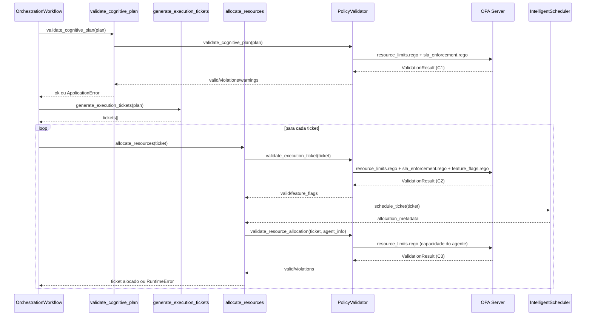

# Neural Hive-Mind - Integração de Validação de Políticas OPA

Este documento descreve como o **PolicyValidator** integra o OPA Policy Engine no fluxo de orquestração do orchestrator-dynamic, cobrindo as três etapas de validação (C1, C2 e C3), métricas, configuração e troubleshooting.

## Visão Geral

- O `PolicyValidator` aplica políticas OPA em pontos críticos do fluxo.
- Etapas cobertas: C1 (plano cognitivo), C2 (ticket de execução) e C3 (alocação de recursos).
- Métricas OPA já instrumentadas e coletadas em todas as validações.

## C1: Validação de Plano Cognitivo

- **Quando:** Após receber o plano, antes de gerar tickets.
- **Onde:** `services/orchestrator-dynamic/src/activities/plan_validation.py:88`.
- **Políticas:** `resource_limits.rego`, `sla_enforcement.rego`.
- **Exemplo de violação:** Total de tickets excede `max_concurrent_tickets`.

## C2: Validação de Ticket de Execução

- **Quando:** Antes de alocar recursos para cada ticket.
- **Onde:** `services/orchestrator-dynamic/src/activities/ticket_generation.py:192`.
- **Políticas:** `resource_limits.rego`, `sla_enforcement.rego`, `feature_flags.rego`.
- **Feature Flags:** `enable_intelligent_scheduler`, `enable_burst_capacity`, `enable_predictive_allocation`, `enable_auto_scaling`.
- **policy_decisions:** dicionário indexado por `policy_path` retornado pelo OPA; entradas especiais como `feature_flags` são adicionadas diretamente para facilitar o consumo.
- **Exemplo de violação:** Deadline no passado ou QoS incompatível com `risk_band`.

## C3: Validação de Alocação de Recursos

- **Quando:** Após o `IntelligentScheduler.schedule_ticket()` selecionar um worker e antes de finalizar a alocação.
- **Onde:** `services/orchestrator-dynamic/src/activities/ticket_generation.py` (bloco pós-scheduler).
- **Políticas:** `policies/rego/orchestrator/resource_limits.rego` (capacidade do agente).
- **policy_decisions:** segue o mesmo formato de C2 (indexado por `policy_path`, com `feature_flags` se presente).
- **Exemplo de violação:** Capability não permitida, timeout excede máximo ou limite de tickets concorrentes.

## Configuração

- `OPA_ENABLED`: habilita validação de políticas (default: true).
- `OPA_HOST`: host do OPA server (default: `opa.neural-hive-orchestration.svc.cluster.local`).
- `OPA_FAIL_OPEN`: permite alocação se OPA falhar (default: false).
- `OPA_INTELLIGENT_SCHEDULER_ENABLED`: feature flag para scheduler inteligente (default: true).
- `OPA_BURST_CAPACITY_ENABLED`: feature flag para burst capacity (default: true).
- Políticas disponíveis em `policies/rego/orchestrator/`.

## Métricas

- `opa_validations_total{policy_name, result}`: validações por política.
- `opa_validation_duration_seconds{policy_name}`: duração das avaliações.
- `opa_policy_rejections_total{policy_name, rule, severity}`: rejeições.
- `opa_policy_warnings_total{policy_name, rule}`: avisos.
- `opa_evaluation_errors_total{error_type}`: falhas de avaliação/OPA.

## Troubleshooting

- Ative `OPA_FAIL_OPEN=true` para não bloquear se o OPA estiver indisponível (gera warning).
- Use logs estruturados do `PolicyValidator` para identificar `violations` e `warnings`.
- Teste políticas localmente executando OPA com as regras em `policies/rego/orchestrator/`.
- Verifique se `allocation_metadata.agent_id` e `capacity` estão presentes antes de validar C3.

## Exemplos

- **Plano válido:** tasks com deadlines dentro do SLA e `max_concurrent_tickets` respeitado.
- **Ticket inválido (timeout):** `sla.timeout_ms` acima do limite em `resource_limits.rego`.
- **Alocação rejeitada (capability):** `required_capabilities` não incluída em `allowed_capabilities`.
- **Feature flags:** OPA retorna `enable_intelligent_scheduler=true`, permitindo uso do Intelligent Scheduler.
