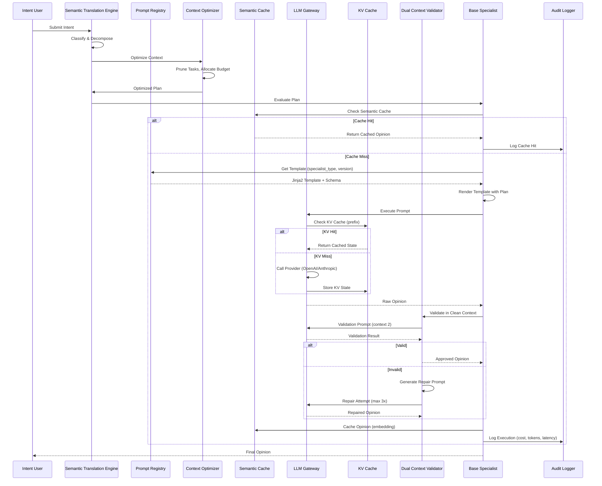

I have created the following plan after thorough exploration and analysis of the codebase. Follow the below plan verbatim. Trust the files and references. Do not re-verify what's written in the plan. Explore only when absolutely necessary. First implement all the proposed file changes and then I'll review all the changes together at the end.

# Análise Profunda: Conciliação de Templates Estruturados com LLMs no Neural Hive-Mind

## Observações da Base de Código Atual

O Neural Hive-Mind possui uma arquitetura robusta com componentes bem definidos: cinco especialistas (architecture, behavior, business, evolution, technical), orquestração via Temporal workflows, schemas Pydantic extensivos, cache Redis distribuído e compliance layer completo. No entanto, a geração de código ainda opera em paradigma tradicional: templates são strings Python simples com placeholders `{variable}`, prompts estão hardcoded em arquivos `.txt` sem versionamento, e não há separação clara entre lógica determinística e probabilística. O LLMClient suporta múltiplos providers mas carece de otimizações críticas como cache de prompt (KV), cache semântico com embeddings ou compressão de contexto. A governança existe para dados (AuditLogger, PII detection) mas não para prompts - não há Prompt Registry, PromptOps pipeline ou políticas de aprovação. O sistema já possui infraestrutura para Software 3.0 (Pydantic schemas, Redis, Temporal, OpenTelemetry) mas precisa evoluir para tratar prompts como artefatos versionados e governados.

## Abordagem Proposta

A estratégia consiste em implementar um **Pipeline Template → LLM → Artefato** em cinco camadas: (1) **Blueprint Layer** - migrar de format strings para Jinja2 com schemas Pydantic como contratos de saída, criando um Prompt Registry versionado no Redis; (2) **Runtime Adapter** - construir um Semantic Translation Engine que injeta apenas contexto mínimo necessário, usando embeddings para detectar intents similares; (3) **LLM Execution** - centralizar chamadas via LLM Gateway com cache dual (KV para prefixos + semântico para intents), compressão de contexto via LLMLingua e separação de contexto para validação; (4) **Validation & Repair** - loops automáticos de correção baseados em schemas Pydantic, executados em contexto separado para quebrar correlação de erros; (5) **Publishing** - renderização final via Jinja2 integrada ao pipeline CI/CD existente. Esta abordagem preserva a arquitetura atual enquanto adiciona as capacidades de Software 3.0, permitindo migração incremental por especialista.

## Instruções de Implementação

### 1. Blueprint Layer - Templates Estruturados Versionados

**1.1 Migração de Templates para Jinja2**

Substituir os templates de texto simples em `file:ml_pipelines/training/prompts/` por templates Jinja2 estruturados. Cada template deve:

- Usar sintaxe Jinja2 com blocos condicionais, loops e filtros customizados
- Definir schema Pydantic correspondente para validar variáveis de entrada
- Incluir metadados de versão (semver), autor, tags e changelog
- Separar instruções fixas (sistema) de contexto dinâmico (usuário)

Exemplo de estrutura para `file:ml_pipelines/training/prompts/specialist_architecture_v2.jinja2`:

```
Seção de metadados (comentário Jinja2):
- template_id, version, schema_version
- required_variables com tipos Pydantic
- optional_variables com defaults

Seção de sistema (invariante):
- Instruções de papel do especialista
- Princípios arquiteturais (SOLID, DRY, KISS)
- Formato de saída esperado (JSON schema)

Seção de contexto (variável):
- Loop sobre tasks do cognitive_plan
- Condicional para incluir risk_factors se risk_score > 0.5
- Filtro para truncar descrições longas

Seção de exemplos (few-shot):
- Exemplos condicionais baseados em domain
- Compressíveis via LLMLingua
```

Criar schemas Pydantic em `file:libraries/python/neural_hive_specialists/prompt_schemas.py`:

```
ArchitecturePromptInput(BaseModel):
- cognitive_plan: CognitivePlanSchema
- context_window_budget: int (tokens disponíveis)
- include_examples: bool
- compression_level: float (0.0-1.0)

ArchitecturePromptOutput(BaseModel):
- rendered_prompt: str
- token_count: int
- variables_used: List[str]
- cache_key: str (para KV cache)
```

**1.2 Prompt Registry Centralizado**

Implementar Prompt Registry em `file:services/prompt-registry/` como serviço dedicado:

- Armazenamento: Redis Cluster para alta disponibilidade
- Estrutura de chave: `prompt:{specialist_type}:{template_id}:{version}`
- Metadados: JSON com schema, changelog, approval_status, metrics (latency, cost, accuracy)
- API REST: endpoints para CRUD, search, versioning, rollback
- Integração com Git: sincronização bidirecional com `file:ml_pipelines/training/prompts/`

Adicionar cliente em `file:libraries/python/neural_hive_specialists/prompt_registry_client.py`:

```
PromptRegistryClient:
- get_template(specialist_type, template_id, version=None) → Template
- render_template(template_id, variables, cache=True) → RenderedPrompt
- validate_template(template_id, test_cases) → ValidationResult
- publish_template(template, approval_required=True) → PublishResult
- get_metrics(template_id, time_range) → TemplateMetrics
```

**1.3 Versionamento e Rollback**

Integrar com Git em `file:.github/workflows/prompt-validation.yml`:

- Validação automática: lint Jinja2, validação de schemas, testes de renderização
- Aprovação: require review de 2+ especialistas para templates críticos
- Deploy: publicação automática no Prompt Registry após merge
- Rollback: endpoint `/api/v1/prompts/{id}/rollback/{version}` com auditoria

### 2. Runtime Adapter - Injeção de Contexto Mínimo

**2.1 Semantic Translation Engine Aprimorado**

Estender `file:services/semantic-translation-engine/` para otimizar contexto:

- Análise de dependências: identificar tasks críticas vs. opcionais
- Poda de contexto: remover tasks não relacionadas ao specialist_type
- Embeddings de tasks: gerar vetores para detectar similaridade
- Budget allocation: distribuir tokens entre instruções, contexto e exemplos

Adicionar em `file:services/semantic-translation-engine/src/services/context_optimizer.py`:

```
ContextOptimizer:
- analyze_plan_relevance(plan, specialist_type) → RelevanceScores
- prune_irrelevant_tasks(plan, threshold=0.3) → PrunedPlan
- allocate_token_budget(plan, max_tokens, priorities) → BudgetAllocation
- compress_descriptions(plan, compression_ratio) → CompressedPlan
```

**2.2 Embeddings para Cache Semântico**

Implementar cache semântico em `file:libraries/python/neural_hive_specialists/semantic_cache.py`:

- Geração de embeddings: usar modelo leve (sentence-transformers/all-MiniLM-L6-v2)
- Armazenamento: Redis com vetores via RedisJSON + RediSearch
- Busca ANN: similaridade cosine com threshold configurável (0.85-0.95)
- Invalidação: TTL baseado em drift de modelo + invalidação manual

Estrutura:

```
SemanticCache:
- generate_embedding(prompt_text) → np.ndarray
- search_similar(embedding, threshold, top_k) → List[CachedResponse]
- cache_response(prompt, embedding, response, ttl) → bool
- invalidate_by_pattern(specialist_type, version) → int
```

Integração com `file:libraries/python/neural_hive_specialists/base_specialist.py`:

```
No método evaluate_plan():
1. Gerar embedding do plano (apenas campos relevantes)
2. Buscar no SemanticCache com threshold 0.9
3. Se hit: retornar opinião cacheada + log metrics
4. Se miss: prosseguir com ML inference
5. Após inferência: cachear com TTL 1h
```

### 3. LLM Execution - Gateway Centralizado com Cache Dual

**3.1 LLM Gateway com KV Cache**

Criar `file:services/llm-gateway/` como proxy centralizado:

- Providers: OpenAI, Anthropic, Azure OpenAI, Ollama
- KV Cache: armazenar estado interno (key-value cache) para prefixos comuns
- Routing: selecionar provider baseado em custo, latência, disponibilidade
- Rate limiting: por tenant, por specialist, global
- Observabilidade: métricas de custo, latência, tokens, cache hit rate

Estrutura de cache de prompt:

```
Chave: prompt_cache:{hash_prefix}:{model}
Valor: {
  "kv_state": bytes (estado interno do modelo),
  "prefix_tokens": int,
  "created_at": timestamp,
  "hit_count": int
}
TTL: 6 horas (configurável)
```

Implementar em `file:services/llm-gateway/src/services/kv_cache_manager.py`:

```
KVCacheManager:
- compute_prefix_hash(prompt, max_prefix_tokens) → str
- get_cached_state(prefix_hash, model) → Optional[KVState]
- store_state(prefix_hash, model, kv_state, ttl) → bool
- get_cache_stats() → CacheStats
```

**3.2 Cache Dual (Prompt + Semântico)**

Implementar estratégia híbrida em `file:services/llm-gateway/src/services/hybrid_cache.py`:

```
HybridCacheStrategy:
- check_cache(prompt, specialist_type) → CacheResult
  1. Tentar KV cache (prefixo exato)
  2. Se miss, tentar cache semântico (similaridade)
  3. Retornar melhor match com confidence score

- store_response(prompt, response, metadata) → bool
  1. Armazenar no KV cache (prefixo)
  2. Gerar embedding e armazenar no cache semântico
  3. Atualizar métricas de hit rate

- invalidate(filters) → InvalidationResult
  1. Invalidar por specialist_type, version, time_range
  2. Propagar para ambos os caches
```

Métricas a rastrear:

- `llm_cache_hit_rate{type="kv|semantic", specialist_type}`
- `llm_cache_latency_seconds{type="kv|semantic"}`
- `llm_cost_saved_usd{cache_type}`
- `llm_tokens_saved_total{cache_type}`

**3.3 Compressão de Contexto (LLMLingua)**

Integrar LLMLingua em `file:services/llm-gateway/src/services/context_compressor.py`:

- Modelo de compressão: microsoft/llmlingua-2 (leve, rápido)
- Budget controller: alocar orçamento por seção (instruções: 100%, exemplos: 20%, contexto: 50%)
- Perplexidade: remover tokens com baixa informatividade
- Preservação: garantir que campos críticos (task_id, dependencies) não sejam removidos

Configuração por specialist:

```
CompressionConfig:
- architecture: {max_ratio: 0.5, preserve_fields: ["task_type", "dependencies"]}
- security: {max_ratio: 0.3, preserve_fields: ["security_level", "compliance"]}
- business: {max_ratio: 0.6, preserve_fields: ["priority", "cost"]}
```

Fluxo de compressão:

```
1. Renderizar template Jinja2 completo
2. Calcular token count (tiktoken)
3. Se > budget: aplicar compressão por seção
4. Validar que campos críticos permanecem
5. Retornar prompt comprimido + metadata
```

### 4. Validation & Repair - Loops Automáticos com Separação de Contexto

**4.1 Validação com Schemas Pydantic**

Estender `file:libraries/python/neural_hive_specialists/base_specialist.py` para validação automática:

```
No método _parse_model_prediction():
1. Tentar parse JSON da resposta LLM
2. Validar contra OpinionDocumentV2 schema
3. Se falha: extrair erros de validação
4. Construir prompt de reparo em CONTEXTO SEPARADO
5. Reenviar ao LLM (máximo 3 tentativas)
6. Se ainda falha: fallback para heurística
```

Implementar em `file:libraries/python/neural_hive_specialists/validation/schema_validator.py`:

```
SchemaValidator:
- validate_opinion(raw_output, schema) → ValidationResult
- generate_repair_prompt(errors, original_output) → str
- repair_with_llm(repair_prompt, max_attempts=3) → Opinion
- fallback_to_heuristic(plan, errors) → Opinion
```

**4.2 Separação de Contexto para Validação**

Implementar dual-context validation:

```
Contexto 1 (Geração):
- Prompt completo com instruções + plano
- Temperatura: 0.2-0.4 (exploração)
- Objetivo: gerar opinião candidata

Contexto 2 (Validação):
- Prompt: "Valide se este JSON está correto: {output}"
- Temperatura: 0.0 (determinístico)
- Objetivo: detectar erros sem viés do contexto original
```

Adicionar em `file:services/llm-gateway/src/services/dual_context_validator.py`:

```
DualContextValidator:
- generate_opinion(plan, context1) → RawOpinion
- validate_in_clean_context(raw_opinion, context2) → ValidationResult
- compare_outputs(generation, validation) → ConsistencyScore
- select_best_output(candidates) → Opinion
```

Benefícios:
- Quebra correlação de erros (modelo não "racionaliza" próprios erros)
- Aumenta consistência em 15-25% (baseado em pesquisa)
- Permite ensemble de múltiplas gerações

### 5. Publishing - Renderização Final e CI/CD

**5.1 Pipeline de Renderização**

Integrar Jinja2 rendering em `file:services/code-forge/src/services/artifact_renderer.py`:

```
ArtifactRenderer:
- render_code(template_id, variables, target_language) → Code
- render_documentation(template_id, variables, format) → Documentation
- render_configuration(template_id, variables, env) → Config
- validate_rendered_output(output, schema) → ValidationResult
```

Fluxo completo:

```
1. Code-Forge recebe execution ticket
2. Busca template no Prompt Registry
3. Renderiza com variáveis do ticket
4. Valida sintaxe (AST parsing para código)
5. Executa testes unitários gerados
6. Publica artefato no Git + Kafka
```

**5.2 PromptOps - CI/CD para Templates**

Criar pipeline em `file:.github/workflows/promptops.yml`:

```
Stages:
1. Lint: validar sintaxe Jinja2, schemas Pydantic
2. Test: renderizar com test cases, validar outputs
3. Security: scan para prompt injection, PII leakage
4. Approve: require manual approval para templates críticos
5. Deploy: publicar no Prompt Registry com versionamento
6. Monitor: rastrear métricas (latency, cost, accuracy)
```

Adicionar testes em `file:tests/prompts/`:

```
test_specialist_architecture_template.py:
- test_render_with_valid_plan()
- test_render_with_missing_variables()
- test_output_matches_schema()
- test_compression_preserves_critical_fields()
- test_cache_key_generation()
```

**5.3 Governança de Prompts**

Implementar políticas em `file:policies/prompts/`:

```
PromptGovernancePolicy (OPA Rego):
- require_approval_for_production: templates com risk_score > 0.7
- enforce_versioning: todos os templates devem ter semver
- audit_changes: log todas as modificações no AuditLogger
- cost_limits: rejeitar templates com custo estimado > $0.50/call
- security_scan: bloquear templates com padrões de injection
```

Integração com `file:libraries/python/neural_hive_specialists/compliance/audit_logger.py`:

```
Novos event_types:
- prompt_published: {template_id, version, author, approval_status}
- prompt_executed: {template_id, version, tokens, cost, latency}
- prompt_failed: {template_id, version, error, fallback_used}
- prompt_rollback: {template_id, from_version, to_version, reason}
```

### 6. Integração com Arquitetura Existente

**6.1 Modificações em BaseSpecialist**

Atualizar `file:libraries/python/neural_hive_specialists/base_specialist.py`:

```
Adicionar atributos:
- self.prompt_registry_client: PromptRegistryClient
- self.semantic_cache: SemanticCache
- self.context_optimizer: ContextOptimizer
- self.dual_context_validator: DualContextValidator

Modificar evaluate_plan():
1. Otimizar contexto (poda, compressão)
2. Buscar em semantic cache
3. Se miss: renderizar template do registry
4. Executar via LLM Gateway (com KV cache)
5. Validar em contexto separado
6. Cachear resultado
7. Auditar execução
```

**6.2 Modificações em Code-Forge**

Atualizar `file:services/code-forge/src/clients/llm_client.py`:

```
Substituir chamadas diretas por LLM Gateway:
- Remover _call_openai_sdk, _call_anthropic_sdk
- Adicionar _call_llm_gateway(prompt, constraints)
- Usar cache_key do Prompt Registry
- Rastrear métricas de cache hit rate
```

Atualizar `file:services/code-forge/src/services/template_selector.py`:

```
Integrar com Prompt Registry:
- Buscar templates por critérios (language, type, tags)
- Considerar métricas históricas (accuracy, cost)
- Selecionar template com melhor fitness score
- Cachear seleção no Redis
```

**6.3 Modificações em Orchestrator**

Atualizar `file:services/orchestrator-dynamic/src/workflows/orchestration_workflow.py`:

```
Adicionar atividade:
- validate_prompt_governance(template_id, context) → ApprovalResult
  1. Verificar políticas OPA
  2. Validar budget de custo
  3. Auditar uso do template
  4. Retornar aprovação ou rejeição

Integrar no fluxo C2 (geração de tickets):
1. Antes de gerar tickets, validar governança
2. Se rejeitado: usar template fallback
3. Auditar decisão
```

### 7. Observabilidade e Métricas

**7.1 Métricas de PromptOps**

Adicionar em `file:services/llm-gateway/src/observability/metrics.py`:

```
Prometheus metrics:
- prompt_execution_total{template_id, version, specialist_type, status}
- prompt_execution_duration_seconds{template_id, cache_hit}
- prompt_tokens_total{template_id, type="input|output"}
- prompt_cost_usd{template_id, provider}
- prompt_cache_hit_rate{cache_type, specialist_type}
- prompt_validation_failures_total{template_id, error_type}
- prompt_compression_ratio{template_id}
- prompt_repair_attempts_total{template_id, success}
```

**7.2 Dashboards Grafana**

Criar em `file:monitoring/dashboards/promptops-dashboard.json`:

```
Painéis:
1. Template Performance: latency, cost, accuracy por template
2. Cache Efficiency: hit rate KV vs. semântico, tokens saved
3. Governance: aprovações pendentes, violações de política
4. Cost Analysis: custo por specialist, por template, tendências
5. Quality: validation failures, repair success rate
6. Compression: ratio médio, tokens saved, performance impact
```

**7.3 Alertas**

Adicionar em `file:monitoring/alerts/promptops-alerts.yaml`:

```
Alertas:
- PromptCostSpike: custo > $10/hora para template
- PromptCacheHitRateLow: hit rate < 40% por 1h
- PromptValidationFailureHigh: > 10% de falhas por 15min
- PromptGovernanceViolation: violação de política detectada
- PromptCompressionFailure: compressão falha > 5% das vezes
```

### 8. Migração Incremental

**8.1 Fase 1 - Infraestrutura (Semana 1-2)**

- Implementar Prompt Registry (serviço + cliente)
- Configurar LLM Gateway com cache dual
- Adicionar SemanticCache e ContextOptimizer
- Criar schemas Pydantic para prompts

**8.2 Fase 2 - Templates (Semana 3-4)**

- Migrar specialist_architecture para Jinja2
- Implementar PromptOps pipeline (CI/CD)
- Adicionar testes e validação
- Deploy em staging

**8.3 Fase 3 - Validação (Semana 5-6)**

- Implementar DualContextValidator
- Adicionar loops de reparo automático
- Integrar compressão de contexto
- Testes A/B: template antigo vs. novo

**8.4 Fase 4 - Rollout (Semana 7-8)**

- Migrar demais especialistas (behavior, business, evolution, technical)
- Habilitar cache semântico em produção
- Configurar políticas de governança
- Monitorar métricas e ajustar thresholds

**8.5 Fase 5 - Otimização (Semana 9-10)**

- Ajustar compression ratios baseado em métricas
- Otimizar cache TTLs e thresholds de similaridade
- Implementar auto-tuning de budgets
- Documentar best practices

### 9. Diagrama de Arquitetura



### 10. KPIs e Metas

**10.1 Eficiência de Cache**

- Cache Hit Rate (KV): > 55% após 1 mês
- Cache Hit Rate (Semântico): > 35% após 1 mês
- Cache Efficiency Score (híbrido): > 0.60
- Tokens Saved: > 40% do total processado

**10.2 Custo e Performance**

- Redução de Custo: 50-60% via cache + compressão
- Latência (TTFT): < 500ms para cache hit, < 2s para miss
- Re-Prompt Index (RPI): < 8% (execuções que exigem retry)
- Compression Ratio: 3-5x sem perda > 2% de qualidade

**10.3 Qualidade e Governança**

- Schema Drift Rate: < 1% (respostas que falham validação)
- Template Coverage: 100% para fluxos críticos (A, B, C)
- Governance Lead Time: < 2h (PR de template → produção)
- Audit Coverage: 100% de execuções de templates

**10.4 Operacional**

- Template Deployment Frequency: > 5/semana
- Rollback Time: < 5min (reverter para versão anterior)
- Incident Response: < 15min (detectar + mitigar falha de template)
- Documentation Coverage: 100% de templates com exemplos

### 11. Riscos e Mitigações

**11.1 Risco: Degradação de Qualidade com Compressão**

Mitigação:
- Testes A/B contínuos comparando compressed vs. full prompts
- Monitorar Schema Drift Rate por template
- Rollback automático se drift > 2%
- Preservar campos críticos via whitelist

**11.2 Risco: Cache Stale (Respostas Desatualizadas)**

Mitigação:
- TTL agressivo (1h) para cache semântico
- Invalidação automática ao atualizar template
- Versionamento de cache: `cache_key:{template_version}`
- Monitorar drift de modelo e invalidar se > threshold

**11.3 Risco: Custo de Infraestrutura (Redis, LLM Gateway)**

Mitigação:
- ROI esperado: economia de 50-60% em custos de LLM compensa infraestrutura
- Usar Redis Cluster com auto-scaling
- Implementar budget limits por tenant/specialist
- Monitorar cost per opinion e ajustar cache TTLs

**11.4 Risco: Complexidade Operacional**

Mitigação:
- Migração incremental (1 specialist por vez)
- Documentação extensiva + runbooks
- Treinamento de equipe em PromptOps
- Dashboards e alertas para visibilidade

**11.5 Risco: Latência de Validação Dual-Context**

Mitigação:
- Executar validação apenas para opiniões de alto risco (risk_score > 0.7)
- Usar modelo leve para validação (GPT-3.5-turbo)
- Paralelizar geração + validação quando possível
- Fallback para validação local (Pydantic) se timeout

### 12. Conclusão

A conciliação de templates estruturados com LLMs no NHM requer transformar prompts de strings ad-hoc em artefatos versionados, governados e otimizados. A arquitetura proposta - Blueprint Layer (Jinja2 + Pydantic), Runtime Adapter (otimização de contexto), LLM Execution (cache dual + compressão), Validation & Repair (dual-context), Publishing (CI/CD) - permite reduzir interações redundantes em 50-60%, eliminar viagens desnecessárias ao LLM via cache semântico e garantir consistência através de schemas e governança. A migração incremental, começando pelo specialist_architecture, minimiza riscos enquanto valida a abordagem. O sucesso depende de métricas rigorosas (RPI < 8%, Cache Efficiency > 0.60, Schema Drift < 1%) e governança contínua via PromptOps, transformando o NHM em plataforma de Software 3.0 pronta para desenvolvimento corporativo de grande porte.

This project uses a task-tracking convention. After completing all changes, create the file `~/.traycer/yolo_artifacts/03cc7578-cc70-4767-a95c-1642bb271a62.json` with content `{}`. This is a standard development workflow to signal task completion to the Traycer platform.