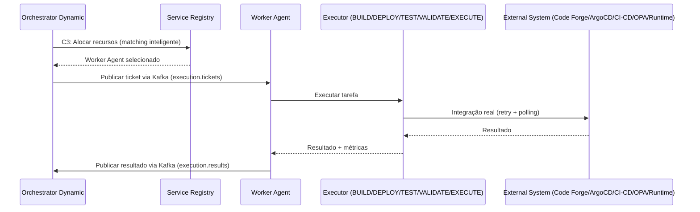
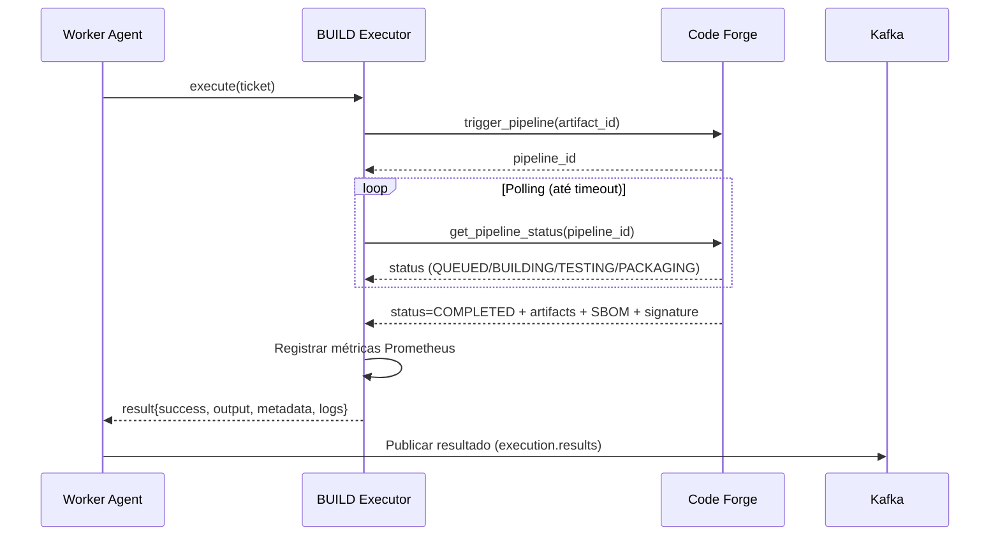
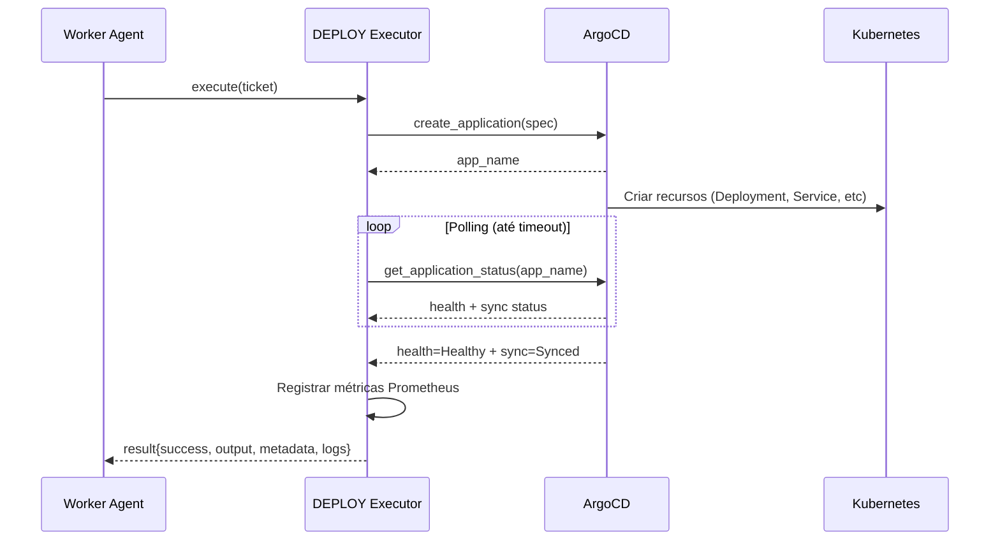
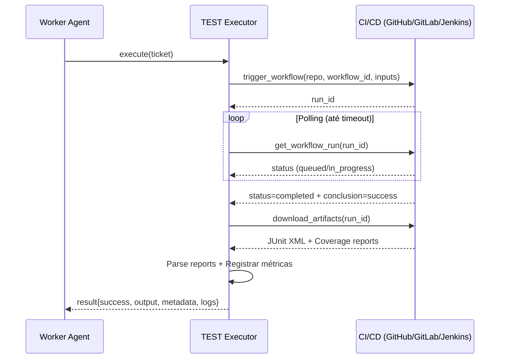
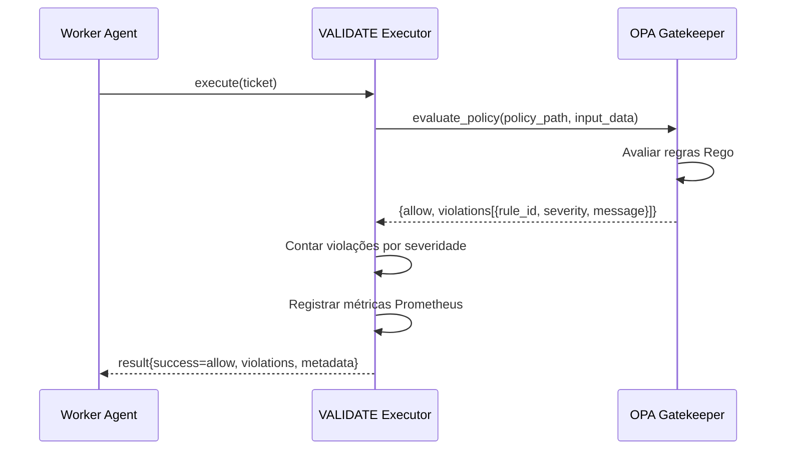
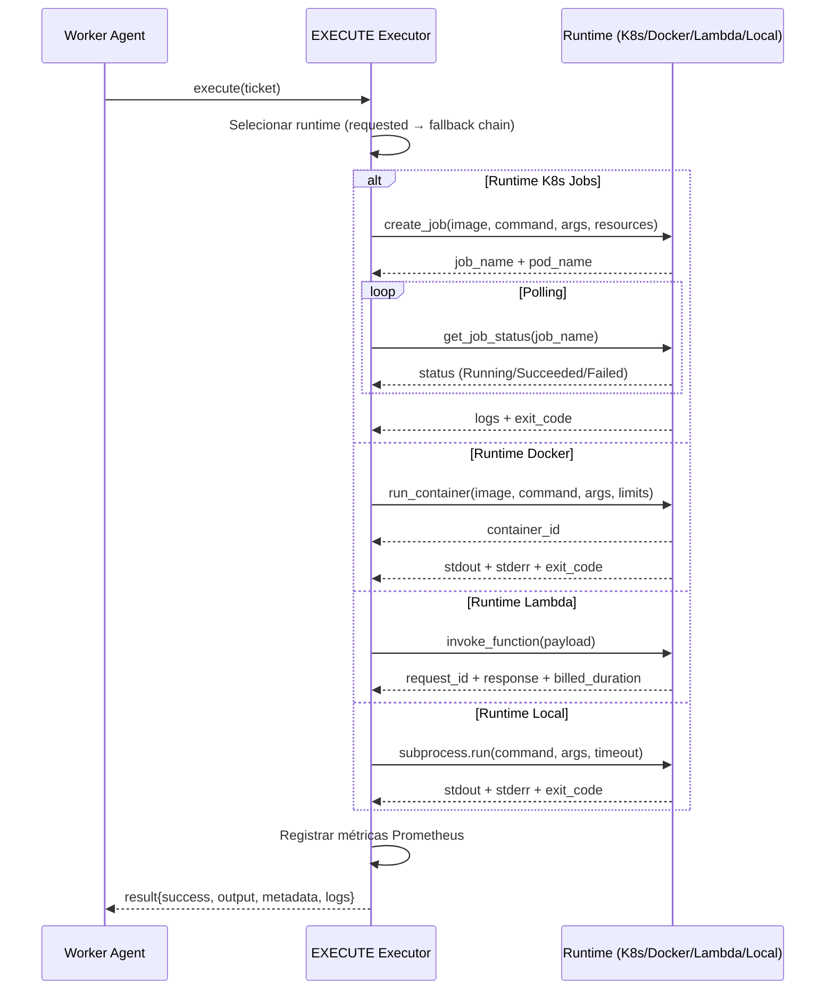

# Guia de Integração Worker Agents

## Visão Geral

Os Worker Agents implementam **5 executors especializados** com integrações reais a sistemas externos, constituindo a camada de execução distribuída do Neural Hive-Mind.

| Executor | Integração Real | Status | LOC |
|----------|----------------|--------|-----|
| **BUILD** | Code Forge | ✅ Production-Ready | 202 |
| **DEPLOY** | ArgoCD + Flux | ✅ Production-Ready | 763 |
| **TEST** | GitHub Actions + GitLab CI + Jenkins | ✅ Production-Ready | 1.345 |
| **VALIDATE** | OPA + Trivy + SonarQube + Snyk + Checkov | ✅ Production-Ready | 716 |
| **EXECUTE** | K8s Jobs + Docker + Lambda + Local | ✅ Production-Ready | 653 |

### Funcionalidades Comuns

Todos os executors implementam:
- ✅ Retry logic com exponential backoff (3 tentativas)
- ✅ Polling de status com timeout configurável
- ✅ Métricas Prometheus completas (25+ métricas por executor)
- ✅ Fallback gracioso para simulação
- ✅ OpenTelemetry distributed tracing
- ✅ Structured logging (structlog + JSON)

### Arquitetura de Execução



---

## BUILD Executor - Code Forge Integration

### Funcionalidades Implementadas

- Trigger de pipeline via `CodeForgeClient.trigger_pipeline(artifact_id)`
- Polling de status com timeout configurável (padrão: 14.400s / 4h)
- Retry logic: 3 tentativas com exponential backoff (2s base, max 60s)
- Processamento de artifacts, SBOM e signatures
- Fallback gracioso para simulação se Code Forge indisponível

**Arquivo**: `services/worker-agents/src/executors/build_executor.py`

### Configuração via Helm

```yaml
# helm-charts/worker-agents/values.yaml
codeForge:
  enabled: true
  url: "http://code-forge.neural-hive-code-forge:8000"
  timeout: 14400  # 4 horas
  retryAttempts: 3
  retryBackoffBase: 2
  retryBackoffMax: 60
```

### Configuração via Environment Variables

```bash
CODE_FORGE_URL=http://code-forge:8000
CODE_FORGE_TIMEOUT_SECONDS=14400
CODE_FORGE_RETRY_ATTEMPTS=3
RETRY_BACKOFF_BASE_SECONDS=2
RETRY_BACKOFF_MAX_SECONDS=60
```

### Exemplo de Ticket

```json
{
  "ticket_id": "build-abc123",
  "task_type": "BUILD",
  "parameters": {
    "artifact_id": "demo-service",
    "branch": "main",
    "commit_sha": "abc123def456",
    "build_args": {"TARGET": "production"},
    "env_vars": {"NODE_ENV": "production"},
    "timeout_seconds": 3600,
    "poll_interval_seconds": 30
  }
}
```

### Métricas Prometheus

- `build_tasks_executed_total{status="success|failed"}` - Total de builds executados
- `build_duration_seconds{stage="completed|simulated"}` - Duração do build
- `build_artifacts_generated_total{type="docker|helm|sbom"}` - Artifacts gerados
- `code_forge_api_calls_total{method="trigger|status",status="success|error"}` - Chamadas API

### Validação

```bash
# Verificar integração Code Forge
kubectl exec -n neural-hive-execution deployment/worker-agents -- \
  curl -f http://code-forge.neural-hive-code-forge:8000/health

# Validar executor
bash scripts/validation/validate-build-executor.sh

# Verificar métricas
kubectl port-forward -n neural-hive-execution svc/worker-agents 8000:8000
curl -s http://localhost:8000/metrics | grep build_tasks_executed_total
```

### Troubleshooting

- **Erro "Pipeline not triggered"**: Verificar conectividade com Code Forge (`kubectl exec -it deployment/worker-agents -- curl http://code-forge:8000/health`)
- **Timeout em builds longos**: Aumentar `CODE_FORGE_TIMEOUT_SECONDS` para projetos grandes
- **Fallback para simulação**: Logs mostrarão `build_fallback_simulation` - verificar disponibilidade do Code Forge

### Diagrama de Sequência



---

## DEPLOY Executor - ArgoCD/Flux Integration

### Funcionalidades Implementadas

- Suporte a **3 providers**: ArgoCD (cliente dedicado), Flux (cliente dedicado), ArgoCD Legacy (httpx)
- Criação de Application (ArgoCD) ou Kustomization (Flux)
- Polling de health/ready status com timeout configurável (padrão: 600s)
- Sync policies: auto (prune + selfHeal) ou manual
- Tratamento de erros: timeout, API errors, unexpected errors
- Fallback gracioso para simulação se nenhum provider disponível

**Arquivo**: `services/worker-agents/src/executors/deploy_executor.py`

### Configuração via Helm

```yaml
# helm-charts/worker-agents/values.yaml
argocd:
  enabled: true
  url: "https://argocd.neural-hive-argocd:443"
  namespace: "argocd"
  token: ""  # Fornecido via Secret argocd-token

flux:
  enabled: true
  namespace: "flux-system"
```

### Configuração via Environment Variables

```bash
ARGOCD_ENABLED=true
ARGOCD_URL=https://argocd:443
ARGOCD_TOKEN=<token>
FLUX_ENABLED=true
FLUX_NAMESPACE=flux-system
```

### Exemplo de Ticket ArgoCD

```json
{
  "ticket_id": "deploy-xyz789",
  "task_type": "DEPLOY",
  "parameters": {
    "provider": "argocd",
    "deployment_name": "demo-service",
    "namespace": "production",
    "repo_url": "https://github.com/org/repo",
    "chart_path": "helm/demo-service",
    "revision": "v1.2.3",
    "image": "registry.io/demo-service:v1.2.3",
    "replicas": 3,
    "sync_strategy": "auto",
    "timeout_seconds": 600,
    "poll_interval": 5
  }
}
```

### Exemplo de Ticket Flux

```json
{
  "ticket_id": "deploy-flux-123",
  "task_type": "DEPLOY",
  "parameters": {
    "provider": "flux",
    "deployment_name": "demo-kustomization",
    "namespace": "production",
    "source_kind": "GitRepository",
    "source_name": "demo-repo",
    "path": "./kustomize/overlays/prod",
    "interval": "5m",
    "prune": true,
    "wait": true
  }
}
```

### Métricas Prometheus

- `deploy_tasks_executed_total{status="success|failed|timeout"}` - Total de deploys
- `deploy_duration_seconds{stage="argocd|flux|simulated"}` - Duração do deploy
- `argocd_api_calls_total{method="create|get",status="success|error"}` - Chamadas ArgoCD API
- `flux_api_calls_total{method="create|get",status="success|error"}` - Chamadas Flux API

### Validação

```bash
# Verificar integração ArgoCD
kubectl exec -n neural-hive-execution deployment/worker-agents -- \
  curl -k https://argocd.neural-hive-argocd/api/version

# Verificar integração Flux
kubectl get kustomizations -n flux-system

# Validar executor
bash scripts/validation/validate-deploy-executor.sh

# Verificar métricas
curl -s http://localhost:8000/metrics | grep deploy_tasks_executed_total
```

### Troubleshooting

- **ArgoCDTimeoutError**: Application criada mas não atingiu status Healthy - verificar logs do ArgoCD (`kubectl logs -n argocd deployment/argocd-application-controller`)
- **FluxTimeoutError**: Kustomization não ficou Ready - verificar `kubectl describe kustomization -n flux-system`
- **Fallback para simulação**: Nenhum provider disponível - habilitar ArgoCD ou Flux via Helm

### Diagrama de Sequência



---

## TEST Executor - CI/CD Integration

### Funcionalidades Implementadas

- Suporte a **4 providers**: GitHub Actions, GitLab CI, Jenkins, Local (subprocess)
- Trigger de workflows/pipelines com parâmetros dinâmicos
- Polling de status com timeout configurável (padrão: 1.800s / 30min)
- Parsing de resultados: JUnit XML, coverage reports (Cobertura XML, lcov, JSON)
- Retry logic: 3 tentativas com exponential backoff
- Fallback em cascata: CI/CD → Local → Simulation

**Arquivo**: `services/worker-agents/src/executors/test_executor.py`

### Configuração via Helm

```yaml
# helm-charts/worker-agents/values.yaml
cicd:
  githubActions:
    enabled: true
    token: ""  # Fornecido via Secret github-token
    apiUrl: "https://api.github.com"

  gitlabCI:
    enabled: true
    token: ""  # Fornecido via Secret gitlab-token
    apiUrl: "https://gitlab.com/api/v4"

  jenkins:
    enabled: true
    url: "https://jenkins.example.com"
    username: "admin"
    token: ""  # Fornecido via Secret jenkins-token
```

### Configuração via Environment Variables

```bash
# GitHub Actions
GITHUB_ACTIONS_ENABLED=true
GITHUB_TOKEN=<token>
GITHUB_API_URL=https://api.github.com

# GitLab CI
GITLAB_CI_ENABLED=true
GITLAB_TOKEN=<token>
GITLAB_API_URL=https://gitlab.com/api/v4

# Jenkins
JENKINS_ENABLED=true
JENKINS_URL=https://jenkins.example.com
JENKINS_USERNAME=admin
JENKINS_TOKEN=<token>
```

### Exemplo de Ticket GitHub Actions

```json
{
  "ticket_id": "test-gh-456",
  "task_type": "TEST",
  "parameters": {
    "provider": "github_actions",
    "repo_owner": "neural-hive",
    "repo_name": "demo-service",
    "workflow_id": "test.yml",
    "ref": "main",
    "inputs": {
      "test_suite": "integration",
      "coverage": "true"
    },
    "timeout_seconds": 1800,
    "poll_interval": 10
  }
}
```

### Exemplo de Ticket Local

```json
{
  "ticket_id": "test-local-789",
  "task_type": "TEST",
  "parameters": {
    "provider": "local",
    "command": "pytest",
    "args": ["tests/", "--cov=src", "--junitxml=junit.xml"],
    "working_dir": "/app",
    "timeout_seconds": 600
  }
}
```

### Métricas Prometheus

- `test_tasks_executed_total{status="success|failed|timeout"}` - Total de testes
- `test_duration_seconds{provider="github|gitlab|jenkins|local"}` - Duração dos testes
- `test_coverage_percentage{provider}` - Cobertura de código
- `test_results_total{status="passed|failed|skipped"}` - Resultados de testes

### Validação

```bash
# Verificar integração GitHub Actions
kubectl exec -n neural-hive-execution deployment/worker-agents -- \
  curl -H "Authorization: token $GITHUB_TOKEN" https://api.github.com/user

# Verificar integração GitLab CI
kubectl exec -n neural-hive-execution deployment/worker-agents -- \
  curl -H "PRIVATE-TOKEN: $GITLAB_TOKEN" https://gitlab.com/api/v4/user

# Validar executor
bash scripts/validation/validate-test-executor.sh

# Verificar métricas
curl -s http://localhost:8000/metrics | grep test_tasks_executed_total
```

### Troubleshooting

- **Workflow não encontrado**: Verificar `workflow_id` correto no repositório
- **Timeout em testes longos**: Aumentar `timeout_seconds` para suites extensas
- **Parsing de coverage falhou**: Verificar formato do relatório (Cobertura XML, lcov, JSON)

### Diagrama de Sequência



---

## VALIDATE Executor - OPA/Security Tools Integration

### Funcionalidades Implementadas

- Suporte a **6 ferramentas**: OPA Gatekeeper (cliente dedicado + legacy), Trivy, SonarQube, Snyk, Checkov
- Avaliação de políticas OPA com violações por severidade (CRITICAL, HIGH, MEDIUM, LOW)
- SAST scanning via Trivy (filesystem + container images)
- Code quality via SonarQube
- Dependency scanning via Snyk
- IaC scanning via Checkov
- Fallback conservador: retorna FALHA se OPA indisponível (segurança por padrão)

**Arquivo**: `services/worker-agents/src/executors/validate_executor.py`

### Configuração via Helm

```yaml
# helm-charts/worker-agents/values.yaml
opa:
  enabled: true
  url: "http://opa.neural-hive-governance:8181"

trivy:
  enabled: true
  timeout: 300

sonarqube:
  enabled: true
  url: "https://sonarqube.example.com"
  token: ""  # Fornecido via Secret sonarqube-token

snyk:
  enabled: true
  token: ""  # Fornecido via Secret snyk-token

checkov:
  enabled: true
```

### Configuração via Environment Variables

```bash
# OPA
OPA_ENABLED=true
OPA_URL=http://opa:8181

# Trivy
TRIVY_ENABLED=true
TRIVY_TIMEOUT_SECONDS=300

# SonarQube
SONARQUBE_ENABLED=true
SONARQUBE_URL=https://sonarqube.example.com
SONARQUBE_TOKEN=<token>

# Snyk
SNYK_ENABLED=true
SNYK_TOKEN=<token>

# Checkov
CHECKOV_ENABLED=true
```

### Exemplo de Ticket OPA

```json
{
  "ticket_id": "validate-opa-123",
  "task_type": "VALIDATE",
  "parameters": {
    "validation_type": "policy",
    "policy_path": "kubernetes/admission/deny_privileged",
    "input_data": {
      "kind": "Pod",
      "spec": {
        "containers": [{
          "name": "app",
          "securityContext": {"privileged": false}
        }]
      }
    }
  }
}
```

### Exemplo de Ticket Trivy

```json
{
  "ticket_id": "validate-trivy-456",
  "task_type": "VALIDATE",
  "parameters": {
    "validation_type": "sast",
    "working_dir": "/app/src",
    "timeout_seconds": 300
  }
}
```

### Métricas Prometheus

- `validate_tasks_executed_total{status="success|failed|timeout",tool="opa|trivy|sonarqube|snyk|checkov"}` - Total de validações
- `validate_duration_seconds{tool}` - Duração da validação
- `validate_violations_total{severity="critical|high|medium|low",tool}` - Violações detectadas
- `policy_violations_total{severity,tool}` - Violações de política (OPA)
- `opa_api_calls_total{method="evaluate",status="success|error|timeout"}` - Chamadas OPA API
- `opa_policy_evaluation_duration_seconds{policy_path}` - Duração de avaliação por política

### Validação

```bash
# Verificar integração OPA
kubectl exec -n neural-hive-execution deployment/worker-agents -- \
  curl http://opa.neural-hive-governance:8181/health

# Verificar Trivy instalado
kubectl exec -n neural-hive-execution deployment/worker-agents -- trivy --version

# Validar executor
bash scripts/validation/validate-validate-executor.sh

# Verificar métricas
curl -s http://localhost:8000/metrics | grep validate_tasks_executed_total
```

### Troubleshooting

- **OPA indisponível**: Fallback conservador retorna FALHA - verificar deployment OPA (`kubectl get pods -n neural-hive-governance`)
- **Trivy timeout**: Aumentar `TRIVY_TIMEOUT_SECONDS` para projetos grandes
- **Violações não classificadas**: Verificar formato de resposta OPA (deve incluir `severity` field)

### Diagrama de Sequência



---

## EXECUTE Executor - Multi-Runtime Integration

### Funcionalidades Implementadas

- Suporte a **5 runtimes**: Kubernetes Jobs, Docker, AWS Lambda, Local (subprocess), Simulation
- Seleção inteligente de runtime com fallback chain configurável
- Isolamento completo (K8s Jobs), isolamento de filesystem (Docker), serverless (Lambda)
- Resource limits configuráveis (CPU, memory)
- Timeout e graceful termination
- Integração opcional com Code Forge para geração de código

**Arquivo**: `services/worker-agents/src/executors/execute_executor.py`

### Configuração via Helm

```yaml
# helm-charts/worker-agents/values.yaml
runtimes:
  defaultRuntime: "k8s"
  fallbackChain: ["k8s", "docker", "local", "simulation"]

  k8sJobs:
    enabled: true
    namespace: "neural-hive-execution"
    serviceAccount: "worker-agent-executor"
    defaultCpuRequest: "100m"
    defaultCpuLimit: "1000m"
    defaultMemoryRequest: "128Mi"
    defaultMemoryLimit: "512Mi"
    timeout: 600

  docker:
    enabled: true
    networkMode: "bridge"
    defaultCpuLimit: 1.0
    defaultMemoryLimit: "512m"
    timeout: 600

  lambda:
    enabled: false
    functionName: "neural-hive-executor"
    region: "us-east-1"

  local:
    enabled: true
    timeout: 300
```

### Configuração via Environment Variables

```bash
# Runtime padrão
DEFAULT_RUNTIME=k8s
RUNTIME_FALLBACK_CHAIN=k8s,docker,local,simulation

# Kubernetes Jobs
K8S_JOBS_NAMESPACE=neural-hive-execution
K8S_JOBS_SERVICE_ACCOUNT=worker-agent-executor
K8S_JOBS_DEFAULT_CPU_REQUEST=100m
K8S_JOBS_DEFAULT_CPU_LIMIT=1000m
K8S_JOBS_DEFAULT_MEMORY_REQUEST=128Mi
K8S_JOBS_DEFAULT_MEMORY_LIMIT=512Mi
K8S_JOBS_TIMEOUT_SECONDS=600

# Docker
DOCKER_NETWORK_MODE=bridge
DOCKER_DEFAULT_CPU_LIMIT=1.0
DOCKER_DEFAULT_MEMORY_LIMIT=512m
DOCKER_TIMEOUT_SECONDS=600

# Lambda
LAMBDA_FUNCTION_NAME=neural-hive-executor
AWS_REGION=us-east-1

# Local
LOCAL_RUNTIME_TIMEOUT_SECONDS=300
```

### Exemplo de Ticket K8s Jobs

```json
{
  "ticket_id": "execute-k8s-123",
  "task_type": "EXECUTE",
  "parameters": {
    "runtime": "k8s",
    "image": "python:3.11-slim",
    "command": ["python", "-c"],
    "args": ["print('Hello from K8s Job')"],
    "env_vars": {"ENV": "production"},
    "cpu_request": "200m",
    "cpu_limit": "500m",
    "memory_request": "256Mi",
    "memory_limit": "512Mi",
    "timeout_seconds": 300
  }
}
```

### Exemplo de Ticket Docker

```json
{
  "ticket_id": "execute-docker-456",
  "task_type": "EXECUTE",
  "parameters": {
    "runtime": "docker",
    "image": "alpine:latest",
    "command": ["sh", "-c"],
    "args": ["echo 'Hello from Docker'"],
    "working_dir": "/app",
    "network_mode": "bridge",
    "timeout_seconds": 60
  }
}
```

### Exemplo de Ticket Code Forge

```json
{
  "ticket_id": "execute-forge-789",
  "task_type": "EXECUTE",
  "parameters": {
    "template_id": "microservice-python",
    "template": "microservice-python",
    "service_name": "demo-api",
    "framework": "fastapi"
  }
}
```

### Métricas Prometheus

- `execute_tasks_executed_total{status="success|failed"}` - Total de execuções
- `execute_duration_seconds{runtime="k8s|docker|lambda|local|code_forge|simulation"}` - Duração por runtime
- `execute_runtime_fallbacks_total{from_runtime,to_runtime}` - Fallbacks de runtime

### Validação

```bash
# Verificar K8s Jobs
kubectl get jobs -n neural-hive-execution

# Verificar Docker disponível
kubectl exec -n neural-hive-execution deployment/worker-agents -- docker ps

# Validar executor
bash scripts/validation/validate-execute-executor.sh

# Verificar métricas
curl -s http://localhost:8000/metrics | grep execute_tasks_executed_total
```

### Troubleshooting

- **K8s Job não inicia**: Verificar RBAC do ServiceAccount (`kubectl describe serviceaccount worker-agent-executor -n neural-hive-execution`)
- **Docker não disponível**: Verificar Docker socket montado no pod (`/var/run/docker.sock`)
- **Fallback para simulação**: Todos os runtimes falharam - verificar logs de cada runtime

### Diagrama de Sequência



---

## Configuração de Secrets

### Criar Secrets Kubernetes

```bash
# Code Forge
kubectl create secret generic codeforge-token \
  -n neural-hive-execution \
  --from-literal=token=<code-forge-token>

# ArgoCD
kubectl create secret generic argocd-token \
  -n neural-hive-execution \
  --from-literal=token=<argocd-token>

# GitHub Actions
kubectl create secret generic github-token \
  -n neural-hive-execution \
  --from-literal=token=<github-token>

# GitLab CI
kubectl create secret generic gitlab-token \
  -n neural-hive-execution \
  --from-literal=token=<gitlab-token>

# Jenkins
kubectl create secret generic jenkins-token \
  -n neural-hive-execution \
  --from-literal=token=<jenkins-token>

# SonarQube
kubectl create secret generic sonarqube-token \
  -n neural-hive-execution \
  --from-literal=token=<sonarqube-token>

# Snyk
kubectl create secret generic snyk-token \
  -n neural-hive-execution \
  --from-literal=token=<snyk-token>
```

### Referência nos Helm Values

```yaml
secrets:
  codeForgeToken:
    secretName: codeforge-token
    key: token
  argoCDToken:
    secretName: argocd-token
    key: token
  githubToken:
    secretName: github-token
    key: token
  gitlabToken:
    secretName: gitlab-token
    key: token
  jenkinsToken:
    secretName: jenkins-token
    key: token
  sonarQubeToken:
    secretName: sonarqube-token
    key: token
  snykToken:
    secretName: snyk-token
    key: token
```

---

## Deployment e Validação

### Deploy Worker Agents

```bash
# Deploy via script modular
bash scripts/deploy/modules/phase2/workers.sh

# Ou via Helm direto
helm upgrade --install worker-agents ./helm-charts/worker-agents \
  --namespace neural-hive-execution \
  --create-namespace \
  --values helm-charts/worker-agents/values.yaml \
  --set codeForge.enabled=true \
  --set argocd.enabled=true \
  --set cicd.githubActions.enabled=true \
  --set opa.enabled=true \
  --set runtimes.k8sJobs.enabled=true
```

### Validação Completa

```bash
# Validar deployment
kubectl get pods -n neural-hive-execution -l app=worker-agents

# Validar integrações (script consolidado)
bash scripts/validation/validate-worker-agents-integrations.sh

# Validar executor específico
bash scripts/validation/validate-build-executor.sh
bash scripts/validation/validate-deploy-executor.sh
bash scripts/validation/validate-test-executor.sh
bash scripts/validation/validate-validate-executor.sh
bash scripts/validation/validate-execute-executor.sh

# Verificar métricas
kubectl port-forward -n neural-hive-execution svc/worker-agents 8000:8000
curl -s http://localhost:8000/metrics | grep -E "(build|deploy|test|validate|execute)_tasks_executed_total"

# Verificar logs
kubectl logs -n neural-hive-execution deployment/worker-agents -f | grep -E "(build|deploy|test|validate|execute)_"
```

---

## Troubleshooting Geral

### Problemas Comuns

1. **Executor não encontra cliente de integração**
   - **Sintoma**: Logs mostram fallback para simulação imediatamente
   - **Causa**: Cliente não inicializado (URL/token não configurado)
   - **Solução**: Verificar Helm values e secrets Kubernetes

2. **Timeout em operações longas**
   - **Sintoma**: Logs mostram timeout após X segundos
   - **Causa**: Timeout padrão insuficiente para operação
   - **Solução**: Aumentar `timeout_seconds` no ticket ou configuração global

3. **Retry esgotado**
   - **Sintoma**: Logs mostram 3 tentativas falhadas
   - **Causa**: Serviço externo indisponível ou erro persistente
   - **Solução**: Verificar conectividade e logs do serviço externo

4. **Métricas não aparecem no Prometheus**
   - **Sintoma**: `curl /metrics` não retorna métricas esperadas
   - **Causa**: ServiceMonitor não configurado ou métricas não registradas
   - **Solução**: Verificar `helm-charts/worker-agents/templates/servicemonitor.yaml` e inicialização de métricas

5. **Fallback conservador OPA**
   - **Sintoma**: Validações sempre falham quando OPA indisponível
   - **Causa**: Comportamento intencional (segurança por padrão)
   - **Solução**: Garantir alta disponibilidade do OPA ou ajustar política de fallback

### Comandos de Diagnóstico

```bash
# Verificar conectividade com serviços externos
kubectl exec -n neural-hive-execution deployment/worker-agents -- \
  curl -v http://code-forge:8000/health

# Verificar secrets montados
kubectl exec -n neural-hive-execution deployment/worker-agents -- \
  ls -la /etc/secrets/

# Verificar logs estruturados
kubectl logs -n neural-hive-execution deployment/worker-agents --tail=100 | jq .

# Verificar traces OpenTelemetry
kubectl port-forward -n observability svc/jaeger-query 16686:16686
# Acessar http://localhost:16686 e buscar por "task_execution"

# Verificar métricas específicas
kubectl exec -n neural-hive-execution deployment/worker-agents -- \
  curl -s http://localhost:8000/metrics | grep -A 5 "build_tasks_executed_total"
```

---

## Documentação Relacionada

- **Arquitetura**: `docs/architecture/worker-agents-executors.md`
- **Integrações Específicas**:
  - `docs/integrations/code-forge-integration.md`
  - `docs/integrations/argocd-integration.md`
  - `docs/integrations/cicd-integration.md`
  - `docs/integrations/validation-tools.md`
- **Status da Fase 2**: `PHASE2_IMPLEMENTATION_STATUS.md`
- **Guia Operacional**: `OPERATIONAL_GUIDE.md`

---

**Última atualização**: 2025-01-09
**Versão**: 1.0
**Mantenedores**: Equipe DevOps Neural Hive-Mind
