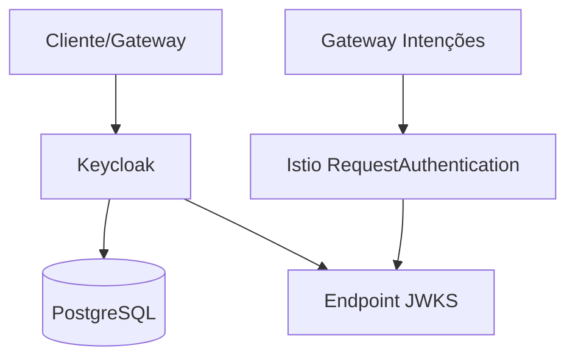

# ADR-0009: Seleção de Provedor OAuth2/OIDC

## Status

Aceito

## Contexto

O documento-04-seguranca-governanca define requisitos de autenticação robusta com OAuth2 + mTLS híbrido para o Neural Hive-Mind. Necessário provedor OIDC que integre com Istio RequestAuthentication e suporte federação de identidades.

## Decisão

Utilizar Keycloak como provedor OAuth2/OIDC interno ao invés de soluções SaaS ou cloud-native.

## Justificativa

### Keycloak vs. Alternativas

**Keycloak (Escolhido)**
- Open source e controle total
- Integração nativa com Kubernetes
- Suporte completo a mTLS
- Federação de identidades (LDAP, SAML, social)
- Customização de claims JWT
- Integração direta com Istio RequestAuthentication

**Auth0**
- Alto custo para escala enterprise
- Vendor lock-in
- Latência adicional (cloud)
- Menor controle sobre dados sensíveis

**Okta**
- Custos elevados
- Dependência de conectividade externa
- Limitações de customização

**Soluções Cloud-Native (AWS Cognito, Azure AD B2C)**
- Vendor lock-in severo
- Funcionalidades limitadas
- Integração complexa com Istio

## Arquitetura



## Configuração

- Deployment: 2+ replicas para HA
- Database: PostgreSQL gerenciado
- Realm: 'neural-hive'
- Clients: gateway-intencoes, microserviços
- Integration: Istio service mesh
- Certificados: automáticos (cert-manager)

## Consequências

### Positivas
- Controle completo sobre autenticação
- Integração nativa com stack Kubernetes
- Flexibilidade máxima para customização
- Dados sensíveis permanecem internos
- Suporte a múltiplos protocolos

### Negativas
- Responsabilidade operacional total
- Necessidade de backup/HA próprios
- Curva de aprendizado da equipe
- Gestão de atualizações de segurança

## Integração com Istio

```yaml
apiVersion: security.istio.io/v1beta1
kind: RequestAuthentication
metadata:
  name: jwt-neural-hive
spec:
  jwtRules:
  - issuer: "https://keycloak.neural-hive.local/auth/realms/neural-hive"
    jwksUri: "https://keycloak.neural-hive.local/auth/realms/neural-hive/protocol/openid-connect/certs"
```

## Implementação

- Terraform module para Keycloak + PostgreSQL
- Helm chart para configuração de realm
- Políticas OPA para validação de tokens
- Scripts de setup e manutenção