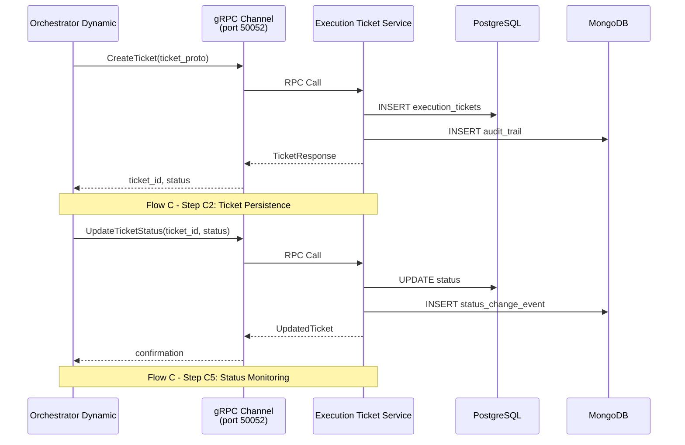

# Arquitetura de Comunicacao gRPC: Orchestrator -> Execution Ticket Service

## 1. Visao Geral

Este documento descreve a arquitetura de comunicacao gRPC entre o Orchestrator Dynamic e o Execution Ticket Service no contexto do Flow C (C1-C6).

### Papel do gRPC no Flow C

Apos a etapa C2 (Generate Tickets), o orchestrator usa gRPC para persistir tickets no Execution Ticket Service. O gRPC foi escolhido por:

- **Performance**: Menor latencia e overhead comparado a REST
- **Type Safety**: Protocol Buffers garantem contratos tipados entre servicos
- **Streaming Futuro**: Suporte nativo para streaming bidirecional (monitoramento em tempo real)

## 2. Diagrama de Sequencia



## 3. Endpoints gRPC

### GetTicket

```protobuf
rpc GetTicket(GetTicketRequest) returns (ExecutionTicket)
```

**Proposito**: Buscar ticket por ID.

**Uso**: Orchestrator consulta detalhes de um ticket especifico durante monitoramento de execucao.

**Exemplo**:
```python
request = GetTicketRequest(ticket_id="tk-abc123")
ticket = stub.GetTicket(request)
```

### ListTickets

```protobuf
rpc ListTickets(ListTicketsRequest) returns (TicketList)
```

**Proposito**: Listar tickets com filtros (plan_id, status, paginacao).

**Uso**: Orchestrator lista todos os tickets de um plano para monitorar progresso geral.

**Exemplo**:
```python
request = ListTicketsRequest(
    plan_id="plan-xyz",
    status="PENDING",
    offset=0,
    limit=100
)
tickets = stub.ListTickets(request)
```

### UpdateTicketStatus

```protobuf
rpc UpdateTicketStatus(UpdateStatusRequest) returns (ExecutionTicket)
```

**Proposito**: Atualizar status de um ticket (PENDING -> IN_PROGRESS -> COMPLETED/FAILED).

**Uso**: Worker Agents reportam progresso de execucao; Orchestrator atualiza status baseado em eventos.

**Exemplo**:
```python
request = UpdateStatusRequest(
    ticket_id="tk-abc123",
    status="COMPLETED",
    error_message=""
)
updated = stub.UpdateTicketStatus(request)
```

### GenerateToken

```protobuf
rpc GenerateToken(TokenRequest) returns (TokenResponse)
```

**Proposito**: Gerar JWT escopado para autorizacao de worker agent.

**Uso**: Antes de dispatch, orchestrator obtem token para incluir no envelope de execucao.

**Exemplo**:
```python
request = TokenRequest(ticket_id="tk-abc123")
response = stub.GenerateToken(request)
jwt_token = response.token
```

## 4. Configuracao de Deployment

### Helm Chart

O Helm chart configura o gRPC atraves de:

**Service** (expoe porta 50052):
```yaml
service:
  ports:
    grpc:
      port: 50052
      targetPort: 50052
      protocol: TCP
```

**Readiness Probe** (valida disponibilidade gRPC):
```yaml
readinessProbe:
  grpc:
    port: 50052
    service: ""  # Usa servico padrao de health check gRPC
```

**ConfigMap** (variaveis de ambiente):
```yaml
config:
  grpc:
    port: 50052
    maxWorkers: 10
    critical: true
```

### Verificacao Manual

```bash
# Verificar se porta gRPC esta aberta
kubectl exec -n neural-hive-orchestration deployment/orchestrator-dynamic -- \
  nc -zv execution-ticket-service 50052

# Listar servicos gRPC disponiveis
kubectl exec -n neural-hive-orchestration deployment/orchestrator-dynamic -- \
  grpcurl -plaintext execution-ticket-service.neural-hive-orchestration.svc.cluster.local:50052 list

# Descrever servico
kubectl exec -n neural-hive-orchestration deployment/orchestrator-dynamic -- \
  grpcurl -plaintext execution-ticket-service.neural-hive-orchestration.svc.cluster.local:50052 \
  describe neural_hive.execution.TicketService
```

## 5. Observabilidade

### Metricas gRPC Instrumentadas

| Metrica | Descricao |
|---------|-----------|
| `grpc_server_handled_total{grpc_method="GetTicket"}` | Total de chamadas GetTicket |
| `grpc_server_handled_total{grpc_method="UpdateTicketStatus"}` | Total de chamadas UpdateTicketStatus |
| `grpc_server_handling_seconds{grpc_method="ListTickets"}` | Latencia de ListTickets |
| `grpc_server_handling_seconds_bucket` | Histograma de latencia por metodo |

### Correlacao de Traces

OpenTelemetry correlaciona traces atraves do flow:

```
intent_id -> plan_id -> ticket_id
```

Cada chamada gRPC propaga contexto de trace, permitindo visualizar o caminho completo no Jaeger:
- Span: `orchestrator.generate_tickets`
  - Span: `grpc.CreateTicket`
    - Span: `postgres.insert`
    - Span: `mongodb.insert`

## 6. Troubleshooting

### Erro: gRPC ConnectError

**Sintomas**: Orchestrator logs mostram `failed to connect to execution-ticket-service:50052`

**Diagnostico**:
```bash
# 1. Verificar se pod esta rodando
kubectl get pods -n neural-hive-orchestration -l app=execution-ticket-service

# 2. Verificar logs de inicializacao do gRPC server
kubectl logs -n neural-hive-orchestration -l app=execution-ticket-service --tail=100 | grep -i grpc

# 3. Testar conectividade de rede
kubectl exec -n neural-hive-orchestration deployment/orchestrator-dynamic -- \
  nc -zv execution-ticket-service 50052

# 4. Verificar readiness probe
kubectl describe pod -n neural-hive-orchestration -l app=execution-ticket-service | grep -A10 "Readiness"
```

**Solucoes Comuns**:
- Se pod nao esta Running: verificar eventos do pod (`kubectl describe pod`)
- Se probe falha: verificar se porta 50052 esta exposta no container
- Se rede falha: verificar NetworkPolicies e Service DNS

### Erro: gRPC Unavailable

**Sintomas**: Chamadas retornam `UNAVAILABLE: Connection refused`

**Diagnostico**:
```bash
# Verificar se servico esta registrado
kubectl get endpoints execution-ticket-service -n neural-hive-orchestration

# Verificar se porta 50052 esta no service
kubectl get svc execution-ticket-service -n neural-hive-orchestration -o yaml | grep -A5 "ports:"
```

### Erro: gRPC DeadlineExceeded

**Sintomas**: Chamadas timeout apos periodo configurado

**Diagnostico**:
```bash
# Verificar latencia de queries PostgreSQL
kubectl logs -n neural-hive-orchestration -l app=execution-ticket-service | grep -i "query.*ms"

# Verificar metricas de latencia
kubectl exec -n neural-hive-orchestration -l app=execution-ticket-service -- \
  curl -s localhost:9090/metrics | grep grpc_server_handling_seconds
```

**Solucoes**:
- Aumentar timeout no cliente gRPC
- Otimizar queries de banco de dados
- Verificar se MongoDB/PostgreSQL estao sobrecarregados
