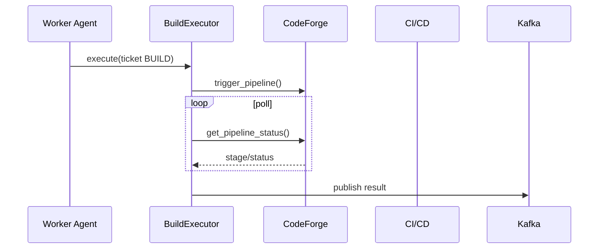
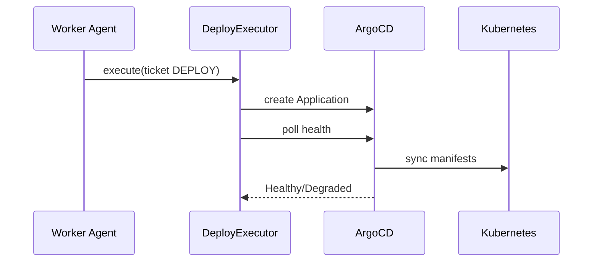
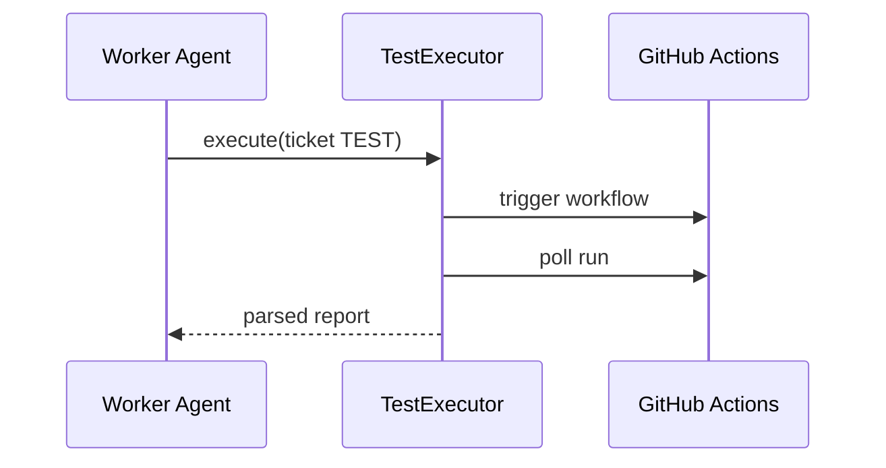
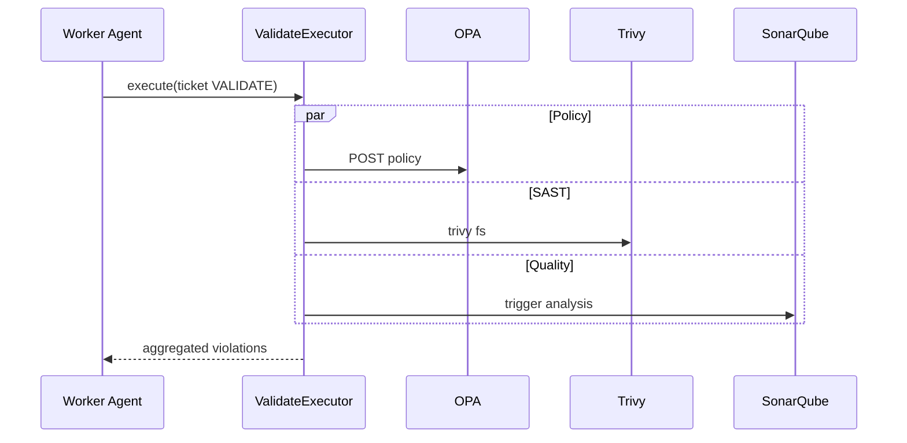

# Worker Agents Executors Architecture

```mermaid
sequenceDiagram
    participant WA as Worker Agent
    participant BE as BuildExecutor
    participant CF as CodeForge
    participant CI as CI/CD
    participant K as Kafka

    WA->>BE: execute(ticket BUILD)
    BE->>CF: trigger_pipeline()
    loop poll
        BE->>CF: get_pipeline_status()
        CF-->>BE: stage/status
    end
    BE->>K: publish result
```

```mermaid
sequenceDiagram
    participant WA as Worker Agent
    participant DE as DeployExecutor
    participant AC as ArgoCD
    participant K8s as Kubernetes

    WA->>DE: execute(ticket DEPLOY)
    DE->>AC: create Application
    DE->>AC: poll health
    AC->>K8s: sync manifests
    AC-->>DE: Healthy/Degraded
```

```mermaid
sequenceDiagram
    participant WA as Worker Agent
    participant TE as TestExecutor
    participant GA as GitHub Actions

    WA->>TE: execute(ticket TEST)
    TE->>GA: trigger workflow
    TE->>GA: poll run
    TE-->>WA: parsed report
```

```mermaid
sequenceDiagram
    participant WA as Worker Agent
    participant VE as ValidateExecutor
    participant OPA as OPA
    participant TR as Trivy
    participant SQ as SonarQube

    WA->>VE: execute(ticket VALIDATE)
    par Policy
        VE->>OPA: POST policy
    and SAST
        VE->>TR: trivy fs
    and Quality
        VE->>SQ: trigger analysis
    end
    VE-->>WA: aggregated violations
```
