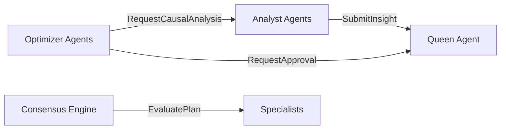

# Guia de Integração gRPC - Neural Hive-Mind

## Visão Geral
Este documento descreve a arquitetura gRPC do Neural Hive-Mind e como os serviços se comunicam.

## Arquitetura de Comunicação



## Serviços e Protos

### Queen Agent
- **Proto:** `services/queen-agent/src/proto/queen_agent.proto`
- **Endpoints:**
  - `GetStrategicDecision`: Buscar decisão estratégica
  - `GetSystemStatus`: Status do sistema
  - `RequestExceptionApproval`: Solicitar aprovação de exceção
  - `SubmitInsight`: Receber insights de Analyst Agents

### Analyst Agents
- **Proto:** `services/analyst-agents/src/proto/analyst_agent.proto`
- **Endpoints:**
  - `GetInsight`: Buscar insight por ID
  - `QueryInsights`: Listar insights
  - `ExecuteAnalysis`: Executar análise sob demanda

### Optimizer Agents
- **Proto:** `services/optimizer-agents/src/proto/optimizer_agent.proto`
- **Endpoints:**
  - `TriggerOptimization`: Disparar otimização manual
  - `GetOptimizationStatus`: Status de otimização
  - `GetLoadForecast`: Previsão de carga ML

## Compilação de Protos

### Compilar Todos os Protos
```bash
make proto-gen-all
```

### Compilar Proto de Serviço Específico
```bash
cd services/<service-name>
make proto
```

## Uso dos Clientes gRPC

### Optimizer -> Analyst
```python
from src.clients.analyst_agents_grpc_client import AnalystAgentsGrpcClient

client = AnalystAgentsGrpcClient()
await client.connect()

result = await client.request_causal_analysis(
    target_component='api-gateway',
    degradation_metrics={'latency_p99': 500},
    context={'environment': 'production'}
)

await client.disconnect()
```

### Optimizer -> Queen
```python
from src.clients.queen_agent_grpc_client import QueenAgentGrpcClient

client = QueenAgentGrpcClient()
await client.connect()

decision = await client.request_approval(
    optimization_id='opt-123',
    optimization_type='WEIGHT_RECALIBRATION',
    hypothesis={'description': 'Ajustar pesos do scheduler'},
    risk_score=0.4
)

await client.disconnect()
```

## Troubleshooting

### Erro: "No module named 'proto'"
**Solução:** Compilar protos com `make proto`

### Erro: "grpc.RpcError: StatusCode.UNAVAILABLE"
**Solução:** Verificar se serviço de destino está rodando

### Erro: "ImportError: cannot import name 'xxx_pb2'"
**Solução:** Recompilar protos e verificar imports relativos

## Testes

### Testes Unitários
```bash
cd services/<service-name>
pytest tests/test_*_grpc_client.py -v
```

### Testes de Integração
```bash
pytest tests/test_grpc_integration.py -v -m integration
```
