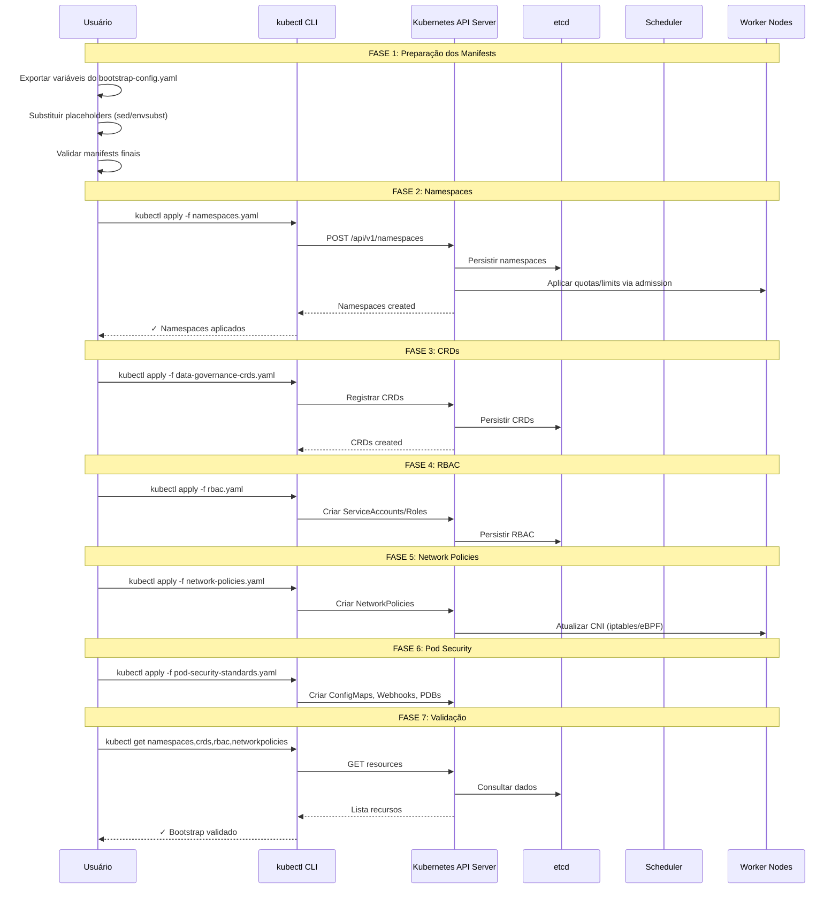

# Guia de Aplicação Manual do Bootstrap Kubernetes - Neural Hive-Mind

Este guia descreve como preparar e aplicar **manualmente** os manifests de bootstrap do Neural Hive-Mind em um cluster Kubernetes instalado via Kubeadm com 1 nó master e 2 nós workers. Siga os passos exatamente na ordem descrita para garantir consistência entre ambientes.

---

## 1. Pré-requisitos e Verificações Iniciais

1. **Ferramentas instaladas**
   ```bash
   sudo apt-get update && sudo apt-get install -y kubectl yq gettext-base
   ```
2. **Verificar conectividade com o cluster Kubeadm**
   ```bash
   kubectl cluster-info
   ```
   _Saída esperada:_ Endpoints de Kubernetes master e DNS. Se o comando falhar, valide kubeconfig e conectividade.
3. **Confirmar contexto atual e permissões de cluster-admin**
   ```bash
   kubectl config current-context
   kubectl auth can-i '*' '*' --all-namespaces
   ```
   _Saída esperada:_ `yes` indicando que você possui permissões elevadas.
4. **Listar nós e validar status**
   ```bash
   kubectl get nodes -o wide
   ```
   _Saída esperada:_ 1 nó master e 2 nós workers com STATUS `Ready`. Caso haja nós `NotReady`, corrija antes de prosseguir.

---

## 2. Preparação dos Manifests - Substituição de Placeholders

### 2.1 Criar diretório temporário
```bash
mkdir -p .tmp/bootstrap-manual
cp k8s/bootstrap/* .tmp/bootstrap-manual/
```
_Este diretório conterá os manifests processados usados para aplicação manual._

### 2.2 Exportar variáveis de ambiente do arquivo de configuração
```bash
eval $(yq eval 'to_entries | .[] | select(.value | type == "!!str") | "export " + .key + "=\"" + .value + "\""' environments/local/bootstrap-config.yaml)
```
_Valide se o carregamento funcionou:_
```bash
echo $local_cognition_cpu_requests
```

### 2.3 Processar `namespaces.yaml`
1. **Fluxo recomendado (automatizado):**
   ```bash
   docs/manual-deployment/scripts/01-prepare-bootstrap-manifests.sh
   ```
   _O script lê `environments/local/bootstrap-config.yaml`, substitui todos os placeholders de quotas, CRDs e LimitRanges definidos em `namespaces.yaml` e replica automaticamente os manifests (`rbac.yaml`, `network-policies.yaml`, `pod-security-standards.yaml`, `data-governance-crds.yaml`) para `.tmp/bootstrap-manual/`. Esse é o caminho suportado em produção._
2. **(Opcional) Exemplo manual para ajustes específicos:**
   ```bash
   # Apenas como referência; utilize se precisar testar um valor específico rapidamente.
   sed -i 's/COGNITION_CPU_REQUESTS_QUOTA/'"$local_cognition_cpu_requests"'/g' .tmp/bootstrap-manual/namespaces.yaml
   envsubst < .tmp/bootstrap-manual/namespaces.yaml > .tmp/bootstrap-manual/namespaces.final.yaml
   mv .tmp/bootstrap-manual/namespaces.final.yaml .tmp/bootstrap-manual/namespaces.yaml
   grep -E '_QUOTA|_LIMIT|_REQUEST|PLACEHOLDER' .tmp/bootstrap-manual/namespaces.yaml || echo "Todos os placeholders foram substituídos."
   ```
   _Reforce que esse fluxo manual serve apenas como exemplo; o script já cobre todos os placeholders com base no arquivo de configuração._

### 2.4 Processar demais arquivos
- `rbac.yaml`, `network-policies.yaml`, `pod-security-standards.yaml` e `data-governance-crds.yaml` não possuem placeholders; apenas confirme que estão copiados para `.tmp/bootstrap-manual/`.
- Caso adote valores customizados, faça ajustes com `yq`/`sed` antes da aplicação.

---

## 3. Aplicação dos Manifests - Ordem Recomendada

> **Importante:** use `kubectl apply -f` sempre apontando para os arquivos dentro de `.tmp/bootstrap-manual/`.

### 3.1 Namespaces, ResourceQuotas e LimitRanges
```bash
kubectl apply -f .tmp/bootstrap-manual/namespaces.yaml
```
_Saída esperada:_
```
namespace/neural-hive-system created
namespace/neural-hive-cognition created
namespace/neural-hive-orchestration created
namespace/neural-hive-execution created
namespace/neural-hive-observability created
namespace/cosign-system created
namespace/gatekeeper-system created
namespace/cert-manager created
namespace/auth created
resourcequota/neural-hive-quota created
limitrange/neural-hive-limits created
...
```
_Validação:_
```bash
kubectl get namespaces | grep neural-hive
kubectl get resourcequota -n neural-hive-cognition
kubectl describe limitrange -n neural-hive-cognition
```
_Explicação:_ cria a fundação de namespaces, quotas e limites padrão, garantindo isolamento e compliance (labels LGPD/GDPR, PSS via labels de namespace).

### 3.2 Data Governance CRDs
```bash
kubectl apply -f .tmp/bootstrap-manual/data-governance-crds.yaml
```
_Saída esperada:_ criação de `apiassets.catalog.neural-hive.io`, `dataassets.catalog.neural-hive.io`, `servicecontracts.catalog.neural-hive.io` e `datalineages.catalog.neural-hive.io`.
_Validação:_
```bash
kubectl get crds | grep neural-hive
kubectl explain apiassets.catalog.neural-hive.io
```
_Explicação:_ estende a API para governança de dados (catálogo de APIs, datasets, contratos e linhagem).

### 3.3 RBAC
```bash
kubectl apply -f .tmp/bootstrap-manual/rbac.yaml
```
_Saída esperada:_ criação das ServiceAccounts (`cognitive-processor`, `orchestration-engine`, etc.), Roles/ClusterRoles e respectivos bindings.
_Validação:_
```bash
kubectl get serviceaccounts -n neural-hive-cognition
kubectl get clusterroles | grep neural-hive
kubectl get rolebindings -n neural-hive-cognition
kubectl get clusterrolebindings | grep neural-hive
```
_Explicação:_ aplica o princípio de least privilege controlando identidades e permissões por camada.

### 3.4 Network Policies
```bash
kubectl apply -f .tmp/bootstrap-manual/network-policies.yaml
```
_Saída esperada:_ políticas `default-deny-ingress`, `allow-from-orchestration`, `allow-from-cognition`, `allow-observability-scraping`, `allow-dns-access`, `allow-istio-control`, entre outras.
_Validação:_
```bash
kubectl get networkpolicies -n neural-hive-cognition
kubectl describe networkpolicy default-deny-ingress -n neural-hive-cognition
kubectl get networkpolicies --all-namespaces | grep neural-hive
```
_Explicação:_ implementa modelo Zero Trust. Bloqueio padrão e liberações específicas para comunicação essencial (orchestration ↔ cognition/execution, observability → todos, DNS, Istio e webhooks de segurança).

### 3.5 Pod Security Standards e Proteções Adicionais
```bash
kubectl apply -f .tmp/bootstrap-manual/pod-security-standards.yaml
```
_Saída esperada:_
```
configmap/pod-security-config created
configmap/security-context-templates created
networkpolicy/default-deny-all created
networkpolicy/allow-neural-hive-communication created
validatingadmissionwebhook/neural-hive-pod-security-validator created
poddisruptionbudget/neural-hive-cognition-pdb created
poddisruptionbudget/neural-hive-orchestration-pdb created
poddisruptionbudget/neural-hive-execution-pdb created
configmap/runtime-security-config created
```
_Validação:_
```bash
kubectl get configmaps -n kube-system | grep pod-security
kubectl get networkpolicies -n neural-hive-cognition | grep default-deny-all
kubectl get validatingwebhookconfigurations | grep neural-hive
kubectl get poddisruptionbudgets -n neural-hive-cognition
```
_Explicação:_ reforça segurança de pods (ConfigMaps, NetworkPolicies adicionais, webhook de validação e PDBs para garantir alta disponibilidade).

---

## 4. Validação Completa do Bootstrap

### 4.1 Namespaces
```bash
kubectl get namespaces -l neuralhive/phase=foundation
kubectl get namespaces -o custom-columns=NAME:.metadata.name,LABELS:.metadata.labels
```
### 4.2 ResourceQuotas
```bash
for ns in neural-hive-cognition neural-hive-orchestration neural-hive-execution neural-hive-observability; do
  echo "=== Namespace: $ns ==="
  kubectl get resourcequota -n $ns
  kubectl describe resourcequota -n $ns | grep -A 10 "Used"
done
```
### 4.3 LimitRanges
```bash
for ns in neural-hive-cognition neural-hive-orchestration neural-hive-execution neural-hive-observability; do
  echo "=== Namespace: $ns ==="
  kubectl get limitrange -n $ns
  kubectl describe limitrange -n $ns | grep -A 5 "Container"
done
```
### 4.4 RBAC
```bash
kubectl get serviceaccounts -n neural-hive-cognition
kubectl get clusterroles | grep neural-hive | wc -l
kubectl get rolebindings --all-namespaces | grep neural-hive | wc -l
kubectl get clusterrolebindings | grep neural-hive | wc -l
```
### 4.5 Network Policies
```bash
kubectl get networkpolicies --all-namespaces | grep neural-hive
kubectl describe networkpolicy default-deny-ingress -n neural-hive-cognition
```
### 4.6 Pod Security Standards
```bash
kubectl get namespaces -o custom-columns=NAME:.metadata.name,PSS-ENFORCE:.metadata.labels.pod-security\.kubernetes\.io/enforce
kubectl get poddisruptionbudgets --all-namespaces | grep neural-hive
```
### 4.7 CRDs
```bash
kubectl get crds | grep catalog.neural-hive.io
kubectl api-resources | grep neural-hive
```

---

## 5. Troubleshooting e Comandos Úteis

### 5.1 Eventos e erros recentes
```bash
kubectl get events --all-namespaces --sort-by='.lastTimestamp' | grep -i error
kubectl get events -n neural-hive-cognition --sort-by='.lastTimestamp'
```
### 5.2 Recursos pendentes
```bash
kubectl get all --all-namespaces | grep -i pending
```
### 5.3 Logs do API Server (para webhooks)
```bash
kubectl logs -n kube-system -l component=kube-apiserver --tail=100
```
### 5.4 Testar conectividade entre namespaces
```bash
kubectl run test-pod -n neural-hive-cognition --image=busybox --restart=Never -- sleep 3600
kubectl exec -n neural-hive-cognition test-pod -- nslookup kubernetes.default.svc.cluster.local
kubectl delete pod test-pod -n neural-hive-cognition
```
### 5.5 Reverter bootstrap (se necessário)
```bash
kubectl delete -f .tmp/bootstrap-manual/pod-security-standards.yaml
kubectl delete -f .tmp/bootstrap-manual/network-policies.yaml
kubectl delete -f .tmp/bootstrap-manual/rbac.yaml
kubectl delete -f .tmp/bootstrap-manual/data-governance-crds.yaml
kubectl delete -f .tmp/bootstrap-manual/namespaces.yaml
```

---

## 6. Resumo e Próximos Passos

### 6.1 Checklist Final
- [ ] 9 namespaces criados com labels corretas
- [ ] 4 CRDs de governança instaladas
- [ ] ResourceQuotas aplicadas
- [ ] LimitRanges configurados
- [ ] ServiceAccounts, Roles e Bindings criados
- [ ] Network Policies aplicadas (Zero Trust)
- [ ] Pod Security Standards configurados
- [ ] PodDisruptionBudgets implantados

### 6.2 Próximos Passos
1. Deploy da infraestrutura de dados (Kafka, Redis, MongoDB, Neo4j, ClickHouse)
2. Deploy da stack de observabilidade (Prometheus, Grafana, Jaeger)
3. Build das imagens Docker dos serviços
4. Deploy dos serviços do Neural Hive-Mind

### 6.3 Recursos Estimados
- **CPU Requests:** ~4 cores
- **Memory Requests:** ~8 GiB
- **PVCs:** ~13 volumes

_Valide se o cluster suporta os requisitos:_
```bash
kubectl top nodes
kubectl describe nodes | grep -A 5 "Allocated resources"
```

---

## Anexo: Sequência de Fluxo (Mermaid)

