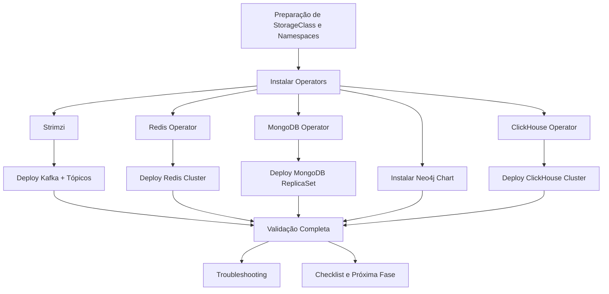

# Guia de Deploy Manual da Infraestrutura de Dados - Neural Hive-Mind

Este guia descreve, em detalhes, como implantar **manualmente** toda a camada de infraestrutura de dados (Kafka, Redis, MongoDB, Neo4j e ClickHouse) do Neural Hive-Mind em um cluster Kubernetes provisionado via **Kubeadm** com 1 nó master e 2 nós workers. Siga a ordem proposta para garantir que todos os operators e recursos customizados sejam aplicados corretamente.

---

## 1. Pré-requisitos e Verificações Iniciais

1. **Confirmar conectividade com o cluster**
   ```bash
   kubectl cluster-info
   kubectl config current-context
   kubectl get nodes -o wide
   ```
   _Saída esperada:_ contexto apontando para o cluster local e 3 nós em `Ready`.

2. **Conferir recursos disponíveis**
   ```bash
   kubectl describe nodes | egrep 'cpu:|memory:|Non-terminated Pods'
   ```
   _Saída esperada:_ pelo menos 8 vCPUs, 16 GiB de RAM e 200 GiB de armazenamento distribuído entre os nodes.

3. **Verificar StorageClasses existentes e drivers**
   ```bash
   kubectl get storageclass
   ```
   _Saída esperada:_ listagem contendo `local-path` ou `hostpath`. Caso não exista, crie conforme seção 2.

4. **Garantir Helm 3.x instalado**
   ```bash
   helm version
   ```
   _Saída esperada:_ versão `v3.x`. Instale conforme documentação oficial se não estiver presente.

5. **Adicionar repositórios Helm necessários**
   ```bash
   helm repo add strimzi https://strimzi.io/charts/
   helm repo add ot-helm https://ot-redis-operator.github.io/helm-charts/
   helm repo add mongodb https://mongodb.github.io/helm-charts
   helm repo add neo4j https://helm.neo4j.com/neo4j
   helm repo add altinity https://docs.altinity.com/clickhouse-operator/
   helm repo update
   ```
   _Saída esperada:_ confirmação de `... has been added` e `Update Complete`.

---

## 2. Preparação do Ambiente

1. **Definir StorageClass local**  
   Utilize `k8s/infrastructure/storageclass-local.yaml`:
   ```bash
   kubectl apply -f k8s/infrastructure/storageclass-local.yaml
   kubectl get storageclass
   ```
   _Saída esperada:_ `local-path` marcado como `(default)` e `hostpath` disponível como alternativa.

2. **Criar namespaces dedicados**
   ```bash
   kubectl apply -f k8s/infrastructure/namespaces-infrastructure.yaml
   kubectl get ns -l neural-hive.io/phase=infrastructure
   ```
   _Saída esperada:_ namespaces `kafka`, `redis-cluster`, `mongodb-cluster`, `neo4j-cluster`, `clickhouse-cluster` e namespaces dos operators.

3. **Aplicar labels/annotations padrões**  
   O manifesto já inclui labels `neural-hive.io/*` e PSS baseline. Confirme via:
   ```bash
   kubectl describe ns kafka | grep neural-hive.io
   ```

4. **Exportar variáveis de ambiente**
   ```bash
   export INFRA_CONFIG=environments/local/infrastructure-config.yaml
   export STORAGE_CLASS=$(kubectl get sc -o jsonpath='{.items[?(@.metadata.annotations.storageclass\.kubernetes\.io/is-default-class=="true")].metadata.name}')
   ```

5. **Exemplo de StorageClass hostpath (se necessário)**
   ```bash
   cat <<'EOF' > /tmp/hostpath-sc.yaml
   apiVersion: storage.k8s.io/v1
   kind: StorageClass
   metadata:
     name: hostpath
   provisioner: kubernetes.io/no-provisioner
   volumeBindingMode: WaitForFirstConsumer
   EOF
   kubectl apply -f /tmp/hostpath-sc.yaml
   ```

6. **Preparar diretório temporário**
   ```bash
   mkdir -p .tmp/infrastructure-values
   ```

---

## 3. Instalação do Strimzi Operator e Kafka

1. **Instalar operator**
   ```bash
   helm install strimzi-kafka-operator strimzi/strimzi-kafka-operator \
     -n kafka --create-namespace
   kubectl wait --for=condition=Ready pod -l name=strimzi-cluster-operator \
     -n kafka --timeout=300s
   ```

2. **Aplicar manifesto Kafka**
   ```bash
   kubectl apply -f k8s/kafka-local.yaml
   ```
   Ajuste `storage.type` para `jbod` com `storageClass: local-path` (ou o valor detectado).  
   _Saída esperada:_ recurso `Kafka/neural-hive-kafka` criado.

3. **Criar tópicos**
   ```bash
   helm install kafka-topics helm-charts/kafka-topics/ \
     -n kafka -f environments/local/kafka-values.yaml
   ```

4. **Validações**
   ```bash
   kubectl get kafka,kafkatopic -n kafka
   kubectl logs -n kafka -l strimzi.io/cluster=neural-hive-kafka
   ```
   _Saída esperada:_ status `Ready` para o Kafka e tópicos esperados listados.

5. **Teste de produção/consumo**
   ```bash
   POD=$(kubectl get pods -n kafka -l strimzi.io/name=neural-hive-kafka-kafka -o jsonpath='{.items[0].metadata.name}')
   kubectl exec -n kafka "$POD" -- bash -c "echo 'health-check-$(date +%s)' | /opt/kafka/bin/kafka-console-producer.sh --broker-list localhost:9092 --topic intentions.audit --producer-property acks=all"
   kubectl exec -n kafka "$POD" -- bash -c "/opt/kafka/bin/kafka-console-consumer.sh --bootstrap-server localhost:9092 --topic intentions.audit --from-beginning --timeout-ms 5000 --max-messages 1"
   ```
   _Saída esperada:_ produtor confirma envio e consumidor imprime a última mensagem.

---

## 4. Preparação de Valores de Infraestrutura

Antes de instalar os componentes de infraestrutura (Redis, MongoDB, Neo4j, ClickHouse), é **altamente recomendado** gerar todos os arquivos de valores customizados de uma só vez usando o script de preparação.

### 4.1. Geração Centralizada de Valores (Recomendado)

Execute o comando abaixo para gerar todos os arquivos de valores em `.tmp/infrastructure-values/`:

```bash
docs/manual-deployment/scripts/02-prepare-infrastructure-values.sh all
```

Este comando:
- Detecta automaticamente a StorageClass padrão do cluster
- Lê configurações de `environments/local/infrastructure-config.yaml`
- Gera 4 arquivos customizados: `redis-values-local.yaml`, `mongodb-values-local.yaml`, `neo4j-values-local.yaml`, `clickhouse-values-local.yaml`
- Exibe um resumo das alterações aplicadas (StorageClass, capacidade, escala)

**Vantagens:**
- Garante consistência entre todos os componentes
- Economiza tempo de preparação
- Facilita troubleshooting ao centralizar a geração de valores

Após executar este comando, prossiga diretamente para as seções de instalação de cada componente (seções 4.2, 5, 6, 7).

### 4.2. Geração Individual (Uso Avançado)

Se necessário gerar valores para componentes específicos, use:

```bash
# Exemplo: gerar apenas valores do Redis
docs/manual-deployment/scripts/02-prepare-infrastructure-values.sh redis

# Ou múltiplos componentes explicitamente
docs/manual-deployment/scripts/02-prepare-infrastructure-values.sh redis mongodb
```

---

## 5. Instalação do Redis Operator e Cluster

1. **Operator**
   ```bash
   helm install redis-operator ot-helm/redis-operator \
     -n redis-operator --create-namespace
   kubectl wait --for=condition=Ready pod \
     -l app.kubernetes.io/name=redis-operator \
     -n redis-operator --timeout=300s
   ```

2. **Instalar cluster**
   ```bash
   helm install redis-cluster helm-charts/redis-cluster/ \
     -n redis-cluster --create-namespace \
     -f .tmp/infrastructure-values/redis-values-local.yaml
   ```
   _Nota:_ O arquivo de valores deve ter sido gerado na seção 4.1.

3. **Validar**
   ```bash
   kubectl get rediscluster -n redis-cluster
   kubectl get pods -n redis-cluster
   kubectl exec -n redis-cluster \
     deploy/redis-cluster-node-0 -- redis-cli -a $(kubectl get secret redis-cluster-auth \
     -n redis-cluster -o jsonpath='{.data.password}' | base64 -d) ping
   ```
   _Saída esperada:_ recurso `RedisCluster` em `Ready` e `PONG`.

---

## 6. Instalação do MongoDB Operator e ReplicaSet

1. **Operator**
   ```bash
   helm install mongodb-operator mongodb/community-operator \
     -n mongodb-operator --create-namespace
   kubectl wait --for=condition=Ready pod \
     -l app.kubernetes.io/name=mongodb-kubernetes-operator \
     -n mongodb-operator --timeout=300s
   ```

2. **Instalar cluster**
   ```bash
   helm install mongodb helm-charts/mongodb/ \
     -n mongodb-cluster --create-namespace \
     -f .tmp/infrastructure-values/mongodb-values-local.yaml
   ```
   _Nota:_ O arquivo de valores deve ter sido gerado na seção 4.1.

3. **Validações**
   ```bash
   kubectl get mongodbcommunity -n mongodb-cluster
   kubectl get pods -n mongodb-cluster
   kubectl exec -n mongodb-cluster statefulset/mongodb \
     -- mongosh --quiet --eval "db.adminCommand('ping')"
   kubectl get secret -n mongodb-cluster neural-hive-mongodb-auth \
     -o jsonpath='{.data.password}' | base64 -d
   ```
   _Saída esperada:_ ReplicaSet `Ready`, `pong` no comando `mongosh` e senha impressa.

---

## 7. Instalação do Neo4j

1. **Instalar via Helm**
   ```bash
   helm install neo4j helm-charts/neo4j/ \
     -n neo4j-cluster --create-namespace \
     -f .tmp/infrastructure-values/neo4j-values-local.yaml
   kubectl wait --for=condition=Ready pod \
     -l app.kubernetes.io/name=neo4j \
     -n neo4j-cluster --timeout=600s
   ```
   _Nota:_ O arquivo de valores deve ter sido gerado na seção 4.1.

2. **Validações**
   ```bash
   kubectl get pods,svc -n neo4j-cluster
   kubectl get secret -n neo4j-cluster neo4j-auth -o jsonpath='{.data.password}' | base64 -d
   kubectl port-forward svc/neo4j -n neo4j-cluster 7474:7474 7687:7687
   ```
   _Saída esperada:_ serviços `bolt`, `http` e `https` ativos e acesso via Neo4j Browser.

---

## 8. Instalação do ClickHouse Operator e Cluster

1. **Operator**
   ```bash
   helm install clickhouse-operator altinity/clickhouse-operator \
     -n clickhouse-operator --create-namespace
   kubectl wait --for=condition=Ready pod \
     -l app=clickhouse-operator -n clickhouse-operator --timeout=300s
   ```

2. **Instalar cluster**
   ```bash
   helm install clickhouse helm-charts/clickhouse/ \
     -n clickhouse-cluster --create-namespace \
     -f .tmp/infrastructure-values/clickhouse-values-local.yaml
   ```
   _Nota:_ O arquivo de valores deve ter sido gerado na seção 4.1.

3. **Validar**
   ```bash
   kubectl get clickhouseinstallation -n clickhouse-cluster
   kubectl get pods,svc -n clickhouse-cluster
   kubectl exec -n clickhouse-cluster \
     $(kubectl get pods -n clickhouse-cluster -l app=clickhouse -o jsonpath='{.items[0].metadata.name}') \
     -- clickhouse-client --query "SELECT version()"
   ```
   _Saída esperada:_ query retornando a versão e pods `Running`.

---

## 9. Validação Completa e Testes de Conectividade

1. **Listar pods**
   ```bash
   kubectl get pods --all-namespaces | egrep 'kafka|redis|mongodb|neo4j|clickhouse'
   ```
   _Saída esperada:_ todos os pods em `Running`.

2. **Listar serviços**
   ```bash
   kubectl get svc -n kafka
   kubectl get svc -n redis-cluster
   kubectl get svc -n mongodb-cluster
   kubectl get svc -n neo4j-cluster
   kubectl get svc -n clickhouse-cluster
   ```

3. **PVCs**
   ```bash
   kubectl get pvc -A | egrep 'redis|mongodb|neo4j|clickhouse'
   ```
   _Saída esperada:_ todos com `Bound`.

4. **Conectividade cruzada**
   ```bash
   kubectl run net-debug --rm -i --tty --image=busybox:1.36 \
     -n kafka -- /bin/sh
   # dentro do pod
   nc -vz redis-cluster.redis-cluster.svc.cluster.local 6379
   nc -vz mongodb.mongodb-cluster.svc.cluster.local 27017
   ```

5. **Métricas e observabilidade**
   - Confirme que objetos `ServiceMonitor` estão criados se Prometheus estiver instalado.
   - `kubectl get servicemonitor -A | grep -E 'kafka|redis|mongodb|neo4j|clickhouse'`
   - Revise logs recentes para garantir ausência de erros críticos:
     ```bash
     kubectl logs -n kafka -l strimzi.io/cluster=neural-hive-kafka --tail=200 | grep -iE "error|exception" || true
     kubectl logs -n redis-cluster -l app=redis-cluster --tail=200 | grep -iE "error|exception" || true
     ```
     (Repita para os demais namespaces e investigue resultados não vazios.)

6. **Credenciais e endpoints**
   - Liste os segredos de cada componente e armazene-os com segurança:
     ```bash
     kubectl get secret -n redis-cluster
     kubectl get secret -n mongodb-cluster
     kubectl get secret -n neo4j-cluster
     kubectl get secret -n clickhouse-cluster
     ```
   - Documente os serviços expostos (ClusterIP/Portas) para cada namespace:
     ```bash
     kubectl get svc -n kafka
     kubectl get svc -n neo4j-cluster
     ```
   - Atualize o cofre de credenciais com usuário/senha e portas externas utilizadas em `port-forward`.

7. **Tabela resumo**

| Componente  | Namespace           | Operador | Status Esperado | Teste Primário |
|-------------|---------------------|----------|-----------------|----------------|
| Kafka       | `kafka`             | Strimzi  | `Ready`         | Produzir/Consumir mensagem |
| Redis       | `redis-cluster`     | OT Redis | `Ready`         | `redis-cli ping` |
| MongoDB     | `mongodb-cluster`   | MongoDB  | `Ready`         | `db.adminCommand('ping')` |
| Neo4j       | `neo4j-cluster`     | n/a (chart) | `Running`    | Bolt 7687 disponível |
| ClickHouse  | `clickhouse-cluster`| Altinity | `Ready`         | `SELECT version()` |

---

## 9. Troubleshooting

- **Pods em `CrashLoopBackOff`**: `kubectl logs <pod> -n <ns>` e `kubectl describe pod` para checar eventos; revise requests/limits nos arquivos gerados.
- **Operators não inicializam**: confirme CRDs instaladas (`kubectl get crds | grep redis`) e dependências (RBAC).
- **PVCs em `Pending`**: valide StorageClass default e provisioner (local-path ou hostpath). Ajuste `storageClass` nos valores se necessário.
- **Erros de conectividade**: confirme `NetworkPolicy` aplicada pelo bootstrap e regras extras exigidas por cada chart.
- **Kafka topics ausentes**: reexecute `helm install --replace kafka-topics ...` e verifique `kubectl describe kafkatopic`.
- **Senha desconhecida**: utilize `kubectl get secret ... -o jsonpath='{.data.<key>}' | base64 -d`.

---

## 10. Próximos Passos

1. **Executar script de validação automatizada**
   ```bash
   docs/manual-deployment/scripts/03-validate-infrastructure.sh --verbose
   ```
2. **Registrar resultados na checklist**
   - Atualize `docs/manual-deployment/INFRASTRUCTURE_DEPLOYMENT_CHECKLIST.md`.
3. **Planejar fase seguinte**
   - Preparar deploy da stack de observabilidade e comparar recursos consumidos vs. disponíveis.
4. **Checklist final**
   - Geração de relatório `.tmp/infrastructure-validation-report.txt`.

---

### Diagrama de Sequência (Mermaid)



---

> **Referências:**  
> - `helm-charts/redis-cluster/values.yaml`, `helm-charts/mongodb/values.yaml`, `helm-charts/neo4j/values.yaml`, `helm-charts/clickhouse/values.yaml`  
> - `k8s/kafka-local.yaml`, `helm-charts/kafka-topics/values.yaml`  
> - `docs/manual-deployment/01-bootstrap-manual-guide.md`
