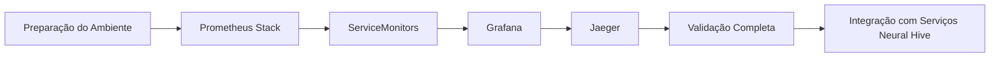

# Guia de Deploy Manual da Stack de Observabilidade - Neural Hive-Mind

Este guia documenta o processo **completo e manual** para instalar a stack de observabilidade (Prometheus Stack, Grafana e Jaeger) em um cluster **Kubeadm local** composto por 1 nó master e 2 nós workers. Siga as etapas na ordem apresentada para garantir consistência com os padrões estabelecidos nos guias anteriores.

---

## 1. Pré-requisitos e Verificações Iniciais

1. **Validar conectividade e estado do cluster**
   ```bash
   kubectl cluster-info
   kubectl config current-context
   kubectl get nodes -o wide
   ```
   _Saída esperada:_ contexto apontando para o cluster local e todos os nós `Ready`.

2. **Avaliar recursos disponíveis por nó**
   ```bash
   kubectl describe nodes | egrep 'cpu:|memory:|Non-terminated Pods'
   ```
   _Saída esperada:_ capacidade suficiente (mínimo 4 vCPUs e 8 GiB de RAM por nó) para suportar a stack.

3. **Verificar StorageClasses**
   ```bash
   kubectl get storageclass
   ```
   _Saída esperada:_ `local-path` ou `hostpath` listado como `default`. Caso contrário, crie um StorageClass local antes de prosseguir.

4. **Confirmar Helm 3.x**
   ```bash
   helm version
   ```
   _Saída esperada:_ `v3.x`. Atualize o Helm se necessário.

5. **Adicionar repositórios oficiais dos charts**
   ```bash
   helm repo add prometheus-community https://prometheus-community.github.io/helm-charts
   helm repo add grafana https://grafana.github.io/helm-charts
   helm repo add jaegertracing https://jaegertracing.github.io/helm-charts
   helm repo update
   ```
   _Saída esperada:_ mensagens `... has been added` e `Update Complete`.

6. **Verificar utilitários complementares** (yq, jq e curl)
   ```bash
   yq --version
   jq --version
   curl --version
   ```
   _Saída esperada:_ versões instaladas. Instale-os caso não estejam disponíveis.

---

## 2. Preparação do Ambiente

1. **Criar namespace dedicado**
   ```bash
   kubectl apply -f k8s/observability/namespaces-observability.yaml
   kubectl get ns observability --show-labels
   ```
   _Saída esperada:_ namespace `observability` com labels `neural-hive.io/*` e PSS baseline.

2. **Exportar variáveis de ambiente padrão**
   ```bash
   export OBSERVABILITY_CONFIG=environments/local/observability-config.yaml
   export STORAGE_CLASS=$(kubectl get sc -o jsonpath='{.items[?(@.metadata.annotations.storageclass\.kubernetes\.io/is-default-class=="true")].metadata.name}')
   echo "Config: $OBSERVABILITY_CONFIG | StorageClass: ${STORAGE_CLASS:-local-path}" 
   ```
   _Saída esperada:_ caminhos válidos e StorageClass detectado.

3. **Preparar diretório temporário para valores customizados**
   ```bash
   mkdir -p .tmp/observability-values
   ```

4. **Executar script de preparação**
   ```bash
   docs/manual-deployment/scripts/04-prepare-observability-values.sh all
   ls -1 .tmp/observability-values/
   ```
   _Saída esperada:_ arquivos `prometheus-values-local.yaml`, `grafana-values-local.yaml` e `jaeger-values-local.yaml` personalizados para o cluster local.

5. **Revisar configurações centralizadas**
   ```bash
   cat environments/local/observability-config.yaml
   ```
   _Saída esperada:_ parâmetros de recursos, storage, namespaces de ServiceMonitors e políticas de validação.

---

## 3. Instalação do Prometheus Stack

1. **Atualizar dependências do chart local**
   ```bash
   helm dependency update helm-charts/prometheus-stack/
   ```
   _Saída esperada:_ dependências `kube-prometheus-stack v51.7.0` sincronizadas.

2. **Instalar usando os valores preparados**
   ```bash
   helm install neural-hive-prometheus helm-charts/prometheus-stack/ \
     -n observability --create-namespace \
     -f .tmp/observability-values/prometheus-values-local.yaml
   ```
   _Saída esperada:_ release `neural-hive-prometheus` implantada.

3. **Aguardar readiness dos pods principais**
   ```bash
   kubectl wait --for=condition=Ready pod \
     -l app.kubernetes.io/name=prometheus \
     -n observability --timeout=600s
   kubectl wait --for=condition=Ready pod \
     -l app.kubernetes.io/name=prometheus-operator \
     -n observability --timeout=600s
   kubectl wait --for=condition=Ready pod \
     -l app.kubernetes.io/name=alertmanager \
     -n observability --timeout=600s
   ```

4. **Validar CRDs e componentes**
   ```bash
   kubectl get crds | grep monitoring.coreos.com
   kubectl get prometheus,alertmanager,servicemonitor -n observability
   kubectl get daemonset -n observability -l app.kubernetes.io/name=node-exporter
   kubectl get deployment -n observability -l app.kubernetes.io/name=kube-state-metrics
   ```
   _Saída esperada:_ CRDs (`prometheuses`, `servicemonitors`, `alertmanagers`, `prometheusrules`) disponíveis e workloads `Ready`.

5. **Verificar logs**
   ```bash
   kubectl logs -n observability -l app.kubernetes.io/name=prometheus --tail=50
   ```
   _Saída esperada:_ ausência de erros críticos.

6. **Teste de acesso à UI do Prometheus**
   ```bash
   kubectl port-forward -n observability svc/neural-hive-prometheus-kube-prometheus-prometheus 9090:9090
   ```
   Acesse `http://localhost:9090`. Na aba **Status > Targets**, confirme targets `kubernetes-nodes`, `kubelet`, `node-exporter` e `neural-hive-*`. Execute a query `up{job="kubernetes-nodes"}` para validar dados em tempo real.

---

## 4. Configuração e Validação de ServiceMonitors

1. **Listar ServiceMonitors existentes**
   ```bash
   kubectl get servicemonitor -A
   ```
   _Saída esperada:_ pelo menos os recursos dos serviços Neural Hive com label `neural.hive/metrics=enabled`.

2. **Confirmar seletor configurado pelo Prometheus**
   ```bash
   kubectl get prometheus -n observability neural-hive-prometheus-kube-prometheus -o yaml | grep -n serviceMonitorSelector -A5
   ```
   _Saída esperada:_ `matchLabels` com `neural.hive/metrics: enabled` e `serviceMonitorNamespaceSelector: {}`.

3. **Verificar targets descobertos**
   Via port-forward do Prometheus, abra `/targets` e confirme status `UP` para cada namespace listado no arquivo de configuração.

4. **Criar ServiceMonitor customizado (exemplo)**
   ```bash
   cat <<'YAML' | kubectl apply -f -
   apiVersion: monitoring.coreos.com/v1
   kind: ServiceMonitor
   metadata:
     name: custom-metric-svc
     namespace: gateway
     labels:
       neural.hive/metrics: enabled
   spec:
     selector:
       matchLabels:
         app: custom-metric-svc
     namespaceSelector:
       matchNames:
         - gateway
     endpoints:
       - interval: 30s
         port: http-metrics
         scheme: http
   YAML
   ```
   _Saída esperada:_ Prometheus descobre o novo target automaticamente.

5. **Referenciar templates do projeto**
   Utilize `helm-charts/_common-templates/servicemonitor-template.yaml` para criar ServiceMonitors consistentes com o padrão Neural Hive.

---

## 5. Instalação do Grafana

1. **Atualizar dependências do chart local**
   ```bash
   helm dependency update helm-charts/grafana/
   ```

2. **Instalar**
   ```bash
   helm install neural-hive-grafana helm-charts/grafana/ \
     -n observability \
     -f .tmp/observability-values/grafana-values-local.yaml
   ```

3. **Aguardar readiness**
   ```bash
   kubectl wait --for=condition=Ready pod \
     -l app.kubernetes.io/name=grafana \
     -n observability --timeout=300s
   kubectl get pvc -n observability | grep grafana
   ```

4. **Obter credenciais admin**
   ```bash
   kubectl get secret -n observability neural-hive-grafana -o jsonpath='{.data.admin-password}' | base64 -d && echo
   ```

5. **Port-forward e login**
   ```bash
   kubectl port-forward -n observability svc/neural-hive-grafana 3000:80
   ```
   Acesse `http://localhost:3000`, faça login com `admin/<senha>` e confirme a presença dos datasources `Prometheus` e `Jaeger` em **Configuration > Data Sources** (status verde).

6. **Testar query**
   Na aba **Explore**, selecione o datasource Prometheus e execute `up{job="kubernetes-nodes"}`. Valide que os dados carregam e os exemplars permitem salto para traces.

---

## 6. Instalação do Jaeger (All-in-One)

1. **Atualizar dependências**
   ```bash
   helm dependency update helm-charts/jaeger/
   ```

2. **Instalar com valores customizados**
   ```bash
   helm install neural-hive-jaeger helm-charts/jaeger/ \
     -n observability \
     -f .tmp/observability-values/jaeger-values-local.yaml
   ```

3. **Aguardar readiness**
   ```bash
   kubectl wait --for=condition=Ready pod \
     -l app.kubernetes.io/name=jaeger \
     -n observability --timeout=300s
   kubectl get svc -n observability neural-hive-jaeger
   ```
   _Saída esperada:_ portas `14250`, `4317`, `4318` e `16686` expostas.

4. **Port-forward e validação da UI**
   ```bash
   kubectl port-forward -n observability svc/neural-hive-jaeger 16686:16686
   ```
   Acesse `http://localhost:16686` e confira a aba **Search** (serviços aparecerão após o deploy dos componentes Neural Hive).

5. **Teste de envio de trace via OTLP HTTP**
   ```bash
   curl -X POST http://localhost:4318/v1/traces \
     -H 'Content-Type: application/json' \
     -d '{"resourceSpans":[{"resource":{"attributes":[{"key":"service.name","value":{"stringValue":"test-client"}}]},"scopeSpans":[{"spans":[{"traceId":"aaaaaaaaaaaaaaaa","spanId":"bbbbbbbbbbbbbbbb","name":"curl-test","kind":1,"startTimeUnixNano":"$(date +%s%N)","endTimeUnixNano":"$(date +%s%N)","status":{}}]}]}]}'
   ```
   _Saída esperada:_ HTTP 200 retornado e trace visível na UI.

---

## 7. Validação Completa e Testes de Conectividade

1. **Listagem geral**
   ```bash
   kubectl get pods,svc,pvc -n observability
   kubectl get servicemonitor -A | grep neural.hive || true
   ```

2. **Pod de debug para testes cruzados**
   ```bash
   kubectl run net-debug --rm -i --tty --image=busybox -n observability -- /bin/sh
   # Dentro do pod:
   nc -vz neural-hive-prometheus-kube-prometheus-prometheus 9090
   nc -vz neural-hive-grafana 80
   nc -vz neural-hive-jaeger 16686
   exit
   ```
   _Saída esperada:_ conexões `succeeded!`.

3. **Validação da coleta de métricas**
   - UI do Prometheus: confirme targets `UP` em `/targets` e execute queries `kube_pod_status_phase`, `node_cpu_seconds_total`.
   - Grafana: importar dashboards padrão IDs `315`, `1860` e `6417` (Kubernetes/Node) via **+ > Import**, apontando para o datasource Prometheus.

4. **Validação de traces**
   Após implantar os serviços Neural Hive, abra a UI do Jaeger, selecione um serviço (ex.: `gateway-intencoes`) e verifique spans completos. Use o botão "View Trace" oferecido pelos exemplars na UI do Grafana para confirmar a correlação métricas↔traces.

5. **Resumo de status sugerido**
   | Componente | Namespace | Status esperado | Teste principal |
   |------------|-----------|-----------------|-----------------|
   | Prometheus Stack | observability | Pods Ready, PVC Bound | Query `up{job="kubernetes-nodes"}` |
   | Grafana | observability | UI acessível | Login + Datasources verdes |
   | Jaeger | observability | UI acessível + OTLP ok | curl OTLP + busca de traces |
   | ServiceMonitors | múltiplos | Targets `UP` | `/targets` mostrando namespaces Neural Hive |

---

## 8. Integração com os Serviços Neural Hive

1. **Métricas padronizadas**
   Todos os serviços (Gateway, STE, Consensus Engine, Specialists etc.) expõem `/metrics` em HTTP. Os charts desses serviços criam automaticamente ServiceMonitors com a label `neural.hive/metrics: enabled`, garantindo descoberta pelo Prometheus via `serviceMonitorSelector`.

2. **Instrumentação OpenTelemetry para traces**
   Configure as variáveis de ambiente abaixo em cada serviço:
   ```bash
   OTEL_EXPORTER_OTLP_ENDPOINT=http://neural-hive-jaeger.observability.svc.cluster.local:4318
   OTEL_EXPORTER_OTLP_PROTOCOL=http/protobuf
   OTEL_SERVICE_NAME=<nome-do-servico>
   OTEL_RESOURCE_ATTRIBUTES=deployment.environment=local
   ```
   Exemplo Python (FastAPI):
   ```python
   from opentelemetry import trace
   from opentelemetry.exporter.otlp.proto.http.trace_exporter import OTLPSpanExporter
   from opentelemetry.sdk.trace import TracerProvider
   from opentelemetry.sdk.trace.export import BatchSpanProcessor

   provider = TracerProvider()
   exporter = OTLPSpanExporter(endpoint="http://neural-hive-jaeger.observability.svc.cluster.local:4318/v1/traces")
   provider.add_span_processor(BatchSpanProcessor(exporter))
   trace.set_tracer_provider(provider)
   tracer = trace.get_tracer(__name__)
   ```

3. **Exemplars para correlação**
   - Prometheus coleta `trace_id` como exemplar a partir das métricas instrumentadas.
   - No Grafana, configure o painel para exibir o botão `View Trace`, apontando para o datasource Jaeger (`datasourceUid: jaeger`).

4. **ServiceMonitors adicionais**
   Para novos serviços, inicie do template em `helm-charts/_common-templates/servicemonitor-template.yaml` e garanta labels padronizadas (`neural.hive/component`, `neural.hive/metrics`).

---

## 9. Troubleshooting

| Sintoma | Diagnóstico | Ação recomendada |
|--------|-------------|------------------|
| Pods em `CrashLoopBackOff` | `kubectl logs <pod> -n observability`, `kubectl describe pod` | Revisar requests/limits e configurações no arquivo de valores. |
| Prometheus não encontra ServiceMonitors | Verificar labels `neural.hive/metrics: enabled`, `kubectl get prometheus ... | grep serviceMonitorSelector`, conferir RBAC do operator | Ajustar labels ou permissões. |
| Grafana sem acesso ao Prometheus | Validar URL no datasource (`http://neural-hive-prometheus-kube-prometheus-prometheus.observability.svc.cluster.local:9090`), testar via `kubectl run net-debug` | Corrigir endereço/port-forward. |
| Jaeger não recebe traces | Confirmar `OTEL_EXPORTER_OTLP_ENDPOINT` nos serviços, revisar logs `kubectl logs -n observability -l app.kubernetes.io/name=jaeger` | Reaplicar env vars ou reiniciar pods. |
| PVCs `Pending` | `kubectl get pvc -n observability`, `kubectl describe pvc` | Garantir StorageClass `local-path` instalado e provisioner em execução. |
| Alertmanager sem enviar alertas | Configuração local usa receiver `default` sem integrações externas | Ajustar `alertmanagerConfig` apenas se necessário. |
| Métricas com alta cardinalidade | `kubectl edit servicemonitor <nome>` e aplicar `metricRelabelings` | Reduzir labels irrelevantes e aumentar retenção conforme necessário. |

---

## 10. Próximos Passos

1. Executar a validação automatizada:
   ```bash
   docs/manual-deployment/scripts/05-validate-observability.sh --verbose
   ```
2. Registrar resultados na checklist `docs/manual-deployment/OBSERVABILITY_DEPLOYMENT_CHECKLIST.md`.
3. Prosseguir com o deployment dos serviços Neural Hive (Gateway, STE, Specialists) usando os guides subsequentes.
4. Criar dashboards customizados no Grafana para fluxos A/B/C e configurar alertas de SLO no Prometheus.
5. Preparar integrações adicionais (notificações de alerta, dashboards de tracing avançados) conforme requisitos da equipe de plataforma.

---



---

## Referências
- `docs/manual-deployment/02-infrastructure-manual-guide.md`
- `helm-charts/prometheus-stack/values.yaml`
- `helm-charts/grafana/values.yaml`
- `helm-charts/jaeger/values.yaml`
- `docs/observability/servicemonitor-standards.md`
