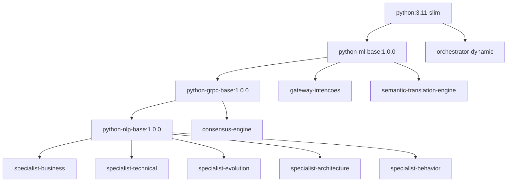

# Guia Manual de Build dos Serviços - Neural Hive-Mind

Este documento fornece o fluxo **100% manual** para construir e validar as imagens Docker dos serviços do Neural Hive-Mind e disponibilizá-las no cluster Kubeadm com containerd. O guia complementa os scripts automatizados já existentes, permitindo auditoria completa de cada etapa (build, validação, exportação e importação).

---

## 1. Pré-requisitos e Verificações Iniciais

1. **Docker instalado e em execução**
   ```bash
   docker version
   docker info
   ```
   _Saída esperada:_ informações do cliente/daemon. Se o daemon não estiver ativo, execute `sudo systemctl start docker`.

2. **Espaço em disco livre (mínimo 20GB)**
   ```bash
   df -h /var/lib/docker
   ```
   _Valide que há pelo menos 20GB antes de iniciar o build (o processo completo consome ~8GB)._

3. **Ferramentas auxiliares instaladas**
   ```bash
   sudo apt-get install -y jq yq
   yq --version
   jq --version
   ```

4. **Conectividade com o cluster Kubeadm e permissões**
   ```bash
   kubectl cluster-info
   kubectl get nodes -o wide
   ```
   _Confirme 1 master e 2 workers no status `Ready`. Ajuste `KUBECONFIG` se necessário._

5. **Acesso ao containerd via ctr**
   ```bash
   sudo ctr version
   ```
   _Se falhar por permissão negada, inclua seu usuário no grupo `docker` ou execute com sudo._

---

## 2. Visão Geral da Arquitetura de Imagens



- **Serviços construídos manualmente (9):**
  | Serviço | Descrição | Porta(s) | Base Primária |
  | --- | --- | --- | --- |
  | gateway-intencoes | API gRPC/HTTP que consolida intents de usuários | 8000/tcp | python-ml-base |
  | semantic-translation-engine | Tradução semântica PT↔EN com Transformers | 8080/tcp | python-ml-base |
  | consensus-engine | Orquestrador de consenso entre especialistas | 7070/tcp | python-grpc-base |
  | orchestrator-dynamic | Orquestração adaptativa das respostas | 8090/tcp | python:3.11-slim |
  | specialist-business | Especialista em processos de negócio | 8101/tcp | python-nlp-base |
  | specialist-technical | Especialista técnico | 8102/tcp | python-nlp-base |
  | specialist-behavior | Especialista comportamental | 8103/tcp | python-nlp-base |
  | specialist-evolution | Especialista em evolução de requisitos | 8104/tcp | python-nlp-base |
  | specialist-architecture | Especialista de arquitetura | 8105/tcp | python-nlp-base |

- **Estimativas de tamanho:** bases somam ~1.5GB, gateway-intencoes ~6.3GB, semantic-translation-engine ~260MB, orchestrator-dynamic ~3.6GB, consensus-engine ~16.8GB e cada specialist ~17GB ⇒ reserve pelo menos **110GB** para armazenar todas as imagens com folga.

---

## 3. Fase 1 - Build das Imagens Base

Todas as etapas abaixo assumem que você está no diretório raiz do projeto (`/path/to/Neural-Hive-Mind`). Utilize sempre o contexto `.`.

### 3.1 python-ml-base:1.0.0
```bash
docker build \
  -f base-images/python-ml-base/Dockerfile \
  --build-arg VERSION=1.0.0 \
  --build-arg BUILD_DATE="$(date -u +"%Y-%m-%dT%H:%M:%SZ")" \
  -t neural-hive-mind/python-ml-base:1.0.0 \
  -t neural-hive-mind/python-ml-base:latest \
  .
```
- **Conteúdo das camadas:** atualizações apt, instalação de libs científicas (numpy, pandas, torch CPU), configuração locale e usuário não-root.
- **Validação pós-build:**
  ```bash
  docker images | grep python-ml-base
  docker run --rm neural-hive-mind/python-ml-base:1.0.0 python -c "import torch; print(torch.__version__)"
  ```

### 3.2 python-grpc-base:1.0.0
```bash
docker build \
  -f base-images/python-grpc-base/Dockerfile \
  --build-arg VERSION=1.0.0 \
  --build-arg BUILD_DATE="$(date -u +"%Y-%m-%dT%H:%M:%SZ")" \
  -t neural-hive-mind/python-grpc-base:1.0.0 \
  -t neural-hive-mind/python-grpc-base:latest \
  .
```
- **Camadas extras:** instalação de grpcio, protobuf 25.x, ferramentas de tracing e certificados.
- **Validação:**
  ```bash
  docker run --rm neural-hive-mind/python-grpc-base:1.0.0 python -c "import grpc; print(grpc.__version__)"
  ```

### 3.3 python-nlp-base:1.0.0
```bash
docker build \
  -f base-images/python-nlp-base/Dockerfile \
  --build-arg VERSION=1.0.0 \
  --build-arg BUILD_DATE="$(date -u +"%Y-%m-%dT%H:%M:%SZ")" \
  -t neural-hive-mind/python-nlp-base:1.0.0 \
  -t neural-hive-mind/python-nlp-base:latest \
  .
```
- **Camadas específicas:** pip install spaCy, sentencepiece, modelos `pt_core_news_sm`, `en_core_web_sm` baixados durante o build.
- **Validação:** certifique-se de que os modelos foram carregados com sucesso.
  ```bash
  docker run --rm neural-hive-mind/python-nlp-base:1.0.0 \
    python -c "import spacy; import pt_core_news_sm; import en_core_web_sm; print('spacy models ok')"
  ```

**Checksums e logs:** Recomenda-se capturar os hashes das imagens com `docker inspect --format='{{.Id}}'` e registrar no arquivo `logs/build-base-images.log`. Isso auxilia auditorias.

---

## 4. Fase 2 - Build dos Serviços de Aplicação

Ordem sugerida: gateway-intencoes → semantic-translation-engine → specialists (podem ser paralelos) → consensus-engine → orchestrator-dynamic.

### 4.1 Padrão dos comandos
```bash
docker build \
  -f <Dockerfile-do-serviço> \
  --build-arg VERSION=1.0.0 \
  --build-arg BUILD_DATE="$(date -u +"%Y-%m-%dT%H:%M:%SZ")" \
  --label org.opencontainers.image.title="<nome>" \
  --label org.opencontainers.image.version="1.0.0" \
  --label org.opencontainers.image.created="$(date -u +"%Y-%m-%dT%H:%M:%SZ")" \
  -t neural-hive-mind/<servico>:1.0.0 \
  -t neural-hive-mind/<servico>:latest \
  .
```
> Os Dockerfiles assumem context `.`. Evite executar `docker build` a partir de subdiretórios para não quebrar instruções `COPY`.

### 4.2 Exemplos específicos

- **gateway-intencoes**
  ```bash
  docker build -f services/gateway-intencoes/Dockerfile ...
  ```
  - _Build args adicionais:_ `WHISPER_CACHE=/models`.
  - _Validação:_ `docker inspect neural-hive-mind/gateway-intencoes:1.0.0 | jq '.[0].Config.Labels'`, `docker run --rm -p 8000:8000 ...` e `curl -f http://localhost:8000/health`.
  - _Troubleshooting:_ falta de GPU não bloqueia build; Whisper roda em CPU.

- **semantic-translation-engine**
  - _Observação:_ garante downloads de modelos Hugging Face. Ajuste proxy se necessário.

- **Specialists (business, technical, behavior, evolution, architecture)**
  - _Dependências:_ python-nlp-base. Se obtiver erro “FROM neural-hive-mind/python-nlp-base:1.0.0 not found”, retorne à fase 1.
  - _Paralelização:_ use `docker buildx bake` ou scripts `scripts/build-local-parallel.sh` como referência se quiser paralelizar manualmente.

- **consensus-engine**
  - _Requer:_ `python-grpc-base`.
  - _Validação extra:_ `docker inspect ... | jq '.[0].Config.Entrypoint'` deve apontar para `["/usr/local/bin/python","-m","services.consensus.main"]`.

- **orchestrator-dynamic**
  - _Atenção:_ o Dockerfile precisa ser executado no contexto raiz para copiar `services/orchestrator-dynamic/requirements.txt`. Comando `docker build -f services/orchestrator-dynamic/Dockerfile .` já cobre esse requisito.

---

## 5. Validação das Imagens Construídas

1. **Listar todas as imagens:**
   ```bash
   docker images | grep neural-hive-mind
   ```
2. **Verificar tags e labels:**
   ```bash
   docker inspect neural-hive-mind/gateway-intencoes:1.0.0 | jq '.[0].Config.Labels'
   ```
3. **Teste funcional rápido:**
   ```bash
   docker run --rm -d --name nhm-gateway -p 8000:8000 neural-hive-mind/gateway-intencoes:1.0.0
   sleep 10
   curl -f http://localhost:8000/health
   docker logs nhm-gateway | tail -n 20
   docker stop nhm-gateway
   ```
4. **Conferir variáveis de ambiente e portas expostas:**
   ```bash
   docker inspect --format='{{json .Config.Env}}' neural-hive-mind/semantic-translation-engine:1.0.0 | jq
   docker inspect --format='{{json .Config.ExposedPorts}}' neural-hive-mind/specialist-business:1.0.0 | jq
   ```

---

## 6. Exportação das Imagens para Containerd

1. **Criar diretório temporário:**
   ```bash
   sudo rm -rf /tmp/neural-hive-images
   mkdir -p /tmp/neural-hive-images
   ```
2. **Exportar cada imagem:**
   ```bash
   for image in python-ml-base python-grpc-base python-nlp-base \
     gateway-intencoes semantic-translation-engine \
     specialist-business specialist-technical specialist-behavior \
     specialist-evolution specialist-architecture \
     consensus-engine orchestrator-dynamic; do
       docker save "neural-hive-mind/${image}:1.0.0" -o "/tmp/neural-hive-images/${image}.tar"
       sha256sum "/tmp/neural-hive-images/${image}.tar" | tee "/tmp/neural-hive-images/${image}.tar.sha256"
   done
   ls -lh /tmp/neural-hive-images
   ```
3. **Valide o tamanho de cada tar:** cada arquivo deve estar alinhado às estimativas (total ~8GB).

---

## 7. Importação no Cluster Kubeadm (containerd)

1. **Se estiver fora dos nós, envie os tarballs:**
   ```bash
   scp /tmp/neural-hive-images/*.tar root@master01:/tmp/neural-hive-images/
   scp /tmp/neural-hive-images/*.tar root@worker01:/tmp/neural-hive-images/
   scp /tmp/neural-hive-images/*.tar root@worker02:/tmp/neural-hive-images/
   ```
2. **Importe em cada nó (exemplo para master):**
   ```bash
   ssh root@master01 'for tar in /tmp/neural-hive-images/*.tar; do sudo ctr -n k8s.io images import "$tar"; done'
   ssh root@master01 'sudo ctr -n k8s.io images ls | grep neural-hive-mind'
   ```
3. **Repita para worker01 e worker02.** Todas as 12 imagens devem aparecer no namespace `k8s.io`.

---

## 8. Configuração dos Helm Charts para ImagePullPolicy

1. **Localize os valores locais de cada chart:**
   ```bash
   rg --files -g 'values-local.yaml' helm-charts
   ```
2. **Atualize os campos `image` para cada serviço:**
   ```yaml
   image:
     repository: neural-hive-mind/gateway-intencoes
     tag: "1.0.0"
     pullPolicy: Never
   ```
3. **Repita o processo para os 9 serviços.** Certifique-se de remover qualquer prefixo de registry (ex.: `ghcr.io`) para evitar tentativas de pull externas.

---

## 9. Troubleshooting e Problemas Comuns

| Sintoma | Causa Provável | Solução |
| --- | --- | --- |
| `pull access denied for neural-hive-mind/python-nlp-base` | Base image não construída localmente | Execute novamente a fase 1 respetando a ordem ml → grpc → nlp |
| `COPY failed: file not found in build context` | Build executado fora da raiz ou path incompleto | Sempre rode `docker build ... .` na raiz do repo; revise instruções COPY nos Dockerfiles |
| `ctr: image not found` | Importação no namespace errado ou tar corrompido | Use `sudo ctr -n k8s.io images import` e confirme checksums |
| Pods em `ImagePullBackOff` | `imagePullPolicy` ainda `IfNotPresent`/`Always` ou repository incorreto | Ajuste `values-local.yaml` e reaplique os charts |
| `no space left on device` durante build | Disco cheio em `/var/lib/docker` | Rode `docker system prune -af` (após confirmar que não há imagens necessárias) |
| Modelos spaCy indisponíveis | Download interrompido na base image | Refaça o build da python-nlp-base com rede estável; valide executando `docker run ... spacy.load(...)` |

---

## 10. Checklist de Validação Final

| Item | Status |
| --- | --- |
| [ ] 3 base images construídas e taggeadas (`latest` + `1.0.0`) |
| [ ] 9 serviços construídos com tags consistentes |
| [ ] Health checks locais executados para todos os serviços |
| [ ] Todos os tarballs criados em `/tmp/neural-hive-images` |
| [ ] Imagens importadas no containerd de master + workers |
| [ ] `values-local.yaml` de todos os charts configurados com `imagePullPolicy: Never` |
| [ ] Scripts `05-prepare-services-build.sh` e `06-validate-services-build.sh` executados sem erros |
| [ ] Relatórios e logs arquivados em `logs/` |

---

### Referência Rápida de Comandos

```bash
# Listar imagens locais
docker images | grep neural-hive-mind

# Validar containerd
sudo ctr -n k8s.io images ls | grep neural-hive-mind

# Limpar cache do Docker
docker system prune -af

# Checar espaço em disco
df -h /var/lib/docker

# Próximos passos: iniciar o Fluxo A (gateway-intencoes) com Helm
helm upgrade --install gateway-intencoes helm-charts/gateway-intencoes \
  -f helm-charts/gateway-intencoes/values-k8s.yaml \
  --namespace fluxo-a --create-namespace
```

Depois de concluir este guia, prossiga com o deploy manual do Fluxo A utilizando o chart `helm-charts/gateway-intencoes` conforme descrito em `docs/manual-deployment/05-gateway-deployment-manual-guide.md`. O mesmo padrão Helm adotado para os Fluxos B e C garante consistência com as demais fases de deploy.
