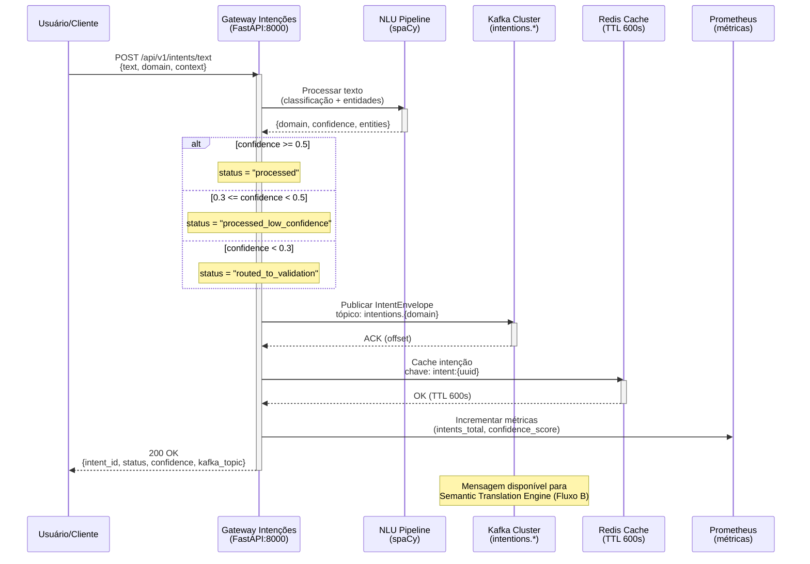

# Guia Manual de Deployment do Gateway de Intenções (Fluxo A)

Este guia descreve o processo 100% manual para implantar o **gateway-intencoes** em um cluster Kubeadm (1 master + 2 workers). O documento segue o mesmo padrão dos guias anteriores, garantindo rastreabilidade completa em cada etapa do Fluxo A.

---

## 1. Pré-requisitos e Verificações Iniciais

1. **Cluster saudável e acessível**
   ```bash
   kubectl cluster-info
   kubectl get nodes -o wide
   ```
   _Confirme nó master + dois workers em `Ready`._

2. **Namespaces críticos disponíveis**
   ```bash
   kubectl get namespace kafka redis-cluster observability
   kubectl get pods -n kafka
   kubectl get pods -n redis-cluster
   ```
   _Strimzi Kafka e Redis cluster devem estar `Running`._

3. **Imagem Docker local**
   ```bash
   sudo ctr -n k8s.io images ls | grep gateway-intencoes:1.0.0
   ```
   _Se ausente, importe do pacote entregue (`ctr images import`)._

4. **Ferramentas necessárias**
   ```bash
   kubectl version --short
   helm version
   curl --version
   jq --version
   kafkacat -V   # opcional
   ```

5. **Checagem de disco (logs/model cache)**
   ```bash
   df -h /var/lib/containerd
   ```
   _Garanta ≥2GB livres nos nós workers para logs/cache temporários._

---

## 2. Visão Geral da Arquitetura do Fluxo A



- **Componentes**: FastAPI (porta 8000) com ASR (Whisper tiny/base), NLU (spaCy pt_core_news_sm), produtor Kafka (Avro), cliente Redis cluster.
- **Endpoints principais**: `/health`, `/ready`, `/metrics`, `/status`, `/api/v1/intents/text`, `/api/v1/intents/voice`.
- **Dependências**: Kafka tópicos `intentions.*`, Redis cache (TTL 600s), Prometheus/Jaeger opcionais.

---

## 3. Preparação dos Valores Locais

1. **Revisar arquivo base** `environments/local/gateway-config.yaml` (novo nesta entrega). Valores relevantes:
   - Namespace `fluxo-a`, release `gateway-intencoes`, replicas `1`.
   - Recursos: requests `500m/1Gi`, limits `1000m/2Gi`.
   - Kafka `neural-hive-kafka-kafka-bootstrap.kafka.svc.cluster.local:9092`.
   - Redis `neural-hive-cache.redis-cluster.svc.cluster.local:6379`.
   - ASR modelo `tiny`, `logLevel: DEBUG`, `imagePullPolicy: Never`.

2. **Executar script de preparação**:
   ```bash
   bash docs/manual-deployment/scripts/08-prepare-gateway-values.sh
   ```

3. **Validar saída** `helm-charts/gateway-intencoes/values-local-generated.yaml`:
   ```bash
   yq '.image.pullPolicy' helm-charts/gateway-intencoes/values-local-generated.yaml
   yq '.config.kafka.bootstrapServers' helm-charts/gateway-intencoes/values-local-generated.yaml
   yq '.config.redis.clusterNodes' helm-charts/gateway-intencoes/values-local-generated.yaml
   ```
   _Confirme `Never`, endpoints corretos e `jwtSecretKey` preenchido automaticamente._

---

## 4. Criação dos Tópicos Kafka

1. **Instalar chart `kafka-topics`**:
   ```bash
   helm upgrade --install kafka-topics helm-charts/kafka-topics \
     --namespace kafka \
     --set environment=local \
     --set topicDefaults.replicationFactor=1 \
     --set topicDefaults.partitions=3 \
     --wait --timeout 5m
   ```

2. **Validar CRDs e tópicos**:
   ```bash
   kubectl get kafkatopics -n kafka
   kubectl exec -n kafka neural-hive-kafka-kafka-0 -- \
     bin/kafka-topics.sh --bootstrap-server localhost:9092 --list
   ```
   _Devem existir: `intentions.business`, `intentions.technical`, `intentions.infrastructure`, `intentions.security`, `intentions.dead-letter`, `intentions.audit`._

3. **Troubleshooting**: se CRDs ausentes, revise logs do Strimzi operator (`kubectl logs deployment/strimzi-cluster-operator -n kafka`).

---

## 5. Instalação do Gateway via Helm

1. **Namespace dedicado**:
   ```bash
   kubectl create namespace fluxo-a
   kubectl label namespace fluxo-a neural-hive-mind.org/layer=application
   ```

2. **Instalação idempotente**:
   ```bash
   helm upgrade --install gateway-intencoes helm-charts/gateway-intencoes \
     --namespace fluxo-a \
     -f helm-charts/gateway-intencoes/values-local-generated.yaml \
     --wait --timeout 10m
   ```
   _`--wait` acompanha rollout e init dos modelos ASR/NLU._

3. **Monitorar rollout**:
   ```bash
   kubectl rollout status deployment/gateway-intencoes -n fluxo-a
   watch kubectl get pods -n fluxo-a
   ```

4. **Recursos criados**:
   ```bash
   kubectl get all -n fluxo-a
   kubectl get configmap,secret -n fluxo-a
   ```

---

## 6. Validação do Deployment

1. **Status do Pod**:
   ```bash
   POD_NAME=$(kubectl get pods -n fluxo-a -l app.kubernetes.io/name=gateway-intencoes -o jsonpath='{.items[0].metadata.name}')
   kubectl get pod $POD_NAME -n fluxo-a -o wide
   ```
   _STATUS `Running`, READY `1/1`._

2. **Logs-chave**:
   ```bash
   kubectl logs $POD_NAME -n fluxo-a --tail=50
   ```
   _Procure "Application startup complete", "Uvicorn running on", "Kafka producer initialized"._

3. **Health check**:
   ```bash
   kubectl port-forward -n fluxo-a svc/gateway-intencoes 8080:80 &
   PF_PID=$!
   sleep 3
   curl -s http://localhost:8080/health | jq
   curl -s http://localhost:8080/ready | jq
   curl -s http://localhost:8080/status | jq
   kill $PF_PID
   ```
   _Health responde `{ "status": "healthy" }`, readiness `{ "status": "ready" }` (verifique o campo `status`), e `/status` deve indicar `kafka_producer_ready: true` e `nlu_pipeline_ready: true`._

> **Nota**: ConfigMaps e Secrets seguem o prefixo Helm `fullname`. Se `fullnameOverride` estiver definido nos seus values, use `--fullname <prefixo>` ao executar o script `09-validate-gateway-deployment.sh` para validar recursos no formato `<prefixo>-config`/`<prefixo>-secret`.

---

## 7. Teste de Envio de Intenção

1. **POST de texto**:
   ```bash
   kubectl port-forward -n fluxo-a svc/gateway-intencoes 8080:80 &
   PF_PID=$!
   sleep 3
   INTENT_RESPONSE=$(curl -s -X POST http://localhost:8080/api/v1/intents/text \
     -H 'Content-Type: application/json' \
     -d '{
       "text": "Criar workflow de aprovação de compras com validação de estoque",
       "domain": "business",
       "context": {
         "user_id": "test-user-001",
         "session_id": "test-session-'$(date +%s)'",
         "tenant_id": "test-tenant"
       }
     }')
   echo $INTENT_RESPONSE | jq
   INTENT_ID=$(echo $INTENT_RESPONSE | jq -r '.intent_id')
   kill $PF_PID
   ```

2. **Resposta esperada**: garanta que os campos obrigatórios `intent_id`, `status`, `confidence` e `domain` estejam presentes. Os demais campos podem variar por versão.
   ```json
   {
     "intent_id": "uuid-v4",
     "status": "processed",
     "confidence": 0.87,
     "domain": "BUSINESS",
     // Campos adicionais variam por versão do gateway:
     "classification": "workflow_creation",
     "entities": [{"type": "WORKFLOW_TYPE", "value": "aprovação"}],
     "kafka_topic": "intentions.business",
     "cached": true
   }
   ```

3. **Logs da intenção**:
   ```bash
   kubectl logs $POD_NAME -n fluxo-a | grep $INTENT_ID
   ```
   _Confirmar "Intent envelope published to Kafka" e "Cached in Redis"._

---

## 8. Verificação de Publicação no Kafka

1. **Consumir mensagens**:
   ```bash
   kubectl exec -n kafka neural-hive-kafka-kafka-0 -- \
     bin/kafka-console-consumer.sh \
     --bootstrap-server localhost:9092 \
     --topic intentions.business \
     --from-beginning \
     --max-messages 5
   ```

2. **kafkacat (opcional)**:
   ```bash
   kafkacat -b neural-hive-kafka-kafka-bootstrap.kafka.svc.cluster.local:9092 \
     -t intentions.business -C -c 1 -f '%s\n'
   ```

3. **Consumer groups**:
   ```bash
   kubectl exec -n kafka neural-hive-kafka-kafka-0 -- \
     bin/kafka-consumer-groups.sh --bootstrap-server localhost:9092 --list
   ```
   _Use para validar offsets quando o Semantic Translation Engine (Fluxo B) estiver ativo._

---

## 9. Verificação de Cache no Redis

1. **Acesso ao cluster Redis**:
   ```bash
   kubectl exec -n redis-cluster neural-hive-cache-0 -it -- redis-cli
   ```

2. **Consultar chave da intenção**:
   ```redis
   KEYS intent:*
   GET intent:<INTENT_ID>
   TTL intent:<INTENT_ID>
   ```
   _TTL esperado ~600 segundos._

3. **Estatísticas via API**:
   ```bash
   kubectl port-forward -n fluxo-a svc/gateway-intencoes 8080:80 &
   PF_PID=$!
   sleep 3
   curl -s http://localhost:8080/cache/stats | jq
   kill $PF_PID
   ```
   _Endpoint opcional: métricas como `hit_rate`, `total_keys` e `memory_usage` dependem da instrumentação do cliente Redis configurado._

---

## 10. Troubleshooting e Problemas Comuns

| Sintoma | Causa Provável | Solução |
|---------|----------------|---------|
| Pod em `ImagePullBackOff` | Imagem não importada no containerd | `sudo ctr -n k8s.io images ls`, reimporte (`ctr images import gateway-intencoes.tar`). |
| Pod em `CrashLoopBackOff` | Conexão Kafka/Redis falhando | `kubectl logs`, validar endpoints no ConfigMap, testar `nc -zv` via `kubectl exec`. |
| `/health` retorna unhealthy | Serviços dependentes indisponíveis | Testar conectividade com `kubectl exec` + `nslookup`/`nc`, revisar NetworkPolicies. |
| API responde 500 | Modelo NLU não carregado | Buscar "spaCy model not found" nos logs, habilitar initContainer ou reconstruir imagem. |
| Sem mensagens no Kafka | Tópico ausente ou configuração errada | `kubectl get kafkatopics`, revisar `KAFKA_BOOTSTRAP_SERVERS` no ConfigMap. |
| `confidence < 0.3` constantemente | Texto ambíguo ou thresholds altos | Ajustar `routingThresholdLow` em `values`, testar textos mais específicos. |
| Cache miss no Redis | TTL expirado ou chave incorreta | Validar TTL com `redis-cli`, garantir formato `intent:<uuid>`. |

---

## 11. Checklist de Validação Final

- [ ] Namespace `fluxo-a` criado e rotulado.
- [ ] Tópicos Kafka (`intentions.business`, `technical`, `infrastructure`, `security`) criados.
- [ ] Helm release `gateway-intencoes` instalado com sucesso.
- [ ] Pod `gateway-intencoes` em `Running` e `Ready 1/1`.
- [ ] `/health` retorna `{"status": "healthy"}`.
- [ ] `/api/v1/intents/text` retorna `intent_id` válido.
- [ ] Logs mostram publicação no Kafka.
- [ ] Mensagens visíveis no `intentions.business`.
- [ ] Intenção cacheada no Redis com TTL ~600s.
- [ ] Métricas expostas para Prometheus (se habilitado).
- [ ] Script `09-validate-gateway-deployment.sh` executado com PASS.

---

## 12. Próximos Passos

1. **Fluxo B – Semantic Translation Engine**: consumir `intentions.*` e gerar `plans.ready`.
2. **Fluxo B – Specialists**: deploy dos especialistas business, technical, behavior, evolution e architecture.
3. **Observabilidade**: habilitar ServiceMonitor, dashboards Grafana e tracing Jaeger.
4. **Tracing distribuído**: ativar Jaeger collector e instrumentar requisições do gateway.
5. **Teste E2E completo**: seguir `VALIDACAO_E2E_MANUAL.md` cobrindo Fluxos A → B → C.

---

## Referências Rápidas

```bash
# Logs em tempo real
kubectl logs -n fluxo-a -l app.kubernetes.io/name=gateway-intencoes -f

# Reiniciar o pod
kubectl rollout restart deployment/gateway-intencoes -n fluxo-a

# Desinstalar release
helm uninstall gateway-intencoes -n fluxo-a

# Listar releases no namespace
helm list -n fluxo-a
```

> Utilize este guia lado a lado com os scripts auxiliares (`08-prepare-gateway-values.sh` e `09-validate-gateway-deployment.sh`) para acelerar auditorias e repetições do Fluxo A.
