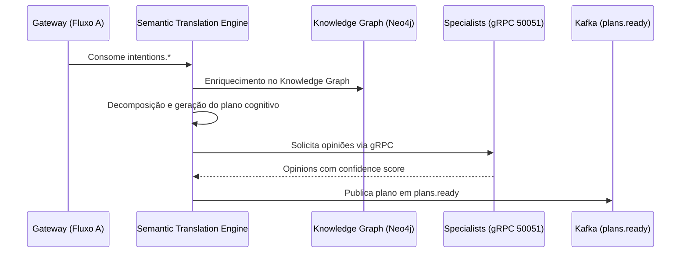

# Guia Manual de Deployment do Fluxo B - Semantic Translation Engine e Specialists

Este guia descreve o processo manual para implantar o Fluxo B (Semantic Translation Engine + cinco specialists) em um cluster Kubeadm (1 master + 2 workers). Assume-se que o Fluxo A (Gateway) já está operacional, que a infraestrutura (Kafka, Redis, MongoDB, Neo4j) está ativa e que os componentes de observabilidade (Prometheus, Grafana, Jaeger) foram habilitados seguindo os guias anteriores. Todos os passos utilizam apenas comandos Helm e kubectl executados manualmente.

---

## 1. Pré-requisitos e Verificações Iniciais

Execute as validações antes de tocar nos charts:

```bash
kubectl cluster-info
kubectl get nodes
kubectl get namespace kafka neo4j-cluster mongodb-cluster redis-cluster mlflow observability
kubectl get pods -n kafka
kubectl get pods -n neo4j-cluster
kubectl get pods -n mongodb-cluster
kubectl get pods -n redis-cluster
kubectl get pods -n mlflow
kubectl get pods -n fluxo-a
```

- Verifique se o Gateway publica em `intentions.*` (ex.: `kubectl exec -n kafka neural-hive-kafka-kafka-0 -- bin/kafka-console-consumer.sh --bootstrap-server localhost:9092 --topic intentions.business --from-beginning --max-messages 1`).
- Garanta que as imagens Docker já foram importadas no containerd local: `sudo ctr -n k8s.io images ls | grep -E 'semantic-translation-engine|specialist-(business|technical|behavior|evolution|architecture)'`.
- Ferramentas obrigatórias instaladas no nó de administração: `kubectl`, `helm`, `curl`, `jq`, `grpcurl`, `yq`.
- Confirme espaço em disco ≥ 5 GB em `/var/lib/containerd` e recursos disponíveis ≥ 2.5 CPU / ≥ 6 GiB (use `kubectl top nodes`).

---

## 2. Visão Geral da Arquitetura do Fluxo B



Componentes:

- **Semantic Translation Engine (STE)**: API FastAPI (porta 8000), consome `intentions.*`, consulta Neo4j, gera planos cognitivos, chama os specialists, publica em `plans.ready`, persiste ledger em MongoDB.
- **Specialists (business, technical, behavior, evolution, architecture)**: servidores gRPC (porta 50051) com endpoints HTTP (8000) e métricas (8080); consultam MongoDB, Neo4j, Redis e MLflow para gerar opiniões especializadas.

Endpoints relevantes:

- STE: `/health`, `/ready`, `/metrics`, `/status`.
- Specialists: `/health`, `/ready`, `/metrics`, `grpc.health.v1/Check`, `EvaluatePlan`.
- Dependências: Kafka (`intentions.*`, `plans.ready`), Neo4j (`neo4j-bolt`), MongoDB (`neural_hive`), Redis (`neural-hive-cache`), MLflow (`mlflow.mlflow`), Prometheus/Jaeger (observabilidade).

---

## 3. Preparação dos Valores Locais

1. Revise `environments/local/fluxo-b-config.yaml`. Ele centraliza namespace, réplicas (1 por serviço), recursos reduzidos, endpoints locais (PLAINTEXT Kafka), desabilita Istio/mTLS e mantém TTLs/cache apropriados.
2. Gere os valores com o script dedicado:

   ```bash
   bash docs/manual-deployment/scripts/10-prepare-fluxo-b-values.sh
   ```

3. Confirme os arquivos gerados:

   ```bash
   ls helm-charts/semantic-translation-engine/values-local-generated.yaml
   ls helm-charts/specialist-*/values-local-generated.yaml
   yq '.image.pullPolicy' helm-charts/semantic-translation-engine/values-local-generated.yaml
   yq '.config.kafka.bootstrapServers' helm-charts/semantic-translation-engine/values-local-generated.yaml
   yq '.config.grpc.port' helm-charts/specialist-business/values-local-generated.yaml
   ```

   Certifique-se de que `pullPolicy=Never`, endpoints apontam para serviços locais (`kafka`, `neo4j`, `mongodb`, `redis`, `mlflow`) e que o gRPC usa a porta 50051.

---

## 4. Criação do Namespace Dedicado

```bash
kubectl create namespace semantic-translation
kubectl label namespace semantic-translation neural-hive-mind.org/layer=cognitiva
kubectl label namespace semantic-translation neural-hive-mind.org/flow=fluxo-b
kubectl get namespace semantic-translation --show-labels
```

---

## 5. Instalação do Semantic Translation Engine via Helm

```bash
helm upgrade --install semantic-translation-engine helm-charts/semantic-translation-engine \
  --namespace semantic-translation \
  -f helm-charts/semantic-translation-engine/values-local-generated.yaml \
  --wait --timeout 10m
```

- Monitore o rollout: `kubectl rollout status deployment/semantic-translation-engine -n semantic-translation`.
- Observação contínua: `watch kubectl get pods -n semantic-translation`.
- Inspecione recursos: `kubectl get all -n semantic-translation`.
- Capture logs iniciais:

  ```bash
  POD_STE=$(kubectl get pods -n semantic-translation -l app.kubernetes.io/name=semantic-translation-engine -o jsonpath='{.items[0].metadata.name}')
  kubectl logs $POD_STE -n semantic-translation --tail=50
  ```

Esperado nos logs: “Application startup complete”, “Kafka consumer initialized”, “Subscribed to topics: intentions.*”, “Neo4j connection established”, “MongoDB connection established”.

---

## 6. Instalação dos 5 Specialists via Helm

Instale sequencialmente (ou em paralelo, se preferir):

```bash
for svc in business technical behavior evolution architecture; do
  helm upgrade --install specialist-${svc} helm-charts/specialist-${svc} \
    --namespace semantic-translation \
    -f helm-charts/specialist-${svc}/values-local-generated.yaml \
    --wait --timeout 10m
done
```

- Monitore: `watch kubectl get pods -n semantic-translation`.
- Verifique logs por serviço:

  ```bash
  POD_BUSINESS=$(kubectl get pods -n semantic-translation -l app.kubernetes.io/name=specialist-business -o jsonpath='{.items[0].metadata.name}')
  kubectl logs $POD_BUSINESS -n semantic-translation --tail=50
  ```

Logs esperados: “gRPC server started on port 50051”, “HTTP server started on port 8000”, “MongoDB connection established”, “Neo4j connection established”, “MLflow tracking URI: http://mlflow.mlflow.svc.cluster.local:5000”.

---

## 7. Validação de Health e Readiness

Semantic Translation Engine:

```bash
kubectl port-forward -n semantic-translation svc/semantic-translation-engine 8080:8000 &
PF_PID=$!
sleep 3
curl -s http://localhost:8080/health | jq
curl -s http://localhost:8080/ready | jq
curl -s http://localhost:8080/status | jq
kill $PF_PID
```

Specialists (repita para cada serviço trocando a porta local 8081‑8085):

```bash
kubectl port-forward -n semantic-translation svc/specialist-business 8081:8000 &
PF_PID=$!
sleep 3
curl -s http://localhost:8081/health | jq
curl -s http://localhost:8081/ready | jq
kill $PF_PID
```

Resultado esperado: JSON com `"status": "healthy"` e `"status": "ready"`, além de indicadores `kafka_consumer_ready`, `neo4j_connected`, `mongodb_connected` para o STE.

---

## 8. Teste de Consumo Kafka e Geração de Planos

1. Valide o consumer group:

   ```bash
   kubectl exec -n kafka neural-hive-kafka-kafka-0 -- \
     bin/kafka-consumer-groups.sh --bootstrap-server localhost:9092 \
     --group semantic-translation-engine-local --describe
   ```

2. Envie uma intenção de teste via Gateway:

   ```bash
   kubectl port-forward -n fluxo-a svc/gateway-intencoes 8080:80 &
   PF_PID=$!
   INTENT_RESPONSE=$(curl -s -X POST http://localhost:8080/api/v1/intents/text \
     -H 'Content-Type: application/json' \
     -d '{
       "text": "Implementar sistema de autenticação OAuth2 com MFA",
       "domain": "technical",
       "context": {
         "user_id": "test-user-fluxo-b",
         "session_id": "test-session-'$(date +%s)'",
         "tenant_id": "test-tenant"
       }
     }')
   echo "$INTENT_RESPONSE" | jq
   INTENT_ID=$(echo "$INTENT_RESPONSE" | jq -r '.intent_id')
   kill $PF_PID
   ```

3. Aguarde alguns segundos e filtre os logs do STE:

   ```bash
   kubectl logs $POD_STE -n semantic-translation | grep "$INTENT_ID"
   ```

4. Consuma o tópico `plans.ready`:

   ```bash
   kubectl exec -n kafka neural-hive-kafka-kafka-0 -- \
     bin/kafka-console-consumer.sh --bootstrap-server localhost:9092 \
     --topic plans.ready --from-beginning --max-messages 1
   ```

Esperado: JSON com `plan_id`, `intent_id`, `tasks`, `risk_score`, `explainability_token`.

---

## 9. Verificação de Comunicação gRPC com Specialists

- Instale `grpcurl` se necessário.
- Para cada specialist execute:

  ```bash
  kubectl port-forward -n semantic-translation svc/specialist-business 50051:50051 &
  PF_PID=$!
  sleep 3
  grpcurl -plaintext localhost:50051 grpc.health.v1.Health/Check
  kill $PF_PID
  ```

- Verifique os logs (`kubectl logs <pod> -n semantic-translation | grep EvaluatePlan`) e confirme mensagens como “Received EvaluatePlan request” e “Opinion generated”.

---

## 10. Validação de Persistência no MongoDB

```bash
kubectl exec -n mongodb-cluster mongodb-0 -it -- mongosh --quiet <<'EOF'
use neural_hive
print("cognitive_ledger:", db.cognitive_ledger.countDocuments())
printjson(db.cognitive_ledger.findOne({}, {plan_id: 1, intent_id: 1, risk_score: 1, created_at: 1}))
print("specialist_opinions:", db.specialist_opinions.countDocuments())
printjson(db.specialist_opinions.find({}, {opinion_id: 1, specialist_type: 1, plan_id: 1, confidence_score: 1, recommendation: 1}).limit(5).toArray())
EOF
```

Confirme que ambas as collections possuem documentos (idealmente cinco opiniões por plano).

---

## 11. Validação de Consultas ao Neo4j

```bash
kubectl exec -n neo4j-cluster neo4j-0 -it -- cypher-shell -u neo4j -p neo4j-local-password <<'EOF'
MATCH (n) RETURN count(n) AS total_nodes;
MATCH (i:Intent)-[:ENRICHED_BY]->(c:Context) RETURN i.intent_id, c.context_type LIMIT 5;
EOF
```

Esperado: `total_nodes > 0` e registros de intenções enriquecidas.

---

## 12. Troubleshooting e Problemas Comuns

| Sintoma | Possível causa | Ação sugerida |
|---------|----------------|---------------|
| Pod em `ImagePullBackOff` | Imagens não importadas no containerd | `sudo ctr -n k8s.io images import /tmp/neural-hive-images/<imagem>.tar` |
| Pod em `CrashLoopBackOff` | Falha de conexão com Kafka/Neo4j/MongoDB | `kubectl logs`, validar ConfigMap e testar `kubectl exec -- nc -zv <host> <porta>` |
| `/health` retorna `unhealthy` | Dependências indisponíveis | Reexecutar conectividade, revisar `NetworkPolicies` |
| STE não consome `intentions.*` | Tópicos ausentes ou consumer group errado | `kubectl exec ... kafka-topics.sh --list` e revisar `KAFKA_TOPICS` |
| Specialists não respondem gRPC | Porta 50051 não exposta ou firewall local | `kubectl get svc specialist-*`, `grpcurl -plaintext` |
| `plans.ready` vazio | Falha na geração/serialização do plano | Revisar logs do STE e schema Avro |
| MongoDB sem documentos | Persistência desabilitada ou erro de autenticação | Confirmar `ledgerEnabled=true`, testar `mongosh` |
| Neo4j sem nós | Knowledge graph não populado | Executar scripts de seed antes do Fluxo B |
| Confidence score baixo constante | Modelos não treinados ou MLflow indisponível | Verificar `mlflow.mlflow` e logs de carregamento de modelo |
| Pods em Pending | Recursos insuficientes | `kubectl describe pod` (eventos `Insufficient cpu/memory`), reduzir requests/replicas |

---

## 13. Checklist de Validação Final

- [ ] Namespace `semantic-translation` criado e rotulado.
- [ ] STE + 5 specialists instalados via Helm com `--wait`.
- [ ] 6 pods em `Running` e `Ready 1/1`.
- [ ] 6 services ClusterIP funcionando.
- [ ] `/health` e `/ready` retornam `healthy/ready` para todos os serviços.
- [ ] STE consome `intentions.*` e publica em `plans.ready`.
- [ ] Specialists respondem gRPC (`grpc.health.v1.Health/Check`).
- [ ] Logs do STE mostram “Cognitive plan generated”.
- [ ] Logs dos specialists mostram “Opinion generated”.
- [ ] MongoDB (`cognitive_ledger`, `specialist_opinions`) contém documentos.
- [ ] Neo4j responde consultas (`MATCH (n) RETURN count(n)`).
- [ ] Métricas expostas e coletadas por Prometheus.
- [ ] Script `11-validate-fluxo-b-deployment.sh` executado com `PASS`.

---

## 14. Próximos Passos

- **Fluxo C – Consensus Engine e Orchestrator Dynamic**: consumir `plans.ready`, agregar opiniões, gerar execution tickets.
- **Teste E2E**: seguir `VALIDACAO_E2E_MANUAL.md` encadeando Fluxos A → B → C.
- **Observabilidade avançada**: habilitar dashboards específicos para Fluxo B e traçar requests no Jaeger.
- **Tuning**: ajustar réplicas, recursos, timeouts e TTLs conforme comportamento observado.
- **Segurança**: habilitar Istio/mTLS, NetworkPolicies e autenticação Kafka (SASL/SSL) para ambientes de produção.

---

## 15. Referências Rápidas

```bash
# Logs em tempo real (todos os pods)
kubectl logs -n semantic-translation -l neural-hive-mind.org/flow=fluxo-b -f

# Reiniciar todos os deployments
kubectl rollout restart deployment -n semantic-translation

# Desinstalar releases
helm uninstall semantic-translation-engine specialist-business specialist-technical \
  specialist-behavior specialist-evolution specialist-architecture -n semantic-translation

# Listar releases no namespace
helm list -n semantic-translation

# Verificar consumo de recursos dos pods
kubectl top pods -n semantic-translation
```

> Utilize este guia em conjunto com os scripts `10-prepare-fluxo-b-values.sh` e `11-validate-fluxo-b-deployment.sh` para documentar evidências e repetir a instalação quando necessário.
