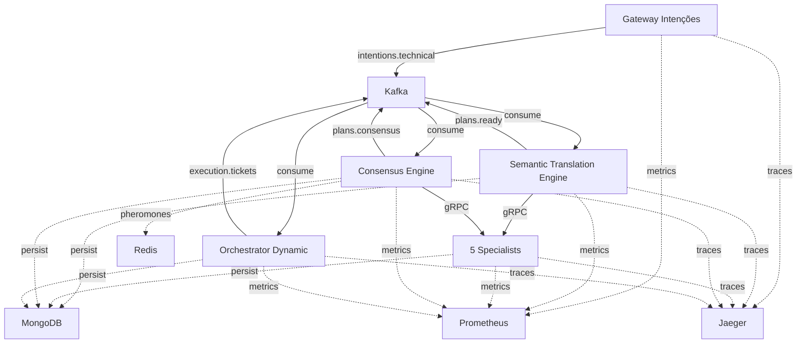

# Guia Completo de Teste E2E Manual - Neural Hive-Mind

## 1. Introdução e Pré-requisitos

### Objetivo
Validar os Fluxos A, B e C end-to-end em cluster Kubeadm real (1 master + 2 workers), documentando para cada etapa:
- Input enviado
- Output recebido
- Logs relevantes
- Métricas no Prometheus
- Traces no Jaeger
- Persistência no MongoDB
- Feromônios no Redis

### Pré-requisitos
- ✅ Todos os deployments anteriores completos:
  - 01-bootstrap (Kubeadm cluster)
  - 02-infrastructure (Kafka, MongoDB, Redis)
  - 03-observability (Prometheus, Jaeger, Grafana)
  - 04-services-build (Imagens Docker)
  - 05-gateway (Gateway Intenções)
  - 06-fluxo-b (STE + Specialists)
  - 07-fluxo-c (Consensus Engine + Orchestrator)

### Ferramentas Necessárias
```bash
# Verificar instalação
kubectl version --client
curl --version
jq --version
mongosh --version
redis-cli --version
```

### Recursos Auxiliares

Este guia pode ser utilizado em conjunto com os seguintes recursos:

- **📋 Checklist de Validação**: [`E2E_TESTING_CHECKLIST.md`](E2E_TESTING_CHECKLIST.md)  
  Checklist estruturado para anotar resultados de cada validação durante a execução dos testes.

- **🔧 Script de Preparação**: [`scripts/14-prepare-e2e-test-data.sh`](../../scripts/14-prepare-e2e-test-data.sh)  
  Gera payloads de teste, detecta pods automaticamente e cria scripts auxiliares de envio.
  
  ```bash
  # Uso
  ./scripts/14-prepare-e2e-test-data.sh --output-dir ./test-data --num-payloads 5
  ```

- **✅ Script de Validação**: [`scripts/15-validate-e2e-results.sh`](../../scripts/15-validate-e2e-results.sh)  
  Valida resultados anotados no checklist e gera relatório com status PASS/FAIL.
  
  ```bash
  # Uso
  ./scripts/15-validate-e2e-results.sh --input-file E2E_TESTING_CHECKLIST.md
  ```

### Tempo Estimado
60-90 minutos para teste completo manual  
20-30 minutos usando scripts auxiliares

---

## 2. Visão Geral dos Fluxos



**Fluxo A**: Gateway → Kafka (`intentions.technical`)  
**Fluxo B**: STE → Specialists → Kafka (`plans.ready`)  
**Fluxo C**: Consensus Engine → Orchestrator → Kafka (`plans.consensus`, `execution.tickets`)

---

## 3. Preparação do Ambiente de Teste

### 3.1. Verificar Status dos Pods

```bash
# Gateway
kubectl get pods -n gateway-intencoes

# Fluxo B
kubectl get pods -n semantic-translation

# Fluxo C
kubectl get pods -n consensus-engine
kubectl get pods -n orchestrator-dynamic

# Infraestrutura
kubectl get pods -n kafka
kubectl get pods -n mongodb
kubectl get pods -n redis

# Observabilidade
kubectl get pods -n observability
```

**Critério**: Todos os pods devem estar `Running` com `READY 1/1`

### 3.2. Configurar Port-Forwards

```bash
# Prometheus (terminal 1)
kubectl port-forward -n observability svc/prometheus-server 9090:80

# Jaeger (terminal 2)
kubectl port-forward -n observability svc/jaeger-query 16686:16686

# Manter estes terminais abertos durante todo o teste
```

Verificar acesso:
- Prometheus: http://localhost:9090
- Jaeger: http://localhost:16686

### 3.3. Verificar Conectividade

```bash
# Kafka - listar tópicos
kubectl exec -n kafka kafka-0 -- kafka-topics.sh \
  --bootstrap-server localhost:9092 --list

# MongoDB - listar collections
kubectl exec -n mongodb mongodb-0 -- mongosh --eval \
  'db.getMongo().getDBNames()' neural_hive

# Redis - ping
kubectl exec -n redis redis-0 -- redis-cli ping
```

---

## 4. FASE 1 - Teste do Fluxo A (Gateway → Kafka)

### 4.1. Health Check do Gateway

**Comando:**
```bash
GATEWAY_POD=$(kubectl get pod -n gateway-intencoes -l app=gateway-intencoes -o jsonpath='{.items[0].metadata.name}')

kubectl exec -n gateway-intencoes $GATEWAY_POD -- \
  curl -s http://localhost:8000/health | jq
```

**Output Esperado:**
```json
{
  "status": "healthy",
  "timestamp": "2025-11-20T10:00:00Z",
  "version": "1.0.0",
  "service_name": "gateway-intencoes",
  "components": {
    "redis": {"status": "healthy"},
    "kafka_producer": {"status": "healthy"},
    "nlu_pipeline": {"status": "healthy"},
    "asr_pipeline": {"status": "healthy"}
  }
}
```

**Validação:**
- ✅ `status: "healthy"`
- ✅ Todos os componentes `healthy`

### 4.2. Enviar Intenção de Teste

**Criar Payload:**
```bash
cat > /tmp/intent-technical.json <<'EOF'
{
  "text": "Analisar viabilidade técnica de implementar autenticação biométrica no aplicativo móvel",
  "language": "pt-BR",
  "correlation_id": "test-e2e-001",
  "context": {
    "user_id": "test-user",
    "session_id": "test-session-001",
    "channel": "API"
  },
  "constraints": {
    "priority": "HIGH",
    "timeout_ms": 30000
  }
}
EOF
```

**Enviar:**
```bash
kubectl cp /tmp/intent-technical.json gateway-intencoes/$GATEWAY_POD:/tmp/

kubectl exec -n gateway-intencoes $GATEWAY_POD -- \
  curl -X POST http://localhost:8000/intentions \
  -H 'Content-Type: application/json' \
  -d @/tmp/intent-technical.json | jq
```

**Output Esperado:**
```json
{
  "intent_id": "550e8400-e29b-41d4-a716-446655440000",
  "correlation_id": "test-e2e-001",
  "status": "processed",
  "confidence": 0.85,
  "domain": "technical",
  "classification": "analysis_request",
  "trace_id": "abc123def456",
  "processing_time_ms": 150.5
}
```

**📝 ANOTAR:**
- `intent_id`: ___________________________
- `correlation_id`: ___________________________
- `trace_id`: ___________________________
- `domain`: ___________________________
- `confidence`: ___________________________

### 4.3. Validar Logs do Gateway

```bash
kubectl logs -n gateway-intencoes $GATEWAY_POD --tail=50 | \
  grep -E "intent_id|Kafka|published"
```

**Buscar por:**
- "Processando intenção"
- "Publicando no Kafka"
- "topic=intentions.technical"
- "offset="

### 4.4. Validar Publicação no Kafka

```bash
KAFKA_POD=$(kubectl get pod -n kafka -l app=kafka -o jsonpath='{.items[0].metadata.name}')

kubectl exec -n kafka $KAFKA_POD -- \
  kafka-console-consumer.sh \
  --bootstrap-server localhost:9092 \
  --topic intentions.technical \
  --from-beginning \
  --max-messages 1 \
  --timeout-ms 5000
```

**Verificar:**
- ✅ Mensagem contém `intent_id` anotado
- ✅ Campos: `id`, `intent.text`, `intent.domain`, `confidence`

### 4.5. Validar Métricas no Prometheus

```bash
# Intenções publicadas
curl -s 'http://localhost:9090/api/v1/query?query=neural_hive_intents_published_total{service="gateway-intencoes"}' | jq '.data.result[0].value[1]'

# Duração de processamento
curl -s 'http://localhost:9090/api/v1/query?query=neural_hive_intent_processing_duration_seconds' | jq

# Confidence score
curl -s 'http://localhost:9090/api/v1/query?query=neural_hive_nlu_confidence_score' | jq
```

**Verificar:**
- ✅ `neural_hive_intents_published_total` incrementou
- ✅ Métricas de duração e confidence presentes

### 4.6. Validar Trace no Jaeger

1. Acessar: http://localhost:16686
2. Service: `gateway-intencoes`
3. Buscar por `trace_id` anotado no passo 4.2
4. Verificar spans:
   - NLU processing
   - Kafka publish
5. Tags esperadas: `intent.domain`, `intent.confidence`

### 4.7. Validar Cache no Redis

```bash
REDIS_POD=$(kubectl get pod -n redis -l app=redis -o jsonpath='{.items[0].metadata.name}')
INTENT_ID="<intent_id_anotado>"

kubectl exec -n redis $REDIS_POD -- \
  redis-cli GET "intent:$INTENT_ID"

# Verificar TTL
kubectl exec -n redis $REDIS_POD -- \
  redis-cli TTL "intent:$INTENT_ID"
```

---

## 5. FASE 2 - Teste do Fluxo B (STE → Plano)

### 5.1. Validar Consumo pelo STE

```bash
STE_POD=$(kubectl get pod -n semantic-translation -l app=semantic-translation-engine -o jsonpath='{.items[0].metadata.name}')

kubectl logs -n semantic-translation $STE_POD --tail=100 | \
  grep -E "Consumindo|Intent|plan_id"
```

**Buscar por:**
- "Consumindo Intent"
- "Gerando plano cognitivo"
- **📝 ANOTAR `plan_id`**: ___________________________

### 5.2. Validar Publicação no Kafka (plans.ready)

```bash
kubectl exec -n kafka $KAFKA_POD -- \
  kafka-console-consumer.sh \
  --bootstrap-server localhost:9092 \
  --topic plans.ready \
  --from-beginning \
  --max-messages 1 \
  --timeout-ms 5000
```

**Verificar:**
- ✅ `plan_id`, `intent_id`, `tasks[]`, `risk_score`

### 5.3. Validar Persistência no MongoDB

```bash
MONGODB_POD=$(kubectl get pod -n mongodb -l app=mongodb -o jsonpath='{.items[0].metadata.name}')
PLAN_ID="<plan_id_anotado>"

kubectl exec -n mongodb $MONGODB_POD -- mongosh --eval \
  "db.cognitive_ledger.findOne({plan_id: '$PLAN_ID'})" neural_hive
```

**Verificar campos:**
- `tasks`, `explainability_token`, `created_at`, `status`

### 5.4. Validar Métricas do STE

```bash
curl -s 'http://localhost:9090/api/v1/query?query=neural_hive_plans_generated_total' | jq
curl -s 'http://localhost:9090/api/v1/query?query=neural_hive_plan_risk_score' | jq
```

---

## 6. FASE 3 - Teste do Fluxo B (Specialists)

### 6.1. Validar Chamadas aos Specialists

Para cada specialist (business, technical, behavior, evolution, architecture):

```bash
SPECIALIST="business"  # Alterar para cada specialist
SPECIALIST_POD=$(kubectl get pod -n semantic-translation -l app=specialist-$SPECIALIST -o jsonpath='{.items[0].metadata.name}')

kubectl logs -n semantic-translation $SPECIALIST_POD --tail=50 | \
  grep -E "GetOpinion|opinion_id"
```

**📝 ANOTAR para cada specialist:**
- Business `opinion_id`: ___________________________
- Technical `opinion_id`: ___________________________
- Behavior `opinion_id`: ___________________________
- Evolution `opinion_id`: ___________________________
- Architecture `opinion_id`: ___________________________

### 6.2. Validar Persistência de Opiniões

```bash
kubectl exec -n mongodb $MONGODB_POD -- mongosh --eval \
  "db.cognitive_ledger.find({plan_id: '$PLAN_ID', specialist_type: {\$exists: true}}).count()" neural_hive
```

**Esperado:** 5 opiniões

### 6.3. Validar Métricas dos Specialists

```bash
curl -s 'http://localhost:9090/api/v1/query?query=neural_hive_specialist_opinions_total' | jq
```

---

## 7. FASE 4 - Teste do Fluxo C (Consensus)

### 7.1. Validar Consumo pelo Consensus Engine

```bash
CONSENSUS_POD=$(kubectl get pod -n consensus-engine -l app=consensus-engine -o jsonpath='{.items[0].metadata.name}')

kubectl logs -n consensus-engine $CONSENSUS_POD --tail=100 | \
  grep -E "Consumindo|decision_id|Agregando"
```

**📝 ANOTAR `decision_id`**: ___________________________

### 7.2. Validar Publicação no Kafka (plans.consensus)

```bash
kubectl exec -n kafka $KAFKA_POD -- \
  kafka-console-consumer.sh \
  --bootstrap-server localhost:9092 \
  --topic plans.consensus \
  --from-beginning \
  --max-messages 1 \
  --timeout-ms 5000
```

### 7.3. Validar Persistência da Decisão

```bash
DECISION_ID="<decision_id_anotado>"

kubectl exec -n mongodb $MONGODB_POD -- mongosh --eval \
  "db.consensus_decisions.findOne({decision_id: '$DECISION_ID'})" neural_hive
```

### 7.4. Validar Feromônios no Redis

```bash
# Listar keys de feromônios
kubectl exec -n redis $REDIS_POD -- \
  redis-cli KEYS 'pheromone:*'

# Exemplo de query específica
kubectl exec -n redis $REDIS_POD -- \
  redis-cli HGETALL 'pheromone:business:workflow-analysis:SUCCESS'
```

**Verificar campos:** `strength`, `plan_id`, `decision_id`, `created_at`

### 7.5. Validar Métricas do Consensus

```bash
curl -s 'http://localhost:9090/api/v1/query?query=neural_hive_consensus_decisions_total' | jq
curl -s 'http://localhost:9090/api/v1/query?query=neural_hive_consensus_divergence_score' | jq
curl -s 'http://localhost:9090/api/v1/query?query=neural_hive_pheromone_strength' | jq
```

---

## 8. FASE 5 - Teste do Fluxo C (Orchestrator)

### 8.1. Validar Consumo pelo Orchestrator

```bash
ORCHESTRATOR_POD=$(kubectl get pod -n orchestrator-dynamic -l app=orchestrator-dynamic -o jsonpath='{.items[0].metadata.name}')

kubectl logs -n orchestrator-dynamic $ORCHESTRATOR_POD --tail=100 | \
  grep -E "Consumindo|ticket_id|Gerando"
```

**📝 ANOTAR `ticket_id`**: ___________________________

### 8.2. Validar Publicação no Kafka (execution.tickets)

```bash
kubectl exec -n kafka $KAFKA_POD -- \
  kafka-console-consumer.sh \
  --bootstrap-server localhost:9092 \
  --topic execution.tickets \
  --from-beginning \
  --max-messages 1 \
  --timeout-ms 5000
```

### 8.3. Validar Persistência de Tickets

```bash
kubectl exec -n mongodb $MONGODB_POD -- mongosh --eval \
  "db.execution_tickets.find({plan_id: '$PLAN_ID'}).count()" neural_hive
```

### 8.4. Validar Métricas do Orchestrator

```bash
curl -s 'http://localhost:9090/api/v1/query?query=neural_hive_execution_tickets_generated_total' | jq
```

---

## 9. Validação Consolidada E2E

### 9.1. Verificar Correlação Completa

```bash
INTENT_ID="<intent_id_anotado>"

kubectl exec -n mongodb $MONGODB_POD -- mongosh --eval "
db.cognitive_ledger.aggregate([
  {\$match: {intent_id: '$INTENT_ID'}},
  {\$group: {_id: '\$type', count: {\$sum: 1}}}
])
" neural_hive
```

**Esperado:**
- intents: 1
- plans: 1
- opinions: 5

### 9.2. Verificar Trace Completo no Jaeger

1. Buscar por `trace_id` inicial
2. Verificar spans de todos os componentes:
   - Gateway
   - STE
   - 5 Specialists
   - Consensus Engine
   - Orchestrator

### 9.3. Verificar Métricas Agregadas

```bash
# Taxa de intenções
curl -s 'http://localhost:9090/api/v1/query?query=sum(rate(neural_hive_intents_published_total[5m]))' | jq

# Taxa de planos
curl -s 'http://localhost:9090/api/v1/query?query=sum(rate(neural_hive_plans_generated_total[5m]))' | jq

# Taxa de decisões
curl -s 'http://localhost:9090/api/v1/query?query=sum(rate(neural_hive_consensus_decisions_total[5m]))' | jq

# Taxa de tickets
curl -s 'http://localhost:9090/api/v1/query?query=sum(rate(neural_hive_execution_tickets_generated_total[5m]))' | jq
```

---

## 10. Troubleshooting

| Problema | Possível Causa | Solução |
|----------|---------------|---------|
| Intenção não publicada no Kafka | Gateway sem conectividade | Verificar logs do Gateway, configuração de brokers |
| STE não consome intenção | Consumer group offset | Resetar offset: `kafka-consumer-groups.sh --reset-offsets` |
| Specialists não respondem | Conectividade gRPC | Verificar endpoints, NetworkPolicies |
| Consensus não agrega | Timeout de specialists | Aumentar timeout em `consensus-engine-config.yaml` |
| Orchestrator não gera tickets | Validação de decisão falhou | Verificar logs, schema da decisão |
| Métricas ausentes no Prometheus | ServiceMonitor não configurado | Verificar `kubectl get servicemonitor -n <namespace>` |
| Traces ausentes no Jaeger | Propagação de trace_id | Verificar headers HTTP/gRPC, sampling rate |
| Dados ausentes no MongoDB | Erro de persistência | Verificar logs, conectividade, índices |
| Feromônios ausentes no Redis | TTL expirado | Verificar configuração de TTL, logs de publicação |

---

## 11. Checklist de Validação Final

### Fluxo A
- [ ] Intenção publicada no Kafka
- [ ] Métricas do Gateway no Prometheus
- [ ] Trace do Gateway no Jaeger
- [ ] Cache no Redis

### Fluxo B - STE
- [ ] Plano gerado pelo STE
- [ ] Plano publicado no Kafka
- [ ] Plano persistido no MongoDB
- [ ] Métricas do STE no Prometheus
- [ ] Trace do STE no Jaeger

### Fluxo B - Specialists
- [ ] 5 Specialists responderam
- [ ] Opiniões persistidas no MongoDB
- [ ] Métricas dos Specialists no Prometheus
- [ ] Traces dos Specialists no Jaeger

### Fluxo C - Consensus
- [ ] Decisão consolidada
- [ ] Decisão publicada no Kafka
- [ ] Decisão persistida no MongoDB
- [ ] Feromônios publicados no Redis
- [ ] Métricas do Consensus no Prometheus
- [ ] Trace do Consensus no Jaeger

### Fluxo C - Orchestrator
- [ ] Tickets gerados
- [ ] Tickets publicados no Kafka
- [ ] Tickets persistidos no MongoDB
- [ ] Métricas do Orchestrator no Prometheus
- [ ] Trace do Orchestrator no Jaeger

### Validação Consolidada
- [ ] Correlação completa verificada no MongoDB
- [ ] Trace end-to-end verificado no Jaeger
- [ ] Métricas agregadas consistentes no Prometheus

---

## 12. Próximos Passos

1. Executar múltiplos testes com diferentes tipos de intenções
2. Testar cenários de falha (specialist timeout, Kafka indisponível)
3. Validar comportamento de retry e compensação
4. Testar carga (múltiplas intenções simultâneas)
5. Validar SLAs e latências end-to-end
6. Configurar alertas no Prometheus
7. Criar dashboards no Grafana
