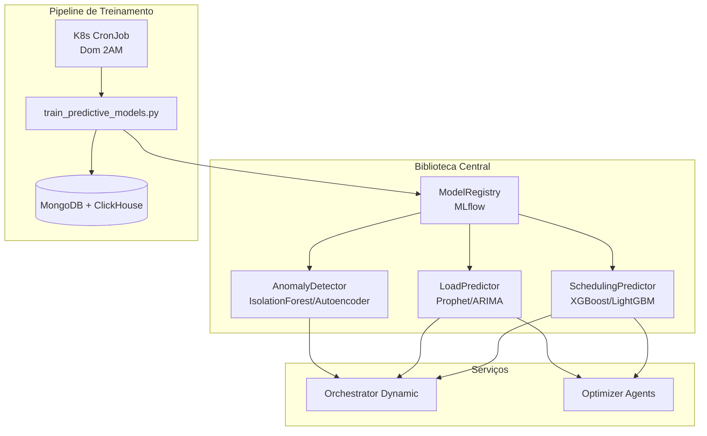

# Guia de Modelos Preditivos - Neural Hive-Mind

## Visão Geral

O sistema de modelos preditivos do Neural Hive-Mind fornece previsões de ML para otimizar o agendamento e alocação de recursos em tempo real. Os modelos são centralizados na biblioteca `neural_hive_ml` e integrados nos serviços via dependency injection.

### Arquitetura



### Propósito

- **SchedulingPredictor**: Prevê duração de execução e recursos necessários (CPU/Memory) para tickets
- **LoadPredictor**: Prevê carga futura do sistema para scheduling proativo
- **AnomalyDetector**: Detecta tickets anômalos que requerem atenção especial

---

## SchedulingPredictor

### Features Utilizadas (25+)

O SchedulingPredictor usa 25+ features extraídas de tickets:

**Features Básicas:**
- `risk_weight`: Peso de risco do ticket (0-100)
- `capabilities_count`: Número de capabilities requeridas
- `parameters_size`: Tamanho dos parâmetros em bytes
- `estimated_duration_ms`: Duração estimada inicial
- `sla_timeout_ms`: Timeout do SLA
- `retry_count`: Número de retries já executados

**Features de QoS:**
- `qos_priority`: Prioridade normalizada (0.0-1.0)
- `qos_consistency`: Nível de consistência (AT_MOST_ONCE=0.0, AT_LEAST_ONCE=0.5, EXACTLY_ONCE=1.0)
- `qos_durability`: Nível de durabilidade (EPHEMERAL=0.0, DURABLE=0.5, REPLICATED=1.0)

**Features Temporais:**
- `hour_of_day`: Hora do dia (0-23)
- `day_of_week`: Dia da semana (0-6)
- `is_weekend`: Se é fim de semana (0/1)
- `is_business_hours`: Se é horário comercial (0/1)

**Features Históricas (de MongoDB/ClickHouse):**
- `avg_duration_by_task`: Duração média histórica por tipo de task
- `std_duration_by_task`: Desvio padrão de duração por task
- `success_rate_by_task`: Taxa de sucesso histórica por task
- `avg_duration_by_risk`: Duração média por banda de risco

**Features Derivadas:**
- `risk_to_capabilities_ratio`: Razão risco/capabilities
- `estimated_to_sla_ratio`: Razão duração estimada/SLA timeout
- `task_type_encoded`: Tipo de task codificado (0-8)

### Modelos Suportados

#### XGBoost (Padrão)
- **Uso**: Previsão de duração e recursos
- **Vantagens**: Alta acurácia, rápido, interpretável
- **Hiperparâmetros**:
  - `max_depth`: 6-10
  - `learning_rate`: 0.01-0.3
  - `n_estimators`: 100-500
  - `min_child_weight`: 1-5

#### LightGBM
- **Uso**: Alternativa ao XGBoost para datasets grandes
- **Vantagens**: Mais rápido que XGBoost, menor uso de memória
- **Hiperparâmetros**:
  - `num_leaves`: 31-127
  - `learning_rate`: 0.01-0.3
  - `n_estimators`: 100-500

#### Ensemble (XGBoost + LightGBM)
- **Uso**: Combina predições de múltiplos modelos
- **Vantagens**: Maior robustez, melhor generalização
- **Método**: Média ponderada baseada em acurácia de validação

### API

```python
from neural_hive_ml.predictive_models import SchedulingPredictor

# Inicialização
predictor = SchedulingPredictor(
    config={
        'model_name': 'scheduling-predictor',
        'model_type': 'xgboost',  # ou 'lightgbm', 'ensemble'
        'hyperparameters': {}
    },
    model_registry=model_registry,
    metrics=metrics
)

await predictor.initialize()

# Predição de duração
result = await predictor.predict_duration(ticket)
# Returns: {
#     'predicted_duration_ms': 8500,
#     'confidence': 0.92,
#     'model_type': 'xgboost'
# }

# Predição de recursos
resources = await predictor.predict_resources(ticket)
# Returns: {
#     'cpu_cores': 2.0,
#     'memory_mb': 1024,
#     'confidence': 0.85
# }
```

### Benchmarks

**Requisitos de Performance:**
- MAE (Mean Absolute Error) < 10 segundos
- R² (R-squared) > 0.85
- MAPE (Mean Absolute Percentage Error) < 20%
- Latência de predição < 100ms (P95)

**Resultados Típicos:**
- MAE: ~7 segundos
- R²: 0.88-0.92
- MAPE: 15-18%
- Latência P95: 50-80ms

---

## LoadPredictor

### Modelos Suportados

#### Prophet (Padrão)
- **Uso**: Previsão de carga do sistema com sazonalidade
- **Vantagens**: Excelente para dados com padrões semanais/diários, robusto a outliers
- **Features**:
  - Sazonalidade semanal e diária automática
  - Suporte a feriados brasileiros (via holidays library)
  - Intervalos de confiança nativos
  - Modo de sazonalidade: `additive` (padrão) ou `multiplicative`

#### ARIMA
- **Uso**: Previsão de carga para séries temporais sem sazonalidade forte
- **Vantagens**: Mais rápido que Prophet, bom para tendências lineares
- **Parâmetros**: Auto-ajustados via auto_arima

### Horizontes de Previsão

- **60 minutos**: Scheduling imediato (próxima hora)
- **360 minutos** (6h): Planejamento de curto prazo
- **1440 minutos** (24h): Planejamento de médio prazo

Intervalos de confiança ampliam com o horizonte (mais incerteza no futuro distante).

### Sazonalidade e Feriados

**Padrões Detectados:**
- Diário: Picos em horário comercial (9h-18h)
- Semanal: Menor carga em fins de semana
- Feriados: Carga reduzida (configurável para feriados brasileiros)

**Configuração de Feriados:**
```python
config = {
    'model_type': 'prophet',
    'country_holidays': 'BR',  # Feriados brasileiros
    'seasonality_mode': 'additive'
}
```

### API

```python
from neural_hive_ml.predictive_models import LoadPredictor

# Inicialização
predictor = LoadPredictor(
    config={
        'model_name': 'load-predictor',
        'model_type': 'prophet',
        'forecast_horizons': [60, 360, 1440],
        'seasonality_mode': 'additive',
        'cache_ttl_seconds': 300
    },
    model_registry=model_registry,
    metrics=metrics,
    redis_client=redis_client
)

await predictor.initialize()

# Predição de carga
forecast = await predictor.predict_load(horizon_minutes=60)
# Returns: {
#     'forecast': [
#         {
#             'timestamp': '2025-11-17T10:00:00',
#             'predicted_load': 125.5,
#             'confidence_lower': 100.0,
#             'confidence_upper': 150.0
#         },
#         ...
#     ],
#     'trend': 'increasing',  # ou 'decreasing', 'stable'
#     'horizon_minutes': 60
# }
```

### Bottlenecks e Otimizações

**Possíveis Gargalos:**
- Prophet lento para treinar (50+ epochs)
- Queries ao ClickHouse podem ser custosas

**Otimizações:**
- Cache Redis (TTL 5min): Hit rate > 80%
- Treinamento incremental (apenas dados novos)
- Batch predictions para múltiplos horizontes

### Benchmarks

**Requisitos:**
- MAPE < 20% para todos os horizontes
- Latência < 200ms (inclui cache)
- Cache hit rate > 80%

**Resultados Típicos:**
- MAPE (60min): 12-15%
- MAPE (1440min): 18-22%
- Latência com cache: 10-20ms
- Latência sem cache: 100-150ms

---

## AnomalyDetector

### Modelos Suportados

#### IsolationForest (Padrão)
- **Uso**: Detecção de anomalias sem labels
- **Vantagens**: Rápido, eficiente em high-dimensional data
- **Contamination**: 0.05 (5% de tickets esperados como anômalos)
- **Funcionamento**: Isola pontos anômalos em árvores binárias

#### Autoencoder (Neural Network)
- **Uso**: Detecção de anomalias complexas via reconstruction error
- **Vantagens**: Captura padrões não-lineares, boa generalização
- **Arquitetura**:
  - Encoder: [input_dim → 64 → 32 → 16]
  - Decoder: [16 → 32 → 64 → input_dim]
- **Threshold**: 95º percentil de reconstruction errors no treino

### Tipos de Anomalias Detectadas

1. **resource_mismatch**
   - **Descrição**: Baixo risco mas muitas capabilities requeridas
   - **Exemplo**: risk_weight < 25 e capabilities > 8
   - **Ação**: Revisar requisitos do ticket

2. **qos_inconsistency**
   - **Descrição**: QoS forte (EXACTLY_ONCE) para ticket de baixo risco
   - **Exemplo**: EXACTLY_ONCE com risk < 30
   - **Ação**: Overhead desnecessário, considerar AT_LEAST_ONCE

3. **duration_outlier**
   - **Descrição**: Duração estimada muito diferente da média histórica
   - **Exemplo**: |duração - média| > 3 * desvio_padrão
   - **Ação**: Validar estimativa

4. **capability_anomaly**
   - **Descrição**: Número anormal de capabilities
   - **Exemplo**: capabilities > 10
   - **Ação**: Verificar se todas são necessárias

### Persistência de Artifacts

**Artifacts Salvos no MLflow:**
- `model/`: Modelo treinado (sklearn ou keras)
- `artifacts/scaler.joblib`: StandardScaler fitted
- `artifacts/threshold.npy`: Threshold para autoencoder (95º percentil)

**Reload:**
```python
# No initialize(), artifacts são baixados do MLflow run
run_id = client.get_latest_versions(model_name, ['Production'])[0].run_id
scaler_path = client.download_artifacts(run_id, 'artifacts/scaler.joblib', tmpdir)
self.scaler = joblib.load(scaler_path)
```

### API

```python
from neural_hive_ml.predictive_models import AnomalyDetector

# Inicialização
detector = AnomalyDetector(
    config={
        'model_name': 'anomaly-detector',
        'model_type': 'isolation_forest',  # ou 'autoencoder'
        'contamination': 0.05
    },
    model_registry=model_registry,
    metrics=metrics
)

await detector.initialize()

# Detecção de anomalia
result = await detector.detect_anomaly(ticket)
# Returns: {
#     'is_anomaly': True,
#     'anomaly_score': 0.85,
#     'anomaly_type': 'capability_anomaly',
#     'explanation': 'Número anormal de capabilities: 18',
#     'model_type': 'isolation_forest'
# }
```

### Integração com Scheduler

Quando anomalia é detectada:
1. **Priority Boost**: Prioridade aumenta em 20% (`priority *= 1.2`)
2. **Metadata**: `allocation_metadata['anomaly_detected'] = True`
3. **Métricas**: `anomaly_detected_total` incrementada
4. **Logs**: Evento logado com tipo e score
5. **Alertas**: Se score > threshold, alerta no Prometheus

### Benchmarks

**Requisitos:**
- F1 Score > 0.65
- Precision > 0.6
- Recall > 0.6
- Taxa de anomalias ~5% (contamination)

**Resultados Típicos:**
- F1: 0.70-0.75
- Precision: 0.72
- Recall: 0.68
- Taxa real: 4-6%

---

## Pipeline de Treinamento

### Script Central

`ml_pipelines/training/train_predictive_models.py`

### Requisitos de Dados

**Mínimo para Treinamento:**
- 1000 samples por modelo
- Janela temporal: 18 meses de dados históricos
- Features completas (sem nulls em features críticas)

**Se dados insuficientes:**
- Aviso logado: "Dados insuficientes, usando synthetic"
- Dados sintéticos gerados com padrões realistas
- Modelo treinado mas marcado como "synthetic" no MLflow

### Processo de Treinamento

```bash
# Treinar modelo específico
python train_predictive_models.py \
  --model-type scheduling \
  --model-algorithm xgboost

# Treinar com tuning de hiperparâmetros
python train_predictive_models.py \
  --model-type scheduling \
  --tuning true

# Treinar todos os modelos
python train_predictive_models.py --all

# Treinar e promover automaticamente
python train_predictive_models.py \
  --all \
  --tuning true \
  --promote true
```

### Tuning de Hiperparâmetros

**Ferramenta**: Optuna
**Métricas**: MAE (SchedulingPredictor), MAPE (LoadPredictor), F1 (AnomalyDetector)
**Trials**: 50 por modelo
**Tempo**: ~20-30min por modelo (paralelizável)

**Exemplo de Espaço de Busca (XGBoost):**
```python
{
    'max_depth': (3, 10),
    'learning_rate': (0.01, 0.3),
    'n_estimators': (100, 500),
    'min_child_weight': (1, 5),
    'subsample': (0.7, 1.0),
    'colsample_bytree': (0.7, 1.0)
}
```

### Salvamento no MLflow

**Registry MLflow:**
- **Tracking URI**: Configurável via env `MLFLOW_TRACKING_URI`
- **Experiment**: `neural-hive-ml-{model_name}`
- **Tags**: `training_date`, `data_window_days`, `samples_count`
- **Metrics**: MAE, R², MAPE, F1, precision, recall
- **Params**: Hiperparâmetros, features_count, model_type
- **Artifacts**: Modelo + extras (scaler, threshold)

### Promoção de Modelos

**Critérios de Promoção Automática:**
1. Novo modelo deve ser > 5% melhor que Production
2. Métricas devem atender requisitos mínimos:
   - SchedulingPredictor: MAE < 10s, R² > 0.85
   - LoadPredictor: MAPE < 20%
   - AnomalyDetector: F1 > 0.65

**Promoção Manual:**
```bash
# Via API do orchestrator
curl -X POST http://orchestrator:8000/api/v1/ml/models/scheduling-predictor/promote \
  -H "Content-Type: application/json" \
  -d '{"version": "3", "stage": "Production"}'
```

### CLI de Treinamento

**Opções Disponíveis:**
```
--model-type: scheduling, load, anomaly, all
--model-algorithm: xgboost, lightgbm, prophet, arima, isolation_forest, autoencoder
--window-days: Janela de dados em dias (padrão: 90)
--tuning: Habilita tuning de hiperparâmetros
--promote: Promove automaticamente se critérios atingidos
--backfill-errors: Calcula erros históricos para validação
```

---

## Deployment

### Kubernetes CronJob

**Arquivo**: `k8s/cronjobs/predictive-models-training-job.yaml`

**Schedule**: Domingos às 2h AM (menor carga)
```yaml
schedule: "0 2 * * 0"
```

**Recursos**:
- CPU: 2-4 cores (tuning paraleliza)
- Memory: 4-8 Gi (Prophet consome ~2Gi)
- Storage: Efêmero (artifacts vão para MLflow)

**Environment Variables:**
```yaml
env:
  - name: MLFLOW_TRACKING_URI
    value: "http://mlflow:5000"
  - name: MONGODB_URI
    valueFrom:
      secretKeyRef:
        name: mongodb-credentials
        key: uri
  - name: CLICKHOUSE_HOST
    value: "clickhouse.clickhouse.svc.cluster.local"
  - name: CLICKHOUSE_PORT
    value: "9000"
  - name: REDIS_HOST
    value: "redis-master.redis.svc.cluster.local"
  - name: LOG_LEVEL
    value: "INFO"
```

**Secrets:**
- MongoDB URI (usuário/senha)
- ClickHouse credentials
- Redis password (se habilitado)

### Integração no Orchestrator

**Lifespan do Serviço:**
1. Inicializa `ModelRegistry` (MLflow)
2. Cria preditores (Scheduling, Load, Anomaly)
3. Chama `await predictor.initialize()` (carrega modelos do MLflow)
4. Injeta preditores no `TemporalWorkerManager`
5. Passa para `IntelligentScheduler` via constructor

**Dependency Injection:**
```python
# services/orchestrator-dynamic/src/main.py
app_state.scheduling_predictor = SchedulingPredictor(...)
await app_state.scheduling_predictor.initialize()

# services/orchestrator-dynamic/src/workers/temporal_worker.py
self.intelligent_scheduler = IntelligentScheduler(
    scheduling_predictor=self.scheduling_predictor,
    load_predictor=self.load_predictor,
    anomaly_detector=self.anomaly_detector
)
```

---

## Troubleshooting

### Problema: Dados Insuficientes para Treinamento

**Sintoma**: Log "Dados insuficientes, usando synthetic"

**Causa**: MongoDB/ClickHouse tem < 1000 tickets históricos

**Solução:**
1. Aguardar acumular mais dados (produção normal)
2. Usar dados sintéticos temporariamente (gerados automaticamente)
3. Importar dados de backup se disponível

**Comando para Validar:**
```bash
# Contar tickets no MongoDB
kubectl exec -it mongodb-0 -- mongo --eval \
  "db.execution_tickets.count()"
```

### Problema: ML Falha ao Inicializar

**Sintoma**: `/health/ml` retorna `loaded: False` ou erro 503

**Causa**: MLflow inacessível, modelo não existe, ou credenciais inválidas

**Solução:**
1. Verificar conectividade com MLflow:
   ```bash
   kubectl exec -it orchestrator-dynamic-xxx -- \
     curl http://mlflow:5000/health
   ```

2. Listar modelos no MLflow:
   ```bash
   curl http://mlflow:5000/api/2.0/mlflow/registered-models/search
   ```

3. Se modelo não existe, executar treinamento manual:
   ```bash
   kubectl create job --from=cronjob/predictive-models-training \
     manual-training-$(date +%s)
   ```

### Problema: OOM (Out of Memory) no CronJob

**Sintoma**: Pod killed com exit code 137

**Causa**: Prophet/Autoencoder consomem muita memória (> 8Gi)

**Solução:**
1. Aumentar `resources.limits.memory` no CronJob
2. Reduzir janela de dados (`--window-days 60`)
3. Usar algoritmos mais leves (ARIMA em vez de Prophet)
4. Treinar modelos separadamente (não `--all`)

---

## API Reference

### Classes Principais

#### SchedulingPredictor

```python
class SchedulingPredictor(BasePredictor):
    """Preditor de duração e recursos para tickets."""

    async def initialize(self) -> None:
        """Carrega modelo do MLflow registry."""

    async def predict_duration(
        self,
        ticket: Dict[str, Any]
    ) -> Dict[str, Any]:
        """
        Prevê duração de execução.

        Returns:
            {
                'predicted_duration_ms': int,
                'confidence': float (0-1),
                'model_type': str
            }
        """

    async def predict_resources(
        self,
        ticket: Dict[str, Any]
    ) -> Dict[str, Any]:
        """
        Prevê recursos necessários.

        Returns:
            {
                'cpu_cores': float,
                'memory_mb': int,
                'confidence': float (0-1)
            }
        """

    async def train_model(
        self,
        X: pd.DataFrame,
        y: pd.Series
    ) -> Dict[str, Any]:
        """
        Treina modelo e salva no MLflow.

        Returns:
            Métricas de treinamento (MAE, R², MAPE)
        """
```

#### LoadPredictor

```python
class LoadPredictor(BasePredictor):
    """Preditor de carga futura do sistema."""

    async def predict_load(
        self,
        horizon_minutes: int
    ) -> Dict[str, Any]:
        """
        Prevê carga para horizonte especificado.

        Args:
            horizon_minutes: 60, 360, ou 1440

        Returns:
            {
                'forecast': List[Dict],  # timestamp, predicted_load, CI
                'trend': str,  # 'increasing', 'decreasing', 'stable'
                'horizon_minutes': int
            }
        """
```

#### AnomalyDetector

```python
class AnomalyDetector(BasePredictor):
    """Detector de tickets anômalos."""

    async def detect_anomaly(
        self,
        ticket: Dict[str, Any]
    ) -> Dict[str, Any]:
        """
        Detecta se ticket é anômalo.

        Returns:
            {
                'is_anomaly': bool,
                'anomaly_score': float,
                'anomaly_type': str,  # 'resource_mismatch', etc.
                'explanation': str,
                'model_type': str
            }
        """
```

---

## Métricas e Monitoramento

### Métricas Prometheus

**Latência de Predições:**
```promql
prediction_latency_seconds_bucket{service="orchestrator-dynamic", model_type="xgboost"}
```

**Acurácia:**
```promql
prediction_accuracy{service="orchestrator-dynamic", model_type="scheduling"}
```

**Anomalias Detectadas:**
```promql
anomaly_detected_total{service="orchestrator-dynamic", anomaly_type="capability_anomaly"}
```

**Cache:**
```promql
cache_hit_total{service="orchestrator-dynamic"}
cache_miss_total{service="orchestrator-dynamic"}
```

**Treinamento:**
```promql
model_training_duration_seconds{model_type="scheduling"}
model_training_samples_total{model_type="scheduling"}
```

### Dashboard Grafana

**Arquivo**: `monitoring/dashboards/predictive-models-dashboard.json`

**Painéis:**
1. Latência de Predições (Histogram) - P50/P95
2. Acurácia de Predições (Série Temporal)
3. Taxa de Anomalias (Gauge)
4. MAPE por Horizonte (Load Predictor)
5. Versões de Modelos (Tabela)
6. Contador de Erros
7. Feature Importance (Bar Chart)
8. Bottlenecks (Série Temporal)
9. Cache Hit Rate (Gauge)
10. Estatísticas de Treinamento

**Acesso**: https://grafana/d/predictive-models

### Alertas Prometheus

**Arquivo**: `monitoring/alerts/predictive-models-alerts.yaml`

**Alertas Principais:**
- `PredictionAccuracyLow`: Acurácia < 80% por 30min
- `PredictionLatencyHigh`: P95 > 5s por 10min
- `PredictionErrorsHigh`: Taxa > 0.1/s por 5min
- `AnomalyRateHigh`: Taxa > 10% por 1h
- `LoadPredictionMAPEHigh`: MAPE > 25% por 1h
- `ModelTrainingFailed`: Job falhou
- `ModelStale`: Modelo não retreinado há > 30 dias

**Notificações:**
- Critical → PagerDuty + Slack (#ml-ops-oncall)
- Warning → Slack (#ml-alerts)
- Info → Email (ml-ops@example.com)

---

## Roadmap Futuro

### Curto Prazo (1-2 meses)
- [ ] Online learning: Atualizar modelos incrementalmente
- [ ] A/B testing: Comparar modelos em produção
- [ ] Feature importance tracking: Monitorar features mais impactantes

### Médio Prazo (3-6 meses)
- [ ] Federated learning: Treinar em múltiplos clusters
- [ ] AutoML: Seleção automática de algoritmos/hiperparâmetros
- [ ] Explainability: SHAP values para interpretabilidade

### Longo Prazo (6-12 meses)
- [ ] Transformers: Modelos de linguagem para análise de logs
- [ ] Graph Neural Networks: Modelar dependências entre tickets
- [ ] Reinforcement Learning: Otimização de scheduling via RL

---

## Referências

- **MLflow**: https://mlflow.org/docs/latest/
- **XGBoost**: https://xgboost.readthedocs.io/
- **Prophet**: https://facebook.github.io/prophet/
- **Scikit-learn**: https://scikit-learn.org/stable/
- **Optuna**: https://optuna.org/

---

**Última Atualização**: 2025-11-17
**Versão**: 1.0
**Maintainers**: ML-Ops Team
