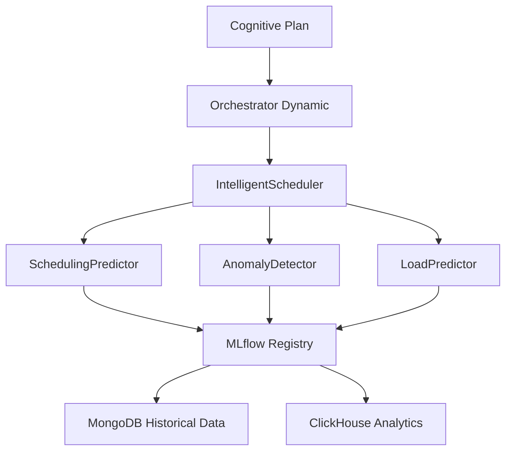

# Guia de Modelos Preditivos - Neural Hive-Mind

## 📋 Visão Geral

O Neural Hive-Mind utiliza 3 modelos preditivos centralizados para otimizar scheduling e detecção de anomalias:

1. **SchedulingPredictor** - Prediz duração e recursos de tickets
2. **LoadPredictor** - Prevê carga futura do sistema (60min, 6h, 24h)
3. **AnomalyDetector** - Detecta tickets anômalos

## 🏗️ Arquitetura



## 📊 Modelos Registrados

### SchedulingPredictor

- **Algoritmo:** XGBoost Regressor
- **Features:** 20 features (risk_weight, capabilities_count, qos_priority, etc.)
- **Métricas:**
  - MAE < 1000ms
  - MAPE < 15%
  - R² > 0.75
- **Uso:** Prediz `predicted_duration_ms` e `cpu_cores`/`memory_mb`

### LoadPredictor

- **Algoritmo:** Prophet (time-series forecasting)
- **Horizontes:** 60min, 360min, 1440min
- **Métricas:**
  - MAPE < 20%
  - MAE < 10 tickets
- **Uso:** Prevê carga futura para capacity planning
- **Dados:** Usa registros reais do ClickHouse/MongoDB quando disponíveis (fallback sintético se <1000 amostras)

### AnomalyDetector

- **Algoritmo:** Isolation Forest
- **Contamination:** 5% (taxa esperada de anomalias)
- **Métricas:**
  - F1-score > 0.65
  - Precision > 0.70
  - Recall > 0.60
- **Uso:** Detecta tickets com padrões anômalos

## 🔄 Pipeline de Treinamento

### Treinamento Automático (CronJob)

- **Frequência:** Semanal (domingos 2 AM UTC)
- **Duração:** ~10-20 minutos
- **Dados:** Últimos 18 meses (540 dias)
- **Auto-promoção:** Modelos promovidos se métricas melhorarem >5%

### Treinamento Manual

```bash
kubectl create job --from=cronjob/predictive-models-training \
  manual-training-$(date +%Y%m%d-%H%M%S) \
  -n neural-hive-ml
```

## 📈 Monitoramento

### Métricas Prometheus

- `orchestration_ml_prediction_duration_seconds` - Latência de predições (histograma por modelo)
- `orchestration_ml_predictions_total` - Contagem de predições por modelo/status
- `orchestration_ml_anomalies_detected_total` - Total de anomalias detectadas
- `orchestration_ml_prediction_cache_hits_total` - Hits de cache de predições/forecasts
- `orchestration_ml_model_accuracy` - Métricas de acurácia (gauges por modelo/metric_type)

### Alertas

- **MLTrainingJobFailed** - Job de treinamento falhou
- **MLTrainingJobTookTooLong** - Job rodando >2h
- **PredictionLatencyHigh** - P95 latency >100ms
- **AnomalyRateHigh** - Taxa de anomalias >10%

## 🔧 Troubleshooting

### Modelos não carregam no Orchestrator

1. Verificar se modelos estão em Production:
   ```bash
   ./ml_pipelines/training/validate_model_promotion.sh
   ```

2. Verificar logs do Orchestrator:
   ```bash
   kubectl logs -n semantic-translation -l app=orchestrator-dynamic | grep -i "predictor"
   ```

3. Verificar MLflow acessível:
   ```bash
   kubectl port-forward -n mlflow svc/mlflow 5000:5000
   curl http://localhost:5000/health
   ```

### Predições com baixa confiança

- **Causa:** Dados históricos insuficientes
- **Solução:** Aguardar acúmulo de dados (mínimo 1000 tickets)

### Taxa de anomalias muito alta (>10%)

- **Causa:** Threshold muito sensível
- **Solução:** Ajustar `contamination` em `anomaly_detector.py` (linha 44)

## 📊 Requisitos de Dados de Treinamento

### Configurações de Treinamento

Os requisitos de dados são configuráveis via variáveis de ambiente ou ConfigMap:

| Configuração | Default | Descrição |
|-------------|---------|-----------|
| `ml_min_training_samples` | 100 | Mínimo de amostras para treinar modelo |
| `ml_training_window_days` | 540 | Janela de dados (18 meses para sazonalidade) |
| `ml_duration_error_threshold` | 0.15 | MAE máximo (15%) para promoção |

### Campos Obrigatórios nos Dados

Para treinamento do **DurationPredictor**:
- `actual_duration_ms` - Duração real de execução (obrigatório, >0)
- `completed_at` - Timestamp de conclusão (usado para filtrar janela)
- `task_type` - Tipo da tarefa (para features)
- `risk_band` - Banda de risco (low/medium/high/critical)
- `estimated_duration_ms` - Estimativa inicial
- `required_capabilities` - Lista de capabilities necessárias

Para treinamento do **AnomalyDetector**:
- `completed_at` - Timestamp de conclusão
- `task_type`, `risk_band`, `required_capabilities` - Features de detecção

### Critérios de Promoção de Modelos

Os modelos são promovidos para Production quando atingem os seguintes critérios:

**DurationPredictor:**
- MAE percentual < `ml_duration_error_threshold` (default 15%)
- R² > 0.7 (recomendado)

**AnomalyDetector:**
- Precision >= `ml_validation_precision_threshold` (default 0.75)
- F1-score > 0.65 (recomendado)

### Comportamento de Fallback Heurístico

Quando o modelo não está treinado (sem `estimators_`), o sistema usa heurísticas:

**DurationPredictor fallback:**
- Usa `avg_duration_by_task` ajustado por `risk_weight` e `capabilities_count`
- Retorna `confidence=0.3` para indicar predição heurística

**AnomalyDetector fallback:**
- Aplica regras heurísticas: resource_mismatch, duration_outlier, capability_anomaly
- `anomaly_score=-0.5` para anomalias, `0.5` para normais

## 🚀 Auto-Treinamento no Startup

### Job de Inicialização

Durante o startup do Orchestrator, o método `MLPredictor.ensure_models_trained()` é chamado para:

1. Verificar se modelos existentes têm `estimators_` (estão treinados)
2. Se não treinados, verificar disponibilidade de dados via `count_documents`
3. Se `count >= ml_min_training_samples`, executar treinamento automático
4. Promover modelo se métricas atingirem critérios

```python
# Chamado durante inicialização
status = await ml_predictor.ensure_models_trained()
# Retorna: {'duration': bool, 'anomaly': bool}
```

### Fluxo de Decisão

```
_ensure_model_trained()
    │
    ├─► Modelo tem estimators_? ─► SIM ─► return True
    │
    └─► NÃO
         │
         ├─► count_documents >= ml_min_training_samples? ─► NÃO ─► return False
         │
         └─► SIM ─► train_model()
                     │
                     ├─► Métricas OK? ─► Promover modelo ─► return True
                     │
                     └─► Métricas insuficientes ─► return False
```

## 📈 Métricas de Monitoramento

### Status de Treinamento

- `ml_model_training_status{model_name, is_trained, has_estimators}` - Status atual do modelo
- `ml_model_quality_metrics{model_name, metric_type}` - Métricas de qualidade (MAE, RMSE, R², precision, recall, f1)

### Como Monitorar

```promql
# Verificar se modelos estão treinados
ml_model_training_status{is_trained="true"}

# Verificar qualidade dos modelos
ml_model_quality_metrics{model_name="ticket-duration-predictor", metric_type="mae_percentage"}

# Alertar se modelo não treinado
ml_model_training_status{model_name="ticket-duration-predictor", is_trained="false"} == 1
```

### Logs Estruturados

Eventos relevantes logados:
- `predictor_initialized_without_trained_model` - Modelo não disponível no startup
- `auto_training_triggered` - Treinamento automático iniciado
- `auto_training_succeeded` / `auto_training_not_promoted` - Resultado do treinamento
- `model_not_trained_using_heuristic` - Fallback para heurística em predição

## 📚 Referências

- Pipeline de treinamento: `file:ml_pipelines/training/train_predictive_models.py`
- Modelos: `file:libraries/python/neural_hive_ml/predictive_models/`
- Scheduler: `file:services/orchestrator-dynamic/src/scheduler/intelligent_scheduler.py`
- Testes E2E: `file:tests/e2e/test_predictive_models_e2e.py`
