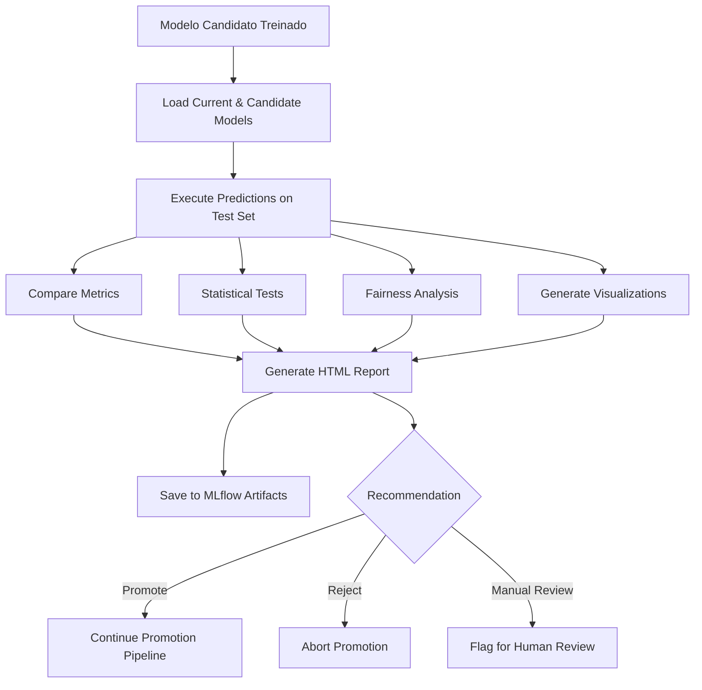

# Processo de Comparação de Modelos ML

## Visão Geral

O `ModelComparator` executa análises detalhadas entre modelo candidato e modelo atual em produção antes da promoção.

## Pipeline de Comparação



## Métricas Comparadas

### Classificação
- **Precision:** Proporção de predições positivas corretas
- **Recall:** Proporção de positivos reais identificados
- **F1 Score:** Média harmônica de precision e recall
- **Accuracy:** Proporção total de acertos

### Regressão
- **MAE (Mean Absolute Error):** Erro médio absoluto
- **RMSE (Root Mean Squared Error):** Raiz do erro quadrático médio
- **R² Score:** Coeficiente de determinação
- **MAE Percentage:** Erro percentual relativo à média

## Testes Estatísticos

### McNemar Test (Classificação)
- **Objetivo:** Testar se há diferença significativa entre modelos
- **Hipótese Nula:** Modelos têm performance equivalente
- **Threshold:** p-value < 0.05 para rejeitar H0
- **Interpretação:** Se significativo, um modelo é estatisticamente melhor

### Paired T-Test (Regressão)
- **Objetivo:** Comparar erros médios dos modelos
- **Hipótese Nula:** Erros têm mesma distribuição
- **Threshold:** p-value < 0.05 para rejeitar H0
- **Interpretação:** Se significativo, um modelo tem erros menores

## Análise de Fairness

Compara performance por grupos:
- **task_type:** api_call, computation, database_query, etc
- **domain:** internal, external, partner
- **security_level:** low, medium, high, critical

**Métrica:** Max Disparity Ratio
- Ratio entre melhor e pior grupo
- Threshold: < 2.0 (nenhum grupo tem erro 2x maior)

## Visualizações Geradas

1. **Confusion Matrix (Classificação)**
   - Comparação lado a lado
   - Identifica onde modelos diferem

2. **Error Distribution (Regressão)**
   - Histograma de erros
   - Mostra viés e variância

3. **Feature Importance Diff**
   - Top 20 features com maior mudança
   - Identifica shifts no modelo

4. **Prediction Scatter**
   - Atual vs Candidato
   - Identifica padrões de discordância

## Critérios de Recomendação

### Promote
- Métricas melhoram em >= 2%
- Testes estatísticos significativos a favor do candidato
- Fairness não piora (disparity ratio não aumenta)
- Confidence score >= 0.7

### Reject
- Métricas pioram em >= 5%
- Testes estatísticos significativos contra o candidato
- Fairness piora significativamente
- Confidence score < 0.3

### Manual Review
- Melhorias marginais (< 2%)
- Testes estatísticos não significativos
- Trade-offs entre métricas (ex: precision sobe, recall desce)
- Confidence score entre 0.3 e 0.7

## Uso

### Via ModelPromotionManager

```python
# Configurar promoção com comparação detalhada
config = PromotionConfig(
    enable_detailed_comparison=True,
    comparison_confidence_threshold=0.7
)

result = await promotion_manager.promote_model(
    model_name='duration_predictor',
    version='5',
    config_overrides={
        'enable_detailed_comparison': True
    }
)
```

### Standalone

```python
from ml.model_comparator import ModelComparator

comparator = ModelComparator(config, model_registry, mongodb_client, logger)

result = await comparator.compare_models(
    model_name='anomaly_detector',
    current_version='3',
    candidate_version='4',
    test_data=test_dataset
)

print(f"Recommendation: {result.recommendation}")
print(f"Confidence: {result.confidence_score}")
```

## Acesso ao Relatório HTML

Relatórios são salvos como artifacts MLflow:

```bash
# Via MLflow UI
http://mlflow:5000/experiments/{experiment_id}/runs/{run_id}/artifacts/model_comparison/

# Via API
curl http://mlflow:5000/api/2.0/mlflow-artifacts/artifacts/{run_id}/model_comparison/
```

## Estrutura do Test Dataset

O comparador espera encontrar test datasets no MongoDB na collection `model_test_datasets`:

```json
{
    "model_name": "duration_predictor",
    "X_test": [[...], [...], ...],
    "y_test": [100, 200, ...],
    "metadata": {
        "task_type": ["api_call", "computation", ...],
        "domain": ["internal", "external", ...],
        "security_level": ["low", "medium", ...]
    }
}
```

## Configuração

### PromotionConfig

| Parâmetro | Default | Descrição |
|-----------|---------|-----------|
| `enable_detailed_comparison` | `True` | Habilita comparação detalhada |
| `comparison_confidence_threshold` | `0.7` | Mínimo para promoção automática |

### Thresholds Internos

| Threshold | Valor | Descrição |
|-----------|-------|-----------|
| `improvement_threshold` | `0.02` | 2% melhoria mínima para recomendar promoção |
| `degradation_threshold` | `0.05` | 5% piora para recomendar rejeição |
| `fairness_disparity_max` | `2.0` | Ratio máximo de disparidade entre grupos |

## Métricas Prometheus

```
# Total de comparações por modelo e recomendação
neural_hive_model_comparison_total{model_name="...", recommendation="..."}

# Duração das comparações
neural_hive_model_comparison_duration_seconds{model_name="..."}

# Confidence score da última comparação
neural_hive_model_comparison_confidence{model_name="..."}
```

## Troubleshooting

### Test Dataset Não Encontrado
- Verificar collection `model_test_datasets` no MongoDB
- Garantir que dataset foi salvo durante treinamento
- Comparação prossegue sem bloquear se dataset não existir

### Visualizações Não Aparecem
- Verificar que matplotlib/seaborn estão instalados
- Verificar logs para erros de geração de imagens
- Visualizações são opcionais, falha não bloqueia comparação

### Comparação Muito Lenta
- Reduzir tamanho do test dataset (usar amostragem)
- Verificar tamanho dos modelos carregados
- Aumentar recursos de memória se necessário

### Modelo em Produção Não Encontrado
- Sem modelo em produção, comparação é ignorada
- Primeira versão de um modelo não passa por comparação
- Verificar stage 'Production' no MLflow

## Arquitetura

```
services/orchestrator-dynamic/src/ml/
├── model_comparator.py      # Classe ModelComparator
├── model_promotion.py       # Integração com promoção
└── templates/
    └── model_comparison_report.html  # Template HTML
```
