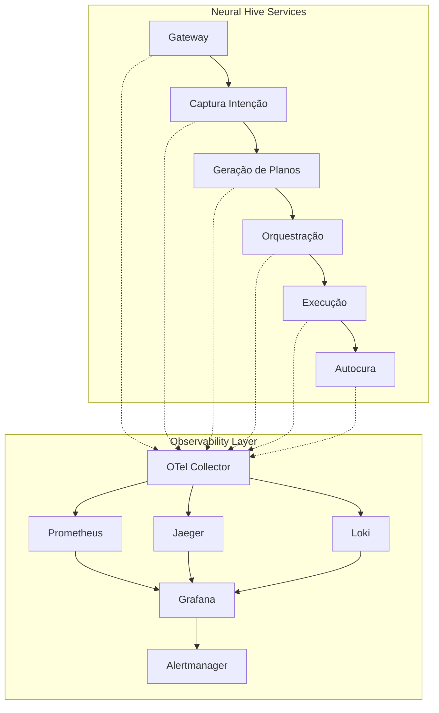

# Arquitetura de Observabilidade Neural Hive-Mind

## Visão Geral

A stack de observabilidade do Neural Hive-Mind implementa o modelo de observabilidade de três pilares (métricas, logs e traces) com correlação através de identificadores únicos `intent_id` e `plan_id`, garantindo rastreabilidade completa das operações através das camadas do sistema.

## Componentes Principais

### OpenTelemetry Collector
- **Função**: Agregador central de telemetria (métricas, traces e logs)
- **Deployment**: StatefulSet com persistência para buffering
- **Endpoints**:
  - OTLP gRPC: `:4317`
  - OTLP HTTP: `:4318`
  - Prometheus metrics: `:8888/metrics`
- **Processamento**:
  - Correlação automática via headers `X-Neural-Hive-Intent-ID` e `X-Neural-Hive-Plan-ID`
  - Tail sampling baseado em critérios de erro e valor de negócio
  - Exemplares para correlacionar métricas com traces



### Prometheus
- **Função**: Sistema de métricas time-series
- **Configuração**: Cluster HA com 2 réplicas e anti-affinity
- **Retenção**: 30 dias (90GB de storage)
- **Scraping**:
  - ServiceMonitors para pods com label `neural.hive/metrics: enabled`
  - PodMonitors para pods instrumentados OpenTelemetry
  - Intervalo: 30s para serviços, 15s para pods instrumentados

### Jaeger
- **Função**: Sistema de distributed tracing
- **Deployment**: All-in-one para staging, produção distribuída
- **Storage**: Elasticsearch para produção, in-memory para desenvolvimento
- **Sampling**: Estratégias baseadas em:
  - Taxa padrão: 10% para operações normais
  - 100% para operações com erro ou alta prioridade
  - Head sampling no cliente, tail sampling no Collector

### Grafana
- **Função**: Visualização e dashboards
- **Deployment**: HA com 2 réplicas
- **Autenticação**: Admin via Kubernetes Secret
- **Data Sources**:
  - Prometheus (padrão) com exemplares habilitados
  - Jaeger com correlação para logs via Loki
  - Loki (opcional) para agregação de logs

### Alertmanager
- **Função**: Gerenciamento e routing de alertas
- **Configuração**: 3 réplicas para HA
- **Routing**: Por camada arquitetural e criticidade
- **Canais**: Slack específico por equipe/camada

## Modelo de Correlação

### Headers de Correlação
```
X-Neural-Hive-Intent-ID: uuid4    # Identificador da intenção do usuário
X-Neural-Hive-Plan-ID: uuid4      # Identificador do plano gerado
X-Neural-Hive-Domain: string      # Domínio de negócio
X-Neural-Hive-User-ID: string     # Identificador do usuário
```

### Fluxo de Correlação
1. **Fluxo A - Captura**: Intent-ID criado no gateway
2. **Fluxo B - Geração**: Plan-ID associado ao Intent-ID
3. **Fluxo C - Orquestração**: Plan-ID propagado para execução
4. **Fluxo D - Observabilidade**: Correlação automática em telemetria
5. **Fluxo E - Autocura**: Rastreamento de incidentes por Intent/Plan-ID

### Baggage OpenTelemetry
```yaml
baggage_keys:
  - neural.hive.intent_id
  - neural.hive.plan_id
  - neural.hive.domain
  - neural.hive.user_id
  - neural.hive.high_value
```

## Topologia de Ambiente

### Namespaces
- `observability`: Stack completa de observabilidade
- `neural-hive`: Serviços principais do sistema
- `gateway`: API Gateway e ingress
- `istio-system`: Service mesh para telemetria automática

### Integração com Istio
- **Automatic telemetry injection**: Métricas de rede e latência
- **Distributed tracing**: Propagação automática de trace context
- **Access logs**: Formato estruturado com correlação IDs

### Storage Classes
- **Prometheus**: `gp3` com 100Gi, IOPS 3000
- **Grafana**: `gp3` com 10Gi para dashboards persistentes
- **Jaeger**: `gp3` com retenção configurável por ambiente

## Referências aos Fluxos Operacionais

### Documento-06 (Fluxo D - Observabilidade)
- Implementação de correlação de telemetria
- Definição de SLOs por camada arquitetural
- Estratégias de sampling e exemplares

### Documento-07 (SLOs e Governança)
- SLOs críticos: Latência <150ms, Disponibilidade >99.9%
- Error budgets e burn rates
- Processo de revisão e ajuste de thresholds

## Configurações de Segurança

### Pod Security
- SecurityContext não-root para todos os componentes
- NetworkPolicies restritivas por namespace
- RBAC granular para ServiceAccounts

### Dados Sensíveis
- Credenciais via Kubernetes Secrets
- TLS entre componentes
- Sanitização de logs para evitar vazamento de dados

## Configurações por Ambiente

| Componente | Development | Staging | Production |
|------------|-------------|---------|------------|
| Prometheus | 7d/20Gi | 15d/50Gi | 30d/100Gi |
| Grafana | 1 replica | 1 replica | 2 replicas |
| Alertmanager | 1 replica | 2 replicas | 3 replicas |
| Jaeger Sampling | 100% | 50% | 10% (head) |

## Monitoramento da Stack

### Métricas Próprias
- `up{neural_hive_component="telemetry-collector"}`: Status do OTel Collector
- `prometheus_tsdb_head_samples_appended_total`: Ingestão de métricas
- `jaeger_spans_received_total`: Spans recebidos pelo Jaeger
- `grafana_api_response_time_seconds`: Performance do Grafana

### Alertas de Infraestrutura
- Componentes down > 5 minutos
- Uso de disco > 85%
- Memory pressure nos coletores
- Taxa de erro na ingestão > 1%

## Roadmap Técnico

### Q1 2024
- [ ] Implementação de Exemplars completo
- [ ] Otimização de tail sampling
- [ ] Dashboards específicos por fluxo

### Q2 2024
- [ ] Integração com Loki para logs centralizados
- [ ] Alertas preditivos baseados em ML
- [ ] Backup automatizado de configurações

### Q3 2024
- [ ] Migration para Thanos para long-term storage
- [ ] Implementação de chaos testing observability
- [ ] Métricas de cost attribution por domínio