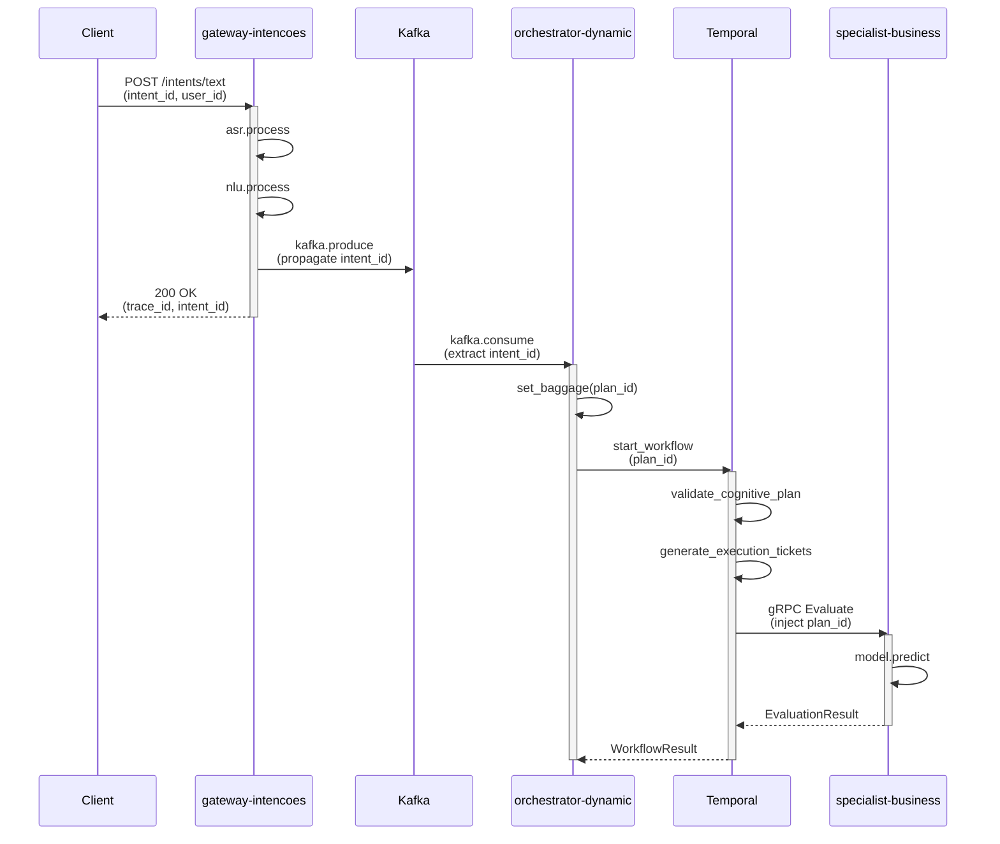

# Jaeger Troubleshooting Guide - Neural Hive

## Queries Úteis no Jaeger UI

### Buscar por Intent ID
```
Service: *
Tags: neural.hive.intent.id=<intent-id>
Lookback: 1h
```

### Buscar por Plan ID
```
Service: *
Tags: neural.hive.plan.id=<plan-id>
Lookback: 1h
```

### Buscar por User ID
```
Service: *
Tags: neural.hive.user.id=<user-id>
Lookback: 24h
```

### Buscar traces com erro
```
Service: *
Tags: error=true
Lookback: 1h
```

### Buscar traces lentos (>1s)
```
Service: gateway-intencoes
Min Duration: 1s
Lookback: 1h
```

### Buscar por domínio Neural Hive
```
Service: *
Tags: neural.hive.domain=<domain>
Lookback: 1h
```

## Queries via API

### Buscar traces por intent_id
```bash
curl "http://jaeger-query:16686/api/traces?service=gateway-intencoes&tag=neural.hive.intent.id:<intent-id>&limit=10" | jq
```

### Buscar serviços disponíveis
```bash
curl "http://jaeger-query:16686/api/services" | jq
```

### Buscar operações de um serviço
```bash
curl "http://jaeger-query:16686/api/services/gateway-intencoes/operations" | jq
```

### Obter trace específico
```bash
curl "http://jaeger-query:16686/api/traces/<trace-id>" | jq
```

## Queries Avançadas para Neural Hive

### 1. Buscar traces por fluxo completo (intent → plan → execution)

```
Service: gateway-intencoes
Tags: neural.hive.intent.id=<intent-id>
Lookback: 1h
Min Duration: 100ms
Max Duration: 30s
Limit: 50
```

**Uso:** Retorna todos os traces iniciados no gateway para uma intenção específica. Útil para debug de fluxos lentos ou com falhas, permitindo rastrear a jornada completa de uma intenção através do sistema.

### 2. Correlacionar traces entre serviços via plan_id

```bash
# Via API - buscar todos os serviços que processaram um plano
curl "http://jaeger-query:16686/api/traces?tag=neural.hive.plan.id:<plan-id>&limit=100" | \
  jq '.data[].processes | to_entries[] | .value.serviceName' | sort -u
```

**Uso:** Identifica quais serviços participaram da execução de um plano específico. Útil para mapear dependências entre serviços e identificar gargalos no pipeline de processamento.

### 3. Buscar traces com alta latência por domínio

```
Service: *
Tags: neural.hive.domain=<domain>
Min Duration: 5s
Lookback: 24h
```

Domínios disponíveis: `experiencia`, `cognicao`, `execucao`, `business`, `technical`, `architecture`, `behavior`, `evolution`

**Uso:** Identifica operações lentas em um domínio específico. Útil para otimização de performance focada em áreas problemáticas.

### 4. Buscar traces com falhas em specialists

```
Service: specialist-*
Tags: error=true
Operation: Evaluate
Lookback: 1h
```

**Uso:** Detecta falhas em chamadas gRPC para specialists. Útil para troubleshooting de modelos ML, timeouts de inferência, ou problemas de conectividade.

### 5. Buscar traces com sampling forçado (high-value users)

```
Service: *
Tags: neural.hive.user.tier=premium
Lookback: 1h
```

**Uso:** Filtra traces de usuários premium (sempre amostrados a 100%). Útil para análise detalhada da experiência de clientes críticos.

### 6. Buscar traces de workflows Temporal

```
Service: orchestrator-dynamic
Tags: temporal.workflow.type=orchestration_workflow
Min Duration: 1s
Lookback: 2h
```

**Uso:** Monitora execuções de workflows Temporal, identificando execuções lentas ou com problemas.

## Padrões de Tracing Neural Hive

### Diagrama de Fluxo de Spans



### Descrição das Fases

| Fase | Serviço | Spans Típicos | Atributos Chave |
|------|---------|---------------|-----------------|
| **Entrada** | gateway-intencoes | `POST /intents/text`, `asr.process`, `nlu.process` | `neural.hive.intent.id`, `http.method` |
| **Mensageria** | gateway-intencoes | `kafka.produce` | `messaging.kafka.topic`, `messaging.kafka.partition` |
| **Orquestração** | orchestrator-dynamic | `kafka.consume`, `orchestration_workflow.run` | `neural.hive.plan.id`, `temporal.workflow.id` |
| **Planejamento** | orchestrator-dynamic | `generate_execution_tickets`, `allocate_resources` | `neural.hive.tickets.count` |
| **Avaliação** | specialist-* | `Evaluate`, `model.predict` | `rpc.service`, `neural.hive.specialist.type` |

### Checkpoints de Validação (C1-C6)

O sistema Neural Hive implementa 6 checkpoints de validação no fluxo:

- **C1**: Entrada validada no gateway (intent capturado)
- **C2**: Plan cognitivo gerado pelo orchestrator
- **C3**: Tickets de execução criados
- **C4**: Recursos alocados para execução
- **C5**: Specialists consultados e opiniões obtidas
- **C6**: Resultado consolidado e retornado

Cada checkpoint adiciona atributos específicos aos spans:
```
neural.hive.checkpoint = "C1" | "C2" | ... | "C6"
neural.hive.checkpoint.status = "passed" | "failed"
```

## Troubleshooting Avançado

### Problema: intent_id não aparece em spans do orchestrator

**Sintoma:** Traces no gateway têm `neural.hive.intent.id`, mas spans do orchestrator não.

**Diagnóstico:**
```bash
# Verificar headers Kafka no consumer
kubectl logs -n neural-hive deployment/orchestrator-dynamic | \
  grep "x-neural-hive-intent-id" | tail -20

# Verificar se o consumer está extraindo headers
kubectl logs -n neural-hive deployment/orchestrator-dynamic | \
  grep -E "(extract_context|baggage)" | tail -20
```

**Causa Provável:** Headers Kafka não estão sendo extraídos ou baggage não está sendo configurado.

**Solução:**
1. Confirmar que `instrument_kafka_consumer()` está aplicado no consumer
2. Verificar que `extract_context_from_headers()` é chamado antes de `set_baggage()`
3. Validar configuração do OTEL processor `baggage/span` no pipeline

### Problema: Traces fragmentados (spans não conectados)

**Sintoma:** Spans aparecem no Jaeger mas não formam uma árvore conectada.

**Diagnóstico:**
```bash
# Injetar trace e verificar propagação
curl -H "traceparent: 00-$(openssl rand -hex 16)-$(openssl rand -hex 8)-01" \
     -H "Content-Type: application/json" \
     -d '{"text":"test intent"}' \
     http://gateway-intencoes:8000/intents/text

# Verificar se o trace_id é propagado
kubectl logs -n neural-hive deployment/gateway-intencoes | \
  grep -E "traceparent|trace_id" | tail -20
```

**Causa Provável:** Context não está sendo propagado entre serviços (Kafka headers, gRPC metadata).

**Solução:**
1. Garantir `inject_context_to_headers()` é chamado antes de publicar no Kafka
2. Garantir `inject_context_to_metadata()` é chamado antes de chamadas gRPC
3. Verificar middleware OTEL está configurado em todos os serviços

### Problema: Sampling descartando traces importantes

**Sintoma:** Traces com `neural.hive.intent.id` não aparecem consistentemente.

**Diagnóstico:**
```bash
# Verificar métricas de tail sampling no OTEL Collector
kubectl exec -n observability deployment/neural-hive-otel-collector -- \
  curl -s http://localhost:8888/metrics | \
  grep "otelcol_processor_tail_sampling"

# Verificar política específica para intent traces
kubectl exec -n observability deployment/neural-hive-otel-collector -- \
  curl -s http://localhost:8888/metrics | \
  grep "neural_hive_intent_traces"
```

**Solução:**
1. Aumentar `sampling_percentage` para policy `neural_hive_intent_traces` de 70% para 90%
2. Configuração em `helm-charts/otel-collector/values.yaml` (linha ~180)
3. Verificar `decision_wait` não está muito baixo (mínimo 10s recomendado)

### Problema: Atributos Neural Hive ausentes em spans

**Sintoma:** Spans existem mas não têm atributos `neural.hive.*`

**Diagnóstico:**
```bash
# Verificar se o processor attributes/neural_hive está ativo
kubectl get configmap -n observability neural-hive-otel-collector -o yaml | \
  grep -A 20 "attributes/neural_hive"

# Verificar se baggage está sendo convertido para attributes
kubectl exec -n observability deployment/neural-hive-otel-collector -- \
  curl -s http://localhost:55679/debug/tracez | grep "neural.hive"
```

**Solução:**
1. Verificar processor `attributes/neural_hive` está no pipeline antes do exporter
2. Verificar processor `baggage/span` está extraindo baggage para span attributes
3. Validar serviços estão usando `set_baggage()` para definir contexto

### Problema: Alta latência nas queries do Jaeger

**Sintoma:** Queries no Jaeger UI ou API demoram > 10s

**Diagnóstico:**
```bash
# Verificar tamanho dos índices Elasticsearch
kubectl exec -n observability deployment/jaeger-collector -- \
  curl -s http://elasticsearch:9200/_cat/indices/neural-hive-jaeger-* | \
  sort -k3 -rn | head -10

# Verificar métricas de query
kubectl logs -n observability -l app.kubernetes.io/component=query | \
  grep "query.*took" | tail -20
```

**Solução:**
1. Reduzir `Lookback` nas queries (usar 1h ao invés de 24h)
2. Adicionar mais filtros específicos (service, operation, tags)
3. Configurar ILM (Index Lifecycle Management) no Elasticsearch
4. Considerar archive storage para traces > 72h

## Troubleshooting Comum

### Problema: Traces não aparecem no Jaeger

**Diagnóstico:**
```bash
# 1. Verificar OTEL Collector está exportando
kubectl exec -n observability deployment/neural-hive-otel-collector -- \
  curl -s http://localhost:8888/metrics | grep otelcol_exporter_sent_spans

# 2. Verificar Jaeger Collector está recebendo
kubectl exec -n observability deployment/jaeger-collector -- \
  curl -s http://localhost:14269/metrics | grep jaeger_collector_spans_received_total

# 3. Verificar Elasticsearch está indexando
kubectl exec -n observability deployment/jaeger-collector -- \
  curl -s http://elasticsearch:9200/neural-hive-jaeger-*/_count | jq
```

**Soluções:**
- Se OTEL não exporta: verificar tail sampling não está descartando tudo (aumentar taxa para intent_id)
- Se Jaeger não recebe: verificar conectividade OTEL → Jaeger (porta 14250/4317)
- Se ES não indexa: verificar Jaeger Collector logs para erros de ES

### Problema: Atributos Neural Hive não aparecem

**Diagnóstico:**
```bash
# Verificar OTEL Collector está extraindo atributos
kubectl logs -n observability -l app.kubernetes.io/name=neural-hive-otel-collector | grep "attributes/neural_hive"

# Verificar baggage está sendo propagado
kubectl exec -n observability deployment/neural-hive-otel-collector -- \
  curl -s http://localhost:55679/debug/tracez | grep "neural.hive"
```

**Soluções:**
- Verificar serviços estão enviando headers `x-neural-hive-intent-id`, etc.
- Verificar `baggage/span` processor está antes de `attributes/neural_hive` no pipeline
- Verificar `neural_hive_observability` library está configurada corretamente nos serviços

### Problema: Sampling descartando traces importantes

**Diagnóstico:**
```bash
# Verificar métricas de tail sampling
kubectl exec -n observability deployment/neural-hive-otel-collector -- \
  curl -s http://localhost:8888/metrics | grep otelcol_processor_tail_sampling

# Verificar sampling strategies do Jaeger
kubectl port-forward -n observability svc/jaeger-collector 5778:5778 &
curl -s http://localhost:5778/sampling?service=gateway-intencoes | jq
kill %1
```

**Soluções:**
- Aumentar `sampling_percentage` para policies `neural_hive_intent_traces` e `neural_hive_plan_traces`
- Adicionar policy específica para operações críticas com 100% sampling
- Reduzir `decision_wait` de 30s para 15s se traces estão sendo descartados por timeout

### Problema: Alta latência no Jaeger Query

**Diagnóstico:**
```bash
# Verificar índices Elasticsearch
kubectl exec -n observability deployment/jaeger-collector -- \
  curl -s http://elasticsearch:9200/_cat/indices/neural-hive-jaeger-* | sort -k3 -rn

# Verificar query performance
kubectl logs -n observability -l app.kubernetes.io/component=query | grep "query.*took"
```

**Soluções:**
- Reduzir `Lookback` nas queries (usar 1h ao invés de 24h)
- Adicionar mais filtros (service, operation, tags)
- Verificar Elasticsearch tem recursos suficientes
- Considerar archive storage para traces antigos (>72h)

## Métricas Importantes

### OTEL Collector
```
otelcol_receiver_accepted_spans{receiver="otlp"}
otelcol_processor_tail_sampling_sampling_decision_latency_bucket
otelcol_exporter_sent_spans{exporter="jaeger"}
otelcol_exporter_send_failed_spans{exporter="jaeger"}
```

### Jaeger Collector
```
jaeger_collector_spans_received_total
jaeger_collector_spans_saved_by_svc_total
jaeger_collector_queue_length
jaeger_collector_batch_size_bucket
```

### Jaeger Query
```
jaeger_query_requests_total
jaeger_query_latency_bucket
```

## Comandos Úteis

### Port-forward Jaeger UI
```bash
kubectl port-forward -n observability svc/jaeger-query 16686:16686
# Acessar http://localhost:16686
```

### Port-forward OTEL Collector zpages
```bash
kubectl port-forward -n observability svc/neural-hive-otel-collector 55679:55679
# Acessar http://localhost:55679/debug/tracez
```

### Verificar logs de erro
```bash
# OTEL Collector
kubectl logs -n observability -l app.kubernetes.io/name=neural-hive-otel-collector --tail=200 | grep -i error

# Jaeger Collector
kubectl logs -n observability -l app.kubernetes.io/component=collector --tail=200 | grep -i error

# Jaeger Query
kubectl logs -n observability -l app.kubernetes.io/component=query --tail=200 | grep -i error
```

### Reiniciar componentes
```bash
# OTEL Collector
kubectl rollout restart deployment -n observability neural-hive-otel-collector

# Jaeger Collector
kubectl rollout restart deployment -n observability jaeger-collector

# Jaeger Query
kubectl rollout restart deployment -n observability jaeger-query
```
