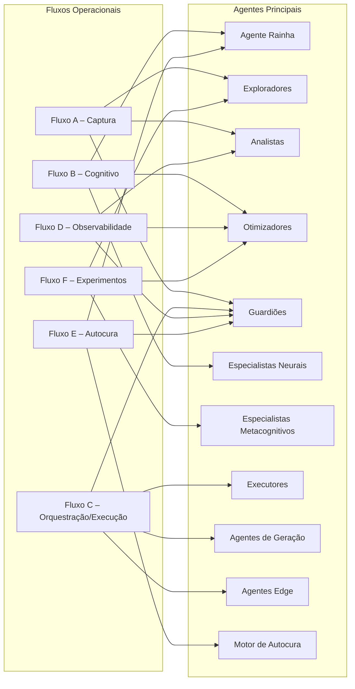
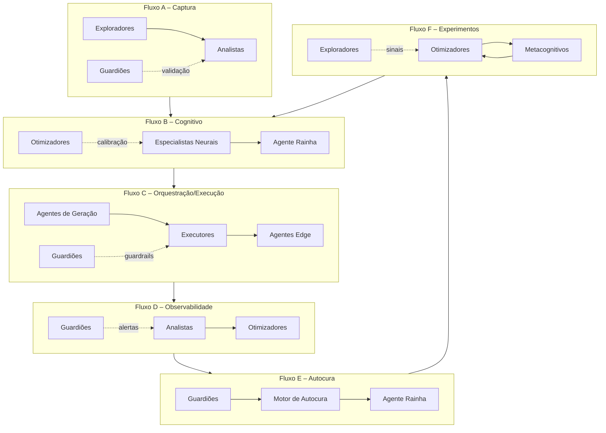

# Catálogo de Agentes do Neural Hive-Mind

## Visão Geral
- Consolida a governança sobre os agentes que compõem o ecossistema Neural Hive-Mind e como se relacionam com pipelines de intenção→valor.
- Aprofundamentos técnicos e operacionais estão organizados por camada funcional nos documentos listados abaixo.
- Este índice mantém visão transversal (métricas, fluxos, dependências) para facilitar navegação e governança integrada.
- **Nota sobre a natureza dos agentes**: cada grupo é projetado como componente híbrido — combina modelos de IA (LLMs, heurísticas swarm, modelos preditivos, embeddings) com automações determinísticas, regras simbólicas e integrações DevSecOps (workflows Temporal/Argo, OPA, observabilidade). Portanto, não se trata apenas de agentes baseados em prompt; há sempre acoplamento com pipelines, políticas e ferramentas operacionais para garantir decisões auditáveis.

## Documentos por Camada Funcional
- [Camada Estratégica e Coordenação](./agentes/camada-estrategica.md) — Agente Rainha, Analistas, Otimizadores.
- [Camada de Exploração e Aprendizado](./agentes/camada-exploracao.md) — Exploradores, Mecanismo de Feromônios Digitais.
- [Camada Cognitiva](./agentes/camada-cognitiva.md) — Especialistas Neurais, Especialistas Metacognitivos (roadmap).
- [Camada Executiva](./agentes/camada-executiva.md) — Executores, Agentes de Geração Neurais, Agentes Edge.
- [Camada de Resiliência e Segurança](./agentes/camada-resiliencia.md) — Guardiões, Motor de Autocura e Runbooks Automatizados.

## Visão Resumida dos Agentes

| Camada | Agente | Papel-chave |
| --- | --- | --- |
| Estratégica | Agente Rainha | Coordenação estratégica, priorização e guarda de guardrails éticos |
| Estratégica | Analistas | Conversão de dados multi-fonte em insights acionáveis |
| Estratégica | Otimizadores | Melhoria contínua de pesos, SLOs e políticas |
| Exploração | Exploradores | Descoberta de sinais emergentes em core/edge |
| Exploração | Feromônios Digitais | Memória viva de trilhas, sucessos e alertas |
| Cognitiva | Especialistas Neurais | Avaliação multidomínio com consenso auditável |
| Cognitiva | Especialistas Metacognitivos (roadmap) | Ajuste adaptativo do consenso e detecção de drift |
| Executiva | Executores | Orquestração de tickets e QoS |
| Executiva | Agentes de Geração | Síntese automática de código/IaC/políticas |
| Executiva | Agentes Edge | Execução distribuída offline-first |
| Resiliência | Guardiões | Detecção de ameaças e enforcement |
| Resiliência | Motor de Autocura | Execução de playbooks e restauração de SLAs |

## Métricas e Telemetria por Agente

| Agente | Métricas recomendadas | Telemetria/traces | Alertas orientativos |
| --- | --- | --- | --- |
| Agente Rainha | % de replanejamentos, cadência de decisões, decisão vs execução | Spans `intent_id/plan_id` com `decision_scope` | Divergência decisão vs execução > 8%; backlog estratégico saturado |
| Exploradores | Taxa de descobertas validadas, cobertura de domínios, latência feromônios | Logs `exploration_domain`, traces edge→core | Volume de feromônios inválidos > threshold; ausência de sinais recentes |
| Analistas | Precisão vs decisões finais, tempo de resposta, ratio sinal/insight | Spans `analysis_id`, dashboards Grafana multi-fonte | Insights não consumidos > X h; discrepância previsões vs resultados |
| Otimizadores | Impacto em lead time, redução de retrabalho, effectiveness pós-ajuste | Eventos `optimization.applied`, métricas de experimentos | Ajuste com regressão de KPI; múltiplas mudanças simultâneas |
| Guardiões | MTTD, % incidentes autocorrigidos, falsos positivos | Logs `incident_id`, traces Autocura, Alertmanager | Falhas repetidas no mesmo playbook; incidentes não mitigados |
| Especialistas Neurais | Precisão por domínio, divergência média, tempo de parecer | Spans `specialist_type`, métricas `neural_hive_intent_confidence` | Score médio <0,8; fallback heurístico >3% |
| Especialistas Metacognitivos | Tempo detecção drift, sucesso de recalibração, alertas confirmados | Eventos `metacognition.alert`, dashboards divergência | Recomendações rejeitadas em sequência; ausência de análise > SLA |
| Executores | SLA cumprido, retries, eficiência de recursos | Spans `ticket_id`, métricas `neural_hive_execution_*` | Backlog > threshold, retries em cascata, saturação |
| Agentes de Geração | Aprovação sem edição, cobertura testes gerados, tempo de síntese | Logs de MR automáticos, métricas Code Forge | MRs reprovados consecutivamente; confiança < limite |
| Agentes Edge | Disponibilidade, sucesso de sincronização, latência offline→core | Traces com `edge_node_id`, métricas MQTT/gRPC | Falha em aplicação de patch; ausência heartbeat > SLA |

## Participação dos Agentes por Fluxo Operacional

| Fluxo (Documento 06) | Principais agentes envolvidos | Responsabilidade | Interações críticas |
| --- | --- | --- | --- |
| Fluxo A – Captura | Exploradores, Analistas, Guardiões | Detectar intenções, validar segurança inicial | Feromônios digitais → Analistas; Guardiões filtram anomalias |
| Fluxo B – Cognitivo | Especialistas neurais, Otimizadores, Rainha | Gerar planos, consolidar consenso, priorizar | Otimizadores ajustam pesos; Rainha aprova priorização |
| Fluxo C – Orquestração/Execução | Executores, Agentes de Geração, Agentes Edge, Guardiões | Transformar planos em tickets e entregas | Guardiões monitoram QoS; Edge sincroniza operações locais |
| Fluxo D – Observabilidade | Analistas, Otimizadores, Guardiões | Correlacionar telemetria, detectar desvios | Analistas alimentam dashboards; Guardiões disparam alertas |
| Fluxo E – Autocura | Guardiões, Motor de Autocura, Rainha | Executar playbooks e restaurar serviço | Autocura gera feromônios pós-incident; Rainha atualiza prioridades |
| Fluxo F – Experimentos | Otimizadores, Especialistas Metacognitivos, Exploradores | Propor, executar e avaliar experimentos | Resultados alimentam consenso cognitivo; Exploradores coletam sinais |

### Diagramas de Participação por Fluxo

## Interações e Dependências Críticas
- Memória Neural Multicamadas alimenta Especialistas, Analistas e Otimizadores; inconsistências afetam decisões do enxame.
- Ledger cognitivo e de auditoria registra ações da Rainha, pareceres dos especialistas e execuções de Autocura, garantindo rastreabilidade.
- Service Mesh + OPA fornecem guardrails transversais para Guardiões, Executores e Agentes de Geração.
- Telemetria OpenTelemetry conecta todos os agentes à observabilidade central, sustentando feedback contínuo e feromônios sincronizados.
- Motor de Experimentos é a ponte entre Otimizadores, Metacognitivos e Rainha para incorporar melhorias sem comprometer SLOs.

## Referências
- `documento-03-componentes-e-processos-neural-hive-mind.md`
- `docs/observability/services/geracao-planos.md`
- `docs/observability/services/orquestracao.md`
- `docs/observability/services/execucao.md`
- `docs/observability/services/autocura.md`
- `docs/observability/architecture.md`
