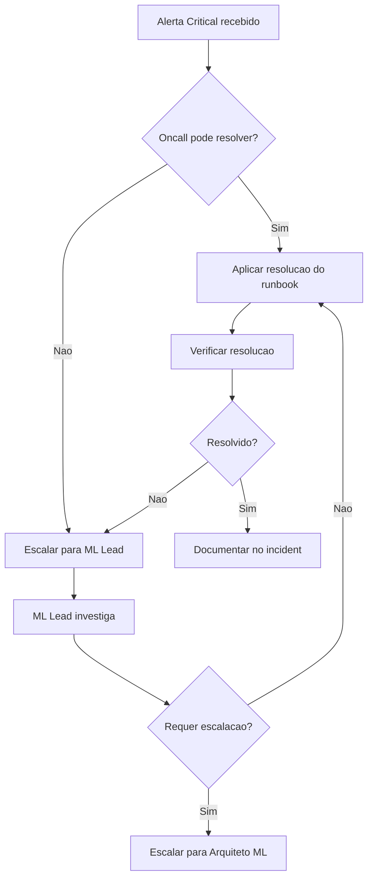

# Guia de Gerenciamento de Alertas ML

Este documento fornece instrucoes operacionais para gerenciamento de alertas de Machine Learning no Neural Hive Mind.

---

## 1. Visao Geral

### Proposito

O sistema de alertas ML monitora a saude e performance dos modelos de Machine Learning, detectando:
- Drift de features e predicoes
- Degradacao de performance (F1 Score, latencia)
- Falhas em retreinamento automatico
- Violacoes de SLO

### Arquitetura de Alerting

```
Prometheus (regras ML) --> Alertmanager --> Slack/PagerDuty --> Oncall Engineer
     |                         |                                      |
     v                         v                                      v
prometheus-rules/         ml-slack-config.yaml                   Runbooks
ml-drift-alerts.yaml      ml-message-template.tmpl               (docs/runbooks/)
ml-slo-alerts.yaml
```

### Canais de Notificacao

| Canal | Proposito |
|-------|-----------|
| #ml-alerts | Alertas criticos e warnings ML |
| #ml-alerts-general | Alertas nao categorizados (fallback) |
| PagerDuty | Alertas criticos (notificacao 24/7) |

---

## 2. Severidades e Routing

### Niveis de Severidade

| Severidade | Descricao | Acao Esperada | Tempo de Resposta |
|------------|-----------|---------------|-------------------|
| **Critical** | Impacto imediato em producao | Acao imediata requerida | < 5 min |
| **Warning** | Degradacao detectada | Investigacao necessaria | < 30 min |
| **Info** | Informativo apenas | Nenhuma acao requerida | N/A |

### Tabela de Routing

| Severidade | Canal Slack | Mention | PagerDuty | Repeat Interval |
|------------|-------------|---------|-----------|-----------------|
| Critical | #ml-alerts | @ml-oncall | Sim | 1h |
| Warning | #ml-alerts | Nao | Nao | 4h |
| Info | Silenciado | N/A | Nao | N/A |

### Alertas por Categoria

**Drift de Modelos:**
- `MLDriftCritical` - Drift critico detectado (critical)
- `MLDriftWarning` - Drift moderado detectado (warning)
- `MLFeatureDriftHigh` - PSI de features acima do threshold (warning)
- `MLPredictionDriftCritical` - Degradacao de predicoes > 50% (critical)
- `MLTargetDriftDetected` - Target drift significativo (warning)

**Performance de Modelos:**
- `MLModelDegraded` - Modelo com performance degradada (warning)
- `MLModelLowPerformance` - Score de performance baixo (warning)
- `MLModelLowF1Score` - F1 score abaixo do threshold (warning)

**Retreinamento Automatico:**
- `AutoRetrainFailed` - Retreinamento falhou (warning)
- `AutoRetrainLongDuration` - Retreinamento demorado (warning)
- `NoRetrainWithDrift` - Drift sem retreinamento recente (warning)

**SLOs:**
- `MLModelF1ScoreSLOBreach/Critical` - Violacao de SLO F1 (warning/critical)
- `MLModelLatencySLOBreach/Critical` - Violacao de SLO latencia (warning/critical)
- `MLModelFeedbackRateSLOBreach/Critical` - Violacao de SLO feedback (warning/critical)
- `MLModelUptimeSLOBreach/Critical` - Violacao de SLO uptime (warning/critical)

---

## 3. Como Silenciar Alertas

### Via Alertmanager UI

```bash
# Port-forward para Alertmanager
kubectl port-forward -n monitoring svc/alertmanager 9093:9093

# Acessar http://localhost:9093
# Clicar em "Silences" -> "New Silence"
# Preencher matchers (ex: alertname=MLDriftCritical, specialist_type=technical)
# Definir duracao e comentario
```

### Via amtool CLI

```bash
# Criar silence para alertas de retraining
kubectl exec -n monitoring alertmanager-0 -- amtool silence add \
  alertname=~"AutoRetrain.*" \
  --duration=2h \
  --comment="Manutencao programada de retraining" \
  --author="$(whoami)"

# Silence por specialist especifico
kubectl exec -n monitoring alertmanager-0 -- amtool silence add \
  alertname=~"ML.*" \
  specialist_type="technical" \
  --duration=1h \
  --comment="Deploy de novo modelo technical specialist" \
  --author="ml-team"

# Listar silences ativos
kubectl exec -n monitoring alertmanager-0 -- amtool silence query

# Expirar silence
kubectl exec -n monitoring alertmanager-0 -- amtool silence expire <silence-id>
```

### Via Slack (Botao "Silence")

1. Clicar no botao "Silence" na mensagem do alerta
2. Sera redirecionado para Alertmanager UI com matchers pre-preenchidos
3. Ajustar duracao e adicionar comentario
4. Confirmar criacao do silence

### Boas Praticas de Silencing

- **Sempre** adicionar comentario explicativo
- Usar duracao minima necessaria (nao silenciar por dias)
- Silenciar por matchers especificos (nao usar `alertname=~".*"`)
- Documentar silences em canal #ml-ops
- Revisar silences ativos regularmente

---

## 4. Como Escalar Alertas

### Fluxo de Escalacao



### Contatos de Escalacao

| Nivel | Responsavel | Canal | Horario |
|-------|-------------|-------|---------|
| L1 | Oncall SRE | @ml-oncall | 24/7 |
| L2 | ML Lead | @ml-lead | Business hours |
| L3 | Arquiteto ML | @ml-architect | On-demand |

### Quando Escalar

- Alerta critico nao resolvido em 30 minutos
- Runbook nao aplicavel ou incompleto
- Degradacao severa (F1 < 0.65, uptime < 95%)
- Multiplos specialists afetados simultaneamente

### Como Escalar

```bash
# Via Slack
/incident create severity=high title="ML Model Degradation - Multiple Specialists"

# Via PagerDuty (se configurado)
# Alertas criticos ja escalam automaticamente
```

---

## 5. Como Resolver Alertas

### Processo de Resolucao

1. **Acknowledge:** Confirmar recebimento do alerta (PagerDuty ou Slack thread)
2. **Diagnose:** Seguir runbook especifico (link na mensagem do alerta)
3. **Resolve:** Aplicar correcao (comandos fornecidos no runbook)
4. **Verify:** Confirmar que alerta foi resolvido (status no Alertmanager)
5. **Document:** Adicionar comentario no incident ou thread Slack

### Comandos de Verificacao

```bash
# Verificar se alerta ainda esta ativo
kubectl exec -n monitoring alertmanager-0 -- amtool alert query \
  alertname="MLDriftCritical"

# Verificar metrica no Prometheus
curl -s "http://prometheus.monitoring:9090/api/v1/query?query=orchestration_ml_drift_overall_status" | jq '.data.result[0].value[1]'

# Verificar logs recentes
kubectl logs -n neural-hive-orchestration -l app=orchestrator-dynamic --tail=50 | grep -i drift
```

### Resolucao Manual (Forcar Resolved)

```bash
# Apenas se alerta esta stuck (metrica ja voltou ao normal mas alerta nao resolveu)
kubectl exec -n monitoring alertmanager-0 -- amtool silence add \
  alertname="MLDriftCritical" \
  --duration=5m \
  --comment="Forcar resolved - metrica ja normalizada" \
  --author="$(whoami)"
```

---

## 6. Manutencoes Programadas

### Intervalos de Silenciamento Automatico (mute_time_intervals)

O sistema possui intervalos de silenciamento pre-configurados para manutencoes programadas:

| Intervalo | Descricao | Horario |
|-----------|-----------|---------|
| `ml-maintenance` | Manutencao padrao semanal | Domingos 02:00-06:00 UTC |
| `ml-emergency-maintenance` | Manutencao emergencial (desabilitado por padrao) | Manual |

**Comportamento:**
- Durante os intervalos configurados, alertas ML sao automaticamente silenciados
- Silences manuais (via amtool/UI) sempre tem precedencia sobre time_intervals
- Para ativar manutencao emergencial, editar o ConfigMap e ajustar os horarios

**Rotas com mute_time_intervals:**
- Catch-all routes para `neural_hive_component: ml-models|feedback-loop|auto-retrain`

### Sobrepor Intervalos Manualmente

```bash
# Criar silence manual que sobrepoe time_intervals
kubectl exec -n monitoring alertmanager-0 -- amtool silence add \
  alertname=~"ML.*" \
  --duration=4h \
  --comment="Manutencao emergencial - deploy de hotfix" \
  --author="$(whoami)"

# Verificar silences ativos (inclui time_intervals)
kubectl exec -n monitoring alertmanager-0 -- amtool silence query
```

### Checklist Pre-Manutencao

- [ ] Verificar se janela de manutencao coincide com `ml-maintenance` interval
- [ ] Se nao, criar silence manual para alertas afetados (com duracao estimada + 30min buffer)
- [ ] Notificar em #ml-ops sobre janela de manutencao
- [ ] Documentar em calendar compartilhado
- [ ] Configurar monitoring extra durante manutencao

### Exemplo: Manutencao de Retraining

```bash
# 1. Criar silence (2h de duracao)
kubectl exec -n monitoring alertmanager-0 -- amtool silence add \
  alertname=~"AutoRetrain.*|MLDrift.*" \
  --duration=2h \
  --comment="Manutencao: Retraining de todos os specialists" \
  --author="ml-team"

# 2. Executar retraining
kubectl exec -n neural-hive-orchestration deployment/orchestrator-dynamic -- \
  python ml_pipelines/monitoring/auto_retrain.py --specialist-type all --force

# 3. Monitorar progresso
kubectl logs -n neural-hive-orchestration -l app=orchestrator-dynamic -f | grep retrain

# 4. Verificar que silence expira automaticamente apos 2h
```

### Exemplo: Deploy de Novo Modelo

```bash
# 1. Criar silence (30min de duracao)
kubectl exec -n monitoring alertmanager-0 -- amtool silence add \
  alertname=~"MLDrift.*|MLModel.*" \
  specialist_type="technical" \
  --duration=30m \
  --comment="Deploy de novo modelo technical specialist" \
  --author="ml-team"

# 2. Executar deploy
# ... (comandos de deploy)

# 3. Monitorar metricas pos-deploy
kubectl exec -n neural-hive-orchestration deployment/orchestrator-dynamic -- \
  curl -s localhost:8000/metrics | grep -E "drift|f1|latency"
```

---

## 7. Troubleshooting de Alertas

### Alerta Nao Esta Disparando

```bash
# 1. Verificar se regra Prometheus esta carregada
kubectl exec -n monitoring prometheus-0 -- promtool check rules /etc/prometheus/rules/*.yaml

# 2. Testar expressao da regra
curl -s "http://prometheus.monitoring:9090/api/v1/query?query=<expr_do_alerta>" | jq '.'

# 3. Verificar se ServiceMonitor esta coletando metricas
kubectl get servicemonitor -n neural-hive-orchestration

# 4. Verificar targets no Prometheus
curl -s "http://prometheus.monitoring:9090/api/v1/targets" | jq '.data.activeTargets[] | select(.labels.job == "orchestrator-dynamic")'
```

### Alerta Disparando Mas Nao Chegando no Slack

```bash
# 1. Verificar se alerta esta ativo no Alertmanager
kubectl exec -n monitoring alertmanager-0 -- amtool alert query

# 2. Verificar configuracao de routing
kubectl exec -n monitoring alertmanager-0 -- amtool config routes show

# 3. Testar routing de alerta especifico
kubectl exec -n monitoring alertmanager-0 -- amtool config routes test \
  alertname="MLDriftCritical" \
  severity="critical" \
  neural_hive_component="ml-models"

# 4. Verificar logs do Alertmanager
kubectl logs -n monitoring alertmanager-0 --tail=100 | grep -i slack

# 5. Testar webhook Slack manualmente
curl -X POST <SLACK_WEBHOOK_URL> \
  -H 'Content-Type: application/json' \
  -d '{"text":"Test message from Alertmanager"}'
```

### Alerta Resolvido Mas Ainda Aparece Como Ativo

```bash
# 1. Verificar se metrica voltou ao normal
curl -s "http://prometheus.monitoring:9090/api/v1/query?query=<metric>" | jq '.'

# 2. Verificar resolve_timeout no Alertmanager (default: 5m)
kubectl get configmap alertmanager-config -n monitoring -o yaml | grep resolve_timeout

# 3. Forcar reload do Alertmanager
kubectl exec -n monitoring alertmanager-0 -- kill -HUP 1

# 4. Se persistir, criar silence temporario (5min) para limpar estado
```

---

## 8. Metricas de Alerting

### Dashboards para Monitorar Alerting

| Dashboard | URL |
|-----------|-----|
| Alertmanager Overview | https://grafana.neural-hive.local/d/alertmanager-overview |
| ML Alerts Overview | https://grafana.neural-hive.local/d/ml-alerts-overview |
| ML SLOs Dashboard | https://grafana.neural-hive.local/d/ml-slos-dashboard/ml-slos |

### Metricas Importantes

```promql
# Taxa de alertas por severidade
sum(rate(alertmanager_alerts_received_total[5m])) by (severity)

# Alertas ativos por tipo
count(ALERTS{alertstate="firing"}) by (alertname)

# Tempo medio de resolucao
avg(alertmanager_alert_duration_seconds) by (alertname)

# Taxa de silences ativos
count(alertmanager_silences{state="active"})
```

---

## 9. Boas Praticas

### Para Oncall

- Sempre acknowledge alertas criticos em < 5 minutos
- Seguir runbook antes de tentar solucoes customizadas
- Documentar acoes tomadas em thread Slack ou incident
- Escalar se nao conseguir resolver em 30 minutos
- Atualizar runbook se encontrar informacoes desatualizadas

### Para ML Team

- Revisar alertas semanalmente para identificar padroes
- Ajustar thresholds se houver muitos falsos positivos
- Manter runbooks atualizados com novos comandos/procedimentos
- Adicionar annotations `runbook_url` e `dashboard_url` em todos os alertas
- Testar alertas apos mudancas em regras Prometheus

### Para SRE

- Monitorar taxa de alertas e tempo de resolucao
- Identificar alertas com alta taxa de false positives
- Revisar silences ativos regularmente (nao devem ficar > 24h)
- Validar que webhooks Slack/PagerDuty estao funcionando
- Fazer backup de configuracao Alertmanager antes de mudancas

---

## 10. Referencias

### Arquivos de Configuracao

| Arquivo | Descricao |
|---------|-----------|
| `monitoring/alertmanager/ml-slack-config.yaml` | Configuracao Alertmanager ML |
| `monitoring/alertmanager/ml-message-template.tmpl` | Templates de mensagens Slack |
| `prometheus-rules/ml-drift-alerts.yaml` | Regras de alerta para drift |
| `prometheus-rules/ml-slo-alerts.yaml` | Regras de alerta para SLOs |

### Runbooks

| Runbook | Alertas Relacionados |
|---------|---------------------|
| [ml-drift-critical.md](../runbooks/ml-drift-critical.md) | MLDriftCritical, MLDriftWarning, MLFeatureDriftHigh |
| [model-degraded.md](../runbooks/model-degraded.md) | MLModelDegraded, MLModelLowF1Score |
| [auto-retrain-failed.md](../runbooks/auto-retrain-failed.md) | AutoRetrainFailed, AutoRetrainLongDuration |
| [feedback-collection-low.md](../runbooks/feedback-collection-low.md) | MLModelFeedbackRateSLOBreach/Critical |

### Documentacao Externa

- [Alertmanager Configuration](https://prometheus.io/docs/alerting/latest/configuration/)
- [amtool Documentation](https://github.com/prometheus/alertmanager#amtool)
- [Slack API Webhooks](https://api.slack.com/messaging/webhooks)
- [PagerDuty Events API](https://developer.pagerduty.com/docs/events-api-v2/overview/)
