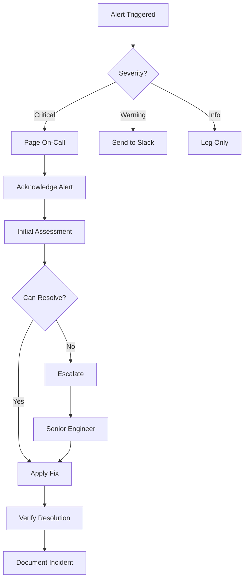

# Monitoring and Alerting Guide

## Overview
This guide provides comprehensive monitoring and alerting procedures for the Neural Hive-Mind system, covering metrics collection, alerting rules, dashboards, and incident response workflows.

## Table of Contents
1. [Monitoring Stack](#monitoring-stack)
2. [Key Metrics](#key-metrics)
3. [Alert Configuration](#alert-configuration)
4. [Dashboards](#dashboards)
5. [Log Aggregation](#log-aggregation)
6. [Incident Response](#incident-response)
7. [Performance Analysis](#performance-analysis)
8. [Capacity Planning](#capacity-planning)

## Monitoring Stack

### Components
- **Prometheus**: Time-series metrics collection and storage
- **Grafana**: Visualization and dashboarding
- **AlertManager**: Alert routing and management
- **Loki**: Log aggregation and querying
- **Jaeger**: Distributed tracing
- **kube-state-metrics**: Kubernetes metrics
- **node-exporter**: Node-level metrics

### Architecture
```
┌─────────────────────────────────────────────────┐
│                  Applications                    │
├──────────┬────────────┬────────────┬───────────┤
│ Metrics  │    Logs    │   Traces   │  Events   │
└────┬─────┴─────┬──────┴─────┬──────┴─────┬─────┘
     │           │            │            │
     ▼           ▼            ▼            ▼
┌─────────┐ ┌────────┐ ┌──────────┐ ┌──────────┐
│Prometheus│ │  Loki  │ │  Jaeger  │ │Kubernetes│
└────┬─────┘ └───┬────┘ └────┬─────┘ └────┬─────┘
     │           │            │            │
     └───────────┴────────────┴────────────┘
                        │
                   ┌────▼────┐
                   │ Grafana │
                   └─────────┘
```

## Key Metrics

### System Health Metrics

#### Availability Metrics
```yaml
# Service availability
up{job="neural-hive-*"}

# Pod readiness
kube_pod_container_status_ready{namespace="neural-hive-*"}

# Deployment status
kube_deployment_status_replicas_available{namespace="neural-hive-*"}
```

#### Performance Metrics
```yaml
# Request latency (p50, p95, p99)
histogram_quantile(0.95,
  sum(rate(http_request_duration_seconds_bucket[5m]))
  by (service, le)
)

# Throughput
sum(rate(http_requests_total[5m])) by (service)

# Error rate
sum(rate(http_requests_total{status=~"5.."}[5m]))
/ sum(rate(http_requests_total[5m]))
```

#### Resource Utilization
```yaml
# CPU usage
sum(rate(container_cpu_usage_seconds_total[5m]))
by (pod, namespace)

# Memory usage
sum(container_memory_working_set_bytes)
by (pod, namespace)

# Disk I/O
sum(rate(container_fs_reads_bytes_total[5m]))
by (pod, namespace)
```

### Application-Specific Metrics

#### Neural Processing Metrics
```yaml
neural_processing_queue_size
neural_processing_latency_seconds
neural_model_inference_duration_seconds
neural_model_accuracy_score
```

#### Data Pipeline Metrics
```yaml
data_pipeline_throughput_bytes_per_second
data_pipeline_lag_seconds
data_pipeline_error_rate
data_pipeline_backpressure
```

## Alert Configuration

### Critical Alerts

#### System Down
```yaml
- alert: ServiceDown
  expr: up{job="neural-hive-*"} == 0
  for: 5m
  labels:
    severity: critical
    team: platform
  annotations:
    summary: "Service {{ $labels.job }} is down"
    description: "{{ $labels.job }} has been down for more than 5 minutes"
```

#### High Error Rate
```yaml
- alert: HighErrorRate
  expr: |
    sum(rate(http_requests_total{status=~"5.."}[5m]))
    / sum(rate(http_requests_total[5m])) > 0.05
  for: 10m
  labels:
    severity: critical
  annotations:
    summary: "High error rate detected"
    description: "Error rate is above 5% for the last 10 minutes"
```

#### Resource Exhaustion
```yaml
- alert: HighMemoryUsage
  expr: |
    container_memory_working_set_bytes
    / container_spec_memory_limit_bytes > 0.9
  for: 15m
  labels:
    severity: warning
  annotations:
    summary: "High memory usage in {{ $labels.pod }}"
    description: "Memory usage is above 90% for {{ $labels.pod }}"
```

### Warning Alerts

#### Performance Degradation
```yaml
- alert: HighLatency
  expr: |
    histogram_quantile(0.95,
      sum(rate(http_request_duration_seconds_bucket[5m]))
      by (service, le)
    ) > 1
  for: 10m
  labels:
    severity: warning
  annotations:
    summary: "High latency detected"
    description: "P95 latency is above 1 second"
```

## Dashboards

### System Overview Dashboard
```json
{
  "dashboard": {
    "title": "Neural Hive-Mind System Overview",
    "panels": [
      {
        "title": "Service Health",
        "type": "stat",
        "targets": [
          {
            "expr": "sum(up{job=~'neural-hive-.*'})"
          }
        ]
      },
      {
        "title": "Request Rate",
        "type": "graph",
        "targets": [
          {
            "expr": "sum(rate(http_requests_total[5m])) by (service)"
          }
        ]
      },
      {
        "title": "Error Rate",
        "type": "graph",
        "targets": [
          {
            "expr": "sum(rate(http_requests_total{status=~'5..'}[5m]))"
          }
        ]
      },
      {
        "title": "Resource Usage",
        "type": "gauge",
        "targets": [
          {
            "expr": "sum(container_memory_working_set_bytes) by (namespace)"
          }
        ]
      }
    ]
  }
}
```

### Performance Dashboard
- Request latency distribution
- Throughput trends
- Cache hit rates
- Database query performance
- API endpoint performance

### Resource Dashboard
- CPU utilization by service
- Memory usage trends
- Disk I/O patterns
- Network traffic
- Pod distribution

## Log Aggregation

### Log Collection Configuration
```yaml
apiVersion: v1
kind: ConfigMap
metadata:
  name: loki-config
data:
  loki.yaml: |
    server:
      http_listen_port: 3100

    ingester:
      lifecycler:
        ring:
          kvstore:
            store: inmemory
          replication_factor: 1

    schema_config:
      configs:
        - from: 2024-01-01
          store: boltdb-shipper
          object_store: s3
          schema: v12
          index:
            prefix: neural_hive_index_
            period: 24h

    storage_config:
      boltdb_shipper:
        active_index_directory: /loki/boltdb-shipper-active
        cache_location: /loki/boltdb-shipper-cache
        shared_store: s3
      aws:
        bucketnames: neural-hive-logs
        region: us-east-1
```

### Log Queries

#### Error Investigation
```logql
{namespace="neural-hive-*"} |= "error" | json | line_format "{{.timestamp}} {{.level}} {{.msg}}"
```

#### Performance Analysis
```logql
{service="api-gateway"} | json | response_time > 1000
```

#### Security Audit
```logql
{namespace="neural-hive-*"} |~ "auth|security|access" | json
```

## Incident Response

### Alert Response Workflow


### Runbook Integration
Each alert should link to a specific runbook section:
```yaml
annotations:
  runbook_url: "https://docs.neural-hive.io/runbooks/{{ $labels.alertname }}"
```

## Performance Analysis

### Query Performance
```sql
-- Slow query analysis
SELECT
    query,
    mean_exec_time,
    calls,
    total_exec_time
FROM pg_stat_statements
WHERE mean_exec_time > 100
ORDER BY mean_exec_time DESC
LIMIT 20;
```

### Trace Analysis
```bash
# Extract slow traces
curl -X GET "http://jaeger:16686/api/traces?service=neural-hive-api&minDuration=1000ms"
```

### Profiling
```bash
# CPU profiling
kubectl exec -n neural-hive-mind deployment/api-server -- \
    curl -s localhost:6060/debug/pprof/profile?seconds=30 > cpu.prof

# Memory profiling
kubectl exec -n neural-hive-mind deployment/api-server -- \
    curl -s localhost:6060/debug/pprof/heap > heap.prof
```

## Capacity Planning

### Growth Metrics
```yaml
# Request growth rate (week over week)
(sum(rate(http_requests_total[1h])) - sum(rate(http_requests_total[1h] offset 1w)))
/ sum(rate(http_requests_total[1h] offset 1w))

# Resource utilization trend
predict_linear(container_memory_working_set_bytes[1w], 4 * 7 * 24 * 3600)
```

### Scaling Triggers
```yaml
apiVersion: autoscaling/v2
kind: HorizontalPodAutoscaler
metadata:
  name: neural-processor-hpa
spec:
  scaleTargetRef:
    apiVersion: apps/v1
    kind: Deployment
    name: neural-processor
  minReplicas: 2
  maxReplicas: 10
  metrics:
  - type: Resource
    resource:
      name: cpu
      target:
        type: Utilization
        averageUtilization: 70
  - type: Resource
    resource:
      name: memory
      target:
        type: Utilization
        averageUtilization: 80
  - type: Pods
    pods:
      metric:
        name: neural_processing_queue_size
      target:
        type: AverageValue
        averageValue: "100"
```

## Best Practices

### Monitoring Guidelines
1. **Golden Signals**: Focus on latency, traffic, errors, and saturation
2. **USE Method**: Monitor Utilization, Saturation, and Errors
3. **RED Method**: Track Rate, Errors, and Duration
4. **Business Metrics**: Include business-relevant KPIs

### Alert Design
1. **Actionable**: Every alert should have a clear action
2. **Symptom-Based**: Alert on symptoms, not causes
3. **Tiered Severity**: Use critical, warning, and info levels appropriately
4. **Avoid Alert Fatigue**: Tune thresholds to reduce noise

### Dashboard Design
1. **Overview First**: Start with high-level system health
2. **Drill-Down**: Enable navigation to detailed views
3. **Time Windows**: Include multiple time ranges
4. **Annotations**: Mark deployments and incidents

## Troubleshooting

### Common Issues

#### Missing Metrics
```bash
# Check Prometheus targets
curl http://prometheus:9090/api/v1/targets

# Verify service discovery
kubectl get servicemonitor -A

# Check metrics endpoint
kubectl port-forward svc/my-service 8080:8080
curl localhost:8080/metrics
```

#### Alert Not Firing
```bash
# Check alert rules
curl http://prometheus:9090/api/v1/rules

# Test alert expression
curl -g 'http://prometheus:9090/api/v1/query?query=up{job="my-job"}'

# Check AlertManager config
kubectl logs -n monitoring deployment/alertmanager
```

#### Dashboard Not Loading
```bash
# Check Grafana datasource
curl -u admin:admin http://grafana:3000/api/datasources

# Test Prometheus query
curl 'http://prometheus:9090/api/v1/query?query=up'

# Check Grafana logs
kubectl logs -n monitoring deployment/grafana
```

## Security Considerations

### Metrics Security
- Enable TLS for metrics endpoints
- Use service accounts with minimal permissions
- Implement RBAC for Prometheus
- Encrypt metrics in transit

### Log Security
- Redact sensitive information
- Implement log retention policies
- Use encryption at rest
- Audit log access

### Alert Security
- Secure webhook endpoints
- Use encrypted channels for alerts
- Implement alert verification
- Audit alert configuration changes

## Maintenance

### Regular Tasks
- **Daily**: Review critical alerts, check dashboard health
- **Weekly**: Analyze trends, update thresholds
- **Monthly**: Review alert effectiveness, update dashboards
- **Quarterly**: Capacity planning review, retention policy update

### Updates and Upgrades
```bash
# Backup Prometheus data
kubectl exec -n monitoring prometheus-0 -- tar czf /tmp/prometheus-backup.tar.gz /prometheus

# Update Prometheus
helm upgrade prometheus prometheus-community/prometheus --values values.yaml

# Update Grafana
helm upgrade grafana grafana/grafana --values values.yaml
```

## References

- [Prometheus Documentation](https://prometheus.io/docs/)
- [Grafana Documentation](https://grafana.com/docs/)
- [Loki Documentation](https://grafana.com/docs/loki/)
- [Jaeger Documentation](https://www.jaegertracing.io/docs/)
- [AlertManager Documentation](https://prometheus.io/docs/alerting/alertmanager/)