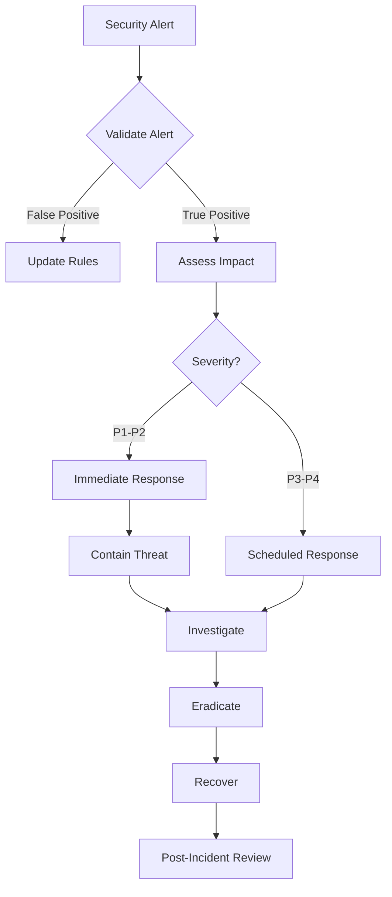

# Security Operations Guide

## Overview
This guide provides comprehensive security operations procedures for the Neural Hive-Mind system, covering security monitoring, incident response, compliance, vulnerability management, and security best practices.

## Table of Contents
1. [Security Architecture](#security-architecture)
2. [Access Control](#access-control)
3. [Security Monitoring](#security-monitoring)
4. [Incident Response](#incident-response)
5. [Vulnerability Management](#vulnerability-management)
6. [Compliance and Audit](#compliance-and-audit)
7. [Security Hardening](#security-hardening)
8. [Disaster Recovery](#disaster-recovery)

## Security Architecture

### Defense in Depth Model
```
┌──────────────────────────────────────────────┐
│          External Perimeter (WAF)            │
├──────────────────────────────────────────────┤
│            API Gateway (mTLS)                │
├──────────────────────────────────────────────┤
│          Service Mesh (Istio)                │
├──────────────────────────────────────────────┤
│         Application Security                 │
├──────────────────────────────────────────────┤
│          Data Encryption                     │
├──────────────────────────────────────────────┤
│         Infrastructure Security              │
└──────────────────────────────────────────────┘
```

### Security Components
- **WAF**: Web Application Firewall for external threats
- **mTLS**: Mutual TLS for service-to-service communication
- **OPA**: Open Policy Agent for policy enforcement
- **Vault**: HashiCorp Vault for secrets management
- **Falco**: Runtime security monitoring
- **Istio**: Service mesh with built-in security features

## Access Control

### RBAC Configuration

#### Cluster Roles
```yaml
apiVersion: rbac.authorization.k8s.io/v1
kind: ClusterRole
metadata:
  name: neural-hive-admin
rules:
- apiGroups: ["*"]
  resources: ["*"]
  verbs: ["*"]
---
apiVersion: rbac.authorization.k8s.io/v1
kind: ClusterRole
metadata:
  name: neural-hive-developer
rules:
- apiGroups: ["", "apps", "batch"]
  resources: ["pods", "services", "deployments", "jobs"]
  verbs: ["get", "list", "watch", "create", "update", "patch"]
---
apiVersion: rbac.authorization.k8s.io/v1
kind: ClusterRole
metadata:
  name: neural-hive-viewer
rules:
- apiGroups: ["", "apps"]
  resources: ["*"]
  verbs: ["get", "list", "watch"]
```

#### Service Accounts
```yaml
apiVersion: v1
kind: ServiceAccount
metadata:
  name: neural-processor
  namespace: neural-hive-mind
  annotations:
    eks.amazonaws.com/role-arn: arn:aws:iam::ACCOUNT:role/neural-processor-role
```

### Authentication Methods

#### OIDC Integration
```yaml
apiVersion: v1
kind: ConfigMap
metadata:
  name: aws-auth
  namespace: kube-system
data:
  mapUsers: |
    - userarn: arn:aws:iam::ACCOUNT:user/admin
      username: admin
      groups:
        - system:masters
  mapRoles: |
    - rolearn: arn:aws:iam::ACCOUNT:role/neural-hive-developers
      username: developer
      groups:
        - neural-hive-developers
```

#### API Token Management
```bash
# Create service account token
kubectl create token neural-processor -n neural-hive-mind --duration=24h

# Rotate tokens
kubectl delete secret neural-processor-token -n neural-hive-mind
kubectl create token neural-processor -n neural-hive-mind
```

## Security Monitoring

### Security Events Collection

#### Audit Logging Configuration
```yaml
apiVersion: audit.k8s.io/v1
kind: Policy
metadata:
  name: neural-hive-audit-policy
rules:
  # Log all changes in neural-hive namespaces
  - level: RequestResponse
    omitStages:
      - RequestReceived
    namespaces: ["neural-hive-*"]
    verbs: ["create", "update", "patch", "delete"]

  # Log authentication failures
  - level: Metadata
    omitStages:
      - RequestReceived
    nonResourceURLs:
      - "/api*"
      - "/health*"
    users: ["system:anonymous"]

  # Log secret access
  - level: Metadata
    resources:
      - group: ""
        resources: ["secrets"]
    verbs: ["get", "list", "watch"]
```

#### Falco Rules
```yaml
- rule: Unauthorized Process in Container
  desc: Detect unauthorized process execution
  condition: >
    spawned_process and
    container and
    not proc.name in (allowed_processes)
  output: >
    Unauthorized process started
    (user=%user.name command=%proc.cmdline container=%container.name)
  priority: WARNING

- rule: Sensitive File Access
  desc: Detect access to sensitive files
  condition: >
    open_read and
    fd.name in (/etc/shadow, /etc/passwd, /root/.ssh/*)
  output: >
    Sensitive file accessed
    (user=%user.name file=%fd.name container=%container.name)
  priority: CRITICAL

- rule: Network Connection to Unknown IP
  desc: Detect outbound connections to unknown IPs
  condition: >
    outbound and
    not fd.sip in (allowed_ips)
  output: >
    Unexpected outbound connection
    (container=%container.name connection=%fd.name)
  priority: WARNING
```

### Security Metrics

#### Key Security Indicators
```promql
# Failed authentication attempts
sum(rate(authentication_failures_total[5m])) by (service)

# Unauthorized access attempts
sum(rate(authorization_denied_total[5m])) by (resource)

# Security policy violations
sum(rate(opa_policy_violations_total[5m])) by (policy)

# Certificate expiration
(x509_cert_expiry - time()) / 86400 < 30
```

## Incident Response

### Incident Response Process

#### Severity Levels
- **P1 - Critical**: Active data breach, system compromise
- **P2 - High**: Security vulnerability exploited, unauthorized access
- **P3 - Medium**: Policy violation, suspicious activity
- **P4 - Low**: Security configuration issue

#### Response Workflow


### Incident Response Runbook

#### 1. Initial Response (15 minutes)
```bash
# Isolate affected pod
kubectl cordon NODE_NAME
kubectl delete pod COMPROMISED_POD -n NAMESPACE

# Capture evidence
kubectl logs COMPROMISED_POD -n NAMESPACE > incident_logs.txt
kubectl describe pod COMPROMISED_POD -n NAMESPACE > pod_description.txt

# Check for lateral movement
kubectl get events -n NAMESPACE --sort-by='.lastTimestamp'
```

#### 2. Investigation (1 hour)
```bash
# Analyze audit logs
kubectl logs -n kube-system audit-logger --since=2h

# Check network connections
kubectl exec -n NAMESPACE POD_NAME -- netstat -tuln

# Review recent changes
kubectl get events --all-namespaces --sort-by='.lastTimestamp'

# Check for persistence mechanisms
kubectl get cronjobs,jobs,deployments -A | grep -v kube-system
```

#### 3. Containment
```bash
# Block network traffic
kubectl apply -f - <<EOF
apiVersion: networking.k8s.io/v1
kind: NetworkPolicy
metadata:
  name: incident-isolation
  namespace: affected-namespace
spec:
  podSelector:
    matchLabels:
      quarantine: "true"
  policyTypes:
  - Ingress
  - Egress
EOF

# Suspend deployments
kubectl scale deployment DEPLOYMENT_NAME --replicas=0 -n NAMESPACE

# Revoke compromised credentials
kubectl delete secret COMPROMISED_SECRET -n NAMESPACE
```

## Vulnerability Management

### Vulnerability Scanning

#### Container Image Scanning
```yaml
apiVersion: v1
kind: ConfigMap
metadata:
  name: trivy-config
data:
  trivy.yaml: |
    scan:
      security-checks:
        - vuln
        - config
        - secret
      severity:
        - CRITICAL
        - HIGH
        - MEDIUM
      ignore-unfixed: false

    registry:
      username: ${REGISTRY_USER}
      password: ${REGISTRY_PASSWORD}
```

#### Continuous Scanning Pipeline
```bash
# Scan images before deployment
trivy image --severity HIGH,CRITICAL neural-hive/api:latest

# Scan running containers
for pod in $(kubectl get pods -n neural-hive-mind -o name); do
  kubectl exec $pod -- trivy rootfs /
done

# Scan Kubernetes manifests
trivy config k8s/
```

### Patch Management

#### Update Strategy
```yaml
apiVersion: apps/v1
kind: Deployment
metadata:
  name: neural-processor
spec:
  strategy:
    type: RollingUpdate
    rollingUpdate:
      maxSurge: 1
      maxUnavailable: 0
  template:
    metadata:
      annotations:
        force-update: "${TIMESTAMP}"
    spec:
      containers:
      - name: processor
        image: neural-hive/processor:${VERSION}
        imagePullPolicy: Always
```

#### Security Updates Process
```bash
# Check for security updates
kubectl get pods -A -o jsonpath='{range .items[*]}{.spec.containers[*].image}{"\n"}{end}' | \
  sort -u | \
  xargs -I {} trivy image {} --severity HIGH,CRITICAL

# Update base images
docker build --no-cache --pull -t neural-hive/api:latest .

# Deploy updates
kubectl set image deployment/api-server api=neural-hive/api:latest -n neural-hive-mind
```

## Compliance and Audit

### Compliance Frameworks
- **SOC 2**: Security, availability, processing integrity
- **PCI DSS**: Payment card data security
- **GDPR**: Data privacy and protection
- **HIPAA**: Healthcare data security

### Audit Controls

#### Data Access Audit
```sql
-- Create audit table
CREATE TABLE audit_log (
    id SERIAL PRIMARY KEY,
    timestamp TIMESTAMP DEFAULT CURRENT_TIMESTAMP,
    user_id VARCHAR(255),
    action VARCHAR(50),
    resource VARCHAR(255),
    details JSONB,
    ip_address INET,
    user_agent TEXT
);

-- Create audit trigger
CREATE OR REPLACE FUNCTION audit_trigger()
RETURNS TRIGGER AS $$
BEGIN
    INSERT INTO audit_log (user_id, action, resource, details)
    VALUES (
        current_user,
        TG_OP,
        TG_TABLE_NAME,
        row_to_json(NEW)
    );
    RETURN NEW;
END;
$$ LANGUAGE plpgsql;
```

#### Compliance Checks
```bash
# CIS Kubernetes Benchmark
kubectl apply -f https://raw.githubusercontent.com/aquasecurity/kube-bench/main/job.yaml
kubectl logs job.batch/kube-bench

# Network policies audit
kubectl get networkpolicies -A -o yaml | \
  opa eval -d policies/network-security.rego -i - "data.kubernetes.admission.violation[_]"

# RBAC audit
kubectl auth can-i --list --as=system:serviceaccount:default:default
```

## Security Hardening

### Kubernetes Hardening

#### Pod Security Standards
```yaml
apiVersion: v1
kind: Namespace
metadata:
  name: neural-hive-mind
  labels:
    pod-security.kubernetes.io/enforce: restricted
    pod-security.kubernetes.io/audit: restricted
    pod-security.kubernetes.io/warn: restricted
```

#### Security Context
```yaml
apiVersion: v1
kind: Pod
metadata:
  name: secure-pod
spec:
  securityContext:
    runAsNonRoot: true
    runAsUser: 1000
    fsGroup: 2000
    seccompProfile:
      type: RuntimeDefault
  containers:
  - name: app
    image: neural-hive/app:latest
    securityContext:
      allowPrivilegeEscalation: false
      readOnlyRootFilesystem: true
      capabilities:
        drop:
        - ALL
        add:
        - NET_BIND_SERVICE
    volumeMounts:
    - name: tmp
      mountPath: /tmp
    - name: cache
      mountPath: /app/cache
  volumes:
  - name: tmp
    emptyDir: {}
  - name: cache
    emptyDir: {}
```

### Network Security

#### Network Segmentation
```yaml
apiVersion: networking.k8s.io/v1
kind: NetworkPolicy
metadata:
  name: neural-hive-ingress
  namespace: neural-hive-mind
spec:
  podSelector: {}
  policyTypes:
  - Ingress
  - Egress
  ingress:
  - from:
    - namespaceSelector:
        matchLabels:
          name: neural-hive-mind
    - namespaceSelector:
        matchLabels:
          name: istio-system
  egress:
  - to:
    - namespaceSelector:
        matchLabels:
          name: neural-hive-mind
  - to:
    - namespaceSelector:
        matchLabels:
          name: kube-system
    ports:
    - protocol: TCP
      port: 53
    - protocol: UDP
      port: 53
```

#### TLS Configuration
```yaml
apiVersion: v1
kind: ConfigMap
metadata:
  name: tls-config
data:
  tls.conf: |
    ssl_protocols TLSv1.2 TLSv1.3;
    ssl_ciphers ECDHE-ECDSA-AES128-GCM-SHA256:ECDHE-RSA-AES128-GCM-SHA256;
    ssl_prefer_server_ciphers off;
    ssl_session_timeout 1d;
    ssl_session_cache shared:SSL:50m;
    ssl_stapling on;
    ssl_stapling_verify on;
    add_header Strict-Transport-Security "max-age=63072000" always;
```

## Disaster Recovery

### Backup Strategy

#### Automated Backups
```bash
#!/bin/bash
# backup.sh

# Backup etcd
ETCDCTL_API=3 etcdctl \
  --endpoints=https://127.0.0.1:2379 \
  --cacert=/etc/kubernetes/pki/etcd/ca.crt \
  --cert=/etc/kubernetes/pki/etcd/healthcheck-client.crt \
  --key=/etc/kubernetes/pki/etcd/healthcheck-client.key \
  snapshot save /backup/etcd-snapshot-$(date +%Y%m%d-%H%M%S).db

# Backup persistent volumes
for pvc in $(kubectl get pvc -A -o name); do
  kubectl create job backup-$pvc --from=cronjob/volume-backup
done

# Backup secrets and configs
kubectl get secrets,configmaps -A -o yaml > /backup/configs-$(date +%Y%m%d-%H%M%S).yaml

# Upload to S3
aws s3 sync /backup/ s3://neural-hive-backups/$(date +%Y%m%d)/
```

#### Recovery Procedures
```bash
#!/bin/bash
# restore.sh

# Restore etcd
ETCDCTL_API=3 etcdctl snapshot restore \
  /backup/etcd-snapshot.db \
  --data-dir=/var/lib/etcd-restore

# Restore configs
kubectl apply -f /backup/configs.yaml

# Restore persistent volumes
for backup in /backup/pv-*.tar.gz; do
  tar -xzf $backup -C /mnt/restore/
done
```

### Business Continuity

#### RTO/RPO Targets
- **RTO (Recovery Time Objective)**: 4 hours
- **RPO (Recovery Point Objective)**: 1 hour

#### Disaster Recovery Testing
```bash
# Monthly DR drill
./scripts/dr-drill.sh --environment staging --scenario full-recovery

# Validate backups
./scripts/validate-backups.sh --date $(date -d "yesterday" +%Y%m%d)

# Test recovery procedures
kubectl create namespace dr-test
kubectl apply -f /backup/test-workload.yaml -n dr-test
```

## Security Tools

### Essential Security Tools
```bash
# Install security tools
helm repo add falcosecurity https://falcosecurity.github.io/charts
helm install falco falcosecurity/falco

helm repo add aqua https://aquasecurity.github.io/helm-charts
helm install trivy-operator aqua/trivy-operator

kubectl apply -f https://raw.githubusercontent.com/open-policy-agent/gatekeeper/release-3.14/deploy/gatekeeper.yaml
```

### Security Automation
```yaml
apiVersion: batch/v1
kind: CronJob
metadata:
  name: security-scan
spec:
  schedule: "0 2 * * *"
  jobTemplate:
    spec:
      template:
        spec:
          containers:
          - name: scanner
            image: aquasec/trivy:latest
            command:
            - sh
            - -c
            - |
              trivy image --severity HIGH,CRITICAL \
                --format json \
                --output /reports/scan-$(date +%Y%m%d).json \
                $(kubectl get pods -A -o jsonpath='{.items[*].spec.containers[*].image}' | tr ' ' '\n' | sort -u)
          restartPolicy: OnFailure
```

## Security Best Practices

### Development Security
1. **Secure Coding**: Follow OWASP guidelines
2. **Dependency Management**: Regular updates and vulnerability scanning
3. **Secret Management**: Never hardcode secrets
4. **Code Review**: Security-focused code reviews

### Operational Security
1. **Least Privilege**: Minimal permissions for all accounts
2. **Defense in Depth**: Multiple security layers
3. **Zero Trust**: Verify everything, trust nothing
4. **Continuous Monitoring**: Real-time security monitoring

### Incident Preparation
1. **Incident Response Plan**: Documented and tested
2. **Communication Channels**: Secure incident communication
3. **Evidence Collection**: Forensics readiness
4. **Recovery Procedures**: Tested recovery runbooks

## Troubleshooting Security Issues

### Common Security Issues

#### Certificate Issues
```bash
# Check certificate expiry
kubectl get certificates -A -o jsonpath='{range .items[*]}{.metadata.name}{"\t"}{.status.notAfter}{"\n"}{end}'

# Renew certificates
kubectl delete certificate my-cert -n namespace
kubectl apply -f certificate.yaml

# Debug TLS issues
openssl s_client -connect service.namespace.svc.cluster.local:443 -showcerts
```

#### Authentication Failures
```bash
# Check RBAC bindings
kubectl auth can-i --list --as=system:serviceaccount:namespace:sa-name

# Debug OIDC issues
kubectl logs -n kube-system deployment/aws-iam-authenticator

# Test service account
kubectl --as=system:serviceaccount:namespace:sa-name get pods
```

#### Policy Violations
```bash
# Check OPA policies
kubectl logs -n opa-system deployment/opa

# Test policy evaluation
opa eval -d policy.rego -i input.json "data.kubernetes.admission.deny[_]"

# Debug Gatekeeper
kubectl describe constraints
```

## References

- [Kubernetes Security Best Practices](https://kubernetes.io/docs/concepts/security/)
- [NIST Cybersecurity Framework](https://www.nist.gov/cyberframework)
- [CIS Kubernetes Benchmark](https://www.cisecurity.org/benchmark/kubernetes)
- [OWASP Top 10](https://owasp.org/www-project-top-ten/)
- [Cloud Security Alliance](https://cloudsecurityalliance.org/)