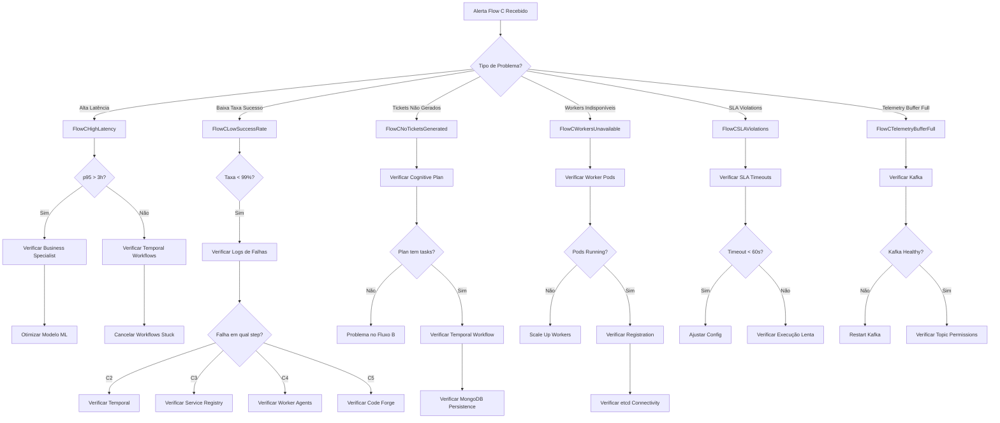

# Flow C Troubleshooting Runbook

## Overview

Guia de diagnóstico e resolução de problemas para Flow C - Orquestração de Execução Adaptativa. Este runbook cobre os principais alertas, problemas comuns e procedimentos de resolução.

---

## Troubleshooting Flowchart



---

## Problem Categories

### 1. FlowCHighLatency (p95 > 3h)

**Alerta:** `FlowCHighLatency`
**Severidade:** Warning
**Threshold:** p95 > 3 horas (75% do SLO de 4h)

#### Sintomas

- Dashboard mostra p95 latency acima de 3h
- Workflows levando mais de 4h para completar
- SLA violations aumentando
- Usuários reportando lentidão na execução

#### Diagnóstico

**1. Verificar latência por step:**

```bash
# Query Prometheus para latência por step
curl -s "http://prometheus.monitoring:9090/api/v1/query?query=histogram_quantile(0.95,rate(neural_hive_flow_c_steps_duration_seconds_bucket[5m]))" | jq '.data.result[] | {step: .metric.step, latency: .value[1]}'
```

**2. Identificar step mais lento:**

```bash
# Logs do orchestrator
kubectl logs -n neural-hive-orchestration -l app=orchestrator-dynamic --tail=500 | grep "step_duration" | jq -r 'select(.step_duration_ms > 60000) | "\(.step): \(.step_duration_ms)ms"'
```

**3. Verificar Business Specialist (causa comum):**

```bash
# Latência do Business Specialist
kubectl logs -n neural-hive-consensus -l app=specialist-business --tail=100 | grep "processing_time_ms"

# Verificar se > 60s
curl -s "http://prometheus.monitoring:9090/api/v1/query?query=histogram_quantile(0.95,rate(specialist_evaluation_duration_seconds{specialist_type=\"business\"}[5m]))" | jq
```

**4. Verificar Temporal workflows stuck:**

```bash
# Listar workflows running > 4h
kubectl exec -n neural-hive-orchestration deployment/orchestrator-dynamic -- \
  temporal workflow list --namespace default --query 'ExecutionStatus="Running" AND StartTime < "4h ago"'
```

**5. Verificar resource usage:**

```bash
# Check CPU/memory on orchestrator pods
kubectl top pods -n neural-hive-orchestration -l app=orchestrator-dynamic

# Check worker pods
kubectl top pods -n neural-hive-execution -l app=worker-agents
```

#### Resolução

**Opção 1: Otimizar Business Specialist (se latência > 60s)**

```bash
# Aumentar timeout gRPC
kubectl patch configmap consensus-engine-config -n neural-hive-consensus -p '{"data":{"GRPC_TIMEOUT_MS":"120000"}}'

# Restart consensus engine
kubectl rollout restart deployment/consensus-engine -n neural-hive-consensus

# Verificar se melhorou
watch -n 30 'curl -s "http://prometheus.monitoring:9090/api/v1/query?query=histogram_quantile(0.95,rate(specialist_evaluation_duration_seconds{specialist_type=\"business\"}[5m]))" | jq ".data.result[0].value[1]"'
```

**Opção 2: Cancelar workflows stuck**

```bash
# Cancelar workflow específico
kubectl exec -n neural-hive-orchestration deployment/orchestrator-dynamic -- \
  temporal workflow cancel --workflow-id flow-c-abc-123 --reason "Stuck workflow - manual intervention"

# Retry workflow (se necessário)
kubectl exec -n neural-hive-orchestration deployment/orchestrator-dynamic -- \
  temporal workflow start --workflow-id flow-c-abc-123-retry --type OrchestrationWorkflow --task-queue orchestration-tasks --input @workflow-input.json
```

**Opção 3: Scale up workers (se C4/C5 lentos)**

```bash
# Scale workers
kubectl scale deployment worker-agents --replicas=10 -n neural-hive-execution

# Verificar distribuição de carga
kubectl top pods -n neural-hive-execution

# Monitor assignment rate
curl -s "http://prometheus.monitoring:9090/api/v1/query?query=rate(neural_hive_ticket_assignments_total[5m])" | jq
```

**Opção 4: Scale up orchestrator (se C1/C2/C3 lentos)**

```bash
# Scale orchestrator
kubectl scale deployment orchestrator-dynamic --replicas=5 -n neural-hive-orchestration

# Monitor throughput
watch -n 10 'curl -s "http://prometheus.monitoring:9090/api/v1/query?query=rate(neural_hive_flow_c_success_total[5m])" | jq ".data.result[0].value[1]"'
```

#### Verificação de Recuperação

```bash
# Verificar p95 latency voltou < 3h
curl -s "http://prometheus.monitoring:9090/api/v1/query?query=histogram_quantile(0.95,rate(neural_hive_flow_c_duration_seconds_bucket[5m]))" | jq '.data.result[0].value[1]'

# Verificar workflows completando
kubectl logs -n neural-hive-orchestration -l app=orchestrator-dynamic --tail=50 | grep "workflow_completed"

# Verificar taxa de throughput
curl -s "http://prometheus.monitoring:9090/api/v1/query?query=rate(neural_hive_flow_c_success_total[10m])*60" | jq
```

#### Prevenção

- Monitorar latência do Business Specialist semanalmente
- Implementar cache de features para ML
- Considerar GPU acceleration para inferência
- Ajustar HPA para scale proativo
- Revisar SLOs trimestralmente

---

### 2. FlowCLowSuccessRate (< 99%)

**Alerta:** `FlowCLowSuccessRate`
**Severidade:** Critical
**Threshold:** Taxa de sucesso < 99% por 10 minutos

#### Sintomas

- Taxa de sucesso abaixo de 99%
- Aumento de `neural_hive_flow_c_failures_total`
- Workflows falhando consistentemente
- Tickets não sendo processados

#### Diagnóstico

**1. Verificar taxa de sucesso atual:**

```bash
curl -s "http://prometheus.monitoring:9090/api/v1/query?query=rate(neural_hive_flow_c_success_total[10m])/(rate(neural_hive_flow_c_success_total[10m])+rate(neural_hive_flow_c_failures_total[10m]))" | jq '.data.result[0].value[1]'
```

**2. Identificar razão das falhas:**

```bash
# Falhas por razão
curl -s "http://prometheus.monitoring:9090/api/v1/query?query=sum by (reason) (rate(neural_hive_flow_c_failures_total[10m]))" | jq

# Logs de falhas
kubectl logs -n neural-hive-orchestration -l app=orchestrator-dynamic --tail=200 | grep "flow_c_failed"
```

**3. Verificar step específico falhando:**

```bash
# Falhas por step
kubectl logs -n neural-hive-orchestration -l app=orchestrator-dynamic --tail=500 | jq -r 'select(.event == "step_failed") | "\(.step): \(.error)"' | sort | uniq -c

# Verificar em qual step está falhando mais
curl -s "http://prometheus.monitoring:9090/api/v1/query?query=sum by (step) (rate(neural_hive_flow_c_step_failures_total[10m]))" | jq
```

#### Resolução por Step

**C1 (Validate Decision) falhando:**

```bash
# Verificar schema da decisão
kubectl logs -n neural-hive-orchestration -l app=orchestrator-dynamic --tail=100 | grep "validation_failed"

# Verificar Consensus Engine
kubectl logs -n neural-hive-consensus -l app=consensus-engine --tail=100 | grep "decision_published"

# Verificar formato da decisão
kubectl exec -n neural-hive-orchestration deployment/orchestrator-dynamic -- \
  mongosh mongodb://mongodb:27017/neural_hive --eval 'db.consensus_decisions.find().sort({timestamp: -1}).limit(1).pretty()'

# Possível causa: Decisão sem cognitive_plan
# Ação: Verificar Fluxo B
kubectl logs -n neural-hive-ste -l app=semantic-translation-engine --tail=100 | grep "plan_generated"
```

**C2 (Generate Tickets) falhando:**

```bash
# Verificar Temporal
kubectl exec -n neural-hive-orchestration deployment/orchestrator-dynamic -- \
  temporal workflow list --namespace default --query 'ExecutionStatus="Failed"' --limit 10

# Verificar MongoDB persistence
kubectl exec -n neural-hive-orchestration deployment/orchestrator-dynamic -- \
  mongosh mongodb://mongodb:27017/neural_hive --eval 'db.execution_tickets.countDocuments({created_at: {$gte: new Date(Date.now() - 3600000)}})'

# Se 0 tickets: problema de persistência
# Verificar circuit breaker MongoDB
kubectl logs -n neural-hive-orchestration -l app=orchestrator-dynamic --tail=100 | grep "circuit_breaker_open"

# Verificar MongoDB connectivity
kubectl exec -n neural-hive-orchestration deployment/orchestrator-dynamic -- \
  python -c "from pymongo import MongoClient; print(MongoClient('mongodb://mongodb:27017').server_info())"
```

**C3 (Discover Workers) falhando:**

```bash
# Verificar Service Registry
kubectl logs -n neural-hive-registry -l app=service-registry --tail=100

# Verificar workers registrados
kubectl exec -n neural-hive-registry deployment/service-registry -- \
  grpcurl -plaintext localhost:50051 list

# Verificar etcd
kubectl exec -n neural-hive-registry deployment/service-registry -- \
  etcdctl --endpoints=http://etcd:2379 get /registry/agents --prefix

# Verificar conectividade gRPC
kubectl exec -n neural-hive-orchestration deployment/orchestrator-dynamic -- \
  grpcurl -plaintext service-registry.neural-hive-registry:50051 grpc.health.v1.Health/Check
```

**C4 (Assign Tickets) falhando:**

```bash
# Verificar Worker Agents
kubectl get pods -n neural-hive-execution | grep worker-agents

# Verificar logs de assignment
kubectl logs -n neural-hive-execution -l app=worker-agents --tail=100 | grep "task_assigned"

# Verificar Code Forge connectivity
kubectl exec -n neural-hive-execution deployment/worker-agents -- \
  curl -s http://code-forge:8000/health

# Verificar Kafka connectivity (para ticket dispatch)
kubectl exec -n neural-hive-execution deployment/worker-agents -- \
  kafka-console-consumer.sh --bootstrap-server kafka:9092 --topic execution.tickets --max-messages 1 --timeout-ms 5000
```

**C5 (Monitor Execution) falhando:**

```bash
# Verificar tickets stuck
kubectl exec -n neural-hive-orchestration deployment/orchestrator-dynamic -- \
  mongosh mongodb://mongodb:27017/neural_hive --eval 'db.execution_tickets.find({status: "RUNNING", created_at: {$lt: new Date(Date.now() - 14400000)}}).pretty()'

# Verificar Code Forge pipelines
kubectl logs -n neural-hive-execution -l app=code-forge --tail=100 | grep "pipeline_failed"

# Verificar ArgoCD sync status
kubectl exec -n neural-hive-execution deployment/worker-agents -- \
  argocd app list --output json | jq '.[] | select(.status.sync.status != "Synced")'
```

**C6 (Publish Telemetry) falhando:**

```bash
# Verificar Kafka
kubectl get pods -n neural-hive-messaging | grep kafka

# Verificar tópico telemetry-flow-c
kubectl exec -n neural-hive-messaging kafka-0 -- kafka-topics.sh --bootstrap-server localhost:9092 --describe --topic telemetry-flow-c

# Verificar buffer Redis
curl -s "http://prometheus.monitoring:9090/api/v1/query?query=neural_hive_flow_c_telemetry_buffer_size" | jq
```

#### Verificação de Recuperação

```bash
# Verificar taxa de sucesso > 99%
curl -s "http://prometheus.monitoring:9090/api/v1/query?query=rate(neural_hive_flow_c_success_total[10m])/(rate(neural_hive_flow_c_success_total[10m])+rate(neural_hive_flow_c_failures_total[10m]))" | jq

# Verificar workflows completando
kubectl logs -n neural-hive-orchestration -l app=orchestrator-dynamic --tail=50 | grep "workflow_completed" | wc -l

# Verificar não há mais erros
kubectl logs -n neural-hive-orchestration -l app=orchestrator-dynamic --tail=100 | grep "level=error" | wc -l
```

---

### 3. FlowCNoTicketsGenerated

**Alerta:** `FlowCNoTicketsGenerated`
**Severidade:** Critical
**Threshold:** Flow C executando mas 0 tickets criados por 5 minutos

#### Sintomas

- Workflows executando mas nenhum ticket gerado
- Métrica `neural_hive_execution_tickets_created_total{source="flow_c"}` zerada
- MongoDB collection `execution_tickets` sem novos documentos
- Workers ociosos

#### Diagnóstico

**1. Verificar cognitive_plan:**

```bash
# Verificar se decisão tem cognitive_plan
kubectl exec -n neural-hive-orchestration deployment/orchestrator-dynamic -- \
  mongosh mongodb://mongodb:27017/neural_hive --eval 'db.consensus_decisions.find().sort({timestamp: -1}).limit(1).pretty()' | grep cognitive_plan

# Se null ou vazio: problema no Fluxo B
```

**2. Verificar Temporal workflow:**

```bash
# Verificar workflows recentes
kubectl exec -n neural-hive-orchestration deployment/orchestrator-dynamic -- \
  temporal workflow list --namespace default --limit 10

# Verificar se C2 activity executou
kubectl exec -n neural-hive-orchestration deployment/orchestrator-dynamic -- \
  temporal workflow describe --workflow-id flow-c-abc-123 | grep generate_execution_tickets

# Verificar se há workflows em execução
kubectl exec -n neural-hive-orchestration deployment/orchestrator-dynamic -- \
  temporal workflow list --namespace default --query 'ExecutionStatus="Running"' --limit 5
```

**3. Verificar MongoDB persistence:**

```bash
# Verificar circuit breaker
kubectl logs -n neural-hive-orchestration -l app=orchestrator-dynamic --tail=100 | grep "execution_ticket_persist"

# Verificar fail-open config
kubectl get configmap orchestrator-config -n neural-hive-orchestration -o yaml | grep MONGODB_FAIL_OPEN_EXECUTION_TICKETS

# Verificar MongoDB health
kubectl exec -n neural-hive-orchestration mongodb-0 -- mongosh --eval 'rs.status()'
```

**4. Verificar logs de erro:**

```bash
kubectl logs -n neural-hive-orchestration -l app=orchestrator-dynamic --tail=200 | grep -E "(ticket_generation_failed|persist_failed)"
```

**5. Verificar decisões chegando:**

```bash
# Verificar Kafka consumer
kubectl exec -n neural-hive-messaging kafka-0 -- \
  kafka-consumer-groups.sh --bootstrap-server localhost:9092 --describe --group orchestrator-consumers

# Verificar se há mensagens no tópico
kubectl exec -n neural-hive-messaging kafka-0 -- \
  kafka-console-consumer.sh --bootstrap-server localhost:9092 --topic plans.consensus --from-beginning --max-messages 5
```

#### Resolução

**Opção 1: Cognitive plan vazio (problema no Fluxo B)**

```bash
# Verificar STE
kubectl logs -n neural-hive-ste -l app=semantic-translation-engine --tail=100 | grep "plan_generated"

# Verificar Specialists
kubectl logs -n neural-hive-consensus -l app=specialist-business --tail=100

# Verificar DAG generator
kubectl logs -n neural-hive-ste -l app=semantic-translation-engine --tail=100 | grep "dag_generated"

# Ação: Escalar para equipe do Fluxo B
# Slack: #flow-b-oncall
```

**Opção 2: MongoDB persistence falhando**

```bash
# Verificar MongoDB
kubectl get pods -n neural-hive-orchestration | grep mongodb

# Verificar conectividade
kubectl exec -n neural-hive-orchestration deployment/orchestrator-dynamic -- \
  python -c "from pymongo import MongoClient; print(MongoClient('mongodb://mongodb:27017').server_info())"

# Criar coleção manualmente se não existir
kubectl exec -n neural-hive-orchestration deployment/orchestrator-dynamic -- \
  mongosh mongodb://mongodb:27017/neural_hive --eval 'db.createCollection("execution_tickets")'

# Criar índices
kubectl exec -n neural-hive-orchestration deployment/orchestrator-dynamic -- \
  mongosh mongodb://mongodb:27017/neural_hive --eval '
    db.execution_tickets.createIndex({ticket_id: 1}, {unique: true});
    db.execution_tickets.createIndex({plan_id: 1});
    db.execution_tickets.createIndex({status: 1});
    db.execution_tickets.createIndex({intent_id: 1});
    db.execution_tickets.createIndex({decision_id: 1});
    db.execution_tickets.createIndex({plan_id: 1, created_at: -1});
  '

# Restart orchestrator
kubectl rollout restart deployment/orchestrator-dynamic -n neural-hive-orchestration
```

**Opção 3: Temporal workflow falhando**

```bash
# Verificar worker Temporal
kubectl logs -n neural-hive-orchestration -l app=orchestrator-dynamic --tail=100 | grep "temporal_worker"

# Verificar Temporal server health
kubectl exec -n neural-hive-orchestration deployment/orchestrator-dynamic -- \
  temporal workflow list --namespace default --limit 1

# Restart worker
kubectl rollout restart deployment/orchestrator-dynamic -n neural-hive-orchestration
```

**Opção 4: Kafka consumer stuck**

```bash
# Reset consumer offset (use com cuidado)
kubectl exec -n neural-hive-messaging kafka-0 -- \
  kafka-consumer-groups.sh --bootstrap-server localhost:9092 --group orchestrator-consumers --reset-offsets --to-latest --topic plans.consensus --execute

# Restart orchestrator
kubectl rollout restart deployment/orchestrator-dynamic -n neural-hive-orchestration
```

#### Verificação de Recuperação

```bash
# Verificar tickets sendo criados
kubectl exec -n neural-hive-orchestration deployment/orchestrator-dynamic -- \
  mongosh mongodb://mongodb:27017/neural_hive --eval 'db.execution_tickets.countDocuments({created_at: {$gte: new Date(Date.now() - 300000)}})'

# Verificar métrica
curl -s "http://prometheus.monitoring:9090/api/v1/query?query=rate(neural_hive_execution_tickets_created_total{source=\"flow_c\"}[5m])" | jq

# Verificar logs de sucesso
kubectl logs -n neural-hive-orchestration -l app=orchestrator-dynamic --tail=50 | grep "tickets_generated"
```

---

### 4. FlowCWorkersUnavailable

**Alerta:** `FlowCWorkersUnavailable`
**Severidade:** Critical
**Threshold:** 0 workers healthy por 2 minutos

#### Sintomas

- Service Registry não reporta workers saudáveis
- Tickets não podem ser despachados
- Métrica `neural_hive_service_registry_agents_total{agent_type="worker",status="healthy"}` = 0
- Filas de tickets acumulando

#### Diagnóstico

**1. Verificar pods de workers:**

```bash
kubectl get pods -n neural-hive-execution | grep worker-agents

# Verificar status detalhado
kubectl describe pods -n neural-hive-execution -l app=worker-agents | grep -A 5 "State:"
```

**2. Verificar registration no Service Registry:**

```bash
# Listar agents registrados
kubectl exec -n neural-hive-registry deployment/service-registry -- \
  grpcurl -plaintext localhost:50051 list

# Verificar etcd
kubectl exec -n neural-hive-registry deployment/service-registry -- \
  etcdctl --endpoints=http://etcd:2379 get /registry/agents --prefix

# Verificar contagem de workers
kubectl exec -n neural-hive-registry deployment/service-registry -- \
  etcdctl --endpoints=http://etcd:2379 get /registry/agents --prefix --keys-only | wc -l
```

**3. Verificar health dos workers:**

```bash
# Health check direto
kubectl exec -n neural-hive-execution deployment/worker-agents -- \
  curl -s http://localhost:8080/health | jq

# Logs de health check
kubectl logs -n neural-hive-execution -l app=worker-agents --tail=100 | grep "health_check"
```

**4. Verificar conectividade etcd:**

```bash
# Verificar etcd pods
kubectl get pods -n neural-hive-registry | grep etcd

# Verificar conectividade
kubectl exec -n neural-hive-registry deployment/service-registry -- \
  etcdctl --endpoints=http://etcd:2379 endpoint health

# Verificar cluster status
kubectl exec -n neural-hive-registry deployment/service-registry -- \
  etcdctl --endpoints=http://etcd:2379 endpoint status
```

**5. Verificar logs de erro:**

```bash
kubectl logs -n neural-hive-execution -l app=worker-agents --tail=200 | grep -E "(error|failed|exception)"
```

#### Resolução

**Opção 1: Workers não running**

```bash
# Scale up workers
kubectl scale deployment worker-agents --replicas=3 -n neural-hive-execution

# Wait for readiness
kubectl wait --for=condition=ready pod -l app=worker-agents -n neural-hive-execution --timeout=120s

# Verificar pods
kubectl get pods -n neural-hive-execution -l app=worker-agents
```

**Opção 2: Workers não registrando**

```bash
# Verificar logs de registration
kubectl logs -n neural-hive-execution -l app=worker-agents --tail=100 | grep "registration"

# Verificar Service Registry endpoint
kubectl get svc -n neural-hive-registry | grep service-registry

# Verificar DNS
kubectl exec -n neural-hive-execution deployment/worker-agents -- \
  nslookup service-registry.neural-hive-registry

# Restart workers para forçar re-registration
kubectl rollout restart deployment/worker-agents -n neural-hive-execution
```

**Opção 3: etcd indisponível**

```bash
# Verificar etcd
kubectl get pods -n neural-hive-registry | grep etcd

# Verificar PVC
kubectl get pvc -n neural-hive-registry | grep etcd

# Restart etcd se necessário
kubectl rollout restart statefulset/etcd -n neural-hive-registry

# Wait for etcd
kubectl wait --for=condition=ready pod -l app=etcd -n neural-hive-registry --timeout=120s

# Restart Service Registry
kubectl rollout restart deployment/service-registry -n neural-hive-registry
```

**Opção 4: Health checks falhando**

```bash
# Verificar dependências dos workers
kubectl exec -n neural-hive-execution deployment/worker-agents -- \
  curl -s http://code-forge:8000/health

# Verificar Kafka connectivity
kubectl exec -n neural-hive-execution deployment/worker-agents -- \
  kafka-console-consumer.sh --bootstrap-server kafka:9092 --topic execution.tickets --max-messages 1 --timeout-ms 5000

# Verificar Vault connectivity
kubectl exec -n neural-hive-execution deployment/worker-agents -- \
  curl -s http://vault:8200/v1/sys/health

# Se dependências OK mas health failing: restart workers
kubectl rollout restart deployment/worker-agents -n neural-hive-execution
```

#### Verificação de Recuperação

```bash
# Verificar workers healthy
curl -s "http://prometheus.monitoring:9090/api/v1/query?query=count(neural_hive_service_registry_agents_total{agent_type=\"worker\",status=\"healthy\"})" | jq

# Verificar registration
kubectl exec -n neural-hive-registry deployment/service-registry -- \
  grpcurl -plaintext localhost:50051 list | grep WorkerAgent

# Verificar pods running
kubectl get pods -n neural-hive-execution -l app=worker-agents | grep Running | wc -l
```

---

### 5. FlowCSLAViolations

**Alerta:** `FlowCSLAViolations`
**Severidade:** Critical
**Threshold:** Violações de SLA detectadas (rate > 0 por 5min)

#### Sintomas

- Workflows ultrapassando deadline de 4h
- Métrica `neural_hive_flow_c_sla_violations_total` aumentando
- Alertas de SLA no Alertmanager
- Clientes reportando atrasos

#### Diagnóstico

**1. Verificar violações recentes:**

```bash
# Query Prometheus
curl -s "http://prometheus.monitoring:9090/api/v1/query?query=rate(neural_hive_flow_c_sla_violations_total[30m])" | jq

# Logs de violações
kubectl logs -n neural-hive-orchestration -l app=orchestrator-dynamic --tail=200 | grep "sla_violation"

# Violações por tipo
curl -s "http://prometheus.monitoring:9090/api/v1/query?query=sum by (violation_type) (rate(neural_hive_flow_c_sla_violations_total[30m]))" | jq
```

**2. Verificar SLA timeouts configurados:**

```bash
# Verificar config
kubectl get configmap orchestrator-config -n neural-hive-orchestration -o yaml | grep -E "(sla_ticket_min_timeout_ms|sla_ticket_timeout_buffer_multiplier)"

# Verificar tickets com timeout < 60s (bug conhecido)
kubectl exec -n neural-hive-orchestration deployment/orchestrator-dynamic -- \
  mongosh mongodb://mongodb:27017/neural_hive --eval 'db.execution_tickets.find({sla_timeout_ms: {$lt: 60000}}).count()'
```

**3. Verificar workflows lentos:**

```bash
# Workflows > 4h
kubectl exec -n neural-hive-orchestration deployment/orchestrator-dynamic -- \
  temporal workflow list --namespace default --query 'ExecutionStatus="Running" AND StartTime < "4h ago"'

# Latência por step
curl -s "http://prometheus.monitoring:9090/api/v1/query?query=histogram_quantile(0.99,rate(neural_hive_flow_c_steps_duration_seconds_bucket[5m]))" | jq

# Verificar tickets mais antigos
kubectl exec -n neural-hive-orchestration deployment/orchestrator-dynamic -- \
  mongosh mongodb://mongodb:27017/neural_hive --eval 'db.execution_tickets.find({status: "RUNNING"}).sort({created_at: 1}).limit(5).pretty()'
```

**4. Verificar causa raiz:**

```bash
# Verificar se é problema de capacidade
kubectl top pods -n neural-hive-orchestration
kubectl top pods -n neural-hive-execution

# Verificar se é problema de dependência
kubectl logs -n neural-hive-orchestration -l app=orchestrator-dynamic --tail=200 | grep -E "(timeout|connection_refused|circuit_breaker)"
```

#### Resolução

**Opção 1: Timeouts inadequados (< 60s)**

```bash
# Atualizar config
kubectl patch configmap orchestrator-config -n neural-hive-orchestration -p '{"data":{"SLA_TICKET_MIN_TIMEOUT_MS":"60000","SLA_TICKET_TIMEOUT_BUFFER_MULTIPLIER":"3.0"}}'

# Restart orchestrator
kubectl rollout restart deployment/orchestrator-dynamic -n neural-hive-orchestration

# Validar novos tickets
kubectl exec -n neural-hive-orchestration deployment/orchestrator-dynamic -- \
  mongosh mongodb://mongodb:27017/neural_hive --eval 'db.execution_tickets.find().sort({created_at: -1}).limit(1).pretty()' | grep sla_timeout_ms
```

**Opção 2: Execução realmente lenta**

```bash
# Identificar step lento (ver FlowCHighLatency)
# Aplicar correções específicas por step

# Scale up workers se C4/C5 lentos
kubectl scale deployment worker-agents --replicas=10 -n neural-hive-execution

# Otimizar Business Specialist se C1 lento
# Ver: docs/ml_pipelines/optimization/SPECIALIST_OPTIMIZATION.md
```

**Opção 3: Cancelar workflows stuck**

```bash
# Cancelar workflows > 6h (1.5x SLO)
kubectl exec -n neural-hive-orchestration deployment/orchestrator-dynamic -- \
  temporal workflow list --namespace default --query 'ExecutionStatus="Running" AND StartTime < "6h ago"' | \
  awk '{print $1}' | \
  xargs -I {} kubectl exec -n neural-hive-orchestration deployment/orchestrator-dynamic -- \
    temporal workflow cancel --workflow-id {} --reason "SLA violation - manual intervention"
```

**Opção 4: Ajustar SLO dynamicamente**

```bash
# Temporariamente relaxar SLO (durante incident)
kubectl patch configmap orchestrator-config -n neural-hive-orchestration -p '{"data":{"FLOW_C_SLO_HOURS":"6"}}'

# Restart para aplicar
kubectl rollout restart deployment/orchestrator-dynamic -n neural-hive-orchestration

# IMPORTANTE: Reverter após resolver root cause
```

#### Verificação de Recuperação

```bash
# Verificar violações pararam
curl -s "http://prometheus.monitoring:9090/api/v1/query?query=rate(neural_hive_flow_c_sla_violations_total[10m])" | jq

# Verificar workflows completando dentro do SLO
curl -s "http://prometheus.monitoring:9090/api/v1/query?query=histogram_quantile(0.95,rate(neural_hive_flow_c_duration_seconds_bucket[5m]))" | jq

# Verificar não há workflows stuck
kubectl exec -n neural-hive-orchestration deployment/orchestrator-dynamic -- \
  temporal workflow list --namespace default --query 'ExecutionStatus="Running" AND StartTime < "4h ago"' | wc -l
```

---

### 6. FlowCTelemetryBufferFull

**Alerta:** `FlowCTelemetryBufferFull`
**Severidade:** Warning
**Threshold:** Buffer > 1000 eventos por 5 minutos

#### Sintomas

- Buffer Redis acumulando eventos
- Métrica `neural_hive_flow_c_telemetry_buffer_size` > 1000
- Telemetria não sendo publicada no Kafka
- Observability dashboards desatualizados

#### Diagnóstico

**1. Verificar buffer size:**

```bash
curl -s "http://prometheus.monitoring:9090/api/v1/query?query=neural_hive_flow_c_telemetry_buffer_size" | jq

# Verificar Redis
kubectl exec -n neural-hive-orchestration redis-0 -- redis-cli KEYS "telemetry:buffer:*" | wc -l

# Verificar memory usage
kubectl exec -n neural-hive-orchestration redis-0 -- redis-cli INFO memory | grep used_memory_human
```

**2. Verificar Kafka:**

```bash
# Verificar pods Kafka
kubectl get pods -n neural-hive-messaging | grep kafka

# Verificar tópico telemetry-flow-c
kubectl exec -n neural-hive-messaging kafka-0 -- kafka-topics.sh --bootstrap-server localhost:9092 --describe --topic telemetry-flow-c

# Verificar consumer lag
kubectl exec -n neural-hive-messaging kafka-0 -- kafka-consumer-groups.sh --bootstrap-server localhost:9092 --describe --group telemetry-consumers
```

**3. Verificar conectividade:**

```bash
# Testar produção no tópico
kubectl exec -n neural-hive-orchestration deployment/orchestrator-dynamic -- \
  kafka-console-producer.sh --bootstrap-server kafka:9092 --topic telemetry-flow-c <<< '{"test": "message"}'

# Verificar logs de erro
kubectl logs -n neural-hive-orchestration -l app=orchestrator-dynamic --tail=100 | grep "telemetry_publish_failed"
```

**4. Verificar ACLs:**

```bash
kubectl exec -n neural-hive-messaging kafka-0 -- kafka-acls.sh --bootstrap-server localhost:9092 --list --topic telemetry-flow-c
```

#### Resolução

**Opção 1: Kafka indisponível**

```bash
# Verificar Kafka pods
kubectl get pods -n neural-hive-messaging | grep kafka

# Check Kafka logs
kubectl logs -n neural-hive-messaging kafka-0 --tail=100

# Restart Kafka se necessário
kubectl rollout restart statefulset/kafka -n neural-hive-messaging

# Wait for readiness
kubectl wait --for=condition=ready pod -l app=kafka -n neural-hive-messaging --timeout=300s
```

**Opção 2: Tópico não existe**

```bash
# Criar tópico manualmente
kubectl exec -n neural-hive-messaging kafka-0 -- kafka-topics.sh --bootstrap-server localhost:9092 --create --topic telemetry-flow-c --partitions 6 --replication-factor 3

# Ou via KafkaTopic CRD
kubectl apply -f k8s/kafka-topics/telemetry-flow-c-topic.yaml

# Verificar criação
kubectl get kafkatopic telemetry-flow-c -n neural-hive-messaging
```

**Opção 3: Permissões ACL**

```bash
# Verificar ACLs
kubectl exec -n neural-hive-messaging kafka-0 -- kafka-acls.sh --bootstrap-server localhost:9092 --list --topic telemetry-flow-c

# Adicionar ACL se necessário
kubectl exec -n neural-hive-messaging kafka-0 -- kafka-acls.sh --bootstrap-server localhost:9092 --add --allow-principal User:orchestrator-dynamic --operation Write --topic telemetry-flow-c

# Adicionar ACL para consumer
kubectl exec -n neural-hive-messaging kafka-0 -- kafka-acls.sh --bootstrap-server localhost:9092 --add --allow-principal User:telemetry-processor --operation Read --topic telemetry-flow-c
```

**Opção 4: Flush manual do buffer**

```bash
# Restart orchestrator para forçar flush
kubectl rollout restart deployment/orchestrator-dynamic -n neural-hive-orchestration

# Monitorar buffer size
watch -n 5 'curl -s "http://prometheus.monitoring:9090/api/v1/query?query=neural_hive_flow_c_telemetry_buffer_size" | jq ".data.result[0].value[1]"'
```

**Opção 5: Aumentar buffer e flush rate**

```bash
# Aumentar configuração de flush
kubectl patch configmap orchestrator-config -n neural-hive-orchestration -p '{"data":{"TELEMETRY_FLUSH_INTERVAL_MS":"1000","TELEMETRY_BATCH_SIZE":"100"}}'

# Restart
kubectl rollout restart deployment/orchestrator-dynamic -n neural-hive-orchestration
```

#### Verificação de Recuperação

```bash
# Verificar buffer size < 100
curl -s "http://prometheus.monitoring:9090/api/v1/query?query=neural_hive_flow_c_telemetry_buffer_size" | jq

# Verificar eventos sendo publicados
kubectl exec -n neural-hive-messaging kafka-0 -- kafka-console-consumer.sh --bootstrap-server localhost:9092 --topic telemetry-flow-c --max-messages 10

# Verificar logs de sucesso
kubectl logs -n neural-hive-orchestration -l app=orchestrator-dynamic --tail=50 | grep "telemetry_published"
```

---

## Additional Problems

### Workflows Stuck (Running > 4h)

#### Diagnóstico

```bash
# Listar workflows stuck
kubectl exec -n neural-hive-orchestration deployment/orchestrator-dynamic -- \
  temporal workflow list --namespace default --query 'ExecutionStatus="Running" AND StartTime < "4h ago"'

# Descrever workflow específico
kubectl exec -n neural-hive-orchestration deployment/orchestrator-dynamic -- \
  temporal workflow describe --workflow-id flow-c-abc-123

# Verificar activities pendentes
kubectl logs -n neural-hive-orchestration -l app=orchestrator-dynamic --tail=500 | grep "activity_started" | grep -v "activity_completed"

# Verificar em qual activity está stuck
kubectl exec -n neural-hive-orchestration deployment/orchestrator-dynamic -- \
  temporal workflow show --workflow-id flow-c-abc-123 | tail -20
```

#### Resolução

```bash
# Cancelar workflow
kubectl exec -n neural-hive-orchestration deployment/orchestrator-dynamic -- \
  temporal workflow cancel --workflow-id flow-c-abc-123 --reason "Stuck workflow - manual intervention"

# Retry workflow se necessário
kubectl exec -n neural-hive-orchestration deployment/orchestrator-dynamic -- \
  temporal workflow start --workflow-id flow-c-abc-123-retry --type OrchestrationWorkflow --task-queue orchestration-tasks --input @workflow-input.json

# Para cancelar múltiplos workflows stuck
kubectl exec -n neural-hive-orchestration deployment/orchestrator-dynamic -- \
  temporal workflow list --namespace default --query 'ExecutionStatus="Running" AND StartTime < "6h ago"' -o json | \
  jq -r '.[].execution.workflowId' | \
  xargs -I {} kubectl exec -n neural-hive-orchestration deployment/orchestrator-dynamic -- \
    temporal workflow cancel --workflow-id {} --reason "Batch cancellation - stuck workflows"
```

---

### Compensação Falhando

#### Diagnóstico

```bash
# Verificar compensações falhadas
curl -s "http://prometheus.monitoring:9090/api/v1/query?query=rate(orchestration_compensations_executed_total{status=\"failed\"}[5m])" | jq

# Logs de compensação
kubectl logs -n neural-hive-orchestration -l app=orchestrator-dynamic --tail=200 | grep "compensation"

# Verificar tickets com compensação pendente
kubectl exec -n neural-hive-orchestration deployment/orchestrator-dynamic -- \
  mongosh mongodb://mongodb:27017/neural_hive --eval 'db.execution_tickets.find({status: "FAILED", compensation_status: "PENDING"}).pretty()'
```

#### Resolução

```bash
# Verificar tickets que precisam compensação
kubectl exec -n neural-hive-orchestration deployment/orchestrator-dynamic -- \
  mongosh mongodb://mongodb:27017/neural_hive --eval 'db.execution_tickets.find({status: "FAILED", compensation_ticket_id: {$ne: null}}).pretty()'

# Executar compensação manual
kubectl exec -n neural-hive-execution deployment/worker-agents -- \
  curl -X POST http://localhost:8080/api/v1/compensate \
  -H "Content-Type: application/json" \
  -d '{"ticket_id": "ticket-123", "action": "rollback_deployment"}'

# Verificar compensação executada
kubectl logs -n neural-hive-execution -l app=worker-agents --tail=50 | grep "compensation_completed"
```

---

### Idempotência Não Funcionando

#### Diagnóstico

```bash
# Verificar duplicatas detectadas
curl -s "http://prometheus.monitoring:9090/api/v1/query?query=rate(orchestrator_decision_duplicates_detected_total[5m])" | jq

# Verificar Redis
kubectl exec -n neural-hive-orchestration redis-0 -- redis-cli KEYS "decision:processed:*" | wc -l
kubectl exec -n neural-hive-orchestration redis-0 -- redis-cli KEYS "ticket:processed:*" | wc -l

# Verificar circuit breaker Redis
kubectl logs -n neural-hive-orchestration -l app=orchestrator-dynamic --tail=100 | grep "redis_circuit_breaker"

# Verificar se está em fail-open
kubectl logs -n neural-hive-orchestration -l app=orchestrator-dynamic --tail=100 | grep "idempotency_fail_open"
```

#### Resolução

```bash
# Verificar Redis connectivity
kubectl exec -n neural-hive-orchestration deployment/orchestrator-dynamic -- \
  redis-cli -h redis -p 6379 PING

# Verificar Redis memory
kubectl exec -n neural-hive-orchestration redis-0 -- redis-cli INFO memory

# Se OOM, clear old keys
kubectl exec -n neural-hive-orchestration redis-0 -- redis-cli KEYS "decision:processed:*" | head -1000 | xargs redis-cli DEL

# Restart Redis se necessário
kubectl rollout restart statefulset/redis -n neural-hive-orchestration

# Restart orchestrator e workers
kubectl rollout restart deployment/orchestrator-dynamic -n neural-hive-orchestration
kubectl rollout restart deployment/worker-agents -n neural-hive-execution
```

---

### OPA Policy Violations

#### Diagnóstico

```bash
# Verificar policy violations
curl -s "http://prometheus.monitoring:9090/api/v1/query?query=rate(opa_policy_violations_total[5m])" | jq

# Logs de violações
kubectl logs -n neural-hive-orchestration -l app=orchestrator-dynamic --tail=200 | grep "policy_violation"

# Verificar OPA health
kubectl exec -n neural-hive-orchestration deployment/opa -- curl -s http://localhost:8181/health | jq
```

#### Resolução

```bash
# Verificar policies carregadas
kubectl exec -n neural-hive-orchestration deployment/opa -- curl -s http://localhost:8181/v1/policies | jq

# Reload policies
kubectl rollout restart deployment/opa -n neural-hive-orchestration

# Verificar decision logs
kubectl logs -n neural-hive-orchestration -l app=opa --tail=100 | grep "decision"
```

---

### Circuit Breaker Stuck Open

#### Diagnóstico

```bash
# Verificar estado dos circuit breakers
curl -s "http://prometheus.monitoring:9090/api/v1/query?query=neural_hive_circuit_breaker_state" | jq

# Logs de circuit breaker
kubectl logs -n neural-hive-orchestration -l app=orchestrator-dynamic --tail=200 | grep "circuit_breaker"

# Verificar qual dependência está causando
kubectl logs -n neural-hive-orchestration -l app=orchestrator-dynamic --tail=200 | grep -E "(circuit_breaker_open|circuit_breaker_half_open)" | jq '.dependency'
```

#### Resolução

```bash
# Verificar dependência afetada
# MongoDB
kubectl exec -n neural-hive-orchestration deployment/orchestrator-dynamic -- \
  python -c "from pymongo import MongoClient; print(MongoClient('mongodb://mongodb:27017', serverSelectionTimeoutMS=5000).server_info())"

# Kafka
kubectl exec -n neural-hive-orchestration deployment/orchestrator-dynamic -- \
  kafka-console-consumer.sh --bootstrap-server kafka:9092 --topic test --max-messages 1 --timeout-ms 5000

# Service Registry
kubectl exec -n neural-hive-orchestration deployment/orchestrator-dynamic -- \
  grpcurl -plaintext service-registry.neural-hive-registry:50051 grpc.health.v1.Health/Check

# Forçar reset do circuit breaker
kubectl rollout restart deployment/orchestrator-dynamic -n neural-hive-orchestration

# Monitor recovery
watch -n 5 'curl -s "http://prometheus.monitoring:9090/api/v1/query?query=neural_hive_circuit_breaker_state" | jq'
```

---

## References

- [Flow C Operations](./flow-c-operations.md)
- [Flow C Disaster Recovery](./flow-c-disaster-recovery.md)
- [Flow C Integration Guide](../PHASE2_FLOW_C_INTEGRATION.md)
- [Prometheus Alerts](../../monitoring/alerts/flow-c-integration-alerts.yaml)
- [Grafana Dashboard](../../monitoring/dashboards/fluxo-c-orquestracao.json)
- [Phase 2 Troubleshooting Flowchart](./phase2-troubleshooting-flowchart.md)
