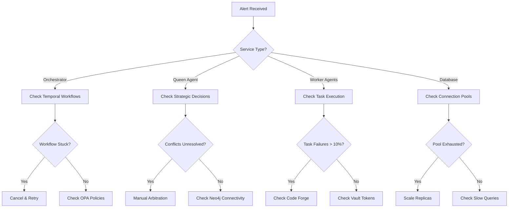

```mermaid
graph TD
    A[Alert Received] --> B{Service Type?}
    B -->|Orchestrator| C[Check Temporal Workflows]
    B -->|Queen Agent| D[Check Strategic Decisions]
    B -->|Worker Agents| E[Check Task Execution]
    B -->|Database| F[Check Connection Pools]
    
    C --> G{Workflow Stuck?}
    G -->|Yes| H[Cancel & Retry]
    G -->|No| I[Check OPA Policies]
    
    D --> J{Conflicts Unresolved?}
    J -->|Yes| K[Manual Arbitration]
    J -->|No| L[Check Neo4j Connectivity]
    
    E --> M{Task Failures > 10%?}
    M -->|Yes| N[Check Code Forge]
    M -->|No| O[Check Vault Tokens]
    
    F --> P{Pool Exhausted?}
    P -->|Yes| Q[Scale Replicas]
    P -->|No| R[Check Slow Queries]
```
