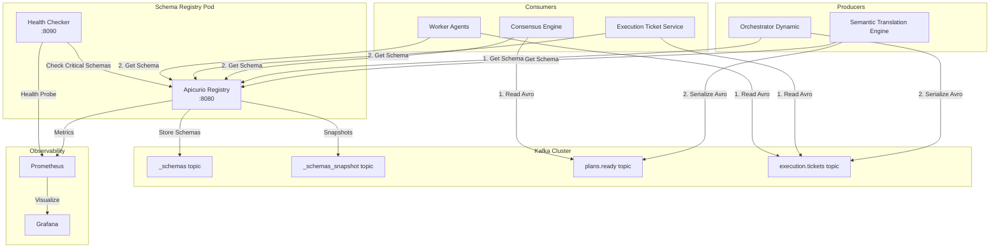
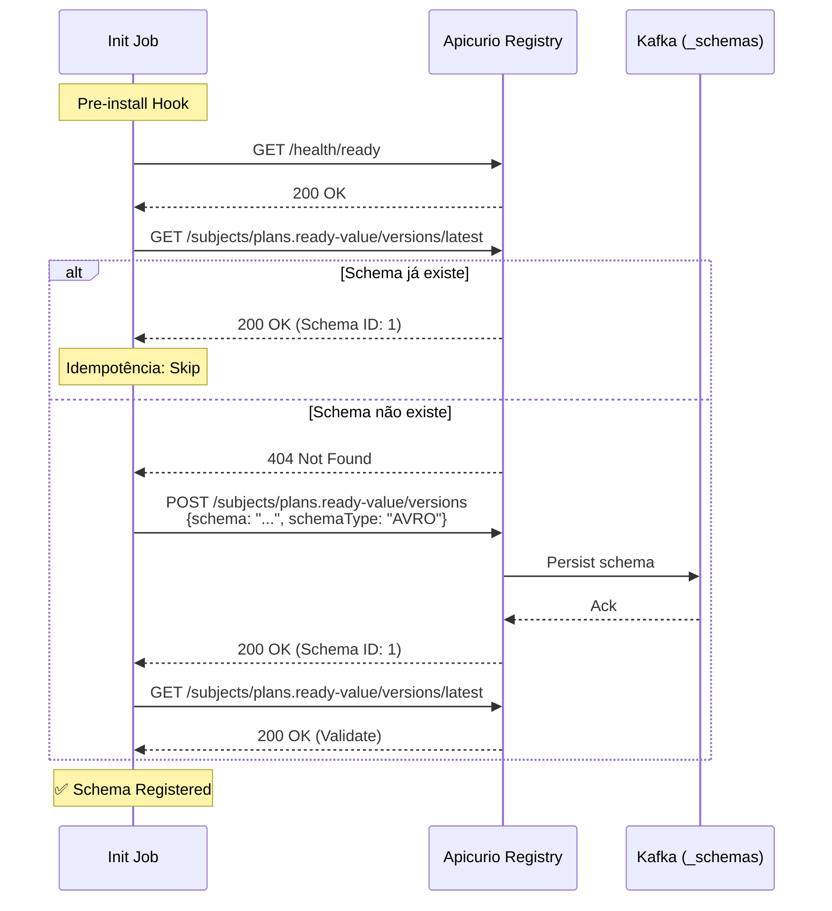
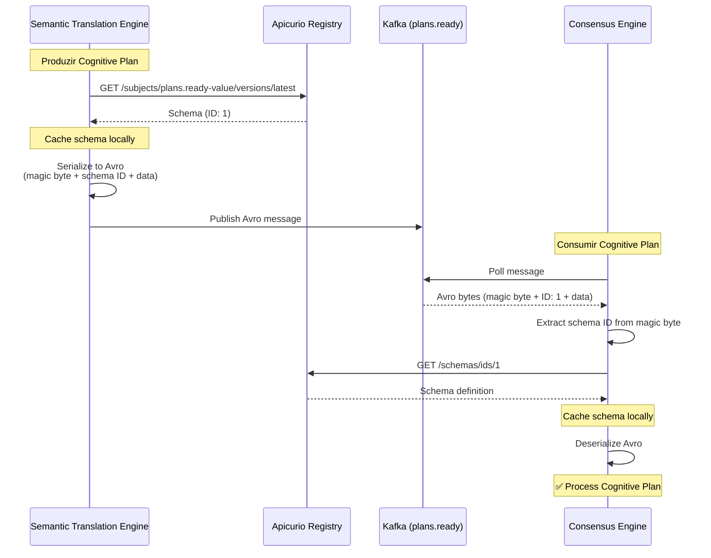

# Schema Registry Guide

> **Apicurio Registry 2.5.11** com API de Compatibilidade Confluent para gerenciamento centralizado de schemas Avro no Neural Hive-Mind.

## Índice

1. [Visão Geral](#visão-geral)
2. [Arquitetura e Componentes](#arquitetura-e-componentes)
3. [Fluxos de Serialização Avro](#fluxos-de-serialização-avro)
4. [Schemas Disponíveis](#schemas-disponíveis)
5. [Processo de Registro de Novos Schemas](#processo-de-registro-de-novos-schemas)
6. [Comandos Úteis para Debug](#comandos-úteis-para-debug)
7. [Configuração de Serviços](#configuração-de-serviços)
8. [Evolução de Schemas](#evolução-de-schemas)
9. [Referências](#referências)

---

## Visão Geral

O Neural Hive-Mind utiliza **Apicurio Registry 2.5.11** como servidor centralizado de schemas Avro, fornecendo:

- **Validação de Schema**: Garante que mensagens Kafka seguem estrutura definida
- **Evolução Compatível**: Suporta mudanças controladas em schemas sem quebrar consumers
- **Redução de Payload**: Serialização binária Avro reduz tamanho de mensagens em ~60%
- **Type Safety**: Schemas fornecem contratos tipados entre producers e consumers
- **API Confluent-Compatible**: Compatível com clientes `confluent-kafka` existentes

### Componentes Integrados

| Serviço | Papel | Schema Principal |
|---------|-------|------------------|
| Semantic Translation Engine | Producer de Cognitive Plans | `cognitive-plan.avsc` |
| Consensus Engine | Consumer de Cognitive Plans | `cognitive-plan.avsc` |
| Orchestrator Dynamic | Producer de Execution Tickets | `execution-ticket.avsc` |
| Execution Ticket Service | Consumer de Execution Tickets | `execution-ticket.avsc` |
| Worker Agents | Consumers de Execution Tickets | `execution-ticket.avsc` |

---

## Arquitetura e Componentes



### Apicurio Registry

- **Imagem**: `apicurio/apicurio-registry-mem:2.5.11.Final`
- **Porta**: 8080 (API principal)
- **Storage Backend**: KafkaSQL (topics `_schemas` e `_schemas_snapshot`)
- **API**: Confluent-compatible (`/apis/ccompat/v6/`)

### Health Checker Sidecar

Container sidecar customizado que monitora schemas críticos:

- **Porta**: 8090
- **Endpoint**: `/health/schemas`
- **Schemas Monitorados**: `plans.ready-value`, `execution.tickets-value`
- **Intervalo**: 60 segundos

### Observabilidade

- **Métricas**: Micrometer (expostas em `/q/metrics`)
- **Traces**: OpenTelemetry (configurável)
- **ServiceMonitor**: Prometheus scraping habilitado
- **Alertas**: 8 PrometheusRules configurados

---

## Fluxos de Serialização Avro

### Fluxo de Registro de Schema



### Fluxo de Produção (Serialização)



### Formato de Mensagem Avro

```
+---+---+---+---+---+---+---+---+---+---+---+---+---+---+---+---+
| 0 |     Schema ID (4 bytes)     |      Avro Data (N bytes)    |
+---+---+---+---+---+---+---+---+---+---+---+---+---+---+---+---+
  ^
  |
  Magic Byte (0x00)
```

- **Byte 0**: Magic byte (`0x00`) indica formato Confluent
- **Bytes 1-4**: Schema ID (big-endian)
- **Bytes 5+**: Dados Avro serializados

---

## Schemas Disponíveis

### Schemas Críticos (Monitorados)

| Schema | Subject | Tópico Kafka | Producers | Consumers |
|--------|---------|--------------|-----------|-----------|
| `cognitive-plan.avsc` | `plans.ready-value` | `plans.ready` | Semantic Translation Engine | Consensus Engine |
| `execution-ticket.avsc` | `execution.tickets-value` | `execution.tickets` | Orchestrator Dynamic | Execution Ticket Service, Worker Agents |

### Todos os Schemas

```
schemas/
├── cognitive-plan/
│   └── cognitive-plan.avsc          # Planos cognitivos (Fluxo B)
├── execution-ticket/
│   └── execution-ticket.avsc        # Tickets de execução (Fluxo C)
├── intent-envelope/
│   └── intent-envelope.avsc         # Envelopes de intenção (Fluxo A)
├── consensus-vote/
│   └── consensus-vote.avsc          # Votos de consenso
├── execution-result/
│   └── execution-result.avsc        # Resultados de execução
├── agent-heartbeat/
│   └── agent-heartbeat.avsc         # Heartbeats de agentes
├── task-assignment/
│   └── task-assignment.avsc         # Atribuições de tarefas
├── workflow-state/
│   └── workflow-state.avsc          # Estados de workflow
├── error-event/
│   └── error-event.avsc             # Eventos de erro
├── audit-log/
│   └── audit-log.avsc               # Logs de auditoria
└── ... (outros schemas)
```

---

## Processo de Registro de Novos Schemas

### Passo 1: Criar Arquivo `.avsc`

Crie o arquivo de schema em `schemas/<schema-name>/<schema-name>.avsc`:

```json
{
  "type": "record",
  "name": "MyNewSchema",
  "namespace": "com.neuralhivemind.schemas",
  "fields": [
    {"name": "id", "type": "string"},
    {"name": "timestamp", "type": "long", "logicalType": "timestamp-millis"},
    {"name": "data", "type": "string"},
    {"name": "optionalField", "type": ["null", "string"], "default": null}
  ]
}
```

### Passo 2: Validar Schema Localmente

```bash
# Usando fastavro (Python)
python -c "import fastavro.schema; fastavro.schema.load_schema('schemas/my-new-schema/my-new-schema.avsc')"

# Ou usando avro-tools (Java)
java -jar avro-tools-1.11.0.jar compile schema schemas/my-new-schema/my-new-schema.avsc .
```

### Passo 3: Atualizar ConfigMap no Init Job

```bash
# Sincronizar schemas com o ConfigMap
make sync-schemas

# Ou manualmente
kubectl create configmap schema-files -n kafka \
  --from-file=schemas/ \
  --dry-run=client -o yaml | kubectl apply -f -
```

### Passo 4: Registrar via Init Job

```bash
# Aplicar init job
kubectl apply -f k8s/jobs/schema-registry-init-job.yaml

# Acompanhar logs
kubectl logs -n kafka job/schema-registry-init -f
```

### Passo 5: Verificar Registro

```bash
# Listar subjects
kubectl exec -n kafka $(kubectl get pods -n kafka -l app=apicurio-registry -o jsonpath='{.items[0].metadata.name}') -- \
  curl -s http://localhost:8080/apis/ccompat/v6/subjects | jq .

# Verificar schema específico
kubectl exec -n kafka $(kubectl get pods -n kafka -l app=apicurio-registry -o jsonpath='{.items[0].metadata.name}') -- \
  curl -s http://localhost:8080/apis/ccompat/v6/subjects/my-new-schema-value/versions/latest | jq .
```

### Passo 6: Atualizar Producer/Consumer

```python
# Producer
from confluent_kafka import SerializingProducer
from confluent_kafka.schema_registry import SchemaRegistryClient
from confluent_kafka.schema_registry.avro import AvroSerializer

schema_registry_client = SchemaRegistryClient({'url': os.getenv('SCHEMA_REGISTRY_URL')})

with open('/app/schemas/my-new-schema/my-new-schema.avsc') as f:
    schema_str = f.read()

avro_serializer = AvroSerializer(schema_registry_client, schema_str)

producer = SerializingProducer({
    'bootstrap.servers': os.getenv('KAFKA_BOOTSTRAP_SERVERS'),
    'value.serializer': avro_serializer
})
```

### Passo 7: Adicionar Testes de Integração

```python
# test_my_new_schema.py
def test_schema_registration():
    client = SchemaRegistryClient({'url': SCHEMA_REGISTRY_URL})
    schema = client.get_latest_version('my-new-schema-value')
    assert schema is not None
    assert schema.schema_type == 'AVRO'

def test_avro_serialization():
    # Testar serialização e deserialização round-trip
    ...
```

---

## Comandos Úteis para Debug

### Listar Todos os Subjects

```bash
kubectl exec -n kafka $(kubectl get pods -n kafka -l app=apicurio-registry -o jsonpath='{.items[0].metadata.name}') -- \
  curl -s http://localhost:8080/apis/ccompat/v6/subjects | jq .
```

### Obter Versões de um Subject

```bash
kubectl exec -n kafka $(kubectl get pods -n kafka -l app=apicurio-registry -o jsonpath='{.items[0].metadata.name}') -- \
  curl -s http://localhost:8080/apis/ccompat/v6/subjects/plans.ready-value/versions | jq .
```

### Obter Schema Específico

```bash
# Por subject e versão
kubectl exec -n kafka $(kubectl get pods -n kafka -l app=apicurio-registry -o jsonpath='{.items[0].metadata.name}') -- \
  curl -s http://localhost:8080/apis/ccompat/v6/subjects/plans.ready-value/versions/1 | jq .

# Por schema ID
kubectl exec -n kafka $(kubectl get pods -n kafka -l app=apicurio-registry -o jsonpath='{.items[0].metadata.name}') -- \
  curl -s http://localhost:8080/apis/ccompat/v6/schemas/ids/1 | jq .
```

### Verificar Health do Registry

```bash
# Health principal
kubectl exec -n kafka $(kubectl get pods -n kafka -l app=apicurio-registry -o jsonpath='{.items[0].metadata.name}') -- \
  curl -s http://localhost:8080/health/ready | jq .

# Health de schemas críticos (via sidecar)
kubectl exec -n kafka $(kubectl get pods -n kafka -l app=apicurio-registry -o jsonpath='{.items[0].metadata.name}') -c schema-health-checker -- \
  curl -s http://localhost:8090/health/schemas | jq .
```

### Testar Serialização Avro Localmente

```bash
python -c "
from confluent_kafka.schema_registry import SchemaRegistryClient
client = SchemaRegistryClient({'url': 'http://localhost:8081'})
print('Subjects:', client.get_subjects())
"
```

### Consumir Mensagens Avro do Kafka

```bash
kafka-avro-console-consumer --bootstrap-server localhost:9092 \
  --topic plans.ready \
  --property schema.registry.url=http://localhost:8081 \
  --from-beginning \
  --max-messages 5
```

### Verificar Métricas do Registry

```bash
kubectl exec -n kafka $(kubectl get pods -n kafka -l app=apicurio-registry -o jsonpath='{.items[0].metadata.name}') -- \
  curl -s http://localhost:8080/q/metrics | grep registry_artifacts
```

---

## Configuração de Serviços

### Variáveis de Ambiente

| Variável | Descrição | Valor Padrão |
|----------|-----------|--------------|
| `SCHEMA_REGISTRY_URL` | URL do Apicurio Registry | `http://schema-registry.kafka.svc.cluster.local:8081` |
| `KAFKA_BOOTSTRAP_SERVERS` | Servidores Kafka | `neural-hive-kafka.kafka.svc.cluster.local:9092` |
| `AVRO_SCHEMA_PATH` | Path para arquivo de schema | `/app/schemas/<schema>/<schema>.avsc` |

### Semantic Translation Engine

```yaml
# services/semantic-translation-engine/k8s/deployment.yaml
env:
  - name: SCHEMA_REGISTRY_URL
    value: "http://schema-registry.kafka.svc.cluster.local:8081"
  - name: AVRO_SCHEMA_PATH
    value: "/app/schemas/cognitive-plan/cognitive-plan.avsc"
```

**Código**: `services/semantic-translation-engine/src/producers/plan_producer.py`
- Subject: `plans.ready-value`
- Tópico: `plans.ready`

### Consensus Engine

```yaml
# services/consensus-engine/k8s/deployment.yaml
env:
  - name: SCHEMA_REGISTRY_URL
    value: "http://schema-registry.kafka.svc.cluster.local:8081"
  - name: AVRO_SCHEMA_PATH
    value: "/app/schemas/cognitive-plan/cognitive-plan.avsc"
```

**Código**: `services/consensus-engine/src/consumers/plan_consumer.py`
- Consumer Group: `consensus-engine`
- Subject: `plans.ready-value`

### Orchestrator Dynamic

```yaml
# services/orchestrator-dynamic/k8s/deployment.yaml
env:
  - name: SCHEMA_REGISTRY_URL
    value: "http://schema-registry.kafka.svc.cluster.local:8081"
  - name: AVRO_SCHEMA_PATH
    value: "/app/schemas/execution-ticket/execution-ticket.avsc"
```

**Código**: `services/orchestrator-dynamic/src/producers/ticket_producer.py`
- Subject: `execution.tickets-value`
- Tópico: `execution.tickets`

### Configuração por Ambiente

| Ambiente | Schema Registry URL | Kafka Bootstrap |
|----------|---------------------|-----------------|
| **dev** | `http://localhost:8081` | `localhost:9092` |
| **staging** | `http://schema-registry.kafka.svc.cluster.local:8081` | `neural-hive-kafka.kafka.svc.cluster.local:9092` |
| **prod** | `http://schema-registry.kafka.svc.cluster.local:8081` | `neural-hive-kafka.kafka.svc.cluster.local:9092` |

---

## Evolução de Schemas

### Regras de Compatibilidade

O Apicurio Registry suporta os seguintes modos de compatibilidade:

| Modo | Descrição | Quando Usar |
|------|-----------|-------------|
| **BACKWARD** | Novos consumers podem ler mensagens antigas | Adicionar campos opcionais |
| **FORWARD** | Consumers antigos podem ler mensagens novas | Remover campos opcionais |
| **FULL** | Backward + Forward | Máxima compatibilidade |
| **NONE** | Sem verificação | Apenas para desenvolvimento |

**Configuração padrão**: `BACKWARD`

### Adicionar Campos Opcionais (BACKWARD-compatible)

```json
// Versão 1
{
  "type": "record",
  "name": "CognitivePlan",
  "fields": [
    {"name": "id", "type": "string"},
    {"name": "content", "type": "string"}
  ]
}

// Versão 2 (BACKWARD-compatible)
{
  "type": "record",
  "name": "CognitivePlan",
  "fields": [
    {"name": "id", "type": "string"},
    {"name": "content", "type": "string"},
    {"name": "priority", "type": ["null", "int"], "default": null}  // Novo campo opcional
  ]
}
```

### Deprecar Campos

```json
// Marcar campo como deprecated (sem remover)
{
  "name": "oldField",
  "type": ["null", "string"],
  "default": null,
  "doc": "DEPRECATED: Use newField instead. Will be removed in v3."
}
```

### Versionamento Semântico

| Mudança | Versão | Exemplo |
|---------|--------|---------|
| Patch | 1.0.x | Correção de docs, aliases |
| Minor | 1.x.0 | Adicionar campo opcional |
| Major | x.0.0 | Breaking change (novo subject) |

### Exemplo Prático: Evolução do cognitive-plan.avsc

```bash
# 1. Verificar versão atual
kubectl exec -n kafka $REGISTRY_POD -- \
  curl -s http://localhost:8080/apis/ccompat/v6/subjects/plans.ready-value/versions/latest | jq .version

# 2. Testar compatibilidade antes de registrar
kubectl exec -n kafka $REGISTRY_POD -- \
  curl -X POST -H "Content-Type: application/json" \
  -d '{"schema": "{...novo schema...}"}' \
  http://localhost:8080/apis/ccompat/v6/compatibility/subjects/plans.ready-value/versions/latest | jq .

# 3. Se compatível, registrar nova versão
kubectl exec -n kafka $REGISTRY_POD -- \
  curl -X POST -H "Content-Type: application/json" \
  -d '{"schema": "{...novo schema...}", "schemaType": "AVRO"}' \
  http://localhost:8080/apis/ccompat/v6/subjects/plans.ready-value/versions | jq .
```

---

## Referências

### Documentação Interna

- [Avro Migration Guide](AVRO_MIGRATION_GUIDE.md) - Guia de migração para Avro
- [Kafka Client Decision](KAFKA_CLIENT_DECISION.md) - Decisão arquitetural sobre clientes Kafka
- [Operations Runbook](operations/schema-registry-operations.md) - Procedimentos operacionais
- [Troubleshooting Guide](operations/schema-registry-troubleshooting.md) - Resolução de problemas

### Arquivos de Configuração

- `k8s/jobs/schema-registry-init-job.yaml` - Job de inicialização de schemas
- `k8s/apicurio-registry-deployment.yaml` - Deployment do Apicurio Registry
- `prometheus-rules/schema-registry-alerts.yaml` - Alertas PrometheusRule

### Documentação Externa

- [Apicurio Registry Documentation](https://www.apicur.io/registry/docs/)
- [Confluent Schema Registry API](https://docs.confluent.io/platform/current/schema-registry/develop/api.html)
- [Apache Avro Specification](https://avro.apache.org/docs/current/spec.html)
- [Avro Schema Evolution](https://docs.confluent.io/platform/current/schema-registry/avro.html)
