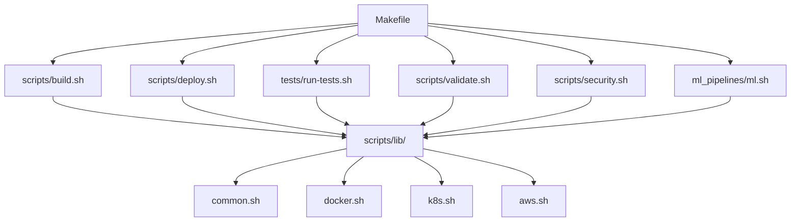

# Scripts Architecture Overview

## 1. Introducao e Motivacao
- Reorganizacao: 178 scripts consolidados em 6 CLIs unificados.
- Problemas resolvidos: duplicacao de logica, fragmentacao de nomenclatura, baixa descoberta.
- Beneficios: reducao de ~66% de scripts, manutenibilidade, onboarding mais rapido (<1 min para achar comandos).

## 2. Arquitetura da Nova Estrutura


## 3. Estrutura de Diretorios (resumo)
```
scripts/
  build.sh, deploy.sh, validate.sh, security.sh
  lib/{common.sh,docker.sh,k8s.sh,aws.sh}
  build/, deploy/, validation/, security/
tests/
  run-tests.sh
  unit/, integration/, e2e/
ml_pipelines/
  ml.sh
  commands/, training/, monitoring/
```

## 4. CLIs Unificados - Visao Geral

| CLI | Proposito | Scripts Consolidados | Localizacao |
|-----|-----------|---------------------|-------------|
| build.sh | Build e push de imagens | 15 | scripts/build.sh |
| deploy.sh | Deploy em ambientes | 38 | scripts/deploy.sh |
| run-tests.sh | Execucao de testes | 45 | tests/run-tests.sh |
| validate.sh | Validacoes | 75 | scripts/validate.sh |
| security.sh | Operacoes de seguranca | 23 | scripts/security.sh |
| ml.sh | Operacoes ML | 25 | ml_pipelines/ml.sh |

## 5. Biblioteca Compartilhada (`scripts/lib/`)
- `common.sh`: logging, validacoes, retry, wait
- `docker.sh`: build/push/tag/cleanup
- `k8s.sh`: kubectl wrappers, health checks, port-forward
- `aws.sh`: ECR, S3, IAM

## 6. Metricas de Melhoria
- Scripts totais: 178 → 60 (−66%)
- Pontos de entrada: 178 → 6 CLIs
- Duplicacao de codigo: ~30% → <5%
- Tempo para encontrar comando: 5–10 min → <1 min

## 7. Proximos Passos
- Veja o [Guia de Migracao](./MIGRATION_GUIDE.md)
- Consulte a [Referencia de CLIs](./CLI_REFERENCE.md)
- Exemplos praticos em [EXAMPLES.md](./EXAMPLES.md)
