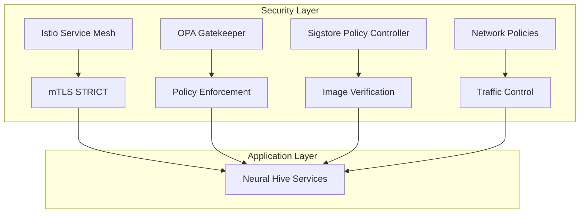

# Neural Hive-Mind - Security & Governance Implementation

## Visão Geral

Este documento descreve a implementação completa da camada de segurança e governança Zero Trust para o projeto Neural Hive-Mind. A arquitetura implementa múltiplas camadas de segurança incluindo mTLS, verificação de assinatura de imagens, network policies e enforcement automático de políticas de segurança.

## Arquitetura Zero Trust

### Princípios Implementados

1. **Never Trust, Always Verify**: Toda comunicação é validada via mTLS
2. **Least Privilege Access**: Network policies deny-by-default
3. **Assume Breach**: Múltiplas camadas de validação
4. **Verify Explicitly**: Assinatura obrigatória de imagens
5. **Use Least Privileged Access**: RBAC e service accounts mínimos

### Componentes de Segurança



## Webhook Certificate Management Strategy

### Overview

All admission webhooks in the Neural Hive-Mind system use a unified certificate management strategy to ensure secure communication between the Kubernetes API server and webhook endpoints. This strategy leverages cert-manager for automatic certificate lifecycle management.

### Certificate Management Approach

**Primary Strategy**: Centralized cert-manager with automatic rotation

1. **cert-manager**: Handles all webhook certificate generation and rotation
2. **Self-signed CA**: Used for internal webhook certificates
3. **Automatic rotation**: Certificates rotate every 90 days
4. **Secret management**: Certificates stored as Kubernetes secrets

### Webhook Components

| Component | Namespace | Port | Certificate Secret | Management |
|-----------|-----------|------|-------------------|-------------|
| OPA Gatekeeper | gatekeeper-system | 8443 | gatekeeper-webhook-server-cert | cert-manager |
| Sigstore Policy Controller | cosign-system | 9443 | policy-controller-webhook-certs | cert-manager (Helm chart) |
| cert-manager webhook | cert-manager | 10250 | cert-manager-webhook-ca | self-managed |

### Implementation Details

1. **cert-manager Configuration**:
   - Installed via Helm with webhook TLS enabled
   - Self-signed issuer for webhook certificates
   - **OPA Gatekeeper**: Certificate created by cert-manager setup script
   - **Sigstore Policy Controller**: Certificate created by Helm chart template when `tls.certManager: true`

2. **Webhook Configuration**:
   - Each webhook configured to use cert-manager generated certificates
   - caBundle automatically injected by cert-manager
   - Webhook configurations reference the appropriate secret
   - **Sigstore webhook**: Certificate provisioned by Helm chart when `tls.certManager: true`

3. **Certificate Lifecycle**:
   - Certificates valid for 90 days
   - Automatic renewal 30 days before expiration
   - Zero-downtime rotation through secret updates

### Monitoring and Alerts

- Certificate expiration alerts configured in Prometheus
- cert-manager metrics exposed for monitoring
- Webhook certificate health checks in validation scripts

### Troubleshooting

Common issues and resolutions:

1. **Certificate not found**: Check cert-manager logs and Certificate resource status
2. **Webhook failures**: Verify secret exists and contains valid cert/key
3. **Rotation issues**: Check cert-manager ClusterIssuer status

### Security Considerations

- Webhook certificates are internal only (not exposed externally)
- Short-lived certificates (90 days) reduce exposure window
- Automatic rotation eliminates manual certificate management risks
- Secrets are encrypted at rest in etcd

## Componentes Implementados

### 1. Istio Service Mesh

**Função**: Implementa mTLS automático entre todos os serviços

**Configuração**:
- mTLS STRICT globalmente ativo
- PeerAuthentication políticas por namespace
- AuthorizationPolicy para controle de acesso granular

**Namespaces Cobertos**:
- `neural-hive-cognition`
- `neural-hive-orchestration`
- `neural-hive-execution`
- `neural-hive-observability`
- `cosign-system`
- `gatekeeper-system`

**Validação**:
```bash
# Verificar status mTLS
kubectl get peerauthentication -A

# Testar conectividade mTLS
scripts/validation/test-mtls-connectivity.sh
```

### 2. OPA Gatekeeper

**Função**: Enforcement automático de políticas de segurança e compliance

**Políticas Implementadas**:

#### mTLS Enforcement Policy
- **Template**: `NeuralHiveMTLSRequired`
- **Constraint**: `enforce-mtls-strict`
- **Escopo**: Todos os workloads em namespaces `neural-hive-*`
- **Modo**: `warn` → `enforce` (transição automática após 7 dias)

```yaml
# Exemplo de violação detectada
apiVersion: templates.gatekeeper.sh/v1beta1
kind: NeuralHiveMTLSRequired
metadata:
  name: enforce-mtls-strict
spec:
  enforcementAction: warn  # Transiciona para 'enforce'
  match:
    namespaces: ["neural-hive-*"]
    excludedNamespaces: ["kube-system", "cosign-system", "gatekeeper-system"]
```

#### Image Signature Policy
- **Template**: `NeuralHiveImageSignature`
- **Constraint**: `enforce-signed-images`
- **Requisitos**: Imagens devem ser assinadas via Sigstore/Cosign
- **Registries Permitidos**: ECR privado + registries públicos aprovados

```yaml
# Configuração de registries
parameters:
  allowedRegistries:
    - "123456789012.dkr.ecr.us-east-1.amazonaws.com/"  # ECR privado
    - "gcr.io/projectsigstore/"  # Sigstore components
    - "openpolicyagent/"         # OPA components
  trustedRegistries:
    - "k8s.gcr.io/"
    - "registry.k8s.io/"
```

**Transição Automática**:
```bash
# Verificar políticas elegíveis para transição
scripts/security/transition-policies-to-enforce.sh --dry-run

# Executar transição automática
scripts/security/transition-policies-to-enforce.sh
```

### 3. Sigstore Policy Controller

**Função**: Verificação de assinatura de imagens em tempo real

**Configuração IRSA**:
- IAM Role: `neural-hive-dev-sigstore-policy-controller-*`
- Permissions: KMS decrypt, CloudWatch logs
- Service Account: `sigstore-policy-controller@cosign-system`

**ClusterImagePolicy**:
```yaml
apiVersion: cosign.sigstore.dev/v1beta1
kind: ClusterImagePolicy
metadata:
  name: neural-hive-image-policy
spec:
  images:
  - glob: "123456789012.dkr.ecr.us-east-1.amazonaws.com/*"
  authorities:
  - keyless:
      url: https://fulcio.sigstore.dev
      identities:
      - issuer: https://github.com/login/oauth
        subject: "^https://github.com/neural-hive-mind/.*"
```

**Validação**:
```bash
# Testar verificação de assinatura
scripts/validation/test-sigstore-verification.sh

# Verificar políticas ativas
kubectl get clusterimagepolicy
```

### 4. Network Policies

**Função**: Implementa isolamento de rede deny-by-default

**Estratégia**:
- Deny all ingress por padrão em todos os namespaces
- Allow específico para comunicações necessárias
- Permitir DNS, observabilidade e Istio control plane

**Políticas por Namespace**:

#### Namespaces de Aplicação
```yaml
# neural-hive-cognition
- allow-from-orchestration (porta 8080, 9090)
- allow-from-istio-ingress
- allow-observability-scraping
- allow-dns-access
- allow-istio-control
```

#### Namespaces de Segurança
```yaml
# cosign-system
- allow-apiserver-webhook (porta 9443)
- allow-sigstore-external-apis (porta 443)
- allow-observability-scraping

# gatekeeper-system
- allow-apiserver-webhook (porta 8443)
- allow-observability-scraping
```

### 5. Cert-Manager Integration

**Função**: Gerenciamento automático de certificados TLS para webhooks

**ClusterIssuers**:
- `selfsigned-cluster-issuer`: Para desenvolvimento
- `letsencrypt-cluster-issuer`: Para produção

**Certificados Automáticos**:
- OPA Gatekeeper webhook TLS
- Sigstore Policy Controller webhook TLS
- Renovação automática (30 dias antes do vencimento)

## Deployment e Configuração

### Scripts de Deployment

#### 1. Deploy Completo da Fundação
```bash
# Deploy completo (infraestrutura + segurança)
scripts/deploy/deploy-foundation.sh

# Apenas camada de segurança
scripts/deploy/deploy-security.sh
```

#### 2. Deploy por Ambiente

**Desenvolvimento**:
```bash
ENV=dev scripts/deploy/deploy-security.sh
```

**Produção**:
```bash
ENV=prod FORCE=true scripts/deploy/deploy-security.sh
```

### Configuração por Ambiente

#### Desenvolvimento (`environments/dev/`)
```yaml
# opa-gatekeeper-values.yaml
enforcementMode: warn
autoEnforce:
  enabled: true
  afterDays: 3  # Transição mais rápida

# sigstore-values.yaml
replicaCount: 1
logging:
  level: debug
clusterImagePolicy:
  authorities:
    - static:
        action: pass  # Mais permissivo para dev
```

#### Produção (`environments/prod/`)
```yaml
# opa-gatekeeper-values.yaml
enforcementMode: warn
autoEnforce:
  enabled: true
  afterDays: 7  # Transição mais lenta

# sigstore-values.yaml
replicaCount: 2
podDisruptionBudget:
  enabled: true
  minAvailable: 1
clusterImagePolicy:
  authorities:
    - static:
        action: fail  # Rejeitar imagens não assinadas
```

## Validação e Monitoramento

### Scripts de Validação

#### 1. Validação Completa de Políticas
```bash
# Executar todas as validações
scripts/validation/validate-policy-enforcement.sh
```

**Testes Executados**:
- ✅ OPA Gatekeeper funcionando
- ✅ Sigstore Policy Controller ativo
- ✅ Violação de mTLS detectada
- ✅ Imagem não assinada rejeitada
- ✅ Network policies funcionando
- ✅ Constraint violations consultadas

#### 2. Validação Específica Sigstore
```bash
# Testar apenas verificação de assinatura
scripts/validation/test-sigstore-verification.sh
```

#### 3. Validação mTLS
```bash
# Testar conectividade mTLS
scripts/validation/test-mtls-connectivity.sh
```

### Monitoramento Contínuo

#### Métricas OPA Gatekeeper
```bash
# Violações por constraint
kubectl get constraints -A -o custom-columns=NAME:.metadata.name,VIOLATIONS:.status.totalViolations

# Eventos de violação
kubectl get events -A --field-selector reason=ConstraintViolation
```

#### Métricas Sigstore
```bash
# Status das políticas de imagem
kubectl get clusterimagepolicy

# Logs do Policy Controller
kubectl -n cosign-system logs -l app.kubernetes.io/name=policy-controller
```

#### Métricas mTLS
```bash
# Status de PeerAuthentication
kubectl get peerauthentication -A

# Certificados mTLS via Istio
istioctl authn tls-check
```

## Transição warn → enforce

### Processo Automático

O sistema implementa transição automática de políticas do modo `warn` para `enforce`:

```bash
# Verificar políticas elegíveis
scripts/security/transition-policies-to-enforce.sh --dry-run

# Executar transição automática
scripts/security/transition-policies-to-enforce.sh
```

### Critérios para Transição

1. **Idade Mínima**: 7 dias em modo warn (prod) / 3 dias (dev)
2. **Threshold de Violações**: Máximo 10 violações totais
3. **Violações Recentes**: Máximo 5 eventos recentes
4. **Validação Pós-Transição**: Verificação automática de novas violações

### Rollback Automático

```bash
# Transição com rollback automático habilitado
AUTO_ROLLBACK=true scripts/security/transition-policies-to-enforce.sh
```

## Troubleshooting

### Problemas Comuns

#### 1. OPA Gatekeeper Webhook Fails

**Sintomas**:
```
Error from server: admission webhook "validation.gatekeeper.sh" denied the request
```

**Soluções**:
```bash
# Verificar status dos pods
kubectl -n gatekeeper-system get pods

# Verificar certificados
kubectl -n gatekeeper-system get certificates

# Restart do webhook
kubectl -n gatekeeper-system rollout restart deployment/gatekeeper-controller-manager
```

#### 2. Sigstore Image Rejection

**Sintomas**:
```
Error: failed to verify signature: no matching signatures
```

**Soluções**:
```bash
# Verificar ClusterImagePolicy
kubectl get clusterimagepolicy -o yaml

# Verificar logs do Policy Controller
kubectl -n cosign-system logs -l app.kubernetes.io/name=policy-controller

# Assinar imagem manualmente
cosign sign --yes <image-url>
```

#### 3. mTLS Connectivity Issues

**Sintomas**:
```
upstream connect error or disconnect/reset before headers
```

**Soluções**:
```bash
# Verificar PeerAuthentication
kubectl get peerauthentication -A

# Verificar AuthorizationPolicy
kubectl get authorizationpolicy -A

# Testar com istioctl
istioctl proxy-config cluster <pod-name> -n <namespace>
```

#### 4. Network Policy Blocking Traffic

**Sintomas**:
```
Connection timeout ou connection refused
```

**Soluções**:
```bash
# Listar network policies
kubectl get networkpolicies -A

# Verificar labels dos namespaces
kubectl get namespaces --show-labels

# Testar conectividade
kubectl exec -it <pod> -- nc -v <target-ip> <port>
```

### Logs de Debug

#### Habilitar Debug Logging

```bash
# OPA Gatekeeper
kubectl -n gatekeeper-system patch deployment gatekeeper-controller-manager \
  --type='json' -p='[{"op": "replace", "path": "/spec/template/spec/containers/0/args", "value": ["--logtostderr", "--v=3"]}]'

# Sigstore Policy Controller
kubectl -n cosign-system patch deployment sigstore-policy-controller \
  --type='json' -p='[{"op": "replace", "path": "/spec/template/spec/containers/0/env/1/value", "value": "debug"}]'
```

## Manutenção e Atualizações

### Atualizações dos Componentes

#### 1. Atualizar OPA Gatekeeper
```bash
# Via Helm
helm upgrade opa-gatekeeper helm-charts/opa-gatekeeper \
  -n gatekeeper-system \
  --values environments/${ENV}/helm-values/opa-gatekeeper-values.yaml
```

#### 2. Atualizar Sigstore Policy Controller
```bash
# Via Helm
helm upgrade sigstore-policy-controller helm-charts/sigstore-policy-controller \
  -n cosign-system \
  --values environments/${ENV}/helm-values/sigstore-values.yaml
```

#### 3. Atualizar Políticas OPA
```bash
# Aplicar constraint templates atualizados
kubectl apply -f policies/constraint-templates/

# Aplicar constraints atualizados
kubectl apply -f policies/constraints/
```

### Backup e Recovery

#### Backup de Políticas
```bash
# Backup automático via transition script
scripts/security/transition-policies-to-enforce.sh
# Backup criado em: /tmp/opa-policies-backup-YYYYMMDD-HHMMSS/
```

#### Recovery Manual
```bash
# Restaurar constraints
kubectl apply -f /tmp/opa-policies-backup-*/neuralhivemtlsrequired-constraints.yaml

# Restaurar templates
kubectl apply -f /tmp/opa-policies-backup-*/constraint-templates.yaml
```

## Compliance e Auditoria

### Relatórios de Compliance

#### Geração de Relatórios
```bash
# Relatório completo de políticas
scripts/validation/validate-policy-enforcement.sh > security-compliance-report.txt

# Relatório específico Sigstore
scripts/validation/test-sigstore-verification.sh > sigstore-compliance-report.txt
```

#### Auditoria de Violações
```bash
# Violações por período
kubectl get events -A --field-selector reason=ConstraintViolation \
  --sort-by='.lastTimestamp' \
  --since-time="2024-01-01T00:00:00Z"

# Análise de tendências
kubectl get constraints -A -o json | jq '.items[] | {name: .metadata.name, violations: .status.totalViolations}'
```

### Métricas de Segurança

#### KPIs Implementados

1. **Policy Enforcement Rate**: % de recursos em compliance
2. **Image Signature Compliance**: % de imagens assinadas
3. **mTLS Coverage**: % de comunicações com mTLS
4. **Network Policy Coverage**: % de namespaces com policies
5. **Violation Response Time**: Tempo médio para resolução de violações

#### Dashboard Prometheus/Grafana

Métricas expostas pelos componentes:
- `gatekeeper_violations_total`: Total de violações OPA
- `gatekeeper_constraint_evaluation_duration_seconds`: Tempo de avaliação
- `sigstore_policy_controller_verifications_total`: Verificações de assinatura
- `istio_requests_total`: Requisições mTLS

## Integração com CI/CD

### Pipeline de Segurança

#### 1. Build Stage
```yaml
# .github/workflows/security.yml
- name: Sign Container Image
  run: |
    cosign sign --yes ${{ env.IMAGE_URL }}

- name: Verify Image Signature
  run: |
    cosign verify ${{ env.IMAGE_URL }}
```

#### 2. Deploy Stage
```yaml
- name: Validate Security Policies
  run: |
    kubectl apply --dry-run=server -f k8s/manifests/

- name: Test Policy Enforcement
  run: |
    scripts/validation/validate-policy-enforcement.sh
```

### Integração com Registry

#### ECR Integration
```bash
# Configurar registry no constraint
ECR_REGISTRY_URL=$(terraform output -raw registry_urls | jq -r 'values[0]' | cut -d'/' -f1)
sed -i "s|ECR_REGISTRY_URL_PLACEHOLDER|${ECR_REGISTRY_URL}|g" policies/constraints/enforce-signed-images.yaml
```

## Próximos Passos

### Melhorias Planejadas

1. **Integração SIEM**: Envio de logs para sistema central
2. **Automated Response**: Remediation automática de violações
3. **Advanced Policies**: Políticas mais granulares por workload
4. **Multi-Cloud**: Extensão para outros cloud providers
5. **Service Mesh**: Expansão para Consul Connect/Linkerd

### Roadmap de Segurança

#### Q1 2024
- ✅ Implementação OPA Gatekeeper
- ✅ Implementação Sigstore Policy Controller
- ✅ Network Policies deny-by-default
- ✅ mTLS STRICT global

#### Q2 2024
- 🔄 Integração com SIEM/SOC
- 🔄 Políticas de compliance avançadas
- 🔄 Automated incident response
- 🔄 Advanced threat detection

#### Q3 2024
- 📋 Multi-region deployment
- 📋 Disaster recovery procedures
- 📋 Advanced monitoring dashboards
- 📋 Security automation workflows

---

## Contatos e Suporte

**Security Team**: security@neural-hive.local
**DevOps Team**: devops@neural-hive.local
**Documentation**: https://docs.neural-hive.local/security

**Emergency Escalation**: +1-555-SECURITY
**Incident Response**: incident-response@neural-hive.local