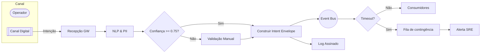
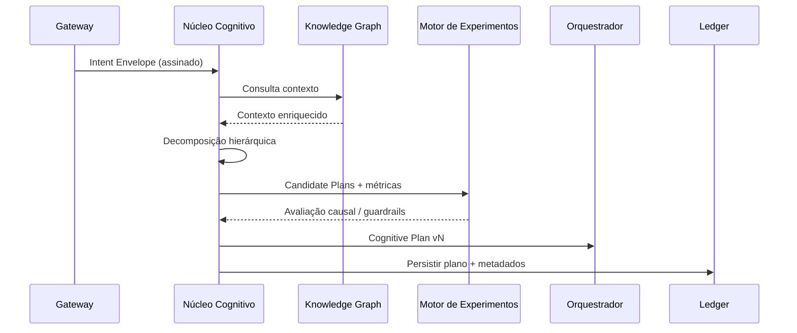
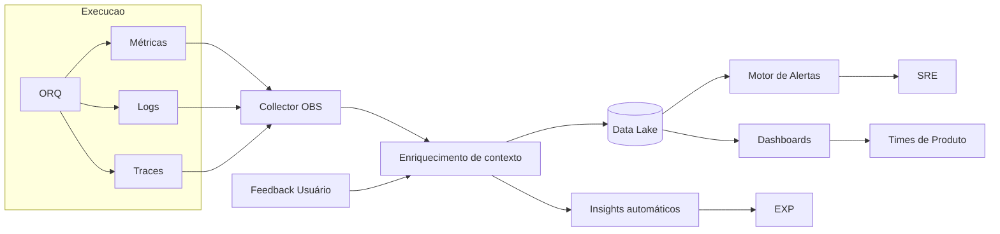
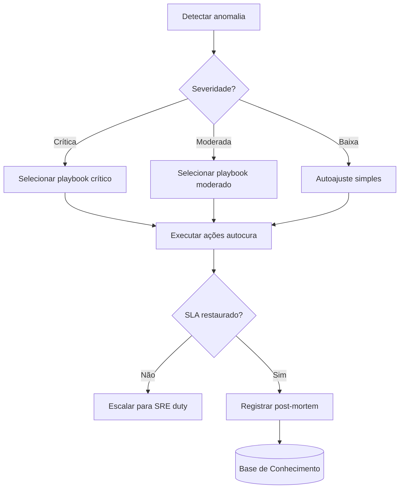
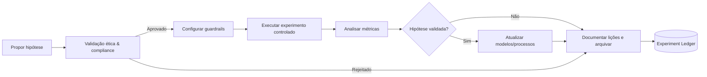

# Documento 06 — Fluxos Operacionais do Aurora OS Neural Hive-Mind

> 📖 **Nota**: Para uma visão técnica detalhada passo a passo de cada fluxo com exemplos de código, schemas e métricas, consulte [docs/FLUXO_COMPLETO_NEURAL_HIVE_MIND.md](docs/FLUXO_COMPLETO_NEURAL_HIVE_MIND.md)

## Sumário Executivo
Este volume consolida os fluxos ponta a ponta que sustentam o Aurora OS Neural Hive-Mind, garantindo rastreabilidade, governança e consistência operacional. Cada fluxo apresenta etapas sequenciais, atores envolvidos, entradas e saídas, regras de negócio, exceções, integrações, métricas de desempenho e diagramas em Mermaid. O documento é autoexplicativo e referenciado cruzadamente, servindo como base para treinamentos técnicos, auditorias regulatórias e alinhamento entre arquitetura, engenharia, SRE, governança e compliance.
- Fluxo A: Captura e normalização de intenções humanas em envelopes canônicos.
- Fluxo B: Geração, priorização e versionamento do plano cognitivo.
- Fluxo C: Orquestração adaptativa de execuções distribuídas.
- Fluxo D: Observabilidade holística e feedback operacional contínuo.
- Fluxo E: Autocura e resolução proativa de incidentes.
- Fluxo F: Gestão de experimentos, guardrails e aprendizado contínuo.

## 1. Introdução
### 1.1 Objetivo
Estabelecer visão detalhada dos processos críticos do Aurora OS Neural Hive-Mind, descrevendo responsabilidades, interações e controles para garantir execução confiável e auditável.

### 1.2 Escopo
- Fluxos internos que manipulam intenções, planos, execuções, telemetria, autocura e experimentação.
- Interações com camadas descritas nos Documentos 01 a 05, assegurando alinhamento terminológico e arquitetural.
- Padrões de monitoramento e métricas associados a cada fluxo.

### 1.3 Fora do Escopo
- Processos de onboarding organizacional e gestão financeira.
- Implementação específica de interfaces de usuário finais (ver Documento 02).
- Detalhes de tuning de modelos e datasets proprietários (ver Documento 03).

### 1.4 Público-Alvo
Arquitetos, engenheiros de software, especialistas neurais, SRE, segurança, compliance, auditores internos e parceiros estratégicos.

## 2. Convenções Utilizadas
- Linguagem técnica e nomenclaturas alinhadas aos documentos anteriores.
- Tabelas para síntese de etapas, papéis e controles.
- Diagramas Mermaid para representar fluxos de decisão ou sequências temporais.
- Referências cruzadas indicadas por “Ver Fluxo X (Seção Y)”.
- Horários expressos em UTC; latências em milissegundos; confiabilidade em porcentagem; taxas em base 100.

### 2.1 Legenda de Atores
| Sigla | Papel | Responsabilidade Primária |
| --- | --- | --- |
| OP | Operador humano autorizado | Interagir com canais digitais e validar intenções ambíguas |
| GW | Gateway de Intenções | Normalizar entradas multicanais e publicar no barramento |
| NLP | Motor NLP/PII | Detectar idioma, entidades e confidencialidade |
| CGN | Núcleo Cognitivo | Gerar e avaliar planos neurais |
| ORQ | Orquestrador Dinâmico | Alocar execuções distribuídas em tempo real |
| SRE | Engenharia de Confiabilidade | Monitorar SLIs/SLOs, disparar autocura |
| OBS | Plataforma de Observabilidade | Capturar métricas, logs e traces |
| EXP | Motor de Experimentos | Gerenciar versões, guardrails e análise causal |
| SEC | Módulo de Segurança | Aplicar políticas de autenticação e autorização |

### 2.2 Tipos de Eventos e Artefatos
| Artefato | Descrição | Produtor Primário | Consumidor Principal |
| --- | --- | --- | --- |
| Intent Envelope | Intenção normalizada com contexto e score | GW | CGN, EXP |
| Cognitive Plan | Conjunto hierárquico de tarefas e dependências | CGN | ORQ |
| Execution Ticket | Ordem de execução com parâmetros e SLAs | ORQ | Serviços distribuídos |
| Telemetry Frame | Pacote de métricas, logs e traces correlacionados | OBS | SRE, EXP |
| Recovery Playbook | Plano automatizado de autocura | SRE | ORQ |
| Experiment Ledger | Registro canônico de experimentos e resultados | EXP | Compliance, CGN |

## 3. Visão Geral dos Fluxos
| Fluxo | Objetivo | Pontos de Contato Críticos | KPI Primário | Referências |
| --- | --- | --- | --- | --- |
| A | Captura e normaliza intenções | Canais digitais, GW, Event Bus | Latência de captura < 200 ms | Ver Seção 4 |
| B | Gera e prioriza planos cognitivos | Intent Envelope, CGN, Knowledge Graph | Taxa de planos aprovados > 97% | Ver Seção 5 |
| C | Orquestra execução distribuída | Cognitive Plan, ORQ, Services Mesh | SLA de execução cumprido > 99% | Ver Seção 6 |
| D | Consolida observabilidade | ORQ, OBS, Data Lake | Cobertura de telemetria > 99,7% | Ver Seção 7 |
| E | Executa autocura proativa | OBS, SRE, Recovery Playbooks | MTTR < 90 s | Ver Seção 8 |
| F | Governa experimentos | EXP, CGN, Compliance | Tempo de análise < 10 min | Ver Seção 9 |

## 4. Fluxo A — Captura e Normalização de Intenções
### 4.1 Descrição Geral
Processo que recebe intenções humanas ou sistêmicas, valida autenticidade, detecta idioma e sensibilidade, enriquece contexto e cria um Intent Envelope idempotente para consumo downstream.

### 4.2 Tabela de Etapas
| Etapa | Objetivo | Atores | Entradas | Saídas | Regras de Negócio | Exceções e Tratamento |
| --- | --- | --- | --- | --- | --- | --- |
| A1 | Recepção multicanal | OP, GW | Texto, voz, sinais IoT | Solicitação bruta | Autenticar sessão, validar certificado mTLS | Canal indisponível → fallback para canal secundário; registrar incidente menor |
| A2 | Pré-processamento linguístico | GW, NLP | Solicitação bruta | Texto normalizado | Detetar idioma, anonimizar PII obrigatória | Texto ilegível → solicitar reformulação automática |
| A3 | Interpretação semântica | GW, Ontologia | Texto normalizado | Intenção preliminar | Mapear entidades para ontologia canônica | Ambiguidade > 0,25 → roteamento para validação manual |
| A4 | Construção do envelope | GW | Intenção preliminar, contexto | Intent Envelope v1 | Carimbar timestamp UTC, score de confiança, idempotency key | Falha de persistência → retry exponencial (3 tentativas) antes de abrir ticket |
| A5 | Publicação no barramento | GW, Event Bus | Intent Envelope v1 | Evento intentions.inbound | Garantir entrega exatamente uma vez | Barramento indisponível > 2s → gravar em fila de contingência e alertar SRE |
| A6 | Auditoria e retenção | GW, SEC | Evento publicado | Log de auditoria | Assinar log com hash SHA-512 | Falha de auditoria → bloquear publicação subsequente até resolução |

### 4.3 Regras, Políticas e Integrações
| Categoria | Detalhe | Integrações |
| --- | --- | --- |
| Autenticação | OAuth2 + mTLS obrigatório para canais digitais | Documento 04, Seção 2; Ver Fluxo C (Seção 6.6) |
| Privacidade | PII mascarada com política dinâmica | Documento 05, Seção 4; Ver Fluxo F (Seção 9.5) |
| Persistência | Intent Envelopes armazenados em KV-store resiliente | Documentos 02 e 05 |

### 4.4 Diagrama Mermaid


### 4.5 Métricas e Monitoramento
- Latência A1→A5 P95 < 200 ms (SLO).
- Taxa de intents rejeitadas < 2% semanal.
- Taxa de retry de publicações < 1% diário.
- Cobertura de logs de auditoria = 100% das intenções.

### 4.6 Exceções e Tratamento de Erros
- **Canal indisponível**: fallback automático + incidente nível baixo na plataforma ITSM.
- **Falha de anonimização**: bloqueio da intenção e notificação à equipe de privacidade.
- **Retries excedidos**: geração de Recovery Playbook (ver Fluxo E, Seção 8.4) para restabelecer barramento.

### 4.7 Dependências e Referências Cruzadas
- Consumo do Intent Envelope: Fluxo B (Seção 5).
- Políticas de segurança: Documento 04, Seção 3.
- Telemetria de captura: Fluxo D (Seção 7.3).

## 5. Fluxo B — Geração e Priorização de Planos Cognitivos
### 5.1 Descrição Geral
O núcleo cognitivo decompõe o Intent Envelope em objetivos hierárquicos, consulta o Knowledge Graph, gera rotas alternativas, calcula custos e prioriza o plano que melhor atende às políticas de risco e SLA.

### 5.2 Tabela de Etapas
| Etapa | Objetivo | Atores | Entradas | Saídas | Regras de Negócio | Exceções e Tratamento |
| --- | --- | --- | --- | --- | --- | --- |
| B1 | Receber Intent Envelope | CGN | Evento intentions.inbound | Contexto de intenção | Validar assinatura e idempotência | Envelope inválido → descartar e notificar Fluxo A |
| B2 | Enriquecer contexto | CGN, Knowledge Graph | Contexto de intenção | Contexto enriquecido | Buscar histórico relevante < 50 ms | Timeout → usar cache local |
| B3 | Decompor objetivo | CGN | Contexto enriquecido | Grafo de tarefas | Garantir granularidade mínima | Falha neural → fallback para heurística determinística |
| B4 | Avaliar alternativas | CGN, EXP | Grafo de tarefas | Planos candidatos | Aplicar política de risco e custo | Divergência > 5% → solicitar revisão humana |
| B5 | Selecionar e versionar plano | CGN | Planos candidatos | Cognitive Plan vN | Registrar metadados, weightings | Persistência obrigatória em ledger imutável |
| B6 | Publicar plano | CGN, Event Bus | Cognitive Plan vN | Evento plans.ready | Garantir compatibilidade com ORQ schema | Falha de compatibilidade → abrir incidente para arquitetura |

### 5.3 Regras Complementares
- Modelos cognitivos só executam se alinhados à política de confiança (score > 0,8).
- Cada plano recebe `plan_id`, `intent_id`, `version`, `valid_until`, `risk_band`.
- Integração com módulo de explicabilidade gera `explainability_token`.

### 5.4 Diagrama Mermaid


### 5.5 Métricas e Monitoramento
- Tempo B1→B5 P95 < 120 ms.
- Taxa de planos com fallback heurístico < 3%.
- Divergência entre custo previsto e real < 8%.
- Cobertura de explicabilidade: 100% dos planos versionados.

### 5.6 Exceções e Tratamentos
- **Planos incompatíveis**: bloqueio automático e abertura de Change Advisory.
- **Explicabilidade ausente**: suspensão de execução e verificação compliance.
- **Versionamento duplicado**: reconciliation automático com base no ledger imutável.

### 5.7 Dependências e Referências Cruzadas
- Consumo downstream: Fluxo C (Seção 6).
- Telemetria cognitiva: Fluxo D (Seção 7.4).
- Guardrails de experimentos: Fluxo F (Seção 9).

## 6. Fluxo C — Orquestração de Execução Adaptativa
### 6.1 Descrição Geral
Orquestrador dinâmico interpreta planos cognitivos, instancia tickets de execução distribuída, orquestra serviços especializados e monitora SLAs, reagindo a mudanças contextuais em tempo real.

### 6.2 Tabela de Etapas
| Etapa | Objetivo | Atores | Entradas | Saídas | Regras de Negócio | Exceções e Tratamento |
| --- | --- | --- | --- | --- | --- | --- |
| C1 | Receber plano cognitivo | ORQ | Evento plans.ready | Plano ativo | Validar schema e versão | Incompatibilidade → solicitar reemissão ao Fluxo B |
| C2 | Quebrar plano em tickets | ORQ, Service Registry | Plano ativo | Execution Tickets | Garantir dependências topológicas | Ciclos detectados → otimizar grafo |
| C3 | Alocar recursos | ORQ, Scheduler | Execution Tickets | Tickets alocados | Respeitar política de QoS | Saturação → ativar burst capacity |
| C4 | Executar tarefas | Serviços especializados | Tickets alocados | Resultados parciais | Aplicar timeouts específicos | Timeout → retry com política exponencial |
| C5 | Consolidar resultado | ORQ | Resultados parciais | Resultado final | Validar integridade e assinaturas | Resultado inconsistente → acionamento Fluxo E |
| C6 | Publicar telemetria | ORQ, OBS | Resultados e métricas | Telemetry Frames | Garantir correlação com intent_id | Falha de envio → buffer local persistente |

### 6.3 Integrações e Controles
| Categoria | Detalhe | Controles |
| --- | --- | --- |
| QoS | Prioridade baseada em `risk_band` e `customer_tier` | Scheduler hierárquico; monitorar P95 |
| Segurança | Autorização tokenizada com escopo por tarefa | Rotacionar tokens a cada ticket |
| Compliance | Registro de execução em trilha auditável | Logs imutáveis assinados |

### 6.4 Diagrama Mermaid
```mermaid
flowchart TD
    Plan[Cognitive Plan] --> Split{Topologia válida?}
    Split -- Não --> Optimize[Otimizar grafo]
    Optimize --> Split
    Split -- Sim --> Tickets[Gerar Execution Tickets]
    Tickets --> Scheduler[Scheduler dinâmico]
    Scheduler -->|QoS| Services[[Serviços especializados]]
    Services --> Results{SLA cumprido?}
    Results -- Não --> Escalar[Acionar Autocura (Fluxo E)]
    Results -- Sim --> Consolidar[Consolidar resultados]
    Consolidar --> Publish[Publicar telemetria + output]
    Publish --> OBS
    Publish --> Downstream[Consumidores finais]
```

### 6.5 Métricas e Monitoramento
- SLA cumprimento P99 > 99%.
- Requisições alocadas em burst capacity < 5% diário.
- Taxa de tickets reprocessados < 1,5%.
- Integridade de logs: zero discrepâncias por auditoria.

### 6.6 Exceções e Tratamentos
- **Scheduler sobrecarregado**: aciona autoscaling horizontal e notifica SRE.
- **Falha de serviço downstream**: roteia para serviço redundante e registra incidente.
- **Inconsistência de assinatura**: bloqueia distribuição e abre investigação com SEC.

### 6.7 Dependências e Referências Cruzadas
- Entradas: Fluxo B (Seção 5.2).
- Telemetria resultante: Fluxo D (Seção 7.2).
- Autocura: Fluxo E (Seção 8).

## 7. Fluxo D — Observabilidade Holística e Feedback Operacional
### 7.1 Descrição Geral
Plataforma de observabilidade unifica métricas, logs, traces, eventos de auditoria e feedback de usuários, garantindo visão 360° em tempo real e alimentando loops de melhoria contínua.

### 7.2 Tabela de Etapas
| Etapa | Objetivo | Atores | Entradas | Saídas | Regras de Negócio | Exceções e Tratamento |
| --- | --- | --- | --- | --- | --- | --- |
| D1 | Coletar sinais | ORQ, Serviços, SRE | Métricas, logs, traces | Telemetry Frames | Coleta push e pull híbrida | Sinal ausente → alerta síntese |
| D2 | Enriquecer com contexto | OBS | Telemetry Frames | Telemetria correlacionada | Correlacionar por intent_id, plan_id | Falha de correlação → reprocessar usando heurística |
| D3 | Persistir e indexar | OBS, Data Lake | Telemetria correlacionada | Armazenamento estruturado | SLA ingestão < 2 s | Falha ingestão → fallback p/ buffer redundante |
| D4 | Gerar alertas e dashboards | OBS, SRE | Dados indexados | Alertas, dashboards | Regras dinâmicas baseadas em SLO | Falsos positivos > 5% → ajustar limiares |
| D5 | Capturar feedback | OP, Usuário Final | Formulários, NPS, logs de chat | Feedback correlacionado | Vincular a intent_id | Feedback sem vínculo → manual review |
| D6 | Retroalimentar processos | OBS, CGN, EXP | Feedback correlacionado | Insights acionáveis | Priorizar insights com impacto > médio | Insight crítico → pipeline de experimentos (Fluxo F) |

### 7.3 Diagrama Mermaid


### 7.4 Métricas e Monitoramento
- Cobertura de telemetria > 99,7%.
- Tempo de ingestão D1→D3 < 2 s.
- Precisão dos alertas P90 > 95%.
- NPS operacional mínimo 70.

### 7.5 Exceções e Tratamentos
- **Gap de correlação**: pipeline de reconciliação batch executado a cada 5 min.
- **Alertas sem owner**: tratativa via roteamento automático para SRE duty.
- **Feedback crítico**: escalonado para Product Owner com SLA de resposta < 2 h.

### 7.6 Dependências e Referências Cruzadas
- Alimenta Fluxo E (Seção 8.2) e Fluxo F (Seção 9.3).
- Regras de retenção: Documento 05, Seção 5.
- Integridade de auditoria: Documento 04, Seção 6.

## 8. Fluxo E — Autocura e Resolução Proativa de Incidentes
### 8.1 Descrição Geral
Mecanismo automatizado que detecta degradações, seleciona playbooks, executa ações corretivas e valida restauração de SLAs com mínima intervenção humana.

### 8.2 Tabela de Etapas
| Etapa | Objetivo | Atores | Entradas | Saídas | Regras de Negócio | Exceções e Tratamento |
| --- | --- | --- | --- | --- | --- | --- |
| E1 | Detectar anomalia | OBS, SRE | Alertas, telemetria | Evento de anomalia | Thresholds adaptativos | Falsos positivos → recalibrar modelo |
| E2 | Classificar severidade | SRE, SEC | Evento de anomalia | Severidade | Classificação mapeada a runbooks | Severidade desconhecida → acionar duty engineer |
| E3 | Selecionar playbook | SRE, ORQ | Severidade, catálogos | Recovery Playbook | Regras baseadas em impacto e risco | Playbook inexistente → criar stub e notificar engenharia |
| E4 | Executar ações | ORQ, Serviços | Recovery Playbook | Ações aplicadas | Sequenciar ações atomicamente | Falha > 2 tentativas → escalar para humano |
| E5 | Validar restauração | OBS | Ações aplicadas | Status pós-incidente | Confirmar retorno ao SLA | SLA não recuperado → abrir incidente crítico |
| E6 | Documentar lições | SRE, Knowledge Base | Status pós-incidente | Post-mortem resumido | Registro em até 4 h | Atraso → alerta compliance |

### 8.3 Diagrama Mermaid


### 8.4 Métricas e Monitoramento
- Mean Time To Detect (MTTD) < 15 s.
- Mean Time To Recover (MTTR) < 90 s.
- Taxa de automação > 85% das ocorrências.
- Taxa de reincidência < 1% semanal.

### 8.5 Exceções e Tratamentos
- **Playbook desatualizado**: notificar owner, congelar automação específica.
- **Ação incompatível**: rollback automático + alerta SEC.
- **Incidente crítico repetido**: iniciar investigação root cause e criar experimento preventivo (Fluxo F, Seção 9.4).

### 8.6 Dependências e Referências Cruzadas
- Consome telemetria do Fluxo D (Seção 7).
- Interage com ORQ para aplicar ações (Fluxo C, Seção 6.2).
- Post-mortems alimentam experimentos (Fluxo F, Seção 9.2).

## 9. Fluxo F — Gestão de Experimentos e Aprendizado Contínuo
### 9.1 Descrição Geral
Processo que governa criação, execução, monitoramento e encerramento de experimentos controlados, garantindo alinhamento com guardrails éticos e métricas de negócio.

### 9.2 Tabela de Etapas
| Etapa | Objetivo | Atores | Entradas | Saídas | Regras de Negócio | Exceções e Tratamento |
| --- | --- | --- | --- | --- | --- | --- |
| F1 | Propor experimento | EXP, CGN, Produto | Hipótese, objetivos | Proposta registrada | Validar alinhamento estratégico | Hipótese fora de escopo → rejeitar automaticamente |
| F2 | Aprovar e preparar | Compliance, SEC | Proposta registrada | Plano aprovado | Checagem ética e de privacidade | Pendência ética → revisão pelo comitê |
| F3 | Configurar guardrails | EXP, ORQ | Plano aprovado | Configuração ativa | Definir métricas de abandono | Guardrail ausente → bloquear execução |
| F4 | Executar experimento | ORQ, Serviços | Configuração ativa | Dados experimentais | Randomização balanceada | Desequilíbrio > 2% → reamostrar |
| F5 | Analisar resultados | EXP, OBS | Dados experimentais | Relatório causal | Significância estatística > 95% | Resultados inconclusivos → prolongar experimento |
| F6 | Incorporar aprendizado | CGN, Produto | Relatório causal | Atualização de modelos/processos | Atualização somente com evidência | Divergência > 10% entre previsão e real → revisão manual |
| F7 | Encerrar e arquivar | EXP, Compliance | Atualização de modelos | Ledger de experimentos | Retenção mínima 5 anos | Arquivamento falho → alerta compliance |

### 9.3 Diagrama Mermaid


### 9.4 Métricas e Monitoramento
- Lead time F1→F3 < 2 dias úteis.
- Taxa de experimentos aprovados com evidência ética > 99%.
- Tempo de análise F4→F5 < 10 min.
- Aderência a guardrails: 100% dos experimentos auditáveis.

### 9.5 Exceções e Tratamentos
- **Violação de guardrail**: pausa automática e auditoria imediata.
- **Dados sensíveis detectados**: anonimização automática + revisão PII (Fluxo A, Seção 4.2).
- **Inconsistência causal**: disparar investigação com CGN e Produto.

### 9.6 Dependências e Referências Cruzadas
- Utiliza intents e planos dos Fluxos A e B.
- Consome telemetria do Fluxo D.
- Alimenta atualizações de autocura (Fluxo E, Seção 8.5).

## 10. Governança de Métricas, SLAs e Auditoria
- **Catálogo de SLIs/SLOs**: mantido pela equipe SRE, mapeando métricas de cada fluxo; revisado mensalmente.
- **Painéis executivos**: integrados ao Fluxo D, com visões por fluxo, cluster e região.
- **Auditoria interna**: trilhas do Fluxo A (logs), B (ledger), C (tickets), D (data lake), E (post-mortems) e F (experiment ledger) auditadas trimestralmente.
- **KPIs estratégicos**: NPS, custo médio por intenção, compliance rate, taxa de automação e velocidade de aprendizado.
- **Gestão de riscos**: matriz de risco atualizada quando guardrails ou playbooks são alterados.

## 11. Anexos
### 11.1 Matriz RACI por Fluxo
| Fluxo | Responsável (R) | Aprovador (A) | Consultado (C) | Informado (I) |
| --- | --- | --- | --- | --- |
| A | GW Lead | Segurança | SRE, Produto | Compliance |
| B | CGN Lead | Arquitetura | Produto, EXP | Compliance |
| C | ORQ Lead | Arquitetura | Serviços, SRE | Produto |
| D | OBS Lead | SRE | Produto, Compliance | Segurança |
| E | SRE Lead | Segurança | ORQ, OBS | Execução |
| F | EXP Lead | Compliance | Produto, CGN | Gestão Executiva |

### 11.2 Checklist de Auditoria
- Verificar logs assinados de Fluxo A (amostra de 5%).
- Validar versionamento de planos (Fluxo B) versus execuções (Fluxo C).
- Confirmar correlação telemétrica (Fluxo D) com incidentes (Fluxo E).
- Avaliar aprovação ética dos experimentos (Fluxo F).
- Garantir que indicadores críticos estão dentro dos SLOs declarados.

### 11.3 Glossário Resumido
| Termo | Definição |
| --- | --- |
| Intent Envelope | Artefato canônico contendo intenção, contexto, score e metadados de auditoria. |
| Cognitive Plan | Plano hierárquico com tarefas, dependências, risco e SLA. |
| Execution Ticket | Ordem de trabalho granular emitida pelo orquestrador. |
| Telemetry Frame | Registro unificado de métricas, logs e traces correlacionados a uma intenção. |
| Recovery Playbook | Sequência automatizada de ações corretivas aprovadas. |
| Experiment Ledger | Repositório imutável com metadados de experimentos, resultados e aprovações. |
