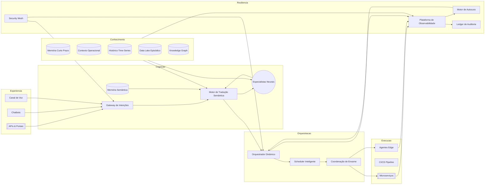
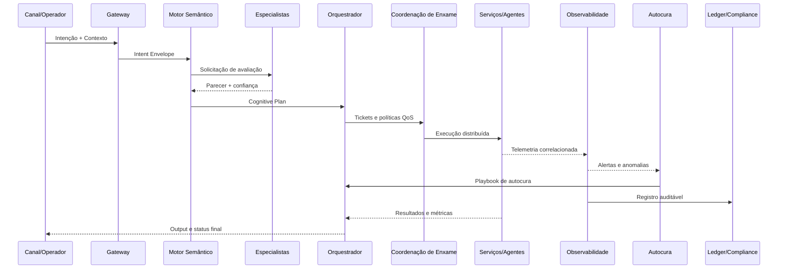
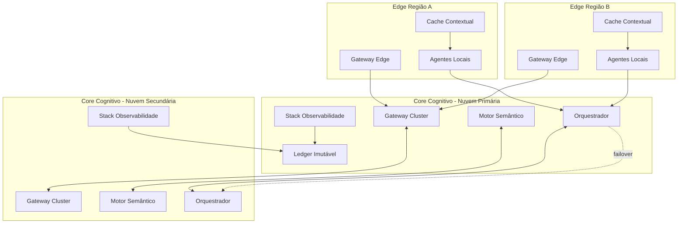
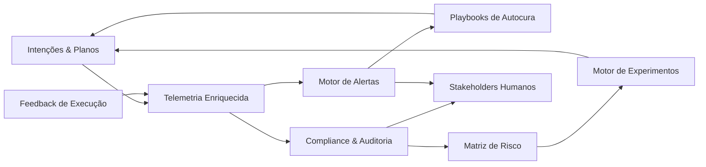
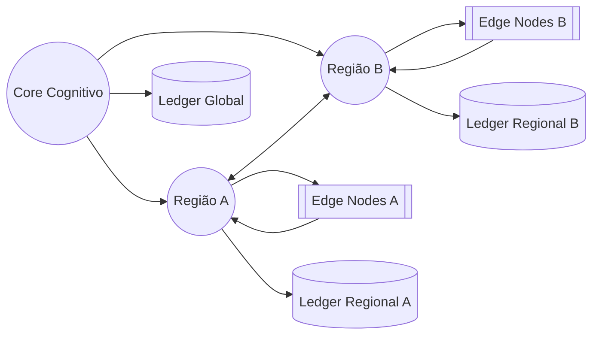

# Documento 07 — Arquitetura de Referência Específica do Aurora OS Neural Hive-Mind

## Sumário Executivo
Este documento consolida a arquitetura de referência prescritiva para o Aurora OS Neural Hive-Mind, estabelecendo camadas, componentes, padrões de integração e controles que materializam o organismo digital em escala. A proposta traduz os princípios descritos nos Documentos 01 a 06 em uma estrutura implementável, com decisões tecnológicas orientadas a desempenho, segurança, governança e evolução contínua. Inclui diagramas Mermaid, tabelas comparativas, métricas recomendadas e um roadmap incremental para implantação.

## 1. Objetivo e Escopo
- **Objetivo**: definir a arquitetura de referência específica, apontando responsabilidades, dependências, padrões e tecnologias que devem ser adotadas de maneira consistente entre iniciativas.
- **Escopo**: camadas centrais do Hive-Mind (experiência, cognição, orquestração, execução, resiliência), subsistemas de dados, segurança, experimentação e governança.
- **Exclusões**: processos operacionais detalhados (ver Documento 05), fluxos de processos (Documento 06) e políticas organizacionais específicas (Documento 04).

## 2. Princípios Arquiteturais Orientadores
| Princípio | Descrição | Implicações Técnicas |
| --- | --- | --- |
| Modularidade Orquestrada | Separação rígida entre camadas e contratos explícitos | Versionamento semântico de APIs, malha de serviços com policies |
| Observabilidade Nativa | Telemetria full-stack desde o design | Instrumentação OpenTelemetry, correlação por `intent_id` e `plan_id` |
| Segurança por Design | Políticas aplicadas em cada fronteira | mTLS, OAuth2, WAF, criptografia em repouso e em trânsito |
| Evolução Contínua | Capacidade de atualização incremental sem downtime | Blue/green, canary, feature flags e experimentação controlada |
| Governança Auditável | Garantia de rastreabilidade ponta a ponta | Ledgers imutáveis, logs assinados, trilhas aprovativas |
| Autonomia Supervisionada | Automação com guardrails humanos | Score de confiança, playbooks de autocura, comitês de mudança |

## 3. Visão Geral da Arquitetura de Referência
### 3.1 Camadas e Responsabilidades
| Camada | Responsabilidades Principais | Componentes Chave |
| --- | --- | --- |
| Experiência | Captura multicanal de intenções, UX contextual | Portais, chatbots, APIs externas, SDKs|
| Cognição | Interpretação semântica, geração de planos e consenso | Gateway de Intenções, Motor de Tradução, Especialistas, Memória Semântica |
| Orquestração | Decomposição de planos, coordenação de enxame, execução distribuída | Orquestrador Dinâmico, Scheduler, Registry de Serviços |
| Execução | Serviços especializados, pipelines de engenharia, agentes | Microserviços, builders, infraestrutura de entrega contínua |
| Resiliência & Governança | Observabilidade, autocura, segurança, compliance | Plataforma OBS, Motor de Autocura, Guardrails, Ledger de Auditoria |
| Conhecimento & Dados | Armazenamento multicamadas, catalogação, lineage | Redis/Hazelcast, Elastic, ClickHouse, Data Lake, Knowledge Graph |

### 3.2 Diagrama Geral
#### 3.2.1 Visão em Camadas

#### 3.2.2 Perspectiva de Fluxo de Dados

#### 3.2.3 Perspectiva de Implantação e Resiliência

#### 3.2.4 Perspectiva de Governança e Observabilidade

## 4. Componentes Fundamentais
### 4.1 Gateway de Intenções
- **Tecnologias sugeridas**: Entradas HTTP/gRPC, WebSockets, ASR (DeepSpeech, Whisper), NLU (spaCy, fastText, transformers especializados).
- **Padrões**: Circuit breaker, retry backoff, canonical message envelope. Compatível com `Intent Envelope` (`documento-02-arquitetura-e-topologias-neural-hive-mind.md:20`).
- **Integrações obrigatórias**: segurança (`documento-04-seguranca-governanca-neural-hive-mind.md:11`), telemetria (`documento-05-implementacao-e-operacao-neural-hive-mind.md:74`).

### 4.2 Motor de Tradução Semântica
- **Stack**: motor híbrido LLM + regras simbólicas; grafos (Neo4j/JanusGraph); caching distribuído.
- **Deliverables**: DAGs com `plan_id`, riscos, explicabilidade integrados (`documento-03-componentes-e-processos-neural-hive-mind.md:12`).
- **Requisitos não-funcionais**: latência <120 ms P95; confiabilidade 99,5%.

### 4.3 Núcleo de Especialistas Neurais
- **Implantação**: contêineres isolados, contrato gRPC, registro dinâmico (`documento-03-componentes-e-processos-neural-hive-mind.md:6`).
- **Operação**: autoescala por demanda cognitiva, versionamento via Model Registry.
- **Governança**: score mínimo de confiança 0,8; guardrails de ética (Fluxo F, Documento 06).

### 4.4 Orquestrador Dinâmico e Coordenação de Enxame
- **Plataforma**: engines event-sourcing (Temporal, Cadence, Akka) conectados à malha de serviços (`documento-02-arquitetura-e-topologias-neural-hive-mind.md:30`).
- **Funções**: decompor planos, gerar execution tickets, garantir QoS (`documento-06-fluxos-processos-neural-hive-mind.md:179`).
- **Resiliência**: replicação ativa, fallback determinístico, compatível com playbooks de autocura (Fluxo E).

### 4.5 Plataforma de Observabilidade e Autocura
- **Componentes**: Collector OpenTelemetry, data lake de telemetria, motor de alertas dinâmicos, acionador de playbooks (`documento-06-fluxos-processos-neural-hive-mind.md:233`, `documento-06-fluxos-processos-neural-hive-mind.md:285`).
- **Métricas chave**: MTTD <15 s, MTTR <90 s.

### 4.6 Gestão de Dados e Conhecimento
- **Estratégia**: memória multicamadas com TTL e políticas de retenção (`documento-03-componentes-e-processos-neural-hive-mind.md:25`).
- **Ferramentas**: Redis/Hazelcast, Elastic/Mongo, ClickHouse/BigQuery, Data Lake Parquet, Knowledge Graph OWL/RDF.
- **Compliance**: anonimização, mascaramento dinâmico, lineage (`documento-04-seguranca-governanca-neural-hive-mind.md:17`).

## 5. Serviços de Suporte e Cross-Cutting Concerns
| Área | Decisões de Referência | Indicadores |
| --- | --- | --- |
| Segurança | Zero trust, IAM centralizado, secret management (Vault/Secrets Manager) | Número de incidentes críticos = 0 |
| Entrega Contínua | GitOps, testes automatizados multilayer, progressive delivery (`documento-05-implementacao-e-operacao-neural-hive-mind.md:42`) | Lead time intenção→deploy < 4h |
| Conformidade | Ledger imutável, trilhas de auditoria (Fluxo A, B, C) | Cobertura de auditoria = 100% |
| Experimentação | Motor EXP integrado aos planos (`documento-06-fluxos-processos-neural-hive-mind.md:331`) | Tempo análise < 10 min |
| Gestão de Custos | Observabilidade financeira, tags obrigatórias, budgets | Custo médio por intenção controlado |

## 6. Topologias de Implantação Preferenciais
| Topologia | Quando Usar | Considerações Técnicas |
| --- | --- | --- |
| Federada | Requisitos regulatórios regionais, baixa latência local | Sincronização eventual do Knowledge Graph, replicação controlada |
| Multi-Cluster Ativo-Ativo | Alta disponibilidade > 99,99%, cobertura multi-cloud | Consenso global (RAFT/etcd), roteamento inteligente em malha |
| Edge-Augmented | Captura de contexto local, restrições de conectividade | Agentes edge com cache local, fallback para core |

### 6.1 Diagrama de Topologia Federada

## 7. Contratos e Padrões de Integração
- **Mensageria**: Kafka/NATS com esquemas Avro/Protobuf versionados; tópicos segregados por domínio.
- **APIs**: gRPC/REST com schema registry central; contratos `Intent Envelope`, `Plan Artifact` e `Execution Event` (`documento-02-arquitetura-e-topologias-neural-hive-mind.md:20`).
- **Eventos**: design orientado a eventos, idempotência e tracing distribuído.
- **Segurança**: autenticação MTLS + OAuth2, política ABAC baseada em contexto.

## 8. Requisitos Não-Funcionais e SLOs
| Categoria | SLO de Referência | Métrica | Ferramentas |
| --- | --- | --- | --- |
| Latência | Captura intenção P95 < 200 ms | Ingestion latency | APM + métricas Gateway |
| Confiabilidade | Disponibilidade global ≥ 99,95% | Uptime SLA | Malha de serviços, health checks |
| Consistência | Divergência plano previsto vs executado < 8% | Delta custo/tempo | Observabilidade + ledger |
| Segurança | 100% das requisições autenticadas | Violação autenticada | WAF, IAM |
| Governança | Auditorias sem findings críticos | # findings | Ledger + relatórios |
| Evolução | Lead time intenção→deploy < 4h | Pipeline metrics | GitOps + CI/CD |

## 9. Governança Arquitetural
- Comitê de Arquitetura define padrões e monitora conformidade trimestralmente.
- Processos ADR (Architecture Decision Record) para decisões significativas.
- Ferramental de compliance contínuo (policy-as-code) que verifica configuração de infra e contratos.
- Portais de arquitetura publicados para equipes de produto, com catálogos reutilizáveis.

## 10. Roadmap de Implantação
| Horizonte | Prioridades | Resultados Esperados |
| --- | --- | --- |
| 0–3 meses | Fundação de infraestrutura, Gateway básico, Observabilidade mínima | Piloto com fluxo A→C validado |
| 3–6 meses | Motor semântico, especialistas iniciais, orquestração completa | Tempo de plano < 400 ms, execuções auditáveis |
| 6–12 meses | Autocura, experimentação, topologia federada | MTTR < 90 s, experimentos em produção |
| >12 meses | Edge, multi-cluster ativo-ativo, meta-aprendizado | Disponibilidade ≥ 99,99%, governança preditiva |

## 11. Matriz de Decisão Tecnológica
| Domínio | Alternativas Avaliadas | Critério de Escolha | Decisão de Referência |
| --- | --- | --- | --- |
| Barramento de Eventos | Kafka, NATS, Pulsar | Latência, ecossistema, suporte | Kafka para core, NATS para edge |
| Engine Orquestração | Temporal, Cadence, Akka | Escalabilidade, SDKs, resiliente | Temporal (Go/Java) |
| Data Lake | Delta Lake, Iceberg, BigQuery | Compatibilidade, custo, governança | Delta Lake em storage compatível |
| Knowledge Graph | Neo4j, JanusGraph, Neptune | Query language, escala, custo | Neo4j para prototipagem, JanusGraph em larga escala |
| Observabilidade | Prometheus+Grafana, Elastic APM, Datadog | STL, custo, correlação | Stack híbrida Prometheus+Grafana + Elastic |
| Segurança | Vault, AWS Secrets Manager, Hashicorp Boundary | Multi-cloud, automação | Vault self-hosted |

## 12. Anexos
### 12.1 Checklist de Conformidade Arquitetural
1. Contratos `Intent Envelope`, `Plan Artifact`, `Execution Event` implementados?
2. Observabilidade integrada com correlação por `intent_id`?
3. Playbooks de autocura registrados no motor?
4. Guardrails de experimentos aprovados pelo comitê?
5. Ledger de auditoria com retenção ≥ 5 anos?

### 12.2 Glossário
| Termo | Definição |
| --- | --- |
| Architecture Decision Record (ADR) | Documento curto que registra contexto, decisão e consequências de escolhas arquiteturais. |
| Edge Node | Agente de execução que opera em ambiente distribuído/geograficamente distante, sincronizando com o core. |
| Policy-as-Code | Estratégia de definir políticas de governança utilizando código versionado e pipelines automáticos. |
| Score de Confiança | Métrica calculada pelos especialistas neurais para indicar confiabilidade da recomendação. |
| Guardrail | Limite ou política automática que restringe execuções fora dos padrões éticos/operacionais. |

---

Esta arquitetura de referência específica fornece aos times do Aurora OS um guia prescritivo para concepção e evolução do Neural Hive-Mind, garantindo consistência técnica, governança auditável e capacidade de evolução contínua.

