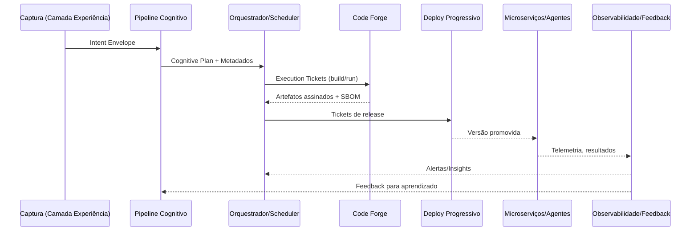

# Documento 08 — Detalhamento Técnico das Camadas do Aurora OS Neural Hive-Mind

## Sumário Executivo
Este documento aprofunda os aspectos técnicos das camadas apresentadas nos diagramas de referência (Documento 07, Seção 3.2), detalhando responsabilidades, componentes, padrões, integrações, requisitos não funcionais, métricas e riscos. O material serve como guia para times de arquitetura, engenharia, SRE, segurança e compliance durante o desenho e a operação do Aurora OS Neural Hive-Mind.

## 1. Introdução
- **Objetivo**: oferecer uma visão técnica aprofundada das camadas de Experiência, Cognição, Orquestração, Execução, Resiliência & Governança e Conhecimento & Dados.
- **Escopo**: aspectos arquiteturais, tecnológicos, operacionais e de governança necessários para materializar cada camada alinhada aos Diagramas 3.2.1 a 3.2.4 do Documento 07.
- **Público-alvo**: arquitetos corporativos, líderes de engenharia, especialistas neurais, DevOps/SRE, times de segurança e auditores técnicos.

## 2. Metodologia e Fontes
| Fonte | Conteúdo Relevante | Uso neste Documento |
| --- | --- | --- |
| Documento 02 | Topologias e componentes arquiteturais centrais | Caracterização estrutural das camadas |
| Documento 03 | Especialistas, memória neural e consenso | Camada Cognitiva e Conhecimento |
| Documento 05 | Fases de implantação, CI/CD, operação e SRE | Camadas de Orquestração, Execução e Resiliência |
| Documento 06 | Fluxos operacionais A–F | Integração entre camadas e métricas |
| Documento 07 | Arquitetura de referência e diagramas 3.2 | Organização das camadas e dependências |

## 3. Camada de Experiência
### 3.1 Visão Geral
Responsável por capturar intenções multicanal, prover UX contextual e aplicar políticas de segurança na borda antes do encaminhamento ao Gateway de Intenções.

### 3.2 Componentes e Interfaces
| Componente | Função | Interfaces | Tecnologias de Referência |
| --- | --- | --- | --- |
| Portais e Dashboards | Entrada web autenticada, visualização de status | REST/gRPC para Gateway; OAuth2/SSO | Next.js, React, Keycloak, Auth0 |
| Chatbots / Voicebots | Captura conversacional, ASR/TTS | WebSockets, WebRTC, STT/TTs APIs | Rasa, Botpress, Twilio, Whisper |
| SDKs/API Clients | Integrações programáticas | SDK → Gateway (Intent Envelope) | SDKs Go/Python/JS, gRPC |
| Edge Gateways | Pré-processamento local em topologia edge | MQTT, gRPC, TLS | Envoy, NGINX, AWS IoT Core |

#### Detalhamento dos Componentes
- **Portais e Dashboards**: expõem intents e status de planos via REST/gRPC, suportam OAuth2/OIDC, entregam telemetria de UX (Core Web Vitals) e propagam correlações `intent_id` para downstream.
- **Chatbots / Voicebots**: convertem ASR/TTS em Intent Envelopes assinados, mantêm sessões stateful via WebSockets, aplicam redatores de prompt seguros e enviam transcriptos para auditoria em tempo real.
- **SDKs/API Clients**: encapsulam contratos protobuf/JSON-LD, aplicam retry exponencial com jitter, suportam assinatura HMAC e métricas embutidas (latência, throughput, erros).
- **Edge Gateways**: executam pré-validação de schema, caching de contexto local, compressão e criptografia AES-GCM para tráfego intermitente, além de sincronizar políticas de acesso com o Security Mesh.

### 3.3 Processos-Chave
1. **Autenticação e autorização contextual** (Documento 04, Seção 2). 
2. **Normalização de payloads** em formatos canônicos JSON-LD. 
3. **Aplicação de guardrails de privacidade** (mascaramento PII). 
4. **Publicação de Intent Envelope** com idempotency key (Documento 02, Seção 6).

### 3.4 Requisitos Não Funcionais e Métricas
| Categoria | SLO/SLA | Instrumentação |
| --- | --- | --- |
| Latência de captura | < 150 ms P95 até Gateway | APM canal + métricas de borda |
| Disponibilidade | ≥ 99,9% multicanal | Health checks distribuídos |
| Segurança | 100% requests autenticadas | Logs mTLS, OAuth audit |
| Qualidade de transcrição | Taxa erro < 5% para voz | Métricas ASR, feedback operador |

### 3.5 Riscos e Mitigações
- **Sobrecarga de canais** → autoescalonamento horizontal, CDN. 
- **Exposição de dados sensíveis** → mascaramento dinâmico + DLP. 
- **Latência edge-core** → caching local + priorização de tráfego.

## 4. Camada Cognitiva
### 4.1 Visão Geral
Transforma Intent Envelopes em planos cognitivos auditáveis por meio de modelos híbridos, especialistas neurais e mecanismos de consenso.

### 4.2 Componentes e Interfaces
| Componente | Função | Interfaces | Tecnologias de Referência |
| --- | --- | --- | --- |
| Gateway de Intenções | Pré-processamento e publicação de eventos | gRPC/REST, Kafka/NATS | Envoy, Kafka, Temporal activities |
| Motor de Tradução Semântica | Extração de objetivos, geração de planos | gRPC, consultas a Knowledge Graph | Neo4j, JanusGraph, LLMs especializados |
| Especialistas Neurais | Avaliação multi-domínio | gRPC, API de consenso | Contêineres isolados, MLflow |
| Motor de Consenso | Agregação ponderada e auditoria | API interna, ledger | Bayesian averaging, Raft |
| Memória de Contexto | Contexto operacional | Redis, Elastic, ClickHouse | Redis Cluster, Elastic Cloud |

#### Detalhamento dos Componentes
- **Gateway de Intenções**: valida identidade com mTLS + OAuth2, normaliza payloads para Intent Envelope v1, publica eventos em Kafka/NATS com chaves de partição por domínio e emite métricas de ingestão.
- **Motor de Tradução Semântica**: combina parsing semântico, consultas Cypher/Gremlin e LLMs especializados; aplica cache LRU de contexto, garante explainability token e registra traces distribuídos.
- **Especialistas Neurais**: executam inference isolada com quotas de CPU/GPU, retornam score de confiança, justificativas estruturadas e recomendações de mitigação; suportam hot-swap via registro dinâmico.
- **Motor de Consenso**: agrega pareceres usando pesos bayesianos, aplica thresholds configuráveis, persiste artefatos no ledger e expõe API de auditoria para revisões humanas.
- **Memória de Contexto**: replica dados entre regiões, aplica TTL, indexa por `intent_id`/`plan_id`, cifra campos sensíveis e oferece API de consulta com rate limiting.

### 4.3 Processos-Chave
1. **Enriquecimento semântico** via Knowledge Graph (Documento 03, Seção 3). 
2. **Decomposição hierárquica de objetivos** em DAGs (Documento 03, Seção 5.1). 
3. **Avaliação de risco e custo** por especialistas (Documento 06, Fluxo B). 
4. **Persistência de planos** em ledger imutável (Documento 06, Seção 5.5).

### 4.4 Requisitos Não Funcionais e Métricas
| Categoria | SLO/SLA | Instrumentação |
| --- | --- | --- |
| Latência intenção→plano | < 120 ms P95 | Tracing OpenTelemetry |
| Precisão cognitiva | Score > 0,8 | Métricas por especialista |
| Fallback heurístico | < 3% planos | Dashboards Fluxo B |
| Explicabilidade | 100% planos com token | Ledger + relatórios |

### 4.5 Riscos e Mitigações
- **Divergência entre especialistas** → recalibração de pesos, comitê humano. 
- **Drift de modelos** → monitoramento contínuo + re-training automático (Documento 05, Seção 6). 
- **Latência em grafos** → caching TTL e sharding semântico.

## 5. Camada de Orquestração
### 5.1 Visão Geral
Converte planos cognitivos em execuções distribuídas, gerindo dependências, QoS e políticas de escalonamento.

### 5.2 Componentes e Interfaces
| Componente | Função | Interfaces | Tecnologias de Referência |
| --- | --- | --- | --- |
| Orquestrador Dinâmico | Event sourcing, workflow state | gRPC, Temporal/Cadence | Temporal, Cadence, Akka |
| Scheduler Inteligente | Alocação QoS | API interna, service mesh | Kubernetes schedulers, Karpenter |
| Coordenação de Enxame | Registro de agentes, matching | gRPC, grafos | Consul, etcd, custom matching |
| Execution Ticket Service | Emissão e rastreio de tickets | Kafka, REST | PostgreSQL, Cassandra |
| Policy Engine | Enforcement de regras | OPA/Rego, gRPC | Open Policy Agent |

#### Detalhamento dos Componentes
- **Orquestrador Dinâmico**: mantém histórico event-sourced, garante idempotência via comandos determinísticos, chama atividades Temporal/Cadence e expõe API REST para observabilidade operacional.
- **Scheduler Inteligente**: calcula prioridade usando políticas QoS, monitora métricas de fila, interage com service mesh para alocar pods/instâncias e respeita limites de orçamento de erro.
- **Coordenação de Enxame**: mantém catálogo de agentes com capacidades e health, aplica algoritmos de matching (Hungarian/auction), sincroniza estado via etcd e publica eventos de disponibilidade.
- **Execution Ticket Service**: emite tickets com SLAs, parâmetros e tokens escopados; persiste em store relacional/NoSQL e gera webhooks para iniciação de tarefas.
- **Policy Engine**: avalia regras OPA/Rego, controla feature flags e guarda logs de decisão para auditoria; integra com IAM e compliance para atualizações em tempo real.

### 5.3 Processos-Chave
1. **Validação de schema e versionamento** de planos (Documento 06, Fluxo C). 
2. **Geração de Execution Tickets** com SLA, dependências e tokens temporários. 
3. **Orquestração distribuída** via service mesh e circuit breakers. 
4. **Publicação de telemetria** correlacionada (Documento 06, Seção 6.6).

### 5.4 Requisitos Não Funcionais e Métricas
| Categoria | SLO/SLA | Instrumentação |
| --- | --- | --- |
| Cumprimento de SLA | > 99% P99 | SLO dashboards |
| Reprocessamento | < 1,5% tickets | Métricas de retries |
| Autoscaling | < 30 s reação | Metrics-based scaler |
| Integridade logs | Zero discrepâncias | Assinatura digital |

### 5.5 Riscos e Mitigações
- **Overload do scheduler** → autoscaling + fila buffer. 
- **Ciclos em grafos** → checagem topológica automática. 
- **Compatibilidade de schema** → testes de contrato + CI/CD.

## 6. Camada de Execução
### 6.1 Visão Geral
Realiza tarefas definidas nos tickets de execução, abrangendo microserviços, pipelines de engenharia e agentes edge.

### 6.2 Componentes e Interfaces
| Componente | Função | Interfaces | Tecnologias de Referência |
| --- | --- | --- | --- |
| Microserviços Especializados | Implementação de funções de negócio | REST/gRPC, message bus | Spring Boot, Quarkus, Node.js |
| Pipelines CI/CD | Construção, testes, deploy | GitOps, ArgoCD, Tekton | GitLab CI, Argo Workflows |
| Agentes Edge | Execução local com conectividade adaptativa | MQTT/gRPC | Rust, Go, WASM |
| Ferramentas de Engenharia | Lint, testes, qualidade | CLI, APIs | SonarQube, Snyk, Trivy |
| Repositórios de Artefatos | Binários, contêineres | OCI Registry | Harbor, ECR, Artifactory |

#### Detalhamento dos Componentes
- **Microserviços Especializados**: expõem APIs versionadas, implementam retriability/circuit breakers, usam sidecars para observabilidade e aplicam autorização baseada em atributos.
- **Pipelines CI/CD**: executam stages de lint, testes, security scans e deploy progressivo; utilizam GitOps, armazenam artefatos em OCI e publicam métricas de throughput/lead time.
- **Agentes Edge**: operam offline-first, sincronizam intents via MQTT/gRPC, usam storage local criptografado e realizam atestação remota antes de aceitar comandos.
- **Ferramentas de Engenharia**: integram com pipelines via APIs, geram relatórios automatizados e publicam resultados em repositório central de qualidade.
- **Repositórios de Artefatos**: armazenam imagens e pacotes assinados (Sigstore/Notary), aplicam políticas de retenção e disponibilizam manifestos SBOM.

##### Etapa "Code Forge"
- Coordenada diretamente pelos Execution Tickets, esta etapa sintetiza código-fonte, infraestrutura como código e testes automatizados combinando templates versionados, repositórios reutilizáveis, heurísticas determinísticas e modelos generativos.
- Produz pacotes cloud-native prontos para stage (contêineres, charts, funções) e alimenta metadados de proveniência (SBOM, lineage, intent_id → commit) antes de liberar o pipeline para fases de validação e deploy.
- Exige validações de segurança (SAST/DAST), conformidade de políticas e aprovação automatizada/humana conforme risco antes da promoção para ambientes gerenciados pelos microserviços especializados.

### 6.3 Processos-Chave
1. **Build automatizado** com verificações SAST/DAST (Documento 05, Seção 3). 
2. **Deploy progressivo** (blue/green, canary) com rollback automático. 
3. **Execução de agentes edge** com sincronização eventual (Documento 02, Seção 3). 
4. **Feedback operacional** retornando para observabilidade (Documento 06, Fluxo D).

### 6.4 Requisitos Não Funcionais e Métricas
| Categoria | SLO/SLA | Instrumentação |
| --- | --- | --- |
| Lead time intenção→deploy | < 4 h | Métricas CI/CD |
| Sucesso de deploys | > 98% | Pipelines GitOps |
| Disponibilidade agentes edge | ≥ 99% | Monitoramento edge |
| Conformidade segurança | 100% artefatos scan | Relatórios SAST/DAST |

### 6.5 Riscos e Mitigações
- **Falha em edge nodes** → buffers locais + failover. 
- **Debt técnico** → enforcement de qualidade nos pipelines. 
- **config drifts** → GitOps com policy-as-code.

### 6.6 Pipelines Macro → Micro
| Nível | Descrição | Entradas | Saídas | Responsáveis |
| --- | --- | --- | --- | --- |
| Pipeline Macro (Intent → Valor) | Sequência fim-a-fim que transforma intenção em software operacional, passando por cognição, orquestração, execução, governança e feedback. | Intent Envelope, políticas | Release validada, telemetria correlacionada | Arquitetura, Engineering Enablement |
| Pipeline Cognitivo | Interpretação, enriquecimento e geração do plano cognitivo antes da criação de tickets. | Intent Envelope, Knowledge Graph, memórias | Cognitive Plan vN, explicabilidade | Motor Semântico, Especialistas |
| Pipeline de Ticketização | Conversão do plano em Execution Tickets, alocação QoS e roteamento para agentes. | Cognitive Plan, políticas QoS | Execution Tickets, tokens de acesso | Orquestrador, Scheduler/Enxame |
| Pipeline "Code Forge" | Síntese de código/IaC/testes via agentes neurais, verificação de qualidade e empacotamento cloud-native. | Execution Tickets de build, catálogos de templates | Artefatos (contêineres, charts, SBOM), metadados lineage | Pipelines CI/CD, Ferramentas de Engenharia |
| Pipeline de Deploy Progressivo | Promoção automatizada (staging→produção), estratégias blue/green, canary e verificações de saúde. | Artefatos assinados, políticas de release | Serviços atualizados, trilhas de deploy | GitOps, Platform Ops |
| Pipeline Pós-Deploy/Feedback | Coleta de telemetria, avaliação SLO, captura de feedback de usuários, acionamento de autocura/experimentos. | Telemetria correlacionada, feedback humano | Alertas, insights, gatilhos de autocura | SRE, Observabilidade, Motor de Autocura |

#### Fluxo Macro (Intent → Valor)

#### Subpipelines do "Code Forge"
1. **Seleção de Template e Arquitetura**: escolha de blueprint (monólito modular, microserviço, função serverless) conforme restrições do ticket. 
2. **Composição de Código e IaC**: agentes neurais geram módulos, contratos, Terraform/Helm e testes baseados em catálogos versionados. 
3. **Validações Estáticas e Semânticas**: linters, SAST, análise de dependências, checagem de políticas (OPA, policy-as-code). 
4. **Testes Automáticos**: unitários, contrato, integração, segurança dinâmica, performance rápida. 
5. **Empacotamento e Assinatura**: criação de imagens/artefatos, SBOM, assinatura Sigstore/Notary, publicação em registries. 
6. **Gate de Aprovação**: verificação de SLOs pré-definidos; quando necessário, aprovação humana assistida por explicabilidade.

#### Pipelines de Autocura e Experimentos
- **Pipeline de Autocura**: alertas → classificação → seleção de playbook → emissão de ticket de remediação → execução por agentes (infra/tooling) → validação pós-incidente → atualização de base de conhecimento (Documento 06, Seção 8).
- **Pipeline de Experimentos**: hipótese → aprovação ética/compliance → configuração de guardrails → execução controlada → análise causal → incorporação de aprendizado ou rollback (Documento 06, Seção 9).

#### Integrações Cruzadas
- Todos os pipelines publicam eventos para o **ledger** e para a plataforma de observabilidade, garantindo rastreabilidade.
- Feedback pós-deploy alimenta o pipeline cognitivo (ajustes de ontologia, reclassificação de intents) e o pipeline de experimentos.
- Gatilhos de autocura podem reinvocar o pipeline "Code Forge" para patches automatizados ou acionar agentes humanos quando escopo extrapola guardrails.

- **Falha em edge nodes** → buffers locais + failover. 
- **Debt técnico** → enforcement de qualidade nos pipelines. 
- **config drifts** → GitOps com policy-as-code.

## 7. Camada de Resiliência & Governança
### 7.1 Visão Geral
Garante observabilidade, autocura, segurança contínua, compliance e auditorias em todo o ecossistema.

### 7.2 Componentes e Interfaces
| Componente | Função | Interfaces | Tecnologias de Referência |
| --- | --- | --- | --- |
| Plataforma OBS | Coleta métricas/logs/traces | OpenTelemetry, Prometheus | Prometheus, Grafana, Elastic |
| Motor de Autocura | Execução de playbooks automatizados | gRPC, orquestrador | StackStorm, Rundeck, custom lambdas |
| Security Mesh | Enforcement de políticas, IAM | mTLS, OPA | Istio, Kuma, Consul Connect |
| Ledger de Auditoria | Registro imutável | Append-only API | Hyperledger, QLDB |
| Motor de Experimentação | Guardrails, análise causal | API EXP | Evidently AI, custom analyzers |

#### Detalhamento dos Componentes
- **Plataforma OBS**: coleta métricas/logs/traces via OpenTelemetry, enriquece com contexto (`intent_id`, `plan_id`), suporta consultas ad-hoc e gera painéis e alertas por domínio.
- **Motor de Autocura**: orquestra playbooks declarativos, executa ações idempotentes, registra cada etapa no ledger e valida restauração de SLA automaticamente.
- **Security Mesh**: aplica políticas zero trust, distribui certificados rotativos, verifica assinatura de payloads e se integra com SIEM/SOAR para resposta.
- **Ledger de Auditoria**: mantém trilhas imutáveis com hashing e carimbo temporal; suporta consultas forenses e integra com processos de auditoria internos/externos.
- **Motor de Experimentação**: configura guardrails e métricas-alvo, controla randomização, coleta resultados, realiza análise causal e atualiza catálogo de experimentos.

### 7.3 Processos-Chave
1. **Coleta e correlação de telemetria** (Documento 06, Fluxo D). 
2. **Detecção e classificação de anomalias** com thresholds adaptativos. 
3. **Execução de playbooks de autocura** (Documento 06, Fluxo E). 
4. **Gestão de experimentos e guardrails** (Documento 06, Fluxo F). 
5. **Auditorias e relatórios** com retenção mínima de 5 anos (Documento 06, Seção 11.2).

### 7.4 Requisitos Não Funcionais e Métricas
| Categoria | SLO/SLA | Instrumentação |
| --- | --- | --- |
| MTTD | < 15 s | Alertas OBS |
| MTTR | < 90 s | Playbooks + SRE dashboards |
| Precisão de alertas | > 95% P90 | Análise OBS |
| Cobertura de auditoria | 100% eventos críticos | Ledger + compliance |

### 7.5 Riscos e Mitigações
- **Alert fatigue** → tuning contínuo, ML para redução de ruído. 
- **Falhas em playbooks** → versionamento + testes de caos. 
- **Incidentes éticos** → guardrails automáticos + comitês.

## 8. Camada de Conhecimento & Dados
### 8.1 Visão Geral
Sustenta memória multicamadas, analytics e governança de dados garantindo contexto e aprendizado contínuo.

### 8.2 Componentes e Interfaces
| Camada de Memória | Função | Tecnologias | Políticas |
| --- | --- | --- | --- |
| Curto Prazo | Contexto imediato com TTL baixo | Redis, Hazelcast | TTL 5–15 min, replicação ativa |
| Operacional | Estados intermediários | Elastic, MongoDB | Retenção 30 dias, RBAC |
| Histórico | Séries temporais | ClickHouse, BigQuery | Retenção 18 meses, compressão |
| Episódica | Eventos ricos e replays | Data Lake Parquet/Delta | Retenção 5 anos, versionamento |
| Semântica | Ontologias e grafos | Neo4j, JanusGraph | Versionamento OWL, ACL |
| Modelos | Versionamento de ML | MLflow, Model Registry | Governança modelo, aprovação SEC |

#### Detalhamento das Camadas de Memória
- **Curto Prazo**: replicação síncrona entre zonas, pub/sub para invalidação, compressão LZF e métricas P99 de latência de leitura.
- **Operacional**: índices full-text e agregações, versionamento de documentos, replicação multi-região e políticas de masking dinâmico.
- **Histórico**: ingestão batch/streaming, particionamento por tempo/domínio, compressão ZSTD e queries OLAP otimizadas.
- **Episódica**: pipelines ETL com schema evolution, catálogos Hive/Glue, versionamento Delta Lake e controles de acesso baseados em tags.
- **Semântica**: APIs SPARQL/Cypher, inferência ontológica, caching de queries e auditoria de alterações na ontologia.
- **Modelos**: rastreio de experimentos (metrics, params, artefatos), aprovação humana obrigatória e integração com pipeline de deploy de modelos.

### 8.3 Processos-Chave
1. **Ingestão e validação de dados** com quality gates (Documento 05, Seção 6). 
2. **Catalogação e lineage** policy-as-code (Documento 04, Seção 3). 
3. **Monitoramento de drift** e gatilho de re-training. 
4. **Recomendações e reutilização** de padrões (Documento 03, Seção 7).

### 8.4 Requisitos Não Funcionais e Métricas
| Categoria | SLO/SLA | Instrumentação |
| --- | --- | --- |
| Latência de consulta grafo | < 50 ms | Query metrics |
| Disponibilidade data lake | ≥ 99,9% | Storage monitoring |
| Qualidade de dados | Score > 95% | Data quality dashboards |
| Compliance PII | 0 incidentes | DLP logs |

### 8.5 Riscos e Mitigações
- **Inconsistência entre camadas** → pipelines de sincronização e testes de integridade. 
- **Custo de armazenamento** → políticas tiering, compressão e lifecycle. 
- **Fugas de dados** → criptografia at-rest/in-transit, tokenização.

## 9. Interdependências e Sequência Recomendada
| Sequência | Entregável | Pré-requisitos | Resultados Esperados |
| --- | --- | --- | --- |
| 1 | Camada de Experiência + Gateway básico | Infraestrutura, IAM | Fluxo A completo |
| 2 | Camada Cognitiva inicial | Ontologias, memória curto prazo | Planos auditáveis |
| 3 | Orquestração + Execução mínima | Pipelines CI/CD, service mesh | Deploy automatizado |
| 4 | Resiliência & Governança | Observabilidade, security mesh | SLOs ativos, autocura |
| 5 | Conhecimento & Dados avançado | Data lake, grafos | Aprendizado contínuo |

## 10. Recomendações Operacionais
- Estabelecer **ADRs** por camada para registrar decisões técnicas (Documento 07, Seção 9).
- Integrar **policy-as-code** para segurança, compliance e dados. 
- Realizar **game days trimestrais** envolvendo orquestração, resiliência e edge. 
- Implementar **programa de capacitação** continuada para operadores e analistas.

## 11. Anexos
### 11.1 Checklist Técnico por Camada
1. Experiência: cobertura multicanal, mascaramento PII, métricas de fidelidade.
2. Cognição: score de confiança, ledger de planos, monitoramento de modelos.
3. Orquestração: testes de contrato, QoS ativo, telemetria correlacionada.
4. Execução: pipelines GitOps, scans automáticos, estratégias de rollback.
5. Resiliência & Governança: alertas afinados, playbooks versionados, auditoria contínua.
6. Conhecimento & Dados: lineage completo, políticas de retenção, controles PII.

### 11.2 Glossário
| Termo | Definição |
| --- | --- |
| Intent Envelope | Mensagem canônica contendo intenção, contexto e metadados de auditoria |
| Cognitive Plan | Plano hierárquico com tarefas, dependências e riscos |
| Execution Ticket | Ordem de execução granular emitida pela camada de orquestração |
| Guardrail | Controle automático que impede execuções fora dos limites definidos |
| Policy-as-Code | Definição de políticas de segurança/governança via código versionado |
| Drift | Desvio estatístico entre distribuição de treino e produção |

---

Este detalhamento técnico complementa a arquitetura de referência (Documento 07) com orientação prática para construção, monitoramento e evolução de cada camada do Aurora OS Neural Hive-Mind.

