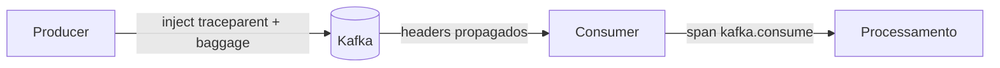
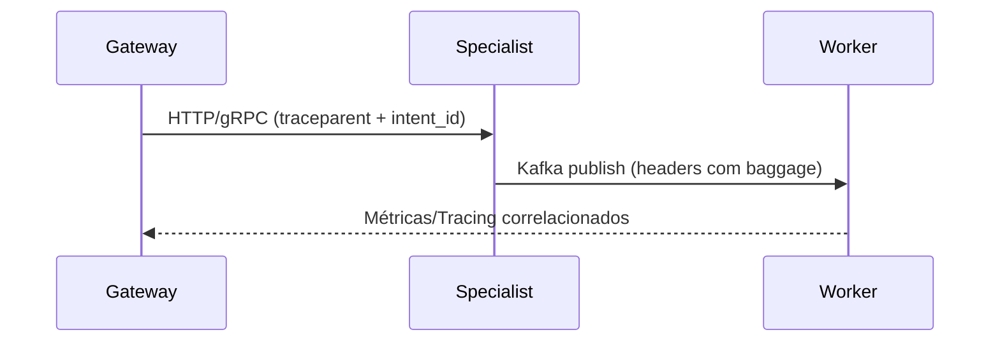

# Neural Hive-Mind Service Health Check Templates

This directory contains standardized templates for implementing health checks across all Neural Hive-Mind services.

## Overview

All Neural Hive-Mind services should implement consistent health check patterns for:
- Kubernetes liveness probes (`/health`)
- Kubernetes readiness probes (`/ready`)
- Component-specific health checks (`/health/{component}`)
- Prometheus metrics integration
- Centralized logging

## Usage

### 1. Basic Setup

```python
from fastapi import FastAPI
from neural_hive_observability.templates.service_health_template import ServiceHealthManager, setup_health_endpoints

app = FastAPI()

# Initialize health manager
health_manager = ServiceHealthManager(
    service_name="your-service-name",
    component="your-component",  # gateway, processor, orchestrator, etc.
    layer="your-layer",         # experiencia, cognicao, orquestracao, etc.
    version="1.0.0"
)

# Add health checks for your components
health_manager.add_redis_check(your_redis_client)
health_manager.add_kafka_check(lambda: your_kafka_producer.is_ready())
health_manager.add_custom_check("custom_component", lambda: check_custom_health())

# Mark as initialized
health_manager.mark_initialized()

# Setup standardized endpoints
setup_health_endpoints(app, health_manager, critical_checks=["redis", "kafka"])
```

### 2. Service-Specific Examples

#### Gateway Service
```python
from neural_hive_observability.templates.service_health_template import setup_gateway_health

health_manager = setup_gateway_health(
    app,
    redis_client=redis_client,
    kafka_producer=kafka_producer,
    asr_pipeline=asr_pipeline,
    nlu_pipeline=nlu_pipeline,
    oauth2_validator=oauth2_validator
)
```

#### Processor Service
```python
from neural_hive_observability.templates.service_health_template import setup_processor_health

health_manager = setup_processor_health(
    app,
    database_conn=database_connection,
    message_queue=message_queue
)
```

## Health Check Types

### 1. Liveness Probe (`/health`)
- Returns overall service health status
- Includes all component statuses and details
- HTTP status codes:
  - `200`: Service is healthy or degraded
  - `503`: Service is unhealthy

### 2. Readiness Probe (`/ready`)
- Checks if service is ready to accept traffic
- Only checks critical components
- HTTP status codes:
  - `200`: Service is ready
  - `503`: Service is not ready

### 3. Component Health (`/health/{component}`)
- Check specific component health
- Returns detailed component information
- HTTP status codes:
  - `200`: Component is healthy
  - `404`: Component not found
  - `503`: Component is unhealthy

## Response Formats

### Health Response
```json
{
  "status": "healthy|degraded|unhealthy",
  "timestamp": "2023-09-26T10:30:00.000Z",
  "version": "1.0.0",
  "service_name": "gateway-intencoes",
  "neural_hive_component": "gateway",
  "neural_hive_layer": "experiencia",
  "components": {
    "redis": {
      "status": "healthy",
      "message": "Redis connection OK",
      "duration_seconds": 0.002,
      "timestamp": 1695721800.123,
      "details": {}
    },
    "kafka": {
      "status": "healthy",
      "message": "Kafka producer ready",
      "duration_seconds": 0.001,
      "timestamp": 1695721800.124,
      "details": {}
    }
  }
}
```

### Readiness Response
```json
{
  "status": "ready|not_ready",
  "timestamp": "2023-09-26T10:30:00.000Z",
  "service_name": "gateway-intencoes",
  "neural_hive_component": "gateway"
}
```

## Kubernetes Integration

### Deployment Configuration
```yaml
apiVersion: apps/v1
kind: Deployment
metadata:
  name: your-service
spec:
  template:
    spec:
      containers:
      - name: your-service
        ports:
        - containerPort: 8000
        livenessProbe:
          httpGet:
            path: /health
            port: 8000
          initialDelaySeconds: 30
          periodSeconds: 10
          timeoutSeconds: 5
          failureThreshold: 3
        readinessProbe:
          httpGet:
            path: /ready
            port: 8000
          initialDelaySeconds: 5
          periodSeconds: 5
          timeoutSeconds: 3
          successThreshold: 1
          failureThreshold: 3
```

## Neural Hive-Mind Standards

### Component Types
- `gateway`: API gateways and entry points
- `processor`: Data and intent processors
- `orchestrator`: Workflow orchestrators
- `storage`: Storage services
- `ml-model`: Machine learning models

### Layer Types
- `experiencia`: User experience layer
- `cognicao`: Cognitive processing layer
- `orquestracao`: Orchestration layer
- `dados`: Data layer
- `observabilidade`: Observability layer
- `resiliencia`: Resilience layer

### Metrics Integration
Health checks automatically expose metrics to Prometheus:
- `neural_hive_health_check_status`: Component health status (0/1)
- `neural_hive_health_check_duration_seconds`: Health check duration
- `neural_hive_health_check_total`: Total health checks performed

### Correlation Context
Health checks are automatically traced and correlated with:
- Service name and version
- Neural Hive component and layer
- Request correlation IDs when available

## Best Practices

1. **Always use the standardized templates** for consistency
2. **Define critical components** for readiness probes carefully
3. **Keep health checks fast** (< 1 second per check)
4. **Implement proper timeouts** for external dependencies
5. **Log health check failures** for debugging
6. **Use appropriate HTTP status codes** for Kubernetes
7. **Include meaningful error messages** in responses
8. **Test health checks** in your CI/CD pipeline
9. **Monitor health check metrics** in production
10. **Update health checks** when adding new dependencies

## gRPC Instrumentation

Instrumentação automática de servidores gRPC com enriquecimento de spans e propagação de baggage.

### Inicialização com servidor instrumentado
```python
from neural_hive_observability import (
    init_observability,
    create_instrumented_grpc_server,
    extract_grpc_context,
    trace_grpc_method,
    get_config,
)
from opentelemetry.context import detach
from specialist_pb2_grpc import add_SpecialistServiceServicer_to_server


class SpecialistService:
    @trace_grpc_method(include_request=True, include_response=True)
    def EvaluatePlan(self, request, context):
        # Baggage extraído automaticamente do metadata
        correlation, token = extract_grpc_context(context)
        try:
            return {"status": "ok", "intent_id": correlation.get("intent_id")}
        finally:
            if token:
                detach(token)


def serve():
    init_observability(
        service_name="specialist-service",
        neural_hive_component="specialist",
        neural_hive_layer="cognicao",
    )
    server = create_instrumented_grpc_server(get_config(), max_workers=10)
    add_SpecialistServiceServicer_to_server(SpecialistService(), server)
    server.add_insecure_port("[::]:50051")
    server.start()
    server.wait_for_termination()
```

### Decorator @trace_grpc_method
- Cria span `{component}.grpc.{method}` automaticamente.
- Enriquecimento: `neural.hive.component`, `neural.hive.layer`, `neural.hive.grpc.service`, `neural.hive.grpc.method`.
- Extrai `intent_id`/`plan_id` do request ou metadata e propaga com baggage.
- Opcional: registra request/response (útil para debugging controlado).

### Extração de contexto
```python
def EvaluatePlan(self, request, context):
    metadata_ctx, token = extract_grpc_context(context)
    try:
        intent_id = metadata_ctx.get("intent_id")
        # continuar processamento...
    finally:
        if token:
            detach(token)
```

### Atributos de span gRPC
| Atributo | Descrição |
|----------|-----------|
| `neural.hive.grpc.service` | Nome do serviço gRPC |
| `neural.hive.grpc.method` | Nome do método gRPC |
| `neural.hive.intent.id` | ID da intenção propagada |
| `neural.hive.plan.id` | ID do plano propagado |
| `neural.hive.user.id` | ID do usuário (quando presente) |
| `neural.hive.component` | Componente Neural Hive |
| `neural.hive.layer` | Camada Neural Hive |

### Boas práticas gRPC
- Propague `intent_id` e `plan_id` via metadata (`x-neural-hive-intent-id`, `x-neural-hive-plan-id`).
- Use `trace_grpc_method` nos servicers para padronizar spans.
- Centralize interceptors adicionando `NeuralHiveGrpcServerInterceptor` em todos os servidores.
- Registre erros via `span.record_exception(e)` para correlação rápida.
- Stack mínima OpenTelemetry consolidada: `opentelemetry-{api,sdk,exporter-otlp-proto-grpc}>=1.21.0`, `opentelemetry-instrumentation>=0.42b0`, `opentelemetry-instrumentation-grpc>=0.42b0` e `grpcio>=1.59.0`.

## Kafka Instrumentation

Wrappers para producers/consumers com injeção e extração de contexto em headers.

### Producer confluent-kafka
```python
from confluent_kafka import Producer
from neural_hive_observability import init_observability, instrument_kafka_producer, get_config
from neural_hive_observability.tracing import correlation_context

init_observability(service_name="gateway", neural_hive_component="gateway", neural_hive_layer="experiencia")
producer = instrument_kafka_producer(Producer({"bootstrap.servers": "localhost:9092"}), config=get_config())

with correlation_context(intent_id="intent-123", plan_id="plan-456"):
    producer.produce("neural.intentions", key=b"intent-123", value=b"payload")
    producer.flush()
```

### Consumer aiokafka
```python
import asyncio
from aiokafka import AIOKafkaConsumer
from neural_hive_observability import instrument_kafka_consumer, get_config

async def consume():
    consumer = instrument_kafka_consumer(
        AIOKafkaConsumer("neural.intentions", bootstrap_servers="localhost:9092", group_id="demo"),
        config=get_config(),
    )
    await consumer.start()
    async for msg in consumer:
        print(msg.value)
```

### Headers Kafka adicionados
| Header | Origem |
|--------|--------|
| `traceparent` / `tracestate` | `opentelemetry.propagate.inject` |
| `x-neural-hive-intent-id` | Baggage `neural.hive.intent.id` |
| `x-neural-hive-plan-id` | Baggage `neural.hive.plan.id` |
| `x-neural-hive-user-id` | Baggage `neural.hive.user.id` |
| `x-neural-hive-trace-id` | Trace ID corrente |
| `x-neural-hive-span-id` | Span ID corrente |

### Atributos de span Kafka
| Atributo | Descrição |
|----------|-----------|
| `messaging.system` | Sistema de mensageria (`kafka`) |
| `messaging.destination` | Tópico de destino (producer) |
| `messaging.source` | Tópico de origem (consumer) |
| `messaging.kafka.partition` | Partição Kafka |
| `messaging.kafka.offset` | Offset da mensagem |
| `messaging.kafka.consumer_group` | Grupo consumidor |
| `neural.hive.intent.id` | ID da intenção |
| `neural.hive.plan.id` | ID do plano |

### Fluxo de contexto Kafka


## Context Propagation Patterns

Padrões recomendados para manter intent_id/plan_id e trace context entre serviços.

### Diagramas


### Padrões comuns
- HTTP → gRPC: use `inject_context_to_headers` antes da chamada HTTP e `extract_grpc_context` no servicer.
- HTTP → Kafka: injete headers com `instrument_kafka_producer` ou `ContextManager.inject_kafka_headers`.
- gRPC → Kafka: combine `trace_grpc_method` (baggage ativo) com `instrument_kafka_producer`.

### Exemplo de correlação end-to-end
1. Gateway recebe requisição com `intent_id=abc` e cria span raiz.
2. Chamada gRPC para Specialist propaga metadata; interceptor define baggage.
3. Specialist publica evento Kafka; wrapper adiciona headers com `intent_id` e `traceparent`.
4. Consumer aiokafka extrai contexto; spans de consumo/processing mantêm o mesmo trace.

### Troubleshooting de propagação
- Confirme presença de `traceparent` e `x-neural-hive-intent-id` nos headers em trânsito.
- Verifique se `init_observability` foi chamado antes de criar producers/consumers/servidores gRPC.
- Em ambientes assíncronos, garanta que o contexto esteja ativo no loop (use os wrappers fornecidos).
