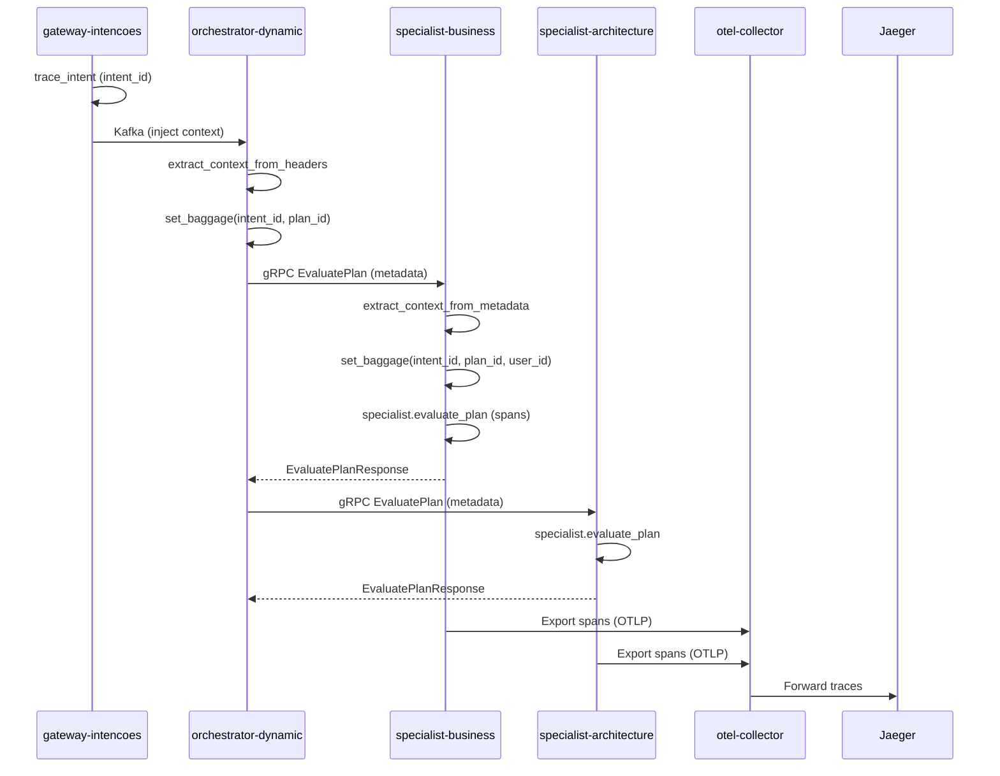

# Tracing nos Specialists

## Visão Geral
- Tracing habilitado por padrão (`ENABLE_TRACING=true`) via Helm/Values.
- Instrumentação centralizada com `neural_hive_observability` exportando spans via OTLP para o collector.
- gRPC já instrumentado; baggage (intent_id, plan_id, user_id) é propagado nos specialists.

## Spans Customizados

| Span Name | Descrição | Atributos Principais |
|-----------|-----------|----------------------|
| `specialist.evaluate_plan` | Span raiz da avaliação | `specialist.type`, `plan.id`, `intent.id` |
| `specialist.load_model` | Carregamento do modelo ML | `model.name`, `model.stage`, `model.version`, `loading.time_ms` |
| `specialist.deserialize_plan` | Deserialização do plano | `plan.version` |
| `specialist.check_cache` | Verificação de cache | `cache.hit`, `cache.key` |
| `specialist.predict_with_model` | Inferência ML | `model.version`, `inference.time_ms` |
| `specialist.extract_features` | Extração de features | `features.count`, `extraction.time_ms` |
| `specialist.drift_detection` | Detecção/monitoramento de drift | `drift.detected`, `drift.psi_score`, `drift.threshold` |
| `specialist.semantic_pipeline` | Fallback semântico | `inference.source=semantic_pipeline` |
| `specialist.heuristics` | Fallback heurístico | `inference.source=heuristics` |
| `specialist.validate_result` | Validação do resultado | - |
| `specialist.generate_explainability` | Geração de explicabilidade | `explainability.method`, `explainability.token` |
| `specialist.persist_to_ledger` | Persistência no ledger | `opinion.id`, `ledger.buffered` |
| `specialist.cache_result` | Salvamento em cache | `cache.saved` |
| `specialist.warmup` | Warmup do serviço | `warmup.success`, `warmup.time_ms`, `warmup.dummy_plan_id` |

## Atributos de Baggage
- `neural.hive.intent.id`: ID da intenção original (propagado desde gateway-intencoes).
- `neural.hive.plan.id`: ID do plano cognitivo (propagado desde orchestrator-dynamic).
- `neural.hive.user.id`: ID do usuário (propagado desde gateway-intencoes).

## Queries Jaeger Úteis
```
# Traces de um plano específico
neural.hive.plan.id="plan-abc-123"

# Traces com alta latência (>5s)
specialist.evaluate_plan duration:>5s

# Traces com erros
error=true service=specialist-business

# Traces com baixa confiança
opinion.confidence_score:<0.7

# Traces usando fallback semântico
inference.source=semantic_pipeline

# Traces com drift detectado
drift.detected=true
```

## Troubleshooting
- Traces não aparecem no Jaeger: verifique `ENABLE_TRACING=true` e `OTEL_EXPORTER_OTLP_ENDPOINT` nos logs de startup.
- Baggage não propagado: confirme headers gRPC (`x-neural-hive-intent-id`, `x-neural-hive-plan-id`, `x-neural-hive-user-id`) no orchestrator.
- Spans incompletos: veja exceções nos logs; spans com erro marcam `error=true`.

## Fluxo de Traces

